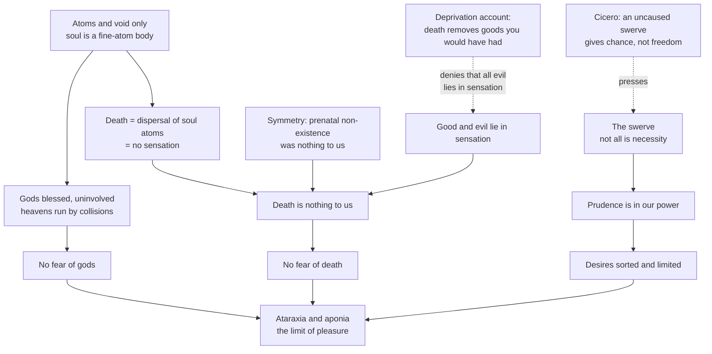

# Ancient & Medieval Philosophy · Lesson 4.1: Epicurus: atoms, the swerve, and death

> ⏱ ~15 min · Module 4: The Hellenistic schools and Plotinus · Builds on: [1.2 Zeno and the atomists](01-02-zeno-and-the-atomists.md) · Unlocks: [4.2 The Stoics: *logos*, fate and virtue](04-02-the-stoics-logos-fate-and-virtue.md)

## Why this matters

After Aristotle, the question changed from "what is being?" to "how do I live without fear?" Epicurus (341–270 BC), teaching in a garden outside Athens, gave the boldest answer: study atoms. His claim is that the physics of [1.2](01-02-zeno-and-the-atomists.md), revised, is a *medicine*: it removes the fear of the gods and the fear of death, and what remains when fear is gone is the happiest life a human can have. This lesson is about why he thought physics could do ethical work at all.

## The idea

Epicurus thinks most human misery is self-inflicted, and it has three sources.

1. **We fear the gods.** We think thunder is punishment and someone is keeping score.
2. **We fear death.** We picture ourselves suffering in it, or lying cold in the ground.
3. **We want the wrong things, without limit.** Fame, luxury and wealth have no natural stopping point, so the chase never ends.

The cure for the first two is knowing what the world is made of. If everything, souls included, is atoms moving in void, then the heavens run by collisions and not by divine moods, and at death the atoms of the soul disperse and there is no one left to be harmed. The cure for the third is knowing what pleasure is. Pleasure has a ceiling, and the ceiling is low and cheap to reach: no pain in the body (*aponia*) and no turmoil in the soul (*ataraxia*).

A later Epicurean summary, preserved in a papyrus of Philodemus and nicknamed the *tetrapharmakos* ("four-part remedy"), puts the whole system in four lines. Paraphrased: god is nothing to fear; death is nothing to worry about; the good is easy to get; the terrible is easy to endure.

Epicurus says outright that this is what physics is *for*. If we were never troubled by the heavens, by the thought that death concerns us, or by not knowing the limits of pains and desires, we would have no need to study nature (*Principal Doctrines* 11, paraphrased; the *Principal Doctrines*, or PD, are preserved in Diogenes Laertius X.139–154). Physics, unlike Aristotle's, is therapy.

**What Epicurus changed in Democritus.** The atoms and void of Leucippus and Democritus stay, along with "nothing comes to be from what is not" (*Letter to Herodotus*, DL X.38–39). Three revisions matter here, and a fourth, the swerve, gets its own paragraph:

- **Weight.** Atoms have size, shape and weight, and weight makes them move. Later reports credit weight to Epicurus rather than Democritus, though the testimony is not unanimous.
- **Limited variety.** The number of atoms is unlimited, but their shapes, though too many to count, are not infinite (DL X.42).
- **Perception.** Democritus had said that sweet, bitter and colour exist "by convention" (DK B9). Epicurus resists the sceptical drift. In his *Canon*, as Diogenes Laertius reports it (X.31–32), sensations are criteria of truth and *all perceptions are true*. That does not mean things are as they look: a perception is the effect of thin films of atoms striking the organ, and it faithfully registers what arrived. Error enters only with the *opinion we add* (DL X.50–51). Lucretius's example is a square tower that looks round from far away (*On the Nature of Things*, Book IV). The roundness truly arrived, its corners worn off in transit; the mistake is judging the tower round.

**The swerve (*clinamen*).** Epicurus's surviving letters never mention it. We know it from the Latin poem *On the Nature of Things* by Lucretius (c. 99–c. 55 BC), and from hostile reports in Cicero. Lucretius (II.216–293, paraphrased) says atoms falling through the void by their own weight veer very slightly from a straight path, at no fixed time and no fixed place, "only just" enough to call it a change of direction. The swerve does two jobs:

- **Cosmogony.** In the void all atoms fall at equal speed (DL X.61). Without deviation they would fall forever in parallel like raindrops, and no world would form.
- **Freedom.** If every motion came from an earlier one in a fixed order from infinite time, nothing would break what Lucretius calls the decrees of fate. Yet animals move where their will leads (II.251–260, paraphrased). The swerve is the break in the chain.

Epicurus's motive is ethical here too. He says it would be better to believe the myths about the gods than to be a slave to the "destiny" of the natural philosophers (*Letter to Menoeceus*, DL X.134, paraphrased). How a random swerve yields responsibility rather than randomness was contested from Cicero on. Modern readers split over whether a swerve occurs in each free act or only somewhere in the soul's history (David Furley's alternative, *Two Studies in the Greek Atomists*, 1967). The crux with the Stoics is [4.2](04-02-the-stoics-logos-fate-and-virtue.md)'s.

**The gods.** Epicurus is not an atheist. Gods exist, and our common conception of them as blessed and imperishable is evident (*Menoeceus*, DL X.123). That conception is exactly why they do nothing: "A blessed and eternal being has no trouble himself and brings no trouble upon any other being" (PD 1, Hicks).

## The argument

**From physics to tranquillity** (reconstructed from the *Letter to Menoeceus*, DL X.122–135, the *Letter to Herodotus* and PD 1–3 and 11).

1. **The end of life is pleasure, and the limit of pleasure is the removal of all pain** (PD 3; *Menoeceus* 128). *In words:* once you are free of bodily pain and mental turmoil, you are as well off as a human can be.
2. **The greatest turmoils of the soul come from false beliefs about the gods, about death and about the limits of desire** (PD 10–11). *In words:* what wrecks tranquillity is mostly opinion, not circumstance.
3. **Everything that exists is bodies and void, and bodies are compounds of atoms** (DL X.39–41). *In words:* there is no third kind of thing, souls and gods included.
4. **The heavens are explained by atoms in motion, and a blessed being neither suffers trouble nor causes it** (PD 1; *Letter to Pythocles*). *In words:* the sky is not a message, and the gods have no reason to punish.
5. **All good and evil lie in sensation, and death is the privation of sensation** (*Menoeceus* 124), since the soul is a body of fine atoms that disperses when the whole person breaks apart (DL X.63–65). *In words:* at death nothing is left that could feel anything.
6. **So death is nothing to us:** "when we are, death is not come, and, when death is come, we are not" (*Menoeceus* 125, Hicks). *In words:* you and your death never meet.
7. **What causes no pain when present causes only empty pain in anticipation** (*Menoeceus* 125). *In words:* dreading a thing that cannot hurt you is a mistake, not a prudent precaution.
8. **Not everything happens by necessity, because atoms swerve** (Lucretius II). *In words:* your choices are yours to make, so the prudence that orders your desires is in your power.
9. **Therefore the study of nature, joined to prudent reckoning of desires, removes the chief causes of turmoil, and it is needed for no other purpose** (PD 11–12). *In words:* physics is the medicine, and tranquillity is the health it restores.

**Lucretius's symmetry argument** (*On the Nature of Things* III, around lines 830–842 and 972–977, paraphrased) adds a second route to premise 6. Before we were born, through all the ages when Carthage and Rome fought, we felt nothing and nothing troubled us. The time after death is a mirror nature holds up to us of that earlier time. So nothing in it is fearful. *In words:* you do not grieve that you did not exist in 1500, so there is nothing to grieve in not existing in 2500.

## Argument map

Solid arrows run from physics to the tranquillity it is supposed to secure. Dashed edges are the two pressure points pressed hardest since; neither is settled here.

## Worked examples

**Example 1 (clean): the man who pities his corpse.** Lucretius describes a man who says he believes death ends everything, yet is upset at the thought of his body rotting, being torn by beasts, or burning on the pyre (Book III, paraphrased). Run the argument.

Premise 5 says the soul's atoms scatter too, so no subject of sensation remains to be affected by what happens to the corpse. Lucretius's diagnosis: without noticing it, the man leaves a little of himself standing beside the body, watching and feeling the loss. His fear rests on an opinion he has *added* (a surviving spectator), not on anything his physics allows. Same structure as the round tower: what he truly imagines is a body; the error is judging that someone will be there to mind. The therapy removes the opinion rather than asking him to be brave.

**Example 2 (hard): dying at thirty.** A woman dies suddenly at thirty, halfway through work she loved. Most people say death was bad *for her*: it took forty good years.

Premise 5 denies it: she never experiences the loss. The strongest modern resistance attacks that premise. On the deprivation account (Thomas Nagel, "Death", 1970, paraphrased), something can be bad for you without being felt, just as being betrayed behind your back is. Death is bad because of the goods it removes. "All good and evil lie in sensation" is then the experience requirement from [`ethics` 1.2](../../ethics/lessons/01-02-what-is-good-for-a-person.md), and the argument stands or falls with it.

Nagel also suggests a reply to symmetry: you could not have been born much earlier and still be *you*, but you could have died much later, so the two stretches of non-existence are not alike in what they deprive you of.

The Epicurean has a resource of his own, and it is easy to miss. The deprivation account assumes that more time means more good. Epicurus denies that: once pain is removed, pleasure cannot be increased, only varied (PD 18), and unlimited time contains no greater pleasure than limited time for someone who measures pleasure's limits by reason (PD 19–20). A life that has reached *ataraxia* is complete at any length. So the case turns on the theory of pleasure as much as on the death argument. Whether death is bad for the one who dies is argued in contemporary ethics and metaphysics, not here.

## Watch out

- **You might think "Epicurean" means gourmet.** That is the anachronism in the modern word "epicure". The ancient slander that he was a glutton is one he answers directly (*Menoeceus* 131, below).
- **You might think *ataraxia* is emotional numbness, a zero point.** For Epicurus, freedom from pain and turmoil is itself a pleasure, the stable or *katastematic* kind, in contrast with the *kinetic* pleasures of joy and delight (DL X.136). Calling it "mere absence" is the reading his critics, above all Cicero, pressed against him. It is not his own.
- **You might think the swerve anticipates quantum indeterminacy.** It is a thesis about the motion of indivisible bodies, argued from the fact of voluntary motion and the need for collisions, with no measurement and no probability law.
- **You might think "all perceptions are true" means the tower really is round.** The claim is about what the perception registers. The judgment about the tower is opinion, and opinion can be false.

## One-liner

> Epicurus made atoms into medicine: a world of bodies and void has no angry gods, a dispersed soul has no one left to fear death, a slight swerve keeps our choices our own, and the pleasure left over is simply the absence of pain.

## Problems

**P1 (🟢) *(Exegetical.)*** *Letter to Menoeceus*, DL X.131–132 (Hicks, 1925):

> When we say, then, that pleasure is the end and aim, we do not mean the pleasures of the prodigal or the pleasures of sensuality, as we are understood to do by some through ignorance, prejudice, or wilful misrepresentation. By pleasure we mean the absence of pain in the body and of trouble in the soul. It is not an unbroken succession of drinking-bouts and of revelry, not sexual lust, not the enjoyment of the fish and other delicacies of a luxurious table, which produce a pleasant life; it is sober reasoning, searching out the grounds of every choice and avoidance, and banishing those beliefs through which the greatest tumults take possession of the soul.

(a) Which misreading of Epicurus does the passage reject, and which words say how that misreading arose? (b) Reader A says the passage makes sober reasoning *itself* the pleasant life. Reader B says reasoning is the *means* that produces it. Which reading do the passage's words support, and which words decide it? (c) Does this passage alone show that the absence of pain is a positive pleasure rather than a neutral zero? Say what else in the corpus you would need. 150 words or fewer in total.

**P2 (🟡) *(Exegetical (a) · Evaluative (b).)*** Epicurus sorts desires into natural and necessary, natural but not necessary, and neither natural nor necessary, the last arising from "illusory opinion" (*Menoeceus*, DL X.127; PD 29). (a) Classify each desire and name the test you used, citing PD 15, 26 or 30 where relevant. (i) Bread and water after a day's walk. (ii) A tasting menu at a famous restaurant. (iii) A statue of yourself in the town square. (iv) Savings "without limit, so I can never go hungry." One line each. (b) Epicurus calls friendship the greatest of the things wisdom provides for a blessed life (PD 27), yet he also ties it to security (PD 28). Place the desire for a close friend in the three-way scheme, and say where the scheme stops fixing an answer. Any verdict. 150 words or fewer for (b).

**P3 (🔴, optional) *(Exegetical.)*** The paragraph below is from an invented wellness column. Name two things it borrows faithfully from Epicurus, and three places where it departs from him, citing the text for each. 150 words or fewer.

> "Stop chasing highs. Every peak is followed by a crash, so the wise person turns pleasure down to zero and learns to live on the flat line: no joy, no pain, just nothing. Eat plain rice forever, and at your best friend's wedding, refuse the cake, because the discipline is the point. Trim your friendships while you are at it, since every attachment is a future grief. And stop reading omens into the news or the night sky. The universe is atoms and blind chance, and nobody up there is keeping score."

Solutions

**P1** *(Exegetical — strict.)*

**Must hit, strict:**
- **(a)** It rejects the reading that Epicurean pleasure means the pleasures of "the prodigal" and "sensuality": drinking-bouts, sex, luxurious food. It says the misreading arose "through ignorance, prejudice, or wilful misrepresentation". In other words, some misread him innocently and some did so on purpose.
- **(b)** Reader B. The grammar is causal: sober reasoning is what "produce[s] a pleasant life", and it does so by "searching out the grounds of every choice and avoidance" and "banishing those beliefs" that cause tumult. Reasoning removes the causes of disturbance, so the pleasant life is what results. (DL X.132 goes on to call prudence the "beginning" of all this, which fits.)
- **(c)** No. The passage *identifies* pleasure with "the absence of pain … and of trouble", but it does not say whether that absence is a felt, positive state. For that you need the kinetic/katastematic distinction (DL X.136) and PD 3 and 18: removing pain is the limit of pleasure, after which pleasure is varied, not increased.

**Wrong turns:** choosing Reader A because reasoning is contrasted with the drinking-bouts, which misses "which produce"; answering (c) "yes" from the word "mean". Defining a word is not the same as describing the state it names.

**Model answer:** (a) The reading that his pleasure is the prodigal's sensual pleasure. The misreading comes "through ignorance, prejudice, or wilful misrepresentation". (b) B: reasoning "produce[s]" the pleasant life by searching out grounds of choice and "banishing" the beliefs that cause tumult. It is instrumental. (c) No. The passage equates pleasure with absence of pain, but the claim that this absence is a positive, katastematic pleasure needs DL X.136 and PD 3 and 18.

---

**P2** *(Exegetical (a) · Evaluative (b).)*

**Must hit, strict (a):**
- **(i)** Natural and necessary. Unmet, it brings real pain, and it is easy to satisfy.
- **(ii)** Natural but not necessary. Hunger is natural, but this only *varies* a pleasure once want is removed, and going without it causes no pain (PD 26; PD 18 on variation).
- **(iii)** Neither natural nor necessary: vain, from empty opinion. A later note on PD 29 in the manuscripts gives crowns and statues as its examples. Credit a correct classification without that note.
- **(iv)** Vain as stated. It grows out of a natural and necessary desire (food), but the wealth nature requires is limited and easy to get, while the wealth of vain ideals "extends to infinity" (PD 15). The "without limit" does the classifying.
- **The tests:** does leaving it unmet bring pain (PD 26)? Is it grounded in nature or in opinion, and is it limited (PD 15, 30)?

**Must hit, any verdict (b):**
- Apply the tests: whether lacking a friend brings pain, and whether the desire has a natural limit.
- Name the tension. If friendship is prized for security (PD 28), it looks like a means to natural and necessary goods. PD 27 ranks it above other means, and *Menoeceus* 127 allows desires "necessary if we are to be happy". The scheme classifies by the relation between a desire and pain, not by whether friendship is valued for itself, so on that question it is silent.
- A verdict, with the step that decides it.

**Wrong turns:** putting (ii) under vain because it is luxurious (Epicurus allows occasional luxury; *Menoeceus* 130); putting (iv) under natural and necessary because its object is food; in (b), asserting a verdict without using the pain test.

**Model answer (b), one of several:** On the pain test, lacking any friend is a real and lasting distress. Friendship supplies the security without which *ataraxia* is fragile (PD 28), so it counts as necessary "if we are to be happy" (*Menoeceus* 127) rather than as a luxury. The desire is also naturally limited: a few trusted friends satisfy it, whereas "popularity" does not. So I place it as natural and necessary. What the scheme cannot settle is whether the friend is wanted *for* security or for herself. The classification sorts desires by how they relate to pain and limits, not by the structure of their objects, so it fits an instrumental reading and a non-instrumental one equally well. That is why later Epicureans, as Cicero reports in *On Ends* I, offered more than one account of friendship.

---

**P3** *(Exegetical — strict.)*

**Must hit, strict:**
- **Faithful (any two):** intense, "peak" kinetic pleasures are often not worth choosing because of what follows (*Menoeceus* 129); simple food (*Menoeceus* 130–131); no omens in the sky, since the heavens are explained by atoms (PD 11); gods do not punish (PD 1).
- **Departure 1:** "turn pleasure down to zero … just nothing." For Epicurus the absence of pain *is* pleasure, its limit (PD 3; katastematic pleasure, DL X.136). He does not aim at a neutral flat line.
- **Departure 2:** "the discipline is the point." Every pleasure is good by nature, though not every one is worth choosing (*Menoeceus* 129). Simple fare is valued because it is easy to get and healthy, and because it makes an occasional luxury more enjoyable (*Menoeceus* 130–131). Austerity for its own sake belongs to other schools. Refusing the cake at a wedding is not required.
- **Departure 3:** "trim your friendships." Friendship is the greatest of wisdom's provisions for happiness (PD 27–28).
- **Also creditable:** "blind chance." Epicurus does not deify chance (*Menoeceus* 134). His swerve serves to deny necessity, not to hand the world over to fortune.

**Wrong turns:** calling "nobody up there" atheism, when Epicurus affirms that the gods exist and are blessed (*Menoeceus* 123); calling the column Stoic because of "discipline". The task is to measure it against Epicurus, not to relabel it.

**Model answer:** Borrowed faithfully: peaks often bring worse after them, so they are not always worth choosing (*Menoeceus* 129), and the sky is not a message, since gods neither trouble nor are troubled (PD 1, 11). Departures: (1) The "flat line of nothing" misses that for Epicurus freedom from pain is itself the highest pleasure (PD 3; DL X.136). (2) Austerity is not the point. Every pleasure is good, and plain fare is valued for ease, health and enjoying luxury better when it comes (*Menoeceus* 129–131), so the cake is fine. (3) Cutting friends inverts PD 27, where friendship is wisdom's greatest provision for a blessed life.

## Flashback

**From Lesson 3.5 (Soul and intellect):** *(Diagnose (a) · Exegetical (b).)* A pamphlet from an invented bereavement group reads: "Even Aristotle, no friend of myths, taught that the mind 'alone is immortal and eternal.' The philosopher himself assures us that the one you lost, who laughed at your jokes and remembered every birthday, lives on as the very person you knew." (a) Which reading of *De Anima* III.5 does the pamphlet need about *whose* intellect is immortal, and which words in III.5 tell against the rest of its claim? (b) Grant the pamphlet the most generous reading: the intellect that "makes all things" is a part of each person's own soul. What does II.1's definition still imply about that person's perceiving and imagining after death, and why? Two sentences or fewer per part.

Solution

**Must hit, strict (a):** the pamphlet needs the separable intellect to belong to each individual, not to God (Alexander) or to one separate intellect for everyone (Avicenna's Agent Intellect, Averroes). Against the rest: "we do not remember", because that intellect is impassive while the passive intellect perishes (430a23–25). So what survives is not a person with memories and a past.

**Must hit, strict (b):** perceiving and imagining are powers of the soul as first actuality of an organic body. Each has its organ, as sight is to the eye. With the body gone, there is nothing for them to be the actuality of: a dead body is a body only equivocally, like an eye in stone. So they do not survive, and neither does the stock of images that thought depends on (III.7–8).

**Wrong turns:** treating Aquinas's reading, that each human has his own agent intellect, as if it settled that memories survive. The problem grants that reading, and (b) shows it does not deliver the pamphlet's conclusion from *De Anima* alone. Answering whether anyone in fact survives death: that is not asked.

**Model answer:** (a) The pamphlet needs the immortal intellect to be each person's own, against Alexander's reading (it is God) and the Arabic readings (one separate intellect for all). Even then, III.5 adds "we do not remember", since the passive intellect perishes, so no one survives with the birthdays and the jokes. (b) Perception and imagination are powers of an organic body, as sight is the eye's, and a soul is the first actuality of that body. Without the body those powers have nothing to be the actuality of, so whatever survives would perceive and picture nothing.

## Connections

- **Backward:** the atoms and void are Leucippus and Democritus's answer to Parmenides from [1.2](01-02-zeno-and-the-atomists.md), with weight, limited shapes, true perceptions and the swerve added. "Nothing comes from nothing" is Parmenides' premise, which Epicurus kept. The tower that looks round is the ancient ancestor of the appearance/reality problem Plato used to motivate the Forms in [2.1](02-01-the-forms-and-what-goes-wrong-with-them.md), answered here in the opposite direction.
- **Forward:** [4.2](04-02-the-stoics-logos-fate-and-virtue.md) gives the Stoic rival: a cosmos run by providence and fate, where Chrysippus's cylinder keeps responsibility without any swerve. Module 4's boss problem reconstructs the death argument, names the swerve–cylinder crux, and asks whether this ethics survives without this physics. [4.3](04-03-the-skeptics.md) turns "all perceptions are true" and the Stoic criterion into targets.
- **Sideways:** premise 5's "all good and evil lie in sensation" is the experience requirement that the experience machine tests in [`ethics` 1.2](../../ethics/lessons/01-02-what-is-good-for-a-person.md), so the fate of hedonism about well-being and the fate of the death argument are linked. The swerve is often read as an early libertarian move, and the luck objection in [`metaphysics` 6.4](../../metaphysics/lessons/06-04-libertarianism-and-its-critics.md) has a close ancestor in Cicero's complaint. The consequence argument in [6.1](../../metaphysics/lessons/06-01-determinism-and-the-consequence-argument.md) is the "decrees of fate" Lucretius wanted to break.
