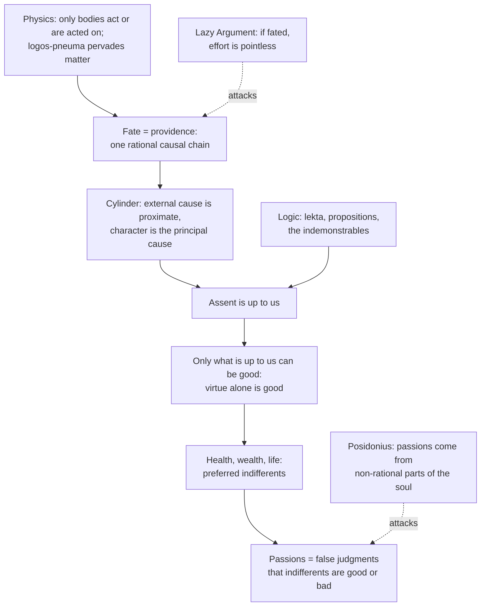

# Ancient & Medieval Philosophy · Lesson 4.2: The Stoics: *logos*, fate and virtue

> ⏱ ~15 min · Module 4: The Hellenistic schools and Plotinus · Builds on: [4.1 Epicurus: atoms, the swerve, and death](04-01-epicurus-atoms-the-swerve-and-death.md), [1.1 Heraclitus and Parmenides](01-01-heraclitus-and-parmenides.md) · Unlocks: [4.3 The Skeptics](04-03-the-skeptics.md)

## Why this matters

Epicurus offered peace through a universe of accidents. The Stoa offered it through a universe with no accidents at all: one rational, living, bodily cosmos in which everything is fated. From that the Stoics derived that nothing outside your own judgment is good or bad, which sounds like the least livable ethics ever proposed. It also bequeathed three things this course keeps meeting: a compatibilist account of responsibility under fate, the first propositional logic, and a theory of emotions as judgments.

## The idea

Diogenes Laertius (VII.40) reports that the Stoics pictured philosophy as a fertile field. Logic is the wall, physics the soil and trees, ethics the fruit. Stoic ethics is meant to *follow from* what the world is.

**The world.** Zeno of Citium founded the school around 300 BC in the Painted Stoa at Athens. Cleanthes succeeded him, and Chrysippus (c. 280–206 BC) systematized it so thoroughly that an ancient quip ran "no Chrysippus, no Stoa." For all three, only bodies *exist*, because only bodies can act or be acted on, a criterion borrowed from Plato's *Sophist* and turned against Plato. Some real things are not bodies and merely *subsist*: void, place, time, and the *lekta*, "sayables," the meanings of sentences. Everything else has two principles, both bodily. There is passive, unqualified matter, and an active principle the Stoics call god, *logos* (reason) and *pneuma* ("breath," a blend of fire and air). *Pneuma* pervades matter the way heat pervades iron, and its *tension* (*tonos*) holds each thing together. At low tension it gives a stone its cohesion; higher, a plant its nature; higher still, an animal its soul and a human being its reason. The cosmos is a single rational animal. It periodically dissolves into fire (the conflagration) and is reborn in the same order. Heraclitus's fire and *logos* (1.1) are its acknowledged ancestors.

**Fate.** If reason pervades everything, nothing happens without a cause, and the causes form one unbroken chain. That chain is *fate* (*heimarmene*); the same order, seen as rational and benevolent, is *providence* (*pronoia*).

**What is up to us.** Then where is responsibility? Chrysippus answers that what happens *through* you depends on what kind of thing you are. Epictetus, a freed slave teaching around AD 100, made this the first lesson of his handbook.

**The good.** If the only thing genuinely yours is how you judge and choose, then the only thing that can be genuinely good or bad for you is the condition of that judging and choosing: virtue or vice. Health, wealth, reputation and even life are *indifferent*. They are not worthless, just not *good*. And emotions like grief and terror, which treat those indifferents as goods and evils, rest on a mistake.

## Source

Epictetus, *Enchiridion* 1 (trans. W. A. Oldfather, Loeb, 1928):

> Some things are under our control, while others are not under our control. Under our control are conception, choice, desire, aversion, and, in a word, everything that is our own doing; not under our control are our body, our property, reputation, office, and, in a word, everything that is not our own doing. Furthermore, the things under our control are by nature free, unhindered, and unimpeded; while the things not under our control are weak, servile, subject to hindrance, and not our own.

The body is on the *wrong* side, although you can move your arm. The criterion is not causal influence. It is what can be hindered.

## The argument

**A. Virtue is the only good** (Diogenes Laertius VII.102–103; the pattern goes back to Plato's *Euthydemus*).

1. **The good benefits and does not harm,** as it is the property of heat to heat and not to cool. *In words:* a genuine good cannot make your life worse.
2. **Health and wealth can harm as well as benefit,** depending on how they are used. *In words:* the rich fool and the healthy tyrant are not better off for it.
3. **So health and wealth are not goods,** and sickness and poverty are not evils. They are *indifferents* (*adiaphora*). *In words:* whatever they are, they are not what makes a life go well.
4. **Virtue, the knowledge of how to live and use things, always benefits** and cannot be used badly. *In words:* you cannot misuse wisdom, since misusing something is a failure of wisdom.
5. **So virtue alone is good** and vice alone is bad. *In words:* the only thing that can make your life go well or badly is the state of your own reason.
6. **Yet some indifferents accord with our nature and have "selective value":** the *preferred* indifferents (life, health, wealth, reputation) and their *dispreferred* opposites. *In words:* you should still pick health over sickness, but its loss does not make your life worse.

Premise 6 comes from *oikeiosis*, "appropriation." An animal's first impulse, the Stoics said against Epicurus (4.1), is not toward pleasure but toward preserving its own constitution (DL VII.85). The adult who acquires reason comes to value the rational *order* of those selections more than anything selected (Cicero, *On Ends* III.20–21). The telos is "living in agreement with nature."

**B. The cylinder: fate without excuse** (Cicero, *On Fate* 41–43, reporting Chrysippus).

1. **Everything happens by fate,** through antecedent causes. *In words:* nothing is uncaused.
2. **Causes are of two kinds:** *perfect and principal* causes, and *auxiliary and proximate* ones. *In words:* the trigger of an event is not the same as what mainly explains it.
3. **"By antecedent causes" means by auxiliary and proximate ones,** not by perfect and principal ones. *In words:* fate supplies the triggers, not the whole explanation.
4. **Assent needs an impression to set it off,** but the assent itself comes from the mind's own character. *In words:* the world shows you a cake; *you* judge that eating it is fitting.
5. **So with a cylinder:** whoever pushes it gives it the beginning of its motion, but it rolls because of its own shape. *In words:* a cube pushed the same way would not roll, and the difference lies in the thing, not the push.
6. **So assent is "in our power," though fated,** and praise and blame are fitting. *In words:* your character is the principal cause of what you do, so it is yours.

"Compatibilism" is a modern label. Chrysippus argues about what is *up to us* (*eph' hemin*), not about a faculty of free will.

**C. The passions as judgments** (DL VII.110–116; Cicero, *Tusculan Disputations* III–IV). Zeno defined a passion (*pathos*) as an excessive impulse, disobedient to reason. Chrysippus identified it with a judgment. There are four generic passions: *distress* (belief that a present thing is bad), *pleasure* (that a present thing is good), *fear* (that a future thing is bad) and *appetite* (that a future thing is good). Each adds a second belief: that it is *right* to contract, swell, shrink or reach out. By argument A, all such beliefs about indifferents are false. The sage has three *eupatheiai*, "good feelings," instead: *joy*, *caution* and *wish*. None corresponds to distress, because the sage has nothing bad present to feel it about except vice, which he lacks.

## Argument map

Logic enters because assent is assent to a *lekton*, a proposition. Dashed edges are pressure points from outside the school and from within it.

**Logic in one paragraph.** Aristotle's syllogistic (3.1) relates *terms*: "all men are mortal." Chrysippus's logic relates whole *propositions* joined by connectives, and rests on five "indemonstrable" argument forms, with ordinals serving as variables:

1. If the first, the second; the first; therefore the second.
2. If the first, the second; not the second; therefore not the first.
3. Not both the first and the second; the first; therefore not the second.
4. Either the first or the second; the first; therefore not the second.
5. Either the first or the second; not the first; therefore the second.

Forms 1 and 2 are modus ponens and modus tollens. The "either… or" of forms 4 and 5 is *exclusive*, and Stoic truth-conditions for "if" were themselves debated. Modern propositional logic ([`mathematical-logic` 1.1](../../mathematical-logic/lessons/01-01-syntax-connectives.md)) keeps connectives over whole sentences but fixes each by a truth table.

## Worked examples

**Example 1 (clean: fear before surgery).** Marcus faces a risky operation tomorrow and lies awake terrified. Run the analysis.

- Fear is the judgment that a *future* thing is *bad*, plus the judgment that it is *right to shrink* from it.
- The thing is death or disability, a dispreferred indifferent. So the first judgment is false. On argument A, death cannot make his life go badly; only acting viciously can.
- What is *not* false: that health has selective value, so choosing the surgeon carefully and following instructions is fitting. Stoicism is indifferent to *outcome*, not to *selection*.
- What replaces the fear: *caution* (*eulabeia*), the sage's reasonable avoidance of what really is bad. Here that means avoiding cowardice or dishonesty about the risk, not the operation itself.

The therapy is cognitive: correct the belief and the passion goes with it, because the passion *was* the belief.

**Example 2 (hard: the Lazy Argument).** Cicero (*On Fate* 28–30) reports an argument the Stoics' critics pressed. If it is fated that you recover from this illness, you will recover whether or not you call a doctor. If it is fated that you do not, you will not recover whether or not you call one. One or the other is fated. So calling a doctor is pointless.

Chrysippus's reply, as Cicero reports it, distinguishes *simple* events from *conjoined* or *co-fated* ones (*confatalia*). "Laius will have a son" is not fated to happen whatever Laius does. It is fated *together with* his lying with a woman. The second is not a detour around fate; it is how fate brings the first about.

This is where the system strains. The reply blocks the inference to idleness: the premise "whether or not you call a doctor" misdescribes a conjoined event. But calling the doctor is itself fated. Critics then ask whether anything is left of deliberation except the experience of it. The Stoic answer returns to the cylinder: your deliberating is the principal cause through which the chain runs, so it is not idle even though it is fated. Whether "not idle" is enough for responsibility is not argued here. It is the live compatibilism debate in [`metaphysics` 6.2](../../metaphysics/lessons/06-02-compatibilism.md).

## Watch out

- **Anachronism trap: "stoic" in English means stiff upper lip; Stoic means correct judgment.** The school did not tell you to suppress feelings you have. It held that passions *are* false judgments, which dissolve when corrected, and it kept three good feelings. It also allowed involuntary "first movements," such as flinching or tears, which are not yet assent (Seneca, *On Anger* II.2–4).
- **Fate is not fatalism.** Fatalism says the outcome comes whatever you do. Stoic fate says it comes *through* what you do. The Lazy Argument is the critics' attempt to collapse the two, and co-fatedness is the reply.
- **The Stoic god is not the creator of 7.2.** It is a body, the fiery *pneuma* immanent in the world, and is reborn with each cycle. Reading Aquinas's transcendent, subsistent being into Cleanthes' Zeus is anachronism in the other direction.
- **"Indifferent" does not mean "don't care."** Preferred indifferents have real selective value; a Stoic who ignored her health would fail at selecting according to nature, the very activity virtue consists in.

## One-liner

> One bodily, rational, fated cosmos leaves only your assent up to you, so only the condition of your assent, virtue, is good, and every passion is a mistaken judgment that something else is.

## Problems

**P1 (🟢) *(Exegetical.)*** Using the *Enchiridion* 1 passage in **Source**: (a) Sort each item as "under our control" or "not under our control," citing the word or phrase that decides it: (i) whether my book gets a good review; (ii) my judgment that a bad review would be a disaster; (iii) my recovery from a sprained wrist; (iv) my aversion to criticism. (b) A reader says Epictetus's line is "what I can influence vs what I can't." Which words in the passage tell against that reading, and what criterion do they support instead? 100 words or fewer for (b).

**P2 (🟡) *(Exegetical (a) · Evaluative (b).)*** A Stoic's friend of thirty years has died. She weeps at the funeral and for weeks afterward believes her life is poorer for the loss. (a) Using Chrysippus's analysis, state the two judgments that make up distress in her case, say which of them the Stoic counts false and why (cite argument A's premises), and say what the sage has in place of distress. (b) A critic says: "A theory on which grief for a friend always rests on a false belief has misunderstood love." Can the Stoic resources in this lesson (preferred indifferents, first movements, *eupatheiai*) meet the objection, or not? Any verdict. 150 words or fewer for (b).

**P3 (🔴, optional) *(Exegetical.)*** A student reasons: "If it is fated that I pass the exam, I will pass whether or not I study; if it is fated that I fail, I will fail whether or not I study; so studying is pointless." (a) Put the argument in numbered premises. (b) Name the premise Chrysippus's co-fated reply rejects, and say why. (c) Give an event for which the "whether or not" premise *would* be true on the Stoic view, and say what distinguishes it from passing the exam. 150 words or fewer in total.

Solutions

**P1** *(Exegetical — strict.)*

**Must hit, strict (a):**
- (i) Not under our control: it falls under "reputation" and is "not our own doing."
- (ii) Under our control: it is a "conception," a judgment.
- (iii) Not under our control: it falls under "our body."
- (iv) Under our control: "aversion" is named explicitly.

**Must hit, strict (b):** the body is listed as *not* under our control, though we plainly influence it, so influence is not the criterion. The deciding words are "free, unhindered, and unimpeded" against "subject to hindrance." What is under our control is what nothing external can block: our own judgments and impulses.

**Wrong turns:** classing (iii) as partly under control because physiotherapy helps, which is the influence reading the passage rules out; classing (ii) as not under control because the judgment "just happened." For Epictetus a judgment is exactly what is "our own doing."

**Model answer (b):** The influence reading fails on "our body," which Epictetus places outside our control though we move it daily. The passage's own criterion is in its last sentence: what is ours is "free, unhindered, and unimpeded," what is not is "subject to hindrance." Anything an external cause can block (a limb, a review) is not ours; our conceptions, choices, desires and aversions are.

---

**P2** *(Exegetical (a) · Evaluative (b).)*

**Must hit, strict (a):**
- Judgment 1: something bad is present (the friend's death, and the loss of the friendship). Judgment 2: it is right to be contracted, downcast, at it.
- Judgment 1 is false: a friend's life and company are preferred indifferents, not goods, since things of that kind can harm as well as benefit (premises 1–3). Only vice is bad, and she has lost no virtue (premise 5). Judgment 2 is false because it rests on 1.
- The sage has *no* good feeling corresponding to distress. Joy, caution and wish answer to pleasure, fear and appetite.

**Must hit, any verdict (b):**
- State the objection precisely: love seems to *involve* treating the beloved's life as more than an indifferent.
- Use at least one Stoic resource accurately. Preferred indifferents mean the friend had real selective value. First movements allow the tears. Joy in the friend's virtue, and in having had a virtuous friendship, remains.
- Say whether what the resources allow is *grief*, or something the critic would not count as grief. That is the step that decides the verdict.

**Wrong turns:** saying the Stoic forbids tears (first movements are not passions); saying the sage feels a mild "good distress" (there is no such *eupatheia*); treating (b) as settled by agreeing or disagreeing with Stoicism, without testing the resources.

**Model answer (b), one of several acceptable:** The critic's point is that love means counting the beloved's life as part of one's own good, so losing it must be a harm. The Stoic can grant a lot: the friend had high selective value; tears at the funeral are first movements, not assent; the joy of a friendship in virtue remains, since that virtue was real. What the Stoic cannot grant is that the loss makes her life worse. That is exactly the belief the critic says love requires. So the resources soften the practice (she may weep, remember and honor him) but not the theory. Verdict: the objection lands if love must include that belief, and fails if love can be wholehearted care for someone whose loss one does not count as damage to oneself. The dispute is really over that premise.

---

**P3** *(Exegetical — strict.)*

**Must hit, strict:**
- (a) P1: Either it is fated that I pass or it is fated that I fail. P2: If fated to pass, I pass whether or not I study. P3: If fated to fail, I fail whether or not I study. C: Studying makes no difference, so it is pointless.
- (b) Chrysippus rejects **P2** (and P3). Passing is not a *simple* fated event but a *co-fated* one, fated together with studying. So "whether or not I study" is false: studying is how the fated pass comes about.
- (c) A simple event, fated independently of what I do, such as "the sun will rise tomorrow" or "I will die someday." The difference is that passing is conjoined with an action of mine as its cause; the sunrise is not.

**Wrong turns:** rejecting P1 (Chrysippus accepts that one or the other is fated); saying the reply is that the student is free to break the chain (nothing breaks it; the reply is about what the chain contains); choosing an event in (c) that depends on the student, such as "I will be hungry at noon."

**Model answer:** (a) P1: I am fated to pass or fated to fail. P2: If fated to pass, I pass whether or not I study. P3: If fated to fail, I fail whether or not I study. C: So studying is pointless. (b) The co-fated reply denies P2 and P3. Passing is co-fated with studying, as Laius's son is co-fated with Laius's lying with a woman, so "whether or not I study" misdescribes it. (c) "The sun rises tomorrow" is simple: fated regardless of my action, because no act of mine belongs to its causes.

## Flashback

**From Lesson 3.6 (The unmoved mover):** *(Exegetical.)* Sort each claim about the first mover into one of three bins: **stated** in *Metaphysics* IX.8 or XII.6–9; **a later reading** that the text does not state; or **excluded** by what the text does state. Give the locus or reason in one line each.

> (i) Motion had no beginning, so the first mover never set the world going at a first moment.
> (ii) It moves the outermost heaven by acting on it, as a hand keeps a wheel turning.
> (iii) The heaven turns in a circle because it imitates the mover's changeless activity.
> (iv) It pervades the whole cosmos as a fiery breath, holding each thing together.
> (v) It is *actus purus*, and the act it is, is the act of existing.

Solution

**Must hit, strict:**
- (i) **Stated.** XII.6: motion and time cannot come to be or perish, since a "before" motion would already be a time. The mover explains an eternal motion, not a beginning.
- (ii) **Excluded.** It moves "by being loved" (XII.7, 1072b3), as a final cause. Pushing would mean being acted on in return, and what is pure actuality cannot be acted on.
- (iii) **A later reading.** The heaven desires the mover, and uniform circling is the nearest a body comes to changeless activity. That the heaven *imitates* the mover is a reader's gloss that XII.7 does not quite state.
- (iv) **Excluded.** A principle whose essence is actuality is without matter (XII.6), and a fiery breath is a body. This is the Stoic god of this lesson, *pneuma* as the active principle.
- (v) **A later reading.** "Pure act" is scholastic Latin. Reading that act as *esse*, the act of existing, is Aquinas's transformation ([7.2](07-02-aquinas-essence-and-existence.md)). Book XII's actuality is activity, thinking, and the mover explains motion, not existence.

**Wrong turns:** putting (iii) under "stated" because it is the textbook summary. Putting (v) under "excluded": the text does call the mover's essence actuality, so the label is not contrary to Book XII; what goes beyond the text is reading that actuality as existence. Calling (iv) a later reading because the Stoics came later: it is not a reading of Aristotle at all, and his text rules it out.

**Model answer:** (i) Stated: XII.6 makes motion and time eternal. (ii) Excluded: it moves as loved, a final cause, and cannot be acted on in return. (iii) Later reading: XII.7 has the heaven desire it, and "imitate" is a gloss. (iv) Excluded: pure actuality has no matter (XII.6), and *pneuma* is body, which makes this the Stoic god. (v) Later reading: *actus purus* is a scholastic label, and act as *esse* is Aquinas's development, not Book XII's.

## Connections

- **Backward:** the *logos* and fire of Heraclitus ([1.1](01-01-heraclitus-and-parmenides.md)) return as the Stoics' active principle, now a body. Against Epicurus ([4.1](04-01-epicurus-atoms-the-swerve-and-death.md)), *oikeiosis* denies that pleasure is the first object of impulse, and fate replaces the swerve. Chrysippus's unified, wholly rational soul rejects Plato's three parts ([2.3](02-03-the-soul-its-parts-and-immortality.md)). His propositional logic stands beside Aristotle's term logic ([3.1](03-01-predication-categories-and-the-syllogism.md)).
- **Forward:** assent gets its criterion in the cognitive (*kataleptic*) impression, which the Academics attack in [4.3](04-03-the-skeptics.md). Plotinus ([4.4](04-04-plotinus-the-one-intellect-and-soul.md)) rebuilds the cosmos around an incorporeal first principle, reversing Stoic corporealism. Providence and what is up to us return as foreknowledge in Boethius ([5.3](05-03-time-eternity-and-foreknowledge.md)). The cylinder is the ancestor of the compatibilism tested in [`metaphysics` 6.2](../../metaphysics/lessons/06-02-compatibilism.md), and Module 4's boss problem sets it against the swerve.
- **Sideways:** the five indemonstrables are an ancestor of the propositional calculus in [`mathematical-logic` 1.1](../../mathematical-logic/lessons/01-01-syntax-connectives.md). Chrysippus's judgment theory of emotion anticipates the cognitive theories debated in [`philosophy-of-mind`](../../philosophy-of-mind/syllabus.md), and Albert Ellis credited Epictetus as an inspiration for his rational-emotive therapy, a forerunner of CBT. Virtue as the only good is the extreme end of the positions on well-being in [`ethics` 1.2](../../ethics/lessons/01-02-what-is-good-for-a-person.md).
