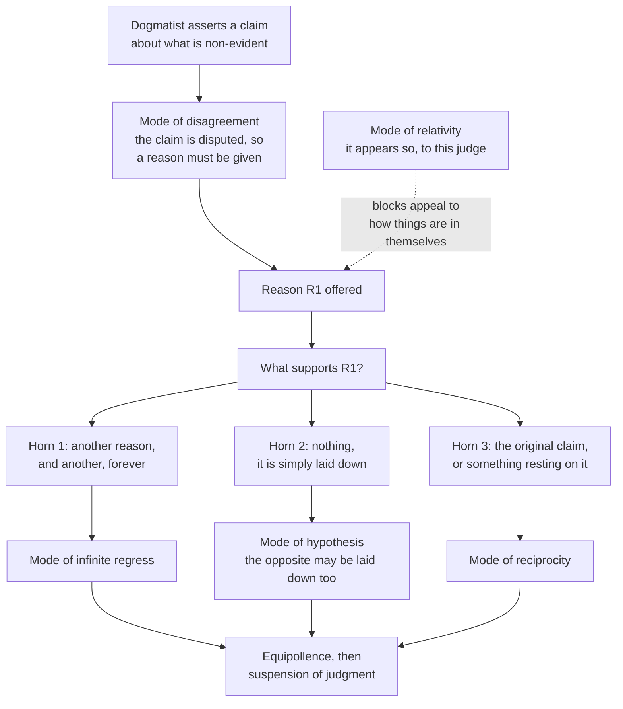

# Ancient & Medieval Philosophy · Lesson 4.3: The Skeptics

> ⏱ ~15 min · Module 4: The Hellenistic schools and Plotinus · Builds on: [4.2 The Stoics: logos, fate and virtue](04-02-the-stoics-logos-fate-and-virtue.md), [2.2 Knowledge: recollection, the Line and the Cave](02-02-recollection-the-line-and-the-cave.md) · Unlocks: [4.4 Plotinus: the One, Intellect and Soul](04-04-plotinus-the-one-intellect-and-soul.md)

## Why this matters

The Stoics promised a life that never rests on mere opinion: the wise man assents only to what he grasps. Two rival traditions asked the obvious question, *grasps how?*, and neither ever took yes for an answer. The Academy, Plato's own school, spent two centuries attacking the Stoic mark of truth. The Pyrrhonists, as Sextus Empiricus reports them, turned doubt into a way of living and claimed that calm followed. Between them they produced nearly every skeptical argument later philosophy inherited: indistinguishable twins and dreams, the regress of reasons, and the charge that a skeptic cannot even get out of bed. Augustine, Montaigne, Descartes and Hume all start from here.

## The idea

Think of a banknote. The Stoic says some notes carry a watermark no forger can reproduce, and a trained eye that sees it may accept the note without a second thought. That is the *cognitive impression*: an appearance so vivid and exact that it guarantees its own truth.

The skeptic does not need to show that every note is forged. One perfect counterfeit is enough. If even one false note could carry the very same watermark, the watermark no longer guarantees anything, and the careful teller has to stop certifying notes at all. That is the Academic attack. It is aimed narrowly at the Stoic's own standard, and it wins by the Stoic's own rules.

The Pyrrhonist goes about it differently. He does not argue that nothing can be known, which would be one more doctrine. He gets good at setting argument against argument: for every "the tower is round" an equally weighty "the tower is square". When the two sides balance he finds himself unable to decide, and suspends judgment. Then something unexpected happens. The anxiety that drove the inquiry goes away.

## The argument

**The Stoic target (from 4.2).** An *impression* (*phantasia*) is an appearance imprinted on the soul. *Assent* is the mind's yes to it. A *cognitive impression* (*phantasia kataleptike*) is one that (i) comes from what is, (ii) is stamped and impressed in exact accordance with that very thing, and (iii) is of such a kind as could not come from what is not (Sextus, *Against the Mathematicians* VII.248). Assent to one is *katalepsis*, a grasp. Zeno illustrated the ladder with his hand, as Cicero reports (*Academica* II.145): open fingers for the impression, the fingers drawn in for assent, a fist for grasp, and the other hand clamped over the fist for knowledge (*episteme*). The wise man never *opines*, which means he never assents to what he has not grasped.

**A. Arcesilaus against the criterion** (Cicero, *Academica* II; Sextus, *M* VII.150-158).

1. **The wise man never opines.** *In words:* the Stoics' own ideal assents only to cognitive impressions.
2. **An impression is cognitive only if no false impression could be exactly like it.** Cicero reports that Zeno added clause (iii) when Arcesilaus pressed him with exactly this point (*Academica* II.77). *In words:* a mark of truth is useless if a falsehood can wear it too.
3. **For any true impression, a false one indistinguishable from it can occur.** Twins; eggs that only the poultry-keepers of Delos could reportedly tell apart; dreams and madness that feel as vivid as waking. *In words:* nothing on the face of an appearance separates the real from the counterfeit.
4. **So there are no cognitive impressions.** *In words:* clause (iii) is never satisfied.
5. **So the wise man will assent to nothing: he suspends judgment (*epoche*) on everything.** *In words:* the Stoic sage, by his own rule, ends up an Academic.

The Stoic reply attacks premise 3: no two things in nature are wholly alike, and a practised eye can tell even twins apart. Everything turns on whether *indistinguishable to us* can be pushed to *indistinguishable in principle*.

**Carneades' addition.** Unlike Arcesilaus, Carneades offers a guide to action. It is the *persuasive* impression (*pithanon*, Cicero's *probabile*), and it comes in three grades: persuasive; persuasive and *undiverted* (nothing that appears alongside it pulls against it); and persuasive, undiverted and *tested*, meaning each circumstance has been checked (*M* VII.166-189). Whether Carneades endorsed this or only argued it against the Stoics was disputed already in antiquity. His pupil Clitomachus said he never discovered what Carneades actually approved (*Academica* II.139).

**B. Pyrrhonism as Sextus reports it** (*Outlines of Pyrrhonism* I, paraphrased).

1. **Skepticism is an ability to set appearances and thoughts against one another in any way at all** (*PH* I.8). *In words:* it is a skill, not a thesis.
2. **The opposed accounts turn out equal in persuasive force: *isostheneia*, equipollence** (I.10). *In words:* neither side appears more credible than the other.
3. **Equipollence brings suspension of judgment about the non-evident** (I.8, I.13). *In words:* when the scales balance, the skeptic finds himself not assenting, rather than choosing not to.
4. **Tranquility (*ataraxia*) follows suspension, as a shadow follows a body** (I.29). *In words:* the calm the dogmatist sought by finding the answer arrives when the search for it is given up. Sextus's image is the painter Apelles, who could not get a horse's foam right, threw his sponge at the picture in frustration, and found that the mark it left looked like foam (I.28).

**The Modes.** These are standard patterns for generating equipollence. The *Ten Modes*, which Sextus credits to the older skeptics and later sources to Aenesidemus, show that the same thing appears differently to different animals, people, senses, conditions, positions and customs (I.36-163). The *Five Modes*, credited by Diogenes Laertius (IX.88) to Agrippa, are more abstract and more deadly (*PH* I.164-177):

- **Disagreement:** the question is in dispute, among ordinary people and among philosophers, and still undecided.
- **Infinite regress:** whatever is offered as proof needs a proof in turn, without end.
- **Relativity:** the thing appears so relative to the judge and to what accompanies it, not as it is in itself.
- **Hypothesis:** the dogmatist stops the regress by simply laying something down, and the opponent may lay down the opposite with equal right.
- **Reciprocity:** what was to be proved is used to prove its own proof.

## Argument map

Disagreement forces a reason; relativity blocks an appeal to the things themselves; and every reason then falls to one of three horns. The three-horned core is what modern epistemology calls *Agrippa's trilemma*. The live question of which horn to accept belongs to [`epistemology` 2.1](../../epistemology/syllabus.md).

## Worked examples

**Example 1 (clean): Carneades' coiled rope.** In a dim storeroom you see something coiled in the corner and it looks like a snake. The impression is *persuasive*. You check its companions: the room is damp, the shape and colour fit, nothing clashes, so it is *undiverted*. You still leap back, which is action on a persuasive impression. Then you *test* it: you poke it with a stick, it does not move, and on a closer look it is rope (*M* VII.187-188).

What Carneades gets is a scale of care matched to the stakes. For a trivial choice a bare persuasive impression will do. For something grave, like a voyage or a verdict, test every circumstance. Notice what he does not get: at no grade has the impression become *cognitive* in the Stoic sense. A fully tested impression could still be false, and the Academic acts on it without certifying it. (*Pithanon* means "persuasive", not "probable" in the modern sense. Treating it as a number between 0 and 1 is anachronism, though a fruitful one; see [`epistemology`](../../epistemology/syllabus.md) Module 5.)

**Example 2 (hard): can a Pyrrhonist live his skepticism?** The Stoics' standing objection to Arcesilaus was *apraxia*, inaction. Action needs impulse, impulse needs assent, so someone who assents to nothing cannot act. Sextus's reply (*PH* I.21-24) makes the *appearance* the criterion of action, not of truth. The skeptic lives "without opinions" by four kinds of observance:

- the **guidance of nature:** he perceives and thinks;
- the **compulsion of the feelings:** hunger leads him to food;
- **laws and customs:** he treats piety as good in the way his community does;
- the **teaching of the arts:** he practises a craft.

Now run the case of Sextus himself, a doctor. A patient is feverish. It appears to him that this condition has usually yielded to this treatment, so he treats it. He reports how things appear and denies holding that the treatment *really* works by some hidden cause.

Here the reply strains, and modern readers split. Myles Burnyeat ("Can the Sceptic Live His Scepticism?", 1980) argued that the skeptic's suspension reaches every belief, so the doctor's "it appears so" either smuggles in a belief or leaves a life no one could actually live. Michael Frede (1979) read Sextus as suspending only *dogmatic* belief about what is non-evident, while keeping ordinary acceptance of how things seem. Jonathan Barnes (1982) named the two readings "rustic" and "urbane". The text supports both in places: Sextus says the skeptic does not hold *dogma*, which he glosses as assent to the non-evident objects of inquiry (I.13). Whether that narrow sense is the one he keeps to throughout is the whole dispute.

## Watch out

- **You might think the skeptic doubts that honey appears sweet.** Sextus concedes appearances. What he suspends is judgment on whether honey *is* sweet in its nature (I.19-20). Ancient skepticism also is not Descartes' worry about an external world; its target is *dogma*, and a "dogmatist" just means anyone who holds doctrines about the non-evident.
- **You might think Academics and Pyrrhonists say the same thing.** Sextus classifies the New Academy as negative dogmatists, because they assert that things are inapprehensible. He also says they follow persuasive impressions with a strong inclination, where the Pyrrhonist simply goes along (*PH* I.226-230). Whether that is fair to Arcesilaus, who reportedly would not claim to know even that he knew nothing (*Academica* I.45), is a real question.
- **Anachronism trap: "Agrippa's trilemma" is not Agrippa's phrase.** He gave five modes. The three-horned version is a modern distillation, popularised as the "Münchhausen trilemma" by Hans Albert (1968). The ancient package also relied on disagreement and relativity to get started.
- **You might think suspension is a technique chosen to buy calm.** Sextus says the skeptic began inquiring in hope of tranquility (I.12), but the calm came, like Apelles' foam, only after he gave up trying to decide.

## One-liner

> The Academic breaks the Stoic's mark of truth with one perfect counterfeit; the Pyrrhonist balances every argument with its twin, suspends judgment, and finds that calm follows like a shadow.

## Problems

**P1 (🟢) *(Exegetical.)*** An Epicurean ([4.1](04-01-epicurus-atoms-the-swerve-and-death.md)) is cross-examined by a Pyrrhonist. Label each of the skeptic's moves (i)-(v) with the one Agrippan mode it uses. Then say which three moves make up the trilemma, and which move could equally be classed under one of the Ten Modes, and why. One line per label.

> **Epicurean:** Every perception is true.
> **Skeptic (i):** The Stoics deny that, the Academy denies it, and your school has argued for it for generations without settling it.
> **Epicurean:** It follows because every proof starts from perception, so if any perception were false nothing could be trusted.
> **Skeptic (ii):** And how do you know every proof starts from perception? By perceiving it? Then you trust perception to show that perception is trustworthy.
> **Epicurean:** Then I take it as a starting point.
> **Skeptic (iii):** Then I take the opposite as mine, with just as much right.
> **Epicurean:** The tower that looks round from far off gives a true perception: the image really is round when it reaches the eye.
> **Skeptic (iv):** So it is round as it appears at this distance to this eye. You have told me how it appears relative to a viewer, not how the tower is.
> **Epicurean:** I have a further argument for that.
> **Skeptic (v):** Which will need another, and that one another.

**P2 (🟡) *(Exegetical (a) · Evaluative (b).)*** Carneades acts on tested, undiverted persuasive impressions. Sextus acts on appearances and says the Academics differ from Pyrrhonists by following persuasive impressions "with strong inclination." (a) Name the single premise about what it is to *follow* an impression on which they part ways, and say what text or evidence would move a reader to class Carneades with Sextus rather than against him. (b) Is Sextus's charge that the Academy is "negative dogmatism" fair to Arcesilaus and Carneades as Cicero reports them? Any verdict. 150 words or fewer for (a) and (b) together.

**P3 (🔴, optional) *(Exegetical.)*** Diagnose this invented wellness column. Say which Hellenistic school it borrows from, name three of its features that fit that school, and name two things it asserts or assumes that Sextus would disown. 150 words or fewer.

> "Doomscrolling again? Here's the fix. For every hot take online there's an equally convincing counter-take. I checked; it's always true. So stop picking sides. Nothing can really be known anyway. Eat when you're hungry, follow the norms of your office, do your job well, and the knot in your stomach will loosen. That's the whole point of not deciding: suspending judgment is the most reliable technique ever invented for peace of mind."

Solutions

**P1** *(Exegetical, strict.)*

**Must hit, strict:**
- (i) **Disagreement:** the question is disputed and undecided.
- (ii) **Reciprocity:** perception's reliability is used to establish perception's reliability.
- (iii) **Hypothesis:** a bare starting point can be matched by its opposite.
- (iv) **Relativity:** the tower appears so relative to the observer and distance, not as it is in itself.
- (v) **Infinite regress:** each proof needs a further proof.
- **The trilemma:** (ii), (iii) and (v), the three horns of circularity, bare assumption and regress. Disagreement and relativity set the trap rather than forming horns.
- **Ten Modes:** (iv), which falls under the mode from positions, distances and places, since the same object appears differently from different distances. The Ten Modes are concrete versions of relativity.

**Wrong turns:** labelling (ii) as regress because it involves a further question (the problem is that the support loops back to the claim itself, not that it goes on); labelling (i) as relativity because "it depends who you ask" (disagreement is about the dispute being unsettled, not about appearing-to).

**Model answer:** (i) disagreement; (ii) reciprocity; (iii) hypothesis; (iv) relativity; (v) regress. The trilemma is (ii), (iii) and (v). Move (iv) is also the Ten Modes' argument from distances and positions.

---

**P2** *(Exegetical (a) · Evaluative (b).)*

**Must hit, strict (a):**
- The crux: *whether following an impression as more persuasive involves taking it to be more likely true*, a weak or qualified assent. Sextus says the Academic does this ("strong inclination") and the Pyrrhonist does not; he merely goes along with how things appear.
- What would move a reader: evidence that Carneades' approval was not assent, especially Clitomachus's distinction, reported in *Academica* II.104, between refusing assent altogether and still following the persuasive without saying yes or no; or Clitomachus's report that Carneades' own view was unknown, which would make the *pithanon* a dialectical weapon rather than a doctrine.

**Must hit, any verdict (b):** state the charge exactly (that the Academy asserts that nothing can be apprehended); test it against at least one report, such as Arcesilaus's refusal to claim even that he knew nothing (*Academica* I.45) or the dispute over whether Carneades endorsed the *pithanon*; give a verdict with the step that decides it.

**Wrong turns:** naming "whether knowledge is possible" as the crux, since neither side claims to know it; treating *pithanon* as modern probability and making the crux about numbers.

**Model answer (b), one of several:** The charge fits some Academics better than others. For later Academics who defended the *pithanon* as a real guide, following the persuasive looks like a mild belief that it is likelier true, which Sextus may fairly call dogmatic. But Arcesilaus, as Cicero reports him, would not even assert that nothing can be known. His "nothing is apprehensible" reads as the conclusion of an argument run on Stoic premises. Verdict: unfair to Arcesilaus, arguably fair to the later Academy.

---

**P3** *(Exegetical, strict.)*

**Must hit, strict:**
- **School:** Pyrrhonism as Sextus reports it.
- **Fitting features (any three):** equipollence (every take has an equally convincing counter); suspension of judgment; tranquility as what follows; living by the fourfold observances: nature and the compulsion of feelings (eat when hungry), laws and customs (office norms), the arts (do your job).
- **What Sextus would disown (any two):** "nothing can really be known" is negative dogmatism, which he attributes to the Academy; "I checked; it's always true" turns equipollence into a universal claim about how things are, where Sextus only reports how the arguments have appeared to him so far; and treating suspension as a reliable technique for peace of mind misreads the Apelles story, in which calm arrives unlooked-for after the attempt to decide is given up.

**Wrong turns:** calling it Stoic because of the emphasis on calm and duty (the Stoic gets calm by correct judgment, not by suspending it); calling it Academic just because of "nothing can be known" (that line is the stray element, not the frame).

**Model answer:** Pyrrhonian. It uses equipollence (equal counter-takes), suspension ("stop picking sides"), tranquility following, and life by the observances: hunger, custom, craft. But "nothing can really be known" is the Academic negative dogmatism Sextus rejects. "It's always true" asserts equipollence as a fact rather than reporting it as an appearance. And a "reliable technique" for calm reverses Sextus, for whom calm followed suspension as a shadow follows a body, not as a promised result.

## Flashback

**From Lesson 4.1 (Epicurus: atoms, the swerve, and death):** *(Exegetical.)* A merchant with a slow, incurable illness brings three fears to an Epicurean teacher. (i) "The months of dying will be agonizing." (ii) "After I'm dead, my rivals will mock my name in the market." (iii) "What if my soul lives on and is punished below?" For each, say whether the core death argument, "when we are, death is not come, and, when death is come, we are not", reaches it. If it does not, name the other part of the Epicurean system that has to do the work, and the premise of 4.1's reconstruction it rests on. Two sentences or fewer per fear.

Solution

**Must hit, strict:**
- (i) **Not reached.** Dying happens while he still exists and feels, so "when we are, death is not come" gives no comfort: this pain is real and present. The work falls to the theory of pain (premise 1, pleasure's limit is the removal of pain) and the *tetrapharmakos*'s "the terrible is easy to endure". Citing PD 4 (intense pain is brief, long illness allows more pleasure than pain) earns credit but is not required.
- (ii) **Reached.** When the mockery happens he is not, and all good and evil lie in sensation, so there is no subject left to be harmed (premises 5–6). His distress is the corpse-pitier's mistake: an added opinion that he will somehow be present to mind it. Anticipating it is empty pain (premise 7).
- (iii) **Not reached by the argument on its own.** The dilemma assumes that death ends the subject, and this fear denies that. The physics has to do the work: the soul is a body of fine atoms that disperses (premises 3 and 5), and no blessed god troubles anyone (premise 4, PD 1).

**Wrong turns:** saying (i) is answered because "death is nothing to us". Dying is not death, and Epicurus never claims pain is nothing. Treating (iii) as answered by premise 6 alone, when premise 6 presupposes the dispersal it would need to prove. That is why physics is the medicine.

**Model answer:** (i) Not reached: he is still here while dying, so the pain is real. The theory of pain answers it instead (premise 1, "the terrible is easy to endure"). (ii) Reached: when he is mocked he is not, and with no sensation there is no harm (premises 5–6). Dreading it now is empty pain (premise 7). (iii) Not by itself: the argument assumes death ends the subject. The atomist physics has to supply that, since the soul's atoms disperse (premises 3, 5), and the gods punish no one (premise 4).

## Connections

- **Backward:** The target is the Stoic theory of assent from [4.2](04-02-the-stoics-logos-fate-and-virtue.md). The Stoics also treated the passions as false judgments, so for them getting assent right was an ethical matter too. The Academy's skepticism claimed Socrates' profession of ignorance ([1.3](01-03-the-sophists-and-socrates.md)) as its ancestor, and it grew up inside the school of the Plato whose divided knowledge and opinion you mapped in [2.2](02-02-recollection-the-line-and-the-cave.md). Relativity recalls Protagoras (1.3), though the skeptic reports how things appear where Protagoras made the appearance the measure. The Epicurean "all perceptions are true" ([4.1](04-01-epicurus-atoms-the-swerve-and-death.md)) is the opposite answer to the same worry.
- **Forward:** Some readers take Plotinus's insistence that Intellect is identical with its objects ([4.4](04-04-plotinus-the-one-intellect-and-soul.md); *Enneads* V.5) as a reply to the skeptical gap between an impression and its object. Augustine's youthful attraction to the Academics, and his answer to them, open [5.1](05-01-augustine-certainty-and-illumination.md). Montaigne's and Hume's Pyrrhonism, and Descartes' method of doubt, are in [`modern-philosophy`](../../modern-philosophy/syllabus.md) (1.1, 4.4).
- **Sideways:** Skepticism as a live problem is [`epistemology`](../../epistemology/syllabus.md)'s: 2.1 states Agrippa's trilemma and asks which horn foundationalism, coherentism and infinitism each accept, and Module 3 takes on the external-world skeptic that Sextus never was. Naming the premise Carneades and Sextus disagree about is the move taught in [`philosophical-method` 4.3](../../philosophical-method/lessons/04-03-finding-the-crux.md).
