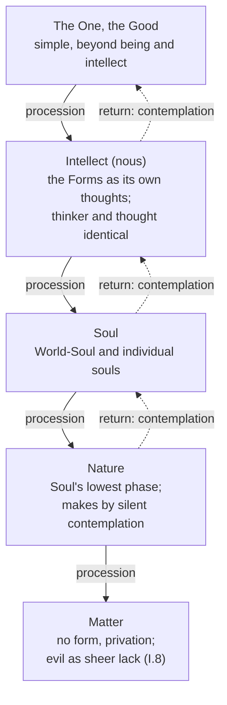

# Ancient & Medieval Philosophy · Lesson 4.4: Plotinus: the One, Intellect and Soul

> ⏱ ~15 min · Module 4: The Hellenistic schools and Plotinus · Builds on: [2.1 The Forms](02-01-the-forms-and-what-goes-wrong-with-them.md), [3.6 The unmoved mover](03-06-the-unmoved-mover.md), [4.2 The Stoics](04-02-the-stoics-logos-fate-and-virtue.md) · Unlocks: [5.1 Augustine: certainty and illumination](05-01-augustine-certainty-and-illumination.md)

## Why this matters

When Augustine says the "books of the Platonists" freed him to think of God as something other than a body, the books he means are largely Plotinus's. Three ideas the Middle Ages treated as common property come through him: the Forms as the contents of a divine mind, evil as a lack rather than a thing, and the soul's ascent by turning inward. Plotinus (204/5–270) taught in Rome from 244. His student Porphyry edited his 54 treatises into six sets of nine, the *Enneads* (Greek *ennea*, nine). Plotinus asked a question Plato and Aristotle had left half-open: if everything real is somehow one, what is the *first* thing, and how does anything else come from it?

## The idea

Start from something Plotinus thought no one could deny. **To be is to be one thing.** An army, a chorus, a flock exists only while its members hang together. Scatter them and the army is gone, though the soldiers remain. A house, a plant, a body is a thing only because its parts are held in a unity (VI.9.1). Unity is not one more property a thing has. It is the condition of there being a thing to have properties.

Now follow that upward. Everything we meet is one *and* many: a body has parts, a soul has thoughts in sequence, even a mind contemplating the Forms holds many Forms. Anything composite depends on something that unifies it. So the source of all unity cannot itself be composite, or it would need a unifier in turn. At the top there must be something with no parts, no distinctions, no inner duality at all: **the One**, which Plotinus also calls the Good.

Two consequences follow, and they explain the strangeness of the system.

First, the One cannot be described. Every description says "it is F," and that splits subject from predicate. Plotinus even denies that the One *is* in the ordinary sense: it is "beyond being," since being is already a many (the Forms). His reply to the obvious worry is that "we can and do state what it is not, while we are silent as to what it is" (V.3.14, MacKenna). We talk about it from what comes after it.

Second, things come from the One not by choice or construction but the way light comes from the sun. MacKenna's word in V.1.6 is "circumradiation." The sun loses nothing by shining, and fire warms without cooling down (V.4.1). Whatever is perfect produces, and the One, most perfect of all, produces without being diminished or moved. This is **procession**. What proceeds then turns back toward its source and is shaped by gazing at it. This is **return** (*epistrophe*). Procession gives a thing its existence, return gives it its determinate form, and on this view the whole of reality is this double movement, out and back.

## Source

*Enneads* I.6.9, "Beauty" (Stephen MacKenna's translation, 1917):

> Withdraw into yourself and look. And if you do not find yourself beautiful yet, act as does the creator of a statue that is to be made beautiful: he cuts away here, he smoothes there, he makes this line lighter, this other purer, until a lovely face has grown upon his work. So do you also: cut away all that is excessive, straighten all that is crooked, bring light to all that is overcast, labour to make all one glow of beauty and never cease chiselling your statue, until there shall shine out on you from it the godlike splendour of virtue, until you shall see the perfect goodness surely established in the stainless shrine.

This is the return, practised. The key verbs are subtraction or clarification: *cut away*, *straighten*, *bring light*. Nothing is brought in from outside. The soul is both sculptor and statue, and the splendour "shine[s] out on you *from it*": the beauty was in the stone already.

## The argument

**The three hypostases and what lies below them.** (*Hypostasis* means a real, standing level of being. MacKenna calls *nous* "the Intellectual-Principle.")

1. **The First must be simple.** Whatever is not first depends on something earlier, and whatever is composite depends on its components. The First depends on nothing, so it has no components (V.4.1). *In words:* a thing made of parts can't be the bottom of the explanation, because the parts come first.
2. **So the One is beyond being and beyond intellect.** Being is many (many Forms), and thinking is a duality of thinker and thought (V.6.1). Neither can belong to what is perfectly simple (V.3.13). *In words:* even the highest mind has a structure, so it can't be the first thing.
3. **The One produces without changing.** The perfect gives of itself, as fire gives heat, and the giver is not diminished. The One is "seeking nothing, possessing nothing, lacking nothing" and so "has overflowed" (V.2.1). *In words:* production is the effect of fullness, not an act of will or a need.
4. **What first proceeds turns back and becomes Intellect.** In gazing on the One it is filled, and so becomes a mind and at once the whole realm of Being (V.2.1). *In words:* Intellect is what the One's overflow becomes when it looks back at its source.
5. **Intellect's objects are not outside it.** The Forms are Intellect's own content, and in it knower and known are identical (V.5; V.9). *In words:* Plato's Forms are no longer a separate gallery a mind inspects. They *are* the mind, thinking itself.
6. **Intellect in turn produces Soul.** The World-Soul governs the cosmos, and individual souls are its kin. Part of our own soul, Plotinus holds, never descends from the intelligible at all (IV.8.8). *In words:* Soul is Intellect unfolded into life, time and action.
7. **Soul's lowest phase is nature, and nature makes by contemplating.** It does not plan, since "to plan for a thing is to lack it" (III.8.3). *In words:* even a growing plant is contemplation at its faintest.
8. **At the limit is matter.** Matter has no form of its own. It is privation, sheer indeterminacy, and Plotinus calls it evil itself, the primal evil (I.8). *In words:* evil is not a rival power but the point where the outflow of form runs out.

## Argument map

Solid edges are procession, dashed edges are return. Matter has no return edge, since it has no form with which to turn back.

## Worked examples

**Example 1 (clean: locate an oak).** Run the hierarchy on a single oak tree.
- It is *one* tree, not a heap of cells: that unity is a trace of the One.
- It is an *oak* and not an elm: its form is an image of a Form that exists in Intellect.
- It grows, repairs itself and makes acorns, and none of this happens by deliberation: that is nature, the lowest phase of Soul, contemplating the rational forming principle it carries.
- It is a *perishable* oak, always shedding what it has taken in: that is matter, which receives form and never holds it.

Each feature that makes the oak real comes from above, and the one feature that makes it fall short comes from below. Plotinus is not adding four ingredients here. He is showing four degrees of the same unity, strongest at the top.

**Example 2 (hard: does the Good cause evil?).** If everything proceeds from the Good by necessity, and matter lies at the end of the procession, it can look as if the Good causes evil.

Plotinus's resources are three. First, matter is not a positive thing added to the world. It is privation, so there is nothing positive for the Good to have caused. Second, procession has to stop somewhere. "As necessarily as there is Something after the First, so necessarily there is a Last" (I.8.7), and that last, where form gives out, is matter. Third, bodies and souls are not evil by being material. They become bad in so far as they are dominated by indeterminacy.

The strain is real, and readers divide over it. Plotinus seems to make matter *generated* (on this reading it proceeds, like everything else), and also *absolute* evil. Some scholars, notably Denis O'Brien, argue that he held both consistently. Others see a dualist residue inside a monist system. Whether evil as privation is a defensible account belongs to [`philosophy-of-religion`](../../philosophy-of-religion/syllabus.md). How Augustine rebuilt this account is [5.2](05-02-augustine-evil-and-the-will.md).

## Watch out

- **Anachronism: "emanation" is not an event.** Procession is not a flow of stuff through space, and it did not happen at a moment. Plotinus warns that "we dare not talk of generation in time" (V.1.6). The One is prior as a cause, not earlier as a date. Nor is it a Big Bang.
- **Anachronism: Plotinus is not a "Neoplatonist" by his own lights.** That label is modern. He called his doctrines "no novelties," only Plato made explicit (V.1.8), and he reads the first hypotheses of the *Parmenides* as the three hypostases. Whether that reading is faithful is a fair question. That he intended it as exegesis is not in doubt.
- **The One is not pantheism, and not a personal creator.** "The One is all things and no one of them" (V.2.1): everything depends on it, and it is none of the things that depend on it. It also does not "assent" or utter "decree" (V.1.6). Reading either a chooser or a world-soul into it misses both halves.
- **"Beyond being" does not mean "unreal."** It means prior to the multiplicity that being involves. Plotinus sometimes allows the One a thinking "in a mode other" than Intellect's (V.4.2). So "the One does not think" is his main thesis, but he hedges it.

## One-liner

> Everything is real by being one, so the source of all things must be perfectly one: an overflowing, indescribable Good from which Intellect, Soul and nature proceed and to which the soul returns by stripping itself back.

## Problems

**P1 (🟢) *(Exegetical.)*** Close-read the end of *Enneads* I.6.9 (MacKenna):

> To any vision must be brought an eye adapted to what is to be seen, and having some likeness to it. Never did eye see the sun unless it had first become sunlike, and never can the soul have vision of the First Beauty unless itself be beautiful. Therefore, first let each become godlike and each beautiful who cares to see God and Beauty.

Two readings: **(A)** likeness is a *precondition* of vision, so the soul must be made beautiful before it can see; **(B)** likeness is the *effect* of vision, so seeing beauty is what makes the soul beautiful. (a) Which does the passage support, and which words decide it? (b) Which image from Plato's *Republic* (see [2.2](02-02-recollection-the-line-and-the-cave.md)) is Plotinus reworking, and what does he add to it? 150 words or fewer in total.

**P2 (🟡) *(Exegetical (a) · Evaluative (b).)*** (a) Reconstruct, in numbered premises and in Plotinus's own terms, the argument that the first principle must be simple and therefore beyond intellect (V.4.1, V.3.13), and flag the premise you judge weakest. (b) A critic objects: "Plotinus says the One cannot be described, then describes it as simple, first, good and the cause of all. The theory refutes itself." Using V.3.14, state Plotinus's reply, and assess whether it answers the critic on terms both sides accept. Any verdict. 150 words or fewer for (b).

**P3 (🔴, optional) *(Exegetical.)*** Aristotle's first mover is "thought thinking itself" (*Metaphysics* XII.9, [3.6](03-06-the-unmoved-mover.md)). Plotinus accepts self-thinking intellect but places it *second*, below a One that does not think (V.6). Name the single premise one of them affirms and the other denies, and say what argument would move a defender of either side. 150 words or fewer.

Solutions

**P1** *(Exegetical — strict.)*

**Must hit, strict (a):**
- Reading **(A)**. Three sets of words decide it. "Must be brought" puts likeness in place before vision happens, and so does "unless it had first become sunlike": becoming precedes seeing, and "first" marks the order. "Therefore, first let each become godlike" then draws the practical conclusion, which is to transform yourself *in order to* see.
- The principle behind it is *like is known by like*: "adapted to what is to be seen, and having some likeness to it."

**Must hit, strict (b):**
- The Sun analogy of *Republic* VI, where sight is the most sunlike of the senses and the Good is to the intelligible world what the sun is to the visible one.
- What Plotinus adds: likeness is something the soul must *achieve* by purification, not a fixed feature of the organ, and he turns Plato's epistemic analogy into a programme of ascent that ends beyond Intellect.

**Wrong turns:** choosing (B) because the passage is about vision and Plotinus elsewhere says Intellect is "filled" by gazing (V.2.1). That is true of Intellect's return, but *this* passage makes likeness the condition of seeing. Naming the Cave rather than the Sun: the Cave is about ascent, but the sunlike eye is the Sun analogy's image.

**Model answer:** (a) (A). "Must be brought," "unless it had first become sunlike" and "Therefore, first let each become godlike" all put likeness before vision. The governing principle is that the eye must be "adapted" to its object and have "some likeness to it." (b) Plato's Sun: sight is the most sunlike sense, and the Good plays the sun's role for the intelligible. Plotinus makes the likeness a task. The soul must become beautiful by purification before it can see the source of beauty.

---

**P2** *(Exegetical (a) · Evaluative (b).)*

**Must hit, strict (a):**
- P1: Whatever is not first depends on something prior to it.
- P2: Whatever is composite depends on its components, which are in that respect prior to it.
- P3: The first principle depends on nothing prior.
- ∴ C1: The first principle is not composite; it is simple.
- P4: Intellect involves duality (thinker and object) and multiplicity (many Forms), even when it thinks itself.
- ∴ C2: The first principle is not Intellect; it is beyond intellect (and beyond being, which is also many).
- A weakest premise, flagged with a reason. P2 is the usual candidate: must *every* kind of distinction count as composition? Aristotle, for one, would say the identity of thinker and thought in immaterial things removes the duality. P4 is an equally good flag, for the same reason.

**Must hit, any verdict (b):**
- Plotinus's reply as V.3.14 gives it: we "state what it is not, while we are silent as to what it is," and speak of it "in the light of its sequels." "Simple" is a denial (no parts). "First" and "cause" describe its effects' dependence on it, not its nature.
- The test: does that recast *every* predicate the critic lists? "Good" is the hardest one, because it looks positive.
- A verdict either way, with the step that decides it.

**Wrong turns:** answering (b) by asserting that the One exists or does not exist, which is not asked. Collapsing C1 and C2, when the move from simplicity to "beyond intellect" needs its own premise (P4).

**Model answer (b), one of several acceptable:** Plotinus replies that he never predicates anything of the One's nature. "Simple" denies composition. "First" and "cause" name the dependence of other things on it, speaking "in the light of its sequels" (V.3.14). The critic can accept that denials and relational descriptions do not split the One into subject and property, so the reply engages on shared terms. The pressure falls on "Good." Plotinus can treat it as naming what everything else seeks, a relation again, and he appears to say the One is good for what comes after it rather than for itself (VI.9.6). If that recasting is allowed, there is no self-refutation. If one insists that a relation must be grounded in some intrinsic feature, the charge returns. Verdict: the reply succeeds as far as relational talk can be kept free of intrinsic grounding, and that is where the debate turns.

---

**P3** *(Exegetical — strict on identifying a single premise; any defensible statement of it passes.)*

**Must hit, strict:**
- The crux: *whether self-thinking, even where thinker and thought are identical, still involves a duality incompatible with being absolutely first.* Plotinus affirms it: there is "no intellection without duality in unity" (V.6.1), so the first must be beyond thought. Aristotle denies it: in what is without matter, thought and its object are the same, so self-thought is pure actuality with no composition, and nothing is prior to it.
- Both agree that the highest *intellect* thinks itself, and that the first principle is immaterial and actual. The disagreement is not about whether self-thinking intellect exists.
- What would move each side. Aristotle's defender: an argument that "thinking *itself*" keeps a reflexive structure (a subject turned back on an object) that identity does not erase, or that his argument from motion yields only a mover and leaves open whether something is prior to it. Plotinus's defender: an argument that absolute simplicity with no thought is empty, a principle that could explain nothing, or that V.4.2's allowance of a thinking "in a mode other" concedes the point.

**Wrong turns:** naming "whether the first principle is God" (both treat their first principle as divine). Naming "whether Forms exist": Aristotle rejects separate Forms, but that is a different crux ([3.4](03-04-substance-and-essence.md)), and this dispute would survive without it.

**Model answer:** Both hold that the highest intellect thinks itself. The premise in dispute is whether self-thought, even with thinker and thought identical, still contains a duality that rules it out as the absolutely first. Plotinus affirms it: intellection needs "duality in unity," so something simpler must stand before Intellect. Aristotle denies it: in what has no matter, knower and known are one and the same actuality, so nothing is left to be prior. An Aristotelian might be moved by showing that reflexive thought keeps a subject-object structure identity does not erase. A Plotinian might be moved by showing that a first principle with no thought or determinate nature could not explain why anything proceeds from it.

## Flashback

**From Lesson 4.2 (The Stoics: *logos*, fate and virtue):** *(Exegetical.)* One day in the life of a trainee Stoic. Classify each reaction as a **passion** (say which of the four, and the false judgment in it), a **first movement**, or a **good feeling** (say which of the three). One line each.

> (i) A cart swerves at her in the street, and she goes pale and her heart jumps before she has had a moment to think.
> (ii) She lies awake craving a seat on the city council, convinced that getting it would make her life go well.
> (iii) She hears that a rival has been heavily fined and is elated, counting his loss a real gain for herself.
> (iv) Having told the truth to a magistrate at real cost to her business, she is glad of it.
> (v) She wants, steadily and without agitation, to become more just than she is.

Solution

**Must hit, strict:**
- (i) **First movement.** It comes before assent, like flinching or tears (Seneca, *On Anger* II), so it is not yet a judgment and not a passion.
- (ii) **Passion: appetite.** It is the judgment that a *future* thing is good, and that it is right to reach for it. The office is at most a preferred indifferent, so the judgment is false.
- (iii) **Passion: pleasure.** It is the judgment that a *present* thing is good, and that it is right to swell at it. Another's loss of money is an indifferent, not a good for her, so the judgment is false.
- (iv) **Good feeling: joy.** Her honesty is virtue, the one real good, and it is present. Joy is the sage's counterpart of pleasure.
- (v) **Good feeling: wish.** Its object is future and genuinely good (virtue), and she reaches for it without excess. Wish is the counterpart of appetite.

**Wrong turns:** calling (i) fear, when nothing has been assented to yet. Calling (iv) a passion because it is a pleasure in something: what makes it a passion or not is whether its object is a real good. Calling (ii) wish because public service is a worthy aim: she treats the seat itself as what would make her life go well, which is the judgment of an indifferent as a good.

**Model answer:** (i) First movement: prior to assent, so not a passion. (ii) Appetite: the false judgment that a future council seat is a good. (iii) Pleasure: the false judgment that a rival's present loss is a good for her. (iv) Joy: a reasonable elation at a present real good, her own virtue. (v) Wish: a reasonable reaching for a future real good, justice.

## Connections

- **Backward:** Plotinus's Intellect answers the separation problem of [2.1](02-01-the-forms-and-what-goes-wrong-with-them.md). Forms that are a mind's own thoughts are not a second world standing apart from a knower. And he takes over the self-thinking of Aristotle's mover ([3.6](03-06-the-unmoved-mover.md)) but demotes it to second place. Privation as the absence of form comes from [3.3](03-03-change-privation-potency-and-act.md). Against the Stoics ([4.2](04-02-the-stoics-logos-fate-and-virtue.md)), Plotinus insists the ruling principle cannot be a body, since a body is composite.
- **Forward:** Augustine read Plotinus in Latin translation, and [5.1](05-01-augustine-certainty-and-illumination.md) traces the turn inward and the unchanging truth above the mind back to the return. [5.2](05-02-augustine-evil-and-the-will.md) keeps privation and drops matter as evil. Module 5's boss problem close-reads I.8 against *Confessions* VII.12 on exactly that. The Forms in a divine mind reach Aquinas ([8.1](08-01-porphyrys-questions-universals-to-aquinas.md)), and Porphyry, the editor of the *Enneads*, sets Module 8's question.
- **Sideways:** divine simplicity as a live doctrine, and the modal-collapse objection to it, belongs to [`philosophy-of-religion`](../../philosophy-of-religion/syllabus.md) 1.4, and its place in Aquinas's system to [`thomistic-synthesis`](../../thomistic-synthesis/syllabus.md) 3.4. Whether a first principle can exist necessarily, with nothing prior to explain it, is [`metaphysics` 3.3](../../metaphysics/lessons/03-03-brute-facts-and-necessary-existence.md). The ascent as a theology of contemplation belongs to [`patristics`](../../patristics/syllabus.md).
