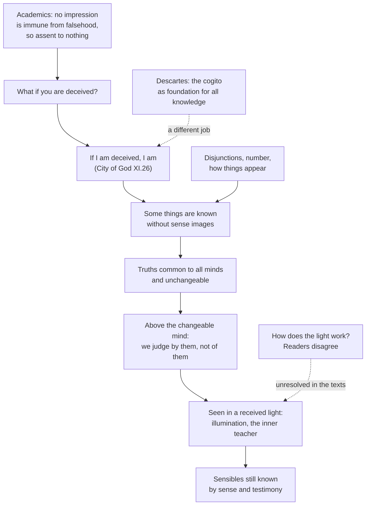

# Ancient & Medieval Philosophy · Lesson 5.1: Augustine: certainty and illumination

> ⏱ ~15 min · Module 5: Augustine and Boethius · Builds on: [4.3 The Skeptics](04-03-the-skeptics.md), [4.4 Plotinus: the One, Intellect and Soul](04-04-plotinus-the-one-intellect-and-soul.md) · Unlocks: [5.2 Augustine: evil and the will](05-02-augustine-evil-and-the-will.md)

## Why this matters

The Academic skeptics of [4.3](04-03-the-skeptics.md) left a standing challenge: no impression carries a mark that guarantees its truth, so the wise man assents to nothing. Augustine of Hippo (354–430) had been half-persuaded by them. His way out became the Latin West's theory of knowledge for eight hundred years. Some things cannot be doubted without being confirmed. The truths the mind finds within are common to all minds and cannot change. And the mind sees them only in a light it does not supply. Descartes would later be told his *cogito* was already in Augustine. What Augustine did with it was different, and the difference is the lesson.

## The idea

Start with the skeptic's weapon: *what if you are deceived?* It works against any belief whose object could come apart from how it appears — the oar that looks bent, the twin you mistake for his brother. Augustine's move is to find beliefs where that gap cannot open. If I am deceived, *someone* is being deceived, so the doubt about my existence confirms the very thing it doubts. The same holds for "I am doubting", "I am thinking", "it seems white to me", "either there is one world or there is not", and "seven plus three is ten". None of these is known *through* a sense impression, so the Academic argument, which is aimed at impressions, never touches them.

That gives Augustine a foothold, and he climbs from it. Look at what you found. "Seven plus three is ten" is not *your* truth the way your toothache is your pain. Every mind that thinks it sees the same thing, and it was true before you noticed it. It does not change. Your mind does change. It learns, forgets and errs. So the truth you see is not a product of your mind, and you do not judge it; you judge other things *by* it. Something unchangeable is present to the changeable mind.

How can a changeable mind see what is unchangeable? Augustine's answer is borrowed from Plato's image of the Sun ([2.2](02-02-recollection-the-line-and-the-cave.md)) and reworked through Plotinus: the mind sees intelligible truth in a light, as the eye sees bodies in sunlight. The eye does not make the light, and the mind does not make the truth. For Augustine, that light is God, the inner teacher.

The route is personal before it is theoretical. In *Confessions* VII.9 Augustine says that "certain books of the Platonists", probably Plotinus and perhaps Porphyry in Latin translation (the identification is disputed), taught him the substance of the opening of John's Gospel: the Word, and the light that enlightens every man. They did not teach him that the Word was made flesh. In VII.10 those books send him inward, and he reports seeing, "above my mind, the Unchangeable Light". The theology of that passage belongs to [`patristics`](../../patristics/syllabus.md) (4.3). The philosophy here is the direction of travel: *inward, then upward*.

## Source

Augustine, *City of God* XI.26 (Dods, *Nicene and Post-Nicene Fathers*, public domain). Augustine has just said that we are, we know that we are, and we love both, and that we grasp these without any bodily sense.

> But, without any delusive representation of images or phantasms, I am most certain that I am, and that I know and delight in this. In respect of these truths, I am not at all afraid of the arguments of the Academicians, who say, What if you are deceived? For if I am deceived, I am. For he who is not, cannot be deceived; and if I am deceived, by this same token I am. And since I am if I am deceived, how am I deceived in believing that I am? For it is certain that I am if I am deceived. Since, therefore, I, the person deceived, should be, even if I were deceived, certainly I am not deceived in this knowledge that I am. And, consequently, neither am I deceived in knowing that I know.

Three things to notice. The target is named: the Academicians, not an imagined demon. The phrase "without any delusive representation of images or phantasms" is what exempts these truths from the Academic attack, which is aimed at images received through the senses. And the certainty does not stop at "I am". It extends to "I know" and, a few lines later, to "I love". Augustine is building a triad here, as an image of the Trinity, not isolating a single foundation.

## The argument

**A. Against the Academics** (*City of God* XI.26; also *On Free Choice of the Will* II.3 and *On the Trinity* X.10, section numbers as usually cited).

1. **The Academic challenge is "what if you are deceived?", pressed against every assent.** *In words:* for any belief, the skeptic asks whether you could be wrong without being able to tell.
2. **Whoever is deceived exists.** "He who is not, cannot be deceived." *In words:* being mistaken is something that happens to someone.
3. **So if I am deceived about whether I exist, I exist.** *In words:* the doubt supplies the very case that settles it.
4. **So my belief that I exist cannot be false.** *In words:* here the Academic's gap between seeming and being cannot open.
5. **This knowledge is not received through a bodily sense or a sense image.** *In words:* the Academic argument about indistinguishable impressions has nothing to work on.
6. **So at least one thing is known, and "nothing can be known" is false.** *In words:* one clean counterexample is all that is needed against a universal negative.

In *Against the Academics* (386) Augustine had already added others: disjunctions, mathematical truths and reports of how things appear. He also argued that the Academics' "truth-like" (*verisimile*) standard is incoherent, since you cannot judge that something resembles the truth without knowing the truth (roughly II.7). In *On the Trinity* X.10 he runs a variant on doubt itself: whoever doubts lives, remembers why he doubts, understands that he doubts and wills to be certain.

**B. Interior truth and illumination** (*On Free Choice* II; *On the Teacher*; *On the Trinity* XII.15).

1. **Some truths are grasped by every reasoning mind alike and cannot change**: the truths of number, and rules of wisdom such as that the eternal is to be preferred to the temporal. *In words:* they are public and permanent, not private and passing.
2. **The mind is changeable.** *In words:* it learns, forgets and errs.
3. **We judge by these truths, not about them.** *In words:* nobody assesses whether seven plus three *ought* to be ten; they measure other things against it.
4. **So these truths are not produced by the mind and are not inferior to it.** *In words:* what a thing judges by is not something it made or outranks.
5. **A changeable mind can see unchangeable truth only in a light it receives, not one it makes.** *In words:* seeing needs a light, as the eye needs the sun.
6. **That light is God, the inner teacher, who teaches from within.** Words and teachers only prompt us to look (*On the Teacher*). *In words:* no one learns a truth from another's words; he checks it against the truth present to his own mind.

*On the Teacher* (c. 389) adds the limit that later readers forget. For sensible things, such as what *saraballae* are (a word from Daniel 3), we learn by seeing them or believe what we are told. Illumination is for intelligibles.

## Argument map

Solid arrows run from what Augustine grants to what he concludes. The dashed edges mark the two places later readers have pushed.

## Worked examples

**Example 1 (clean: running the reply on the Academic's own case).** A Carneadean Academic says: "You claim a cognitive impression that you are awake. But a dream impression could be exactly like it, so you cannot know." Augustine concedes the case. He does not claim that sense impressions carry a mark of truth, and in *Against the Academics* III he allows that dreams and madness make waking perception fallible. Then he changes the object. Dreaming or waking, *I exist*, since a dreamer is someone. Dreaming or waking, *it seems to me that I am awake*. Dreaming or waking, *either I am awake or I am not*. The Academic's premise was that for every true impression there could be an indistinguishable false one. That premise is about impressions from things outside the mind. Each of Augustine's counterexamples is known without such an impression, so the premise does not reach it. The Academic loses his universal thesis. The Stoic does not get his cognitive impression back either.

**Example 2 (hard: three readings of the light).** The texts say *that* the mind sees truth in a divine light far more clearly than they say *how*. Readers divide three ways.

- **Concept-supplying.** Illumination gives the mind the content of concepts no sense could deliver: unity, equality, justice. Augustine says bodies never present true unity, since every body has parts. Ronald Nash's *The Light of the Mind* (1969) is often read as pushing toward a version of this, though his exact view should be checked before it is cited.
- **Judgment-guaranteeing.** The content of concepts comes by the mind's own work on experience. The light supplies the necessity and certainty of judgments, the "must" in "seven plus three must be ten". This is roughly Étienne Gilson's reading (*Introduction à l'étude de saint Augustin*, 1929; Eng. *The Christian Philosophy of Saint Augustine*).
- **Ontologist.** The mind sees the divine ideas in God directly. Malebranche and some nineteenth-century Catholic philosophers took Augustine this way. Gilson and most modern readers reject it, since Augustine insists we do not see God's essence in this life.

Now test them on *On the Trinity* XII.15 (P1 below). There the mind sees intelligibles "by a sort of incorporeal light", as the eye sees bodies in bodily light. The eye sees things *in* the light, not the sun itself, which strains the ontologist reading. The passage says nothing that decides between the other two. That is typical, and it is why a close reading must say where a text stops.

## Watch out

- **Anachronism: "Augustine's cogito is Descartes's foundation."** Descartes wrote to Colvius (1640) that he was glad to agree with Augustine, but used the thought to show that the I is a thinking thing (Gareth Matthews, *Thought's Ego in Augustine and Descartes*, 1992, compares the two in detail). For Augustine, "if I am deceived, I am" is one counterexample among several to the Academics, and in *City of God* it is a step toward an image of the Trinity. It is not a single point from which the rest of knowledge is rebuilt. The Descartes side belongs to [`modern-philosophy`](../../modern-philosophy/syllabus.md) 1.2.
- **"Interior" does not mean private.** You might think "return to yourself" makes truth subjective. The reverse is true: Augustine goes inward because the truth found there is *common* to all minds, unlike sensations.
- **Illumination does not replace the senses or the mind's work.** You don't learn what *saraballae* are by consulting the inner teacher. The claim is about how the mind grasps necessary, intelligible truth, not about where facts come from.
- **Anachronism: this is not Kant's a priori.** The categories are the mind's own forms. Augustine's light is expressly *not* the mind's own, and that is the point of premise B4.

## One-liner

> The skeptic's "what if you are deceived?" proves that I exist; the truths I find within are the same in every mind and above mine; and I see them in a light I do not make.

## Problems

**P1 (🟢) *(Exegetical.)*** Close reading. *On the Trinity* XII.15.24 (Haddan, *Nicene and Post-Nicene Fathers*). Augustine has just recalled Plato's slave-boy episode.

> But we ought rather to believe, that the intellectual mind is so formed in its nature as to see those things, which by the disposition of the Creator are subjoined to things intelligible in a natural order, by a sort of incorporeal light of an unique kind; as the eye of the flesh sees things adjacent to itself in this bodily light, of which light it is made to be receptive, and adapted to it. [...] Why, lastly, is it possible only in intelligible things that any one properly questioned should answer according to any branch of learning, although ignorant of it? Why can no one do this with things sensible, except those which he has seen in this his present body, or has believed the information of others who knew them, whether somebody's writings or words?

(a) What does Augustine put in place of recollection, and what does that let him drop? (b) Which of the three readings in Example 2 does the passage tell against, and which words decide it? Does it decide between the other two? (c) What limit does the last question set on illumination? Two sentences per part.

**P2 (🟡) *(Exegetical (a) · Evaluative (b).)*** Reconstruct. In *On Free Choice of the Will* II, Augustine argues roughly as follows. The mind outranks the senses because it judges them. Some things, such as the truths of number and rules such as that the incorrupt is better than the corrupt, are seen alike by every reasoning mind, cannot change, and do not come from the senses, since no body is ever perfectly one. We do not judge these truths; we judge by them. What the mind cannot judge but must judge by is not inferior to it. Being unchangeable, it is not equal to the changeable mind either. So truth is above the mind. And either it is God, or whatever is above it is God. (a) Put the argument from its second sentence to "truth is above the mind" into numbered premises in Augustine's terms. (b) A critic says: "Unchangeable and common only shows the truths aren't up to *me*. They could be facts about how every mind is built, not something above minds." Say which of your premises this objection targets. Then say whether Augustine's premises rule it out, or whether he needs a further argument. Any verdict; 150 words or fewer for (b). Whether the argument proves God exists is left to [`philosophy-of-religion`](../../philosophy-of-religion/syllabus.md).

**P3 (🔴, optional) *(Exegetical.)*** Find the crux. A Carneadean Academic holds that nothing can be known, because every true impression could have a false twin exactly like it. Augustine holds that some things are known with certainty. Name the single premise one side must deny, say whether Augustine denies it or denies that it applies, and say what would move the Academic. 150 words or fewer.

Solutions

**P1** *(Exegetical, strict.)*

**Must hit, strict (a):** in place of recollection Augustine puts a *present* illumination. The mind is "so formed in its nature" that it sees intelligibles in an incorporeal light now, as the eye sees in bodily light. So he can drop the soul's pre-existence and past life. (Just before this passage he argues that if the slave boy were recollecting, few could answer, since few were geometers in a former life.)

**Must hit, strict (b):** it tells against the **ontologist** reading. The analogy is to the eye, which sees things "in this bodily light" it is "made to be receptive" to, not the sun itself. So the light is the medium of seeing, not the object seen. The passage does **not** decide between concept-supplying and judgment-guaranteeing. It says the mind *sees* intelligibles, not whether the light gives their content or their certainty.

**Must hit, strict (c):** illumination covers intelligibles only. Sensible things are known only by one's own experience in "this his present body" or by believing others' "writings or words".

**Wrong turns:** claiming the passage settles concept vs judgment. Reading "subjoined to things intelligible" as a claim that we see God's ideas themselves. The phrase is obscure, and nothing in it says the light is what is seen.

**Model answer:** (a) A natural capacity to see intelligibles in an incorporeal light, now, replaces recollection. So no pre-existent soul is needed. (b) The eye sees things in light without seeing the light's source, which tells against seeing ideas in God directly. The words are silent on whether the light supplies concepts or certainty. (c) Only intelligibles; sensibles need personal experience or testimony.

---

**P2** *(Exegetical (a) · Evaluative (b).)*

**Must hit, strict (a):**
- P1: Some truths (of number, of wisdom) are common to every reasoning mind.
- P2: They are unchangeable.
- P3: The mind is changeable.
- P4: The mind does not judge these truths but judges other things by them.
- P5: What a mind cannot judge but judges by is not inferior to it.
- P6: What is unchangeable is not equal to what is changeable.
- ∴ C: These truths are above the mind.

The non-sensory origin (no body is perfectly one) may appear as a supporting premise. The superior-judges-inferior principle must appear explicitly.

**Must hit, any verdict (b):** place the objection correctly. It grants P1–P2 and presses P5–P6: it denies that "not up to me" implies "above me", by offering a third option, a structure shared by all minds. Then decide. Either Augustine's premises exclude it (a shared structure of changeable minds would itself be changeable or dependent, so P6 applies), or they don't, and he needs a separate argument that necessity cannot be grounded in finite minds.

**Wrong turns:** targeting P1 ("people disagree about math"). The objection grants commonness. Arguing about whether God exists, which is not asked.

**Model answer (b), one of several:** The objection accepts that the truths are common and unchangeable. It attacks the step from "the mind judges by them" (P4–P5) to "they are above the mind". It offers a third place for them: a fixed structure every mind shares. Augustine has a partial reply. Any structure of changeable minds belongs to changeable things, and he holds that the changeable cannot ground the unchangeable (P6). But that is a further premise about grounding, not something P4 gives him. So the objection shows the argument needs P6 read as a claim about what can ground necessity, and whether that claim holds is the real dispute.

---

**P3** *(Exegetical, strict on naming one premise.)*

**Must hit, strict:**
- The crux premise: *every claim to knowledge rests on an impression that could be matched by an indistinguishable false one.*
- Augustine does not deny that sense impressions have false twins; he concedes dreams and illusions. He denies that the premise covers *all* knowledge. "I exist", "it seems white to me", disjunctions and number are grasped without such impressions, so no false twin is possible.
- What would move the Academic: showing that these cases really involve no impression, or accepting that a single such case refutes "nothing can be known". What would move Augustine: a case where "if I am deceived, I am" itself could seem true and be false.

**Wrong turns:** naming "whether the senses are reliable" as the crux, since both sides agree they can mislead. Saying Augustine revives the Stoic cognitive impression.

**Model answer:** The Academic's premise is that anything we claim to know comes to us as an impression, and any true impression could have a false twin. Augustine accepts this for the senses. He denies its scope: "if I am deceived, I am", "this seems white to me" and "seven plus three is ten" are grasped without a sense image, so no indistinguishable false version can occur. The Academic could hold out by arguing that even these involve a seeming that might mislead. Augustine would be moved only by a case where believing one exists could be false.

## Flashback

**From Lesson 4.3 (The Skeptics):** *(Exegetical.)* Diagnose. Five invented remarks from a blind wine tasting. Label (i)-(iv) as Stoic, Academic in the manner of Arcesilaus, Academic in the manner of Carneades, or Pyrrhonist, and name the one feature that decides each. Then say why (v) fits none of the ancient schools. One sentence per remark.

> (i) "It is the 1998. I grasp it. No two wines are ever exactly alike, and a trained palate can tell them apart."
> (ii) "A mistaken verdict could taste exactly like that one from the inside, so by your own rule you should certify nothing."
> (iii) "I'll buy the case. It tastes like the 1998, nothing about the colour or the cork pulls against that, and I checked the cellar book. I might still be wrong."
> (iv) "It tastes sweet to me. Whether it is sweet in its nature, the arguments on each side seem equally strong, and I find I don't decide. Pour me another."
> (v) "Perhaps there is no wine, no glass and no cellar at all, and my whole experience is a dream."

Solution

**Must hit, strict:**
- (i) **Stoic:** it claims a grasp (*katalepsis*) and defends it with the Stoic reply to the twins argument: nothing in nature is wholly alike, and a practised perceiver can tell things apart.
- (ii) **Arcesilaus:** it argues from the Stoic's own standard. A true impression is cognitive only if no false one could be exactly like it, and a false one could be, so the sage should suspend judgment.
- (iii) **Carneades:** it acts on an impression that is persuasive, undiverted (nothing clashes) and tested (the records were checked), without calling it cognitive.
- (iv) **Pyrrhonist:** it grants the appearance, suspends judgment on the nature because the arguments balance (equipollence), and goes on living by appearances.
- (v) It doubts that there is an external world at all. Ancient skeptics targeted *dogma* about the non-evident and argued impression by impression. They used dreams to show that a false impression can match a true one, not to doubt the world as a whole. That global worry is Descartes's.

**Wrong turns:** labelling (iii) Pyrrhonist because it acts without certainty. What decides it is the graded checking, which is Carneades' scale, and Sextus classes following the persuasive "with strong inclination" as Academic. Labelling (ii) Pyrrhonist because it ends in suspension. It gets there *ad hominem*, from the Stoic criterion, not by setting argument against argument. Calling (v) Arcesilaus because dreams appear in his premise 3.

**Model answer:** (i) Stoic: a claimed grasp, defended by denying that any two things are exactly alike. (ii) Arcesilaus: the Stoic's own clause (iii) turned against him, since a false impression could match the true one. (iii) Carneades: action on a persuasive, undiverted, tested impression that is still admitted to be fallible. (iv) Pyrrhonist: the appearance is granted, the arguments about the nature balance, and judgment is suspended. (v) None: ancient skeptics used dreams to match one impression with another, not to doubt the whole external world, which is Descartes's question.

## Connections

- **Backward:** the target is the Academic attack on the Stoic cognitive impression from [4.3](04-03-the-skeptics.md), and the *verisimile* objection turns Carneades' persuasive impression against him. The ascent inward and upward, with truth as a light above the soul, is Plotinus's route from [4.4](04-04-plotinus-the-one-intellect-and-soul.md). The Sun and the slave boy are from [2.2](02-02-recollection-the-line-and-the-cave.md), and XII.15 is Augustine's replacement for recollection. Naming a crux is [`philosophical-method` 4.3](../../philosophical-method/lessons/04-03-finding-the-crux.md).
- **Forward:** [5.2](05-02-augustine-evil-and-the-will.md) takes the same Platonist books to the question of evil, and [5.3](05-03-time-eternity-and-foreknowledge.md) turns the inward method on memory and time. Illumination is the view Aquinas reworks into the agent intellect's natural light in [8.1](08-01-porphyrys-questions-universals-to-aquinas.md) (cf. ST I q.84 a.5). Descartes's *cogito* is [`modern-philosophy`](../../modern-philosophy/syllabus.md) 1.2. Skepticism as a live problem is [`epistemology`](../../epistemology/syllabus.md)'s.
- **Sideways:** "truths of number, common to all minds, unchangeable, not made by us" is an ancestor of the platonist case in [`metaphysics` 1.2](../../metaphysics/lessons/01-02-abstract-objects.md). The *On the Trinity* X.10 argument goes on to say the mind is certain it thinks but not that it is air or fire, so it is not air or fire. That is a forerunner of a mind-body argument Descartes is often credited with, and [`patristics`](../../patristics/syllabus.md) reads *Confessions* VII for its theology.
