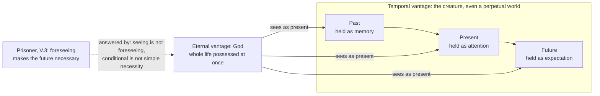

# Ancient & Medieval Philosophy · Lesson 5.3: Time, eternity and foreknowledge: Augustine and Boethius

> ⏱ ~15 min · Module 5: Augustine and Boethius · Builds on: [5.1 Augustine: certainty and illumination](05-01-augustine-certainty-and-illumination.md), [5.2 Augustine: evil and the will](05-02-augustine-evil-and-the-will.md), [3.6 The unmoved mover](03-06-the-unmoved-mover.md) · Unlocks: [6.1 Anselm and the *Proslogion* argument as history](06-01-anselm-and-the-proslogion-as-history.md)

## Why this matters

Two questions sound like riddles and turn out to shape a thousand years of thought. What was God doing before he made the world? And if God already knows what you will do tomorrow, how can you do otherwise? Augustine answers the first by asking what time is, and concludes that it lives in the soul. Boethius, a Roman senator writing in prison, answers the second with a definition of eternity that every medieval thinker after him uses, Anselm and Aquinas included. The "is it true?" questions belong to [`philosophy-of-religion`](../../philosophy-of-religion/syllabus.md) 1.3 and [`metaphysics`](../../metaphysics/lessons/05-01-the-a-theory-and-the-b-theory.md) Module 5. This lesson asks what the two men held, and why.

## The idea

**Augustine: time is measured in the mind.** Book X of the *Confessions* (c. 397–400) walks through memory, the "fields and spacious palaces of memory" (X.8), where images of things long gone are kept and brought out on demand. Book XI turns that power on time itself.

He starts from a mocking question: what was God doing before he made heaven and earth? He declines the joke answer, that God was preparing hell for people who pry into deep things (XI.12). His real answer is that the question has no content. God made time along with the world, so there was no "then" before there was time (XI.13). God does not precede the world by being earlier. He precedes it by eternity, where nothing passes: his "today" is eternity itself.

That leaves the harder question, what time is. Augustine's famous confession (XI.14) runs: *Quid est ergo tempus? Si nemo ex me quaerat, scio; si quaerenti explicare velim, nescio.* "What then is time? If no one asks me, I know; if I want to explain it to someone who asks, I do not know." (The lesson's translation.) The puzzle is that the past no longer exists, the future does not exist yet, and the present, squeezed between them, shrinks to a point with no length. Yet we measure times all the time: this syllable is long, that one short.

His answer is that we measure something *present in the soul*. The past is present as memory, the future as expectation, and the present as attention. When you recite a psalm you know, your expectation stretches over the whole of it at first. As you go on, the part in memory grows and the part in expectation shrinks, until the whole psalm has passed into memory (XI.28). Time, he concludes, is a *distentio animi*, a stretching-out of the soul (XI.26).

**Boethius: eternity is not a very long time.** Boethius (c. 477–524), condemned for treason under Theodoric, wrote the *Consolation of Philosophy* while awaiting execution. In Book V the prisoner puts a dilemma to Lady Philosophy. If God foreknows everything infallibly, it seems everything happens of necessity, and then praise, blame and prayer are pointless (V.3; the argument itself is reconstructed in [`philosophy-of-religion`](../../philosophy-of-religion/syllabus.md) 1.3). Philosophy's reply in V.6 has two steps.

First, God's knowledge must be understood through God's way of being, and God is eternal. Eternity is *interminabilis vitae tota simul et perfecta possessio*: roughly, "the whole, simultaneous and perfect possession of unending life." A world that lasted forever without beginning or end would still live its life one moment at a time, losing yesterday and not yet having tomorrow. Boethius says such a world should be called *perpetual*, not eternal. He mentions the view, which some ascribed to Plato, that the world has no beginning in time; Aristotle held the same ([3.6](03-06-the-unmoved-mover.md)). So God does not *fore*-see. He sees everything as present, the way you see a man walking and the sun rising in the same glance. It is better called *providentia*, a looking-forth, than *praevidentia*, a seeing-before.

Second, being seen does not make a thing happen necessarily in the sense that matters. Boethius distinguishes two kinds of necessity.

## Source

Boethius, *Consolation of Philosophy* V.6. Latin as in the standard editions; the English is the lesson's own translation.

> *Duae sunt etenim necessitates, simplex una, veluti quod necesse est omnes homines esse mortales, altera condicionis, ut si aliquem ambulare scias, eum ambulare necesse est; quod enim quisque novit, id esse aliter ac notum est nequit, sed haec condicio minime secum illam simplicem trahit.*
>
> For there are two necessities. One is simple, as that it is necessary that all men are mortal. The other is of condition, as that if you know someone is walking, it is necessary that he is walking. For what anyone knows cannot be otherwise than it is known; but this condition by no means drags that simple necessity along with it.

Mark three things. The examples differ in *source*: mortality comes from what humans are, while the walking is necessary only given the knowing. "Cannot be otherwise than it is known" is a fact about knowledge, not about the walker. And *minime secum trahit*, "by no means drags along", is the whole solution in three words.

## The argument

**Augustine on measuring time (*Confessions* XI.14–28).**

1. **The past is no longer and the future is not yet.** *In words:* neither of them exists now.
2. **The present, if it were always present and never passed into the past, would not be time but eternity** (XI.14). And any stretch of present time can be divided into parts that are past and future, so the present has no length. *In words:* "now" is a knife-edge.
3. **Yet we do measure times,** comparing long and short syllables and intervals. *In words:* measurement is a fact, so something measurable exists.
4. **What we measure must be present when we measure it.** *In words:* you cannot lay a ruler against something that does not exist.
5. **What is present is the impression (*affectio*) that passing things leave in the mind, and it stays when they have gone** (XI.27). *In words:* when I judge a syllable long, I am measuring its trace in memory, not the vanished sound.
6. **So time is a stretching of the soul across memory, attention and expectation** (XI.26–28). *In words:* time is where the mind holds together what is gone and what is coming.

**Boethius's reply to the prisoner (*Consolation* V.4–6).**

1. **Everything is known not by its own nature but by the nature of the knower** (V.4). *In words:* how something is known depends on what kind of thing knows it.
2. **God's nature is eternal: the whole of unending life possessed all at once.** *In words:* nothing in God's life is past or still to come.
3. **So God's knowledge embraces all times as present.** *In words:* God does not predict tomorrow. He sees it, as we see what is in front of us.
4. **Seeing something as present imposes no necessity on it.** When you watch a man walk, your watching does not make him walk. *In words:* knowledge follows its object; it does not push it.
5. **What God sees must happen, but only with conditional necessity.** If he sees it, it cannot fail to be as seen. *In words:* "necessarily, if known then so" is true of any knowledge.
6. **Conditional necessity does not bring simple necessity with it.** The walker walks by his own will, and nothing in his nature forces him to. *In words:* a thing can be certain from God's side and still free on its own side.
7. **So a free act seen by God is necessary given the seeing and free considered in itself.** *In words:* foreknowledge and freedom are not in competition.

## Map of positions

Read the left box as Augustine's three presents in one mind, and the arrows from the right as Boethius's single glance. The dashed edge is the prisoner's worry, which assumes God's knowledge sits *inside* the timeline, earlier than the act.

## Worked examples

**Example 1 (clean: the sun and the walker).** Boethius's own pair. You see, at one moment, the sun rising and a man walking. Your seeing puts no necessity on either one. Yet the two differ in themselves. The sun rises by necessity of nature (Boethius's physics, not ours), which is simple necessity: it would hold whether anyone saw it or not. The walker walks by choice, so his walking is necessary only on the condition that it is seen. Remove the seer and the necessity goes with it. Now put God in place of the glance. Since God's knowledge is a seeing of the present, it adds nothing to either event. The rising stays simply necessary, and the walking stays free, necessary only given that it is known.

**Example 2 (hard: the psalm and the unasked question).** Try Augustine's account on a case he sets himself: a psalm recited from memory. Before you begin, the whole is in expectation. Halfway through, half is in memory and half in expectation, and attention passes the words from one to the other. What you measure as "the psalm took two minutes" is the stretch between memory and expectation in your soul.

Now press it. Does time pass when no soul is attending, say for an unwatched rock? Augustine does not say. He is explaining how we *measure* time, and in XI.23 he argues that time is not simply the motion of the heavenly bodies: if the heavens stopped and a potter's wheel kept turning, there would still be time by which to measure its turns. Scholars disagree on how far the conclusion reaches. Some read *distentio animi* as a claim about time as such, and some as a claim about measured time only. Others ask whether the soul in question is the individual's or, as in Plotinus (*Enneads* III.7), a soul at the scale of the cosmos. Aristotle had raised a similar question: whether there could be time with no soul to count it (*Physics* IV.14). The text does not decide it. So say what Augustine *argued*, that measuring requires something present in the mind, and flag the rest as an interpretive choice.

## Watch out

- **You might think eternity is time that never ends.** Boethius's point is the opposite. Endless duration is *perpetuity*, lived piecemeal. Eternity is having the whole at once. A world without beginning, as Aristotle held, still would not be eternal in this sense.
- **You might think Boethius's two necessities are the modern scope distinction.** The later medieval labels *necessitas consequentiae* and *necessitas consequentis*, and the modal-logic reading $\Box(p \to q)$ versus $p \to \Box q$, are later analyses of what he says. They are useful but anachronistic as exegesis. Boethius's own contrast is between necessity from a thing's *nature* and necessity from an *added condition*. The modal treatment, Ockhamism and Molinism belong to [`philosophy-of-religion`](../../philosophy-of-religion/syllabus.md) 1.3.
- **You might think Augustine makes time an illusion or a Kantian form of intuition.** He does not deny that things change or that the world was created in time. His claim is about what time is when we measure it, and it is argued from memory and expectation, not from the conditions of experience. Calling him a "presentist" in the sense of [`metaphysics` 5.2](../../metaphysics/lessons/05-02-presentism-growing-block-eternalism.md) is also a stretch. That label belongs to a modern debate about what exists.
- **You might think God "foresees".** Boethius corrects the word: *providentia*, not *praevidentia*. On his account there is no "before" in God to see from.

## One-liner

> Augustine puts past, present and future into one attentive soul; Boethius puts all of time into one eternal glance, and a glance does not force what it sees.

## Problems

**P1 (🟢) *(Exegetical.)*** Using only the distinction in the Source passage, classify each necessity below as **simple**, **conditional**, or **both**. Name the nature or the condition responsible. One line each.

> (i) If you know that the angles of a triangle equal two right angles, they equal two right angles.
> (ii) A man who is sitting, while he sits, is sitting.
> (iii) If God sees Marcus choosing to lie tomorrow, Marcus lies.
> (iv) All men are mortal.
> (v) If you watch the sun rising, it rises (on Boethius's physics).

**P2 (🟡) *(Exegetical.)*** *Confessions* XI.20.26. The Latin is as in standard editions; the English is the lesson's own translation.

> *Nec proprie dicitur: tempora sunt tria, praeteritum, praesens et futurum, sed fortasse proprie diceretur: tempora sunt tria, praesens de praeteritis, praesens de praesentibus, praesens de futuris. Sunt enim haec in anima tria quaedam, et alibi ea non video: praesens de praeteritis memoria, praesens de praesentibus contuitus, praesens de futuris expectatio.*
>
> Nor is it properly said, "there are three times, past, present and future"; but perhaps it would properly be said, "there are three times, a present of things past, a present of things present, a present of things future." For these three are in the soul in some way, and elsewhere I do not see them: the present of things past is memory, the present of things present is sight, the present of things future is expectation.

Two readings. **(R1)** Augustine holds that past and future things really exist, stored in the soul. **(R2)** Augustine holds that only present things exist, namely memories and expectations *of* past and future things, which themselves do not exist. Which reading does the passage support? Quote the words that decide it, and say what *fortasse* ("perhaps") and *proprie* ("properly") tell you about the claim's status. 150 words or fewer.

**P3 (🔴, optional) *(Exegetical.)*** Aristotle defines time as the number of motion with respect to before and after (*Physics* IV.11). For Augustine, time is a stretching of the soul. Both face the same puzzle, that the past and future do not exist (Aristotle raises it in IV.10). Name the single premise in Augustine's argument (see The argument) that does the most to push time into the soul, and that Aristotle's account need not accept. Then say what consideration might move a reader toward either side. 150 words or fewer.

Solutions

**P1** *(Exegetical — strict.)*

**Must hit, strict:**
- (i) **Both.** The knowing gives conditional necessity, but the theorem is necessary from the nature of the triangle anyway. The condition does not create the necessity here. It just rides along with it.
- (ii) **Conditional.** Condition: that he is sitting. Nothing in his nature forces him to sit. This is Boethius's walker with a different verb.
- (iii) **Conditional.** Condition: God's seeing. Lying is a choice, so it has no simple necessity. This is the case the whole distinction exists for.
- (iv) **Simple.** It comes from human nature, and no condition is needed. It is the passage's own example.
- (v) **Both.** The watching adds conditional necessity, and on Boethius's physics the sun rises by nature as well (Example 1).

**Wrong turns:** calling (iii) simple because God's knowledge is infallible, which is exactly the prisoner's mistake. The infallibility belongs to the knowing, not the act. Calling (i) and (v) merely conditional because they are phrased with "if", which misses that a condition can sit on top of a simple necessity without being its source.

**Model answer:** (i) both, from the triangle's nature and the knowing; (ii) conditional, on his sitting; (iii) conditional, on God's seeing, with no necessity in the choice; (iv) simple, from human nature; (v) both, from nature and the watching.

---

**P2** *(Exegetical — strict.)*

**Must hit, strict:**
- The passage supports **R2**. The three "times" are *praesens de*: a present *of* or *about* things past and future, and each is named as a present act of the soul (*memoria*, *contuitus*, *expectatio*).
- Deciding words: *praesens de praeteritis memoria* identifies what exists with memory, a present thing, not with the past things themselves. *Alibi ea non video* says these three are found only in the soul, which fits memories and expectations. It would be odd to say it of past events themselves.
- *Proprie* and *fortasse*: Augustine is proposing a more *accurate* way to speak, hedged with "perhaps". He is not banning ordinary talk of three times. In the lines that follow he lets ordinary usage stand, provided it is understood (XI.20.26). Credit for noting the hedge even without that follow-up.

**Wrong turns:** reading *in anima* as "past things are kept in the soul" (R1). The text puts *memory* in the soul, and XI.18 says what memory yields is images of past things, not the things. Treating the passage as a denial that anything was ever past.

**Model answer:** R2. Augustine replaces "past, present, future" with three *presents*, a present *of* things past and so on, and then identifies each with a present act of the soul: *memoria*, *contuitus*, *expectatio*. What exists now is the memory, not the past thing. *Alibi ea non video* fits that: memories and expectations are found only in minds. *Proprie* marks this as the strict way of speaking, and *fortasse* marks it as tentative. He is refining ordinary speech, not forbidding it.

---

**P3** *(Exegetical — strict on naming one premise; any defensible statement of the considerations passes.)*

**Must hit, strict:**
- The premise: **what is measured must be present, existing whole, at the time it is measured** (premise 4). Together with the non-existence of past and future, it forces the measured item to be something present that holds past and future together, and only the soul does that.
- Aristotle need not accept it. For him time is an attribute *of motion*: something countable in a real change marked off by "nows" as before and after. Counting a motion does not require that the whole motion exist at one instant. He does raise whether time needs a soul that counts (IV.14), so the difference is real but not total. Hedging this is expected.
- A consideration either way, e.g. toward Augustine: comparing a finished syllable with a current one seems to require *something* now that holds the finished one. Toward Aristotle: we date and order changes no one witnessed, which suggests time belongs to the changes themselves.

**Wrong turns:** naming "whether God exists" or "whether the world had a beginning" (neither drives XI.14–28); naming premise 1, which Aristotle also states as a puzzle; saying Aristotle holds time is motion (he denies it, IV.10–11: time is the *number* of motion).

**Model answer:** The crux is Augustine's premise that what we measure must be present when we measure it. Add that past and future do not exist, and the measured thing has to be a present impression in the mind. Aristotle need not grant it. Time is the number of motion in respect of before and after, a feature of real changes, and counting a motion does not require it to exist all at once. (He does ask whether time could exist with no soul to count, so they are not wholly opposed.) Augustine's side gains from the fact that comparing a gone syllable with a present one needs something present to compare. Aristotle's side gains from our dating changes no one observed.

## Flashback

**From Lesson 5.1 (Augustine: certainty and illumination):** *(Exegetical (a) · Evaluative (b).)* Half-awake at dawn, you form six beliefs: (i) the bell in the tower is ringing; (ii) it sounds to me as if a bell is ringing; (iii) either a bell is ringing or none is; (iv) I am alive; (v) the bell is made of bronze; (vi) twice four is eight. (a) Sort them into those the Academic "what if you are deceived?" can reach and those it cannot, as Augustine argues, with one line of reason each. (b) An Academic replies: "Your safe beliefs are safe only because they say nothing about the world. The sage still has to suspend judgment on everything worth knowing." Does this answer Augustine's argument against the Academics, or change the subject? Any verdict; 100 words or fewer.

Solution

**Must hit, strict (a):**
- **Reachable:** (i) and (v). Both are claims about a thing outside the mind, known through a sense impression, and a dream could supply an indistinguishable false twin.
- **Not reachable:** (ii), a report of how things appear, which stays true even in a dream. (iii), a disjunction, true whichever way the world is. (iv), since whoever doubts or is deceived is alive (*On the Trinity* X.10). (vi), a truth of number, grasped without a sense image and the same in every mind.

**Must hit, any verdict (b):**
- State Augustine's target exactly. It is the universal thesis that nothing can be known, and a single counterexample refutes it (premise A6).
- Notice that the reply concedes the counterexamples and shifts from *whether* anything is known to *whether anything useful* is.
- Decide, with the step that decides. Either the shift is a retreat, because the Academic's official thesis was universal. Or it is fair, because the Academic cared about the sage's assent to impressions of the world, and Augustine has left that untouched (Example 1: the Stoic does not get his cognitive impression back). Credit a verdict that notes Augustine also claims more than trivia: truths of number and wisdom, common to all minds.

**Wrong turns:** putting (ii) with the reachable beliefs because it mentions a sound. It reports a seeming, not a bell. Putting (vi) there because arithmetic can be miscalculated. The Academic premise concerns impressions from outside things, not slips in working a sum. In (b), arguing that the senses are reliable after all, which neither side claims.

**Model answer (b), one of several:** Partly both. Against the thesis as stated, "nothing can be known", the reply concedes defeat: one certain truth refutes a universal negative, and Augustine has several. But the Academic's real concern was assent to impressions of things outside the mind, and Augustine leaves that untouched. So the reply does change the subject from the thesis, though not from the Academic's project. Augustine's best answer is that truths of number and wisdom are hardly "nothing worth knowing".

## Connections

- **Backward:** Augustine's turn inward, finding certainty in the mind's own acts ([5.1](05-01-augustine-certainty-and-illumination.md)), is the same move that locates time in memory and expectation. The will whose freedom Boethius protects is the power [5.2](05-02-augustine-evil-and-the-will.md) made the source of moral evil. Aristotle's first mover ([3.6](03-06-the-unmoved-mover.md)) moves an eternal world, which is exactly the "perpetual" world Boethius refuses to call eternal. Plotinus's hierarchy ([4.4](04-04-plotinus-the-one-intellect-and-soul.md)) supplies both men's contrast between a life lived all at once and soul's life spread out in succession.
- **Forward:** Anselm ([6.1](06-01-anselm-and-the-proslogion-as-history.md)) inherits Boethius's eternity and uses it to discuss foreknowledge and freedom in his own work. Whether the world's duration is *demonstrably* finite returns in [6.3](06-03-averroes-and-maimonides.md) and [7.1](07-01-faith-reason-and-the-paris-crisis.md). Boethius's definition shapes Aquinas's account of divine eternity. Whether timeless eternity actually defuses the foreknowledge argument is [`philosophy-of-religion`](../../philosophy-of-religion/syllabus.md) 1.3's question, where Boethius's pair of necessities becomes a modal distinction.
- **Sideways:** Augustine's measured time against Aristotle's time-in-motion prefigures the modern A-theory and B-theory debate in [`metaphysics` 5.1](../../metaphysics/lessons/05-01-the-a-theory-and-the-b-theory.md). "Necessity from nature" versus "necessity given a condition" is a first pass at the kinds of necessity in [`metaphysics` 3.1](../../metaphysics/lessons/03-01-kinds-of-necessity.md) and at the fatalism worries of [`metaphysics` 6.1](../../metaphysics/lessons/06-01-determinism-and-the-consequence-argument.md). The *Confessions* as a theology of conversion is [`patristics`](../../patristics/syllabus.md)'s.
