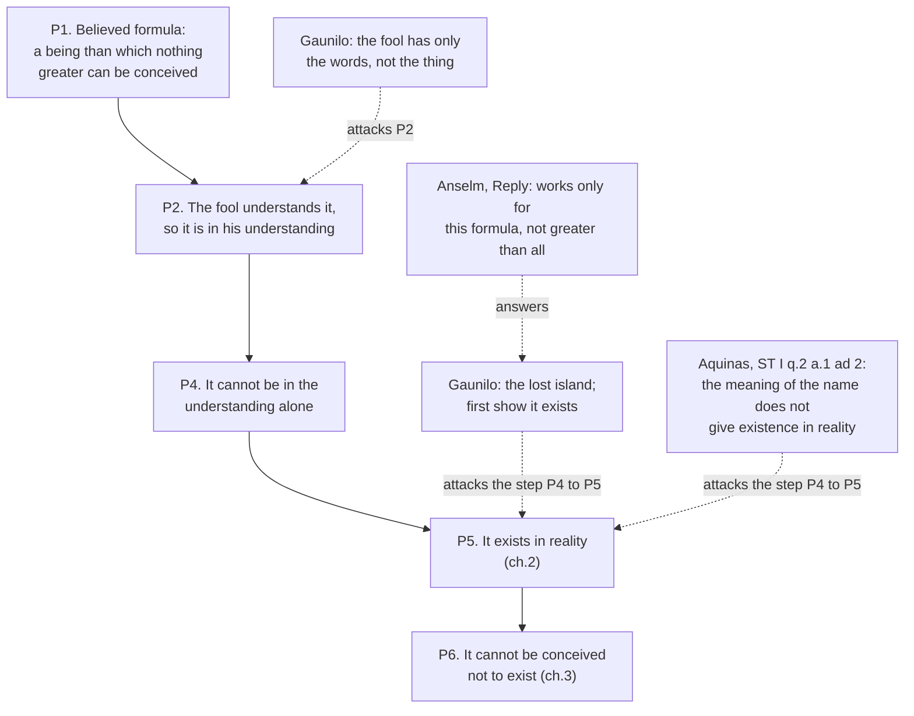

# Ancient & Medieval Philosophy · Lesson 6.1: Anselm and the Proslogion argument as history

> ⏱ ~15 min · Module 6: Anselm, and the Arabic and Jewish philosophers · Builds on: [5.1 Augustine: certainty and illumination](05-01-augustine-certainty-and-illumination.md) · Unlocks: [6.2 Avicenna: essence, existence and the necessary existent](06-02-avicenna-essence-existence-and-the-necessary-existent.md)

## Why this matters

The most argued-over paragraph in the philosophy of religion was written by a Benedictine abbot in Normandy, in the form of a prayer, for monks who already believed its conclusion. Most people meet it as "the ontological argument", a puzzle to be refuted in a seminar. This lesson reads it as history instead. What did Anselm think he was doing? How did the argument differ from his earlier book? And what happened when a fellow monk wrote a reply on behalf of the fool, and a Dominican two centuries later turned it down? Whether the argument works belongs to [`philosophy-of-religion`](../../philosophy-of-religion/syllabus.md) 2.1. Here the question is what it was.

## The idea

Anselm (1033–1109) was born in Aosta, became a monk and then abbot at Bec in Normandy, and in 1093 became archbishop of Canterbury. He wrote two short books on God within a couple of years of each other, and they are built in opposite ways.

The **Monologion** (1075–76) came from requests by his monks. By his own account in its preface, they asked him to put his conversations on the being of God into writing and to argue without leaning on the authority of Scripture, using plain arguments and the force of reason. The result is a *chain*: from the many goods we experience to one thing through which they are all good, then on to a supreme nature and a long run of its attributes. Anselm adds that nothing in it disagrees with the Fathers, "especially" Augustine. The debt shows in the method, which climbs from degrees of goodness to the Good itself, as the Platonist ascent did in [5.1](05-01-augustine-certainty-and-illumination.md).

The **Proslogion** (1077–78) came from dissatisfaction with that chain. The preface says he went looking for a *single* argument that would need nothing else to prove it, and would show both that God exists and whatever we believe about God. He gave up, the idea kept coming back, and at last he found it. The book is a speech addressed to God. Its original title was *Faith Seeking Understanding* (*fides quaerens intellectum*), and chapter 1 ends in the line his later readers made famous: "For I do not seek to understand that I may believe, but I believe in order to understand" (Deane's translation).

So there are two ways to read what follows. On one, it is a proof: an argument from a definition that anyone who understands the words, the fool of Psalm 14 included, should accept. On the other, most influentially Karl Barth's *Fides quaerens intellectum* (1931), it is theology done inside faith: the believer working out the inner logic of a name for God he already holds, not an appeal to an unbeliever on neutral ground. Both readings have serious defenders. Deciding between them from the text is Module 6's boss problem.

## Source

Anselm, *Monologion* ch.1 (Deane, 1903, public domain). This is the heart of the chain argument the *Proslogion* was meant to replace:

> It is easy, then, for one to say to himself: Since there are goods so innumerable, whose great diversity we experience by the bodily senses, and discern by our mental faculties, must we not believe that there is some one thing, through which all goods whatever are good? Or are they good, one through one thing, and another through another? To be sure, it is most certain and clear, for all who are willing to see, that whatsoever things are said to possess any attribute in such a way that in mutual comparison they may be said to possess it in greater, or less, or equal degree, are said to possess it by virtue of some fact, which is not understood to be one thing in one case and another in another, but to be the same in different cases, whether it is regarded as existing in these cases in equal or unequal degree.

## The argument

***Proslogion* 2–3, in outline only.** The full reconstruction, with the classic replies weighed, is [`philosophy-of-religion`](../../philosophy-of-religion/syllabus.md) 2.1. Anselm's terms, in Deane's English:

1. **We believe that God is "a being than which nothing greater can be conceived."** *In words:* the argument starts from a formula for what believers mean by "God", not from anything observed.
2. **The fool who says in his heart "there is no God" understands this formula when he hears it, and what is understood is in the understanding.** *In words:* even the denier has the idea before him, or he would not know what he denies.
3. **To be in the understanding is not yet to be understood to exist.** Anselm's example is a painter, who has the picture in mind before he paints it. *In words:* having an idea and knowing its object is real are two different things.
4. **That than which nothing greater can be conceived cannot be in the understanding alone,** since then it could be conceived to exist in reality as well, which is greater. *In words:* if it were only an idea, you could think of something greater, namely the same thing existing, and that contradicts the formula.
5. **So it exists both in the understanding and in reality.** *In words:* the formula, once understood, cannot pick out something merely imagined.
6. **(Ch.3.) A being that cannot be conceived not to exist is greater than one that can, so God cannot even be conceived not to exist.** *In words:* God's existence is not just a fact but a necessity, and chapter 3 ends by addressing God: "this being thou art, O Lord, our God."

**The exchange.** Gaunilo, a monk of Marmoutiers, answered with *On Behalf of the Fool*. He made two main moves. First, a fool who hears "God" has only the words: he has no genus, species or familiar fact to conceive the thing by, so it is "in the understanding" only the way doubtful or unreal things are. Second, the **lost island**, an island more excellent than all lands. Anyone who argued that it must exist because an existing island would be more excellent would be jesting, and the arguer ought first to show that it really exists. Anselm's *Reply* answers "the Catholic" rather than the fool. It calls on Gaunilo's "faith and conscience" that the formula is really understood. It says Gaunilo misquoted him: "greater than all" is not his formula, and a being greater than all cannot be shown to exist in the same way. And it promises that if anyone fits the reasoning to anything *except* that than which a greater cannot be conceived, Anselm will give him his lost island, "not to be lost again." The exchange is reported to have circulated with the *Proslogion* at Anselm's own wish.

## Argument map

Solid arrows are Anselm's steps. Dashed edges are the medieval reception, with the point each reply presses.

## Worked examples

**Example 1 (clean): running the *Monologion* chain.** Take the Source passage. Its claim is general: whenever things are compared as more or less or equally *F*, they are *F* through something that is the same in each. Anselm's model is justice, since whatever is just is just through justness. Apply it to goods and you get **one thing through which all goods are good**.

Anselm then raises the obvious objection himself. A horse is called good because it is strong, and good because it is swift, and strength is not swiftness, so goods look like they are good through different things. His reply is that a strong, swift *robber* is bad. Strength and speed therefore were not what made the horse good. What did was usefulness, and goods in general are good either by usefulness or by honourable character (*honestas*), both of which trace back to the one thing. That thing is good *through itself*, since everything else is good through it, and what alone is good through itself is **supremely good**. Later chapters run the same pattern on greatness and on being.

Notice three things. The engine is a **one-over-many** premise, the lineage of [2.1](02-01-the-forms-and-what-goes-wrong-with-them.md) through Augustine. The argument starts from goods we *experience*, so it runs upward from the world. And it takes many steps and many chapters, each leaning on the last. That is exactly what the *Proslogion* preface says Anselm wanted to escape.

**Example 2 (hard): does Aquinas reject *Anselm*?** ST I q.2 a.1 asks whether God's existence is **self-evident**. Objection 2 runs an Anselm-shaped argument from the meaning of "God", though Anselm is not named. Aquinas's answer draws a distinction. A proposition can be self-evident *in itself*, when the predicate belongs to the notion of the subject, or self-evident *to us*, when we know what the subject is. "God exists" is self-evident in itself, he holds, because God is his own existence, but it is not self-evident to us. In the reply to objection 2 he says that not everyone takes "God" to mean that than which nothing greater can be thought, and that even granting the meaning, what follows is existence in the mind, not in reality, unless one already grants that such a thing actually exists. His own route, in a.2 and the Five Ways ([7.3](07-03-the-five-ways-as-text.md)), goes from effects we know to their cause.

The strain is historical. Anselm never called his argument an appeal to self-evidence. *Proslogion* 4 even explains how the fool manages to *say* "there is no God": he thinks the words without thinking the thing. By filing the argument under "self-evident" and answering it in a single reply to an objection, Aquinas reframes it inside his own question. Two things follow. Aquinas's rejection is not a rejection of proving God, since a.2 says God's existence can be demonstrated. And whether his objection meets Anselm's reasoning or only a compressed version of it is a real interpretive dispute, and a good one to keep open until the boss problem.

## Watch out

- **Anachronism: "the ontological argument" is not Anselm's name for it.** The label is Kant's, given centuries later to a family that includes Descartes's Meditation V. Anselm had "one argument" in a book called *Faith Seeking Understanding*. Reading Kant's taxonomy back into 1078 makes Anselm answer questions he never asked.
- **You might think Gaunilo was a skeptic or an atheist.** He was a monk, whom Anselm himself calls "a Catholic", writing *on behalf of* the fool. The quarrel is over whether this argument proves what both men believed.
- **You might think the *Proslogion* is the *Monologion* shortened.** They differ in kind. One is a chain upward from experienced goods, the other a single argument from a formula grasped by the understanding. That difference is what [6.2](06-02-avicenna-essence-existence-and-the-necessary-existent.md) and Aquinas's route from effects put in sharper form.
- **You might think "faith seeking understanding" means faith *replacing* reason, or reason replacing faith.** In Anselm's use, faith is the starting point and understanding is the real intellectual work done from it. The theological programme is [`fundamental-theology` 1.1](../../fundamental-theology/lessons/01-01-what-fundamental-theology-asks.md)'s.

## One-liner

> Anselm traded the *Monologion*'s long climb from goods to the Good for one argument from a believed formula, and the reception from Gaunilo's island to Aquinas's "not self-evident to us" is a quarrel among believers over what that formula can do.

## Problems

**P1 (🟢) *(Exegetical.)*** Read *Monologion* ch.1 (Deane), two excerpts:

> IF any man, either from ignorance or unbelief, has no knowledge of the existence of one Nature which is the highest of all existing beings, […] he still believes that he can at least convince himself of these truths in great part, even if his mental powers are very ordinary, by the force of reason alone.
>
> And if, in this discussion, I use any argument which no greater authority adduces, I wish it to be received in this way: although, on the grounds that I shall see fit to adopt, the conclusion is reached as if necessarily, yet it is not, for this reason, said to be absolutely necessary, but merely that it can appear so for the time being.

Reading A: Anselm claims his reason-alone conclusions are strict demonstrations, binding whatever any authority says. Reading B: he claims they are reached by reason, but are necessary only provisionally and give way to greater authority. Which reading does the text support, and which **three** words or phrases decide it? Say also how much the first excerpt claims reason can reach. 100 words or fewer.

**P2 (🟡) *(Exegetical.)*** Read Gaunilo, *On Behalf of the Fool* §6, and Anselm's *Reply* ch.3 (both Deane):

> If a man should try to prove to me by such reasoning that this island truly exists, and that its existence should no longer be doubted, either I should believe that he was jesting, or I know not which I ought to regard as the greater fool: myself, supposing that I should allow this proof; or him, if he should suppose that he had established with any certainty the existence of this island. For he ought to show first that the hypothetical excellence of this island exists as a real and indubitable fact, and in no wise as any unreal object, or one whose existence is uncertain, in my understanding.

> Now I promise confidently that if any man shall devise anything existing either in reality or in concept alone (except that than which a greater cannot be conceived) to which he can adapt the sequence of my reasoning, I will discover that thing, and will give him his lost island, not to be lost again.

Treat this as a historical exchange, not a question of who is right. (a) State the general rule Gaunilo's "ought to show first" commits him to. (b) Name the single premise Anselm denies, and the words in his promise that mark the denial. (c) Using *Reply* ch.5 as summarized in the lesson, say what Anselm thinks Gaunilo got wrong about his formula, and why that matters to the island. Do not assess whether either reply succeeds. 150 words or fewer.

**P3 (🔴, optional) *(Exegetical.)*** Diagnose this invented seminar contribution. Name every historical error or anachronism it contains, and give the correction for each. 150 words or fewer.

> "Anselm's ontological argument was the medieval rationalists' bid to replace faith with pure logic: a proof built to convert atheists who refused Scripture. His critic Gaunilo, a skeptic, showed it could prove a perfect island. Aquinas, as a man of faith, then rejected it because he held that God's existence cannot be proved at all."

Solutions

**P1** *(Exegetical, strict.)*

**Must hit, strict:**
- **Reading B.** The deciding words are "as if necessarily", "not … said to be absolutely necessary", and "can appear so for the time being". "No greater authority adduces" also counts, since it sets the reasoning below greater authority.
- On scope: reason alone can convince someone of these truths "in great part", even with "very ordinary" mental powers. That is a large claim about reason's *reach*, alongside a modest claim about the *certainty* of any one argument.

**Wrong turns:** taking "by the force of reason alone" as evidence for Reading A, when it says what the method uses, not how certain its results are. Reading "in great part" as "entirely".

**Model answer:** Reading B. Anselm says a conclusion is reached "as if necessarily" but is "not … said to be absolutely necessary", only that it "can appear so for the time being", and he offers this for arguments "no greater authority adduces". Reason alone can nonetheless reach these truths "in great part", even for an ordinary mind. So he claims a wide reach but a provisional certainty.

---

**P2** *(Exegetical, strict.)*

**Must hit, strict:**
- (a) Gaunilo's rule: from something's being in the understanding, even as the most excellent of its kind, you cannot infer that it exists in reality. Its reality must be shown **first**, independently, and only then can you reason from its excellence.
- (b) Anselm denies that the rule holds **without exception**. There is exactly one case, "that than which a greater cannot be conceived", where the reasoning from understanding to reality goes through. The marking words are "(except that than which a greater cannot be conceived)" and "adapt the sequence of my reasoning". The promise says the island is not a case of *his* argument.
- (c) Ch.5: Gaunilo keeps restating the formula as "greater than all", and Anselm says a being greater than all other beings cannot be shown to exist in the same way. The island is "more excellent than all lands", the best of its kind, so Gaunilo's parody runs on the misquoted formula, not Anselm's.

**Wrong turns:** saying the crux is whether God exists (both believe it). Adding a verdict on whether the island parody works, which the problem excludes and `philosophy-of-religion` 2.1 owns. Naming two premises.

**Model answer:** (a) Gaunilo holds that nothing's existence can be inferred from its being in the understanding, however excellent it is conceived to be. Its existence must be shown first. (b) Anselm denies that this holds for every concept. The parenthesis "except that than which a greater cannot be conceived" limits "the sequence of my reasoning" to one formula, so anything else, the island included, is outside the argument. (c) Anselm says Gaunilo misquoted him as arguing from "greater than all", which he never did. The island is greatest *among lands*, a comparative within a kind, so on Anselm's account the parody copies the misquotation, not his formula.

---

**P3** *(Exegetical, strict.)*

**Must hit, strict** (any four of the five, with corrections):
- **"Ontological argument"** is Kant's label, not Anselm's. Anselm sought "one argument" in a book first titled *Faith Seeking Understanding*.
- **"Replace faith"**: Anselm's stated order is belief first, understanding after (*Proslogion* 1). The book is addressed to God as a prayer.
- **"Built to convert atheists"** is one contested reading, not a fact. Barth and others read it as theology within faith. The *Monologion*, not the *Proslogion*, was the book written without appeal to Scripture at the monks' request.
- **Gaunilo a skeptic**: he was a monk of Marmoutiers writing *on behalf of* the fool, and he believed God exists.
- **Aquinas held God unprovable**: ST I q.2 a.2 holds that God's existence can be demonstrated from effects. He rejected only the claim that it is self-evident *to us*, and the step from the meaning of the name.

**Wrong turns:** "correcting" the passage by declaring that the argument works or fails. Calling Aquinas's objection a rejection of reason in theology.

**Model answer:** "Ontological argument" is Kant's later label. Anselm wanted a single argument, in a book first called *Faith Seeking Understanding*. He says he believes in order to understand, so he is not replacing faith, and the book is a prayer. That it was built to convert unbelievers is one disputed reading, and Barth reads it as theology inside faith. Gaunilo was a believing monk writing on the fool's behalf, not a skeptic. Aquinas thought God's existence demonstrable from effects (ST I q.2 a.2). He denied only that it is self-evident to us, or follows from what the name means.

## Flashback

**From Lesson 5.2 (Augustine: evil and the will):** *(Exegetical (a) · Evaluative (b).)* A man sets fire to his town's archive at night. The records are lost and a watchman's hand is badly burned. (a) Run Augustine's account on three items: the charred records, the watchman's burned hand, and the man's choice. For each, say whether it is evil done or evil suffered, what good thing the evil is in, and what that thing lacks. One line each. (b) At trial the man says: "I didn't want money or revenge or anything else. I wanted the destruction itself." Does step 9, iniquity as a good will turning toward *lower goods*, survive a will that seems to aim at no good at all? Any verdict; 100 words or fewer.

Solution

**Must hit, strict (a):**
- **Records:** evil suffered. It is in good substances, the parchment and the order of writing on it, and what they lack is their proper form and use. The fire is not a dark substance either: it is a good nature acting where it should not.
- **Hand:** evil suffered. It is in the watchman's flesh, a good substance, and what it lacks is health and soundness. This is Augustine's wound: a defect in the flesh, not a thing lodged in it.
- **Choice:** evil done. It is in the man's will, a middle good that can be used well or badly, and what it lacks is right order. It has turned from higher goods, such as justice and his neighbours' good, toward lower ones.

**Must hit, any verdict (b):**
- State the threat. If a will can aim at evil *as such*, then evil is a positive object of desire, and the privation account of the will is in trouble.
- Use Augustine's resources. On his view whatever is, is good, so any object of the will is some good wrongly ranked. Even "destruction" is pursued as a display of power, freedom from constraint, or a thrill, which are real but lower goods.
- Decide whether that redescription is found in the case or imposed on it, and give a verdict with the step that decides it.

**Wrong turns:** calling the fire itself the evil, which is the Manichaean move of looking for an evil stuff. Classing the burned hand as evil done because a wrongdoer caused it: it is suffered *by the watchman*. In (b), sliding into whether the privation account solves the problem of evil, which is not asked.

**Model answer (b), one of several:** It can survive, at a price. Augustine would say no will aims at sheer nothing. The man wants something the destruction gives him: mastery, a spectacle, or the freedom of breaking a rule. Each is a real good, loved out of order. Augustine runs just this test on his own boyhood theft of pears in *Confessions* II, where what first looks like loving the wrong for its own sake turns out to involve companionship and a perverse imitation of God's power. The cost is that the account becomes unfalsifiable if every stated motive can be redescribed this way. Verdict: consistent, but it shows the account is an interpretive commitment rather than a finding.

## Connections

- **Backward:** the *Monologion*'s climb from many goods to the one Good is Augustine's Platonist ascent from [5.1](05-01-augustine-certainty-and-illumination.md), and its engine, one thing through which all *F* things are *F*, is the one-over-many that posited the Forms in [2.1](02-01-the-forms-and-what-goes-wrong-with-them.md). Setting out Anselm's steps and Gaunilo's pressure point is [`philosophical-method` 1.3](../../philosophical-method/lessons/01-03-reconstruction-and-charity.md) and [4.3](../../philosophical-method/lessons/04-03-finding-the-crux.md) at work.
- **Forward:** [6.2](06-02-avicenna-essence-existence-and-the-necessary-existent.md) gives a rival route to a necessary being that starts from contingent existents, not a formula. [7.3](07-03-the-five-ways-as-text.md) reads Aquinas's own route, and his fourth way, from grades of goodness and being, has a close cousin in the *Monologion* chain. The argument's modern careers belong to [`modern-philosophy`](../../modern-philosophy/syllabus.md) (Descartes in 1.3, Kant's critique in 6.3). Whether any of it succeeds is [`philosophy-of-religion`](../../philosophy-of-religion/syllabus.md) 2.1.
- **Sideways:** "faith seeking understanding" as the programme of theology is [`fundamental-theology` 1.1](../../fundamental-theology/lessons/01-01-what-fundamental-theology-asks.md). *Proslogion* 3's "cannot be conceived not to exist" is the ancestor of the necessary-existence debates in [`metaphysics` 3.3](../../metaphysics/lessons/03-03-brute-facts-and-necessary-existence.md).
