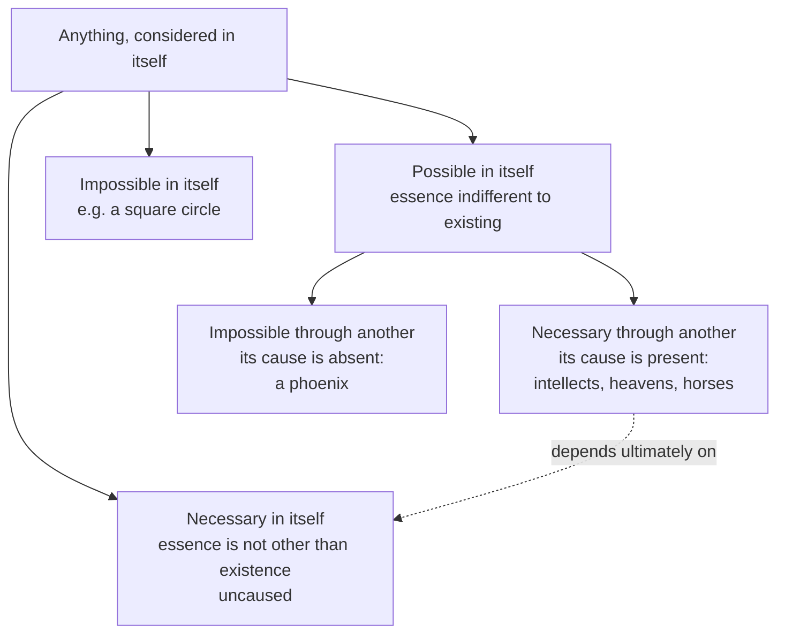

# Ancient & Medieval Philosophy · Lesson 6.2: Avicenna: essence, existence and the necessary existent

> ⏱ ~15 min · Module 6: Anselm, and the Arabic and Jewish philosophers · Builds on: [3.4 Substance and essence](03-04-substance-and-essence.md), [3.6 The unmoved mover](03-06-the-unmoved-mover.md), [4.4 Plotinus: the One, Intellect and Soul](04-04-plotinus-the-one-intellect-and-soul.md) · Unlocks: [6.3 Averroes and Maimonides](06-03-averroes-and-maimonides.md)

## Why this matters

Aristotle asked what a thing *is*. He never made much of the separate question of *that* it is. Avicenna did, and the distinction he drew between a thing's essence and its existence became the backbone of medieval metaphysics: Aquinas builds on it ([7.2](07-02-aquinas-essence-and-existence.md)), Scotus builds his common nature from it ([8.3](08-03-scotus-common-nature-and-haecceity.md)), and the Third Way of the *Summa* borrows its logic ([7.3](07-03-the-five-ways-as-text.md)). He also gave the Middle Ages a route to a first cause that needs neither motion nor a beginning of the world, and a thought experiment, the flying man, that reads like Descartes six centuries early.

## The idea

**The setting.** From the eighth century to the tenth, Greek philosophy and science were translated into Arabic, much of it in Baghdad. Al-Kindi (d. c. 870), remembered as "the philosopher of the Arabs", argued that philosophy and revelation could be friends. Al-Farabi (d. 950) was so thorough an Aristotelian that he was called the "Second Teacher", after Aristotle himself. Ibn Sina (980–1037), Latinized as Avicenna, was a physician and polymath whose encyclopedia *The Healing* (*al-Shifa*) recast the whole Aristotelian corpus in his own order. His autobiography tells a story, which we have only from him, that he read Aristotle's *Metaphysics* forty times without grasping its purpose until a short treatise by al-Farabi unlocked it.

**Essence in itself.** Think about what it is to be a horse, *horseness*, with everything else stripped away. Is horseness one or many? Neither: if it were one by definition, there could not be many horses; if it were many, there could not be one. Is it in this horse in the field, or in your mind as a concept? Neither again: it can be in both, so it is not by definition in either. Avicenna's slogan, in the *Metaphysics* of *The Healing* V.1, is that horseness, taken in itself, is just horseness. Unity, plurality, being in things, being in a mind: all of these come to the essence from outside. (Paraphrased; no public-domain English translation exists.)

**Existence comes to the essence.** Now apply the same test to existence. You can understand perfectly what a phoenix is and still not know whether any exist. So existing is not part of what a phoenix *is*. For almost everything, existence is something that comes to or accompanies an essence rather than a piece of it. That is the distinction.

**The payoff.** If a thing's essence does not contain its existence, then nothing in what the thing is explains why it exists rather than not. Something else must. Follow that thought all the way up and you reach a being that needs nothing else: the necessary existent.

## The argument

**The modal division (*Metaphysics* of *The Healing* I.6; also *al-Najat* and *al-Isharat*).**

1. **Whatever is considered in itself is either necessary, possible or impossible in itself.** *In words:* look only at what a thing is, and ask whether that alone guarantees its existence, rules it out, or leaves it open.
2. **The possible in itself is indifferent to existing and not existing, so if it exists, something outside it tips the balance: a cause.** *In words:* a horse's essence does not decide whether horses exist, so an existing horse owes its existence to something other than its horseness.
3. **Given its cause, a possible thing is necessary through another; without its cause, it is impossible through another.** *In words:* once the cause is there the effect cannot fail to follow, so on Avicenna's view "possible" never means "might just happen".
4. **The necessary in itself has no cause, and its essence is not other than its existence** (*Metaphysics* VIII.4). *In words:* there is no gap between what it is and that it is for a cause to fill.

**The proof of the truthful (*al-Isharat*, the fourth class).** Avicenna says this is the way of the "truthful" (*siddiqin*): they reason from existence itself rather than from any particular created effect. Later tradition named the argument after that remark.

1. **There is something existent.** *In words:* the argument starts from bare existence, not from motion, order or design.
2. **Every existent is either necessary in itself or possible in itself.** *In words:* premise 1 of the division, applied to what exists.
3. **If it is necessary in itself, a necessary existent exists.** *In words:* the conclusion is reached straight away.
4. **If it is possible in itself, take the totality of all possible existents, however many there are, finitely or infinitely many.** *In words:* do not trace a chain back step by step; take the whole collection at once.
5. **That totality exists only through its members, each of which is possible, so it is itself possible in itself and needs a cause.** *In words:* a collection of things that need a cause does not stop needing one because the collection is large.
6. **The cause cannot be the totality itself, because nothing causes itself, and it cannot be one of its members, because that member would then cause itself along with the rest.** *In words:* every internal candidate is already one of the things needing a cause.
7. **So the cause lies outside every possible existent, and what is not possible in itself is necessary in itself.** *In words:* a necessary existent exists.

Notice what premise 4 buys. Avicenna, like Aristotle, held that the world has no beginning in time. The proof does not need one. An infinite regress of causes is simply included in the totality.

**The flying man (*De Anima* of *The Healing* I.1 and V.7).** Imagine a man created all at once and fully mature, suspended in empty air, eyes covered, limbs spread so that they touch nothing, in air that he cannot feel. He has no memory and no sensation. Avicenna claims that he would still affirm that he himself exists, without affirming that he has a body or any bodily part. What is affirmed is not the same as what is not affirmed, so, Avicenna concludes, the self is not the body. He offers it as an aid to someone able to notice it, not as a demonstration. How much it proves is disputed.

## Map of positions

**How the routes differ.** Aristotle ([3.6](03-06-the-unmoved-mover.md)) argues from eternal *motion* to a mover that moves as an object of love, a final cause; the argument belongs to physics and theology together. Avicenna holds that metaphysics must establish its own first principle from existence as such, and his necessary existent is the *giver of existence*, from which everything else emanates through a hierarchy of intellects, a structure closer to Plotinus's procession ([4.4](04-04-plotinus-the-one-intellect-and-soul.md)) than to Aristotle's mover. Anselm ([6.1](06-01-anselm-and-the-proslogion-as-history.md)) starts from what is understood by a name, not from anything that exists. Whether any of these routes succeeds belongs to [`philosophy-of-religion`](../../philosophy-of-religion/syllabus.md).

## Worked examples

**Example 1 (clean: running the division on a horse).** A foal is born in a field. In itself its essence is horseness, which is indifferent to existence: there have been times without this horse. So the foal is possible in itself (premise 2). It exists, so a cause is present: its parents, and, for Avicenna, the celestial causes and the intellect that gives forms to matter. Given those causes it could not have failed to exist, so it is necessary through another (premise 3). Its parents are in the same position, and so is their cause. Now the proof of the truthful runs: gather the foal, its parents, and every possible existent behind them, whether the chain is finite or not, into one totality. That totality needs a cause (premise 5), which cannot be inside it (premise 6). Nothing about horses was needed except that one exists.

**Example 2 (hard: an invented classroom objection).** A student says: *"Cosmological arguments assume that the universe had a beginning. Physics can't rule out an infinitely old universe, so the argument collapses."* Diagnose it against Avicenna.

The objection is aimed at an argument from a temporal first moment, the *kalam* style favoured by Muslim theologians such as al-Ghazali, whose attack on the philosophers Averroes answers in [6.3](06-03-averroes-and-maimonides.md). Avicenna's proof is built to be immune to it. He *affirms* an eternal world, and premise 4 takes the totality of possibles, infinite or not. His dependence is not a dependence *in time*, what came first, but a dependence *in existence*, what this needs in order to be at all, right now. So the objection misfires against this argument.

That does not mean the proof is safe. The pressure moves elsewhere, to premise 5 (does a collection of caused things need a cause over and above its members' causes?) and to premise 6 (can the members cause one another endlessly, with no cause of the whole?). The first of these challenges is famously pressed against later contingency arguments, and [`metaphysics` 3.3](../../metaphysics/lessons/03-03-brute-facts-and-necessary-existence.md) and [4.4](../../metaphysics/lessons/04-04-ordered-causal-series.md) take it up as a live question. Here the job is exegetical: the student has aimed at the wrong premise.

**Reading existence as an "accident".** Avicenna's Latin translators rendered his claim as existence being an *accident* of essence, and many Latin readers took it that way. Averroes objected (in the *Incoherence of the Incoherence*, among other places) that if existence were an accident added to a thing, it would itself need existence, and a regress follows; he also charged Avicenna with confusing different senses of "existent". Many modern scholars (Robert Wisnovsky's *Avicenna's Metaphysics in Context*, 2003, is one) read him differently: existence is a *concomitant* of essence, not part of its definition, and not an accident in the sense of a category like colour or place. Which reading is right remains disputed, so hold both.

## Watch out

- **Anachronism: the "necessary existent" is not the necessary being of modern modal logic.** In S5 semantics, a necessary being exists in every possible world. Avicenna's necessity in itself is a claim about essence and cause: nothing outside the thing is needed for it to exist. The two can be connected, but reading possible worlds into *al-Isharat* imports a framework he did not use.
- **You might think "possible in itself" means "might not have existed, given how things are".** For Avicenna, whatever exists is *necessary through its cause*, and the world flows from the necessary existent necessarily. Calling this a proof "from contingency" is fine as a label, but his possibles do not have the looseness the modern word suggests.
- **Anachronism: existence as an "accident" need not be a categorial accident.** On one influential reading it is simply what is not included in the definition. Do not credit Avicenna with the view that existence sits in a thing the way whiteness does, and do not deny that the Latins read him that way.
- **You might think the flying man is Descartes's *cogito*.** Both isolate self-awareness from bodily awareness, but the flying man is a thought experiment about what is *affirmed* by someone deprived of sensation, not a response to radical doubt, and Avicenna's soul remains the form of a body in his psychology. The echo is real; the projects differ ([`modern-philosophy`](../../modern-philosophy/syllabus.md)).

## One-liner

> What a thing is never tells you that it is, so every such thing needs a cause, and the whole collection of them, however infinite, needs one outside itself whose essence just is to exist.

## Problems

**P1 (🟢) *(Exegetical.)*** Apply Avicenna's modal division. For each item, say whether it is necessary, possible or impossible *in itself*, and, where relevant, whether it is necessary or impossible *through another*, with a one-line reason. (i) The outermost celestial sphere, which on Avicenna's view has always existed and always will. (ii) A square circle. (iii) A phoenix, supposing none exists. (iv) The necessary existent. (v) Your own existing soul.

**P2 (🟡) *(Exegetical (a) · Evaluative (b).)*** (a) Reconstruct the proof of the truthful from *al-Isharat* in numbered premises, in Avicenna's terms, making explicit where it deals with an infinite series. (b) Flag the premise that you think a critic should press hardest, and say in 150 words or fewer what the critic must show and what Avicenna could reply. Any choice of premise and any verdict pass if the moves are made.

**P3 (🔴, optional) *(Exegetical.)*** Aristotle ([3.6](03-06-the-unmoved-mover.md)) and Avicenna both reach a first principle, and both hold that the world is eternal. Name the single premise about *what the first principle must explain* that separates their routes, and say what each gains and what each must give up by holding his side of it. 150 words or fewer.

Solutions

**P1** *(Exegetical, strict.)*

**Must hit, strict:**
- (i) **Possible in itself, necessary through another.** Eternity does not make a thing necessary in itself; the sphere's essence does not include its existence, and it exists eternally *because* its cause does.
- (ii) **Impossible in itself.** Its essence contains a contradiction; no cause could make it exist.
- (iii) **Possible in itself, impossible through another.** Its essence is indifferent to existing; it does not exist because its cause is absent.
- (iv) **Necessary in itself.** Uncaused; its essence is not other than its existence.
- (v) **Possible in itself, necessary through another.** A created soul has an essence distinct from its existence, and exists given its cause.

**Wrong turns:** classing (i) as necessary in itself because it is eternal, which confuses "always exists" with "needs no cause" and is the central trap; calling (iii) impossible in itself, which confuses "does not exist" with "cannot exist"; calling (v) necessary in itself because the flying man shows that the soul knows itself immediately. Self-awareness is not self-causation.

**Model answer:** (i) Possible in itself, necessary through another: eternal, but caused. (ii) Impossible in itself: a contradiction. (iii) Possible in itself, impossible through another: no cause is present. (iv) Necessary in itself: uncaused, existence not other than essence. (v) Possible in itself, necessary through another: caused, like every existent except one.

---

**P2** *(Exegetical (a) · Evaluative (b).)*

**Must hit, strict (a):**
- Start from bare existence: something exists.
- The dichotomy: every existent is necessary in itself or possible in itself; if necessary, done.
- The totality move: all possible existents taken together, *whether finite or infinite*, is itself possible and needs a cause.
- The elimination: the cause is not the totality itself (nothing causes itself) and not a member (it would cause itself), so it is external, hence not possible, hence necessary in itself.
- No appeal to motion or to a beginning in time.

**Must hit, any verdict (b):**
- Name one premise precisely: usually premise 5 (a totality of caused things needs a cause of its own) or premise 6 (a member cannot cause the totality).
- State what the critic must show: for 5, that explaining each member explains the whole, so the totality needs no further cause; for 6, that mutual or endless causation among members could suffice.
- Give Avicenna's reply in his terms: the totality is something that exists only through its members' existing, and none of them has existence from itself, so the question why any of it exists is not answered from inside.

**Wrong turns:** reconstructing a step-by-step regress to a first member ("the chain must stop"), which is the argument Avicenna designed this one to avoid; importing a temporal beginning; in (b), declaring the argument sound or unsound without saying which premise decides it.

**Model answer (b), one of several acceptable:** The pressure point is premise 5. A critic in the spirit of Hume's later objection must show that once each possible existent has its cause inside the series, nothing is left over: the collection is not a further thing needing explanation. Avicenna can reply that this assumes what is in question. Every member's explanation points to another member that is equally indifferent in itself to existing, so the series tells you why each exists *given the others* but not why possible being exists at all rather than not. The dispute is then whether that last question is legitimate. The critic must deny it; Avicenna must defend it. Verdict: premise 5 is where the argument is won or lost, and it is not settled by the infinity of the series.

---

**P3** *(Exegetical, strict on identifying a single premise.)*

**Must hit, strict:**
- The crux: whether the first principle is reached as the explanation of *motion* (Aristotle: a first mover, from physics) or of *existence as such* (Avicenna: a giver of existence, from metaphysics). Equivalently: whether the things of the world need a cause of their *being*, or only of their being moved.
- Aristotle gains an argument grounded in observed change and a first mover that is a final cause; he gives up any account of why the world exists at all, since matter and the heavens are not caused to be.
- Avicenna gains a cause of everything other than itself, immune to worries about motion; he takes on the essence-existence distinction and the claim that a possible needs a cause for its very existence, which Averroes rejected.

**Wrong turns:** naming the eternity of the world as the crux (both hold it); naming "whether God exists" (both affirm a first principle); saying Aristotle's mover is an efficient cause of existence.

**Model answer:** The premise in dispute is that what exists, and not only what moves, needs a cause. Aristotle argues from eternal motion to an unmoved mover that moves as the object of love; he gains a first principle anchored in observable change, but the world's existence is left unexplained, because nothing makes matter or the heavens *be*. Avicenna asserts that every possible existent needs a cause for its existence, so his first principle gives existence to everything else; he gains universality and independence from physics, and pays with the essence-existence distinction and a necessitarian emanation that later critics attacked.

## Flashback

**From Lesson 5.3 (Time, eternity and foreknowledge):** *(Exegetical.)* Apply the image. A later illustration of Boethius's reply, which Aquinas uses in a version of his own (ST I q.14 a.13 ad 3): a traveller on a winding road sees only the stretch in front of him, while someone on a high hill sees the whole road, and everyone on it, at once. (a) Match three features of the image to steps of Boethius's reply in V.4-6: the traveller's limited view, the hill-watcher's single view, and the fact that watching a traveller take the left fork does not make him take it. One line each. (b) Name one way the image misrepresents Boethian eternity, and say which words of Boethius's definition it fails to capture. Three sentences or fewer.

Solution

**Must hit, strict (a):**
- **Traveller:** a temporal knower. He could know what lies ahead only by *fore*-seeing it, which is the prisoner's picture of God (V.3) and the *praevidentia* Boethius rejects.
- **Hill-watcher:** God's knowledge takes in all times as present (step 3), because what it is to know depends on the knower's nature (step 1) and God's nature is eternal (step 2). This is *providentia*, a seeing, not a prediction.
- **The left fork:** knowledge follows its object and does not push it (step 4). Given that he is seen taking the left fork, he must be taking it, but only with conditional necessity. His choice keeps no simple necessity (steps 5-7).

**Must hit, strict (b):** a genuine mismatch, tied to the definition. The strongest is that the hill-watcher is still a creature *in time*. His wide view happens at one moment of a life he lives piecemeal: he had yesterday's view and will lose today's. So he is at best a temporal observer with a good vantage point, and the image does not show *tota simul… possessio*, the whole of a life possessed all at once. A second acceptable answer: the image makes eternity a matter of *seeing* from a place, where Boethius defines it as a mode of *life*, *interminabilis vitae*. A distance in space stands in for a difference in how one exists.

**Wrong turns:** in (a), matching the left fork to simple necessity, or saying the watcher's view makes the traveller's route necessary. That is the prisoner's error again. In (b), objecting that God is not literally on a hill. That is true of every image, and it names no word of the definition. Also, calling the flaw "the watcher foresees": he sees, which is exactly what the image gets right.

**Model answer:** (a) The traveller is a knower in time, who could know what is coming only by foreseeing it. The hill-watcher is God, whose eternal nature makes every time present to his one view. And the traveller who is seen taking the left fork must be taking it given the seeing, yet he takes it freely. (b) The watcher is himself in time: his panoramic moment comes and goes like any other. So the image gives a wide view within a life lived moment by moment, not the "whole, simultaneous and perfect possession" of life that makes Boethian eternity differ from mere duration.

## Connections

- **Backward:** Aristotle's "what is it?" and essence as definition ([3.4](03-04-substance-and-essence.md)) is the question Avicenna splits in two. His necessary existent inherits the first mover's role ([3.6](03-06-the-unmoved-mover.md)) but reaches it through existence rather than motion, and his emanation of intellects descends from Plotinus's procession ([4.4](04-04-plotinus-the-one-intellect-and-soul.md)). The flying man's self-affirmation sits beside Augustine's "if I am mistaken, I exist" ([5.1](05-01-augustine-certainty-and-illumination.md)).
- **Forward:** Averroes rejects existence as something added to essence ([6.3](06-03-averroes-and-maimonides.md)). Aquinas turns Avicenna's distinction into *esse* as the act of being ([7.2](07-02-aquinas-essence-and-existence.md)), and the Third Way reworks the possible and the necessary ([7.3](07-03-the-five-ways-as-text.md)). Scotus's common nature, with its less-than-numerical unity, is horseness-in-itself developed ([8.3](08-03-scotus-common-nature-and-haecceity.md)). `thomistic-synthesis` assumes this lesson ([syllabus](../../thomistic-synthesis/syllabus.md)).
- **Sideways:** whether essence and existence really differ is argued as a live question in [`metaphysics` 2.5](../../metaphysics/lessons/02-05-essence-and-existence.md). Necessary existence and brute facts are argued in [3.3](../../metaphysics/lessons/03-03-brute-facts-and-necessary-existence.md), and the contingency argument's soundness in [`philosophy-of-religion`](../../philosophy-of-religion/syllabus.md). The flying man is a standing case in [`philosophy-of-mind`](../../philosophy-of-mind/syllabus.md), and Descartes's version is in [`modern-philosophy`](../../modern-philosophy/syllabus.md).
