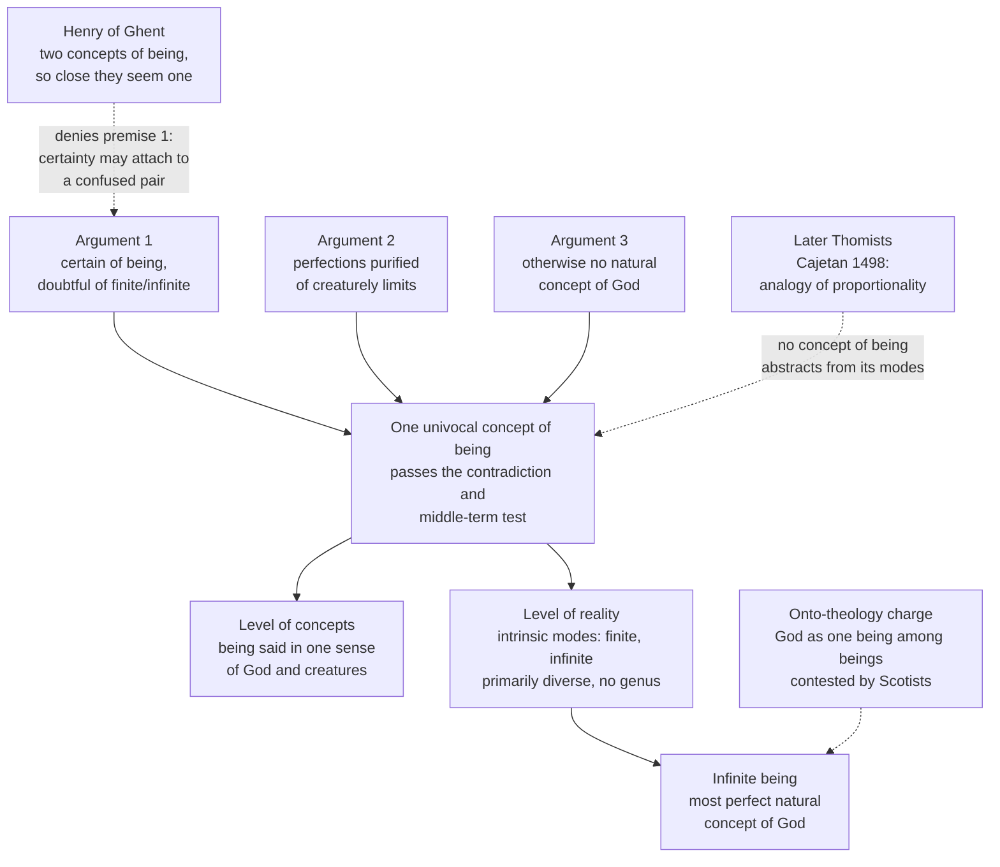

# Ancient & Medieval Philosophy · Lesson 8.2: Scotus: the univocity of being

> ⏱ ~15 min · Module 8: Universals, Scotus and Ockham · Builds on: [7.2 Essence and existence](07-02-aquinas-essence-and-existence.md), [6.2 Avicenna: essence, existence and the necessary existent](06-02-avicenna-essence-existence-and-the-necessary-existent.md), [8.1 Porphyry's questions](08-01-porphyrys-questions-universals-to-aquinas.md) · Unlocks: [8.3 Scotus: common nature and haecceity](08-03-scotus-common-nature-and-haecceity.md)

## Why this matters

Every argument from the world to God has a word in the middle of it. "Every *being* that begins has a cause; the world is a *being*…" If that word means one thing when said of creatures and another when said of God, the argument has four terms and proves nothing. Aquinas saw the danger and answered it with analogy. John Duns Scotus (c. 1266–1308), a Franciscan who taught at Oxford and Paris and died at Cologne, thought analogy could not do the job alone. He argued that there must be one concept of *being* that applies to God and creatures in exactly the same sense. That thesis, univocity, divides Scotists from Thomists to this day, and it is often blamed for a great deal it never said. This lesson states what Scotus held and why. Whether he was right is argued in [`thomistic-synthesis`](../../thomistic-synthesis/syllabus.md) 4.4.

## The idea

Start with three ways a word can be said of two things (the first two go back to Aristotle's *Categories* 1; see [3.1](03-01-predication-categories-and-the-syllogism.md)):

- **Equivocal:** same word, unrelated meanings. A river *bank* and a savings *bank*.
- **Univocal:** same word, same meaning. *Animal* said of a horse and of a dog.
- **Analogical:** different but related meanings. *Healthy* said of a body and of a diet, where the diet is called healthy because it causes health in a body.

Aquinas put God-talk in the third box. In his words, "no name is predicated univocally of God and of creatures" (ST I q.13 a.5). He also refused the first box, because then reasoning from creatures to God "would always be exposed to the fallacy of equivocation" (same article).

Scotus's target is not Aquinas directly but **Henry of Ghent** (d. 1293), the leading secular master at Paris in the generation after Aquinas. As Scotus reports him, Henry held that *being* said of God and *being* said of a creature are really **two** concepts. They are so close to each other that the mind takes them for one, but they are two. (Henry's own texts are more nuanced than Scotus's summary, so treat this as the position Scotus attacks.)

Scotus's reply rests on a simple observation about certainty and doubt. You can be completely sure of one thing about X while unsure of another. When that happens, what you are sure of cannot be the same concept as what you are unsure of. It is the same test you would use in a detective story: if the witness is certain that *someone* left the room and uncertain *who*, then "someone left" is a separate piece of knowledge from "the butler left."

Now apply it to God. A person can be certain that the first cause is a being and still be unsure whether it is finite or infinite, created or uncreated. So the concept *being* that he is sure of is neither the concept *finite being* nor *infinite being*. It is a third concept, contained in both. That is a univocal concept.

The text is *Ordinatio* I, distinction 3, part 1, questions 1–2, which asks whether a human being in this life (a *viator*, "wayfarer") can know God naturally. The standard English translation (Wolter's) is under copyright, so this lesson paraphrases and cites.

## The argument

**What "univocal" means.** Scotus gives a two-part test (*Ord.* I d.3 p.1 qq.1–2, paraphrased). A concept is univocal when its unity is enough (i) to produce a **contradiction** if you affirm it and deny it of the same thing, and (ii) to serve as the **middle term** of a syllogism, so that two things joined to it can be joined to each other without a fallacy of equivocation. *In words:* a concept is univocal if you can argue with it, not just say it.

**The argument from certain and doubtful concepts** (same question, paraphrased):

1. An intellect that is certain of one concept and in doubt about others has a concept it is certain of that is distinct from the concepts it doubts. *In words:* what you are sure of and what you are unsure of cannot be the same concept.
2. A wayfarer's intellect can be certain that God is a being while doubting whether God is finite or infinite, created or uncreated. *In words:* "the first cause is something real" can be settled while "and it is infinite" is still open.
3. So the concept of being that the intellect is certain of is distinct from the concepts of finite being and of infinite being. *In words:* *being* is not just shorthand for one of the two.
4. That concept is neither of the two, but is included in each. *In words:* both *finite being* and *infinite being* have *being* inside them.
5. A concept included in both, and one in the sense just described, is univocal to God and creatures. *In words:* it passes the contradiction and middle-term test for both.
6. **So:** *being* is univocal to God and creatures.

**Two further arguments, in one line each.**
- *From formal concepts:* every inquiry about God takes a perfection as we find it in creatures (wisdom, goodness), removes the imperfection, and ascribes the rest to God in the highest degree. That only works if something of the concept stays the same.
- *No univocity, no natural knowledge:* the only natural route to a concept of God starts from creatures, and a creature can cause in the mind only concepts of what it contains. A concept "merely analogous" to every creaturely concept could never be formed. So either there is a univocal concept or there is no natural concept of God at all.

**What univocity does not claim.**
- *Not a shared nature or genus.* Scotus agrees with Aristotle (*Metaphysics* III.3) that being is not a genus. Univocity is a thesis about **concepts**. In reality, God and creatures are, in Scotus's phrase, primarily diverse: they have nothing real in common.
- *Intrinsic modes.* "Finite" and "infinite" are not differentiae that divide a genus, like *rational* dividing *animal*. They are **intrinsic modes**, degrees of intensity of the thing itself (*Ord.* I d.8). Scotus's comparison is whiteness at a given degree of intensity: you can conceive the whiteness without its degree, but the degree is not a second thing added to it. *In words:* infinity is how God is, not an extra ingredient added to being.
- *Infinite being.* The most perfect concept of God available to natural reason is *infinite being*. It is still imperfect compared with seeing God as he is. *In words:* univocity gives a true concept of God, not knowledge of his essence.

## Argument map

Solid arrows run from argument to conclusion. Dashed edges are the objections: Henry's reply (the crux in P2), the later Thomist school, and a modern charge whose reading of Scotus is disputed.

## Worked examples

**Example 1 (clean): running the definition on a proof.** Take a small piece of natural theology:

> Whatever is a being is intelligible. The first cause is a being. So the first cause is intelligible.

This is Barbara ([3.1](03-01-predication-categories-and-the-syllogism.md)), with *being* as the middle term. Suppose, with Henry, that *being* in the major premise is the creaturely concept, taken from the things we know, and *being* in the minor is the divine concept. Then the syllogism has four terms and the conclusion does not follow. Test (ii) fails. Now take test (i). One reasoner affirms that the first cause is a being and another denies it. On Scotus's account they contradict each other. If *being* here is two concepts, it is not obvious that they do, since each might be using a different one. Scotus's point is that both reasoners plainly *are* arguing, so the concept they share is one.

**Example 2 (hard): "wise."** Argument 2 says: take wisdom as found in Socrates, strip away what is imperfect, and ascribe the rest to God infinitely. Aquinas, in the same article of the *Summa* quoted above, reasons that *wise* said of a man signifies a quality distinct from his essence, while said of God it signifies nothing distinct from the divine essence. So the word does not signify in the same way.

Scotus's answer uses the modes. The imperfection lies in wisdom being *finite* and *accidental* in Socrates, and that is its mode, not its formal notion (*ratio*). Remove the mode, and the *ratio* of wisdom is left, which can be said of God and of Socrates alike. Only perfections whose notion carries no limitation (Scotus's "pure perfections") pass this way. *Rational*, which includes discursive thought, does not.

This is where the theory strains. Everything turns on whether a perfection's *ratio* can really be pried apart from its mode. The Thomist says wisdom as we conceive it is shot through with how it exists in us, so nothing mode-free is left over. The Scotist says the separation is exactly what the whiteness comparison shows is possible. The lesson does not settle this. It is the question [`thomistic-synthesis`](../../thomistic-synthesis/syllabus.md) 4.4 argues out.

## Watch out

- **Anachronism: "Aquinas's reply to Scotus."** Aquinas died in 1274, when Scotus was a boy. Scotus attacks Henry of Ghent. The "Thomist reply" belongs to later Thomists, above all Cajetan (*De Nominum Analogia*, 1498), who read Aquinas as teaching an analogy of proper proportionality: being is to God as being is to a creature. Whether that reading is faithful to Aquinas is itself disputed.
- **Univocity is not a shared nature.** You might think "one concept" means "one kind of thing." Scotus denies it. Being is not a genus, God is in no category, and God and creatures are primarily diverse in reality. The course's anachronism rule applies: this is a thesis about concepts.
- **Modes are not differences.** *Infinite* does not divide being the way *rational* divides animal. If it did, God would be composed of genus and difference, which Scotus denies as firmly as Aquinas does.
- **The onto-theology charge is a reading, not a report.** Some modern critics, notably the Radical Orthodoxy theologians (Milbank, Pickstock), argue that univocity turned God into one being among beings and prepared modern secularity. Scotist scholars, for example Richard Cross (2001), reply that this misreads a claim about concepts as a claim about reality. Report both. Don't adopt either as the history.

## One-liner

> Scotus: you can be sure God *is* while unsure *how* he is, so *being* is one concept said of God and creatures alike, univocal in thought, primarily diverse in reality, divided only by the intrinsic modes finite and infinite.

## Problems

**P1 (🟢) *(Exegetical (a) · Evaluative (b))*** Scotus backs premise 2 with history. Early philosophers disagreed about the first principle: some said it was fire, others water. Yet each was certain it was a being. And a philosopher who changed his mind about which element it was did not lose his certainty that it was a being. (a) Reconstruct the argument **with this evidence doing the work**, in numbered premises (P1, P2, … ∴ C), ending in the univocity of *being*. You will need a step from "fire or water" to "finite or infinite." (b) Flag the weakest premise and say why, 150 words or fewer, any verdict.

**P2 (🟡) *(Exegetical.)*** Henry of Ghent (as Scotus reports him) and Scotus agree that someone can be certain God is a being while doubting whether he is infinite. They disagree about what that certainty shows. (a) Name the **single premise** of Scotus's argument that Henry must deny, and state Henry's alternative account of the certainty. (b) Say what argument or consideration would move a reader toward either side. 150 words or fewer in total.

**P3 (🔴, optional) *(Exegetical.)*** Diagnose this paragraph from an invented theology blog:

> *Here is where it all went wrong. Duns Scotus decided that "being" means the same thing for God and a pebble. That puts God in the same category as everything else, just the biggest item in the inventory of the universe. Once God is one more thing, science can shelve him next to the other things, and it did.*

Name each thing the blogger attributes to Scotus that Scotus denies, using the lesson's terms. Then say which part of the paragraph restates a real critical position held by modern critics, and how it differs from what Scotus claimed. 150 words or fewer.

Solutions

**P1** *(Exegetical (a) · Evaluative (b))*

**Must hit, strict (a):**
- A premise that the philosophers were **certain** the first principle is a being while **doubtful** whether it is fire or water, and that a change of mind about the element left the certainty intact.
- The distinctness principle: a concept one is certain of differs from the concepts one doubts.
- So the concept of being is not the concept of fire, nor of water.
- The **bridge** to God: the same holds for "finite or infinite, created or uncreated." One is certain the first principle is a being while doubting these, so *being* is distinct from *finite being* and *infinite being*.
- *Being* is included in both, so it is one concept common to both, and it passes the contradiction and middle-term test. ∴ Being is univocal to God and creatures.

**Must hit, any verdict (b):** name one premise and give a reason that a defender of analogy could actually press. Strong choices: the distinctness principle (Henry: certainty may attach to two concepts confusedly grasped, P2); the bridge (fire versus water is a doubt *within* the creaturely; finite versus infinite may not be parallel); or the assumption that what the philosophers were certain of was a *concept* and not merely a sentence they would assent to.

**Wrong turns:** concluding that God and fire share a nature, which is the misreading of P3. Leaving out the bridge, so that the argument ends at "being is common to fire and water," which Henry never denied.

**Model answer (b), one of several:** The weakest premise is the distinctness principle. It assumes that what I am certain of shows up to me as one concept, so certainty reveals unity. Henry can grant the certainty and deny the unity. The philosopher is certain of *being* grasped confusedly, a pair of concepts so alike he cannot tell them apart. The premise needs support from outside: that concepts are transparent to whoever has them, or Scotus's point that without it no concept could ever be shown to be one.

---

**P2** *(Exegetical.)*

**Must hit, strict:**
- (a) The premise is **premise 1**: a concept one is certain of is distinct from, and so is not, any concept one doubts. More exactly, the implicit claim that the concept one is certain of is *one* concept. Henry's alternative: the certainty attaches to *being* conceived confusedly. The divine and creaturely concepts are two, but so close ("proximate") that the mind cannot tell them apart and takes them for one.
- (b) Considerations. Toward Scotus: if closeness can fake unity, then *no* concept could be shown to be univocal, not even *animal*; and argument 3 says a concept merely close to creaturely ones could never be formed from creatures. Toward Henry: God's infinite distance from creatures makes it hard to believe that any concept abstracted from creatures fits God without change, and confusion between concepts is a familiar fact of thought.

**Wrong turns:** naming premise 2 (both grant the certainty). Framing the crux as "whether God exists" or "whether God is infinite" (both hold both). Putting Aquinas in Henry's place.

**Model answer:** Henry must deny premise 1, at least in the form "what I am certain of is a single concept." He grants the certainty but says its object is being grasped confusedly: two concepts, one proper to God and one to creatures, so alike that the mind takes them as one. Scotus's best consideration against this is that it proves too much. If likeness can pass for unity, no concept could be shown to be univocal, and reasoning from creatures to God would run on a concept no creature could cause. Henry's best consideration is the distance between infinite and finite: it is hard to see how one concept abstracted from creatures could fit God without change.

---

**P3** *(Exegetical.)*

**Must hit, strict:**
- **"Same category."** Scotus denies it. Being is not a genus (*Metaphysics* III.3), and God is in no category.
- **"One more thing" / "biggest item."** Univocity is at the level of **concepts**. In reality God and creatures are primarily diverse.
- **"Biggest."** *Infinite* is an **intrinsic mode**, not a larger quantity or a differentia on a scale shared with pebbles. Infinite being is not a finite being made bigger.
- **The real position:** the onto-theology charge (Radical Orthodoxy) that univocity made God one being among beings and fed modern secularity. It differs from Scotus's claim by reading a thesis about concepts as a thesis about reality. Scotist scholars contest that reading.

**Wrong turns:** calling the blog "Thomist." Aquinas never discussed Scotus, and Thomists who reject univocity do not say Scotus put God in a genus. Treating the historical-causal claim ("science shelved him") as something the lesson refutes. It is left open, not settled.

**Model answer:** The blogger pins three things on Scotus that he denies. First, God is not "in the same category": for Scotus being is not a genus and God is in none. Second, God is not "one more thing": univocity concerns the concept *being*, and in reality God and creatures are primarily diverse. Third, God is not "the biggest item": infinity is an intrinsic mode, not a larger amount on a shared scale. What survives is the onto-theology charge made by Radical Orthodoxy critics: that univocity turned God into one being among beings and prepared modern secularity. That charge is a contested reading. It moves Scotus's claim from the level of concepts to the level of reality, which is exactly the move Scotist scholars reject.

## Flashback

**From Lesson 7.3 (The Five Ways as text):** *(Exegetical — apply the method of q.2 a.2.)* (a) Label each inference as a demonstration *quia* or *propter quid*, with a one-line reason. (i) From fresh tracks in the snow, a hunter concludes that some animal passed this way in the night. (ii) From knowing that iron expands when heated, an engineer concludes that an iron railing will be longer at noon in summer than at dawn. (b) An invented objector says: *"You cannot prove that something exists unless you already know what it is. Aquinas admits we do not know God's essence, so the Five Ways prove nothing."* Which reply in a.2 answers this, how does the hunter's case illustrate it, and what does Aquinas concede to the objector? Three sentences or fewer.

Solution

**Must hit, strict (a):** (i) ***quia***: it runs from an effect better known to us (the tracks) to the existence of their cause, without knowing what the cause is. (ii) ***propter quid***: it runs from a cause whose nature is known (heating makes iron expand) down to its effect.

**Must hit, strict (b):**
- The reply is ad 2: in a demonstration *quia*, the middle term is the *meaning of the name*, not the essence.
- The hunter proves that there is *something that made these tracks* without knowing its species. The Ways likewise prove that something answers to "God" (first mover, first cause), with the name's meaning taken from the effects.
- The concession: we do not know what God is, so the demonstration shows *that* God is, not *what* God is, and it is not self-evident to us (a.1). The attributes are argued afterward, from q.3 on.

**Wrong turns:** labelling (i) *propter quid* because an animal is the cause of the tracks. The label depends on which way the reasoning runs, not on whether a cause is mentioned. In (b), answering with the self-evidence distinction of a.1 alone: that explains why proof is needed, not how proof works without the essence.

**Model answer:** (a) (i) *Quia*: from effect to the existence of a cause whose nature stays unknown. (ii) *Propter quid*: from a known cause to its effect. (b) Ad 2 answers it: a demonstration from effects uses the meaning of the name as its middle term, not the essence. The hunter proves there was *something that made these tracks* while not knowing what animal it was, and the Ways prove there is something answering to "God" in the same way. Aquinas concedes that we do not know what God is; the Ways establish only that he is, and the rest of what he is must be argued in the questions that follow.

## Connections

- **Backward:** Avicenna's claim that *being* is among the first notions impressed on the mind ([6.2](06-02-avicenna-essence-existence-and-the-necessary-existent.md)) is a source Scotus relies on for treating *being* as a concept grasped before its divisions. Aquinas's one paragraph on analogy in [7.2](07-02-aquinas-essence-and-existence.md) is the position univocity is usually set against, though Henry is the actual target. [8.1](08-01-porphyrys-questions-universals-to-aquinas.md) taught you to ask whether a unity is in things or in the mind; univocity answers "in the concept," and Aristotle's "being is said in many ways" ([3.4](03-04-substance-and-essence.md)) is the background both sides claim. The middle-term test is the four-term fallacy from [3.1](03-01-predication-categories-and-the-syllogism.md).
- **Forward:** [8.3](08-03-scotus-common-nature-and-haecceity.md) uses the same concept-versus-reality care for a different unity, the common nature with less-than-numerical unity, and adds the formal distinction that [8.4](08-04-ockham-nominalism-and-the-razor.md) attacks. [`thomistic-synthesis`](../../thomistic-synthesis/syllabus.md) 4.4 assumes this lesson, reads ST I q.13 a.5 closely, and argues the analogy-univocity dispute, including Cajetan and his critics. Whether God-talk is coherent at all belongs to [`philosophy-of-religion`](../../philosophy-of-religion/syllabus.md).
- **Sideways:** Quine's single existential quantifier, and the neo-Aristotelian "modes of being" that resist it ([`metaphysics` 1.1](../../metaphysics/lessons/01-01-existence-and-ontological-commitment.md)), are a modern echo of the same quarrel, though Scotus's concept carries intrinsic modes that a quantifier does not. Argument 3 bears on the Church's teaching that God can be known by natural reason ([`fundamental-theology` 1.2](../../fundamental-theology/lessons/01-02-natural-knowledge-of-god.md)), which defines *that* God is knowable, not whether by univocity or analogy. The bridge to theories of meaning is in [`philosophy-of-language-and-logic`](../../philosophy-of-language-and-logic/syllabus.md).
