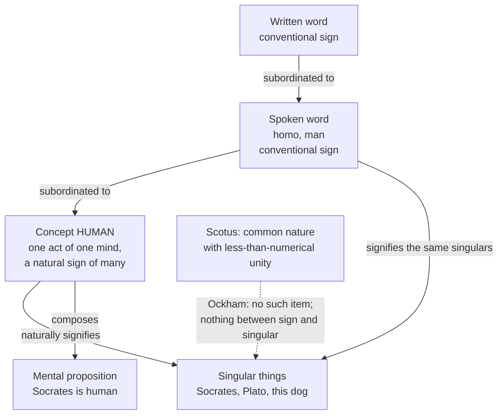

# Ancient & Medieval Philosophy · Lesson 8.4: Ockham: nominalism and the razor

> ⏱ ~15 min · Module 8: Universals, Scotus and Ockham · Builds on: [8.3 Scotus: common nature and haecceity](08-03-scotus-common-nature-and-haecceity.md), [8.1 Porphyry's questions: universals from Boethius to Aquinas](08-01-porphyrys-questions-universals-to-aquinas.md), [3.1 Logic: predication, the categories and the syllogism](03-01-predication-categories-and-the-syllogism.md) · Unlocks: [`metaphysics` 1.4 Nominalism and tropes](../../metaphysics/lessons/01-04-nominalism-and-tropes.md), [`modern-philosophy`](../../modern-philosophy/syllabus.md)

## Why this matters

Aquinas put the nature in things; Scotus gave it its own less-than-numerical unity. William of Ockham (c. 1287–1347), an English Franciscan, says there is nothing there to have any unity but the individual itself. Generality lives in signs, above all in concepts. With that one move he rebuilds logic, shrinks Aristotle's ten categories to two kinds of thing, and hands the later Middle Ages a name for his school, the *via moderna*. He also gave his name to a principle he never stated in its famous form.

## The idea

Look at a road map. One symbol, a small black square, marks hundreds of towns. Nobody thinks the towns share a black square. The symbol is one mark that applies to many things, and its generality is a fact about how it signifies, not about something sitting inside each town.

Ockham thinks every universal is like that symbol, with one difference: the map's convention is arbitrary, and a concept's signifying is not. When you see Socrates, and later Plato, your mind forms the concept *human*. That concept is a real item, a single act or quality of one mind. It is **general** because it is a *natural sign* of every human being, the way smoke naturally signifies fire. No one chose it. It is what knowing humans produces in a knower.

So Porphyry's question (8.1), do genera and species exist outside the mind, gets a flat answer: no. Everything that exists is singular. Socrates and Plato agree in being human, but "agreeing" is not having some third thing in common. Each is just what he is, and the concept applies to both.

The second half of the lesson is a principle of economy that runs through all of this: don't posit more things than you need to account for what you know. Ockham uses it to clear out common natures, formal distinctions, relations as extra things and much else. Whether it can do the work alone is a question to keep open.

## The argument

**A. Against common natures and the formal distinction in creatures** (*Ordinatio* I d.2 q.6; *Summa Logicae* I.16). Stated here as Ockham runs it; Scotus's side is 8.3.

1. **On Scotus's view, the nature in Socrates is common and the haecceity is not.** *In words:* one and the same Socrates contains something shareable and something unshareable.
2. **Where one predicate is truly affirmed and its contradictory truly denied, there must be distinct items.** *In words:* nothing can be both common and not common.
3. **Outside the mind, items are either really distinct things or one and the same thing.** *In words:* in creatures there is no halfway distinction.
4. **If the nature and haecceity are really distinct things, the nature is itself a singular thing,** numerically one in Socrates, so not common. *In words:* a separate "humanity-thing" in Socrates would be his, not shared.
5. **If they are one thing, contradictory predicates are true of one thing.** *In words:* that is a contradiction.
6. **So there is no common nature distinct from the individual,** and no formal distinction in creatures. *In words:* the individual is individual by itself; nothing needs to be added to make it *this*.

Ockham does not throw the formal distinction out entirely. On the usual reading he admits it in one place, the divine essence and the three persons, where he takes the faith to require it, and nowhere in creatures (*Summa Logicae* I.16).

**B. What a universal is** (*Summa Logicae* I.14–17).

1. **Everything that exists outside the soul is singular.** *In words:* the conclusion of A, generalized.
2. **A universal is what is predicable of many.** *In words:* Porphyry's and Aristotle's definition, kept.
3. **Only signs are predicated;** predication joins terms in a proposition (3.1). *In words:* you say "human" of Socrates; you do not say Socrates of anything.
4. **So a universal is a sign that signifies many.** *In words:* generality is a mode of signifying.
5. **Spoken and written terms signify by convention, and are subordinated to concepts, which signify by nature.** *In words:* "homo" and "man" differ; the concept they both express does not.
6. **So universals in the primary sense are concepts,** each a singular item in a singular mind, universal only in what it signifies.

What a concept *is* shifted. Ockham's early view (the *fictum* theory) gave concepts a merely "objective" being as objects of thought; his mature view, on most readings, identifies the concept with the act of understanding itself. Concepts combine into mental propositions, a **mental language** (*oratio mentalis*) with its own grammar, without the synonyms and ornaments of Latin or English. Supposition theory, in one line: in a proposition a term *stands for* something, usually the singulars it signifies ("personal"), sometimes the concept itself ("simple") or the word ("material"), and never a common nature.

**C. The razor, in Ockham's wording.** Ockham's own formulas, in this lesson's translation from the Latin:

1. *Pluralitas numquam est ponenda sine necessitate*: "plurality is never to be posited without necessity" (the *Ordinatio* and elsewhere).
2. *Frustra fit per plura quod potest fieri per pauciora*: "it is futile to do with more what can be done with fewer."

*In words:* when two accounts cover the same data, the one committed to fewer things is to be preferred. Neither formula is original to him. An objection Aquinas himself raises against God's existence begins "it is superfluous to suppose" many principles where a few account for the world (ST I q.2 a.3 obj. 2). The slogan *entia non sunt multiplicanda praeter necessitatem*, "entities are not to be multiplied beyond necessity", is usually traced to the Scotist John Punch in 1639, not to Ockham. And the razor is bounded: nothing is to be posited without a reason unless it is self-evident, known by experience, or proved by the authority of Scripture (a principle he states, for instance, at *Ordinatio* I d.30 q.1). Necessity, then, can come from reason, experience or authority.

## Argument map

Read it from the bottom of the chain up: written words depend on spoken ones, spoken words on concepts, and concepts on nothing but the singular things that cause them. Note the edge from spoken word to things. For Ockham a word does not signify the concept; it signifies the *same singulars* the concept does, because it is subordinated to it.

## Worked examples

**Example 1 (clean — is similarity a thing?).** Socrates is white, Plato is white, so Socrates is similar to Plato. A realist about relations may say there is a further item, a similarity, inhering in Socrates and pointing at Plato.

Run the razor with its three bounds. *Reason:* the truth of "Socrates is similar to Plato" is fully fixed by Socrates' being white and Plato's being white; nothing is left to explain. *Experience:* no one perceives a third item besides the two white men. *Authority:* nothing in Scripture requires relation-things among creatures. So none is posited. Arguments of a supporting shape turn up in this debate: if Plato's whiteness were destroyed, Socrates would cease to be similar with no change in Socrates at all, which is odd for an accident *in* Socrates.

The same pattern shrinks the categories. On Ockham's reckoning only singular **substances** and **qualities** are absolute things; words for quantity, relation, place, time and the rest are abbreviations for claims about substances and qualities. Theology forced qualifications he worked out separately (real relations in the Trinity; quantity in the Eucharist, where the details are disputed), which is the third bound, authority, doing its job.

**Example 2 (hard — seeing a star that isn't there).** Ockham distinguishes God's **absolute power** (*potentia absoluta*), what God can do without contradiction, from his **ordained power** (*potentia ordinata*), what he has actually decreed. Add two theses. *Intuitive cognition* is the awareness of a thing by which one can know evidently whether it exists; *abstractive* cognition leaves that open. And whatever God does through secondary causes, he can do without them.

Now apply. You see a star. The seeing and the star are two distinct things. So God, by absolute power, could preserve the seeing while the star does not exist. Does that mean you never know stars exist?

Ockham's answer, on a common reading of *Quodlibet* VI q.6: such an intuitive cognition would ground the judgment that the star does *not* exist, because intuitive cognition is defined by the evident judgment it causes, not by a pipe to the object. And in the ordained order, God does not work this way. Here the apparatus strains. Later readers, beginning in the fourteenth century, argued that the possibility still opens a gap between cognition and object that nothing internal to the cognition closes. Whether Ockham's reply closes it is disputed. What is not disputed is the method: absolute power is a tool for testing which connections are necessary, and it keeps cutting ties the realists thought were fixed.

## Watch out

- **Anachronism trap: "Ockham's razor says the simplest theory is true."** Ockham's principle is about not *positing things* without a reason, bounded by reason, experience and authority. It is not a claim that nature is simple, and it is not a modern criterion of theory choice in the sense of `philosophy-of-science`.
- **You might think nominalism means universals are "just words."** For Ockham the primary universals are concepts, and concepts are natural signs, the same for Greeks and Latins. The conventional part is only which sound or mark expresses them. "Nominalism" is a later label, and Ockham's view is sometimes called conceptualism for this reason.
- **You might think Ockham denies that Socrates and Plato really are alike.** He grants that they are both human and really agree more than Socrates agrees with a donkey. What he denies is that agreement is a *thing* they have in common.
- **You might think absolute power makes Ockham a skeptic or a Cartesian doubter.** Absolute power concerns what involves no contradiction. It is not a deceiving demon, and Ockham does not use it to suspend belief.

## One-liner

> Only singulars exist; generality belongs to concepts, natural signs that signify many; and nothing is to be posited without a reason from self-evidence, experience or authority.

## Problems

**P1 (🟢) *(Exegetical.)*** Reconstruct, in 5–6 numbered premises and a conclusion, Ockham's case that a universal is a singular concept that signifies many. Take "everything outside the soul is singular" as already established: do **not** rebuild the argument against Scotus's formal distinction. Your reconstruction must say why spoken words are not universals in the primary sense, and what a concept is on the mature view.

**P2 (🟡) *(Exegetical (a) · Evaluative (b).)*** An arrow flies from bow to target. Aristotle defined motion as the actuality of the potential as such (3.3). Ockham, on the standard reading of his physics, holds that "motion" names no thing over and above the moving body and the places it successively occupies. (a) Say what things the sentence "the arrow is moving" commits Ockham to, how the razor licenses stopping there, and which of the razor's three bounds a realist about motion would have to invoke to force a further thing. (b) Does this reduction lose anything Aristotle's definition captured? Any verdict; 150 words or fewer.

**P3 (🔴, optional) *(Exegetical.)*** Aquinas holds that the intellect understands through an *intelligible species*, a form abstracted by the agent intellect: "the intelligible species is related to the intellect as that by which it understands" (ST I q.85 a.2). Ockham, in his questions on the second book of the *Sentences*, argues that species are superfluous: the intellect, the object and (for thinking of absent things) habits left by earlier acts suffice. Name the single premise about what knowing requires that Aquinas affirms and Ockham denies, and say what argument would move a defender of each side. 150 words or fewer.

Solutions

**P1** *(Exegetical — strict.)*

**Must hit, strict:**
- The definition kept from Porphyry and Aristotle: a universal is what is predicable of many.
- Predication is of terms in propositions: things are not predicated, signs are. So a universal is a sign signifying many.
- Spoken and written words signify by convention and are subordinated to concepts; concepts signify naturally. So words are universal only derivatively, and concepts are universals in the primary sense.
- The concept is itself singular (one item in one mind), universal only by signification. On the mature view it is the act of understanding itself (a quality of the mind), not a *fictum* with merely objective being.

**Wrong turns:** making the concept universal *because* it has a common object in things (that is Aquinas's or Scotus's structure, not Ockham's); saying words signify concepts rather than, through subordination, the same singulars; importing the contradictory-predicates argument, which the problem excludes.

**Model answer:** P1. Everything outside the soul is singular (given). P2. A universal is what is predicable of many. P3. Only signs are predicated, since predication joins terms in a proposition. P4. So a universal is a sign that signifies many (P2, P3), and nothing outside the soul is a universal (P1). P5. Spoken and written terms signify only by convention, subordinated to concepts, which signify naturally. P6. Every concept is a singular item in a singular mind; on the mature view, an act of understanding. ∴ C. Universals in the primary sense are singular concepts, universal only in that they naturally signify many singulars.

---

**P2** *(Exegetical (a) · Evaluative (b).)*

**Must hit, strict (a):**
- Commitments: the arrow (a substance) and the places, or its being in one place and then another, with no rest between. No further item, "motion", inhering in the arrow.
- The razor: the truth of "the arrow is moving" is accounted for by those items, so positing more is positing without necessity.
- A realist must show necessity from one of the three bounds: an argument from reason (something the permanent things cannot account for), experience (a perceived item beyond body and places), or authority. Identifying the bounds by name is required.

**Must hit, any verdict (b):**
- Name what Aristotle's definition was for: motion as a real incompleteness in the moving thing, the actualization of a potency *as* potency, not just successive positions.
- Test whether Ockham's reduction can say that: for example, whether "being in potency to the target" is a claim about the arrow alone or needs something more.
- A verdict with the step that decides it.

**Wrong turns:** treating (a) as Ockham denying that the arrow moves (he denies a *motion-thing*, not motion); answering (b) with the modern physics of velocity as if it settled a medieval dispute, without saying what the definition was meant to capture. Noting that the reduction resembles the later "at-at" reply to Zeno's arrow (1.2) earns credit if flagged as a resemblance, not a source.

**Model answer (b), one of several acceptable:** Aristotle's definition does work the reduction may not. It says the moving arrow is actual as a potency to the target: its present state is directed, incomplete. Ockham's analysis gives a series of states, each complete, and "moving" means that the arrow occupies them in order without rest. That captures *which* places and *when*. Whether it captures *directedness* depends on whether "potency to the target" adds a fact about the arrow now. If it does, the reduction loses it, and the realist can claim necessity from reason. If Ockham can treat potency-talk as a conditional about where the arrow will be, nothing is lost. Verdict: the reduction holds if potencies reduce to conditionals, and that is exactly what an Aristotelian denies.

---

**P3** *(Exegetical — strict on identifying a single premise; any defensible wording passes.)*

**Must hit, strict:**
- The crux: *knowing requires a form in the knower that is a likeness of the thing known, by which the power is made actual toward that object* (the assimilation principle). Aquinas affirms it: the species is that likeness. Ockham denies that any such representative form, prior to the act, is needed: the act of understanding, caused by the object (or by a habit), is itself the natural sign.
- Not the crux: whether the intellect needs the senses, or whether knowledge is of singulars. Both men agree cognition starts from sensed singulars.
- What would move each: for Ockham's side, a case the species account explains and the causal-habit account cannot (why an act caused by *this* object is *about* it without a likeness); for Aquinas's side, an account of intentionality that works by causation and signification alone, so the species adds nothing, which is the razor's opening.

**Wrong turns:** naming the razor itself as the crux (Aquinas accepts economy; the dispute is over whether species are necessary); naming two premises; making the species what is understood, which q.85 a.2 explicitly denies.

**Model answer:** The premise in dispute is that to know a thing, the knower must first receive a form that is a likeness of it, by which the act is determined to that object. Aquinas affirms it; the intelligible species is that likeness. Ockham denies it: the object, acting on the intellect, causes an act of understanding that is itself a natural sign of the object, so a prior likeness is superfluous. An Aquinas defender might be moved by a successful account of why a causally produced act is *about* its cause without resembling it. An Ockhamist might be moved by showing that causation alone cannot fix what an act is about, since many causes contribute to every act.

## Flashback

**From Lesson 8.2 (Scotus: the univocity of being):** *(Exegetical — apply to new cases.)* (a) Scotus's argument from formal concepts says: take a perfection as found in creatures, remove the imperfection, and ascribe the rest to God. For each term, say whether its notion survives that procedure so that it can be said of God and creatures in one sense, with a one-line reason: (i) good; (ii) walking; (iii) having learned; (iv) willing. (b) An invented preacher says: *"We know God only as the wholly other. Every concept we have comes from creatures and fits nothing in him."* Using Scotus's third argument, say what follows for the preacher's own natural knowledge of God, and what Scotus would say "wholly other" presupposes. Three sentences or fewer.

Solution

**Must hit, strict (a):**
- (i) **Survives.** Nothing in the notion of goodness includes a limit; finitude is the mode it has in creatures.
- (ii) **Does not survive.** Walking includes a body and moving from place to place, so the limitation is in the notion itself, not just in its mode.
- (iii) **Does not survive.** Having learned includes having once been ignorant and acquiring knowledge, which is an imperfection built into the notion. (Knowing, by contrast, would survive.)
- (iv) **Survives.** Willing carries no limit in its notion; being finite and caused is how it exists in us.
- The test is whether the imperfection lies in the **notion** (*ratio*) or only in the **mode**.

**Must hit, strict (b):**
- Argument 3: a creature can cause in the mind only concepts of what it contains, so a concept that fits no creaturely concept could never be formed naturally. If the preacher is right, he has **no natural concept of God at all**, not a special one.
- "Wholly other" is itself formed from creaturely concepts, as *other than* what we know. It presupposes at least a concept of *being* shared with creatures: God is a being that differs. Scotus would add that the difference lies in the mode, infinite versus finite, and that in reality God and creatures are primarily diverse.

**Wrong turns:** judging (iii) by its object (knowledge is a perfection, so "having learned" must be one), which ignores the acquisition built into the notion; in (b), reading Scotus as denying that God differs from creatures, when univocity is about concepts and he holds them primarily diverse in reality.

**Model answer:** (a) (i) Good: survives, no limit in its notion. (ii) Walking: fails, it includes a body in motion. (iii) Having learned: fails, it includes prior ignorance. (iv) Willing: survives, its finitude is only its mode in us. (b) By argument 3, a concept fitting no creaturely concept could never be caused in us by creatures, so the preacher would have no natural concept of God at all. His "wholly other" is built from the concept of a being that is other, which already includes *being* in one sense for God and creatures. Scotus would locate the otherness in the intrinsic mode, infinite rather than finite, and in God's being primarily diverse in reality, not in the concept.

## Connections

- **Backward:** Ockham's target is Scotus's common nature and formal distinction ([8.3](08-03-scotus-common-nature-and-haecceity.md)), and behind it the moderate realism of Aquinas and Boethius ([8.1](08-01-porphyrys-questions-universals-to-aquinas.md)). His logic is Aristotle's predication and categories ([3.1](03-01-predication-categories-and-the-syllogism.md)) rebuilt around signs, and his reduction of motion rereads [3.3](03-03-change-privation-potency-and-act.md). Aristotle's refusal to make universals substances ([3.4](03-04-substance-and-essence.md)) is a first step in the direction Ockham goes much further. The intelligible species he discards is the product of the agent intellect of [3.5](03-05-soul-and-intellect.md).
- **Forward:** whether nominalism is *true*, and what it costs against realism and tropes, is [`metaphysics` 1.3](../../metaphysics/lessons/01-03-universals-the-realists-case.md) and [1.4](../../metaphysics/lessons/01-04-nominalism-and-tropes.md). The razor as a principle of theory choice belongs to [`philosophy-of-science`](../../philosophy-of-science/syllabus.md), with the natural-kinds debate. "Ockhamism" about foreknowledge is [`philosophy-of-religion`](../../philosophy-of-religion/syllabus.md) 1.3's. Ockham's summons to Avignon in 1324, the apostolic poverty dispute with John XXII, and his flight to Louis of Bavaria at Munich in 1328 are events in [`church-history`](../../church-history/syllabus.md) 5.2.
- **Sideways:** the razor's own form, a presumption that the other side must discharge, is a burden-of-proof rule of the kind analysed in [`philosophical-method` 4.2](../../philosophical-method/lessons/04-02-steelmanning-and-the-burden-of-proof.md). Mental language, with signs that have a grammar independent of any spoken tongue, is often compared with the modern language-of-thought hypothesis in [`philosophy-of-mind`](../../philosophy-of-mind/syllabus.md) 4.1; treat the comparison as a resemblance, not a lineage.

## Where the course ends

The course opened with Parmenides denying that what-is can be many or change, and closes with Ockham insisting that what-is is *only* many: singular things, with all generality moved into the mind's signs. In between, form went from separate Forms (Plato) into things (Aristotle), up into a divine mind (Augustine), and into a nature with its own unity (Avicenna, Scotus). The fault line between realism and nominalism is what the *via moderna* passed to the early moderns. Berkeley's attack on abstract ideas is in [`modern-philosophy`](../../modern-philosophy/syllabus.md), Locke's real and nominal essences in [`metaphysics` 2.4](../../metaphysics/lessons/02-04-essence-and-grounding.md), and the live form of the question is [`metaphysics` 1.4](../../metaphysics/lessons/01-04-nominalism-and-tropes.md). Whether Ockham won or merely changed the subject is exactly the kind of question this course taught you to pose and not to settle in advance.
