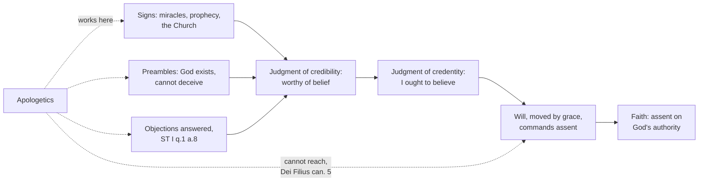

# Apologetics I · Lesson 1.1: What apologetics is, and what it isn't

> ⏱ ~15 min · Module 1: Giving a reason for the hope · Builds on: [`fundamental-theology` 2.1](../../fundamental-theology/lessons/02-01-the-act-of-faith.md), [2.2](../../fundamental-theology/lessons/02-02-credibility-and-the-preambles-of-faith.md), [2.3](../../fundamental-theology/lessons/02-03-fideism-and-rationalism.md) · Unlocks: [1.2 Three strategies](01-02-three-strategies.md)

## Why this matters

Every course you have taken in this field so far has assessed. This one argues. Over eight modules it makes a case for God, presses naturalism on its burdens, tests what science settles, argues the resurrection as history, and then meets Judaism, Islam and pluralism, each at full strength. It is built so that the argument can lose, and three mechanical rules hold it to that: the other side is stated first, as its own defenders state it; something is conceded by name in every lesson; and no rubric ever requires the Catholic conclusion. This lesson says what such a course is for, and what it may not do.

## The idea

The word comes from a courtroom. An *apologia* was a speech for the defence, as in Plato's *Apology*, Socrates' answer to the charges against him. The New Testament uses it the same way: Paul's speech to the Jerusalem crowd opens by asking them to hear his *apologia* (Acts 22:1, DR "the account"), and Festus tells Agrippa that Roman custom gives the accused room for an *apologia* before he is condemned (Acts 25:16, DR "liberty to make his answer"). The second-century apologists, Justin among them, wrote defences addressed to emperors.

The charter text is 1 Peter 3:15–16, and it has two halves:

> But sanctify the Lord Christ in your hearts, being ready always to satisfy every one that asketh you a reason of that hope which is in you. But with modesty and fear, having a good conscience: that whereas they speak evil of you, they may be ashamed who falsely accuse your good conversation in Christ. (DR)

"Satisfy" is Challoner's rendering of *pros apologian*, "ready for a defence," and "a reason" is *logos*, an account. The first half is the job: when asked, give an account. The second half is the manner: *meta prautētos kai phobou*, which the Douay renders "with modesty and fear" (gentleness and reverence) and with a good conscience. The manner is part of the duty: a defence that wins by bullying fails the verse even if every premise is true. And the one who *asks* sets the agenda.

Three neighbours, kept apart:

- **Evangelization** proclaims: here is what God has done; repent and believe. It invites trust in a witness.
- **Theology** argues *from* the articles of faith, as other sciences argue from their principles (ST I q.1 a.8).
- **Apologetics** argues *toward* the reasonableness of believing, on ground the questioner can share, and answers objections.

## Where apologetics sits in the act of faith

Two things are reloaded, not re-taught. **Faith rests on God's authority, not on the evidence of the thing believed**: the assent is free, commanded by the will under grace, and firmer than any argument ([`fundamental-theology` 2.1](../../fundamental-theology/lessons/02-01-the-act-of-faith.md)). And **the [motives of credibility](../reference.md#motives-of-credibility)** (miracles, prophecy, the Church as a sign) bear on *whether God has spoken*, never on the mystery spoken, while the [preambles of faith](../reference.md#preambles-of-faith) (God's existence, his truthfulness) are what reason can reach and faith presupposes ([2.2](../../fundamental-theology/lessons/02-02-credibility-and-the-preambles-of-faith.md)). Between the two errors of [2.3](../../fundamental-theology/lessons/02-03-fideism-and-rationalism.md), faith is neither blind nor a conclusion.

That fixes [apologetics](../reference.md#apologetics) exactly. It works on the motives and the preambles, and on objections. It can make faith *reasonable*; it cannot *produce* it. *Dei Filius* (1870) ch. 3 says both at once: the assent of faith is no blind movement of the mind, yet no one assents as salvation requires without the Holy Spirit's illumination. Its fifth canon on faith anathematizes the claim that the assent is not free but necessarily produced by the arguments of human reason. **Level:** a canon of an ecumenical council's dogmatic constitution, so rung 1 on the [ladder](../reference.md#levels-of-authority) for what it defines. And what it defines is a negative: no argument compels faith.

Aquinas gives the most modest job description in the tradition. Against someone who accepts nothing revealed, there is "no longer any means of proving the articles of faith by reasoning," only of answering objections. Since the contrary of a truth cannot be demonstrated, the arguments against faith "are difficulties that can be answered" (ST I q.1 a.8).

**Freedom, from the other side.** The Second Vatican Council's *Dignitatis Humanae* (1965) teaches that everyone is bound by a moral obligation to seek the truth, especially religious truth, and to hold it once known (§1–2), and has a right to immunity from coercion in religious matters, grounded in the dignity of the person and persisting even in someone who does not seek the truth (§2). Truth is to be sought by free inquiry, teaching, communication and dialogue, and held by personal assent (§3); the act of faith is of its nature free (§10). §1 also says the declaration leaves untouched the traditional teaching on the moral duty toward the true religion. **Level:** a conciliar declaration, authentic magisterium owed at least religious submission (rung 3); not a definition, though genre did not cap its weight ([`fundamental-theology` 4.5](../../fundamental-theology/lessons/04-05-reading-a-documents-weight.md)), and some theologians read its core as definitive. Whether it develops nineteenth-century teaching is disputed (`catholic-social-teaching`). The freedom of faith it restates is already rung 1 through *Dei Filius*.

**The [ethics of persuasion](../reference.md#ethics-of-persuasion)**, four rules this course enforces:

1. **No caricature.** State the view so its defenders would sign it.
2. **No invented quotation.** Quote only what you have seen in the source.
3. **No inflated number.** No unchecked statistic, no head-count of scholars as a premise.
4. **No winning by embarrassing someone.** The aim is the questioner's free assent to truth, not a crowd's verdict on a person.

Each follows: if faith must be free, and truth imposes itself only by its own truth (*Dignitatis Humanae* 3), an assent got by distortion or humiliation is not the assent sought.

## The other side

The sharpest objection to the whole enterprise is that **apologetics is rationalization**: the conclusion is fixed in advance, and reasons are recruited afterwards to decorate it. Bertrand Russell put it against Aquinas in *A History of Western Philosophy* (1945): Aquinas does not follow the argument wherever it leads, because he knows the truth from the Catholic faith before he starts; finding arguments for a conclusion given in advance is not philosophy but "special pleading." A skeptic can sharpen this from the Church's own text. *Dei Filius*, ch. 3, can. 6, condemns the view that Catholics may justly suspend their assent until they have completed a scientific demonstration of the credibility and truth of their faith. So the Catholic apologist is forbidden, by his own rule, to let the inquiry be open. Psychology adds the mechanism: motivated reasoning is real.

The objection has a fideist form too. Kierkegaard, writing as Anti-Climacus in *The Sickness unto Death* (1849), calls whoever first thought of defending Christianity a second Judas: to defend it is to treat it as something that needs human reasons, which betrays it. Karl Barth's refusal of natural theology in his 1934 reply to Emil Brunner (*Nein!*) runs on a related nerve: a God reached by our arguments is not the God who reveals himself.

## The argument

1. Faith's motive is God's authority, and its assent is free and moved by grace (*Dei Filius* ch. 3; FT 2.1). *In words:* no argument is the reason a believer believes.
2. So apologetics does not claim to produce faith; it claims only that the motives of credibility are real signs, that some preambles can be known by reason, and that objections can be answered (ST I q.1 a.8).
3. Whether an argument is valid, and whether its premises are true, is settled by public standards that do not depend on why its author holds the conclusion. *In words:* motive is a fact about the arguer; soundness is a fact about the argument.
4. An argument held to public standards (opposing view stated first, concessions made, no conclusion required for a pass) can be checked, and can fail, before anyone who does not share the arguer's faith.
5. ∴ The charge of rationalization, if true of an apologist, is a charge against his conduct, curable by premise 4; it does not show that the arguments are bad or that the enterprise is incoherent.

Against the fideist: premise 1 grants his central claim, that argument is not the ground of faith; but *Dei Filius* can. 3 on faith condemns the view that revelation cannot be made credible by outward signs, and 1 Peter commands the account.

**Concession.** Apologetics has earned its bad name. The genre's history includes caricatures of opponents nobody holds, quotations nobody said, and numbers nobody counted. The best-known case: the story that Darwin returned to faith on his deathbed, published by Lady Hope in 1915 and flatly denied by his daughter Henrietta, who was present, in 1922, was repeated by Christian writers for decades, and some creationist organizations now list it among arguments not to use. Russell's charge describes real apologetics accurately.

**Where the argument is weakest.** Premise 4 does the work, and can. 6 means the believing apologist and the skeptic do not stand symmetrically: one may suspend judgment and the other may not. (The canon is usually read as aimed at Georg Hermes's method of deliberate positive doubt; it forbids suspending assent, not examining arguments.) The honest reply is that the asymmetry is real and the course's public rules are the substitute for it, which works only if the rules are actually kept.

## The map

Apologetics feeds the left side; the step from "I ought" to "I believe" is grace and freedom.

## Worked examples

**Example 1: a clean case.** A colleague, whose father has just died, asks over coffee how you can believe in a God who lets this happen. She asked, so give an account; but gentleness includes timing, and today she may not want an argument. If she does, the order is fixed: state her objection better than she did (the evidential problem of evil, [2.3](02-03-evil-and-hiddenness-the-replies-that-cost-something.md)), concede what it gets right, give your reply, and leave her free. Success is not her conversion but an accurate picture of why a thoughtful person believes, and where the hard part is.

**Example 2: a hard case.** Marta, a convert, came into the Church partly because of a statistic she heard in a talk about how many scholars accept a particular historical claim. She now finds the figure was invented. Does her faith fall with it? On the account above, no, and yes. No: the statistic was never the *motive* of her faith; God's authority was (premise 1), and other motives of credibility remain. But she has lost a motive, and she was owed better. The case strains the line between motive and ground: if a believer's whole route to the judgment of credibility ran through bad arguments, was her judgment reasonable? Catholic theology answers that grace can use a crooked road; it does not answer that the speaker who built the road did nothing wrong. Rule 3 was broken, and the cost fell on her.

## Watch out

- **You might think *Dignitatis Humanae* teaches that all religions are equally true, or defined a new dogma.** It does neither: it teaches a civil immunity from coercion, says the duty toward the true religion is left untouched, and is a declaration at rung 3, not a definition.
- **You might think *Dei Filius* defines that the apologetic arguments succeed.** It defines that revelation *can* be made credible by outward signs and that faith is not produced by argument. No particular argument is canonized.
- **You might think the fideist objection is a caricature of faith.** Kierkegaard and Barth are serious Christian thinkers; state them as Christians who think defence betrays the faith, not as anti-intellectuals.

## One-liner

> Apologetics gives an account when asked, with gentleness and a good conscience: it can make faith reasonable, never make it happen, and it loses the right to the first if it cheats.

## Problems

**P1 (🟢) *(Exegetical.)*** Mark each claim true or false on the *Dei Filius* / [`fundamental-theology` 2.2](../../fundamental-theology/lessons/02-02-credibility-and-the-preambles-of-faith.md) account of a motive of credibility, with one sentence of reason each.
(i) A motive of credibility, if strong enough, makes the Trinity evident.
(ii) A motive of credibility can support the judgment that God has spoken in Christ.
(iii) A person whose motives of credibility were all good arguments, fully grasped, would believe necessarily.

**P2 (🟡) *(Exegetical.)*** An invented paragraph from an apologetics blog (nobody wrote this):

> "Last night my opponent, a philosophy lecturer, argued that the resurrection reports are best explained by grief visions. To be fair, that is a serious hypothesis, and his version, that the disciples' experiences were real but not of a risen body, is held by competent historians. But let's be honest about the field: over 95 percent of New Testament scholars accept that the tomb was found empty. When the evidence is that lopsided, the visions theory simply cannot survive."

(a) Which of the four rules of persuasion does the paragraph break, and in which words? (b) Name one rule it might seem to break but does not, and say why. 100 words or fewer in total.

**P3 (🔴) *(Apologetic: (a) Exegetical, graded first · (b) reply.)*** The objection: apologetics is rationalization.
(a) State it as its strongest defenders would, in a skeptical form, including the point a skeptic can take from *Dei Filius* itself. (b) Reply. Your reply must open with a named concession. 150 words or fewer in total.

Solutions

**P1** *(Exegetical.)*

**Must hit, strict:**

- (i) **False.** Motives of credibility bear on the messenger (whether God has spoken), never on the message; a mystery made evident would be known, not believed.
- (ii) **True.** That is exactly their object: signs of the fact of revelation (*Dei Filius* ch. 3, can. 3).
- (iii) **False.** The assent of faith is free and moved by grace; *Dei Filius* can. 5 on faith condemns the claim that it is necessarily produced by the arguments of human reason. Good arguments can ground the judgment of credibility, even credentity, but the assent is still commanded by the will.

**Wrong turns:** answering (iii) "true, because the arguments would then be demonstrations" (confuses demonstrating credibility with producing faith). Answering (i) "false, because the Trinity has no evidence at all": it has a witness, which is the point.

**Model answer:** (i) False: the signs show *that* God has spoken, not *what* he says; an evident Trinity would be known rather than believed. (ii) True: that is the very object of a motive of credibility. (iii) False: even perfect arguments reach only the judgment that one ought to believe; the assent is free and needs grace (*Dei Filius* ch. 3, can. 5).

---

**P2** *(Exegetical.)*

**Must hit, strict (a):** **Rule 3, the inflated number**: "over 95 percent of New Testament scholars accept that the tomb was found empty." An unsourced figure, and a head-count of scholars used as a premise ("When the evidence is that lopsided"), which the course never allows (a count of scholars is not evidence about the tomb).

**Must hit, strict (b):** **Not rule 1 (caricature):** the opponent's view is stated fairly, as real experiences that were not of a risen body, and credited to competent historians. Or **not rule 4:** naming the opponent as a philosophy lecturer is description, not humiliation; nothing mocks him. Either is accepted with its reason.

**Accept:** for (b), either rule 1 or rule 4, with the reason.

**Wrong turns:** calling "cannot survive" a caricature (it is an overconfident conclusion, a different fault). Calling "be honest" an embarrassment tactic. Missing that the problem is the head-count as premise, not only the missing source.

**Model answer:** (a) Rule 3: "over 95 percent of New Testament scholars accept that the tomb was found empty" is unsourced, and it is a head-count doing the work of evidence ("the evidence is that lopsided"). (b) It does not caricature: it states the vision hypothesis fairly, as real experiences that were not of a risen body, and grants that competent historians hold it.

---

**P3** *(Apologetic: (a) Exegetical, graded first · (b) reply)*

**Must hit, strict (a), graded first:**

- The conclusion is fixed before inquiry; reasons are found afterwards. Inquiry that cannot change its conclusion is advocacy, not inquiry (Russell on Aquinas: "special pleading").
- The point from *Dei Filius*: ch. 3, can. 6 condemns the view that Catholics may justly suspend assent until they finish a scientific demonstration of the credibility and truth of their faith, so the believing apologist is barred from treating the question as open.
- Optional, credited: motivated reasoning as the psychological mechanism.

**Must hit (b):**

- A named concession, first: e.g. motivated reasoning is real, and the genre has the record of caricature and invention the objection points to (or: the asymmetry from can. 6 is real).
- The motive/soundness distinction: an argument's validity and premises are checkable by public standards whatever its author's reasons.
- That apologetics does not claim to produce faith (premise 1–2), so the fixed commitment is not what the argument is offered to establish for the believer.
- Any verdict passes; a reply concluding that the objection succeeds against actual practice passes if it makes these moves.

**Wrong turns:** stating the objection as "Christians are stupid" or "faith has no evidence" (caricature: fails (a)). Omitting the can. 6 point, which is the objection's strongest form. Replying with a *tu quoque* alone ("atheists rationalize too"), which concedes the charge without answering it. Claiming can. 6 forbids a Catholic to examine arguments; it forbids suspending assent.

**Model answer (b), one of several:** (a) The apologist knows his conclusion before he starts; his reasons are recruited to defend it, which is special pleading, not inquiry. Worse, *Dei Filius* can. 6 forbids Catholics to suspend assent pending a demonstration, so the inquiry is closed by rule. (b) **Concession:** motivated reasoning is real, and apologetics has often been exactly this; the asymmetry is real too. But the charge is about the arguer, and soundness is about the argument. An argument stated after its rival at full strength, with its concessions named and judged by people who do not share the conclusion, can be checked and can fail. And the apologist does not claim his argument is why he believes; faith rests on God's word. The argument claims less: that believing is reasonable, and that the objections can be answered.

## Connections

- **Backward:** the act of faith, the motives of credibility and the two errors are [`fundamental-theology` 2.1–2.3](../../fundamental-theology/lessons/02-02-credibility-and-the-preambles-of-faith.md); the ladder of levels is [`fundamental-theology` 4.4](../../fundamental-theology/lessons/04-04-the-ladder-of-doctrinal-authority.md). Steelmanning as a method is [`philosophical-method` 4.2](../../philosophical-method/lessons/04-02-steelmanning-and-the-burden-of-proof.md).
- **Forward:** [1.2](01-02-three-strategies.md) sorts the strategies an apologist may use, by what each assumes about the questioner; [1.3](01-03-burden-of-proof-and-the-shape-of-a-cumulative-case.md) asks who owes an argument at all.
- **Sideways:** the civil right in *Dignitatis Humanae* as doctrine is `catholic-social-teaching` 5.2; Augustine's earlier view on coercing dissenters, which that declaration does not share, is [`patristics` 4.4](../../patristics/lessons/04-04-augustine-against-the-donatists.md).
