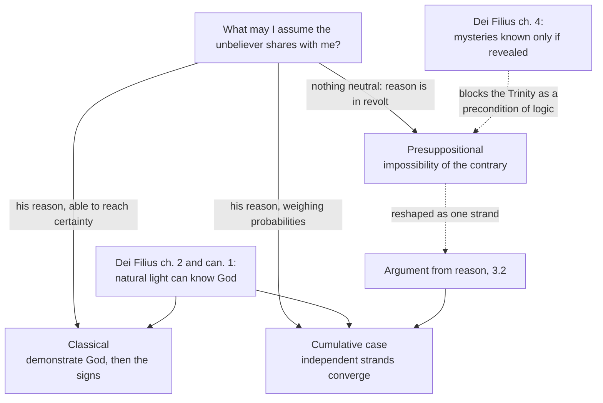

# Apologetics I · Lesson 1.2: Three strategies: classical, cumulative-case, presuppositional

> ⏱ ~15 min · Module 1: Giving a reason for the hope · Builds on: [1.1 What apologetics is, and what it isn't](01-01-what-apologetics-is-and-what-it-isnt.md), [`fundamental-theology` 2.3](../../fundamental-theology/lessons/02-03-fideism-and-rationalism.md) · Unlocks: [1.3 Burden of proof and the shape of a cumulative case](01-03-burden-of-proof-and-the-shape-of-a-cumulative-case.md)

## Why this matters

Every apologetic exchange starts with a decision you usually make without noticing: what may I assume the other person shares with me? Answer "his reason, working on the world" and you will build proofs. Answer "his reason, but only probabilities" and you will build a case. Answer "nothing, because his reason is itself in revolt" and you will refuse to argue on his ground at all. Those are the three strategies, and they are not styles. Each is a theory of the unbeliever's mind. This lesson states all three at their strongest, then says why a Catholic takes the first two and not the third, and why the third is still worth taking seriously.

## The idea

**[Classical](../reference.md#classical-apologetics).** Two steps, in order. First, natural theology: show from premises any reasoner can grant that God exists and could reveal. Second, history: show that he has revealed, in Christ, by signs (miracles, prophecy, the Resurrection) that make the revelation credible. The Catholic manuals ran it this way, with the Church as the bearer of that revelation at the end; Garrigou-Lagrange's *De Revelatione per Ecclesiam catholicam proposita* (1918) is the classic Thomist version. The step order matters: whether a resurrection report is believable depends on whether there is a God who could raise anyone.

**[Cumulative case](../reference.md#cumulative-case).** No single argument is a demonstration, but many independent strands, each modest, can together make theism more probable than not. Basil Mitchell's *The Justification of Religious Belief* (1973) put the model on the map for philosophers; Richard Swinburne's *The Existence of God* (1979; 2nd ed. 2004) formalized it in Bayesian terms, distinguishing arguments that merely raise a probability (C-inductive) from those that make a conclusion more probable than not (P-inductive), and concluding that the strands, with religious experience added, carry theism over the line. The Catholic ancestor is Newman's *Grammar of Assent* (1870), Chapter VIII §2, on how we become certain of anything concrete:

> It is the cumulation of probabilities, independent of each other, arising out of the nature and circumstances of the particular case which is under review; probabilities too fine to avail separately…

Note the phrase "independent of each other": it is exactly the condition [1.3](01-03-burden-of-proof-and-the-shape-of-a-cumulative-case.md) puts in odds form, and Newman's own theory of assent returns in [8.3](08-03-apologetics-in-a-secular-age.md).

**Presuppositional.** Do not argue *to* God from shared premises; argue that there are no shared premises unless God is presupposed. Here the third strategy needs its own section.

## The other side

[Presuppositionalism](../reference.md#presuppositionalism) is a Reformed position, and its defenders do not regard it as a refusal to argue. Cornelius Van Til (1895–1987, Westminster Theological Seminary) built it; Greg Bahnsen (1948–1995) made it famous in "The Great Debate: Does God Exist?" against the atheist Gordon Stein at the University of California, Irvine, on 11 February 1985. Its case, in its own terms:

1. **There is no neutral ground.** Every reasoner reasons from an ultimate commitment. The unbeliever's commitment is *autonomy*, reason answerable to nothing above itself, and that is not neutral; it is the very point in dispute. (John Frame, Van Til's student and expositor, glosses neutrality in Van Til's sense as thinking without an ultimate religious presupposition, which Van Til held impossible.)
2. **There are no [brute facts](../reference.md#brute-facts).** A brute fact is one uninterpreted, available to believer and unbeliever alike as raw material for a verdict. Van Til denied there are any: every fact is created, so every fact already carries God's interpretation. Classical apologetics, he charged, hands the unbeliever the facts and asks him to judge, as though the judge were not a party to the case.
3. **The [noetic effects of sin](../reference.md#noetic-effects-of-sin).** Calvin held that sin left human reason a ruin, not a void: some sparks remain, but smothered (*Institutes* II.ii.12). Abraham Kuyper drew the consequence that regenerate and unregenerate minds build two kinds of science. Van Til locates the point of contact not in shared premises but in Romans 1:18–21: the unbeliever *knows* God and holds that knowledge down (Paul's *katechontōn*, "holding down"; DR "detain the truth of God in injustice").
4. **The transcendental argument.** So argue at the level of preconditions. Logic, the uniformity of nature and moral obligation make no sense unless the God of Scripture is presupposed; the proof of Christianity is the *impossibility of the contrary*. Bahnsen's move against Stein was to argue that Stein's own appeals to logic, science and morality already presupposed what only Christian theism could supply.

At its best this is not fideism. It is an argument, and a bold one: not "probably God," but "without God, not even your objection is intelligible."

## The argument

Why a Catholic takes routes one and two:

- **P1.** Human reason, by its natural light, can know God with certainty from created things (*Dei Filius* ch. 2, defined in canon 1 on revelation: **rung 1**, a capacity claim; [`fundamental-theology` 1.2](../../fundamental-theology/lessons/01-02-natural-knowledge-of-god.md)).
- **P2.** Revelation can be made credible by outward signs, so faith is not a blind movement of the mind (*Dei Filius* ch. 3 and its canon 3: **rung 1**).
- **P3.** Sin wounds reason but does not destroy it. Aquinas: the inclination is diminished, never removed, since a creature without reason could not sin at all (ST I-II q.85 a.1); reason's wound is ignorance (a.3); and without grace the mind still knows natural truth by its own light (q.109 a.1).
- **∴ C1.** There is common ground: the unbeliever's reason, working on the world, can be argued with. In words: the Church says the ground exists; the classical step one is the attempt to stand on it.
- **P4.** There is a twofold order of knowledge, distinct in object: some truths, the mysteries, cannot be known unless revealed (*Dei Filius* ch. 4 with its canons: **rung 1**). The Trinity is the paradigm (ST I q.32 a.1; [`trinity-and-god` 1.2](../../trinity-and-god/lessons/01-02-the-one-true-god-and-what-reason-can-reach.md)).
- **∴ C2.** An argument whose conclusion is "the triune God of Scripture is a precondition of logic" claims to reach a mystery from natural principles. In words: the transcendental argument in its full Van Tilian form proves too much, and in exactly the direction *Dei Filius* calls semi-rationalism ([`fundamental-theology` 2.3](../../fundamental-theology/lessons/02-03-fideism-and-rationalism.md)).

Two cautions on weight. No Church text condemns Van Til; C1 and C2 are theological conclusions from rung-1 premises, so they sit at most at rung 4. And the choice *between* the classical and cumulative routes is freely disputed (rung 5): ch. 4 says right reason demonstrates the foundations of faith, but no text defines that any particular proof succeeds.

C2 does not make the transcendental argument foolish. Stripped of "no neutral ground" and aimed at theism rather than the Trinity, it is one more argument with premises: "rationality has preconditions; naturalism cannot meet them." That is [the argument from reason](../reference.md#argument-from-reason), which [3.2](03-02-reason.md) runs as a strand of the case, and it can be assessed. Frame, himself a presuppositionalist, later questioned whether Bahnsen's debate argument really differed from Aquinas's, since both held that without God there is no logic, natural law or moral law (his 2012 essay on the Stein debate).

**Concession.** The brute-fact complaint is right about something real. Evidence does not come pre-weighed: the same empty-tomb report is strong for someone whose prior for a living God is moderate and nearly worthless for someone whose prior is vanishingly small, and nothing in the report itself decides between them. Background beliefs shape what counts as evidence, and they are not settled by the evidence they shape ([`epistemology` 5.4](../../epistemology/lessons/05-04-the-problem-of-priors.md)). A classical apologist who presents the Resurrection to a convinced naturalist as a neutral fact simply waiting to be read has made the mistake Van Til named.

**Where the argument is weakest.** P3 is the hinge, and the Catholic reading of it is optimistic. If sin's damage to reason is graver than q.85 allows, Kuyper's two sciences follow and C1 collapses. Here the Catholic leans on doctrine and on an empirical observation (unbelievers do in fact prove theorems and reject bad arguments) rather than a demonstration. B. B. Warfield, a Reformed theologian, pressed this same point against the Dutch school: sin damages the use of every faculty without changing what any faculty is.

## Map of positions

Alt text: one question, what the unbeliever shares, branches into three strategies. Dei Filius chapter 2 supports the classical and cumulative routes; Dei Filius chapter 4 blocks the presuppositional route's Trinitarian conclusion, which survives only reshaped as the argument from reason, one strand of a cumulative case.

## Worked examples

**Ex 1 (the argument meeting the objection cleanly).** An invented skeptic, Ruth, says: "You trust your reasoning; so do I. That's just where we both start." The presuppositionalist replies that her trust is an unacknowledged debt to God and refuses to proceed until she owns it. The Catholic agrees with her first sentence, which is C1, and then argues from it: given that we both rely on reason's reliability, which hypothesis makes that reliance unsurprising, theism or unguided naturalism? The transcendental insight survives as a premise in an argument Ruth can inspect and reject, and it has stopped being a demand that she convert in order to have the conversation. That is the whole difference.

**Ex 2 (a hard case).** An invented naturalist, Tomas, reads the Resurrection evidence carefully and says: "Granted, it is strange. But my prior for a dead man rising is so low that no testimony moves it." The concession bites. The facts alone will not shift him, and saying "these are the facts" only repeats the brute-fact mistake. The classical answer is the reason for its order: step one exists to argue about exactly that prior. If natural theology makes a God who acts in history a live option, Tomas's prior is no longer a dogma but a conclusion open to revision, and [5.1](05-01-can-history-establish-a-miracle.md) and [5.5](05-05-weighing-it-the-bayesian-apologetic-and-its-limits.md) put numbers on it. But notice the strain: if step one fails for Tomas, step two has nothing to stand on, and the presuppositionalist will say this was always the shape of the debate. He is half right. The dispute *is* about priors. What the Catholic denies is that priors are beyond argument.

## Watch out

- **You might think presuppositionalism is fideism, but actually** it offers an argument, and a strong modal one. Caricaturing it as "believe first, no reasons" is a respect error of the kind this course grades hardest.
- **You might think the Church has condemned presuppositionalism, but actually** no magisterial act names it. *Dei Filius* defines a capacity of reason (rung 1) and the existence of mysteries (rung 1); the incompatibility is a theological conclusion drawn from those texts. Saying "Vatican I condemned Van Til" overstates the [level](../reference.md#levels-of-authority).
- **You might think Reformed epistemology and presuppositionalism are one view, but actually** Plantinga's claim that belief in God can be properly basic ([`philosophy-of-religion` 5.2](../../philosophy-of-religion/lessons/05-02-reformed-epistemology.md)) needs no transcendental argument and does not deny common ground.

## One-liner

> Classical and cumulative-case apologetics argue on ground the Church says exists; presuppositionalism denies the ground, and is right only that the ground is never quite level.

## Problems

**P1 (🟢)** *(Exegetical.)* *Dei Filius* ch. 2 teaches that God can be certainly known by the natural light of human reason from created things. Ch. 4, after distinguishing two orders of knowledge "in principle" (natural reason vs divine faith), goes on (Schaff, *Creeds of Christendom*):

> in object, because, besides those things to which natural reason can attain, there are proposed to our belief mysteries hidden in God, which, unless divinely revealed, can not be known.

(a) A presuppositionalist concludes that the triune God of Scripture is the precondition of all rational thought. Say which class of truth in the quoted clause that conclusion belongs to, and why the clause blocks reaching it by argument. (b) Say what ch. 2 secures for the classical apologist that the quoted clause does not. (c) Give the level of each teaching, and say whether these texts condemn presuppositionalism. Two sentences per part.

**P2 (🟡)** *(Apologetic: steelman and reply.)* (a) State the presuppositionalist charge against classical apologetics as Van Til or Bahnsen would recognize it. 100 words or fewer. (b) Reply, opening with a named concession. 150 words or fewer.

**P3 (🔴, optional)** *(Exegetical, then Evaluative.)* An invented debate opening, written for this problem; the speaker, a Catholic, is fictional:

> "Tonight I won't offer you evidence. Evidence only works between people who share a starting point, and you and I share none. I will show instead that your ability to reason at all presupposes the Holy Trinity. And my Church is behind me: Vatican I taught that reason without faith can know nothing certain about God."

(a) Name the two claims a Catholic cannot make consistently with *Dei Filius*, and the one misreport of what the council taught. (b) Rewrite the third sentence as a claim a Catholic may make, and say what the rewrite gives up. 150 words or fewer in total.

Solutions

**P1** *(Exegetical.)*

**Must hit, strict (a):**

- The conclusion belongs to the **mysteries hidden in God**: the Trinity is the paradigm of a truth that "unless divinely revealed, can not be known" (ST I q.32 a.1).
- A demonstration from the preconditions of logic would reach that mystery from natural principles, so the clause rules it out. Claiming it is the error the council calls semi-rationalism.

**Must hit, strict (b):**

- **Common ground.** Ch. 2 makes the natural light of reason, working from created things, *capable* of certain knowledge of God, so there is ground on which to argue with an unbeliever, which "no neutral ground" denies. The quoted clause marks a limit to that ground; it does not establish it.

**Must hit, strict (c):**

- Both are **rung 1**: ch. 2 is defined in canon 1 on revelation, a capacity claim; the existence of mysteries strictly so called is defined in the canons attached to ch. 4 ([`fundamental-theology` 2.3](../../fundamental-theology/lessons/02-03-fideism-and-rationalism.md)).
- **No condemnation by name.** That presuppositionalism is incompatible with them is a theological conclusion (rung 4 at most).

**Wrong turns:** saying the clause forbids every transcendental argument (a theistic one, aimed at God's existence, stays on the natural side); saying ch. 2 defines that some particular proof succeeds; saying "Vatican I condemned presuppositionalism"; treating ch. 4's expository prose as a canon.

**Model answer:** (a) The triune God is a mystery hidden in God, knowable only if revealed, so an argument deriving the Trinity from the conditions of logic claims to reach the second order by the first. The clause denies exactly that, and the error it names is semi-rationalism. (b) Ch. 2 gives the classical apologist his ground: unbelieving reason, working on the world, can reach God with certainty, so there is something to argue from. The quoted clause only fences off where that ground ends. (c) Both are rung 1, defined in the canons on revelation and on faith and reason. Neither names presuppositionalism, so the incompatibility is a theological conclusion, rung 4 at most.

---

**P2** *(Apologetic: (a) Exegetical, graded first · (b) reply.)*

**Must hit, strict (a), graded first:**

- **No neutral ground**: everyone reasons from an ultimate commitment, and the unbeliever's autonomy is a commitment, not neutrality.
- **No brute facts**: every fact is created and already interpreted by God, so classical apologetics wrongly hands the unbeliever uninterpreted facts and makes him judge.
- **Noetic effects of sin**: the unbeliever *knows* God and suppresses that knowledge (Rom 1:18–21); the point of contact is that suppressed knowledge, not shared premises.
- The alternative offered is an argument: the **transcendental argument**, the impossibility of the contrary.

**Must hit (b):**

- **Named concession:** evidence is not pre-weighed; background beliefs and priors shape what counts as evidence.
- Reason is **wounded, not destroyed** (ST I-II q.85 a.1, a.3; q.109 a.1), and *Dei Filius* ch. 2 makes common ground a capacity of reason.
- Priors are **arguable**: that is what the classical first step is for.
- At least one of these: the transcendental insight survives as a premise (the argument from reason); its Trinitarian conclusion collides with ch. 4.

**Wrong turns:** stating (a) as "presuppositionalists refuse to give reasons" or as fideism; saying they deny the unbeliever knows God at all; saying Calvin held reason wholly destroyed (he called it a ruin with sparks remaining); conflating the view with Plantinga's Reformed epistemology. A reply that concludes the presuppositionalist is right passes if it makes the moves.

**Model answer (a):** Classical apologetics pretends to a neutral ground that does not exist. Every reasoner starts from an ultimate commitment, and the unbeliever's is autonomy, reason accountable to no one, which is the very thing in dispute. There are no brute facts: every fact is created and God-interpreted, so offering the facts for the unbeliever's verdict concedes him the judge's seat. Besides, he already knows God and holds that knowledge down (Rom 1). The right argument is transcendental: logic, science and morality are unintelligible unless the God of Scripture is presupposed.

**Model answer (b), one of several:** Concession: the facts do not come pre-weighed; a naturalist's prior can neutralize any testimony, and pretending otherwise is naive. But the remedy is not to deny common ground. Sin wounds reason without unmaking it: Aquinas has the mind still knowing natural truth without new light, and *Dei Filius* ch. 2 makes certain knowledge of God a capacity of that same reason. Priors, then, can be argued about, which is what natural theology does before history is weighed. And the transcendental insight survives as an argument from reason, with premises the unbeliever can inspect. What cannot survive is a conclusion that reaches the Trinity from the preconditions of logic, since ch. 4 puts the mysteries beyond natural reason.

---

**P3** *(Exegetical, then Evaluative.)*

**Accept:** for (b), any rewrite whose conclusion is God's existence (not the Trinity) and that presents itself as an argument with premises the hearer may reject.

**Must hit, strict (a):**

- "You and I share none": denies the common ground ch. 2 and canon 1 make a capacity of natural reason.
- "Presupposes the Holy Trinity": claims a mystery is reachable from natural principles, against ch. 4.
- **Misreport:** Vatican I taught the opposite, that natural reason *can* know God with certainty from created things (ch. 2, canon 1). Wounded reason is not reason that knows nothing.

**Must hit, any verdict (b):**

- A rewrite such as: "the reliability of reason is better explained if there is a God than if there is not."
- What it gives up: the **impossibility of the contrary**. The claim becomes one strand of a cumulative case, probabilistic and open to rebuttal, and no longer a demand to concede before conversation.

**Wrong turns:** listing "I won't offer evidence" as itself contrary to *Dei Filius* (refusing to argue is unwise, not heretical; the error is the reason given for it); treating the speaker's position as fideism (he offers an argument); saying the rewrite is worthless because it is only probable.

**Model answer:** (a) "You and I share none" denies the common ground *Dei Filius* ch. 2 and its canon make a capacity of natural reason. "Presupposes the Holy Trinity" claims to reach a mystery by argument, which ch. 4 rules out. And the council taught the opposite of the reported claim: natural reason can know God with certainty from created things. (b) "Your trust in your own reasoning is better explained if there is a God than if your mind is the product of processes indifferent to truth." This gives up necessity: it is now one probabilistic strand the hearer may weigh and reject, not the impossibility of the contrary. I think the trade is worth it, since an argument the hearer can assess is one he can also be moved by.

## Connections

- **Backward:** [1.1](01-01-what-apologetics-is-and-what-it-isnt.md) placed apologetics inside the act of faith; the double order of knowledge and the fideism/rationalism gates are [`fundamental-theology` 2.3](../../fundamental-theology/lessons/02-03-fideism-and-rationalism.md); the defined capacity of reason is [`fundamental-theology` 1.2](../../fundamental-theology/lessons/01-02-natural-knowledge-of-god.md); motives of credibility and Newman's place among the analyses of faith are [`fundamental-theology` 2.2](../../fundamental-theology/lessons/02-02-credibility-and-the-preambles-of-faith.md).
- **Forward:** [1.3](01-03-burden-of-proof-and-the-shape-of-a-cumulative-case.md) turns Newman's "independent of each other" into the independence condition in odds form; [2.1](02-01-assembling-the-case.md) assembles the cumulative case; [3.2](03-02-reason.md) runs the argument from reason, the transcendental insight's Catholic form; [5.1](05-01-can-history-establish-a-miracle.md) and [5.5](05-05-weighing-it-the-bayesian-apologetic-and-its-limits.md) meet the prior problem of Ex 2 head on; [8.3](08-03-apologetics-in-a-secular-age.md) returns to Newman's illative sense.
- **Sideways:** priors and the brute-fact concession are [`epistemology` 5.4](../../epistemology/lessons/05-04-the-problem-of-priors.md); Reformed epistemology, the cousin presuppositionalism is often confused with, is [`philosophy-of-religion` 5.2](../../philosophy-of-religion/lessons/05-02-reformed-epistemology.md); the dispute over how badly sin damaged reason is the same one that divides Catholic and Reformed accounts of nature and grace, owned as doctrine (original sin, nature and grace) by [`creation-grace-last-things`](../../creation-grace-last-things/syllabus.md), and as a Catholic–Protestant dispute by [`apologetics-catholic-claims`](../../apologetics-catholic-claims/syllabus.md).
