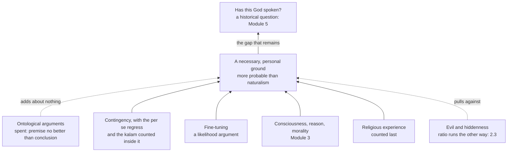

# Apologetics I · Lesson 2.1: Assembling the case

> ⏱ ~15 min · Module 2: The case for God, and the strongest replies · Builds on: [1.3 Burden of proof and the shape of a cumulative case](01-03-burden-of-proof-and-the-shape-of-a-cumulative-case.md), [`philosophy-of-religion` 1.1](../../philosophy-of-religion/lessons/01-01-which-god-and-what-an-argument-must-do.md), [`fundamental-theology` 1.2](../../fundamental-theology/lessons/01-02-natural-knowledge-of-god.md) · Unlocks: [2.2 Answering the atheist philosophers](02-02-answering-the-atheist-philosophers.md), [2.3 Evil and hiddenness](02-03-evil-and-hiddenness-the-replies-that-cost-something.md)

## Why this matters

[`philosophy-of-religion`](../../philosophy-of-religion/syllabus.md) took nine arguments apart one premise at a time and declined to add them up. This lesson adds them up. That means deciding, in public and with reasons, which arguments carry weight, which are spent, and which are the same argument wearing two coats. It also means stating plainly what the finished case reaches. It does not reach the God of the creed, and that is why this course has a Module 5.

## The idea

A detective rarely has a proof. She has a muddy boot, a motive and a missed train, and none of them convicts on its own. They convict together because each is likelier if the suspect did it, and because they come from different places. [1.3](01-03-burden-of-proof-and-the-shape-of-a-cumulative-case.md) gave this its form: a [cumulative case](../reference.md#cumulative-case) is a cable, not a chain, and independent likelihood ratios multiply ([`philosophical-method` 2.4](../../philosophical-method/lessons/02-04-weighing-evidence-in-odds-form.md)).

So the assembler's job is an audit, not a pile. Each argument from [`philosophy-of-religion`](../../philosophy-of-religion/syllabus.md) Modules 2–3 has to answer three questions:

1. **Does it carry evidence for someone not already persuaded?** If its key premise can only be believed by someone who already believes the conclusion, it adds nothing to the cable. It may still be sound, but it is [dialectically spent](../reference.md#dialectically-spent).
2. **Is it independent of the strands already counted?** Two arguments that turn on the same crux count once.
3. **Where does it land?** Every argument reaches some $X$: a necessary being, a designer, a ground of obligation. Getting from $X$ to God is a separate step, [the gap problem](../reference.md#the-gap-problem).

## The other side

The objection to all this is old, and at full strength it is good. Antony Flew compared a set of failed proofs to [ten leaky buckets](../reference.md#ten-leaky-buckets): if one bucket will not hold water, ten will not either. A heap of defective arguments, presented as though their sum should persuade, is a debating tactic and not a case.

The best version of the objection goes further than the image. **First**, a deductive argument with a doubtful premise establishes nothing, and adding more such arguments establishes nothing more. **Second**, recasting the arguments as probabilities does not save them. The fine-tuning likelihood may be undefined, because no measure exists over an unbounded range of constants (the normalizability problem). The designer's likelihood may be unassessable, because we cannot know a god's aims (Sober's inscrutable designer; [`philosophy-of-religion` 3.2](../../philosophy-of-religion/lessons/03-02-fine-tuning-the-objections.md), O3 and O4). Multiplying numbers nobody can state gives a product nobody can state. **Third**, the strands are not independent. Contingency, the per se regress, the kalam, fine-tuning and the moral argument all demand an explanation for something the naturalist is content to treat as a brute starting point. Deny that demand once and every strand weakens together: one bucket, counted five times. **Fourth**, the gap. Oppy argues that wherever theism posits a necessary first being, naturalism can posit a necessary initial physical state of the same causal shape ([`philosophy-of-religion` 2.4](../../philosophy-of-religion/lessons/02-04-cosmological-arguments-sufficient-reason.md)). And he sets dialectical success at moving *every* reasonable person, a bar he argues no argument for or against God clears ([`philosophy-of-religion` 1.1](../../philosophy-of-religion/lessons/01-01-which-god-and-what-an-argument-must-do.md)).

## The argument

1. **An argument that fails as a proof can still be evidence.** *In words:* to fail as a demonstration is not to have a likelihood ratio of 1. Swinburne's distinction between C-inductive and P-inductive arguments says exactly this (*The Existence of God*, 2nd ed., 2004; [`philosophy-of-religion` 1.1](../../philosophy-of-religion/lessons/01-01-which-god-and-what-an-argument-must-do.md)). So the buckets image holds only for arguments that carry *no* evidence. It does not hold for arguments that each carry some.
2. **The ontological arguments are dialectically spent.** In S5 the modal argument's premise "possibly God" is equivalent to its conclusion. Mackie pressed this point: grounds for the premise can be no better than grounds for God, and "possibly no maximal being" looks just as conceivable ([`philosophy-of-religion` 2.2](../../philosophy-of-religion/lessons/02-02-the-modal-ontological-argument.md)). Plantinga himself claimed only that the argument shows belief to be rationally acceptable, not that it should convince a doubter. For Anselm's version, [2.1](../../philosophy-of-religion/lessons/02-01-anselms-ontological-argument.md) reports a widespread view, theists included, that no known version succeeds. So they enter the cable at roughly 1.
3. **The per se regress and the kalam are not separate strands from contingency.** The regress's crux is whether a derived-power explanation needs a first lender, and its critics say that demand is the PSR ([2.3](../../philosophy-of-religion/lessons/02-03-cosmological-arguments-the-per-se-regress.md)). The kalam rests on the A-theory and on the impossibility of an actual infinite ([2.5](../../philosophy-of-religion/lessons/02-05-cosmological-arguments-the-kalam.md)). Each borrows the explanatory demand that contingency states most cleanly, so they are counted with it, not beside it.
4. **Contingency is the first pillar of the [load-bearing pair](../reference.md#the-load-bearing-pair).** The BCCF has an explanation. If explanation need not entail, so that van Inwagen's modal collapse is avoided, then that explanation is the free act of a necessary being ([2.4](../../philosophy-of-religion/lessons/02-04-cosmological-arguments-sufficient-reason.md)). Note what denying entailment buys: only an agent explains without necessitating, so the escape from collapse already narrows part of the gap toward a *personal* ground.
5. **Fine-tuning is the second pillar, and largely independent of the first.** Contingency asks why there is any world. Fine-tuning asks why *this* range of constants. Its evidence is a likelihood comparison that does not need the PSR ([3.1](../../philosophy-of-religion/lessons/03-01-from-design-to-fine-tuning.md)).
6. **Further strands are consciousness, reason, morality and religious experience.** Each is a datum naturalism must also explain, and Module 3 argues each with the naturalist's answer stated first ([3.3](../../philosophy-of-religion/lessons/03-03-moral-arguments.md), [3.4](../../philosophy-of-religion/lessons/03-04-the-argument-from-religious-experience.md)). Swinburne puts experience last. On his account the other arguments leave theism neither very probable nor very improbable, and experience, under the principle of credulity, tips it over one half.
7. **Evil and hiddenness enter the same product** ([total evidence](../reference.md#total-evidence); [2.3](02-03-evil-and-hiddenness-the-replies-that-cost-something.md)).
8. **∴ On the evidence so far, a necessary, personal, powerful and intelligent ground of the contingent order is more probable than its naturalist rival.** *In words:* that is the most the case can claim, and it claims it as a probability.

Notice what step 8 leaves out: the God of Israel, a God who speaks, the Trinity. A cumulative case from the world reaches a creator. It cannot reach a creator who has *said* anything, because whether God has spoken is a question about events. So the case must become historical, and Module 5 is where it does.

What a Catholic is bound to here is narrow, and both directions matter. *Dei Filius* canon 1 (Vatican I, 1870) defines that the one true God can be known with certainty by natural reason from created things. That is rung 1 on the [ladder](../../fundamental-theology/lessons/04-04-the-ladder-of-doctrinal-authority.md), *de fide*. It defines a **capacity**, not a **performance**. No argument in this lesson is canonized, and whether any of them is sound is freely disputed, rung 5 ([`fundamental-theology` 1.2](../../fundamental-theology/lessons/01-02-natural-knowledge-of-god.md); [`thomistic-synthesis` 3.1](../../thomistic-synthesis/lessons/03-01-demonstrating-that-god-exists.md) makes the same point). The council concedes something too. Chapter 2 says revelation lets everyone know even these truths readily, with firm certainty and without error. The council did not expect the philosophical road to be easy for everyone.

**Concession.** The ontological arguments are dialectically spent for anyone not already persuaded, and this case does not lean on them. Each of the two pillars faces a reply that serious philosophers think succeeds. Against contingency there is Hume–Edwards (explain every conjunct and nothing is left over) and modal collapse. Against fine-tuning there is the multiverse and the normalizability problem. Flew's image is also right about one kind of case: a pile of arguments that each carry no evidence is still worth nothing.

**Where the argument is weakest.** Step 5's independence claim. The naturalist who accepts a brute, unexplained contingent world (Hume–Edwards) has already shown a tolerance for brute facts that also blunts fine-tuning, unless the likelihood argument really does work without any explanatory demand. If the two pillars move together, the cable has fewer strands than it looks.

## The cable

Alt text: a cable diagram in which contingency, fine-tuning, the Module 3 strands and religious experience support a necessary personal ground, the ontological arguments add almost nothing, evil pulls against it, and an arrow leads on to the historical question of Module 5.

## Worked examples

**Example 1 (clean case: the buckets meet a cable).** An invented debater says: "Contingency fails, because Hume–Edwards answers it. Fine-tuning fails, because of the multiverse. Two failures make zero." Run the audit. Hume–Edwards is a reply to premise 3 of [2.4](../../philosophy-of-religion/lessons/02-04-cosmological-arguments-sufficient-reason.md). It shows the premise is *contestable*. It does not show that a contingent world is as expected on naturalism as on theism. The multiverse reply raises the rival's likelihood only if multiverses have a reasonable prior and do not need tuning themselves ([3.2](../../philosophy-of-religion/lessons/03-02-fine-tuning-the-objections.md), O1). Neither reply drives its argument's ratio to 1. Each lowers it. "Failed as a proof" and "weightless as evidence" are different verdicts, and the debater has slid from one to the other.

**Example 2 (hard case: a naturalist who takes the brute fact).** An invented naturalist, Vera, grants every premise of fine-tuning except the measure. She also accepts the BCCF as brute. She says: "If I may stop at a brute world, I may stop at brute constants." Here the cable strains. Vera has not refuted either pillar. She has correlated them, and that is objection three in action. The apologist's best reply is that the two demands differ. Asking why there is anything at all is a demand for explanation. Asking why the constants fall in a life-permitting window is a surprise relative to a stated hypothesis, and surprise is something a likelihood argument can register without any PSR. Vera can answer that, without a measure (O3), there is no surprise to register. Then the dispute is about the measure, not about brute facts. The honest score is that the strands are *partly* dependent, and the case should be stated with fewer effective strands than its count.

## Watch out

- **You might think *Dei Filius* defined that the cumulative case, or some proof, succeeds, but actually** canon 1 defines only that reason *can* know God from created things. Calling a Catholic who rejects fine-tuning a dissenter overstates the level, and that is an exegetical error. Treating the canon itself as one school's opinion is the same error run downward.
- **You might think "dialectically spent" means "unsound", but actually** it means the argument cannot move the unpersuaded. Plantinga's modal argument may be sound. It just cannot bear weight in a case addressed to Oppy.
- **You might think Oppy says there is no evidence for God, but actually** his claim is that naturalism does at least as well as theism on a comparison of whole theories ([2.2](02-02-answering-the-atheist-philosophers.md)). Stating him as a village sceptic is the caricature this course grades hardest.

## One-liner

> A cumulative case for God stands on contingency and fine-tuning, writes off the ontological arguments, counts dependent strands once, carries evil in the same sum, and reaches a personal creator, which is exactly why it must then turn to history.

## Problems

**P1 (🟡) *(Apologetic: (a) Exegetical, graded first · (b) reply)*** (a) State, at the strength its best defenders would recognize, the objection that a cumulative case of individually failed arguments fails as a whole. Give Flew's image and at least two ways the objection survives a probabilistic recasting. (b) Reply, opening with a named concession. 150 words or fewer in total.

**P2 (🟡) *(Find the crux · Exegetical (a) · Evaluative (b))*** An invented exchange:

> **Apologist:** "I have three cosmological arguments, Leibniz's, the per se regress and the kalam, and each makes theism likelier. That's three strands."
>
> **Sceptic:** "You have one strand. Every one of them stops working the moment I'm allowed an unexplained starting point."

(a) Name the single premise the sceptic says all three share, and the [`philosophy-of-religion`](../../philosophy-of-religion/syllabus.md) lesson where each argument's crux is located. (b) Which of the three has the best claim to add something beyond the other two, and why? Any verdict. Three sentences per part.

**P3 (🔴) *(Exegetical · diagnose)*** An invented parish bulletin note:

> "Vatican I settled it: the existence of God is proved by reason, so any Catholic who doubts the fine-tuning argument is denying a dogma. And because the case for God is proved, the truth of Christianity is proved along with it. Why do we still need the Gospels as history?"

Name three distinct errors, each in one or two sentences, and give the correct level for every Church claim you mention. 150 words or fewer.

Solutions

**P1** *(Apologetic: (a) Exegetical, graded first · (b) reply)*

**Must hit, strict (a), graded first:**

- Flew's image: if one leaky bucket will not hold water, ten will not. A sum of individually defective arguments is no case.
- At least two probabilistic survivals: (i) some likelihoods are undefined or unassessable (normalizability, inscrutable designer), so the product is too; (ii) the strands share one explanatory demand on brute facts, so they are not independent and count once; (iii) total evidence: evil enters the same sum. The gap (Oppy's necessary physical state) also earns credit.

**Must hit (b):**

- A named concession: arguments that carry *no* evidence add to zero, or independence is genuinely doubtful.
- The distinction between failing as a proof and having a ratio of 1 (C-inductive).
- A response to dependence: count shared cruxes once, and argue that at least one pair (contingency and fine-tuning) is largely independent.

**Wrong turns:** stating the objection as "there is no evidence for God"; treating Flew as Oppy; answering (b) with "many arguments must be worth something", which is the very slide the objection targets; claiming *Dei Filius* guarantees the sum works.

**Model answer (b), one of several:** Concession: a pile of arguments that each carry no evidence is worth nothing, and the cosmological strands do share one demand for explanation, so they count once. But "fails as a proof" does not mean "ratio of 1". Hume–Edwards makes contingency's premise contestable without making a contingent world just as expected on naturalism. Fine-tuning's datum, which constants we have, is a likelihood comparison that does not need the PSR, so it is a second bucket and not the first one recounted. Where a likelihood is undefined, the honest move is to drop that term, not to declare the whole product worthless.

---

**P2** *(Find the crux · Exegetical (a) · Evaluative (b))*

**Must hit, strict (a):** the shared premise is an **explanatory demand on what the naturalist treats as brute**, the principle of sufficient reason or a near relative. Cruxes: Leibniz's premise 1 applied to the BCCF, with modal collapse ([`philosophy-of-religion` 2.4](../../philosophy-of-religion/lessons/02-04-cosmological-arguments-sufficient-reason.md)); the per se regress at whether derived power defers or completes an explanation, where critics say the demand for a first member is the PSR ([2.3](../../philosophy-of-religion/lessons/02-03-cosmological-arguments-the-per-se-regress.md)); the kalam at the impossibility of an actual infinite and the A-theory ([2.5](../../philosophy-of-religion/lessons/02-05-cosmological-arguments-the-kalam.md)).

**Accept:** any of the three in (b), with a reason tied to its crux.

**Must hit, any verdict (b):** say what the chosen argument needs that the others don't, or needs less of. The kalam's first premise is only that *beginnings* have causes, and its second premise draws partly on physics. The per se regress claims not to need the full PSR. Then concede how far the overlap goes.

**Wrong turns:** saying the three are fully independent because they have different authors; treating the kalam as PSR-free without noting that its causal premise is itself an explanatory demand.

**Model answer (b), one of several:** The kalam has the best claim. Its causal premise covers only things that begin, which is weaker than the PSR, and its second premise rests on a separate argument about actual infinites plus cosmology, which the other two never use. It still asks for a cause where the sceptic would accept a brute beginning, so it adds a partial strand, not a full one.

---

**P3** *(Exegetical · diagnose)*

**Must hit, strict:**

- **Level overstated.** *Dei Filius* canon 1 (1870) defines, at rung 1, that God *can* be known with certainty by natural reason from created things. That is a capacity. The soundness of fine-tuning or of any other argument is rung 5, freely disputed, so doubting it denies no dogma.
- **The gap.** Even a successful case reaches a necessary, personal creator, not the Trinity or a God who has spoken. Christianity is not "proved along with it".
- **Why history is needed.** Whether God has revealed himself is a question about events, so the case must go historical (Module 5). *Dei Filius* ch. 2 itself makes revelation the means by which even natural truths are known by all readily and without error, and makes it necessary for the supernatural end.

**Wrong turns:** saying Vatican I taught nothing about natural knowledge, which is the downward error; calling the cumulative case "proved" when it claims a probability.

**Model answer:** First, the note inflates a capacity into a performance. *Dei Filius* canon 1 (rung 1, *de fide*) defines that reason *can* know God from created things. Whether the fine-tuning argument is sound is freely disputed (rung 5), so doubting it denies nothing defined. Second, even a successful case for God reaches a personal creator, not Christianity. The Trinity and the Incarnation are revealed, not inferred. Third, whether that creator has spoken is a historical question, so the Gospels as history are where the case has to go next. The council itself taught that revelation makes even the truths reason could reach known to all readily and without error.

## Flashback

**From Lesson [1.2](01-02-three-strategies.md) (Three strategies: classical, cumulative-case, presuppositional):** *(Exegetical (a) · Evaluative: find the crux (b).)* An invented exchange between two students (nobody said this; it is built for the problem):

> **Reformed student:** "Your atheist colleague proves theorems flawlessly. That doesn't show common ground. It shows she knows God and is living on that knowledge while denying it."
>
> **Catholic student:** "It shows her reason, wounded or not, still works on the world, which is all the classical apologist needs."

(a) Name the doctrinal premise each student is relying on, with its source. Two sentences. (b) Why can the mathematician's success not settle the dispute between them, and what question would? Any verdict. Two sentences.

Solution

**Must hit, strict (a):**

- **Reformed:** the unbeliever *knows* God and holds that knowledge down (Romans 1:18–21, Paul's "holding down"), so the point of contact is suppressed knowledge, not shared premises; behind it, the noetic effects of sin (Calvin's ruin with sparks smothered, Van Til's no neutral ground).
- **Catholic:** sin wounds reason without destroying it (ST I-II q.85 a.1 and a.3; without grace the mind still knows natural truth, q.109 a.1), and *Dei Filius* ch. 2 with canon 1 makes certain knowledge of God from created things a capacity of natural reason (rung 1).

**Must hit, any verdict (b):**

- **The observation does not discriminate.** Both accounts predict that she proves theorems: one through suppressed knowledge of God, the other through a nature sin left intact. A datum equally expected on both rivals moves neither, a likelihood ratio of about 1.
- **The crux is the scope of sin's damage**: whether it reaches what reason *is*, or only its use, above all its use on God. Mathematics lies in the region both sides agree reason still works. The deciding question is whether an unbeliever can be moved toward God by argument from premises she already grants. That is where 1.2 locates the weak point of the Catholic case (its P3), and Warfield's use-versus-nature distinction is the Catholic side's answer to it.

**Wrong turns:** saying the Reformed student thinks unbelievers cannot reason at all (Calvin's sparks, and the student grants the theorems); calling the Reformed view fideism; treating the mathematician as decisive evidence for the Catholic side; overstating the level by saying *Dei Filius* condemns the Reformed position (no magisterial act names it).

**Model answer, one of several:** (a) The Reformed student relies on Romans 1:18–21: the unbeliever knows God and suppresses that knowledge, so her competence is borrowed from what she denies, not proof of neutral ground. The Catholic relies on Aquinas's wounded-not-destroyed reason (I-II q.85) and on *Dei Filius* ch. 2 and canon 1 (rung 1), which make knowledge of God from creation a capacity of natural reason. (b) Both views predict her flawless proofs, so the observation carries a ratio of about 1 and settles nothing. The crux is whether sin damages reason's nature or only its use on God, and the test is whether she can be moved by an argument about God from premises she already accepts.

## Connections

- **Backward:** the skeletons and verdicts are [`philosophy-of-religion`](../../philosophy-of-religion/syllabus.md)'s ([2.1](../../philosophy-of-religion/lessons/02-01-anselms-ontological-argument.md)–[2.5](../../philosophy-of-religion/lessons/02-05-cosmological-arguments-the-kalam.md), [3.1](../../philosophy-of-religion/lessons/03-01-from-design-to-fine-tuning.md)–[3.4](../../philosophy-of-religion/lessons/03-04-the-argument-from-religious-experience.md)); the cable is [1.3](01-03-burden-of-proof-and-the-shape-of-a-cumulative-case.md)'s; the capacity/performance distinction is [`fundamental-theology` 1.2](../../fundamental-theology/lessons/01-02-natural-knowledge-of-god.md)'s.
- **Forward:** [2.2](02-02-answering-the-atheist-philosophers.md) meets Mackie and Oppy, who add the same arguments and get a different total; [2.3](02-03-evil-and-hiddenness-the-replies-that-cost-something.md) prices the term that runs the other way; Module 3 argues the strands of step 6; [5.1](05-01-can-history-establish-a-miracle.md) begins the historical turn.
- **Sideways:** a probable case for a preamble is a [motive of credibility](../reference.md#motives-of-credibility), not a demonstration ([`fundamental-theology` 2.2](../../fundamental-theology/lessons/02-02-credibility-and-the-preambles-of-faith.md)). Newman's convergence of probabilities, returning in [8.3](08-03-apologetics-in-a-secular-age.md), is the older name for this cable.
