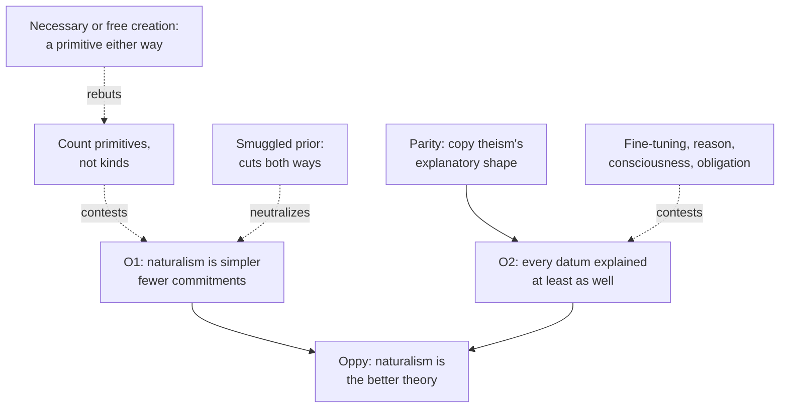

# Apologetics I · Lesson 2.2: Answering the atheist philosophers

> ⏱ ~15 min · Module 2: The case for God, and the strongest replies · Builds on: [2.1 Assembling the case](02-01-assembling-the-case.md), [1.3 Burden of proof and the shape of a cumulative case](01-03-burden-of-proof-and-the-shape-of-a-cumulative-case.md) · Unlocks: [2.3 Evil and hiddenness](02-03-evil-and-hiddenness-the-replies-that-cost-something.md), [3.1 Naturalism at its best](03-01-naturalism-at-its-best.md)

## Why this matters

[2.1](02-01-assembling-the-case.md) added the arguments up. Two philosophers have done the same sum with more care than most apologists and come out the other way: J. L. Mackie in *The Miracle of Theism* (1982) and Graham Oppy in *Arguing about Gods* (2006) and *The Best Argument against God* (2013). This lesson states both as they state themselves. It then argues back, and asks what would count as winning. The answer is less than an apologist hopes and more than a skeptic grants.

## The idea

Two ways to judge a worldview. One is the **trial of the arguments**: put each proof in the dock, and if every one is acquitted of soundness, theism has lost. The other is the **comparison of theories**: write down the best version of theism and the best version of its rival, and ask which does better on everything we know. Mackie mostly works the first way and ends with a verdict on the balance. Oppy insists on the second, and he is right to. Most of this lesson is about what follows once the apologist accepts his frame.

## The other side

**Mackie.** The title is borrowed from Hume. *Enquiry* §X ends with an ironic sentence: the Christian religion

> not only was at first attended with miracles, but even at this day cannot be believed by any reasonable person without one.

Mackie takes the arguments one family at a time: ontological, cosmological, design, moral, religious experience, evil. He finds that none proves God, and none makes God more probable than not. Two of his moves matter here. First, he concedes more than his popular readers remember. Evil does not make theism's core doctrines inconsistent ([`philosophy-of-religion` 4.1](../../philosophy-of-religion/lessons/04-01-the-logical-problem-of-evil.md)). And objective values, if there were any, would make a god's existence more probable. He keeps his atheism on that strand only by denying there are objective values ([`philosophy-of-religion` 3.3](../../philosophy-of-religion/lessons/03-03-moral-arguments.md)). Second, his conclusion is a judgment on the **balance of probabilities**, the heading of a section in his concluding chapter: weighed together, the considerations leave theism much less probable than its denial. The "miracle" of the title is that theism goes on being believed. That is [Mackie's verdict](../reference.md#mackies-verdict).

**Oppy.** Oppy works on two levels, and readers who blur them misstate him.

1. **About arguments.** In *Arguing about Gods*, a fully successful argument would persuade every reasonable person to accept its conclusion. By that bar no argument for God's existence succeeds, and none against it does either. Reasonable people can be theists, agnostics or atheists. He is an atheist who says so ([`philosophy-of-religion` 1.1](../../philosophy-of-religion/lessons/01-01-which-god-and-what-an-argument-must-do.md)).
2. **About theories.** In *The Best Argument against God*, the right way to decide is to compare the best theory on which God exists with the best theory on which God does not, on all the relevant data. He does this with Theism against Naturalism, judged on the [theoretical virtues](../reference.md#theoretical-virtues): simplicity, fit with the data, explanatory scope and power. His conclusion is that Naturalism is the better theory. It is **simpler**, because it has fewer commitments: natural causes only. And every datum considered is explained **at least as well** by Naturalism as by Theism. In *Naturalism and Religion* (2018) he repeats the comparison and adds that he does not think those it fails to persuade are irrational.

The engine of the second level is [parity](../reference.md#oppys-parity-strategy). Whatever explanatory shape theism gives reality, naturalism can copy it. Suppose theism ends the regress in a necessary God. Then naturalism ends it in a necessary initial natural state. Suppose theism takes a brute contingent fact somewhere. Then naturalism takes one in the same place. Each tie leaves naturalism ahead on simplicity, because it never adds the extra supernatural cause. Joseph Schmid ("Naturalism, Classical Theism, and First Causes", *Religious Studies*, 2023) puts the point sharply: the classical theist is committed to the natural world too, so the naturalist's ontology is a proper part of the theist's.

## The argument

**Concession.** Oppy is right that theism must be compared as a total theory, not argument by argument. A case that wins five skirmishes and ignores the sixth has not been weighed. The apologist owes the same weighing on [total evidence](../reference.md#total-evidence) that Oppy offers: every datum, suffering included, and a theory written out in full on both sides.

Accepting the frame, the Catholic reply runs:

1. **P1.** Oppy's verdict needs two premises: naturalism is simpler (O1), and on every datum it explains at least as well (O2).
2. **P2.** O1 counts **kinds of commitment**. On that count, theism is naturalism plus God, and it must lose. *In words:* the ledger was set up so that any addition is a cost.
3. **P3.** But the virtue that matters is fewest **unexplained primitives**, not fewest kinds. Classical theism has one primitive, an altogether simple being whose existence is not received from anything ([`thomistic-synthesis` 3.4](../../thomistic-synthesis/lessons/03-04-divine-simplicity-and-the-attributes.md)). From it the natural world's existence is explained. Naturalism leaves that world, with its particular laws, constants and initial state, as the primitive. *In words:* the theist adds a cause to explain the thing the naturalist leaves unexplained, so the count is not obviously in naturalism's favour.
4. **P4.** O2 is contested datum by datum: the fine-tuning of the constants ([`philosophy-of-religion` 3.1](../../philosophy-of-religion/lessons/03-01-from-design-to-fine-tuning.md)), the reliability of reason, consciousness, and moral obligation. Module 3 argues that on each, "at least as well" is a promissory note.
5. **∴ C.** Oppy's comparison does not show naturalism the better theory. At best it shows a stalemate on simplicity, and the outcome turns on O2, which is where the argument must now go.

*In words:* the apologist wins nothing by attacking parity in general; he wins or loses on particular data where parity looks strained.

Two charges cut both ways. **The smuggled prior.** Calling theism "the best explanation" quietly puts simplicity into the prior, and a different measure of simplicity gives a different prior. True. But Oppy's O1 is a prior judgment too, so neither side gets a neutral simplicity for free ([`epistemology` 5.4](../../epistemology/lessons/05-04-the-problem-of-priors.md)). **Neutral ground.** Philosophers of science dispute whether theoretical virtues track truth even in physics; the no-miracles argument for scientific realism faces the base-rate objection ([`philosophy-of-science`](../../philosophy-of-science/syllabus.md) 5.1). If the virtues are contested there, they are contested here.

What counts as winning? Not Oppy's bar. No argument persuades every reasonable person, and *Dei Filius* never asked for one. Its canon 1 defines that reason *can* know God, a capacity claim at the top rung, not a promise that any proof will carry the room ([`fundamental-theology` 1.2](../../fundamental-theology/lessons/01-02-natural-knowledge-of-god.md)). Winning means two things. The theist is reasonable, which Oppy grants. And on total evidence, theism is ahead, which Mackie denies and Oppy disputes.

**Where the argument is weakest.** P3. Oppy can reply that the theist's one primitive is not cheaper. God must explain *this* world. Either God creates it necessarily, and the world is as necessary as the naturalist's initial state (the modal collapse of [`philosophy-of-religion` 2.4](../../philosophy-of-religion/lessons/02-04-cosmological-arguments-sufficient-reason.md)), or God creates it freely, and a brute contingent choice is back at the bottom. If that reply holds, the stalemate is real and O1 decides it for naturalism.

## The argument map

Solid arrows are Oppy's argument; dashed arrows are replies, and the last is Oppy's rejoinder to the first reply.

## Worked examples

**Example 1 (clean: the ledger).** An invented naturalist in a seminar writes two columns. Naturalism: spacetime, fields, laws. Theism: spacetime, fields, laws, God. "Shorter column wins." Run P3. Ask what each column leaves unexplained. The naturalist's whole column is primitive. The theist's has one primitive entry, and the theist claims the other three are explained by it. The ledger has measured the length of the list, not the number of things taken as given. Now say what this shows: not that theism wins, but that "shorter list" was not a neutral measure of simplicity. The dispute moves to whether "explained by God" explains anything, and that is a fair place for it.

**Example 2 (hard: the necessary initial state).** Oppy's cosmological parity. Theism: a necessary God, a contingent world. Naturalism: a necessary initial natural state, with everything after it following. The theist objects that a state with particular values (these constants, this entropy) is a poor candidate for necessity. Necessity suits the simple, not the specific. That objection has force, but watch it strain. Push the theist to say why God made *this* world. If he says "necessarily," his world is as necessary as the naturalist's initial state, and he has the modal-collapse problem without the simplicity advantage. If he says "freely, for no further reason," he has a brute contingency at the base, and so does the naturalist. The classical reply is that free creation by a perfect agent explains through purpose without necessitating. It is coherent ([`thomistic-synthesis` 5.1](../../thomistic-synthesis/lessons/05-01-creation-and-conservation.md) works out creation as free and non-necessitated). But Oppy can call a purpose that leaves the choice unexplained a primitive by another name. This datum alone does not break the tie.

## Watch out

- **You might think Oppy says there is no evidence for God, or that believers are irrational, but** he says neither. He says no argument persuades every reasonable person, that reasonable people can be theists, and that naturalism is the better theory on the evidence. Misstating him is a caricature and fails an exegetical part.
- **You might think Mackie's concession about objective values means he thought the moral argument works, but** he gave it as a conditional and denied the antecedent. Its force depends on rejecting his error theory. Wielenberg and Enoch also deny the conditional itself ([`philosophy-of-religion` 3.3](../../philosophy-of-religion/lessons/03-03-moral-arguments.md)).
- **You might think *Dei Filius* commits a Catholic to winning this debate, but** canon 1 defines a capacity, not a performance. It is top rung for what it says, and it says nothing about any argument's success with Oppy. Citing it as if the Church had defined that the proofs persuade is overstating its level.

## One-liner

> Mackie tried the arguments one by one and gave a verdict on the balance; Oppy compares whole theories and wins on simplicity if parity holds. The apologist accepts the comparison, contests the count, and goes to the data where parity strains.

## Problems

**P1 (🟢) *(Apologetic: (a) Exegetical, graded first · (b) reply)*** A theist debater announces: "Even Mackie admitted the moral argument works."

(a) State what Mackie actually concluded in *The Miracle of Theism*, including the shape of his final verdict and the two concessions this lesson names. Three sentences at most.
(b) Give the best reply a theist can build on Mackie's moral concession, and name what that reply costs. 100 words or fewer.

**P2 (🟡) *(Exegetical, diagnose)*** An invented debate opening (nobody said this; it is built for the problem):

> "Professor Graham Oppy, the most rigorous atheist philosopher alive, has shown that there is simply no evidence for God. After cataloguing every argument, he proved that theism fails, so anyone who still believes is clinging to something no reasonable person could accept."

Name three misstatements of Oppy, and for each give the correction. One sentence each.

**P3 (🔴, optional) *(Evaluative)*** Suppose, for argument's sake, a careful inquirer finds Oppy's comparison a genuine tie: equal simplicity, equal fit, no datum decisive. In 150 words or fewer: what would that stalemate mean for the naturalist, and what for the Catholic apologist? Any verdict passes.

Solutions

**P1** *(Apologetic: (a) Exegetical, graded first · (b) reply)*

**Must hit, strict (a), graded first:**

- Mackie's verdict is on the **balance of probabilities**: taken together, the arguments leave theism much less probable than its denial. No argument proves God or makes God more probable than not.
- Concession 1: evil does not make theism's core doctrines **logically inconsistent**.
- Concession 2: objective values, **if they existed**, would make a god's existence more probable. Mackie denies they exist (error theory), so he does not grant that the moral argument works.

**Must hit (b):**

- The reply runs Mackie's conditional forward. For anyone with good grounds for objective values, Mackie's own judgment says theism gains probability.
- The cost, named: the reply is only as strong as moral realism against error theory. It also does nothing against godless realists (Wielenberg, Enoch), who deny the conditional.

**Wrong turns:** "Mackie admitted the moral argument works" (he denied its premise); stating the verdict as "God is impossible" (he concedes consistency on evil); omitting that the verdict is comparative and probabilistic.

**Model answer (b), one of several:** Mackie granted that objective values would make God more probable, and denied them. So the argument divides at moral realism. A theist who can defend realism against the error theory gets Mackie's own conditional for free, and Mackie's atheism on this strand rests on the error theory alone. The cost: the reply now owes a defence of realism. And it gains nothing against Wielenberg or Enoch, who accept objective values and deny that they need God. That is [3.4](03-04-morality.md)'s fight.

---

**P2** *(Exegetical, diagnose)*

**Must hit, strict:**

- **"No evidence for God."** Oppy does not say this. He says no argument persuades every reasonable person, and that on total evidence naturalism is the **better theory**: simpler, and explaining every datum at least as well. That is a comparative judgment about evidence, not a denial that there is any.
- **"Proved that theism fails."** His bar is that no argument for *or against* God succeeds in persuading every reasonable person. That includes his own. His positive case is a comparison of theories, not a proof.
- **"No reasonable person could accept it."** He holds the opposite: reasonable people can be theists, and he does not count those his case fails to persuade as irrational.

**Wrong turns:** correcting only the tone ("most rigorous") instead of the content; swapping one caricature for another ("Oppy thinks it's a coin toss"). He judges naturalism better, not tied.

**Model answer:** (1) Oppy does not deny there is evidence for God. He argues that naturalism explains all the data at least as well and more simply. (2) He does not claim a proof. He holds that no argument either way persuades every reasonable person, and offers a comparison of theories instead. (3) He explicitly allows that reasonable people can be theists and does not call the unpersuaded irrational.

---

**P3** *(Evaluative)*

**Accept:** any verdict that makes the moves below.

**Must hit, any verdict:**

- Separate **dialectical** stalemate (no argument moves every reasonable person, which Oppy already asserts) from **evidential** parity (posterior odds near even on total evidence).
- For the naturalist: a tie defeats Oppy's claim that naturalism is *better*, unless a presumption breaks it. Say whether one does ([1.3](01-03-burden-of-proof-and-the-shape-of-a-cumulative-case.md)).
- For the apologist: a tie is not a loss. *Dei Filius* claims a capacity, not a win, and a tie at the level of natural theology leaves room for the historical evidence (Module 5) to break it. But the prior that evidence starts from is that same tie.

**Wrong turns:** treating a tie as automatically favouring whoever spoke second; saying a tie proves faith is "just a choice" without argument; invoking *Dei Filius* as if it settled the tie.

**Model answer, one of several:** Oppy already grants the dialectical stalemate: reasonable people land on both sides. A tie in the *evidence* is different, and it costs the naturalist more. His claim was that naturalism is the better theory, and a tie withdraws that. He can recover only by a presumption of atheism, which [1.3](01-03-burden-of-proof-and-the-shape-of-a-cumulative-case.md) gives reasons to doubt. For the apologist a tie is survivable. The Church claims reason can know God, not that every argument wins. And even odds are where historical evidence about Jesus does the most work. The price is honesty: the apologist cannot then describe natural theology as having settled anything. Whatever the resurrection case shows starts from even odds, not from a theism already won.

## Flashback

**From Lesson [1.3](01-03-burden-of-proof-and-the-shape-of-a-cumulative-case.md) (Burden of proof and the shape of a cumulative case):** *(Formal.)* An invented apologist sets prior odds $G:N = 2:5$ and offers one datum $D$, judging $P(D \mid G) = 0.48$ and $P(D \mid N) = 0.12$. (a) Give the likelihood ratio, the posterior odds and the probability. (b) A naturalist replies with a refined rival $N^*$ on which $P(D \mid N^*) = 0.36$. Keeping the prior odds at $2:5$ and $P(D \mid G)$ fixed, recompute. (c) Below what value of $P(D \mid N^*)$ does theism stay above even odds? (d) In one sentence: which term of the odds equation did the naturalist's move change, and why does a case that can be lowered this way count as a genuine cumulative case on 1.3's account?

Solution

**Worked arithmetic:**

(a) $L = \frac{0.48}{0.12} = 4$. Posterior odds $\frac{2}{5} \times 4 = \frac{8}{5}$, so $8:5$, probability $\frac{8}{13} \approx 61.5\%$.

(b) $L^* = \frac{0.48}{0.36} = \frac{4}{3}$. Posterior odds $\frac{2}{5} \times \frac{4}{3} = \frac{8}{15}$, so $8:15$, probability $\frac{8}{23} \approx 34.8\%$.

(c) Need $\frac{2}{5} \times \frac{0.48}{x} > 1$, so $x < 0.4 \times 0.48 = 0.192$.

(d) The move lowers a likelihood term (the rival now predicts $D$ better, so $L$ falls from 4 to $\frac{4}{3}$), not the prior; and 1.3 holds that a real cumulative case is open to defeat term by term, so a strand that a better rival can shrink is one that some finding could lower, which is what makes it evidence rather than a case no finding could touch.

**Wrong turns:** subtracting instead of dividing ($0.48 - 0.12$); reading $8:5$ as a probability of $\frac{8}{5}$; in (b), lowering the prior instead of the ratio; in (c), reversing the inequality; treating (b) as refuting $D$ outright, when $L^* = \frac{4}{3}$ still favours $G$, only less.

## Connections

- **Backward:** the arguments being weighed were assessed premise by premise in [`philosophy-of-religion`](../../philosophy-of-religion/syllabus.md) Modules 2–4. Oppy's "every reasonable person" bar is in its [1.1](../../philosophy-of-religion/lessons/01-01-which-god-and-what-an-argument-must-do.md). The theoretical virtues and their trade-offs are [`philosophical-method` 2.1](../../philosophical-method/lessons/02-01-inference-to-the-best-explanation.md). The [cumulative case](../reference.md#cumulative-case) and the burden questions are [1.3](01-03-burden-of-proof-and-the-shape-of-a-cumulative-case.md).
- **Forward:** [2.3](02-03-evil-and-hiddenness-the-replies-that-cost-something.md) puts suffering into the total-evidence sum, where Oppy's O2 is strongest. Module 3 ([3.1](03-01-naturalism-at-its-best.md)–[3.4](03-04-morality.md)) presses O2 on reason, consciousness and morality. Module 5 is where a tie at this level would be broken, if it is broken at all.
- **Sideways:** "fewer commitments" against "fewer unexplained primitives" is the same dispute philosophers of science have over whether simplicity is ontological parsimony or economy of assumptions. The [`philosophy-of-science`](../../philosophy-of-science/syllabus.md) course treats it with the no-miracles argument (5.1), the parallel case where a meta-level inference to the best explanation is accused of hiding a prior.
