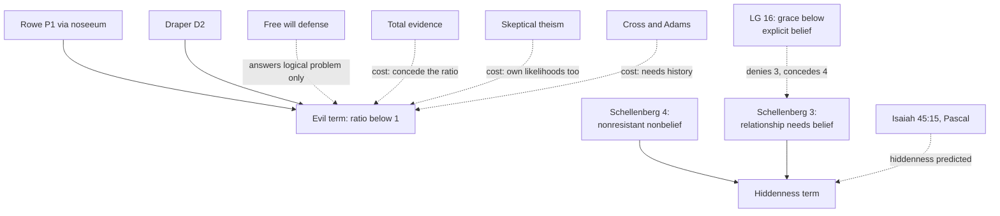

# Apologetics I · Lesson 2.3: Evil and hiddenness: the replies that cost something

> ⏱ ~15 min · Module 2: The case for God, and the strongest replies · Builds on: [2.1](02-01-assembling-the-case.md), [2.2](02-02-answering-the-atheist-philosophers.md), [`philosophy-of-religion` 4.2](../../philosophy-of-religion/lessons/04-02-the-evidential-problem-of-evil.md), [4.4](../../philosophy-of-religion/lessons/04-04-skeptical-theism.md), [4.5](../../philosophy-of-religion/lessons/04-05-divine-hiddenness.md) · Unlocks: [3.1](03-01-naturalism-at-its-best.md), [5.5](05-05-weighing-it-the-bayesian-apologetic-and-its-limits.md)

## Why this matters

[2.1](02-01-assembling-the-case.md) built a case and [2.2](02-02-answering-the-atheist-philosophers.md) met the philosophers who weigh it as a whole. Rowe, Draper and Schellenberg do something sharper: they add a term to the case that runs the other way. A cumulative case may not leave that term out, and every reply to it has a price. This lesson argues that the price is worth paying, and says exactly what is paid.

## The idea

There are cheap replies and costly ones. The cheap reply says suffering is no evidence at all, or that every honest seeker finds God. Both are false, and an apologetic built on them collapses the first time it meets a burn ward or a sincere agnostic. The costly reply grants that the fawn and the seeker count against bare theism. It then argues three things. The case survives on [total evidence](../reference.md#total-evidence). Skeptical theism is a weapon that also cuts its user. And the Christian hypothesis is not bare theism: it predicts a God who is partly hidden and who answers suffering by entering it, not by explaining it. That last move earns its keep only if Christianity's specific claims have support of their own, which is why the case must become historical.

## The other side

Stated as [`philosophy-of-religion`](../../philosophy-of-religion/syllabus.md) states them, which their authors would sign.

**Rowe** ("The Problem of Evil and Some Varieties of Atheism", 1979). E1: a fawn, burned in a lightning fire, lies in agony for days before dying. **P1.** There are instances of intense suffering an omnipotent, omniscient being could have prevented without losing a greater good or permitting an equal or worse evil. **P2.** An omniscient, wholly good being would prevent any intense suffering it could, unless it could not do so without losing a greater good or permitting an equal or worse evil. **∴** No such being exists. P1 rests on the [noseeum inference](../reference.md#noseeum-inference) (Wykstra's name, 1996): **N1** after careful reflection we know of no good that would justify God in permitting E1; **N2** so probably there is none. Rowe's atheism is "friendly": a theist with other grounds may be rational.

**Draper** ("Pain and Pleasure", 1989). $O$ is what we know about who feels pain and pleasure and when. The [hypothesis of indifference](../reference.md#hypothesis-of-indifference) (HI) says neither the nature nor the condition of sentient beings on earth results from benevolent or malevolent actions by nonhuman persons. **D1** $O$ is known. **D2** $\Pr(O \mid \text{HI})$ is much greater than $\Pr(O \mid T)$. **D3** $T$ is not intrinsically much more probable than HI. **∴** Other evidence held equal, $T$ is more probably false than true. Draper needs no noseeum step: pain tracking biological use is just what HI predicts.

**Schellenberg** (*The Hiddenness Argument*, 2015). **(1)** Necessarily, if God exists, God perfectly loves every finite person. **(2)** Necessarily, such love is always open to a meaningful conscious relationship with each person capable of one. **(3)** Necessarily, if God is always so open, no capable person is ever in [nonresistant nonbelief](../reference.md#nonresistant-nonbelief). **(4)** At least one capable person is or was in nonresistant nonbelief. **(5)** So God does not exist. The test is resistance, not blame: a person who never shut the door counts.

## The argument

1. **P1.** The free will defense shows God and evil consistent ([PoR 4.1](../../philosophy-of-religion/lessons/04-01-the-logical-problem-of-evil.md)). It does not fix $\Pr(O \mid T)$.
2. **P2.** Rowe's fawn and Draper's $O$ lower the probability of bare theism: their likelihood ratio is below 1.
3. **P3.** A cumulative case is judged on total evidence, so the evil term enters as a factor, not a veto. This is the Moore shift of [PoR 4.2](../../philosophy-of-religion/lessons/04-02-the-evidential-problem-of-evil.md), taken up here as an argued case.
4. **P4.** [Skeptical theism](../reference.md#skeptical-theism) at full strength ([PoR 4.4](../../philosophy-of-religion/lessons/04-04-skeptical-theism.md)'s ST1–ST3) makes $\Pr(O \mid T)$ inscrutable. By the same token it makes the theist's own likelihoods inscrutable, fine-tuning's above all. So the cumulative-case apologist may use only a modest version: our view of providence is partial (CCC 314), which shrinks the ratio toward 1 without cancelling it.
5. **P5.** The Christian hypothesis $T_C$ adds that God enters suffering and defeats it from inside. On $T_C$, some of $O$ and of hiddenness is expected, not surprising.
6. **∴ C.** Evil and hiddenness weaken the case without defeating it, provided $T_C$'s specific content has independent support.

*In words:* concede the ratio, refuse the veto, decline the skepticism that would cost your own evidence, and pay for the Christian specifics with history.

**What the Christian specifics are.** Three resources, each with its own cost.

- **Privation.** Evil is the lack of a due good, not a rival substance ([`thomistic-synthesis` 2.4](../../thomistic-synthesis/lessons/02-04-the-transcendentals.md), ST I q.48 a.1). That says what evil *is*. It says nothing about why God *permits* it, so it does not touch Rowe's P1.
- **Horrendous evils** (Marilyn McCord Adams, *Horrendous Evils and the Goodness of God*, 1999; *Christ and Horrors*, 2006). Love must defeat a horror within the sufferer's own life ([horrendous evils](../reference.md#horrendous-evils)). Adams finds that defeat in intimacy with God and in God's identification with horror-participants through Christ's passion. Two prices for a Catholic. Adams joined this to universal salvation, and a guarantee for every sufferer collides with the Church's teaching that hell exists (CCC 1035). Whether one may *hope* all are saved is disputed among Catholics. And "the God who suffers" must be said as Constantinople II (553, capitulum 10) said it: the one crucified *in the flesh* is one of the Holy Trinity, a defined formula (rung 1). It is not suffering in the divine nature ([`trinity-and-god` 1.5](../../trinity-and-god/lessons/01-05-impassibility-and-the-god-who-suffers.md)).
- **The cross as [answer by participation](../reference.md#answer-by-participation).** The Catechism answers "why evil?" with no theory: the Christian faith as a whole is the answer (CCC 309). God does not explain the fawn. In Christ he undergoes the worst a human can suffer and promises to bring good from it, as Augustine put it in the line Aquinas makes his reply to the objection from evil:

> Since God is the highest good, He would not allow any evil to exist in His works, unless His omnipotence and goodness were such as to bring good even out of evil. (ST I q.2 a.3 ad 1, quoting *Enchiridion* 11)

The objection is that this **changes the subject**: Rowe asked for a reason, and a companion in suffering is not one. The fair reply grants half of it. As a likelihood, the cross helps only if $T_C$'s extra content is supported; otherwise the gain reappears as a lower prior. What it does do is change the hypothesis under test, and that is legitimate: Christians never claimed bare theism.

**Hiddenness.** Isaiah 45:15 (DR): "Verily thou art a hidden God, the God of Israel the saviour." Pascal makes it a prediction: any religion that does not say God is hidden is not true (*Pensées* 584, 242, Trotter). On $T_C$ partial hiddenness is expected, which raises $\Pr(\text{hiddenness} \mid T_C)$. Against Schellenberg's premises the Catholic should not deny (4). Lumen Gentium 16 itself speaks of people who, "without blame on their part", lack explicit knowledge of God, and says providence does not deny them the helps needed for salvation. (Its weight, and how it squares with older formulas, are [8.2](08-02-salvation-outside-the-visible-church.md)'s.) The Catholic denies (3) instead: grace can work a real relationship below explicit belief.

**Concession.** Rowe is right that "I see no reason" is ordinary good evidence in almost every domain, and that intense suffering with no visible purpose counts against theism. Draper is right that pain tracking biological use is better predicted by indifference than by bare theism. Schellenberg is right that nonresistant nonbelief exists; the Church's own teaching says so. None of this is qualified by what follows.

**Where the argument is weakest.** P5, and the denial of Schellenberg's (3). Schellenberg answers that a relationship you cannot recognize is not *conscious*, so denying (3) changes the topic just as the cross does. And P5's gain is only as good as the history behind $T_C$. If Module 5 fails, the costly replies become the cheap ones.

## The map

Solid arrows build the atheist terms; dashed arrows are replies, labelled with what each costs.

## Worked examples

**Example 1 (the reply meeting the objection cleanly).** Invented numbers. An apologist starts at $3:2$ for $T$ against HI and has one fine-tuning strand at $L = 4$, so the case stands at $6:1$. She concedes Draper's $O$ at $L = \frac{2}{5}$:

$$6 \times \tfrac{2}{5} = 12:5 \approx 71\%.$$

Now suppose she reaches instead for full skeptical theism. $O$ loses its direction, but by [PoR 4.4](../../philosophy-of-religion/lessons/04-04-skeptical-theism.md)'s spreading objection so does fine-tuning's $\Pr(F \mid T)$. She is left at $3:2$, $60\%$, with $O$ undetermined. Conceding wins whenever the strand that skepticism would cost outweighs the evil term: $4 \times L_O > 1$, so any $L_O$ above $\frac{1}{4}$. To bring the whole case down to even, the evil term would have to reach $\frac{1}{6}$. That is P4 in arithmetic.

**Example 2 (where it strains).** Invented case. Marta, a hospice nurse, prayed and read for forty years, wanted God to be real, and died agnostic. The Pascal line strains first: read strictly, fragment 430's distribution claim ([PoR 4.5](../../philosophy-of-religion/lessons/04-05-divine-hiddenness.md)) would impute resistance to Marta, which nothing supports and respect forbids. The Catholic denial of (3) says grace may have been at work in her care for the dying. Schellenberg replies that this rescues her salvation, not the relationship he asked about. That exchange does not settle. What the apologist may not do is win it by redescribing Marta.

## Watch out

- **You might think the Catechism endorses a theodicy, but** CCC 309–314 and 324 keep the weight of their sources: that God permits evil only to draw good from it is presented as of faith (CCC 311, 324); free will and soul-making theodicies are theologians' work, freely disputed. Calling any one of them "Church teaching" overstates its [level](../reference.md#levels-of-authority).
- **You might think the free will defense answers Rowe, but** it answers Mackie. Consistency fixes no likelihood.
- **You might think conceding the ratio concedes the conclusion, but** a factor below 1 multiplies a prior; it does not replace it.

## One-liner

> Concede what Rowe, Draper and Schellenberg see; refuse the veto; and pay for the cross and the hidden God with history, not with skepticism that would bankrupt your own evidence.

## Problems

**P1 (🟢) *(Exegetical (a) · Evaluative (b))*** Pascal, *Pensées* fragment 584 (Trotter):

> *That God has willed to hide Himself.*--If there were only one religion, God would indeed be manifest. The same would be the case, if there were no martyrs but in our religion. God being thus hidden, every religion which does not affirm that God is hidden, is not true; and every religion which does not give the reason of it, is not instructive.

(a) In odds form, what is the fragment's move against a hiddenness argument: which term does it change, and which words decide it? (b) Is the move ad hoc? Give a verdict and one reason. 120 words or fewer in total.

**P2 (🟡) *(Apologetic: (a) Exegetical, graded first · (b) reply)*** (a) State Schellenberg's 2015 hiddenness argument in numbered premises, saying what "nonresistant" means. (b) Reply on behalf of the Catholic apologist. Open with a named concession, stated without qualification, then say which premise you deny and why. 150 words or fewer for (b).

**P3 (🔴, optional) *(Formal (a)–(c) · Evaluative (d))*** Invented numbers. An apologist holds $T : \text{HI} = 7:2$. Datum $D$: hundreds of millions of years of predation and disease before any human. She grants $\Pr(D \mid \text{HI}) = 0.7$ and $\Pr(D \mid T) = 0.2$.

(a) Compute the posterior odds and $T$'s share of the two-way contest.
(b) She moves to $T_C$: theism plus "God brings creation to its end through a cross that defeats suffering from within." She says $\Pr(D \mid T_C) = 0.5$. Within $T$, $T_C$ had $0.4$ of the prior; assume $D$ would not occur on $T$ without that addition. Compute $T_C : \text{HI}$ before and after $D$.
(c) Suppose independent historical evidence, counted before $D$, had put $T_C : \text{HI}$ at $14:5$. Recompute.
(d) In two sentences: what do (b) and (c) show about the objection that the cross "changes the subject"?

Solutions

**P1** *(Exegetical (a) · Evaluative (b))*

**Accept:** any verdict in (b) with a reason that engages the timing or independence of the prediction.

**Must hit, strict (a):**

- It changes the likelihood: hiddenness is made *expected* on Christianity, raising $\Pr(\text{hiddenness} \mid T_C)$, not the prior.
- Deciding words: "every religion which does not affirm that God is hidden, is not true", which turns the datum into a test Christianity passes. The opening sentences use religious diversity ("only one religion") as evidence of the hiddenness itself.

**Must hit, any verdict (b):**

- The test: is "God is hidden" a commitment of $T_C$ independent of the data, or added after seeing them?
- Evidence for prior commitment (Isaiah 45:15; Pascal's link to corruption, fr. 242), or the rejoinder that a prediction this vague fits almost any distribution of belief.

**Wrong turns:** reading 584 as denying Schellenberg's premise 4 (that is fr. 430's distribution claim); saying it lowers the prior.

**Model answer, one of several:** (a) It raises the likelihood of hiddenness on Christianity: "every religion which does not affirm that God is hidden, is not true" makes hiddenness a prediction the religion passes, and diversity of religions is cited as the sign of it. (b) Not ad hoc in origin: Isaiah 45:15 long predates the argument, and Pascal ties hiddenness to corruption. But "partly hidden" is so loose that it raises $\Pr(\text{hiddenness} \mid T_C)$ only modestly.

---

**P2** *(Apologetic: (a) Exegetical, graded first · (b) reply)*

**Must hit, strict (a), graded first:**

- (1) Necessarily, if God exists, God perfectly loves every finite person. (2) Necessarily, perfect love is always open to a meaningful conscious relationship with each capable person. (3) Necessarily, if God is always so open, no capable person is ever in nonresistant nonbelief. (4) Some capable person is or was in nonresistant nonbelief. (5) So God does not exist.
- Nonresistant: not believing without having brought it about oneself (no avoidance, self-deception or wish that God not exist). Blame is not the test; effort is not required.

**Must hit (b):**

- Named concession: premise (4) is true, and Catholic teaching says so (LG 16, people "without blame" lacking explicit knowledge of God).
- A premise denied with a reason: (3) via grace working below explicit belief, meeting Schellenberg's "conscious" rejoinder; or (2) via goods love may pursue at a distance (Murray, Rea), meeting his reply that the relationship would itself supply them.

**Wrong turns:** stating the argument as "God should write in the sky" or as an argument about evidence for God; defining nonresistant as "tried hard" or "not at fault"; denying (4) by imputing hidden resistance. Claiming LG 16 *defines* that such people are saved (it speaks of the possibility, and its level is 8.2's question).

**Model answer (b), one of several:** Concession: Schellenberg is right that nonresistant nonbelief exists; Lumen Gentium 16 speaks of people who, without blame, have not reached explicit knowledge of God. So I deny premise (3). A loving God's openness need not take the form of present belief: the same text says providence gives such people the helps of grace as they try to live well, so the relationship is begun, though not yet known as such. Schellenberg will say an unrecognized relationship is not conscious. My reply: openness to a conscious relationship does not require that it be conscious at every moment. A relationship begun by grace can become conscious later, at the latest at life's end, so (3) does not follow from (2).

---

**P3** *(Formal (a)–(c) · Evaluative (d))*

(a) $L = \frac{0.2}{0.7} = \frac{2}{7}$. Posterior $\frac{7}{2} \times \frac{2}{7} = 1:1$; share $\frac{1}{2}$.

(b) Prior $T_C : \text{HI} = 7 \times 0.4 : 2 = 2.8 : 2 = 7:5$. $L_C = \frac{0.5}{0.7} = \frac{5}{7}$. Posterior $\frac{7}{5} \times \frac{5}{7} = 1:1$, the same as (a). (Check: $\Pr(D \mid T) = 0.4 \times 0.5 + 0.6 \times 0 = 0.2$, consistent.)

(c) $\frac{14}{5} \times \frac{5}{7} = 2:1$, share $\frac{2}{3}$.

**Must hit, any verdict (d):**

- (b): building the Christian content into the hypothesis gains nothing by itself; the better likelihood is paid for in a lower prior.
- (c): the gain is real only when $T_C$'s content has independent support, so the objection is right about (b) and wrong about (c).

**Wrong turns:** using $L = \frac{7}{2}$; multiplying $7:2$ by $0.5$; concluding from (b) that the cross is idle (it is idle *without* independent support).

**Model answer (d):** Specifying the hypothesis moved the cost from the likelihood into the prior, so on its own the cross reply changes the subject without changing the odds. It changes them only if something else, the historical case of Module 5, supports the Christian specifics.

## Flashback

**From Lesson [2.1](02-01-assembling-the-case.md) (Assembling the case):** *(Exegetical: apply to a new case (a) · Evaluative (b).)* An invented apologist (nobody said this; it is built for the problem) proposes a new strand for 2.1's cable: "The universe is not merely there; it is *lawful*. Every electron behaves like every other electron, everywhere and always. Regularity on that scale cries out for a Lawgiver, so add the argument from the laws of nature beside contingency and fine-tuning." (a) Run 2.1's three audit questions on this strand, one sentence each. (b) Any verdict: should it be counted as a new strand, counted inside an existing one, or written off? Two sentences.

Solution

**Accept:** in (b), any verdict whose reason engages the independence question.

**Must hit, strict (a):**

- **Evidence for the unpersuaded:** yes, some. Both sides grant the datum (uniform regularity), and the key premise is a demand for explanation, not a premise only a believer could accept. So it is not dialectically spent the way the ontological arguments are.
- **Independence:** its crux is an explanatory demand on something the naturalist may treat as brute, here the regularity itself. That is the demand contingency states most cleanly. A naturalist who accepts a brute world (2.1's Vera) can accept brute laws for the same reason, so the strand mostly counts with contingency, not beside it.
- **Landing:** at most a source of order. By itself it does not deliver a necessary, personal, single creator, so the gap remains.

**Must hit, any verdict (b):**

- A verdict tied to the independence crux: "different datum, same crux" is the 2.1 test.
- Credit for seeing the only route to a partial strand: run it as a likelihood comparison that needs no explanatory demand, as fine-tuning does. That needs a likelihood for regularity on naturalism, and whether one can be stated is as doubtful as fine-tuning's measure.

**Wrong turns:** counting it as a full third strand because its datum differs from contingency's; calling it dialectically spent (its premise is not equivalent to its conclusion); saying it reaches the God of the creed; saying *Dei Filius* makes it binding (canon 1 defines a capacity, not any argument's success).

**Model answer, one of several:** (a) It carries some evidence, since both sides grant the regularity and the demand to explain it is not a premise only a believer could hold. It is not independent of contingency, because its crux is whether a brute fact needs explaining, and the naturalist who stops at a brute world will stop at brute laws. It lands on a source of order, not yet on a necessary, personal creator, so the gap remains. (b) Count it inside contingency, as 2.1 counted the per se regress and the kalam. It would earn a partial strand only as a likelihood argument free of the explanatory demand, and that needs a probability of regularity on naturalism that nobody knows how to state.

## Connections

- **Backward:** the arguments and their skeletons are [`philosophy-of-religion` 4.1](../../philosophy-of-religion/lessons/04-01-the-logical-problem-of-evil.md), [4.2](../../philosophy-of-religion/lessons/04-02-the-evidential-problem-of-evil.md), [4.3](../../philosophy-of-religion/lessons/04-03-theodicies.md) (Adams), [4.4](../../philosophy-of-religion/lessons/04-04-skeptical-theism.md) and [4.5](../../philosophy-of-religion/lessons/04-05-divine-hiddenness.md); the odds form is [`philosophical-method` 2.4](../../philosophical-method/lessons/02-04-weighing-evidence-in-odds-form.md); the case being defended is [2.1](02-01-assembling-the-case.md)'s.
- **Forward:** P5 is a promissory note: [5.5](05-05-weighing-it-the-bayesian-apologetic-and-its-limits.md) asks whether the historical case can pay it. [8.2](08-02-salvation-outside-the-visible-church.md) weighs Lumen Gentium 16.
- **Sideways:** the theopaschite formula and its grammar are [`christology` 3.2](../../christology/lessons/03-02-the-communication-of-idioms.md); the cost Adams pays in universalism meets `creation-grace-last-things`.
