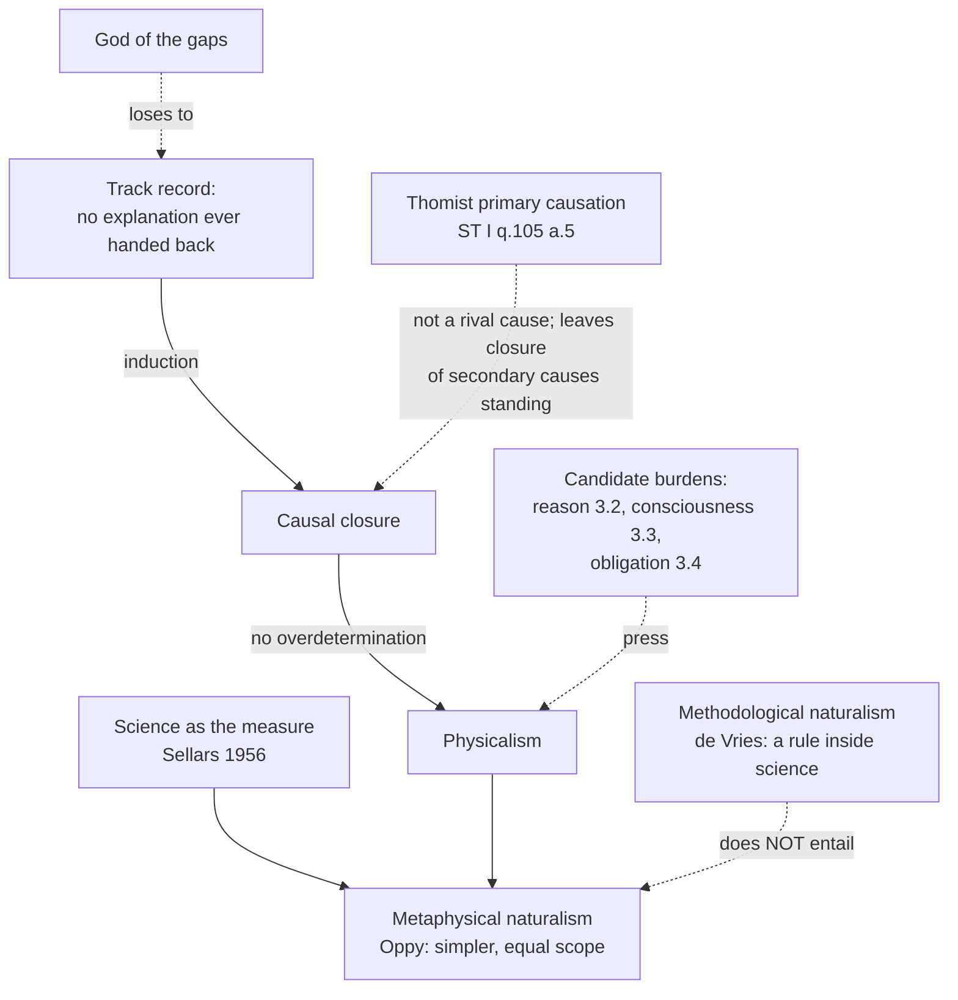

# Apologetics I · Lesson 3.1: Naturalism at its best

> ⏱ ~15 min · Module 3: The burdens of naturalism · Builds on: [2.2 Answering the atheist philosophers](02-02-answering-the-atheist-philosophers.md), [`thomistic-synthesis` 5.2](../../thomistic-synthesis/lessons/05-02-providence-and-secondary-causes.md) · Unlocks: [3.2 Reason](03-02-reason.md), [3.3 Consciousness](03-03-consciousness.md), [3.4 Morality](03-04-morality.md)

## Why this matters

Module 2 ended in a comparison of total theories, and the rival on the other side of the scale was naturalism. This module presses it on three burdens: reason, consciousness, morality. Pressing a position you have not stated at its strongest is how apologists lose arguments they deserved to win, and the commonest way to state it badly is to confuse two different things that share one word. So this lesson is mostly the other side's: what naturalism claims, why it is the default for so many careful people, and what it has earned. The argument comes at the end, and it is short. It asks what would count as a real bill for naturalism to pay, as opposed to a bill not yet paid.

## The idea

**Two naturalisms.** David Papineau's encyclopedia entry ("Naturalism", *Stanford Encyclopedia of Philosophy*) puts the divide this way. *Ontological* (metaphysical) naturalism is a claim about what there is: reality has no room for the supernatural. *Methodological* naturalism is a claim about how to find out: it gives the methods of science some general authority. The phrase "methodological naturalism" was coined by a Christian. Paul de Vries, a philosopher at Wheaton College, introduced it in a 1983 conference paper, published as "Naturalism in the Natural Sciences" (*Christian Scholar's Review*, 1986). He meant a working rule *inside* the natural sciences: explain natural phenomena by natural causes, and say nothing either way about God. So the phrase has a narrow sense (de Vries's rule for the laboratory) and a broad one (science as the authority over all inquiry). Neither one entails the metaphysical thesis. [Conflating the two](../reference.md#methodological-and-metaphysical-naturalism) is the commonest error in apologetics on this topic, and it is made by both sides.

**Metaphysical naturalism at its best.** Graham Oppy (*The Best Argument against God*, 2013) does not argue that science has disproved God. He argues comparatively, as [2.2](02-02-answering-the-atheist-philosophers.md) set out. Everything natural that theism posits, naturalism posits too. Theism adds a further, supernatural cause. So unless that addition buys explanation the natural order cannot supply, naturalism is the simpler theory with at least equal scope, and simplicity breaks the tie. Notice that this is not a dogma. It is a bet on theoretical virtue that could be lost.

**Physicalism and causal closure.** The ontology usually comes in a definite form. In Daniel Stoljar's statement in the *Stanford Encyclopedia of Philosophy*, [physicalism](../reference.md#physicalism) is the thesis that everything is physical. Made precise, it says that any world that duplicates ours physically duplicates it in every respect: fix the physics, and you have fixed everything. The famous difficulty is Hempel's dilemma (1969). If "physical" means what current physics says, physicalism is probably false, because current physics is incomplete. If it means whatever a completed physics will say, physicalism is close to empty. Its main support is [causal closure](../reference.md#causal-closure): every physical effect has a fully physical cause. Papineau tells the history behind it. The conservation of energy was accepted as a basic principle in the mid-nineteenth century. Twentieth-century physiology then looked for special vital or mental forces acting on the body and found none. By 1958 Feigl, and Oppenheim and Putnam, could appeal to closure explicitly. The argument from closure to physicalism about the mind belongs to [`philosophy-of-mind`](../../philosophy-of-mind/syllabus.md) 2.4. Here it is enough to note that closure is an empirical generalization, and it was earned.

**The scientific image.** Wilfrid Sellars ("Philosophy and the Scientific Image of Man", lectures of 1960, published 1962) set two pictures side by side. The *manifest image* is the world as persons meet it: people who think, intend and answer for what they do. The *scientific image* is the world as theory describes it: particles, fields and their laws. In "Empiricism and the Philosophy of Mind" (1956, §41) he wrote that in describing and explaining the world, science is the measure of all things. That sentence is paraphrased here, and naturalists have adopted it as a slogan. In fairness to Sellars, he did not think the language of intentions and norms would disappear. His aim was to join it to the scientific image, not to reduce it away.

**The track record.** Put these together and you have the naturalist's strongest inductive argument. Lightning, disease, the orbits of planets, heredity and the chemistry of the cell were all once candidates for supernatural explanation, and all were explained naturally. Explanation has never gone the other way: no phenomenon once explained by natural causes has later been handed back to a supernatural one. A reasonable person extrapolates. The argument is old. Aquinas states a version of it against himself: everything in the world can be traced to nature or to human will, so there is no need to suppose God (*ST* I q.2 a.3 obj. 2, already noted as a razor in [`ancient-medieval-philosophy` 8.4](../../ancient-medieval-philosophy/lessons/08-04-ockham-nominalism-and-the-razor.md)).

**Research programme or worldview.** Oppenheim and Putnam titled their paper "Unity of Science as a Working Hypothesis". Read that way, naturalism is a research programme: a policy, judged by how fruitful it is, which a theist can follow wholeheartedly at the bench. As a worldview, it is the claim that the policy's domain is all there is. The track record is strong evidence that the programme works. Whether it is evidence for the worldview is exactly the question.

**Concession.** The naturalist's explanatory record is real, it is enormous, and nothing in this course disputes any of it. Every gap that apologists once filled with God and that science later closed was a defeat for the apologist, and it was deserved. Methodological naturalism in de Vries's sense is good scientific practice, and Catholic scientists follow it. A Christian who hopes the next discovery will fail is hoping against knowledge.

## The argument

So where could naturalism owe anything? The danger has a name, and an old one. Henry Drummond (*The Ascent of Man*, 1894) warned against devout readers who search science for gaps to fill with God. Bonhoeffer, writing from prison in 1944, called it a mistake to use God as a stop-gap for the incompleteness of our knowledge. Charles Coulson (*Science and Christian Belief*, 1955) is usually credited with the phrase "God of the gaps". He also gave the reason it fails: such gaps tend to shrink. The [god of the gaps](../reference.md#god-of-the-gaps) treats God as one cause among causes, competing for the same territory. The Thomist does not make that move. God is the whole cause of an effect at another level, not a share of it ([primary and secondary causation](../reference.md#primary-and-secondary-causation); *ST* I q.105 a.5; [`thomistic-synthesis` 5.2](../../thomistic-synthesis/lessons/05-02-providence-and-secondary-causes.md)). Aquinas's reply to his own objection 2 points to no gap. It points to nature as a whole.

1. **P1.** A *gap* is a phenomenon not yet explained naturally. The track record makes it likely that each gap will close, so a gap is evidence of nothing.
2. **P2.** A [genuine burden](../reference.md#burden-versus-unfinished-project) is something else. It is a phenomenon that the naturalist's own resources predict will *not* yield to the scientific image, because of what the phenomenon is and not because of how far research has got. Or it is something the naturalist must presuppose in order to do science at all.
3. **P3.** The reliability of reasoning, the first-person character of experience, and moral obligation are candidates for burdens in the sense of P2.
4. **∴ C.** If any candidate survives scrutiny, naturalism owes an account it has not given, and it is a debt that the track record cannot pay. *In words:* the apologist must argue from what things are, never from what we have not yet found out.

**Where the argument is weakest.** P2 is clear on paper and contested in every application. Whether a phenomenon fails "because of what it is" is precisely what the naturalist disputes. Every past gap also looked like an essence, not a delay, to the people who lived with it.

## Map of the positions

The dashed edges are the lesson. Methodological naturalism stops short of the worldview. The Thomist does not compete with closure on God's ordinary action; whether the intellect or a miracle is an exception is a separate question, taken up in 3.2 and [4.4](04-04-divine-action-miracles-and-quantum-indeterminacy.md). The only arrows a theist can use against physicalism come from the burdens.

## Worked examples

**Example 1: the clean case.** In an invented debate, a theist offers two challenges. (i) "Science cannot tell how a chain of amino acids folds into its working shape, so a mind must guide it." (ii) "Science presupposes that nature is lawful and intelligible, and science cannot explain why that presupposition holds." Run P1 and P2. Challenge (i) is a gap, and one that has largely closed: protein structures are now predicted computationally to high accuracy. It was a bad argument before it closed, too, because it made God a rival folding mechanism. Challenge (ii) is a candidate burden of the second kind in P2: the scientific image takes lawfulness for granted rather than discovering it. It is also, structurally, Aquinas's reply to objection 2, which points to nature as such and not to a hole in it. The naturalist has an answer: the laws are brute, and every theory stops somewhere. That answer is Oppy's simplicity bet again, and it is a fair one. But it is an answer to a burden, not a promissory note.

**Example 2: where it strains.** The naturalist's best precedent is vitalism. People once held that life could not be chemistry, and they were wrong, because "being alive" turned out to be a set of functions, and functions are just what mechanisms explain. The theist replies that conscious experience is not a set of functions, so the precedent does not carry over. Notice what has happened. Whether consciousness is a gap or a burden now turns on a substantive premise about its nature, which the illusionist denies outright. P2 classifies the case only after [3.3](03-03-consciousness.md) has argued it. The criterion organizes the dispute, and it cannot settle it in advance.

## Watch out

- **You might think methodological naturalism is atheism wearing a lab coat.** In de Vries's sense it is a rule of evidence inside the sciences, and theists invented the label. Even in the broad sense, the step from "science's methods have authority" to "only what science finds exists" needs a further premise.
- **You might think the Church has condemned naturalism, so the matter is closed.** Read the act. *Dei Filius* (1870), in its canons on God the Creator, anathematizes anyone who asserts that nothing exists besides matter (can. 2) and anyone who denies the one true God (can. 1). That is a definition, rung 1 on the [ladder](../reference.md#levels-of-authority) ([`fundamental-theology` 4.4](../../fundamental-theology/lessons/04-04-the-ladder-of-doctrinal-authority.md)). It condemns *metaphysical* materialism. It says nothing against methodological naturalism or against causal closure as a scientific working hypothesis, and it settles nothing about whether any argument against naturalism succeeds.
- **You might think naturalists are just assuming their conclusion.** Oppy argues comparatively and could lose on the comparison. Papineau defends closure as an a posteriori result with a dated history behind it. Calling either one dogma is caricature, and in this course it fails the problem.

## One-liner

> Concede the record in full and never bet on a gap. A naturalist owes you something only where the phenomenon itself, and not our ignorance of it, resists the scientific image.

## Problems

**P1 (🟢) *(Exegetical: diagnose.)*** An invented op-ed from an apologetics magazine (nobody wrote this; it is built for the problem):

> "Every science classroom in the country runs on methodological naturalism: it is the rule that only natural causes may be considered. A student trained this way has been taught, before any argument, that God does not exist. That is why Catholics must reject methodological naturalism outright. The Church has already condemned naturalism dogmatically at Vatican I, so no Catholic scientist may practise it."

(a) Name the conflation and quote the words where it happens. (b) Name the error about authority and correct it with the act and its rung. Two sentences per part.

**P2 (🟡) *(Apologetic: (a) Exegetical, graded first · (b) reply.)*** (a) State the naturalist's track-record argument as its best defenders would put it: its premises, its conclusion, and what kind of inference it is. (b) Reply. Your reply must open with a named concession, and it must say which conclusion the argument supports well and which it supports less well. 150 words or fewer in total.

**P3 (🔴, optional) *(Exegetical: close reading, then Evaluative.)*** *ST* I q.2 a.3, objection 2 and the reply to it (English Dominican Province translation):

> Further, it is superfluous to suppose that what can be accounted for by a few principles has been produced by many. But it seems that everything we see in the world can be accounted for by other principles, supposing God did not exist. For all natural things can be reduced to one principle which is nature; and all voluntary things can be reduced to one principle which is human reason, or will. Therefore there is no need to suppose God's existence.
>
> Reply to Objection 2. Since nature works for a determinate end under the direction of a higher agent, whatever is done by nature must needs be traced back to God, as to its first cause. So also whatever is done voluntarily must also be traced back to some higher cause other than human reason or will, since these can change or fail …

(a) Say whether the reply denies the objection's minor premise ("everything … can be accounted for by other principles") or accepts it in some sense, and quote the words that show which. (b) Any verdict: is the reply a god-of-the-gaps move? 120 words or fewer for both parts.

Solutions

**P1** *(Exegetical.)*

**Must hit, strict (a):**

- The op-ed slides from the narrow rule to the metaphysical thesis. The words are "taught, before any argument, that God does not exist". A rule that explanations in natural science cite natural causes is silent about whether anything else exists. Credit for noting that "only natural causes may be considered" is fair as a description of de Vries's sense, and that the error is the next sentence.

**Must hit, strict (b):**

- *Dei Filius* (1870), canons on God the Creator, can. 2 anathematizes the assertion that nothing exists besides matter. That is rung 1, but its object is metaphysical materialism. No act condemns methodological naturalism, so "no Catholic scientist may practise it" overstates what the Church has taught.

**Wrong turns:** calling the canon non-binding (that understates it: it is a conciliar definition); saying the Church "endorses" methodological naturalism (no act does that either); attacking the op-ed for being religious.

**Model answer:** (a) The writer equates a rule about how to explain natural phenomena with the denial of God: "taught, before any argument, that God does not exist." Methodological naturalism in de Vries's sense restricts what science cites, not what exists. (b) Vatican I's *Dei Filius*, can. 2 on God the Creator, defines (rung 1) against the assertion that nothing exists besides matter, and that is a metaphysical claim. No magisterial act condemns methodological naturalism, so Catholic scientists may practise it.

---

**P2** *(Apologetic: (a) Exegetical, graded first · (b) reply.)*

**Must hit, strict (a), graded first:**

- Premises: many phenomena once explained supernaturally have been explained naturally, across many domains. No explanation has ever moved the other way.
- Conclusion: probably every phenomenon has a natural explanation, so probably there is nothing supernatural. Or, more modestly, there is no explanatory need for a supernatural cause.
- It is an **enumerative induction** (or a meta-induction over the history of explanation). It is not a deduction, and it is not a claim that science has disproved God.

**Must hit (b):**

- A named concession: the record is real, and every gap-filling apologetic it closed deserved to lose.
- The argument supports *methodological* naturalism, the research programme, very well. It supports metaphysical naturalism less well, because induction over the explained cannot show that the domain of explanation is all there is, especially for phenomena the method presupposes, such as lawfulness and reliable reason.

**Wrong turns:** stating the argument as "science has proved there is no God" (caricature, fails (a)); replying with a current gap; replying that induction is unjustified in general, a sceptical move the theist's own case cannot survive.

**Model answer, one of several:** (a) Across lightning, disease, planetary motion and heredity, supernatural explanations have been replaced by natural ones, and the traffic has never reversed. By enumerative induction, probably everything has a natural explanation, so a supernatural cause has no explanatory work left. (b) Concession: that record is real, and the gap-arguments it buried deserved burial. The induction strongly supports naturalism as a research programme. As a worldview it needs more. The sample consists of phenomena *inside* the scientific image, and the conclusion extends to whether that image is complete. That includes the lawfulness and the reliable reasoning the induction itself takes for granted.

---

**P3** *(Exegetical, then Evaluative.)*

**Accept:** in (b), any verdict that applies the gap criterion to what the reply actually points at.

**Must hit, strict (a):**

- The reply *accepts* that natural things are accounted for by nature at their own level. It does not name anything nature fails to do. What it adds is that nature as a whole "works for a determinate end under the direction of a higher agent" and so "must needs be traced back to God, as to its first cause". It traces back; it does not plug a hole. Credit for noting that the will is handled the same way, through "can change or fail", a mark of every creature and not of an unexplained event.

**Must hit, any verdict (b):**

- The verdict is *no* if the gap is defined as an unexplained phenomenon. The reply cites a feature of all natural causation (being directed to ends, being changeable), so no future discovery could close it.
- The verdict is *partly* or *yes* if you hold that "directed to an end" is just what modern science has stopped needing. Then the reply rests on a premise the track record may erode, which is the Fifth Way's dispute ([`thomistic-synthesis` 3.3](../../thomistic-synthesis/lessons/03-03-the-third-fourth-and-fifth-ways.md)).

**Wrong turns:** saying the reply denies that nature explains natural things; treating "first cause" as the earliest event in time.

**Model answer, one of several:** (a) It accepts the minor premise at the level of natural causes and denies only that this makes God superfluous: nature "works for a determinate end under the direction of a higher agent," so its effects are "traced back to God, as to its first cause." (b) Not a gap move. It points at a feature of every natural cause, its being ordered to ends, and not at an effect nature fails to produce. It does lean on natural finality, which a naturalist will contest.

## Flashback

**From Lesson [2.2](02-02-answering-the-atheist-philosophers.md) (Answering the atheist philosophers):** *(Exegetical (a) · Evaluative: find the crux (b).)* Two invented physical theories, built for the problem. Theory A takes three force strengths as three independent, unexplained constants. Theory B adds one unified field with a single coupling, from which all three strengths follow by derivation. (a) Score A against B on simplicity twice: by Oppy's measure (O1, fewer commitments) and by 2.2's rival measure (P3, fewer unexplained primitives). One sentence each. (b) A theist says: "God is to the world what the unified field is to the three strengths." Using Oppy's rejoinder from 2.2, name where the analogy is weakest, and say whether the theist has an answer. Three sentences; any verdict.

Solution

**Must hit, strict (a):**

- By O1, A wins: B has every commitment of A's subject matter plus a further kind of thing, the unified field.
- By P3, B wins: one unexplained primitive (the field and its coupling) against A's three.
- The two measures give opposite verdicts on the same pair, which is 2.2's point that "fewer commitments" is not a neutral measure of simplicity.

**Must hit, any verdict (b):**

- The weak point: B *derives* the three strengths, so they follow from the field. God does not derive this world without paying for it. If creation follows necessarily, the world is as necessary as the naturalist's initial state (modal collapse) and theism loses its simplicity edge. If creation is free, the choice of *this* world is a brute contingency, so the primitives have not been reduced.
- The theist's best answer: free creation by a perfect agent explains through purpose without necessitating ([`thomistic-synthesis` 5.1](../../thomistic-synthesis/lessons/05-01-creation-and-conservation.md)). Then Oppy's reply: a purpose that leaves the choice unexplained is a primitive by another name. Any verdict on who wins that exchange.

**Wrong turns:** scoring B simpler on both measures, or A on both; locating the disanalogy in God being immaterial or unobservable (unobservable fields are fine in physics, so that is not where it breaks); concluding that a broken analogy shows theism false, when it shows only that P3 does not go through automatically.

**Model answer, one of several:** (a) By O1, A is simpler, because B adds a further kind of thing. By P3, B is simpler, because it leaves one primitive unexplained where A leaves three. (b) The analogy breaks at derivation: the three strengths follow from B's field, but this world follows from God only on pain of modal collapse, and if it does not follow, God's free choice of it is a brute contingency at the bottom. The theist can answer that a purposive choice explains without necessitating, which is coherent. But it is exactly the point Oppy contests, so the analogy shows how P3 *could* work without showing that it does.

## Connections

- **Backward:** Oppy's comparison of total theories from [2.2](02-02-answering-the-atheist-philosophers.md); primary and secondary causes from [`thomistic-synthesis` 5.2](../../thomistic-synthesis/lessons/05-02-providence-and-secondary-causes.md); Aquinas's objection as a razor in [`ancient-medieval-philosophy` 8.4](../../ancient-medieval-philosophy/lessons/08-04-ockham-nominalism-and-the-razor.md); the levels from [`fundamental-theology` 4.4](../../fundamental-theology/lessons/04-04-the-ladder-of-doctrinal-authority.md).
- **Forward:** [3.2](03-02-reason.md), [3.3](03-03-consciousness.md) and [3.4](03-04-morality.md) each test one candidate from P3 against the criterion of P2. [4.1](04-01-the-conflict-thesis-tested-in-both-directions.md) takes up *Dei Filius* ch. 4 on the two orders of knowledge, and [4.4](04-04-divine-action-miracles-and-quantum-indeterminacy.md) asks whether divine action needs closure to fail.
- **Sideways:** causal closure and the exclusion argument are [`philosophy-of-mind`](../../philosophy-of-mind/syllabus.md) 1.2 and 2.4. The "working hypothesis" reading of naturalism is a cousin of the no-miracles argument for scientific realism ([`philosophy-of-science`](../../philosophy-of-science/syllabus.md) 5.1): both are inductions over the success of science, and both are contested at the same joint.
