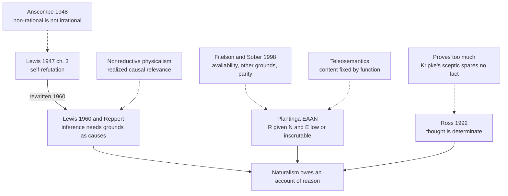

# Apologetics I · Lesson 3.2: Reason

> ⏱ ~15 min · Module 3: The burdens of naturalism · Builds on: [3.1 Naturalism at its best](03-01-naturalism-at-its-best.md), [`epistemology` 2.4](../../epistemology/lessons/02-04-reliabilism.md) · Unlocks: [3.3 Consciousness](03-03-consciousness.md), [3.4 Morality](03-04-morality.md)

## Why this matters

[3.1](03-01-naturalism-at-its-best.md) granted naturalism its explanatory record in full and asked what a genuine burden would look like: not a gap science has not yet closed, but something the view must account for and arguably cannot. Reason is the first candidate, and the sharpest, because the naturalist cannot set it aside. Every argument for naturalism is an exercise of reason. If naturalism cannot say how reasoning is possible, or why its own conclusions deserve trust, the defect is not local. This lesson gives three versions of the [argument from reason](../reference.md#argument-from-reason), each stated with the best reply first.

## The idea

There are three ways to press the point, and they target different things.

- **Lewis and Reppert target inference.** Inferring is believing *q* because *p* entails *q*, with the entailment doing causal work. If every event has a wholly physical explanation, it is unclear how a logical relation could be what moves a mind.
- **Plantinga targets reliability.** Grant that we infer. What reason would a naturalist have to expect faculties shaped by selection for survival to be aimed at truth?
- **Ross targets determinacy.** Thinking *plus* is thinking one function and not any of its rivals. No physical process, he argues, is ever settled among rival functions in that way.

The first is about causation, the second about probability, the third about content. A reply that defeats one may leave the others untouched.

## The other side

**Anscombe on Lewis.** C. S. Lewis's *Miracles* (1947), chapter 3, "The Self-Contradiction of the Naturalist," argued that if all thought is the product of non-rational causes, no thought can be trusted, naturalism included, so naturalism refutes itself. At the Oxford Socratic Club on 2 February 1948, G. E. M. Anscombe, a Catholic and a Thomist, read "A Reply to Mr C. S. Lewis's Argument that 'Naturalism' is Self-Refuting" (*Socratic Digest* 4, 1948). Her points, paraphrased. Lewis ran together *irrational* causes, which work against reason, and *non-rational* ones, which are simply not reasons; nothing shows that a belief with a non-rational cause is therefore untrustworthy. "Valid" applies to arguments, not to causal histories, so whether my reasoning is valid is settled by checking the argument, not by asking where my thought came from. And "why do you believe that?" can ask for a cause or for a ground. These are different questions, and an answer to one does not compete with an answer to the other.

**Fitelson and Sober on Plantinga.** Branden Fitelson and Elliott Sober, "Plantinga's Probability Arguments Against Evolutionary Naturalism" (*Pacific Philosophical Quarterly* 79, 1998), take apart both arguments in *Warrant and Proper Function* (1993), ch. 12.

- **The probability claim.** Plantinga's case that the probability of reliable faculties given naturalism and evolution is low lists conceivable ways belief might relate to behaviour. Selection, however, works on the variants that were actually available, not on every one we can imagine.
- **"Inscrutable" is ignorance.** Not knowing a conditional probability is no reason to give up a belief.
- **Other grounds.** A naturalist can hold that her faculties are reliable on grounds other than evolutionary naturalism.
- **Parity.** The theist has no non-question-begging answer to global skepticism either.
- **Inconsistency.** Plantinga's numbers, taken together, contradict the probability axioms (the arithmetic is in Example 2).

**The teleosemantic reply.** On [teleosemantics](../reference.md#teleosemantics) (Ruth Millikan, *Language, Thought, and Other Biological Categories*, 1984; David Papineau, *Philosophical Naturalism*, 1993), what a belief is about is fixed by the conditions under which the systems that use it succeed, as selection set them up. So content and truth cannot come apart in the way Plantinga's scenarios need. A belief-system whose contents bore no relation to the conditions that made its behaviour succeed would, on this theory, not have those contents at all.

## The argument

The skeleton of [Plantinga's EAAN](../reference.md#evolutionary-argument-against-naturalism) (*Warrant and Proper Function* ch. 12; *Naturalism Defeated?*, ed. James Beilby, 2002; *Where the Conflict Really Lies*, 2011, ch. 10). Write $R$ for "our cognitive faculties are reliable," $N$ for naturalism, $E$ for "our faculties arose by the processes current evolutionary theory describes."

1. **P1.** $\Pr(R \mid N \,\&\, E)$ is low or inscrutable. *In words:* on naturalism, selection rewards adaptive behaviour, and nothing guarantees that the beliefs behind it are true.
2. **P2.** Anyone who accepts $N \,\&\, E$ and sees P1 has a [defeater](../reference.md#defeater) for $R$.
3. **P3.** A defeater for $R$ is a defeater for every belief those faculties produce, $N \,\&\, E$ included.
4. **∴ C.** $N \,\&\, E$ is self-defeating and cannot be rationally accepted.

The target is the conjunction, not evolution: $E$ plus theism is untouched. The 2011 version puts P1 on its strongest ground. If materialism is true, a belief's content is fixed by, or is, a neural structure, and fitness depends on what that structure does, so selection is blind to whether the content is true.

**Reppert's argument from mental causation** (Victor Reppert, *C. S. Lewis's Dangerous Idea*, 2003), building on Lewis's 1960 rewrite:

1. **Q1.** Rational inference occurs: some beliefs are caused *by being seen to follow* from others.
2. **Q2.** If naturalism is true, every cause works through physical properties, and logical relations are not physical properties.
3. **∴ Q3.** If naturalism is true, no belief is caused by a logical relation as such, so rational inference does not occur.
4. **∴ C.** Naturalism is false.

*In words:* naturalism leaves causes but no reasons doing the causing.

**Ross's [determinacy argument](../reference.md#determinacy-argument)** (James Ross, "Immaterial Aspects of Thought," *Journal of Philosophy* 89, 1992; developed by Edward Feser, *American Catholic Philosophical Quarterly*, 2013): some thinking is determinate (I add, not "quadd"); no physical process is determinate among incompossible functions, since every finite physical history fits rivals as well as Goodman's "grue" fits the green emeralds; so some thinking is not wholly physical. Ross reads Kripke's plus/quus argument as a proof that machines do not determinately add, not as a proof that nobody does.

**Concession.** The argument's own history counts against its first form. Anscombe was right that Lewis had confused non-rational with irrational causes and had leaned on an ambiguous "valid." Lewis granted the point on the word "valid" in 1948. For the 1960 Fontana edition he kept the first six paragraphs of chapter 3 and replaced the other ten with a new section more than twice as long, retitled "The Cardinal Difficulty of Naturalism." The new version distinguishes cause-and-effect from ground-and-consequent and argues from what an act of inference requires, not from a threat of global skepticism. Anscombe later credited the rewrite to Lewis's honesty and seriousness, while thinking it still unfinished (*Collected Philosophical Papers* vol. 2, 1981, introduction). Every version taught here descends from that correction. Fitelson and Sober are also right about the arithmetic: the EAAN's probability premises cannot be run as Plantinga first ran them.

**Where the argument is weakest.** Each version stalls at one premise. Reppert stalls at Q2, because a nonreductive physicalist says logical relations can be causally relevant through the physical states that realize them (the exclusion problem, [`philosophy-of-mind`](../../philosophy-of-mind/syllabus.md) 2.4). The EAAN stalls at P1: teleosemantics rejects the content–behaviour split it relies on. Ross stalls on the charge that he proves too much. Kripke's sceptic found no fact *of any kind*, mental or physical, that fixes plus over quus, so if the sceptic's argument works it works against an immaterial intellect too, and if it fails it may fail for brains as well. Feser replies that Kripke's candidate facts are images and dispositions, which the Thomist already counts as indeterminate, while concepts are neither. That reply is the crux ([`philosophy-of-mind`](../../philosophy-of-mind/syllabus.md) 5.2; [`philosophy-of-language-and-logic`](../../philosophy-of-language-and-logic/syllabus.md) 4.3).

## The argument map

Solid arrows support; dashed arrows are the replies, each aimed at one premise.

## Worked examples

**Example 1 (clean: the self-defeat rejoinder).** A naturalist objects that the EAAN saws off its own branch: to accept "R is defeated" she must reason with the faculties under suspicion, so the defeater defeats itself and leaves her where she began. Plantinga's reply turns on his own illustration. Suppose you learn you have taken a drug that makes most of those who take it cognitively unreliable. Every argument you then build to show you are fine is the output of faculties you have reason to distrust, so the loop never restores your confidence. Defeat that undermines itself is not rescue; it is the self-defeat the argument claims. The reply meets the objection cleanly, because the rejoinder describes the conclusion instead of resisting it. What it does not touch is P1.

**Example 2 (where it strains: a Thomist's own God).** Fitelson and Sober's inconsistency point first, with illustrative numbers computed in Python. Suppose $\Pr(R \mid N\&E) = 0.2$ and $\Pr(R \mid \text{theism}) = 0.99$, the two hypotheses are exhaustive, and their priors are "comparable," say $0.5$ each. Then

$$\Pr(R) = 0.5(0.2) + 0.5(0.99) = 0.595.$$

That is far from the near-certainty Plantinga assigns $R$. To force $\Pr(R) = 0.95$ with these likelihoods, theism's prior must be

$$\frac{0.95 - 0.2}{0.99 - 0.2} = \frac{75}{79} \approx 0.95.$$

The argument is consistent only if theism is already nearly certain.

Now the strain that bites a Catholic. In a footnote, Fitelson and Sober add that if God acts *through* the evolutionary process, so that the process screens God off from the outcome, then theistic evolution gives $R$ exactly the probability evolution alone does. Only a God who acts by a further pathway, outside the natural one, raises it. That is the [primary and secondary causation](../reference.md#primary-and-secondary-causation) account of [`thomistic-synthesis` 5.2](../../thomistic-synthesis/lessons/05-02-providence-and-secondary-causes.md), and on that account the likelihood version of the EAAN gives the Thomist nothing. The honest response is to move the argument. Its Thomist form claims that matter as the naturalist describes it has no natural finality toward truth, not that God tilts the odds. That is the Lewis–Ross claim about what reasoning *is*, not the probability claim. So the Thomist should lean on Reppert and Ross, and treat the EAAN as a challenge to the naturalist, not as evidence for theism.

## Watch out

- **You might think Plantinga argues that evolution undermines reason, but** his target is the conjunction of evolution with naturalism. He holds that evolution guided by God gives no such defeater. "Evolution makes our minds untrustworthy" is a caricature, and it fails a strict exegetical part.
- **You might think Anscombe was an atheist who refuted Lewis and drove him out of apologetics, but** she was a Catholic and a Thomist who disputed his argument, not his conclusion. Lewis rewrote the chapter and republished it in 1960.
- **You might think the Church teaches that naturalism refutes itself, but** *Dei Filius* can. 1 defines that God *can* be known by natural reason from created things (rung 1, a capacity claim; [`fundamental-theology` 1.2](../../fundamental-theology/lessons/01-02-natural-knowledge-of-god.md)). No magisterial act adopts the argument from reason, which is freely disputed among Catholics. Promoting it is an error of level.

## One-liner

> Naturalism has to explain the reasoning it was reached by; the argument from reason survived its best critic only by being rewritten, and each version now stands or falls at one premise.

## Problems

**P1 (🟢) *(Exegetical: diagnose.)*** An invented paragraph from a parish adult-education handout (nobody wrote this; it is built for the problem):

> "C. S. Lewis's argument from reason was so powerful that the atheist philosopher Elizabeth Anscombe tried to refute it at Oxford in 1948 and failed. Today Alvin Plantinga has completed the job: he has proved that if evolution is true, our minds cannot be trusted, so Darwinism refutes itself."

Name three distinct factual or exegetical errors and correct each in one sentence. 100 words or fewer.

**P2 (🟡) *(Apologetic: (a) Exegetical, graded first · (b) reply.)*** (a) State the teleosemantic reply to premise P1 of Plantinga's argument as a teleosemanticist would state it: what fixes content, and why that blocks the scenario P1 needs. 80 words or fewer. (b) Reply on Plantinga's behalf. Open with a **named concession**, then give the strongest counter you can. 120 words or fewer.

**P3 (🔴) *(Evaluative: find the crux.)*** An invented exchange.

> **Critic:** Ross says no physical process determinately adds, because every finite history fits "quus" as well as "plus." But Kripke's sceptic found no fact at all, in my behaviour, my brain or my introspected mind, that fixes plus. If that argument works, it works against your immaterial intellect too. If it fails, my brain may add after all.
> **Thomist:** Kripke searched images, rules recalled and dispositions. Those are indeterminate, and I never said otherwise. A concept is none of them.

(a) Name the single premise on which the exchange turns, and say what each side must hold about it. (b) Say which side carries the burden at that premise, and why. 150 words or fewer in total; any verdict.

Solutions

**P1** *(Exegetical: diagnose.)*

**Must hit, strict:**

- Anscombe was a Catholic and a Thomist, not an atheist. She disputed Lewis's *argument*, not theism.
- "Failed" is wrong. Her criticism (irrational vs non-rational causes; the ambiguous "valid") was strong enough that Lewis rewrote chapter 3 for the 1960 edition, retitling it "The Cardinal Difficulty of Naturalism."
- Plantinga's target is the conjunction of evolution *with naturalism*, not evolution or "Darwinism." He holds that evolution guided by God yields no defeater.

**Also credit:** "proved" overstates. The argument is contested, and P1 is the premise Fitelson and Sober and the teleosemanticists deny.

**Wrong turns:** correcting only the tone; calling Anscombe a Protestant; saying Plantinga rejects evolution.

**Model answer:** (1) Anscombe was a Catholic Thomist, not an atheist; she attacked Lewis's argument, not his theism. (2) She did not fail: Lewis conceded the "valid" point and rewrote the chapter in 1960 as "The Cardinal Difficulty of Naturalism." (3) Plantinga's target is evolution *plus naturalism*; he says theistic evolution leaves our faculties' reliability untouched, so "Darwinism refutes itself" misstates him.

---

**P2** *(Apologetic: (a) Exegetical, graded first · (b) reply.)*

**Must hit, strict (a), graded first:**

- Content is fixed by biological function. A belief-like state means whatever condition must hold for the systems that consume it to succeed in the way selection designed them to (Millikan; Papineau's version starts from desires).
- So P1's scenarios, which hold behaviour fixed while varying truth, describe states whose contents would *not be* what P1 supposes. Content is tied to the conditions of adaptive success, so selection for success is, roughly, selection for truth in the domains that mattered.

**Must hit (b):**

- A **named concession**, stated without qualification. For example: teleosemantics does block the "content floats free of behaviour" picture, so P1 cannot rest on scenarios that presuppose it; or Fitelson and Sober are right that selection acts on available variants.
- A real counter. For example: the reply secures truth only for content about conditions relevant to fitness, not for theoretical, philosophical or mathematical belief, which is where $N\&E$ itself lives. Or: teleosemantics has its own indeterminacy problem (fly vs small dark moving thing), so it secures truth only under a content assignment it cannot fix. Or: teleological function on a naturalist reading is selection history, which is Plantinga's point restated.

**Wrong turns:** stating the reply as "evolution favours true beliefs because true beliefs are useful" (that is not teleosemantics, since it leaves out how content is fixed); stating it as a claim about *reliabilism*; a (b) that concedes nothing or concedes "it's a good point" without naming what.

**Model answer (b), one of several:** *Concession:* teleosemantics removes the free-floating content that P1's scenarios assumed; Plantinga cannot keep them as stated. But the reply buys truth only where content was tied to fitness: food, predators, kin. Belief about naturalism, evolution or modal metaphysics was never the consumer condition of any selected behaviour, so on this account its content, and so its truth, is either not fixed or not underwritten by selection. The defeater shrinks from all of $R$ to the reliability of theoretical reason, and that is enough. $N\&E$ is a theoretical belief, and the naturalist now needs a further account of why faculties shaped for the savannah are trustworthy about metaphysics.

---

**P3** *(Evaluative: find the crux.)*

**Accept:** any verdict that locates the crux at the same premise and states both sides' commitments.

**Must hit, any verdict:**

- (a) The crux is whether there is any fact that could fix determinate content which Kripke's sceptic has not already considered and dismissed. Equivalently: whether the sceptic's search was exhaustive, or covered only quasi-sensory and dispositional candidates. The critic holds that Kripke's argument generalizes to any candidate fact, an intellect included. The Thomist holds that concepts are a kind of fact Kripke never examined, and that the sceptic's own question presupposes we grasp the plus/quus difference determinately.
- (b) The burden. One defensible line: on the Thomist, who must say what a concept is without making it one more image or disposition. The rival line: on the critic, since Ross argues that formulating the sceptical challenge already requires determinate thought, so the critic's position is unstable.

**Wrong turns:** treating this as a dispute about whether calculators are reliable (they are; the question is whether they *add*); conceding that Kripke "proved" meaning-scepticism (the skeptical solution is contested, as `philosophy-of-language-and-logic` 4.3 lays out); answering "the brain is immaterial."

**Model answer, one of several:** (a) The crux is whether Kripke's search was exhaustive. The critic must hold that any candidate fact, an intellect's included, faces the same finite-history problem. The Thomist must hold that a concept is a sui generis fact the sceptic never examined, and that even posing "plus or quus?" requires grasping the difference determinately. (b) The Thomist bears the burden: a reply that names a category the sceptic missed must say what the category is, or it is only a promise. Ross's retort shifts some burden back, since the sceptic uses the very determinacy he doubts. But until "concept" is given content beyond "whatever is not indeterminate," the argument is closer to a stalemate than a refutation.

## Flashback

**From Lesson [2.3](02-03-evil-and-hiddenness-the-replies-that-cost-something.md) (Evil and hiddenness: the replies that cost something):** *(Evaluative: counterexample.)* Rowe's P1 rests on the noseeum inference: after careful reflection we know of no good that would justify God in permitting the fawn's suffering, so probably there is none. (a) Give one invented everyday case where an inference of the form "I see no X, so probably there is no X" is plainly good, and one where it plainly fails. One sentence each. (b) Name the feature that divides your two cases, and say whether the fawn's case has it. Two sentences; any verdict.

Solution

**Accept:** any pair of cases in which the dividing feature is whether an X, if present, would probably be seen by someone placed as the looker is.

**Must hit, strict (a):**

- A good case: the X would be visible if present, and the looker has looked properly (a whole fridge searched, no milk seen).
- A failing case: the X would be invisible to this looker even if present (a beginner sees no point in a grandmaster's quiet move; a naked eye sees no bacteria on a hand).

**Must hit, any verdict (b):**

- The feature: whether, if there were an X, someone in the looker's position would probably see it.
- Applied to the fawn: the skeptical theist puts it with the failing case, since goods weighed by an omniscient being need not be visible to us. The other side puts it with the good case: we know many goods, none fits, and 2.3 concedes that "I see no reason" is ordinary good evidence. Credit for noting that pushing the fawn fully into the failing case has a price 2.3 named: the same move spreads to the theist's own likelihoods.

**Wrong turns:** a "good" case in which the X would be invisible anyway; calling every noseeum inference an argument from ignorance, which contradicts 2.3's concession to Rowe; dropping "after careful reflection" from Rowe's premise; treating the dispute as settled either way by the form of the inference alone.

**Model answer, one of several:** (a) Having searched the whole fridge, Ana sees no milk and rightly concludes there is probably none, since milk would show. A beginner sees no point in a grandmaster's quiet pawn move and wrongly concludes it has none, since such a point is just what a beginner would miss. (b) What divides them is whether an X, if present, would probably be visible from where the looker stands. The skeptical theist files the fawn with the chess move. Rowe's side files it with the fridge: we know many goods and none fits days of agony. I think the honest verdict is in between, which is why 2.3 lets the evil term shrink toward 1 without vanishing.

## Connections

- **Backward:** [3.1](03-01-naturalism-at-its-best.md) set the test of a genuine burden; Plantinga's proper functionalism and the Swampman case are in [`epistemology` 2.4](../../epistemology/lessons/02-04-reliabilism.md); total evidence and parity are [2.2](02-02-answering-the-atheist-philosophers.md)'s terms, and Fitelson and Sober use both.
- **Forward:** [3.3](03-03-consciousness.md) presses the same burden on experience rather than inference, and [3.4](03-04-morality.md) on obligation. Evolutionary debunking, which cuts both ways, returns there.
- **Sideways:** Example 2 is the Thomist's reason for preferring [primary and secondary causation](../../thomistic-synthesis/lessons/05-02-providence-and-secondary-causes.md) to any "God tilts the odds" model. The same choice decides [4.2](04-02-evolution-design-and-the-human-person.md) on design and [4.4](04-04-divine-action-miracles-and-quantum-indeterminacy.md) on divine action. Ross's argument and the triviality problem for computation are one worry from two directions ([`philosophy-of-mind`](../../philosophy-of-mind/syllabus.md) 5.2, 6.2).
