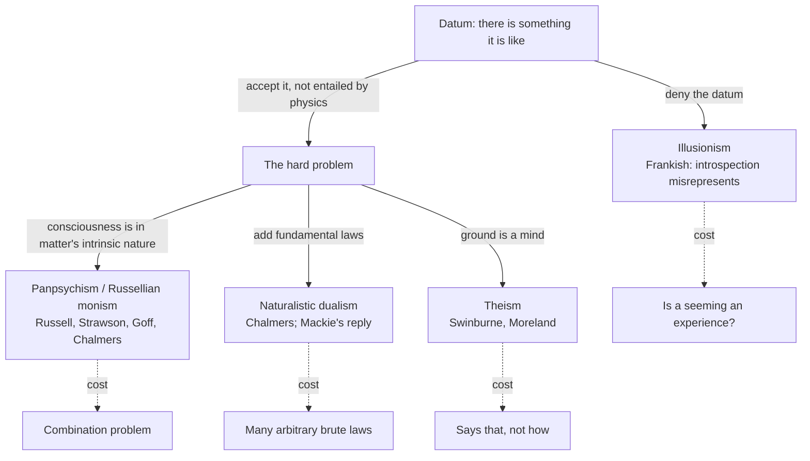

# Apologetics I · Lesson 3.3: Consciousness

> ⏱ ~15 min · Module 3: The burdens of naturalism · Builds on: [3.1 Naturalism at its best](03-01-naturalism-at-its-best.md), [3.2 Reason](03-02-reason.md), [`philosophy-of-mind`](../../philosophy-of-mind/syllabus.md) 3.1, 3.4–3.5, 5.1 · Unlocks: [3.4 Morality](03-04-morality.md)

## Why this matters

[3.1](03-01-naturalism-at-its-best.md) conceded naturalism's record in full, and asked what would count as a genuine burden rather than an unfinished project. Consciousness is the best candidate, because the difficulty is not that neuroscience is young. It is that the vocabulary physics uses to describe anything seems to leave out the one fact every reader of this sentence is most sure of. That makes it an apologetic argument worth having, and it is also where the naturalist's answers are most inventive: two of them, illusionism and panpsychism, are among the most interesting positions in current philosophy. This lesson argues the theistic case and prices both.

## The idea

The [hard problem](../../philosophy-of-mind/syllabus.md) is assumed (`philosophy-of-mind` 3.1): there is something it is like to taste coffee (Nagel, "What Is It Like to Be a Bat?", 1974); Chalmers ("Facing Up to the Problem of Consciousness", 1995; *The Conscious Mind*, 1996) separated the "easy" problems of explaining functions from the hard problem of why any of it is felt; Levine ("Materialism and Qualia: The Explanatory Gap", 1983) named the gap. One sentence holds the apologetic seed: physics describes things by their structure and dispositions, and a felt quality does not seem to follow from any amount of structure.

The [argument from consciousness](../reference.md#argument-from-consciousness) turns that gap into evidence. It is not "science can't explain this yet, so God" — that is the god of the gaps [3.1](03-01-naturalism-at-its-best.md) warned against. It is an inference to the best explanation ([`philosophical-method` 2.1](../../philosophical-method/lessons/02-01-inference-to-the-best-explanation.md)) about the *kind* of world we are in. If the world's ground is mindless, then minds are a late, local and puzzling arrival. If its ground is a mind, then finite minds are a family resemblance. The question is which hypothesis makes the data less surprising.

Two theists built the modern versions. Richard Swinburne (*The Evolution of the Soul*, 1986; *The Existence of God*, 2nd ed. 2004, ch. 9, "Arguments from Consciousness and Morality") argues that the correlations between brain events and mental events are too many and too specific for any scientific theory to explain — no physics tells us why *this* firing goes with *this* taste — while a personal explanation is available: a God with reason to make embodied creatures who can learn, choose and affect one another. J. P. Moreland (*Consciousness and the Existence of God: A Theistic Argument*, 2008) argues that both irreducible consciousness and its regular, law-like correlation with physical states are evidence for God, and works through the naturalist rivals one by one.

## The other side

Naturalists have four answers, and none of them is an evasion.

**Brute psychophysical laws.** J. L. Mackie (*The Miracle of Theism*, 1982) granted that materialist accounts of consciousness face real difficulty, and still judged a naturalistic account simpler than Swinburne's theistic one. Chalmers's naturalistic dualism in *The Conscious Mind*, which is not a reply to theism at all, supplies the strongest form of that alternative: grant that consciousness is irreducible, and add fundamental psychophysical laws to the inventory of nature, as electromagnetism once added charge. A divine intention, on this reply, explains nothing a law does not; it relocates the brute fact into a mind. This is [Oppy's parity strategy](../reference.md#oppys-parity-strategy) from [2.2](02-02-answering-the-atheist-philosophers.md) applied to one datum.

**[Illusionism](../reference.md#illusionism).** Keith Frankish ("Illusionism as a Theory of Consciousness", *Journal of Consciousness Studies* 23, 2016) holds that phenomenal consciousness in the philosophers' sense — intrinsic, ineffable, private qualities — does not exist. Introspection misrepresents our experiences as having such properties. What they really have are *quasi-phenomenal* properties: physical, functional properties that introspection represents as phenomenal. Experiences exist; their alleged phenomenal glow does not. The research task shifts to the illusion problem, close kin to what Chalmers called the meta-problem ("The Meta-Problem of Consciousness", 2018): why do we judge and say there is a hard problem? That task is tractable in cognitive science. Illusionism's strength is that it removes the argument's datum at the cost of one claim — that introspection is fallible about its own objects — which the psychology of introspection independently supports.

**[Panpsychism](../reference.md#panpsychism) and Russellian monism.** Bertrand Russell (*The Analysis of Matter*, 1927) observed that physics tells us what matter *does*, its relations and dispositions, and is silent on what it intrinsically *is*. Russellian monism fills that silence: the intrinsic nature of matter is experiential (panpsychism) or proto-experiential (panprotopsychism, Chalmers, "Panpsychism and Panprotopsychism", 2015). Galen Strawson ("Realistic Monism: Why Physicalism Entails Panpsychism", 2006) argued that experience cannot emerge brutely from the wholly non-experiential, so it was there all along. Philip Goff (*Consciousness and Fundamental Reality*, 2017; *Galileo's Error*, 2019) argues it is the simplest theory that takes both physics and consciousness at face value. It needs no emergence, no extra laws and no God; consciousness becomes as natural as mass.

## The argument

1. **Phenomenal consciousness exists.** *In words:* there is something it is like to be you. (Denied by the illusionist.)
2. **Phenomenal facts are not entailed by physical facts as physics states them.** (Granted by Chalmers, Strawson and Goff; this is the hard problem.)
3. **So on naturalism, consciousness is either fundamental in matter, or tied to it by brute psychophysical laws, or an unexplained emergent.**
4. **On theism, reality's ground is a conscious agent with reasons to create finite, embodied knowers.**
5. **Consciousness, and its orderly correlation with brains, is more to be expected on 4 than on any branch of 3.** *In words:* a world made by mind is likelier to contain minds.
6. **∴ Consciousness confirms theism.** It is a C-inductive argument in Swinburne's sense ([`philosophy-of-religion` 1.1](../../philosophy-of-religion/lessons/01-01-which-god-and-what-an-argument-must-do.md)): it raises the probability, it does not demonstrate.

Each rival now carries a bill. The illusionist must say what the illusion is *to*. An illusion is ordinarily a way things seem, and seeming looks like the very phenomenal fact being denied: "the illusion of experience is itself an experience." The panpsychist owes an answer to the [combination problem](../reference.md#combination-problem), named by William Seager (1995) but pressed by William James (*The Principles of Psychology*, 1890, ch. 6): how many micro-subjects, each with its own point of view, add up to one subject with one point of view. Nothing in physics' structural story says how, and subjects do not obviously sum. Brute laws are numerous and specific: one law per kind of brain state per kind of feel, with no deeper reason why these pairings.

**Concession.** Illusionism and panpsychism are serious, not evasions. Frankish has an answer to the "seeming" objection — a seeming can be a representational state, a misrepresentation by introspective mechanisms, with no phenomenal glow of its own — and whether that answer works is the live dispute, not a refuted error. Panpsychism, for its part, takes the hard problem *more* seriously than most theists do, and the combination problem is a research programme, not a contradiction. Any theist who says either view is "obviously absurd" has stopped arguing.

**Where the argument is weakest.** Premise 5 against the panpsychist. If consciousness is a fundamental feature of matter, then a world with conscious creatures is not surprising on naturalism at all, and the likelihood advantage collapses onto a comparison of priors and simplicity — which is exactly where [2.2](02-02-answering-the-atheist-philosophers.md) left Oppy and the theist standing. And against Mackie, a divine intention says *that* a brain state goes with a feel, never *how*.

## Map of positions

The four solid branches are the live options; the dashed edges are the bill each pays. The argument is a contest of bills.

## Worked examples

**Example 1 — the argument against brute laws.** A naturalist, Ines (invented), grants the hard problem and posits psychophysical laws. Swinburne's reply runs cleanly: Ines's laws are not like the law of gravitation, a single compact equation with endless consequences. They are a vast lookup table, a pairing of each neural kind with a felt kind, with no unifying principle she can state. Theism explains the whole table by one hypothesis, an agent with a reason (embodied, learning, choosing creatures). That is a simplicity advantage, and Ines's best counter — that the table will one day compress into a few laws — is a promissory note. The argument meets the objection: it concedes the laws, and asks why *these*.

**Example 2 — where it strains: the Thomist does not need Swinburne's soul.** Swinburne and Moreland are substance dualists: the self is an immaterial substance joined to a body. A Catholic is not committed to that, and the strongest Catholic version does not use it. The Council of Vienne (1311–12) taught that the rational soul is of itself and essentially the form of the body (the level is [`creation-grace-last-things`](../../creation-grace-last-things/syllabus.md)'s to assign, on the ladder of [`fundamental-theology` 4.4](../../fundamental-theology/lessons/04-04-the-ladder-of-doctrinal-authority.md)); CCC 365, citing Vienne, says soul and body are not two natures united but form a single nature. On [hylomorphism](../reference.md#hylomorphism-is-not-substance-dualism) ([`thomistic-synthesis` 5.3](../../thomistic-synthesis/lessons/05-03-the-human-soul-in-the-system.md); `philosophy-of-mind` 5.1), sensing is an act of the living composite: the powers of sight and hearing have the composite as their subject, not the soul alone (ST I q.77 a.5). So a dog's pain is a bodily act of a living animal, and the Thomist does not infer an immaterial substance from qualia. The immateriality claim is reserved for intellect (q.75 a.2), which is [3.2](03-02-reason.md)'s argument, not this one.

That costs something: the Thomist cannot use premise 2 to prove a soul. It also buys something. The hylomorphist agrees with Russell that a purely structural physics is an abstraction from bodies that have natures and qualities; the hard problem looks, from here, like a symptom of the early modern decision to strip form and quality out of matter. That puts the Thomist closer to the Russellian monist than to Descartes, and moves the argument from "consciousness needs a soul" to "a world whose matter has intelligible natures, including natures that feel, fits a creating intellect." Whether that is still an argument from consciousness, or has become the Fifth Way in new clothes, is a fair question.

## Watch out

- **You might think the Church teaches the argument from consciousness, or teaches dualism.** It teaches neither. *Dei Filius* (ch. 2 and its first canon on revelation) defines that God *can* be known by reason from created things, not that this argument succeeds; the soul as form of the body is a conciliar teaching that excludes the Cartesian picture of a pilot in a body. The argument itself has no magisterial weight at all.
- **You might think illusionism says nobody feels anything.** Frankish affirms that experiences exist and are richly structured; he denies only that they have phenomenal properties in the philosophers' loaded sense. "Illusionists think you're a zombie" is a caricature.
- **You might think panpsychism says rocks have opinions.** Its defenders hold that fundamental physical entities have simple experiential (or proto-experiential) natures, and most deny that rocks, as aggregates, are subjects at all.

## One-liner

> Consciousness is evidence for a mind behind the world only as long as the naturalist's three exits — deny it, spread it into matter, or legislate it — each cost more than God does.

## Problems

**P1 (🟢) *(Exegetical.)*** An invented handout for a parish adult-education evening (nobody wrote this; it is built for the problem):

> "The argument from consciousness proves what the Church has always taught: the real you is an immaterial mind that uses the brain as its instrument, the way a pianist uses a piano. And since your dog feels pain, the same argument shows that animals too must have something immaterial in them."

Name the two errors about Catholic teaching and the one error about the Thomist position, quoting the words that carry each, and correct each in one sentence. 150 words or fewer.

**P2 (🟡) *(Apologetic: (a) Exegetical, graded first · (b) reply)*** An invented debate opening by a theist:

> "Illusionists say consciousness is an illusion. But an illusion is something you experience. So illusionism refutes itself in a single sentence, and we can move on."

(a) State Frankish's illusionism as he states it: what it denies, what it affirms, and what it says the real explanatory task is. Three sentences. (b) Open with a named concession to illusionism. Then say whether the debater's "single sentence" works, and give the strongest form of the objection he is reaching for. 120 words or fewer.

**P3 (🔴) *(Evaluative.)*** Ines from Example 1 replies to Swinburne: "Your God is one more brute fact. My laws say which brain states go with which feels; your God merely intends that they do. You have relocated the lookup table into a mind." (a) Name the theoretical virtue on which the dispute turns and say what each side counts. Two sentences. (b) Give a verdict, either way, in 100 words or fewer.

Solutions

**P1** *(Exegetical.)*

**Must hit, strict:**

- **Error 1, the argument's authority:** "proves what the Church has always taught." No magisterial act teaches any argument from consciousness; *Dei Filius* defines a capacity of reason, not the success of a proof.
- **Error 2, dualism as Church teaching:** "the real you is an immaterial mind that uses the brain as its instrument, the way a pianist uses a piano." The Church teaches that the soul is the form of the body (Vienne; CCC 365: one nature, not two), which is the opposite of the instrument picture.
- **Error 3, the Thomist position:** "the same argument shows that animals too must have something immaterial in them." For Aquinas, sensation is an act of the composite whose powers have the composite as subject (ST I q.77 a.5); the claim of immateriality rests on intellect (q.75 a.2), so feeling pain shows no immaterial principle.

**Wrong turns:** "correcting" Error 2 by saying the Church teaches materialism, or that the soul is just the brain's organization (hylomorphism affirms a subsistent soul). Assigning Vienne a rung yourself as if settled here: the level is `creation-grace-last-things`'s. Denying that animals have souls at all: on Aquinas they have sensitive souls, which are not subsistent.

**Model answer:** "Proves what the Church has always taught" overstates: the Church teaches that God can be known by reason (*Dei Filius*), not that this argument works, which has no magisterial weight. "Uses the brain as its instrument… a pianist" is Cartesian dualism; the Church teaches that the soul is the form of the body, soul and body making one nature (Vienne; CCC 365). "Animals too must have something immaterial" misreads the Thomist: sensation is an act of the living composite (ST I q.77 a.5), so a dog's pain is bodily; only intellect is argued to be immaterial (q.75 a.2).

---

**P2** *(Apologetic: (a) Exegetical, graded first · (b) reply)*

**Must hit, strict (a), graded first:**

- **Denies:** that experiences have phenomenal properties in the philosophers' sense (intrinsic, ineffable, private qualities).
- **Affirms:** that experiences exist, and that introspection misrepresents them as having phenomenal properties; what they really have are quasi-phenomenal (physical, functional) properties.
- **Task:** explain the illusion, why we judge and report that there is a hard problem (the illusion problem; Chalmers's meta-problem).

**Must hit (b):**

- A **named concession**, e.g. that introspection is demonstrably fallible, or that illusionism is a serious theory continuous with cognitive science.
- The single sentence equivocates on "experience": the illusionist affirms experiences and denies only their phenomenal properties, so "you experience the illusion" is no contradiction.
- The real objection: a *seeming* looks phenomenal itself. The illusionist replies that a seeming can be a representational state with no phenomenal properties; the dispute is whether that reply is adequate.

**Wrong turns:** stating (a) as "nobody is conscious" or "we are zombies" (fails the problem). Treating the self-refutation charge as decisive, which is the debater's error. Attributing to Frankish a denial that pain exists.

**Model answer (b), one of several:** Concession: introspection is a fallible instrument, and illusionism is a serious research programme, not a dodge. The debater's sentence fails, because Frankish never denies that we have experiences; he denies that they have phenomenal properties, so "experiencing an illusion" is consistent with his view. The objection worth pressing is narrower: an illusion is a way things seem, and it is hard to see how something can *seem* phenomenal without that seeming being phenomenal. Frankish answers that seemings are introspective representations, misrepresenting without glowing. Whether a mere representation can be the whole of "seeming" is where the argument actually lives.

---

**P3** *(Evaluative.)*

**Accept:** either verdict, if (a) locates the dispute in simplicity (or explanatory power) and (b) engages Ines's relocation charge.

**Must hit, any verdict (a):** the virtue is **simplicity of the explanans**. Ines counts *kinds of entity*: theism adds a whole being, she adds only laws. Swinburne counts *independent brute posits*: Ines needs many specific laws with no unifying reason; theism has one agent whose single purpose explains the pattern.

**Must hit, any verdict (b):**

- Engage the relocation charge directly: does a divine intention explain *why these pairings*, or merely restate them?
- Name what would tip it (e.g. whether the psychophysical laws compress into a few; whether personal explanation counts as explanation at all).

**Wrong turns:** treating Ines's view as god-of-the-gaps territory (she grants irreducibility and posits laws; nobody is appealing to ignorance). Answering with the hard problem itself, which both sides grant. Claiming theism explains *how* a brain state produces a feel.

**Model answer (b), one of several:** Ines is right that God does not say *how* any firing yields any feel. But her table and God's intention are not on a par: her pairings are many, specific and unexplained, while an agent who wants embodied knowers gives a reason for there being a systematic, reliable mapping at all, even if not for each entry. So theism wins on the existence and orderliness of the correlation, and ties on its details. If future science compresses the table into a few elegant laws, that advantage shrinks to almost nothing.

## Flashback

**From Lesson [3.1](03-01-naturalism-at-its-best.md) (Naturalism at its best):** *(Exegetical: apply to a new case, then Evaluative.)* An invented parish talk (nobody gave it; it is built for the problem) offers two challenges to naturalism. (i) "No one has shown how the first self-copying molecule formed from ordinary chemistry, so the origin of life points to a Creator." (ii) "Physics is written in mathematics, and physics cannot tell us why abstract mathematics should fit the physical world at all." (a) Classify each challenge using 3.1's distinction between a gap and a genuine burden, one sentence each. (b) Any verdict: give the naturalist's best answer to the stronger challenge, and say whether that answer is a real answer or a promissory note. Two sentences.

Solution

**Accept:** in (b), any verdict, provided the answer offered is one a naturalist would actually give and the answer-or-promise question is settled by what the answer relies on.

**Must hit, strict (a):**

- (i) is a **gap**: a phenomenon not yet explained naturally, the kind the track record says tends to close. It also makes God a rival chemical mechanism, one cause among causes, which is the god-of-the-gaps move.
- (ii) is a **candidate burden** of the second kind in 3.1's P2: something science *presupposes* (that mathematical structure applies to nature), not something it has failed to discover. It is the same kind of challenge as the lawfulness case in 3.1's Example 1, and it is only a candidate until argued.

**Must hit, any verdict (b):**

- A naturalist answer to (ii) that does not wait on future research. For example: the fit is a brute feature of the world, and every theory stops somewhere (Oppy's simplicity bet). Or: we develop and keep the mathematics that fits, so the fit is partly selected for.
- A verdict on its status. It is a real answer, not a promissory note, because it promises no discovery. The remaining dispute is a comparison of where each total theory stops.

**Wrong turns:** calling (i) a burden because the origin-of-life problem is old or hard (difficulty is not the criterion); calling (ii) a proof against naturalism instead of a candidate; saying a Catholic should hope abiogenesis research fails (3.1's Concession rules that out).

**Model answer, one of several:** (a) (i) is a gap: the origin of life is not yet explained naturally, the record says such gaps close, and it casts God as a competing chemist. (ii) is a candidate burden, because the applicability of mathematics is something physics presupposes rather than something it is still looking for. (b) The naturalist's best answer is that the fit is brute, or partly selected because we keep the mathematics that works, and that every theory stops somewhere. That is a real answer, because it promises no future result, and so the dispute moves to whether the theist's stopping point explains more.

## Connections

- **Backward:** the hard problem, illusionism and panpsychism are taught in [`philosophy-of-mind`](../../philosophy-of-mind/syllabus.md) 3.1, 3.4 and 3.5; here they are used as apologetic premises. The genuine-burden test is [3.1](03-01-naturalism-at-its-best.md)'s; the parity strategy and the comparison of whole theories are [2.2](02-02-answering-the-atheist-philosophers.md)'s; C-inductive support is [`philosophy-of-religion` 1.1](../../philosophy-of-religion/lessons/01-01-which-god-and-what-an-argument-must-do.md).
- **Forward:** [3.4](03-04-morality.md) runs the same shape of argument on moral obligation, where Wielenberg's brute necessary truths play the part of Ines's brute laws. The Thomist turn in Example 2 is why the immateriality of intellect stays with [3.2](03-02-reason.md), and why [4.2](04-02-evolution-design-and-the-human-person.md) can treat the soul's origin without a design inference.
- **Sideways:** the soul as form of the body is [`thomistic-synthesis` 5.3](../../thomistic-synthesis/lessons/05-03-the-human-soul-in-the-system.md), and what a person is, [`metaphysics` 6.5](../../metaphysics/lessons/06-05-what-a-person-is.md). Russell's point that physics gives structure, not intrinsic nature, is the observation a physicist makes when saying a field is whatever satisfies its equations.
