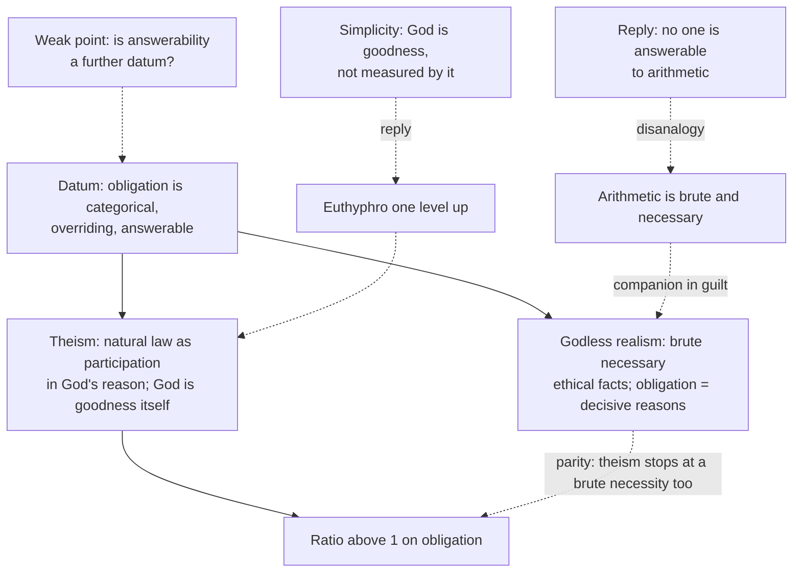

# Apologetics I · Lesson 3.4: Morality

> ⏱ ~15 min · Module 3: The burdens of naturalism · Builds on: [3.3 Consciousness](03-03-consciousness.md), [philosophy-of-religion 3.3](../../philosophy-of-religion/lessons/03-03-moral-arguments.md), [ethics 6.5](../../ethics/lessons/06-05-god-and-morality-the-euthyphro-dilemma.md) · Unlocks: [4.1 The conflict thesis, tested in both directions](04-01-the-conflict-thesis-tested-in-both-directions.md)

## Why this matters

[Philosophy-of-religion 3.3](../../philosophy-of-religion/lessons/03-03-moral-arguments.md) assessed the moral argument and left it where the assessment belongs: everything turns on one term, $\Pr(E \mid N)$, and godless realists say it is not low. This lesson argues. It narrows the evidence from "there are moral facts" to one feature of them, **obligation**, and asks whether the best godless realism, Wielenberg's and Enoch's, can say what obligation is as well as theism can.

## The idea

Two sentences: "Generosity is admirable" and "You must keep your promise to her." The first grades. The second binds: you may not opt out, it overrides your convenience, and if you break it you have *wronged* someone and are answerable for it. Elizabeth Anscombe ("Modern Moral Philosophy", *Philosophy*, 1958) argued that this binding, law-like "ought" makes sense only within a law conception of ethics, with a legislator, and that modern secular ethics kept the vocabulary after dropping the legislator. She concluded not that God exists but that philosophers should drop the moral "ought". The apologist takes her diagnosis and runs it the other way.

That is the [moral argument](../reference.md#moral-argument) in its abductive form, aimed at obligation. Two reloads. It is an inference to the best explanation in odds form, not Kant's practical postulate, which concludes only what an agent must commit to ([PoR 3.3](../../philosophy-of-religion/lessons/03-03-moral-arguments.md)). And it concerns **[grounding, not knowing](../reference.md#grounding-and-knowing)**: what makes obligation obtain, not who can see it. Catholic teaching insists that unbelievers see it. Paul says the Gentiles show "the work of the law written in their hearts, their conscience bearing witness to them" (Romans 2:15, DR). An argument that atheists cannot know right from wrong would contradict the tradition before it reached an atheist.

## The other side

**Wielenberg.** Erik Wielenberg (*Value and Virtue in a Godless Universe*, 2005; "In Defense of Non-Natural, Non-Theistic Moral Realism", *Faith and Philosophy*, 2009; *Robust Ethics*, 2014) defends what he calls [godless normative realism](../reference.md#godless-normative-realism). Moral properties are objective, non-natural, irreducible and causally inert. Some ethical facts are **basic**: brute, in that nothing further explains their obtaining, and **metaphysically necessary**, true in every possible world. That torturing an innocent just for fun is wrong is one; derivative moral facts follow from these together with contingent facts. Moral properties attach to natural ones by a robust **making** relation, which he compares to the relation theists themselves posit when God sustains the world. To the charge that a brute making relation is suspicious, he answers that *every* view must countenance brute relations somewhere, the theist's included, and that the general principle "brute making relations count against a theory" undermines itself. On obligation, he says having an obligation just is having decisive reasons to act. On knowledge, he offers a third factor: evolution gave us cognitive faculties that both ground our possession of moral rights and generate our beliefs about them, which explains why the two correlate. Against divine command theories (he engages Craig and Adams) he presses the **reasonable nonbeliever**: if a command binds only an addressee who recognizes it as coming from a legitimate authority, then reasonable atheists have no divine obligations, which theists cannot accept.

**Enoch.** David Enoch (*Taking Morality Seriously*, 2011) argues for robust non-naturalist realism by indispensability: when we deliberate, we must treat some answers as correct independently of our attitudes, and what is indispensable to deliberation earns belief, as what is indispensable to explanation does in science. Normative facts are too unlike natural facts to be reduced to them. Against Street's debunking ([ethics 6.4](../../ethics/lessons/06-04-constructivism-and-debunking.md)) he gives a third-factor reply, survival being roughly good, and is candid that the reply may not fully satisfy.

**The parity.** Put together, the godless realist's case against the apologist is a parity claim. Arithmetic is necessary and brute, and no one thinks $7 + 5 = 12$ needs God to make it true; basic moral truths are no worse off. And theism stops at a brute necessity too, God's goodness, so it buys no explanatory advantage. If this is right, the likelihood ratio on the moral datum is 1 and the argument contributes nothing to the [cumulative case](../reference.md#cumulative-case).

## The argument

Write $G$ for theism and $R$ for godless robust realism. The datum $O$ is not "there are moral facts" (on which $R$ and $G$ may tie) but **obligation's specific features**: it is categorical, it is overriding, and violating it is *answerable*: it warrants guilt, and is owed to someone.

1. **Obligation has three features: categorical, overriding, answerable.** *In words:* "must" doesn't depend on your wants, beats self-interest, and makes you accountable when broken.
2. **On $G$ in its Thomist form, all three are expected.** God's nature is goodness itself; everything is called good "from the divine goodness, as from the first exemplary, effective, and final principle of all goodness" (ST I q.6 a.4). God's practical reason ordering creatures to that good is eternal law, and "this participation of the eternal law in the rational creature is called the natural law" (ST I-II q.91 a.2). *In words:* to be obligated is to be directed toward your good by the reason of the one who made you for it, so the directive is categorical, overriding, and owed to a person.
3. **On $R$, the first two are posited and the third is unexplained.** If obligation is decisive reasons, its overridingness is not explained (why must moral reasons beat prudential ones?), and its answerability is not even mentioned: a reason is not a creditor. Terence Cuneo pressed the overridingness point in his review of *Robust Ethics* (*Notre Dame Philosophical Reviews*, 2015).
4. **Other things equal, a hypothesis that predicts a datum's features beats one that posits them as brute** (the [theoretical virtues](../reference.md#theoretical-virtues) of [2.2](02-02-answering-the-atheist-philosophers.md)).
5. ∴ **$O$ favours $G$ over $R$**: $\Pr(O \mid G) > \Pr(O \mid R)$. *In words:* on the obligation datum specifically, the ratio is above 1, even if on bare moral value it is not.

**Euthyphro through the divine nature.** The obvious rejoinder is [ethics 6.5](../../ethics/lessons/06-05-god-and-morality-the-euthyphro-dilemma.md)'s dilemma. The Thomist answer does not go through the divine *will*: what grounds obligation is God's reason, which follows God's nature, so a command to torture for fun is not a possible command. Pressed one level up (is God's nature good *because* it is loving and just?), the Thomist answers with [divine simplicity](../../thomistic-synthesis/lessons/03-04-divine-simplicity-and-the-attributes.md): God does not *have* goodness measured by a standard; he alone is good by his essence (ST I q.6 a.3). The stopping point is a necessary *person*, not a necessary proposition.

**Against the parity.** Concede that theism also ends in a necessity. The question is what each stopping point explains. Arithmetic is the right companion for moral *value* and the wrong one for *obligation*: no one is answerable to $7 + 5 = 12$, and no one owes it anything. A brute truth that addresses no one and is owed to no one explains the categorical and overriding features only by stipulation, and the answerable one not at all. A necessary person whose reason directs creatures to their good explains all three at once.

**Debunking cuts both ways.** Street's dilemma threatens $R$, and the third factors of Wielenberg and Enoch are its replies. The theist has a third factor that does not run out on judgments survival never favoured: a creator who meant us to know the good. But the theist cannot debunk the realist with Street without inviting the parallel argument that evolution, not God, explains *religious* belief. Neither side is safe; [PoR 3.3](../../philosophy-of-religion/lessons/03-03-moral-arguments.md) Example 2 prices both.

**Concession.** Atheists are not less moral than believers, and many are better than many Christians. Wielenberg's reasonable nonbeliever objection is correct against any divine command theory that makes obligation depend on recognizing the commander. The argument was never about either: it concerns what grounds an obligation that the atheist sees as clearly as anyone. Natural law needs no recognition of the lawgiver to bind, because it is promulgated in reason itself, which is exactly why Romans 2 can say the Gentiles have it.

**Where the argument is weakest.** Premise 1, at its third clause. A godless realist can deny that answerability is a further datum: guilt is the fitting response to having flouted decisive reasons, and "owed to someone" is owed to the person wronged, not to a lawgiver behind her. If that holds, $O$ reduces to features $R$ posits as brute and the ratio falls toward 1. Anscombe's own response is the other exit: drop the law-like "ought" and keep the virtues, at the price of revising ordinary moral thought.

## The argument map

Solid arrows are the argument; dashed arrows are objections and replies. The last node is where the dispute is decided.

## Worked examples

**Example 1 (clean case: the unwitnessed promise).** Invented: Tomás promised his dying friend to look after her daughter's education. No one else knows. Years later, keeping it would cost him a promotion.

- *$R$:* Tomás has decisive reason to keep it; the basic fact that betraying trust is wrong makes it so. That accounts for "categorical" by stipulation.
- *Ask the overriding question:* why does this reason beat his career reasons? Wielenberg's account, as Cuneo read it, leaves that open; $R$ must add it as a further brute fact.
- *Ask the answerable question:* if he breaks it, to whom does he owe the wrong? The dead friend, says the realist, which is a fair answer. The theist adds that the guilt Tomás would rightly feel is guilt *before* someone, and that this is the ordinary shape of obligation, not a Christian add-on (Anscombe's point).
- Result: the argument meets the realist at premise 3; the realist's best reply denies the third feature.

**Example 2 (hard case: the reasonable nonbeliever).** Invented: Ines, a thoughtful agnostic, is bound not to falsify data that would make her famous. She does not believe any lawgiver exists.

- *Wielenberg's objection:* a recognition-based divine command theory says she is not bound. That is false, so that theory is false. Conceded.
- *Thomist reply:* the obligation binds through her reason; its ground is God whether or not she knows it, as a law of physics governs her without her knowing its author.
- *Where it strains:* the realist now asks what work God does for Ines. Her obligation, her knowledge of it, and her guilt if she breaks it are all the same on $G$ and on $R$. The theist must say that the work is metaphysical, not visible in the agent's life, which makes the ratio depend entirely on premise 4: whether explaining a feature is better than positing it. A naturalist who weighs the virtues differently can decline.

## Watch out

- **You might think the moral argument says atheists cannot be good, but** it concerns grounding. Romans 2:14–15 and the natural law tradition commit the Catholic to the opposite; an apologist who says otherwise contradicts his own tradition.
- **You might think the Church teaches that the moral argument works, or that divine command theory is Catholic doctrine, but** *Dei Filius* can. 1 (rung 1, [FT 1.2](../../fundamental-theology/lessons/01-02-natural-knowledge-of-god.md)) defines a capacity, that God can be known with certainty by natural reason from created things; it endorses no particular argument. Whether obligation is grounded in God's commands (Adams) or in eternal law through reason (Aquinas) is **freely disputed** among Catholics (rung 5, [FT 4.4](../../fundamental-theology/lessons/04-04-the-ladder-of-doctrinal-authority.md)).
- **You might think Wielenberg is a naturalist who reduces morality to evolution, but** he is a non-naturalist: moral facts are irreducible and necessary. Evolution enters only his epistemology. Calling his view "morality is just evolved feeling" is the caricature this course fails.

## One-liner

> Godless realism can match theism on moral value by making it brute and necessary, like arithmetic; the argument's ground is obligation, because no one is answerable to arithmetic, and the realist's best reply is to deny that answerability is a further fact.

## Problems

**P1 (🟢) *(Exegetical.)*** An invented forum post (no one wrote this):

> "Theists keep saying atheists can't ground morality. Wielenberg settled it: morality is grounded in evolution. Our brains evolved empathy, and that is what makes cruelty wrong. Since our feelings could have evolved differently, moral truths are contingent, and that's fine."

Name the two misstatements of Wielenberg's position, and say in one sentence each what he actually holds. 100 words or fewer.

**P2 (🟡) *(Apologetic: (a) Exegetical, graded first · (b) reply.)*** A godless realist presses parity against this lesson's argument.
(a) State the parity objection as Wielenberg would recognize it: what basic ethical facts are, why their bruteness is no defect, and why theism gains nothing. Three sentences or fewer.
(b) Reply. Open with a **named concession**, then say where the parity fails, if it does. 120 words or fewer.

**P3 (🔴, optional) *(Evaluative.)*** The Thomist answers "Euthyphro one level up" by saying God does not have goodness but is goodness (divine simplicity). A critic says this relabels the problem: whether "God is goodness" explains anything depends on whether God's nature is good because it is loving and just. (a) State the critic's point in one sentence. (b) Give the best Thomist reply in two sentences. (c) Name the crux in one sentence. Any verdict passes.

Solutions

**P1** *(Exegetical.)*

**Must hit, strict:**

- Misstatement 1: "grounded in evolution / feelings make cruelty wrong." Wielenberg holds that basic ethical facts are brute, non-natural and irreducible; nothing natural, evolution included, makes them obtain. Evolution enters only his account of how we *know* them (the third factor: faculties that ground rights and produce moral beliefs).
- Misstatement 2: "moral truths are contingent." He holds basic ethical facts are metaphysically necessary; only derivative facts vary with circumstances.

**Wrong turns:** saying Wielenberg is an error theorist or constructivist; saying the post's error is merely that it is atheist; treating the third factor as a grounding claim.

**Model answer:** First, Wielenberg does not ground morality in evolution: basic ethical facts are brute and non-natural, and evolution figures only in his account of moral knowledge, as the source of faculties that both ground rights and generate beliefs about them. Second, he holds basic ethical facts are metaphysically necessary, not contingent on how our feelings evolved.

---

**P2** *(Apologetic: (a) Exegetical, graded first · (b) reply)*

**Accept:** any reply that opens with a genuine concession and engages the parity at a specific point; a reply concluding that the parity succeeds passes if it is argued.

**Must hit, strict (a), graded first:**

- Basic ethical facts are brute (their obtaining is explained by nothing further) and metaphysically necessary; moral properties attach to natural ones by a brute making relation.
- Bruteness is no defect: every view must countenance brute relations somewhere, and the principle that brute making relations count against a theory undermines itself (necessary truths like arithmetic need no ground either).
- Theism also stops at a brute necessity (God's goodness, or God's relation to the good), so it gains no explanatory advantage, and the likelihood ratio is 1.

**Must hit (b):**

- Named concession, e.g. theism too ends in an unexplained necessity; or brute necessary truths are acceptable stopping points for value as for arithmetic.
- A located reply: the parity holds for value but not for obligation's answerability (no one is answerable to a necessary proposition), or the stopping points differ in what they explain (a necessary person explains categorical, overriding and answerable together).

**Wrong turns:** stating Wielenberg as denying objective morality; replying "God is not brute because God is self-explanatory" without saying what that adds; claiming the reply requires the Catholic conclusion.

**Model answer (b), one of several:** Concession: theism does stop at a necessity it does not explain further, and for moral *value* the arithmetic parity is fair. But the argument's datum is obligation, and there the companion fails. A necessary proposition binds no one in the sense of making them answerable: no one owes anything to $7 + 5 = 12$. The realist must posit overridingness and answerability as further brute facts, or deny answerability is real. A necessary person whose reason directs creatures to their good yields all three features from one stopping point. Whether that counts as better explanation depends on how one weighs unification, which is where a realist can still decline.

---

**P3** *(Evaluative.)*

**Must hit, any verdict:**

- (a) If God's nature is good because loving and just, the good-makers are lovingness and justice, and God is not the ground; if not, "good" applied to God is arbitrary.
- (b) A reply using simplicity or the paradigm view: in God, lovingness, justice and goodness are not distinct properties one of which explains another; the "because" presupposes a standard prior to God, which is exactly what is denied (God is good essentially, ST I q.6 a.3).
- (c) A crux both sides would accept, e.g. whether a necessary being can be a standard rather than meet one, or whether simplicity is coherent.

**Wrong turns:** answering (b) with the divine will ("God's commands make it good"), which re-enters the original horn; a crux that is a verdict.

**Model answer, one of several:** (a) Either God's nature is good because it is loving and just, so those properties do the grounding without God, or it is not, and calling it good is arbitrary. (b) The "because" assumes lovingness and justice are distinct from God's goodness and prior to it; on simplicity they are one perfection, and God is its paradigm, not an instance measured by a standard. That is not relabelling, since it denies the premise the dilemma needs. (c) Crux: whether a being can be the standard of goodness, as the metre bar was of length, or whether every standard must itself be explained by something it satisfies.

## Flashback

**From Lesson [3.2](03-02-reason.md) (Reason):** *(Exegetical, then Evaluative: turn the argument around.)* An invented exchange (nobody said this; it is built for the problem). An atheist tells a believer: "You believe in God because your parents raised you Catholic. That belief was caused by your upbringing, not by evidence, so it has no rational standing." (a) Give the reply Anscombe's 1948 distinctions supply, naming both distinctions, in two sentences. (b) Any verdict: does the same reply also dispose of Reppert's rewritten argument from reason? Two sentences.

Solution

**Must hit, strict (a):**

- **Cause vs ground:** "why do you believe that?" can ask for a cause or for a ground. An upbringing that caused the belief does not compete with grounds the believer may have for it, and those grounds are judged by checking them, not by tracing the belief's origin.
- **Non-rational vs irrational:** an upbringing is a non-rational cause, one that is simply not a reason. It is not an irrational cause that works against reason, so it does not by itself make the belief untrustworthy.

**Must hit, any verdict (b):**

- Not by itself. Reppert grants the cause/ground distinction. His Q1–Q2 ask whether a ground, a logical relation, can ever *be* a cause of belief if every cause works through physical properties. Anscombe's distinctions answered Lewis's 1947 global-distrust argument, which is the argument Lewis rewrote in 1960.
- The reply that targets Reppert is the nonreductive physicalist's answer at Q2 (logical relations are causally relevant through the physical states that realize them), not Anscombe's.

**Wrong turns:** answering (a) with "the atheist's beliefs have causes too" (a tu quoque that uses neither distinction); conceding that a caused belief is unwarranted; in (b), saying Anscombe refuted the argument from reason as such (she disputed Lewis's 1947 version, and she was a Catholic who did not dispute his conclusion).

**Model answer, one of several:** (a) The atheist has given a cause of the belief, and a cause does not compete with a ground, so whether the belief is justified is settled by examining the believer's reasons, not where the belief came from. And an upbringing is a non-rational cause, not an irrational one, so it does not discredit the belief. (b) It does not dispose of Reppert, who grants the distinction and asks whether a ground can ever *be* a cause if all causation is physical. That question survives Anscombe, and the reply that meets it is the nonreductive physicalist's at Q2.

## Connections

- **Backward:** the moral argument's skeleton and the Wielenberg ratio of 1 are [philosophy-of-religion 3.3](../../philosophy-of-religion/lessons/03-03-moral-arguments.md)'s; realism, debunking and the Euthyphro dilemma are [ethics 6.1](../../ethics/lessons/06-01-moral-realism.md), [6.4](../../ethics/lessons/06-04-constructivism-and-debunking.md) and [6.5](../../ethics/lessons/06-05-god-and-morality-the-euthyphro-dilemma.md); natural law is [ethics 4.4](../../ethics/lessons/04-04-natural-law-aquinas.md); theoretical virtues are [2.2](02-02-answering-the-atheist-philosophers.md)'s.
- **Forward:** the module's three burdens are ranked in Boss 3 ([syllabus](../syllabus.md)); [4.1](04-01-the-conflict-thesis-tested-in-both-directions.md) turns from naturalism as philosophy to science as evidence.
- **Sideways:** the parity with arithmetic is the companions-in-guilt move from philosophy of mathematics; Enoch's deliberative indispensability is a cousin of the indispensability arguments for scientific realism ([philosophical-method 2.1](../../philosophical-method/lessons/02-01-inference-to-the-best-explanation.md)).
