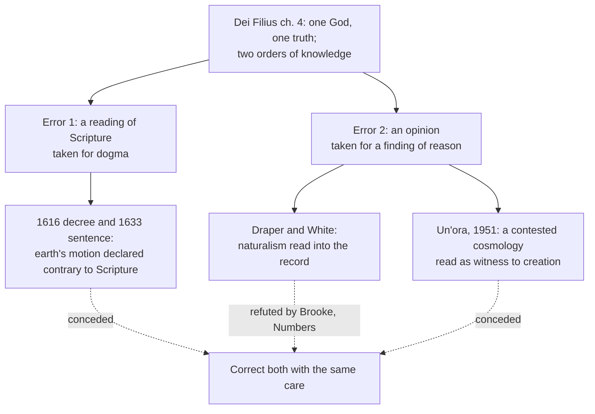

# Apologetics I · Lesson 4.1: The conflict thesis, tested in both directions

> ⏱ ~15 min · Module 4: Science and faith · Builds on: [3.1 Naturalism at its best](03-01-naturalism-at-its-best.md), [`church-history` 7.3](../../church-history/lessons/07-03-the-galileo-affair.md), [`fundamental-theology` 2.3](../../fundamental-theology/lessons/02-03-fideism-and-rationalism.md) · Unlocks: [4.2](04-02-evolution-design-and-the-human-person.md), [4.3](04-03-cosmology-what-a-beginning-would-and-would-not-show.md)

## Why this matters

Two stories circulate. In one, science and religion have been at war since Galileo, and religion keeps losing ground. In the other, modern cosmology has caught up with Genesis. The first is told against the Church and the second for it, and the same historical method refutes both. This module's rule is to correct both with the same care. An apologist who debunks only the secular myth is doing public relations, not history.

## The idea

The **[conflict thesis](../reference.md#conflict-thesis)** says that religion and science are opposed by nature, so their history is a war. It was built by John William Draper's *History of the Conflict between Religion and Science* (1874), aimed chiefly at Roman Catholicism, and Andrew Dickson White's *A History of the Warfare of Science with Theology in Christendom* (1896). White's enemy was "dogmatic theology", not religion as such. [`church-history` 7.3](../../church-history/lessons/07-03-the-galileo-affair.md) tells the affair and its historiography; this lesson does not re-read Bellarmine or the Letter to Christina.

Historians of science have largely abandoned the thesis. That is a report about a field, not a premise. John Hedley Brooke's *Science and Religion: Some Historical Perspectives* (1991) put the **[complexity thesis](../reference.md#complexity-thesis)** in its place. The two have related as rivals, allies, and strangers, and each episode has to be read on its own terms. Brooke's point cuts both ways: he is as suspicious of apologetic "harmony" histories as of the warfare story. Ronald Numbers's edited *Galileo Goes to Jail and Other Myths about Science and Religion* (2009) takes the myths one chapter at a time. Lesley Cormack's chapter, for example, dismantles the claim that medieval Christians taught a flat earth.

So the test is the same in both directions: **find the act, find what was actually claimed, find what was known at the time.**

## The other side

The conflict thesis has a serious modern form, and it is not Draper's. Jerry Coyne's *Faith Versus Fact: Why Science and Religion Are Incompatible* (2015) gives up the claim that the history is one long war. Coyne grants that many scientists are believers and that churches have sponsored science. His thesis is about **method**. Science treats every claim as revisable and tests it against evidence anyone can check. Faith treats some claims (that a man rose, that prayer is answered, that there is a soul) as settled by revelation, authority, or private experience. Those claims are empirical in form, so they compete with science on its own ground. Because the religions have no shared procedure for settling their claims, they disagree among themselves without any way to resolve the disagreement. On Coyne's view, "accommodationism" mistakes the fact that both can exist side by side for compatibility between the two methods.

Galileo serves this version as evidence about structure, not as a martyrology. An institution that claims the right to judge which scientific conclusions conflict with revelation will sometimes use that right against a truth. It did so in 1616 and 1633. And the right was **not given up afterwards: it was defined.** *Dei Filius* ch. 4 (Vatican I, 1870) says the Church has the right and duty to condemn what falsely passes for knowledge, and forbids the faithful to defend as conclusions of science opinions known to be contrary to the faith. Its canon 2 anathematizes anyone who says that the human sciences may hold as true assertions opposed to revelation and that the Church may not forbid them. That is the strongest card, and it is a real one.

## The argument

The Catholic reply has two halves. One is historical and one is doctrinal, and the doctrinal half turns out to be the principle behind both corrections.

> **P1.** The warfare story needs science and religion to be opposed *by nature*, so that each episode is an instance of one conflict.
> **P2.** The record shows episodes of conflict, alliance and indifference, with the conflicts driven by particular acts, institutions and states of knowledge (Brooke; Numbers).
> **∴ C1.** The historical conflict thesis fails. What remains has to be argued episode by episode.

In words: one real condemnation does not make a war, any more than one real alliance makes a harmony.

> **P3.** *Dei Filius* ch. 4 teaches a **[double order of knowledge](../reference.md#double-order-of-knowledge)**: faith and reason are distinct in source and in object, and one God is the author of both, so truth cannot contradict truth.
> **P4.** The same chapter names where *apparent* contradictions come from: a dogma misunderstood, or an unsound opinion taken for a conclusion of reason.
> **P5.** Canon 2 binds only against assertions *opposed to divine revelation*. It is not a license to treat a theologians' reading of Scripture as revelation.
> **∴ C2.** By the Church's own defined principle, 1616 was the first kind of error (a reading of Joshua and the Psalms taken for doctrine), and a Catholic who claims science has proved a dogma risks the second.

In words: Coyne is right that the Church claims a veto, but the veto has a defined scope. 1616 used it outside that scope, and the principle that says so is the one Coyne cites.

**Levels, marked.** The double order and the impossibility of real conflict are conciliar teaching guarded by canons, rung 1 ([`fundamental-theology` 2.3](../../fundamental-theology/lessons/02-03-fideism-and-rationalism.md)). The 1616 Index decree and the 1633 sentence were acts of Roman congregations, a disciplinary decree and a judicial sentence, not definitions. Their weight belongs to `fundamental-theology`'s [ladder](../reference.md#levels-of-authority). Papal addresses to an academy are the lightest genre a pope uses to teach ([`fundamental-theology` 4.5](../../fundamental-theology/lessons/04-05-reading-a-documents-weight.md)). Their scientific content carries no magisterial weight at all, since natural science is not the object of the Church's teaching office.

**Concession.** The condemnation of Galileo was an error by Church authority, really made. A Roman congregation declared a true proposition about nature false and contrary to Scripture, and a papal court made a man abjure it. John Paul II's address of 31 October 1992 is not a substitute for saying so. In the lesson's translations from the French, it attributes the error to "the majority of theologians", who did not distinguish Scripture from its interpretation (§9), and it speaks of a "tragic mutual incomprehension" and of a case that became "a sort of myth" (§10). It never says that the Congregation, the court or the pope erred. An apologist should say it plainly.

**The counter-test.** On 22 November 1951 Pius XII addressed the Pontifical Academy of Sciences (the address known by its opening words, *Un'ora*). He set out Hubble's recession of the galaxies and the convergent estimates of the universe's age that Sir Edmund Whittaker had gathered. Then he said that present-day science seemed to have become witness to the primordial *Fiat lux*. Its climax runs, in the lesson's translation from the Italian: "Creation in time, therefore; and hence a Creator; therefore God!" The address is more careful than its reputation. It calls this voice of science "neither explicit nor complete". It states that the facts so far established are no absolute proof of creation in time: metaphysics and revelation establish creation, and revelation alone establishes a beginning in time. And it says the theories still need development. That is Aquinas's position (ST I q.46 a.2). It neither names Lemaître nor uses his "primeval atom".

**Concession.** The 1951 address overclaimed all the same. Its rhetoric outran its own caveat, it tied a pope's words to a cosmology that was still contested (the steady-state rival was alive until the mid-1960s), and it was received as a papal endorsement of the Big Bang. Georges Lemaître, a priest and the theory's author, was by the historians' report disturbed. In 1951 his hypothesis was not established, and he had kept physics and theology apart for years. The archives at Louvain suggest, without proving, that he worked through Fr Daniel O'Connell to keep the theory out of the pope's 1952 address to the International Astronomical Union, which does not mention it. Helge Kragh's history of the period (*Cosmology and Controversy*, 1996) treats the episode. How much Lemaître intervened is a matter of reconstruction, not record.

**Where the argument is weakest.** Canon 2 still leaves the Church the judge of which assertions are opposed to revelation, and in 1616 the judges were sure. Nothing in the double order of knowledge prevents a repetition. It only tells you, afterwards, which mistake was made. Coyne can grant everything above and say that is his point.

## Map of the two errors

The council's own diagnosis of false conflict sorts the secular myth and the Catholic overclaim into the same two bins.

## Worked examples

**Example 1 (clean): "the Church burned Bruno for saying there are other worlds."** Find the act: Giordano Bruno was burned in Rome in 1600 after a long Roman Inquisition trial. Find what was claimed: the surviving summary of the charges is mostly theological (on the Trinity, Christ's divinity, transubstantiation), and the full trial record is lost. Cosmology was part of the case, but the documents do not support the view that it was the reason for the sentence. Jole Shackelford's chapter in Numbers's volume takes this myth apart. Verdict: a real execution, which the apologist must not soften, but not a martyrdom *for science*. Conceding the first while correcting the second is the method.

**Example 2 (hard): is the 1951 address the mirror image of 1616?** Both tie a papal act to a contested state of science. The disanalogies matter, though. 1616 *condemned* a proposition and bound people. 1951 *welcomed* a theory and bound no one. 1616 claimed Scripture settled the science, while 1951 claimed science supported a doctrine already held on other grounds, and said in so many words that it did not prove it. If cosmology had gone steady-state, the doctrine of creation would have lost nothing ([`thomistic-synthesis` 5.1](../../thomistic-synthesis/lessons/05-01-creation-and-conservation.md)). Only the pope's rhetoric would have looked foolish. So the structure is the same (a theologian's hypothesis treated as settled) but the stakes are not. Whether that makes 1951 a lesser error or only a luckier one is the open question. [4.3](04-03-cosmology-what-a-beginning-would-and-would-not-show.md) asks what a beginning could show.

## Watch out

- **You might think the 1992 address "rehabilitated" Galileo or declared the condemnation an error.** It does neither in those words. It names the theologians' error and the Enlightenment myth, and the 1633 sentence had lost its force long before ([`church-history` 7.3](../../church-history/lessons/07-03-the-galileo-affair.md)). Overstating what a document says is an exegetical error, in whichever direction it flatters.
- **You might think Pius XII taught that the Big Bang proves creation.** He said science bore a voice "neither explicit nor complete", explicitly denied it was absolute proof of creation in time, and taught in an address, which defines nothing. The opposite caricature, that the address was harmless, misses the overclaim.
- **You might think defeating Draper defeats Coyne.** Coyne's thesis is about method, not history ([methodological and metaphysical naturalism](../reference.md#methodological-and-metaphysical-naturalism) are kept apart in [3.1](03-01-naturalism-at-its-best.md)). Answering him takes the doctrinal half of the argument, not the historical half.

## One-liner

> The same rule that convicts 1616 of mistaking a reading for revelation convicts 1951 of mistaking a theory for a witness: the war story is false, and the Church's own principle is what makes it possible to admit both errors.

## Problems

**P1 (🟢) *(Exegetical.)*** An invented op-ed (nobody wrote it; it is built for the problem):

> "Every schoolchild knows that the medieval Church taught that the earth was flat, and that Columbus sailed against the theologians. The pattern never changed. Even today Catholic doctrine, defined at Vatican I, claims the right to overrule any scientific result the Church dislikes."

(a) Name the myth in the first sentence, say what the record shows, and name the historian who answers it in Numbers's volume. (b) The last sentence is partly true. Say exactly what *Dei Filius* ch. 4 and its canon 2 do claim, and what the op-ed adds to them. Two sentences per part.

**P2 (🟡) *(Apologetic: (a) Exegetical, graded first · (b) reply.)*** (a) State Jerry Coyne's incompatibility thesis from *Faith Versus Fact* (2015) as he would recognize it: what is incompatible with what, and what he concedes about history and about believing scientists. (b) Reply. Open with a **named concession**, then answer the thesis at the point where it actually bites. 150 words or fewer for each part.

**P3 (🔴, optional) *(Exegetical (a) · Evaluative (b).)*** A seminarian writes: "In 1951 Pius XII taught that science had proved creation in time, so a Catholic who doubts the Big Bang is resisting the papal magisterium." (a) Correct the sentence on three points: what the address claimed about proof, on what grounds it said creation in time is known, and what weight the genre carries. (b) Was the 1951 address the same kind of error as the 1616 decree? Any verdict, 150 words or fewer, using at least one analogy and one disanalogy.

Solutions

**P1** *(Exegetical.)*

**Must hit, strict (a):**

- The flat-earth myth. Educated medieval Christians held the earth to be a sphere (Bede; Sacrobosco's *De sphaera*, the standard university textbook), and flat-earth writers such as Lactantius were marginal exceptions.
- Columbus's dispute was over the earth's *size* and the distance to Asia, which his critics estimated better than he did.
- Lesley Cormack wrote the chapter ("Myth 3") in *Galileo Goes to Jail* (2009).

**Must hit, strict (b):**

- *Dei Filius* ch. 4 claims the right and duty to condemn what falsely passes for knowledge, and forbids defending as science opinions known to be contrary to the faith. Canon 2 anathematizes the claim that the sciences may hold assertions *opposed to divine revelation* as true and that the Church may not forbid them.
- The op-ed adds "any result the Church dislikes". The defined scope is opposition to *revelation*, and the same chapter says that apparent conflicts arise from misunderstood dogma or from unsound opinions.

**Wrong turns:** denying that Vatican I claims any such right (it does, in a canon); naming Draper or White as the debunker (they spread the myth); saying the myth was invented in the Middle Ages (it is a modern story, spread in the nineteenth century).

**Model answer:** (a) The flat-earth myth: medieval scholars and their textbooks taught a spherical earth, and Columbus's critics objected to his figures for its size, not its shape. Lesley Cormack answers it in Numbers's volume. (b) Vatican I does claim the right to condemn false "knowledge" and anathematizes anyone who says the sciences may hold, against the Church's prohibition, assertions opposed to revelation. The op-ed widens that from "opposed to revelation" to "disliked", and omits the chapter's own warning that apparent conflicts often come from misreading dogma.

---

**P2** *(Apologetic: (a) Exegetical, graded first · (b) reply.)*

(a) Coyne holds that science and religion are incompatible as ways of knowing: one tests revisable claims against public evidence, the other accepts some empirical claims on revelation, authority or experience and has no way to settle disputes among faiths. He grants that believers do good science and that churches have supported it; the incompatibility is of method, not of persons or of history.

**Accept:** any reply whose concession is genuine and which engages the methodological thesis, not the historical one, whatever its verdict.

**Must hit, strict (a), graded first:**

- The incompatibility is between **methods** of forming belief: science's revisable, publicly checkable testing against faith's acceptance of claims on revelation, authority or private experience.
- Religious claims are often **empirical** in form (miracles, answered prayer, souls), so they compete on science's ground.
- With no shared procedure, the religions cannot settle their disagreements.
- Coyne **concedes** that many scientists are believers and that the churches have supported science. His thesis is not that the history is a war, and he rejects "accommodationism" as confusing coexistence with compatibility.

**Must hit (b):**

- A named concession, for example: the Church claims a defined right to judge scientific assertions opposed to revelation, and used a version of it against a truth in 1616.
- The reply must engage method, e.g. that faith's claims on the Catholic account rest on motives of credibility open to public assessment (Module 5 argues one); or that "revisable testing" is itself not established by testing; or that the double order of knowledge restricts faith's object, so most of science is untouched.
- It must not merely re-run the historical refutation of Draper.

**Wrong turns:** stating Coyne as Draper ("the Church has always persecuted science"); answering with a list of Catholic scientists, which he concedes; saying faith is not belief at all, which drops the empirical claims the course defends.

**Model answer (b), one of several:** Concession: Coyne is right that the Church claims, at Vatican I, the right to judge scientific assertions that contradict revelation, and that it once used that right against a truth. But his thesis needs every faith claim to be held *against* or *without* evidence. The Catholic account requires the opposite: faith is not a conclusion of argument, yet its credibility rests on public signs that can be weighed, and this course weighs them where an outsider can check the work. The veto is defined narrowly. It covers only what contradicts revelation, and the same chapter treats apparent conflicts as misreadings to be corrected. So the real dispute is whether any revealed claims are credible, which is an evidential question, not a clash of methods. If the resurrection case of Module 5 fails, Coyne wins on the merits, not by definition.

---

**P3** *(Exegetical (a) · Evaluative (b).)*

**Must hit, strict (a):**

- **Proof:** the address says the facts so far established are *not* absolute proof of creation in time. It called science's testimony "neither explicit nor complete" and said the theories needed further development.
- **Grounds:** simple creation is known by metaphysics and revelation, and creation *in time* by revelation alone (in line with ST I q.46 a.2).
- **Weight:** an address to an academy is the lightest papal teaching genre and defines nothing. Its scientific content carries no magisterial weight. That the world had a beginning is held on other grounds (Lateran IV), not because of this address.

**Must hit, any verdict (b):** an analogy (both tie a papal act to a contested state of science; both treat a hypothesis as settled), a disanalogy (1616 condemned and bound people, 1951 welcomed and bound no one; 1616 made Scripture settle the science, 1951 made science support a doctrine held on other grounds), and a verdict.

**Wrong turns:** saying Pius XII endorsed Lemaître's primeval atom *by name* (he named neither); saying the address claimed proof; treating "the address was harmless" as the correction, which forgets the overclaim.

**Model answer (b), one of several:** Partly. The analogy is real: in both cases a pope's act leaned on an unsettled state of science and treated a hypothesis as settled, which is the second error Vatican I names. But the disanalogy is larger. The 1616 decree condemned a true proposition and bound consciences, and Galileo paid for it. The 1951 address bound no one and disclaimed proof in its own text. It risked embarrassment, not injustice, and the doctrine it praised never depended on it. I would call it the same mistake in the mild form: an error of rhetoric, not an abuse of authority.

## Flashback

**From Lesson [3.3](03-03-consciousness.md) (Consciousness):** *(Evaluative: apply to an invented future result.)* Suppose that in 2040 cognitive scientists publish a mechanism that predicts, from brain activity alone, every judgement a person makes about their own experience, including "there is something it is like to taste this" and "that feeling could not be physical". The result is invented for the problem, and in the supposal nobody disputes it. (a) Which of 3.3's four positions does the result help most, and why? Two sentences. (b) Any verdict: does premise 1 or premise 2 of the argument from consciousness fall, and what pressure does the result put on a theist who keeps both? Two sentences.

Solution

**Must hit, strict (a):**

- **Illusionism.** Its research task is the illusion problem (Chalmers's meta-problem): explain why we judge and report that there is a hard problem. The supposed result does exactly that, with no appeal to phenomenal properties.

**Must hit, any verdict (b):**

- **Neither premise falls by entailment.** The result explains *judgements*, which are functional facts, the kind physics can reach. Premise 1 is about phenomenal facts themselves, and premise 2 says they are not entailed by the physical facts. A realist can say the mechanism explains the reports and leaves the feel untouched.
- **The pressure:** if every judgement about experience is fully explained without mentioning the phenomenal facts, those facts look idle in producing our belief in them. The realist, theist or not, then owes an account of why the judgements track them. The theist cannot simply cite the hard problem again, because the result was built to explain why that problem seems hard.

**Wrong turns:** saying the result solves the hard problem (it addresses an "easy" problem about functions and reports); saying it refutes the theist outright (it is consistent with realism plus brute laws, with panpsychism, and with theism); saying the theist should hope the research fails, which is the god-of-the-gaps posture 3.1 ruled out; treating the result as touching the Thomist argument from intellect, which 3.3 left to 3.2.

**Model answer, one of several:** (a) Illusionism gains most, since its whole programme is to explain why we judge that experience has a phenomenal glow, and the result does that without any glow. (b) Neither premise falls, because explaining what we say about experience is not deriving what experience is like, but the result makes the phenomenal facts look causally idle in our belief in them, so the theist who keeps premise 1 must now say why our judgements are reliable about something that plays no part in producing them.

## Connections

- **Backward:** [3.1](03-01-naturalism-at-its-best.md) separated methodological from metaphysical naturalism, and Coyne's thesis lives between them. [`fundamental-theology` 2.3](../../fundamental-theology/lessons/02-03-fideism-and-rationalism.md) taught the double order of knowledge this lesson uses as a diagnostic. [`church-history` 7.3](../../church-history/lessons/07-03-the-galileo-affair.md) is the record.
- **Forward:** [4.2](04-02-evolution-design-and-the-human-person.md) runs the same two-directional test on evolution and *Humani Generis*. [4.3](04-03-cosmology-what-a-beginning-would-and-would-not-show.md) asks what the beginning Pius XII praised could actually show.
- **Sideways:** "find the act, what was claimed, what was known" is crux-finding ([`philosophical-method` 4.3](../../philosophical-method/lessons/04-03-finding-the-crux.md)) applied to history. Aquinas's verdict that a beginning is held by faith alone (ST I q.46 a.2), which the 1951 address followed in its caveat, is read in [`thomistic-synthesis` 5.1](../../thomistic-synthesis/lessons/05-01-creation-and-conservation.md).
