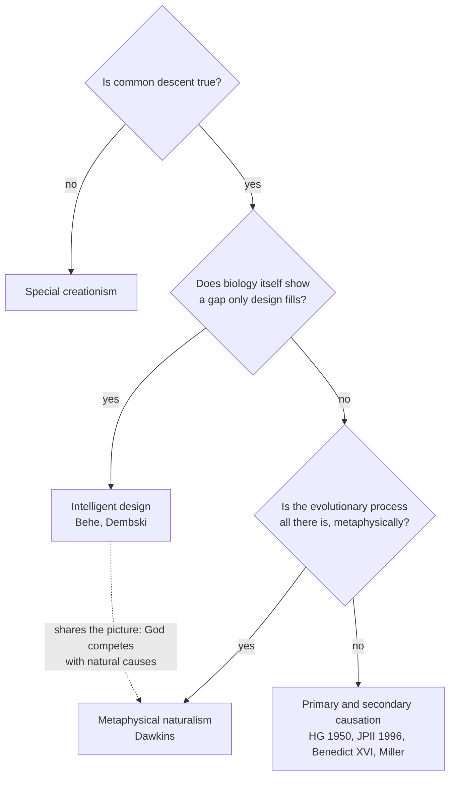

# Apologetics I · Lesson 4.2: Evolution, design, and the human person

> ⏱ ~15 min · Module 4: Science and faith · Builds on: [4.1 The conflict thesis, tested in both directions](04-01-the-conflict-thesis-tested-in-both-directions.md), [`thomistic-synthesis` 3.3](../../thomistic-synthesis/lessons/03-03-the-third-fourth-and-fifth-ways.md), [`thomistic-synthesis` 5.2](../../thomistic-synthesis/lessons/05-02-providence-and-secondary-causes.md) · Unlocks: [4.3 Cosmology: what a beginning would and would not show](04-03-cosmology-what-a-beginning-would-and-would-not-show.md)

## Why this matters

Evolution is where the conflict story of [4.1](04-01-the-conflict-thesis-tested-in-both-directions.md) is told most confidently, by both sides. The naturalist says Darwin removed the last reason to posit a designer; a well-funded movement of Christians answers that biology itself still shows one. This lesson argues that both are making the same mistake about what kind of cause God would be, and that a Catholic loses nothing by declining the design inference. First it has to say, exactly and at the right weight, what the Church has actually taught, because overstatement here runs in both directions.

## The idea

Common descent and its mechanisms (selection, drift, mutation, speciation) are assumed as the science, from [`evolution-ecology`](../../evolution-ecology/lessons/02-04-macroevolution-history-of-life.md) Modules 1–2. Nothing here disputes them.

The question is what they *rule out*. A process that runs by its own causes, with no interruptions, rules out one picture of God: a cause among causes, needed only where the creature's own causes give out. It does not touch the picture the Catholic tradition actually holds, in which God is the cause of the whole order of causes and of each creature's acting, not a rival inside it ([primary and secondary causation](../reference.md#primary-and-secondary-causation), owned by [`thomistic-synthesis` 5.2](../../thomistic-synthesis/lessons/05-02-providence-and-secondary-causes.md)). Hold that distinction and the lesson's three moves follow: what the documents say, why the design inference is a Christian version of the naturalist's mistake, and where the human person is the one place the Church does insist on a discontinuity.

**What the Church has taught, and at what weight.** All levels are from the ladder in [`fundamental-theology` 4.4](../../fundamental-theology/lessons/04-04-the-ladder-of-doctrinal-authority.md).

- ***[Humani Generis](../reference.md#humani-generis)*** (Pius XII, encyclical, 12 August 1950): **rung 3**, authentic ordinary magisterium. §36 does *not forbid* research and discussion by the competent on evolution "in as far as it inquires into the origin of the human body as coming from pre-existent and living matter", with the arguments for and against weighed seriously and the outcome submitted to the Church's judgment; the same paragraph rebukes those who treat the body's evolutionary origin as already certain and proved. That is a **permission**, not an endorsement. In the same sentence it adds that the Catholic faith obliges us to hold that souls are immediately created by God. The encyclical presents that as something it *restates*; its own weight is argued in `creation-grace-last-things` 2.3, not conferred by the encyclical. §37 says the faithful cannot embrace [polygenism](../reference.md#polygenism), because it is not apparent how it can be reconciled with original sin. That doctrine is ceded to `creation-grace-last-things` 3.4; whether the 1950 judgment still closes the question is disputed ([`fundamental-theology` 4.3](../../fundamental-theology/lessons/04-03-religious-submission.md), Example 2). And §5 aims at a philosophy, not a science: those who claim evolution explains the origin of all things, in a monist or pantheist spirit.
- **John Paul II, message to the plenary session of the Pontifical Academy of Sciences** (dated 22 October 1996): a papal message to a particular body, a light genre at the low end of rung 3. Its §4 says new knowledge leads to recognizing in the theory of evolution [*plus qu'une hypothèse*](../reference.md#more-than-a-hypothesis), "more than a hypothesis", citing the unsought convergence of independent results. The English edition of *L'Osservatore Romano* first printed this as "more than one hypothesis" in the theory of evolution, which reverses the point, and the paper later acknowledged the error (as reported at the time). The message also says there are *theories* of evolution, with materialist, reductionist and spiritualist readings, and that judging between them belongs to philosophy and theology. §5 restates immediate creation of the soul, quoting Pius XII, and judges incompatible with the truth about man any theory that treats spirit as emerging from living matter or as its epiphenomenon.
- **Benedict XVI**: in a question-and-answer session with clergy at Auronzo di Cadore (24 July 2007) he called the supposed opposition of creation and evolution an absurdity, while insisting evolution does not answer where everything comes from. That is a pope's theological opinion in an informal setting, not a magisterial act of any weight. The same two-questions frame runs through Ratzinger's earlier homilies on Genesis, *In the Beginning*.

## The other side

**The naturalist.** Richard Dawkins (*The Blind Watchmaker*, 1986) states the strongest version: before Darwin, the adapted complexity of organisms was the best evidence there was for a designer, and Paley was right to be impressed; natural selection explains that complexity by a cumulative, unforesighted process, so the evidence is gone, and with it the main reason anyone had for theism. The argument is a likelihood argument run in reverse ([`philosophy-of-religion` 3.1](../../philosophy-of-religion/lessons/03-01-from-design-to-fine-tuning.md)): once selection is on the table, adaptation no longer favours design over its rival.

**[Intelligent design](../reference.md#intelligent-design), as its proponents state it.** Michael Behe (*Darwin's Black Box*, 1996), who accepts common descent and an old earth, argues that some biochemical systems are [irreducibly complex](../reference.md#irreducible-complexity): several well-matched parts, all needed for the basic function, so that no direct series of slight improvements could build them. William Dembski (*The Design Inference*, 1998) supplies the method, the [explanatory filter](../reference.md#explanatory-filter). Given an event, ask in order: does a regularity make it probable? If so, attribute it to law. If not, is it of intermediate probability, or improbable but unpatterned? Then attribute it to chance. If it is both very improbable (below a universal bound Dembski sets at 1 in $10^{150}$) and **specified**, matching a pattern given independently of the event, attribute it to design. ID's proponents present this as science: a detection method we already use in forensics and cryptography, not a theological premise.

## The argument

1. The causes biology studies are secondary causes: creatures acting by their own natures. *(Methodological naturalism describes the science's scope; [methodological vs metaphysical naturalism](../reference.md#methodological-and-metaphysical-naturalism).)*
2. God, if he exists as the tradition holds, is the primary cause of every secondary cause's being and acting, not one more cause on the same level. *In words:* God is not a part of the story; he is why there is a story. *([`thomistic-synthesis` 5.1–5.2](../../thomistic-synthesis/lessons/05-02-providence-and-secondary-causes.md).)*
3. So a complete secondary-cause explanation of adaptation neither removes nor competes with primary causation.
4. The Fifth Way argues from natures acting *always or nearly always* toward an end, a datum natural selection uses rather than removes; it is not Paley's argument from contrivance ([`thomistic-synthesis` 3.3](../../thomistic-synthesis/lessons/03-03-the-third-fourth-and-fifth-ways.md)).
5. Therefore the Catholic case needs no gap in the biological story, and Dawkins's argument defeats Paley, not the Catholic case. *In words:* evolution answers an argument the tradition never relied on.
6. The design inference, by placing God's action where secondary causes fail, treats him as a cause on their level, which P2 denies. ∴ **C.** A Catholic does not merely lack need of ID; on P2, ID's picture of divine action is the wrong one.

**The human person.** Here the documents do mark a discontinuity, and it is not a gap argument. John Paul II's §6 speaks of an ontological leap with the human being, and answers the obvious objection from physical continuity by method: the observational sciences cannot observe the moment of passage to the spiritual, though they detect signs of it; self-awareness, conscience, freedom and metaphysical knowledge are for philosophy to analyse. The claim is not that biology fails somewhere, but that what the intellect is (the argument of [3.2](03-02-reason.md)) is not the kind of thing a bodily process produces.

**Concession.** Catholic critics of ID, Kenneth Miller among them, are right that a gap-based design inference makes God a cause among causes, and each closed gap then reads as a retreat. And ID's proponents are right about something many of their critics deny: the Church *does* reject a purely unguided process in the metaphysical sense. *Humani Generis* §5 and the 1996 message §5 both rule out evolution taken as a total philosophy of origins. On that point Behe and Dembski stand closer to Pius XII than Dawkins does.

**The replies to ID, briefly.** *Biological:* Miller (*Finding Darwin's God*, 1999) argued that parts of supposedly irreducible systems have functions of their own elsewhere, so they can be co-opted along indirect routes Behe's definition does not exclude. *Methodological:* Fitelson, Stephens and Sober ("How Not to Detect Design", *Philosophy of Science*, 1999) argued that the filter eliminates rivals without ever assessing how probable the evidence is on the design hypothesis, which a likelihood comparison requires. *Legal:* in *Kitzmiller v. Dover* (2005), Judge John E. Jones III held that ID is not science and that teaching it in a public school violated the Establishment Clause; whether courts can settle demarcation is [`philosophy-of-science`](../../philosophy-of-science/syllabus.md) 2.6's question, not this lesson's.

**Where the argument is weakest.** P2 is doing all the work, and it is not testable. A naturalist can reply that a primary cause that makes no empirical difference is idle, and the Thomist must then rest the case on the metaphysical arguments of [2.1](02-01-assembling-the-case.md), not on biology. The argument shows that evolution cannot refute God; it gives no positive evidence for him.

## Map of positions

ID and Dawkins answer Q2 and Q3 differently, but the dashed line marks what they share: both assume that if natural causes suffice, God has nothing left to do.

## Worked examples

**Example 1 (clean): the eye.** A naturalist says the evolution of the camera eye through graded intermediates leaves nothing for God to explain. Run the argument. Grant the whole story of secondary causes (P1). Ask what it explains: why there are eyes, given organisms, heritable variation and stable laws. It does not explain why there are natures that act always or nearly always toward ends at all (P4), nor why anything exists (P2). The reply concedes the biology fully and denies only that it was ever the evidence the tradition relied on. Notice that the reply cost nothing: no premise about the eye was disputed.

**Example 2 (strain): Cardinal Schönborn's op-ed.** In "Finding Design in Nature" (*New York Times*, 7 July 2005), Christoph Schönborn wrote that common descent might be true but that neo-Darwinism, understood as "unguided, unplanned" variation and selection, is not, and that denying the evidence for design in biology is ideology. Is this ID or the Catholic position? It strains because the key words are ambiguous. If "unguided" means *random with respect to fitness*, a biological claim, then providence is compatible with it, and the op-ed contradicts P3. If "unguided" means *without any primary cause*, a metaphysical claim, the op-ed restates *Humani Generis* §5 and is right. Two further points. First, its level: an op-ed by a cardinal is no magisterial act at all, so neither side may cite it as "the Church". Second, the phrase "evidence for design in biology" leans toward a detection claim, which P6 resists. The honest reading is that the op-ed runs the two senses together, and that this is the most common Catholic error on the topic.

## Watch out

- **You might think *Humani Generis* endorsed evolution.** It permitted research on the body's origin, demanded that the arguments on both sides be weighed, rebuked treating the matter as proved, and is rung 3. Equally, it did not condemn evolution. Both overstatements are exegetical errors.
- **You might think the 1996 message defined anything, or that it said "more than one hypothesis".** It is a message to an academy, judging the state of a science; its doctrinal content (the soul, the rejection of materialist readings) carries the weight of what it restates.
- **You might think ID's critics have shown design false.** The methodological reply shows the filter cannot detect design without a likelihood for it; it does not show the world undesigned, and the Thomist does not want it to.

## One-liner

> Evolution refutes a God who fills gaps; the Catholic God never filled any, which is why the design inference is a solution to the naturalist's problem, not the Church's.

## Problems

**P1 (🟢) *(Exegetical.)*** An invented parish bulletin note (nobody wrote this; it is built for the problem):

> "In 1996 Pope John Paul II infallibly settled the evolution debate. As the official translation put it, there is 'more than one hypothesis' in evolution, and the Church now accepts all of them. Catholics are therefore free to hold that the human mind, like the body, simply emerged from matter."

Name three errors and correct each in one sentence, citing the message's sections. **Three sentences.**

**P2 (🟡) *(Apologetic: (a) Exegetical, graded first · (b) reply.)*** (a) State Dembski's explanatory filter as he states it, including what a specification is and why the filter is eliminative. **Three sentences or fewer.** (b) Reply, opening with a **named concession**, and give one methodological objection and one theological one. **100 words or fewer.**

**P3 (🔴, optional) *(Apologetic: (a) Exegetical, graded first · (b) reply, any verdict.)*** An invented debate opening:

> "The human brain arose by tiny steps from ape-like ancestors; no generation was born with a new kind of mind its parents lacked. A Church that speaks of an 'ontological leap' at some point in that continuous line is positing a discontinuity the evidence excludes."

(a) State the objection at its strongest in two sentences, adding what the gradualist would say about the intellect specifically. (b) Reply in **120 words or fewer**, any verdict, saying what the reply costs.

Solutions

**P1** *(Exegetical, strict.)*

**Must hit, strict:**

- **Level:** a message to the plenary of the Pontifical Academy of Sciences defines nothing; it is a light-genre papal act (low rung 3), and nothing in it meets can. 749 §3.
- **Translation:** the French *plus qu'une hypothèse* means "more than a hypothesis"; "more than one hypothesis" was the English *L'Osservatore Romano*'s mistranslation, later acknowledged, not an official reading. (§4 does speak of several *theories* of evolution, but to distinguish their philosophies, not to accept all.)
- **The mind:** §5 judges incompatible with the truth about man any theory treating spirit as emerging from living matter or as an epiphenomenon, and restates the immediate creation of the soul; §6 speaks of an ontological leap.

**Wrong turns:** saying the message "said nothing new" (it did revise Pius XII's estimate of the science); saying it is of no weight at all; attributing the soul teaching's authority to this message rather than to what it restates.

**Model answer:** The message to the Academy is a light-genre papal act that defines nothing, so "infallibly settled" is false. *Plus qu'une hypothèse* means "more than a hypothesis"; the plural was the English edition's later-acknowledged mistranslation, and §4's plurality of theories is offered so that philosophy can judge between them, not so the Church can accept them all. §5 explicitly rejects theories that make spirit emerge from matter, restating the immediate creation of the soul.

---

**P2** *(Apologetic: (a) Exegetical, graded first · (b) reply.)*

**Must hit, strict (a), graded first:**

- The three nodes in order: **regularity** (high probability: attribute to law), **chance** (intermediate probability, or small probability without specification), **design** (small probability **and** specified).
- **Specification**: a pattern given independently of the event (not read off it after the fact); the small-probability threshold is a universal bound (1 in $10^{150}$).
- **Eliminative**: design is inferred when regularity and chance have been ruled out, not by positive evidence for a designer; proponents present it as a general, non-theological detection method.

**Must hit (b):**

- A named concession, e.g. that we do legitimately infer design by something like specification plus improbability (forensics, cryptography), or that the Church rejects a metaphysically unguided process.
- Methodological: Fitelson, Stephens and Sober: elimination never computes the probability of the evidence on design, so it cannot be a likelihood comparison; the "chance" node must also include unconsidered natural processes.
- Theological: a residual-category designer is a cause on the level of secondary causes; primary causation is present at the regularity node too, so the filter looks for God in the wrong place.

**Wrong turns:** stating the filter as "complex things are designed" (drops specification); folding Behe's irreducible complexity into the answer as if it were the filter; calling ID young-earth creationism; replying only "*Kitzmiller* ruled it unscientific" (a court's ruling is not a methodological argument).

**Model answer (b), one of several:** Concession: specification plus improbability is how we rightly detect a forger or a cipher. But there we have independent evidence of designers with known aims, so we can ask how likely the evidence is on design; the filter never asks, and its "chance" node can only eliminate the natural rivals someone has thought of (Fitelson, Stephens and Sober). Theologically, a designer found only at the third node is a cause competing with natures. On the Thomist account God is equally the cause of the first node's regularities, so the filter looks for God exactly where he is not distinctively found.

---

**P3** *(Apologetic: (a) Exegetical, graded first · (b) reply, any verdict.)*

**Accept:** any verdict, including that the objection succeeds against some Catholic formulations, if (a) is accurate and (b) makes the moves below.

**Must hit, strict (a), graded first:** continuity at the level of populations and generations (no first-generation break); the gradualist's view that the intellect is brain function, built by degrees like other cognitive capacities, so that "rational" is a vague predicate with borderline cases; hence a sharp ontological line is either unevidenced or contradicted.

**Must hit, any verdict (b):**

- The claim is metaphysical (a kind of being), not a biological gap; JPII §6 says the moment of passage is not an object of observation, which concedes the objector's empirical premise rather than denying it.
- What grounds the discontinuity: the argument that the intellect is not a bodily power ([3.2](03-02-reason.md)), so the reply stands or falls with that argument, not with fossils.
- The cost: the claim is unfalsifiable by biology, and a sharp line of kinds over a smooth line of bodies is a real strain (borderline individuals; how parents of the first ensouled humans differ).

**Wrong turns:** answering with a fossil gap; asserting the soul is detectable; restating the 1950 polygenism judgment as if it answered the objection (it is a different question).

**Model answer (b), one of several:** The objector is right about the bodies: no generation shows a break, and the 1996 message says observation will not find one. But the leap claimed is in kind of being, not in anatomy: if understanding is not the act of a bodily organ, as the argument from reason contends, then a smooth series of brains is compatible with a sharp difference in what some members of it are. The cost is twofold: the claim now rests entirely on that philosophical argument, and it implies a sharp line between ancestors and descendants who look continuous.

## Flashback

**From Lesson [3.4](03-04-morality.md) (Morality):** *(Exegetical (a) · Evaluative: apply to a new case (b).)* Two invented cases (nobody here is real; they are built for the problem). **Aiko**, a nurse, learns that a stranger will die without a kidney and that she is a match. Donating carries real risk to her own health, and no one would blame her for declining. **Ben** finds a wallet with 400 dollars and its owner's ID on an empty train. No one saw him pick it up, and he is short on rent.

(a) Which case supplies the datum of 3.4's moral argument, and which of its features does that case display? Why does the other case give theism no advantage over godless realism? Two sentences. (b) Wielenberg holds that having an obligation just is having decisive reasons. Suppose Aiko's moral reasons to donate are the strongest moral reasons she has. Give the godless realist's best account of why she is still not obliged, and say whether that account helps or hurts 3.4's premise 3 (that on realism overridingness is posited, not explained). Any verdict. Two sentences.

Solution

**Must hit, strict (a):**

- **Ben's case** supplies the datum, obligation, with all three features. It is *categorical*: it binds whatever he wants. It is *overriding*: it beats his rent. It is *answerable*: keeping the money wrongs the owner and would warrant guilt.
- **Aiko's case** is admirable but not obligatory. It grades rather than binds: no one is wronged if she declines. That is moral *value*, where 3.4 grants the arithmetic parity is fair and $G$ and $R$ may tie, a ratio near 1.

**Must hit, any verdict (b):**

- **The realist's account:** her reasons of self-concern (the risk to her own health) enter the all-things-considered balance, so donating is not *decisively* supported. It is permitted, not required.
- **The consequence for premise 3:** on that account moral reasons do not always override prudential ones. Realism must say why they override in Ben's case and not in Aiko's. Either that is one more brute fact, which supports premise 3, or a principled account of when cost defeats moral reasons is supplied, which answers it.
- Credit for noting that the theist faces the same line-drawing (the tradition's own distinction between precepts binding all and counsels of perfection), so the case may leave the ratio where it was.

**Wrong turns:** choosing Aiko's case because the act is more heroic; saying the case shows atheists cannot be good (3.4's argument concerns grounding, not knowing); stating Wielenberg as denying objective morality; treating supererogation as a refutation of realism outright.

**Model answer, one of several:** (a) Ben's case is the datum: his duty binds regardless of his wants, beats his need for rent, and is owed to the owner, whom he would wrong. Aiko's donation is admirable but not owed, and on value alone 3.4 concedes that a brute necessary truth does as well as God. (b) The realist says her own risk counts, so her reasons to donate are not decisive and she is permitted to decline. But that means moral reasons override in Ben's case and not in hers, and unless the realist can say why, overridingness is one more posit, which is premise 3's point. The theist still owes his own account of where precept ends and counsel begins.

## Connections

- **Backward:** [4.1](04-01-the-conflict-thesis-tested-in-both-directions.md) tested the conflict story; this lesson applies its double correction to biology. The Fifth Way and Paley are separated in [`thomistic-synthesis` 3.3](../../thomistic-synthesis/lessons/03-03-the-third-fourth-and-fifth-ways.md); Paley as a likelihood argument is [`philosophy-of-religion` 3.1](../../philosophy-of-religion/lessons/03-01-from-design-to-fine-tuning.md). The human-person argument leans on [3.2](03-02-reason.md).
- **Forward:** [4.3](04-03-cosmology-what-a-beginning-would-and-would-not-show.md) runs the same "not a cause among causes" point against the claim that the Big Bang proves creation, and [4.4](04-04-divine-action-miracles-and-quantum-indeterminacy.md) asks whether divine action needs indeterminacy at all. Polygenism and original sin go to `creation-grace-last-things` 3.4.
- **Sideways:** demarcation and the McLean criteria behind *Kitzmiller* are [`philosophy-of-science`](../../philosophy-of-science/syllabus.md) 2.6; the likelihood critique of the filter is the same move that turned Paley into a likelihood argument.
