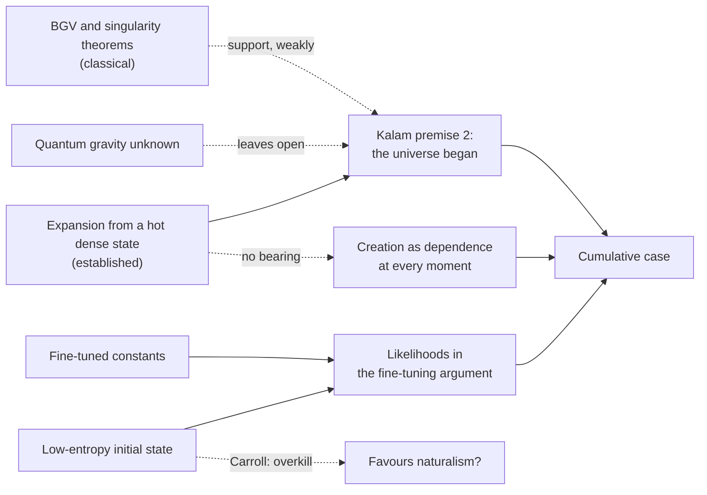

# Apologetics I · Lesson 4.3: Cosmology: what a beginning would and would not show

> ⏱ ~15 min · Module 4: Science and faith · Builds on: [4.1 The conflict thesis, tested in both directions](04-01-the-conflict-thesis-tested-in-both-directions.md), [`philosophy-of-religion` 2.5](../../philosophy-of-religion/lessons/02-05-cosmological-arguments-the-kalam.md), [`thomistic-synthesis` 5.1](../../thomistic-synthesis/lessons/05-01-creation-and-conservation.md) · Unlocks: [4.4 Divine action, miracles, and quantum indeterminacy](04-04-divine-action-miracles-and-quantum-indeterminacy.md)

## Why this matters

Cosmology is where popular apologetics most often overclaims, and where popular atheism most often overclaims back. "The Big Bang is the moment of creation" and "physics has shown the universe needs no creator" are both heard every week. This lesson sorts out what cosmology can carry in an argued case, at what strength, and what it cannot touch at all. The answer is less than either side wants, and it is not nothing.

## The idea

Start with what the standard model actually says. The observable universe has expanded and cooled for about 13.8 billion years from a hot, dense state ([`cosmology` 1.5](../../cosmology/lessons/01-05-cosmic-energy-budget-lambda-cdm.md), [2.1](../../cosmology/lessons/02-01-hot-big-bang-thermal-equilibrium.md)). Very probably it passed through an early inflationary epoch ([4.2](../../cosmology/lessons/04-02-inflationary-mechanism.md)), and its expansion now accelerates ([4.4](../../cosmology/lessons/04-04-dark-energy-cosmic-acceleration.md)). What the model does *not* contain is an observed event at $t = 0$. Run classical general relativity backward and the equations give a singularity, but before that point they leave the regime in which anyone trusts them. "Hot dense state" is established. "First moment" is an extrapolation through unknown physics.

Now three different claims an apologist might want cosmology to support, which are constantly run together:

1. **[Creation](../reference.md#creatio-ex-nihilo)**, in the Catholic sense: everything other than God has its whole being from God, at every moment. This is a relation of dependence, not an event at the start ([`thomistic-synthesis` 5.1](../../thomistic-synthesis/lessons/05-01-creation-and-conservation.md), which owns the analysis).
2. **The [kalam](../reference.md#kalam)**: whatever begins has a cause, the universe began, so it has a cause. Its second premise is a claim about the past, so physics bears on it ([`philosophy-of-religion` 2.5](../../philosophy-of-religion/lessons/02-05-cosmological-arguments-the-kalam.md), which owns its assessment).
3. **[Fine-tuning](../reference.md#fine-tuning)**: the constants, and the initial state, fall in ranges that are improbable without design ([`philosophy-of-religion` 3.1–3.2](../../philosophy-of-religion/lessons/03-02-fine-tuning-the-objections.md)). Physics bears on the likelihoods.

Physics touches 2 and 3. It does not touch 1. An infinite past would leave a world whose every moment is wholly dependent; a first moment would be a boundary of the physical description, not the giving of being. So "science has proved creation" and "science has disproved God" are the **same species of error**: each reads a claim about dependence as a claim about an edge.

One fence. The Church also teaches, at the top rung, that God created *from the beginning of time* (Lateran IV, 1215, ch. 1; *Dei Filius*, 1870, ch. 1 — rung 1, as thomistic-synthesis 5.1 marks it on the [ladder](../reference.md#levels-of-authority) of [`fundamental-theology` 4.4](../../fundamental-theology/lessons/04-04-the-ladder-of-doctrinal-authority.md)). But Aquinas holds that this is known by revelation, not physics:

> "By faith alone do we hold, and by no demonstration can it be proved, that the world did not always exist." (ST I q.46 a.2, English Dominican Province)

That thesis is his, not the Church's: rung 5, freely disputed (Bonaventure denied it).

## The other side

The strongest current statement is the physicist Sean Carroll's, in "Does the Universe Need God?" (*The Blackwell Companion to Science and Christianity*, 2012) and his 2014 debate with William Lane Craig. Paraphrased, it has four parts.

*First*, the Big Bang marks the edge of our understanding, not necessarily the edge of the universe. Models with no beginning (bouncing, cyclic, eternally inflating with a quiet past) are live research programmes, and no one yet has the quantum gravity to decide among them. The Borde–Guth–Vilenkin theorem is a classical result about expanding spacetimes; its authors conclude only that inflation needs other physics at its past boundary.

*Second*, even a first moment would not need a cause. "Cause" is a useful notion for sequences inside a lawful universe; fundamental physics deals in states and laws. A universe with a boundary in time could be a complete, self-contained system, and asking what "caused" it imports an everyday notion where it has no application. The right question is whether a consistent physical model exists, not what lies outside it.

*Third*, theism is too elastic to predict anything. A God who can do anything could make life under any laws, so "God" fixes no likelihood, while the multiverse and future physics at least promise explanations ([PoR 3.2](../../philosophy-of-religion/lessons/03-02-fine-tuning-the-objections.md), O1, O4, O5).

*Fourth*, the **[low-entropy objection](../reference.md#the-low-entropy-objection)**, which runs the other way. The early universe was in an extraordinarily low-entropy state; that boundary condition is the source of the arrow of time ([`stat-mech` 6.2](../../stat-mech/lessons/06-02-entropy-information-arrow.md)). Penrose, in *The Emperor's New Mind* (1989), estimated its improbability at about one in $10^{10^{123}}$. Carroll's point is that this is far *more* order than life needs: one galaxy in a sea of equilibrium would serve observers. A God aiming at life would have no evident reason for such excess, whereas an indifferent cosmos predicts it no worse. So the most extreme fine-tuning in physics is, he argues, evidence for naturalism over theism. Carroll also treats [Boltzmann brains](../reference.md#boltzmann-brains), observers fluctuating out of equilibrium, as a constraint on cosmology: a theory in which most observers are such fluctuations is "cognitively unstable", since it cannot be both true and justifiably believed ("Why Boltzmann Brains Are Bad", arXiv 2017). The low-entropy past is a clue for physics to explain, not a gap for theology to fill ([`philosophy-of-physics`](../../philosophy-of-physics/syllabus.md) 5.5).

## The argument

1. **P1.** Creation is total dependence of finite being on God at every moment, whether or not time had a first moment. *(Thomistic-synthesis 5.1; the analysis is theology, the doctrine *creatio ex nihilo* rung 1.)*
2. **P2.** A physical theory describes states and their lawful relations, including any boundary; it does not by itself say whether the whole lawful system exists of itself.
3. **∴ C1.** No cosmological result, first moment or infinite past, confirms or refutes creation. *In words:* the physics is the wrong kind of evidence for the doctrine, in both directions.
4. **P3.** The kalam's second premise is an empirical-and-philosophical claim about the past, and cosmology can raise or lower its probability without settling it.
5. **P4.** Fine-tuning, of constants and of the initial state, is evidence in odds form, bearing on likelihoods.
6. **∴ C2.** Cosmology enters a [cumulative case](../reference.md#cumulative-case) at the kalam and fine-tuning strands, as evidence of uncertain strength; the case's foundation should be an argument that does not need a beginning (the per se regress or contingency arguments of [PoR 2.3](../../philosophy-of-religion/lessons/02-03-cosmological-arguments-the-per-se-regress.md) and [2.4](../../philosophy-of-religion/lessons/02-04-cosmological-arguments-sufficient-reason.md)), with a beginning as a bonus if physics supplies one.

**Concession.** The kalam's scientific premise is weaker than popular apologetics says. The Hawking–Penrose singularity theorems assume classical general relativity and energy conditions; the BGV theorem drops the energy conditions but stays classical, and its conclusion is a past boundary of the inflating region, not "the universe came from nothing". Carroll's first point is simply correct: whether there was an absolute beginning is open, and an apologist who presents it as settled is misreporting the science.

C1 also costs the apologist something. If an infinite past would not refute creation, a first moment cannot confirm it. The Catholic gives up the most rhetorically useful line in popular apologetics, on principle.

**Where the argument is weakest.** C2 moves the fight rather than winning it. Carroll's second point, that a complete self-contained system needs no external cause, is exactly the brute-fact position Oppy defends against the contingency argument ([2.2](02-02-answering-the-atheist-philosophers.md); [`metaphysics` 3.3](../../metaphysics/lessons/03-03-brute-facts-and-necessary-existence.md)). Cosmology cannot decide whether existence needs explaining; only the metaphysics can, and there the case is as strong as its principle of sufficient reason.

## The map

The dashed edge at the bottom is the lesson. Every cosmological finding lands on the kalam or the likelihoods; none lands on creation.

## Worked examples

**Ex 1 (clean): an invented bounce.** Suppose a quantum-gravity theory in 2045 predicts a contracting phase before the hot dense state and an infinite past, and its predictions are confirmed. What falls? The kalam's scientific support for premise 2 (its philosophical arguments against an actual infinite remain, for what they are worth). What stands? Creation as dependence: every moment of the bounce is held in being. The per se and contingency arguments, which never needed a beginning. Fine-tuning, since the bounce has its own parameters and its own entropy budget. The cumulative case loses one strand; the doctrine loses nothing.

**Ex 2 (hard): the same bounce, against the rung-1 claim.** Now the strain. Lateran IV and *Dei Filius* teach that God created *from the beginning of time*. Would a confirmed infinite past contradict a defined doctrine? The Catholic has three moves, and should state their price. (i) A physical model is not a demonstration: Aquinas's thesis is that neither a beginning nor its absence can be demonstrated, and a confirmed model is still a model of what we can observe, with what came "before" inferred through theory. (ii) *Dei Filius* ch. 4 holds that faith and reason cannot truly conflict ([`fundamental-theology` 2.3](../../fundamental-theology/lessons/02-03-fideism-and-rationalism.md)), so the Catholic is committed to predicting that no *demonstration* of an infinite past will come. (iii) Whether "time" in the definition must be the cosmic time of a given physical model is a question theologians would have to answer. Move (ii) is honest and it is risky: it puts a doctrine where a physics result could press on it. That is what it means for faith to make claims about the world.

## Watch out

- **You might think the Big Bang is the moment of creation, but** creation is not an event at all, and the Big Bang is a hot dense state whose own beginning, if any, is unknown. Pius XII's 1951 address to the Pontifical Academy said more than this; it was an address, which defines nothing, and [4.1](04-01-the-conflict-thesis-tested-in-both-directions.md) weighs it.
- **You might think "the beginning cannot be demonstrated" is Church teaching, but** it is Aquinas's thesis, rung 5. What is rung 1 is the beginning itself, held by faith. Promoting the first or demoting the second is an exegetical error.
- **You might think the multiverse refutes creation, but** it attacks one likelihood in the fine-tuning argument. A multiverse is as dependent as a universe, and its generating mechanism has parameters of its own.

## One-liner

> Cosmology can strengthen or weaken the kalam and the fine-tuning strands, but a beginning would not prove creation and an eternal past would not refute it, because creation is about every moment, not the first one.

## Problems

**P1 (🟢) *(Exegetical, diagnose.)*** An invented op-ed:

> "Catholics should be nervous about the new cyclic cosmologies. Their doctrine is *creatio ex nihilo*, creation out of nothing, and that simply means the universe had a first moment. If physicists confirm an eternal cycle of universes, the doctrine of creation is refuted, and the Church will have to retreat as it did over Galileo."

Name what the writer gets wrong about *creatio ex nihilo*, and what the writer gets right about what a confirmed eternal past would press on, with the level of each claim. 120 words or fewer.

**P2 (🟡) *(Apologetic: (a) Exegetical, graded first · (b) reply.)*** (a) State Sean Carroll's low-entropy objection as he states it: the fact, what makes it fine-tuning, and why he takes it to favour naturalism over theism. Three sentences. (b) Reply in 150 words or fewer, opening with a named concession.

**P3 (🔴, optional) *(Evaluative, find the crux.)*** A Thomist says the universe needs God at every moment; Carroll says a complete, self-contained physical model needs nothing outside it. Name the single premise on which they disagree, say why no cosmological observation can decide it, and say where the dispute is properly fought. Any verdict. 100 words or fewer.

Solutions

**P1** *(Exegetical, diagnose)*

**Must hit, strict:**

- **Wrong:** *creatio ex nihilo* does not "simply mean" a first moment. It is total dependence of all finite being on God at every moment (thomistic-synthesis 5.1; ST I q.45 a.2 ad 2, creation is not a change). A beginningless world would still be wholly created; Aquinas holds that its impossibility cannot be demonstrated (q.46 a.1–a.2), and *De aeternitate mundi* argues that an eternal created world involves no contradiction. The doctrine that God created from nothing is rung 1; the analysis as dependence is theology.
- **Right, in part:** the Church does teach a temporal beginning, "from the beginning of time" (Lateran IV ch. 1; *Dei Filius* ch. 1), at rung 1. So a confirmed eternal past would press on *that* claim, not on creation as such. Credit for adding that a model is not a demonstration (q.46 a.2, a rung-5 thesis).

**Wrong turns:** saying the cyclic model is irrelevant to every Catholic claim (it bears on the temporal one); calling the temporal beginning merely Aquinas's opinion (it is the indemonstrability that is his); promoting "cannot be demonstrated" to Church teaching.

**Model answer:** The writer collapses creation into a first moment. *Creatio ex nihilo* (rung 1) asserts that everything has its whole being from God at every moment; Aquinas held that a beginningless created world cannot be shown impossible, so an eternal cycle would leave creation untouched. What the writer half-sees is that the Church also teaches, at rung 1 (Lateran IV, *Dei Filius* ch. 1), that the world began in time. A confirmed eternal past would press on that claim. The Catholic reply is Aquinas's: the beginning is held by faith and neither proved nor disproved by demonstration (rung 5), and a cosmological model is not a demonstration.

---

**P2** *(Apologetic: (a) Exegetical, graded first · (b) reply)*

**Must hit, strict (a), graded first:**

- The fact: the early universe was in a state of extraordinarily low entropy (Penrose's estimate is about one in $10^{10^{123}}$), the boundary condition behind the arrow of time.
- Why it counts as fine-tuning *beyond* need: far less order would have sufficed for observers (one galaxy, not a whole low-entropy cosmos).
- Why it favours naturalism: a God aiming at life has no evident reason for that excess, so the probability of this much order is no higher on theism than on an indifferent universe, and arguably lower; the low-entropy past is a problem for physics to explain, not a gap for God.

**Must hit (b):**

- A **named concession**: the overkill is real. If theism is "design aimed at observers", this much order is not what it predicts, and the theist cannot cite the low-entropy past as evidence for design without addressing that.
- A move on what theism predicts: God's purposes are not only "some observers". ST I q.47 a.1: God makes many and diverse creatures so that the universe as a whole represents his goodness better than any one creature. A vast, ordered, intelligible cosmos is not obviously surprising on that view. Credit for Collins's discoverability as a parallel.
- A parity move: the overkill bites the naturalist's selection explanation too. A fluctuation-and-selection story predicts the *minimum* order needed for observers, and Boltzmann brains, which Carroll himself rejects. So the excess counts against selection-based naturalism as much as against minimal-design theism.
- An honest cost: appealing to purposes we only partly know invites the inscrutability charge (PoR 3.2, O4).

**Wrong turns:** stating (a) as "the universe is too big for God to care about us" (that is a different, older argument); stating (a) as if Carroll denied that the low entropy is improbable (he affirms it); replying that the low entropy proves design.

**Model answer (b), one of several:** Concession: if theism means design aimed only at producing observers, this much order is overkill, and I cannot cite the low-entropy past as evidence for that hypothesis. But that is not the Catholic hypothesis. Aquinas holds that God makes many and diverse things so that the whole universe represents his goodness better than any single creature (ST I q.47 a.1), and a vast, ordered, intelligible cosmos fits that at least as well as one galaxy does. And the overkill cuts both ways: a selection explanation predicts the least order observers need, which is why fluctuation cosmologies predict Boltzmann brains, which Carroll rejects. The excess favours a lawlike or chosen boundary condition over a fluctuation. My cost: an appeal to purposes we only partly know is exposed to the inscrutability charge.

---

**P3** *(Evaluative, find the crux)*

**Accept:** any formulation of the crux as whether the existence of the lawful whole calls for an explanation outside it.

**Must hit, any verdict:**

- The crux: whether a contingent whole, a lawful universe that need not have existed, requires a cause or reason of its being; the Thomist affirms, Carroll treats the whole as a brute fact.
- Why no observation decides it: any observation is of states and laws inside the system; both sides accept every such observation, and the disagreement is over whether the system's existence needs explaining at all.
- Where it is fought: the principle of sufficient reason and the contingency or per se arguments (PoR 2.3–2.4; metaphysics 3.3 on brute facts), the ground of Oppy's parity strategy (2.2).

**Wrong turns:** locating the crux in whether the universe began (that is the kalam's question); saying science shows causation is not fundamental and so the Thomist loses (that addresses physical causation, not the cause of being).

**Model answer, one of several:** The crux is whether the existence of a contingent lawful whole needs an explanation outside it. The Thomist says it does, at every moment; Carroll says the whole can be a brute fact. No observation decides it, because every observation is of states and laws within the whole, which both accept. The dispute belongs to the principle of sufficient reason and the contingency argument, where Oppy's brute-fact parity is the strongest opposing position.

## Flashback

**From Lesson [4.1](04-01-the-conflict-thesis-tested-in-both-directions.md) (The conflict thesis, tested in both directions):** *(Exegetical: sort new cases · Evaluative.)* Three invented remarks from three unrelated invented speakers (nobody said them; they are built for the problem):

> (i) A catechist: "Genesis 1 says God made the world in six days, so Catholic doctrine requires a world a few thousand years old, and any geology that says otherwise is opposed to revelation."
>
> (ii) A podcaster: "Evolutionary biology has shown that all altruism is disguised genetic self-interest, so science has refuted the Christian teaching that charity is a real virtue."
>
> (iii) A Catholic blogger: "Physicists have now proved that the image on the Shroud of Turin could only have been made by the Resurrection, so the faith has been confirmed by science."

(a) Using *Dei Filius* ch. 4's diagnosis of apparent conflict, put each remark in one of its two bins and say what the speaker mistook for what. One sentence each. (b) Any verdict: what can Coyne's position (4.1) grant about this sorting while keeping its objection, and which remark repeats the structure of 1616? Two sentences.

Solution

**Must hit, strict (a):**

- **(i), the first bin (dogma misunderstood):** a reading of Scripture, the six days as a literal chronology, taken for doctrine. No definition fixes the age of the world, and canon 2 reaches only assertions opposed to *revelation*, not to a reading of it.
- **(ii), the second bin (opinion taken for a conclusion of reason):** a philosophical gloss, that an evolutionary explanation of a behaviour shows it is "nothing but" self-interest, presented as a finding of biology. It is the secular direction of the error, Draper's kind.
- **(iii), the second bin again, in the apologetic direction:** a contested hypothesis presented as proved, and the faith presented as resting on it. It is the 1951 overclaim in miniature. No Church act defines the Shroud's authenticity, and the resurrection is held on revelation, with signs as motives of credibility.

**Must hit, any verdict (b):**

- Coyne can grant every classification and still say the sorting is done afterwards and by the Church: canon 2 leaves the Church the judge of what is opposed to revelation, and nothing in the two bins stops the judge from putting a truth in the wrong one. That is 4.1's "where the argument is weakest".
- **(i)** repeats 1616: a reading of Scripture treated as revelation and used to declare a scientific result contrary to the faith.

**Wrong turns:** putting (iii) in the first bin (no dogma is misread; a scientific claim is overstated); saying (ii) is wrong because evolution is false, which makes the same error in reverse; saying canon 2 obliges Catholics to reject geology that contradicts (i), which widens the canon exactly as 4.1's op-ed did; calling (iii) harmless because it favours the faith, which is the one-directional correction 4.1 forbids.

**Model answer, one of several:** (a) (i) is a dogma misunderstood: the catechist takes a literal reading of Genesis for revelation, though no definition fixes the world's age. (ii) is an unsound opinion taken for science: "nothing but self-interest" is a philosophical gloss on an evolutionary explanation, not a result of it. (iii) is the same error in the believer's favour: a contested claim about the Shroud is called proved, and the faith is made to lean on it. (b) Coyne can accept all three verdicts and still say the Church remains judge of which bin a new case goes in, so the diagnosis comes only after the damage. The catechist is 1616 again, since his reading of Scripture would declare a true science opposed to revelation.

## Connections

- **Backward:** [4.1](04-01-the-conflict-thesis-tested-in-both-directions.md) tested the conflict thesis both ways; this lesson does the same on cosmology. Creation as dependence is [`thomistic-synthesis` 5.1](../../thomistic-synthesis/lessons/05-01-creation-and-conservation.md); the kalam's skeleton and BGV are [`philosophy-of-religion` 2.5](../../philosophy-of-religion/lessons/02-05-cosmological-arguments-the-kalam.md); fine-tuning's odds form is PoR [3.1](../../philosophy-of-religion/lessons/03-01-from-design-to-fine-tuning.md)–[3.2](../../philosophy-of-religion/lessons/03-02-fine-tuning-the-objections.md).
- **Forward:** [4.4](04-04-divine-action-miracles-and-quantum-indeterminacy.md) asks how God acts *within* the lawful system this lesson says he holds in being; the answer leans on the same refusal to make God a cause among causes. The cumulative case these strands feed is [2.1](02-01-assembling-the-case.md).
- **Sideways:** the low-entropy past and Boltzmann brains are [`philosophy-of-physics`](../../philosophy-of-physics/syllabus.md) 5.4–5.5's subject, with the statistical arrow in [`stat-mech` 6.2](../../stat-mech/lessons/06-02-entropy-information-arrow.md); observation selection is the same reasoning as PoR 3.2's firing squad.
