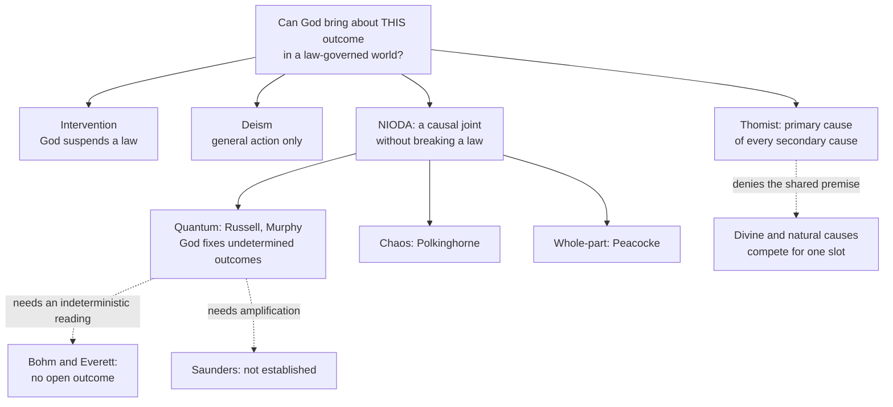

# Apologetics I · Lesson 4.4: Divine action, miracles, and quantum indeterminacy

> ⏱ ~15 min · Module 4: Science and faith · Builds on: [4.2 Evolution, design, and the human person](04-02-evolution-design-and-the-human-person.md), [`thomistic-synthesis` 5.2](../../thomistic-synthesis/lessons/05-02-providence-and-secondary-causes.md) · Unlocks: [5.1 Can history establish a miracle?](05-01-can-history-establish-a-miracle.md)

## Why this matters

Christianity does not claim only that God made the world. It claims that he acts in it: answers prayer, guides history, raised Jesus from the dead. The modern objection is not that such action is unlikely but that it has nowhere to go. Physics describes a world closed under its own laws, so a God who acts must either break them or do nothing. In the late twentieth century a serious research programme tried to find a third option inside quantum indeterminacy. This lesson states that programme as its authors state it, gives the objections that have worn it down, and argues that the Catholic tradition already had a different third option, one that never needed a gap.

## The idea

Three distinctions do the work.

**[General and special divine action](../reference.md#general-and-special-divine-action).** *General* divine action is God creating, conserving and governing everything at once, the rain on the just and the unjust. *Special* divine action is God bringing about *this* outcome for *this* purpose: the answered prayer, the call of Abraham, the Resurrection. The modern debate is almost entirely about special action, because deism grants the general kind.

**[Primary and secondary causation](../reference.md#primary-and-secondary-causation).** Reloaded from [`thomistic-synthesis` 5.2](../../thomistic-synthesis/lessons/05-02-providence-and-secondary-causes.md): God is not one cause among the causes in the world but the cause of their being causes. One effect is wholly from God and wholly from the creature, at different levels; Aquinas's rule is that one action cannot come from two agents *of the same order*, but nothing stops it coming from a primary and a secondary agent (ST I q.105 a.5 ad 2). In words: God and the creature are not competing for the same slot.

**[A miracle on the Catholic account](../reference.md#miracle-on-the-catholic-account).** Aquinas says God can act outside the order he gave secondary causes:

> "…by producing the effects of secondary causes without them, or by producing certain effects to which secondary causes do not extend." (ST I q.105 a.6, English Dominican Province)

A miracle is what God does outside the causes we know, its cause hidden from everyone (a.7). It is outside the created order, not against nature, since that order is God's gift to begin with; [`thomistic-synthesis` 5.2](../../thomistic-synthesis/lessons/05-02-providence-and-secondary-causes.md) works through a.6 ad 1 and a.7. Miracles serve as signs: *Dei Filius* ch. 3 and its canons define that miracles are possible and *can* rightly prove the divine origin of the Christian religion. That is rung 1, but it is a claim about what is possible, and it endorses no particular argument ([`fundamental-theology` 2.2](../../fundamental-theology/lessons/02-02-credibility-and-the-preambles-of-faith.md)). Whether testimony could ever establish one is [5.1](05-01-can-history-establish-a-miracle.md)'s question, with Hume's machinery already in [`philosophy-of-religion` 3.5](../../philosophy-of-religion/lessons/03-05-miracles.md).

## The other side

**The naturalist's dilemma.** Physics, the naturalist argues, is [causally closed](../reference.md#causal-closure): every physical event that has a cause has a sufficient physical cause ([`philosophy-of-mind`](../../philosophy-of-mind/syllabus.md) 1.2). So a God who brings about a physical outcome either adds a cause the physics leaves no room for, which is intervention and violates the laws as we have every reason to believe them, or adds nothing, so that "God acted" is just a pious description of what nature did anyway. Intervention makes God an intruder in his own world; non-intervention makes him idle. Theism of the active kind is out either way.

**The answer that accepts the dilemma's premise: [NIODA](../reference.md#niod).** The Vatican Observatory and the Center for Theology and the Natural Sciences (CTNS, Berkeley) ran a series of conferences, published as *Scientific Perspectives on Divine Action* (five volumes, 1993–2001). Many contributors agreed with the naturalist that intervention is theologically unacceptable and with the theist that deism is too. They looked for **non-interventionist objective divine action**: action that is *objective* (God really makes a difference, not just in how we interpret events), *special* (this outcome, not the whole), and *non-interventionist* (no law is suspended). The search was for the "causal joint," the place where God's act meets nature.

Robert John Russell's proposal is the most developed. If quantum mechanics is read with **ontological indeterminism** (Russell's own phrase for his assumption), the laws give only probabilities, and nature by itself does not fix which outcome occurs. God can then fix it without breaking anything, because no law says otherwise. Russell holds that God acts in *all* quantum events, though only in some do the effects matter in the classical world. His central case is evolution: a point mutation can begin from a single quantum event, so genetic variation becomes a channel of providence instead of an argument against it (*Evolutionary and Molecular Biology*, 1998; *Quantum Mechanics*, 2001, both in the series). Russell also says plainly that this locates divine action without explaining *how* God acts. Nancey Murphy's version, in *Chaos and Complexity* (1995), is more thorough. Created causal powers are incomplete without God's participation, and God is involved in every basic event, cooperating with natural tendencies instead of overruling them. Not everyone in the series took the quantum route. John Polkinghorne looked to chaotic systems, and Arthur Peacocke favoured whole-part ("top-down") influence of God on the world as a whole. Where the quantum route needs macroscopic effects, it appeals to amplification, whether by biology (the mutation) or by chaotic dynamics ([`philosophy-of-physics`](../../philosophy-of-physics/syllabus.md) 5.2).

## The argument

The objections to the quantum proposals come first. Then comes the Thomist case that the project was never needed.

1. **The proposals need one interpretation of quantum mechanics.** Under textbook collapse, or a GRW-type stochastic collapse, outcomes really are undetermined. Under Bohmian mechanics the dynamics are deterministic and only the initial positions are open. Under Everett every outcome occurs and nothing gets selected ([`quantum-mechanics` 1.5](../../quantum-mechanics/lessons/01-05-measurement-expectation-values.md); [`philosophy-of-physics`](../../philosophy-of-physics/syllabus.md) 1.1–1.3, 2.1–2.3). *In words:* the [causal joint](../reference.md#causal-joint) exists on some readings of the physics and disappears on others, which are empirically equivalent.
2. **Even where there is a joint, it is cramped.** Nicholas Saunders (*Divine Action and Modern Science*, 2002) sorts the options. God might add new possibilities, alter the probabilities, act as the "measurer" who brings about collapse, or pick outcomes while ignoring the probabilities. He argues that none of these yields a coherent quantum account of special divine action on current understandings of the theory. Changing the probabilities is changing the law. And if God picks outcomes inside the statistics, his choices are hemmed in by those statistics over many trials and mostly wash out at large scales, so they only matter where amplification is established, and Saunders presses that weakness against the chaos route too.
3. **The project assumes God's act competes with natural causes for an open slot.** A "causal joint" is a place where a finite cause leaves an effect undetermined so that another cause can determine it. That is a description of two causes *of the same order*.
4. **On the Thomist account, God is not a cause of that order** (premise reloaded from [`thomistic-synthesis` 5.2](../../thomistic-synthesis/lessons/05-02-providence-and-secondary-causes.md)). He causes deterministic and indeterministic processes alike, wholly, as their primary cause. Contingency is something he wills, not a gap he exploits (ST I q.19 a.8).
5. **∴ Special divine action needs no indeterminacy, and miracles need no disguise.** God can bring about this outcome for this purpose *through* secondary causes, deterministic or not. Where he acts outside their order, as in a miracle, the action is not a violation of nature but the very act that gives nature its order (q.105 a.6). *In words:* the naturalist's dilemma assumes divine action must fit inside the physics or break it; the Thomist denies that God's acting is ever on the physical level at all.

William Carroll has argued this in many essays on Aquinas and the sciences: looking for a gap misunderstands what "Creator" means and turns God into a [god of the gaps](../reference.md#god-of-the-gaps) at the quantum scale. Ignacio Silva, Carroll's doctoral student, presses the critique against Russell directly, as have Michael Dodds and William Stoeger: quantum divine action makes God's causality one more kind of natural causality. Silva then builds the positive account on Aquinas's view that nature is genuinely contingent.

**Concession.** This is speculative theology, and the Church has decided nothing about it. NIODA, the Thomist alternative, and the choice between them are all **freely disputed**, rung 5 on the [levels of authority](../reference.md#levels-of-authority). Only the frame is taught: that God governs all things by providence (*Dei Filius* ch. 1, rung 1) and that miracles are possible and can serve as signs (ch. 3, rung 1). That creatures are true causes is the constant teaching of theologians, below the seam. The Thomist account of *how* primary causality works is a school thesis. Russell, Murphy and their colleagues are serious theologians answering a real question, and nothing in the faith rides on their being wrong.

**Where the argument is weakest.** Premise 4 replaces a "how" with a "that." Asked *how* God brings about this outcome rather than another through a deterministic process, the Thomist says the question presumes a mechanism, and mechanisms belong to secondary causes. NIODA's defenders call this a refusal to answer, and it does leave special action physically invisible. Premise 4 also rests on analogical predication of "cause" ([`thomistic-synthesis` 4.4](../../thomistic-synthesis/lessons/04-04-analogy.md)), which univocalists deny.

## Map of positions

## Worked examples

**Example 1: Rain after a drought.** An invented farming village prays for rain, and rain comes from a weather system forecast a week earlier. The naturalist says the forecast explains it, so God did nothing. A NIODA theologian looks for quantum events whose outcomes, amplified chaotically, fixed the weather, and must hope the amplification is real. The Thomist needs neither. The weather system is wholly the secondary cause of the rain, and God is wholly its primary cause. The rain's being an answer lies in providence, the ordering of this event to these people's good from eternity, not in any physical gap. The example is clean because nothing physical is in dispute.

**Example 2: A resurrection.** Now try the event Module 5 is about. A non-interventionist scheme cannot handle it. No quantum fluctuation within the statistics turns a corpse into a living, transformed body with any probability worth the name, so NIODA as such must treat the Resurrection as a different kind of act. The Thomist has a category for it: an effect "to which secondary causes do not extend" (q.105 a.6), a miracle in the strict sense. The strain is that the Thomist must then accept, without embarrassment, exactly what the NIODA project was built to avoid: God producing an effect nature would not have produced. He accepts it by denying that this is an intrusion, since the order of nature is God's to begin with. The naturalist will say that only the label has changed. Whether the event happened is a historical question, and it is [5.1](05-01-can-history-establish-a-miracle.md)'s.

## Watch out

- **You might think quantum mechanics has shown that God can act, but actually** it has shown nothing of the kind. The NIODA proposals depend on one family of interpretations and are freely disputed, rung 5. Presenting them as Church teaching, or as "what science now allows," overstates the level twice over.
- **You might think the Thomist denies miracles because God acts "through nature," but actually** q.105 a.6 explicitly allows effects outside the order of secondary causes. What the Thomist denies is that ordinary special providence *needs* a gap.
- **You might think NIODA is a god-of-the-gaps argument for God's existence, but actually** none of its authors argue *from* indeterminacy *to* God. They assume theism and ask where God acts. The Thomist charge is that the gap shapes their picture of God, not that they use it as evidence.

## One-liner

> The quantum proposals find God a slot inside nature; the Thomist answers that God was never competing for one, and neither answer has been decided by the Church.

## Problems

**P1 (🟢) *(Exegetical, strict.)*** Russell's proposal needs outcomes that the laws of nature leave genuinely undetermined. For each reading, say in one sentence whether it supplies such outcomes, and why: (i) the textbook collapse postulate read realistically; (ii) GRW spontaneous collapse; (iii) Bohmian mechanics; (iv) Everett's many-worlds. Then (v) name, in one phrase, what Russell says he is assuming.

**P2 (🟡) *(Apologetic: (a) Exegetical, graded first · (b) reply.)*** (a) State Robert John Russell's quantum divine action proposal as he states it: what "non-interventionist objective" means, where God acts, his main domain of application, and what he says the proposal does not explain. (b) Reply to it, either as Saunders would or as a Thomist would. **Open (b) with a named concession** to Russell. 150 words or fewer for (a) and (b) together.

**P3 (🔴) *(Diagnose.)*** An invented parish bulletin note (nobody wrote this; it is built for the problem):

> "For three centuries science told us the universe was a clockwork in which God had no room to move. Then Heisenberg discovered that nature is not fully determined, and the Church breathed again: now we know where God works. Every answered prayer happens in the tiny openings quantum physics has found, and the Vatican's own observatory has confirmed it."

Name three distinct mistakes, quoting the words that carry each, and correct each from this lesson in one sentence. 150 words or fewer.

Solutions

**P1** *(Exegetical, strict.)*

**Must hit, strict:**

- (i) **Yes.** Collapse is stochastic and the theory fixes only the Born probabilities, so the outcome is genuinely undetermined.
- (ii) **Yes.** The collapse dynamics are fundamentally stochastic: when and where a hit occurs is chancy. It is the clearest case, since the indeterminism is written into the equations and is not a postulate about measurement.
- (iii) **No.** The dynamics are deterministic: given the wavefunction and the initial particle positions, the guidance equation fixes every outcome. The apparent randomness is ignorance of the initial positions.
- (iv) **No.** Unitary evolution is deterministic, and every outcome occurs on some branch, so there is nothing to select.
- (v) **Ontological indeterminism**, meaning the probabilities reflect indeterminacy in nature and not our ignorance.

**Wrong turns:** saying Bohm "leaves room" because God set the initial positions. That is creation, not ongoing special action, and it is exactly the general-action option NIODA wanted to go beyond. Saying God chooses "our" branch in Everett: that is a self-location claim, not a physical outcome fixed by God. Treating "Copenhagen" as one view that obviously asserts ontic indeterminism: Bohr's own view is disputed in this respect, which is why (i) says "read realistically."

---

**P2** *(Apologetic: (a) Exegetical, graded first · (b) reply.)*

**Accept:** a reply from either the Saunders line or the Thomist line, and a (b) that concludes Russell's proposal survives also passes, if it engages the named objection.

**Must hit, strict (a), graded first:**

- *Objective*: God really makes a difference to what happens, not just to how we read events. *Non-interventionist*: no law of nature is suspended or broken. *Special*: God brings about particular outcomes.
- The interpretation is **ontological indeterminism**: the laws give only probabilities, nature alone does not fix the outcome, and so God can fix it without violating any law.
- God acts in **all** quantum events, though only in some do the effects matter macroscopically.
- The main domain is **evolution through genetic mutation**, which begins from a single quantum event.
- Russell says this **locates** divine action and does **not** explain *how* God acts.

**Must hit (b):**

- A named concession, stated without qualification first. For example: Russell is right that a merely interpretive "divine action" is not what Scripture claims; or he is right that the quantum laws, read indeterministically, really do leave outcomes unfixed; or he openly admits that he gives no mechanism.
- Then one real objection carried through. Either Saunders's: the dependence on an interpretation that is empirically equivalent to deterministic rivals, the dilemma between altering probabilities (intervention) and choosing within them (constrained, washing out), and amplification not established. Or the Thomist's: a causal joint makes God a cause of the same order as creatures, while God as primary cause acts through determinate and indeterminate causes alike.

**Wrong turns:** stating Russell as arguing *from* indeterminacy *to* God's existence; saying God "breaks" quantum laws; making Russell's proposal Church teaching, or calling the Thomist reply the Church's verdict (both rung 5); attributing whole-part causation to Russell (that is Peacocke).

**Model answer, one of several:** (a) Russell seeks divine action that is objective, since God really makes a difference, and non-interventionist, since no law is suspended. Read with ontological indeterminism, quantum laws fix only probabilities, so God can determine outcomes without breaking them. He holds that God acts in all quantum events, with some effects mattering macroscopically, above all through genetic mutation in evolution. He grants that this says where God acts, not how. (b) Concession: Russell is right that a God who only "acts" in our interpretation of events is not the God of Scripture. But the joint he finds is shaped like a natural cause, an open slot that a second cause of the same order fills. The Thomist's God is the cause of every slot, determinate or not, so special providence needed no gap.

---

**P3** *(Diagnose.)*

**Must hit, strict (any three):**

- **"no room to move" / "breathed again"**: assumes God's action competes with determinate causes, which is the deist and NIODA picture. On primary causation God causes deterministic processes wholly too, so classical physics never excluded providence.
- **"now we know where God works" / "tiny openings"**: a gap theology, and an interpretation-dependent one. Bohm and Everett leave no openings, so the claim would fall with an interpretive verdict.
- **"Every answered prayer happens in the tiny openings"**: overgeneralizes. Even NIODA's defenders do not claim this, and macroscopic effects need amplification that is not established. The Thomist places the answering in providence, not in microphysics.
- **"the Vatican's own observatory has confirmed it" / "the Church breathed again"**: overstates the level. The Vatican Observatory co-sponsored a research series and confirmed nothing. The question is freely disputed, rung 5, and no magisterial act touches it.

**Wrong turns:** "correcting" the note by denying that God answers prayer, or by denying that indeterminism exists. Both are outside what the lesson shows. Also naming a single mistake twice.

**Model answer:** "No room to move" assumes God's causality competes with determinate causes. As primary cause he acts wholly through deterministic processes too, so a clockwork never excluded providence. "Now we know where God works … tiny openings" is a gap theology tied to one interpretation, since on Bohm or Everett there are no openings. "The Vatican's own observatory has confirmed it" overstates the level twice: an observatory co-sponsoring a conference series is no magisterial act, and the question is freely disputed.

## Flashback

**From Lesson [4.2](04-02-evolution-design-and-the-human-person.md) (Evolution, design, and the human person):** *(Exegetical (a) · Exegetical: find the crux (b).)* An invented exchange (nobody said this; it is written for the problem):

> **Naturalist:** "The fitted complexity of living things was once the best evidence there was for God. Natural selection now explains it with no foresight at all, so the evidence is gone, and theism has lost its main support."
>
> **Thomist:** "I grant every step of your biology. You have refuted an argument we never relied on."

(a) State the naturalist's argument as the likelihood argument 4.2 made of it: the evidence, the two hypotheses compared, and what selection changed. **Two sentences.** (b) Name the one premise of 4.2's argument the naturalist must deny for his conclusion to reach the Thomist, give his best way of denying it, and say what the Thomist must then rest the case on. **Three sentences.**

Solution

**Must hit, strict (a):**

- The evidence is adapted complexity; the hypotheses are design and an unforesighted natural process.
- Before selection was on the table, adaptation was far more probable on design than on any known rival, so it favoured design (Paley was right to be impressed). Selection predicts adaptation about as well, so the likelihood ratio falls toward 1, the evidence no longer favours design, and theism loses the support it drew from it.

**Must hit, strict (b):**

- The crux is **P2**: God is the primary cause of every secondary cause's being and acting, not one more cause on their level. Grant it and P3 follows: a complete secondary-cause story competes with nothing.
- The naturalist's best denial: a primary cause that makes no empirical difference is **idle**, and P2 cannot be tested.
- The Thomist must then rest the case on the metaphysical arguments of [2.1](02-01-assembling-the-case.md), not on biology. The argument shows only that evolution cannot refute God; it gives no positive evidence for him.

**Wrong turns:** putting the crux in the biology, as if the Thomist must dispute that selection builds an eye (he granted it); answering with a gap or irreducible complexity, which is the design-inference move 4.2's P6 rejects; claiming the Thomist's reply supplies positive biological evidence for God.

**Model answer:** (a) The evidence is adapted complexity, and before 1859 it was far more probable on design than on any known rival, so it favoured design. Selection makes adaptation about as probable without foresight, so the ratio falls toward 1 and the evidence stops supporting theism. (b) The naturalist must deny P2, that God is the primary cause of all secondary causes rather than a rival on their level, since otherwise a complete biological story leaves the Thomist untouched. His best denial is that a primary cause making no empirical difference is idle and untestable. The Thomist must then rest everything on the metaphysical arguments of Module 2, conceding that biology neither refutes God nor gives evidence for him.

## Connections

- **Backward:** primary and secondary causation and q.19 a.8 on contingency come from [`thomistic-synthesis` 5.2](../../thomistic-synthesis/lessons/05-02-providence-and-secondary-causes.md); miracles as motives of credibility, and what *Dei Filius* ch. 3 defines, from [`fundamental-theology` 2.2](../../fundamental-theology/lessons/02-02-credibility-and-the-preambles-of-faith.md); the same "no gap needed" move against design inference is [4.2](04-02-evolution-design-and-the-human-person.md)'s.
- **Forward:** [5.1](05-01-can-history-establish-a-miracle.md) asks whether history could ever establish the kind of event Example 2 describes. Module 5 then argues that one did.
- **Sideways:** the interpretations are [`philosophy-of-physics`](../../philosophy-of-physics/syllabus.md) 1.1–2.4; the chaos-amplification proposal is its 5.2, which hands the theology here. The same move of putting freedom in quantum indeterminacy appears in libertarian free will ([`metaphysics`](../../metaphysics/syllabus.md) 6.4), and it draws the same objection: an undetermined outcome is not yet an *agent's* outcome.
