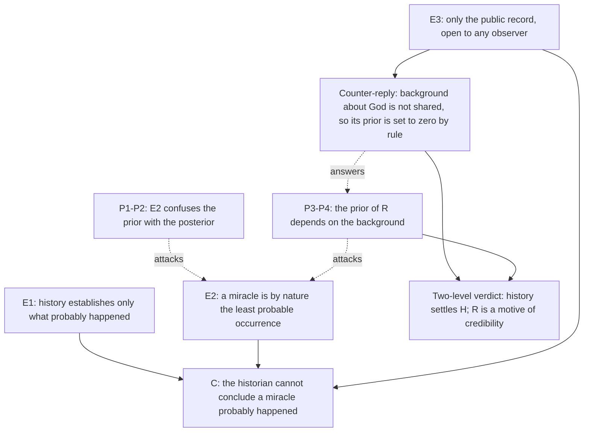

# Apologetics I · Lesson 5.1: Can history establish a miracle?

> ⏱ ~15 min · Module 5: Jesus and the resurrection as history · Builds on: [4.4 Divine action, miracles, and quantum indeterminacy](04-04-divine-action-miracles-and-quantum-indeterminacy.md), [`philosophy-of-religion` 3.5](../../philosophy-of-religion/lessons/03-05-miracles.md), [`fundamental-theology` 2.2](../../fundamental-theology/lessons/02-02-credibility-and-the-preambles-of-faith.md) · Unlocks: [5.2 The minimal-facts approach and its critics](05-02-the-minimal-facts-approach-and-its-critics.md)

## Why this matters

Module 5 builds a historical case for the resurrection. Before any evidence is weighed, one objection says that no evidence could ever settle it. The objection doesn't come from a philosopher who denies miracles. It comes from a historian who says his discipline has no way of concluding that one happened. If that is right, the next four lessons are a category mistake. So this lesson states the objection as its author states it, finds where the reply bites, and says what verdict history can honestly give.

## The idea

Separate two claims that the word "resurrection" fuses:

- **H (historical):** Jesus died by crucifixion; afterwards his followers had experiences they took to be seeing him alive; on some accounts his tomb was found empty.
- **R (theological):** God raised Jesus bodily from the dead.

H is the ordinary stuff of history: who said what, when, and what they believed. R is an *explanation* of H that names a divine agent. Every argument in this module is an argument from H to R. A [two-level verdict](../reference.md#two-level-verdict) keeps them apart. The historian can be asked to settle H. Whether anyone can get from H to R, and with what help, is this lesson's question.

Hume's arguments are assumed ([`philosophy-of-religion` 3.5](../../philosophy-of-religion/lessons/03-05-miracles.md)): Part I makes a miracle's prior tiny, Part II makes the witnesses weak, and independent witnesses can in principle beat any prior short of zero. The historian's objection is a different animal. It is not a claim about laws of nature. It is a claim about what a discipline can conclude.

## The other side

**Bart Ehrman's** [methodological objection](../reference.md#ehrmans-objection) is stated most crisply in his debate with William Lane Craig at the College of the Holy Cross (28 March 2006), and in the methodological excursus of his textbook *The New Testament: A Historical Introduction to the Early Christian Writings* (later editions). Paraphrased, in his order:

- **E1.** History can establish only what *probably* happened in the past. It deals in probabilities, never in proofs.
- **E2.** A miracle is, by its nature, the least probable of all occurrences. That is what makes it a miracle: it runs against everything that normally happens.
- **E3.** The historian has no access to supernatural forces. The only evidence is the public record, events any observer can see and interpret.
- **∴ C.** The historian, as historian, can never conclude that a miracle probably happened. To say so would be close to a contradiction, since it would call the least probable event the probable one.

*In words:* history ranks explanations by probability, and a miracle loses that ranking by definition.

Three features make this strong rather than glib. First, Ehrman does **not** claim miracles never happen. He claims only that the historian's tools can't show it, so a believer may hold R on other grounds. Second, he grants a great deal of H. In *How Jesus Became God* (2014) he accepts that some disciples had visions and sincerely believed Jesus had been raised. As a historian he declines to say whether God raised him, because that is a theological question. (He doubts the honourable burial and the tomb stories, as [`new-testament` 3.4](../../new-testament/lessons/03-04-the-passion-and-resurrection-narratives.md) reports. That dispute is 5.3's.) Third, E3 is just [methodological naturalism](../reference.md#methodological-and-metaphysical-naturalism) applied to history, the same rule every science follows. It is a rule for *how to conclude*, not a thesis about what exists. A Hindu, a Muslim and an atheist historian can all work by it together. That shared rule is what makes history a discipline and not a set of confessions.

## The argument

The reply comes in two steps, and then the counter-reply that limits it.

- **P1.** What a historian needs is the probability of R *given the evidence*, not R's probability *before* the evidence. *In words:* the question is never "is R unlikely?" but "is R unlikely after everything we know about H?" Craig pressed exactly this in the 2006 debate. Jeffery Jay Lowder, writing as a naturalist (*Secular Frontier*, 2012), judged Craig right on this point.
- **P2.** A low prior can be overcome by evidence whose likelihood ratio is large enough ([`philosophy-of-religion` 3.5](../../philosophy-of-religion/lessons/03-05-miracles.md), Price and Babbage). So E2 blocks the conclusion only if R's prior is **zero**, or if no possible evidence could carry a large ratio.
- **P3.** R's prior is not the prior that a corpse revives by natural process, which really is as low as anything gets. It is the prior that **God exists and would raise this man**: $\Pr(R \mid B) = \Pr(G \mid B) \times \Pr(\text{raise} \mid G, B)$. Here $B$ is background knowledge, $G$ is "God exists", and the second factor is the chance that God would raise Jesus in particular.
- **P4.** So "least probable" in E2 isn't a finding of historical method. It reports a background in which $\Pr(G \mid B)$ is near zero. E2 smuggles in a prior and presents it as a method.
- **∴ C.** History alone cannot take us from H to R. History plus a defensible background can. The total-evidence rule ([total evidence](../reference.md#total-evidence), 1.3) forbids pretending the background isn't there.

**What Modules 2–4 are allowed to do.** They may set $\Pr(G \mid B)$. If the cumulative case of [2.1](02-01-assembling-the-case.md) leaves God a live hypothesis, R's prior is small but not astronomical. They also remove a bad reason for a zero: on the Thomist account of [4.4](04-04-divine-action-miracles-and-quantum-indeterminacy.md), a miracle "breaks" nothing that God's causality depends on. They may **not** raise the likelihood ratio, which is the historian's job. And they may not count any strand that already leaned on Easter testimony. That would count the same evidence twice ([`philosophical-method` 2.4](../../philosophical-method/lessons/02-04-weighing-evidence-in-odds-form.md), Example 2).

**The counter-reply.** Ehrman's side answers P4 with E3. Historians argue to colleagues of every belief and none, so a historical verdict may use only premises those colleagues share. $\Pr(G \mid B)$ is not shared. Lowder offers this as the charitable reading of Ehrman, though he does not accept it himself. The historian, *as historian*, sets the prior of a divine act to zero. On that reading E2 is not a confusion. It is a rule about whose background counts.

**Concession.** Ehrman is right that "God raised Jesus" is not a historical conclusion in the sense that "Pilate crucified Jesus" is. It needs a premise about God that no method shared by all historians supplies. The Catechism says something close (CCC 639, 647). The resurrection is a real event whose signs, the empty tomb and the encounters, belong to history. Yet as an event it surpasses history. "History proves the resurrection" is therefore the wrong slogan, and the apologist should stop using it.

The convention, granted, decides less than it seems to. A rule that sets a prior to zero *by stipulation* yields a conclusion of the form "historians-by-this-rule cannot assert R." It can't yield "R is improbable": a rule about what a discipline may assert is not evidence about the world. So the honest verdict has two levels. History, under its own rule, can establish H, or fail to. Whether H is best explained by R is a further question for a reasoner with a background, and every reasoner has one, the naturalist included. This is what [`fundamental-theology` 2.2](../../fundamental-theology/lessons/02-02-credibility-and-the-preambles-of-faith.md) calls a [motive of credibility](../reference.md#motives-of-credibility): evidence that God has spoken, which makes faith reasonable without making its content evident. It is not a demonstration.

**Where the argument is weakest.** It is weakest at P3's second factor. Even a convinced theist has no agreed way to estimate how likely God was to raise *this* man rather than none. Swinburne argues it from what a God would do for the world (5.5), and his critics say the number is made up. If that factor is unknowable, the reply shows that Ehrman's zero is a choice, but not that any particular positive prior is right.

## The argument map

Solid arrows support and dashed arrows attack. The dispute ends up on E3: whose background a historical verdict may use.

## Worked examples

**Example 1 (clean: sorting a claim into its levels).** A lecturer says: "The resurrection is the best-attested event in ancient history." Split it. *The disciples sincerely believed they had seen Jesus alive* is an H-claim, and Ehrman grants it. *The tomb was empty* is an H-claim too, but disputed (5.3). *God raised Jesus* is R. The lecturer's sentence uses the attestation of the first claim to sell the third. The two-level verdict blocks that move without touching the evidence. It also blocks Ehrman's critics from saying he denies the resurrection: he denies only that the historian, under the shared rule, can assert R.

**Example 2 (hard case: the prior does the work).** Invented numbers. Two careful historians agree on everything historical. They agree that the body of evidence for H is 500 times more expected if R is true than if every natural explanation is true, so $L = 500$. They also agree that, if God exists, the chance he would raise this man is $\tfrac{1}{100}$. They differ only on $\Pr(G \mid B)$.

Historian A, persuaded by Module 2's cumulative case, takes $\Pr(G \mid B) = 0.6$. Then

$$\Pr(R \mid B) = 0.6 \times 0.01 = 0.006$$

The prior odds are $3 : 497$, about $1 : 166$. The posterior odds are $\tfrac{3}{497} \times 500 \approx 3.02 : 1$, about $75\%$.

Historian B takes $\Pr(G \mid B) = 0.01$. Then $\Pr(R \mid B) = 0.0001$ and the prior odds are $1 : 9{,}999$. The posterior odds are $\tfrac{500}{9{,}999} \approx 0.050$, about $4.8\%$.

Ehrman's rule sets $\Pr(R \mid B) = 0$, and $0 \times 500 = 0$ for any $L$ whatever. The historical work, $L$, was identical all three times. This is where the argument strains. The reply shows that the verdict lives in the prior, but that cuts both ways: A cannot present 75% as what "history shows" either.

## Watch out

- **You might think Ehrman argues that the resurrection did not happen, but actually** his claim is methodological. The historian can't conclude it did. He says plainly that a believer may hold it on faith. Stating him as Hume, or as an atheist proof, is the caricature this course fails.
- **You might think *Dei Filius* defines that history proves the resurrection, but actually** its chapter 3 canon on miracles (rung 1, [`fundamental-theology` 2.2](../../fundamental-theology/lessons/02-02-credibility-and-the-preambles-of-faith.md)) condemns holding that miracles are impossible or that Christianity's divine origin cannot rightly be proved by them. It defines a **capacity** of signs. It canonizes no argument, and it says nothing about what historians *as historians* can conclude. See [levels of authority](../reference.md#levels-of-authority).
- **You might think a 75% posterior is a historical result, but actually** the posterior is history's likelihood ratio multiplied by a philosophical prior. That is the division [`new-testament` 4.1](../../new-testament/lessons/04-01-acts-as-history.md) pointed to: "miracles are improbable" is a philosophical judgment, not outside evidence.

## One-liner

> History can settle what the disciples saw and believed. Whether God raised Jesus is a further step that depends on your prior for God, so Ehrman's "least probable" reports a background rather than a method, and the honest apologetic offers a motive of credibility, not a proof.

## Problems

**P1 (🟢) *(Exegetical)*** Diagnose. An invented parish-bulletin paragraph (nobody wrote it):

> "Skeptics like Bart Ehrman claim to have shown that the resurrection never happened, because miracles break the laws of nature. But the First Vatican Council solemnly defined that the resurrection can be proved by historical science. So a Catholic historian who says the evidence is only probable is out of step with dogma."

(a) Name the two ways the paragraph misstates Ehrman. (b) Name the two ways it misstates what *Dei Filius* defines. One sentence each, four sentences in all.

**P2 (🟡) *(Formal (a)–(c) · Evaluative (d))*** Invented: a fifth-century letter by a bishop's secretary reports that a named blind man was healed at a martyr's shrine. Two historians agree the letter is $L = 40$ times more expected if the healing occurred as a miracle than if it did not. Historian X's prior odds for a miracle are $1 : 10{,}000$; Historian Y's are $1 : 20$. (a) Compute each historian's posterior odds and probability. (b) At what prior odds would the letter leave a historian at exactly even odds? (c) What likelihood ratio would X need to reach even odds, and how many times stronger is that than the letter? (d) In one sentence, say what the numbers show about where the historians' disagreement lies.

**P3 (🔴, optional) *(Apologetic: (a) Exegetical, graded first · (b) reply)*** Steelman and reply. (a) State Ehrman's methodological objection to historical arguments for miracles as he states it, with its premises and its scope: what it does and does not claim. (b) Reply, opening with a **named concession**. Then say what the reply establishes and what it does not. 150 words or fewer in total.

Solutions

**P1** *(Exegetical)*

**Must hit, strict (a):**

- Ehrman does **not** claim to have shown the resurrection didn't happen. His claim is that the historian, as historian, cannot conclude that it did. He allows belief on other grounds.
- His argument does **not** run through "miracles break the laws of nature" (that is Hume's Part I). It runs through history's limit to *probable* conclusions from the public record, and the miracle as by nature the least probable occurrence.

**Must hit, strict (b):**

- The canon defines a **capacity**: miracles are possible and can rightly prove the divine origin of the Christian religion. It names no particular argument and no particular miracle.
- It says nothing about "historical science". Nor does it forbid calling the evidence probable: a motive of credibility is not a demonstration (FT 2.2).

**Wrong turns:** answering (a) with "Ehrman is an atheist, so he does deny it." Ehrman's personal belief is not the content of the argument. Treating the canon as rung 3 or below; it is a dogmatic constitution with an anathema. The error is in what is defined, not in the rung.

**Model answer:** (a) Ehrman doesn't claim the resurrection didn't happen, only that the historian can't conclude it did. His premise is not that miracles break natural law but that history deals only in probable conclusions from the public record, and a miracle is by nature the least probable occurrence. (b) *Dei Filius* defines only that miracles are possible and can rightly prove Christianity's divine origin, a capacity, not a verdict on any argument. It says nothing about historical science, and calling the evidence probable is exactly what a motive of credibility allows.

---

**P2** *(Formal (a)–(c) · Evaluative (d))*

(a) X: $\tfrac{1}{10{,}000} \times 40 = \tfrac{1}{250}$, so odds $1 : 250$, probability $\tfrac{1}{251} \approx 0.4\%$. Y: $\tfrac{1}{20} \times 40 = 2$, so odds $2 : 1$, probability $\tfrac{2}{3} \approx 67\%$.

(b) The posterior is even when prior $\times\, 40 = 1$, so prior odds $1 : 40$.

(c) X needs $L$ with $\tfrac{1}{10{,}000} \times L = 1$, so $L = 10{,}000$. That is $\tfrac{10{,}000}{40} = 250$ times stronger than the letter.

**Must hit, any verdict (d):**

- The historians agree on the historical evidence ($L = 40$). Their disagreement is wholly about the prior, which is a judgment about God and his ways, not about the letter.

**Wrong turns:** multiplying probabilities instead of odds. Saying Y "proved" the healing: a 2 : 1 posterior is a probability. Concluding that the letter is worthless because X ends at 0.4%. It multiplied X's odds by 40.

**Model answer (d), one of several:** Both read the letter identically, so a debate about its reliability would change nothing between them. They disagree about the prior, a philosophical question history can't settle.

---

**P3** *(Apologetic: (a) Exegetical, graded first · (b) reply)*

**Must hit, strict (a), graded first:**

- Premises: history establishes only what *probably* happened; a miracle is by nature the least probable occurrence; the historian works only from the public record and has no access to the supernatural.
- Conclusion: the historian, *as historian*, cannot conclude that a miracle probably happened.
- Scope: it does **not** claim miracles never happen. It is a limit on the discipline, and belief on faith is left open. Ehrman grants that the disciples had visions and believed.

**Must hit (b):**

- A named concession, e.g. that R needs a premise about God that no method shared by all historians supplies, so "history proves the resurrection" overclaims.
- The prior-not-method reply: the historian needs the posterior, and the "least probable" premise is a background prior (near-zero $\Pr(G)$), which evidence can overcome unless it is zero.
- Establishes / doesn't: the reply shows Ehrman's zero is a convention, not a finding. It does not show what the right prior is. The result is a motive of credibility for those with a theistic background, not a historical demonstration.

**Wrong turns:** stating Ehrman as Hume ("violates laws of nature") or as denying the resurrection. Answering with Babbage alone, which ignores the public-record premise. Claiming the reply proves R. Any verdict on the reply's success passes.

**Model answer (b), one of several:** Concession: Ehrman is right that "God raised Jesus" needs a premise about God that no method shared by all historians supplies. But "least probable" is a prior, not a method. It is the prior of a historian for whom God is near-impossible, and the question a historian should ask is what is probable *given* the evidence. So Ehrman's rule is a convention that sets the prior to zero. Under it historians cannot assert R, but the rule cannot show R improbable. The reply establishes that the verdict depends on one's background. It does not supply the right prior.

## Flashback

**From Lesson [4.3](04-03-cosmology-what-a-beginning-would-and-would-not-show.md) (Cosmology: what a beginning would and would not show):** *(Exegetical: apply to new cases.)* Three invented science headlines from the future (none has happened):

> (i) "Physicists derive every constant of the Standard Model from a single theory with no free parameters."
>
> (ii) "Quantum-gravity result: every viable model of the early universe has a finite past."
>
> (iii) "New analysis: the universe's initial entropy was even lower than Penrose estimated."

(a) For each headline, say which strand of the case it touches (creation as dependence, the kalam's second premise, or the fine-tuning likelihoods) and in which direction. One sentence each. (b) Does any of the three touch the strand the lesson says the case should be *founded* on? One sentence.

Solution

**Must hit, strict (a):**

- (i) Fine-tuning of the constants: it weakens that strand, since constants fixed by law are no longer improbable on naturalism; the question moves up to why that theory holds. It does not touch the low-entropy initial state, and it does not touch creation.
- (ii) The kalam's second premise: it raises its probability. It does not confirm creation, which is dependence at every moment, not a first moment. It is consonant with the rung-1 teaching that the world began in time (Lateran IV, *Dei Filius* ch. 1), but on Aquinas's rung-5 thesis a model is not a demonstration.
- (iii) The fine-tuning likelihoods, at the initial-state term. Its direction is contested, not automatically pro-design: on Carroll's overkill argument, more order than observers need sharpens the case for naturalism over a theism aimed at observers. No bearing on creation.

**Must hit, strict (b):**

- None. The foundation is the per se regress or contingency argument, which never needed a beginning or any particular constant, and no cosmological result bears on creation as dependence.

**Wrong turns:** saying (ii) "proves creation" or "confirms Lateran IV" (the same species of error as "an eternal past refutes creation"); saying (i) refutes fine-tuning altogether (the law itself becomes the thing to explain); reading (iii) as simply more evidence for design.

**Model answer:** (a)(i) Weakens the fine-tuning-of-constants strand by making the values lawlike on naturalism, though it leaves why-this-law open and does not touch the initial state or creation. (ii) Strengthens the kalam's second premise; it is consonant with the rung-1 beginning in time but, as a model, is not a demonstration of it, and it says nothing about dependence. (iii) Touches the initial-state likelihood, and by Carroll's overkill argument extra order counts against a theism aimed only at observers, so its direction is disputed; creation is untouched. (b) No: the case's foundation is the contingency or per se argument, which needs neither a beginning nor any particular physics.

## Connections

- **Backward:** Hume's two arguments, Price, Babbage and Earman are [`philosophy-of-religion` 3.5](../../philosophy-of-religion/lessons/03-05-miracles.md). The odds form and the independence warning are [`philosophical-method` 2.4](../../philosophical-method/lessons/02-04-weighing-evidence-in-odds-form.md). Why priors resist settling is [`epistemology` 5.4](../../epistemology/lessons/05-04-the-problem-of-priors.md). Motives of credibility and *Dei Filius* ch. 3 are [`fundamental-theology` 2.2](../../fundamental-theology/lessons/02-02-credibility-and-the-preambles-of-faith.md). The background this lesson lets in comes from [2.1](02-01-assembling-the-case.md) and [4.4](04-04-divine-action-miracles-and-quantum-indeterminacy.md).
- **Forward:** [5.2](05-02-the-minimal-facts-approach-and-its-critics.md) builds the case for H from facts its authors report most scholars grant, and weighs that report. [5.3](05-03-the-empty-tomb.md) and [5.4](05-04-the-appearances-and-the-rival-hypotheses.md) weigh its parts against the rivals. [5.5](05-05-weighing-it-the-bayesian-apologetic-and-its-limits.md) puts the whole case in odds form and asks where the prior comes from. What the doctrine requires of any historical account is [`christology` 6.2](../../christology/lessons/06-02-resurrection-and-ascension-as-doctrine.md).
- **Sideways:** the counter-reply is the history version of the demarcation debate over methodological naturalism in science ([4.1](04-01-the-conflict-thesis-tested-in-both-directions.md), [4.2](04-02-evolution-design-and-the-human-person.md)). The structure, a shared likelihood and a contested prior, is the same as two clinicians agreeing on a test's accuracy but disagreeing about base rates.
