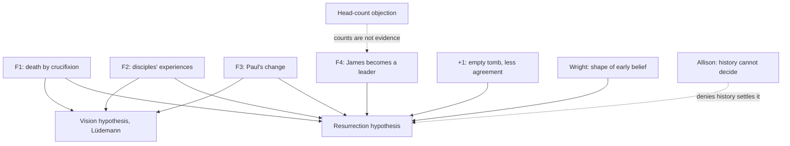

# Apologetics I · Lesson 5.2: The minimal-facts approach and its critics

> ⏱ ~15 min · Module 5: Jesus and the resurrection as history · Builds on: [5.1 Can history establish a miracle?](05-01-can-history-establish-a-miracle.md), [`new-testament` 3.3](../../new-testament/lessons/03-03-what-historians-broadly-agree-on.md) · Unlocks: [5.3 The empty tomb](05-03-the-empty-tomb.md), [5.4 The appearances and the rival hypotheses](05-04-the-appearances-and-the-rival-hypotheses.md)

## Why this matters

[5.1](05-01-can-history-establish-a-miracle.md) asked whether a historian could ever conclude a miracle. This lesson runs the most widely used attempt to do it: start only from facts that skeptical scholars themselves grant, and ask what explains them. The method has real virtues. It also has a structural cost that its critics, some of them Christians, have named exactly. You need both, because Module 5 uses the method as its starting point and then has to go beyond it.

## The idea

A defence lawyer who wants to win before a hostile jury uses only the facts the prosecution has already stipulated. Whatever she proves from those, the other side cannot dispute the premises. That is the [minimal-facts](../reference.md#minimal-facts) strategy of Gary Habermas and Michael Licona (*The Case for the Resurrection of Jesus*, 2004). A fact qualifies if it is well evidenced **and** accepted by the great majority of scholars who write on the subject, skeptics included. Four pass:

1. **F1.** Jesus died by crucifixion.
2. **F2.** Shortly afterwards his disciples had experiences they took to be appearances of the risen Jesus, and came to believe he had been raised.
3. **F3.** Paul, a persecutor of the church, changed course after an experience he took to be an appearance of Jesus.
4. **F4.** James, the brother of Jesus, who had not been a follower during the ministry, became one, and a leader.

They add a fifth, the **empty tomb**, as a "+1": they argue for it, but they say it has less agreement than the four. Their scheme is "4+1", and the tomb is not a minimal fact on their own terms.

Here is the cost, and it is the lesson in one sentence. **A fact everyone grants is usually a fact every hypothesis predicts.** Lüdemann grants F1–F3 *because* his vision hypothesis explains them. In odds form ([`philosophical-method` 2.4](../../philosophical-method/lessons/02-04-weighing-evidence-in-odds-form.md)), evidence that every rival expects carries a likelihood ratio near 1. The leaner the premises, the less they discriminate. Consensus buys security and spends leverage.

## The other side

The objections come in three strands, and the strongest critics press all three together.

**A head-count is not an argument.** That a majority of scholars accepts a claim is testimony about the claim, not the evidence for it. Testimony aggregates well only when the witnesses are independent. Scholars trained in the same guild, reading the same handful of texts with the same criteria ([`new-testament` 3.2](../../new-testament/lessons/03-02-sources-and-criteria.md)), are not independent witnesses. Their agreement is closer to one witness than to hundreds. And the counts behind the method come from Habermas's own survey of the literature since 1975, which he has reported (for example, that roughly three in four of the writers he surveyed favour the empty tomb). Critics have pointed out that the bibliography and coding behind those figures have not been released, so nobody can check them.

**Consensus varies by fact.** "Granted by most scholars" is true of F1 and F2 in the form stated. It is weaker for F4, where James's earlier unbelief rests on two gospel remarks (Mark 3:21; John 7:5) and no text narrates his conversion. It is weaker still for the tomb. Licona's own later work (*The Resurrection of Jesus: A New Historiographical Approach*, 2010) narrows his "historical bedrock" to three facts, F1–F3, leaving James out.

**The field is not neutral.** Secular critics note that people who write books about the resurrection are disproportionately clergy or teach at seminaries. A survey of that literature measures what a field with many believing members thinks. That is no evidence of bias in any single argument, but it is a reason to discount the count as a count.

**Dale Allison** (*The Resurrection of Jesus: Apologetics, Polemics, History*, 2021) must be stated on his own, because he fits neither camp. He believes Jesus was raised, and says so. His subtitle names his targets: apologists who claim history proves the resurrection and polemicists who claim it disproves it. In his judgement neither side can do what it claims. On the tomb, he thinks a decent case can be made for and a respectable one against, and he leans slightly towards its having been empty. On the appearances, he grants that grieving minds can produce vivid, compelling experiences. He also holds that you cannot show the disciples' experiences were illusory without first assuming naturalism. And he reports knowing of no close parallel to the series of appearances taken as a whole. His verdict, paraphrased: the purely historical evidence is not good enough to make disbelief unreasonable, and not bad enough to make faith untenable. What decides between them is worldview, not method. Read him as he asks to be read, as a check on overreach, and not as a skeptic or as an ally ([Allison on the resurrection evidence](../reference.md#allison-on-the-resurrection-evidence)).

## The argument

The method, restated so that it survives the objections:

1. **P1.** F1–F4 are each established by ordinary historical method on evidence that can be inspected: Tacitus and Josephus with all four gospels for F1; the early formula of 1 Cor 15:3–7 for F2 ([`new-testament` 3.4](../../new-testament/lessons/03-04-the-passion-and-resurrection-narratives.md)); Paul's own letters for F3; 1 Cor 15:7, Gal 1:19 and Josephus *Antiquities* 20.9.1 (James's execution) for F4. *In words:* the head-count is a pointer to the evidence, not a premise.
2. **P2.** Among hypotheses that explain F1–F4, prefer the one that explains all four without ad hoc additions ([inference to the best explanation](../../philosophical-method/lessons/02-01-inference-to-the-best-explanation.md)).
3. **P3.** The resurrection explains all four. Each natural rival (fraud, swoon, wrong tomb, vision, legend) strains on at least one: the vision hypothesis on F4 and on the group appearances, legend on the date of the formula. *(Argued in [5.4](05-04-the-appearances-and-the-rival-hypotheses.md).)*
4. **P4.** Given the background case for God (Modules 2–4), the resurrection hypothesis is not ruled out before the evidence is heard ([5.1](05-01-can-history-establish-a-miracle.md)).
5. **∴ C.** The resurrection is the best available explanation of F1–F4. This is a [motive of credibility](../reference.md#motives-of-credibility), not a demonstration ([`fundamental-theology` 2.2](../../fundamental-theology/lessons/02-02-credibility-and-the-preambles-of-faith.md)).

The **[maximal evidential case](../reference.md#maximal-evidential-case)** answers the leverage problem by spending security. N. T. Wright (*The Resurrection of the Son of God*, 2003) takes as data the *shape* of early Christian belief. In Second Temple usage "resurrection" meant a body. The early Christians held it in modified form: one man raised ahead of the general resurrection, the body transformed rather than merely restored, and the raised one the Messiah. Wright argues that other messianic movements whose leader was killed made no such claim. His conclusion is that an [empty tomb](../reference.md#empty-tomb) together with appearances is sufficient to explain that belief, and he argues it is necessary too. These data are more contested than F1–F4. But they are the kind a vision hypothesis predicts poorly, so they carry a likelihood ratio well away from 1.

**Concession.** The head-count objection is right about the counts. The survey figures cannot be checked by anyone outside the project. Agreement inside one guild is not independent confirmation, and "most scholars accept" should never appear as a premise in an argument for the resurrection. An apologist who leads with the number is using the weakest thing the method has.

**Where the argument is weakest.** P3. F1–F4 are minimal *because* they are explanation-neutral, so nearly all the weight falls on excluding rivals and on the background in P4. Allison grants most of the data and still denies that P3 can be settled by history alone. James (F4) is the fact that discriminates best, and it rests on the thinnest evidence.

## The map

Solid arrows: "is explained by". The four facts point to both hypotheses; only F4, the tomb and Wright's data discriminate. Dashed arrows: objections.

## Worked examples

**Example 1 (clean): Paul.** A skeptic says F3 rests on Christian propaganda. The method's answer is exact. The source is the man himself: Paul says he persecuted the church beyond measure (Gal 1:13; also Phil 3:6, 1 Cor 15:9) and lists himself among those to whom Christ appeared (1 Cor 15:8). The fact claimed is only that he had an experience he took as an appearance, and changed. Lüdemann and Ehrman both accept that much. The argument then moves, honestly, to explanation, where Lüdemann offers a conversion vision. F3 meets the objection cleanly because it claims little. For the same reason, on its own it settles little.

**Example 2 (where it strains): James.** F4 is the most useful fact, since a skeptic converted by a vision needs a story about why *he* had one. It is also the most fragile. The pieces are separate: earlier unbelief (Mark 3:21, where the Douay's "his friends" renders a Greek phrase meaning his own people, and John 7:5, "For neither did his brethren believe in him"); an appearance (1 Cor 15:7, one clause); leadership (Gal 1:19, 2:9); martyrdom around 62 (Josephus). No source joins them into a conversion narrative. The joining is inference. It is reasonable inference, but it is the apologist's own, and Licona later left it out of his bedrock. Use F4, and say in the same breath what it rests on.

## Watch out

- **You might think "even skeptical scholars accept the minimal facts" means skeptics accept that Jesus appeared, but actually** they accept that the disciples had *experiences they took to be* appearances. Moving the claim from "they saw something" to "they saw him" moves it into the bin history cannot certify ([`new-testament` 3.3](../../new-testament/lessons/03-03-what-historians-broadly-agree-on.md)).
- **You might think the Church endorses this method, but actually** it endorses no apologetic method. That Christ rose is defined dogma (rung 1, the creeds). CCC 639 says the event had historically verified manifestations, and CCC 647 that no one witnessed the rising itself, which exceeds history. Neither text canonizes any list of facts, and faith does not rest on the survey ([`christology` 6.2](../../christology/lessons/06-02-resurrection-and-ascension-as-doctrine.md)).
- **You might think Allison is a skeptic, or a convert to the apologists' case, but actually** he is neither. He believes Jesus was raised, leans slightly towards the empty tomb, and denies that the history makes either belief or unbelief unreasonable. Quoting him for only one half of that is caricature.

## One-liner

> Facts everyone grants are facts every hypothesis predicts: the minimal-facts method buys agreement by spending discriminating power, so the head-count proves nothing, and the work is done by James, the tomb and the shape of early belief.

## Problems

**P1 (🟢) *(Exegetical: close reading.)*** Galatians 1:13–19, Douay–Rheims (Challoner):

> For you have heard of my conversation in time past in the Jews' religion: how that, beyond measure, I persecuted the church of God and wasted it. And I made progress in the Jews' religion above many of my equals in my own nation, being more abundantly zealous for the traditions of my fathers. But when it pleased him who separated me from my mother's womb and called me by his grace, to reveal his Son in me, that I might preach him among the Gentiles: immediately I condescended not to flesh and blood. Neither went I to Jerusalem, to the apostles who were before me: but I went into Arabia, and again I returned to Damascus. Then, after three years, I went to Jerusalem to see Peter: and I tarried with him fifteen days. But other of the apostles I saw none, saving James the brother of the Lord.

(a) Which of the minimal facts F1–F4 does this passage support directly? Quote the words that do the supporting. (b) Name two things that F4 claims about James which this passage does **not** establish, and say where the method has to get each from. Two sentences per part.

**P2 (🟡) *(Apologetic: (a) Exegetical, graded first · (b) reply.)*** A critic writes: "The minimal-facts argument is a poll dressed up as history."

(a) State the head-count objection at the strength its secular critics give it, in three strands. Then say which strand Allison's position adds to or differs from. 120 words or fewer.
(b) Reply in 150 words or fewer. Open with a **named concession**. Then say what the argument must look like if the objection is granted.

**P3 (🔴) *(Exegetical: diagnose (a) · Exegetical: find the crux (b).)*** An invented opening statement from a campus debate (nobody said this; it is written for the problem):

> "Every historian worth the name, whether believer, agnostic or atheist, accepts five facts. Jesus died on a cross, his tomb was found empty, his disciples saw him alive, Paul the persecutor converted, and James the skeptic converted. No natural theory explains all five, so the only rational verdict is that God raised Jesus. Even Dale Allison, the field's most careful critic, concedes the resurrection."

(a) Name **four** distinct errors, quoting the words that carry each. (b) Correct the statement into the lesson's P1–C. State the single premise Allison would still deny, and what would have to change for him to grant it. 100 words or fewer for (b).

Solutions

**P1** *(Exegetical.)*

**Must hit, strict (a):**

- **F3**, directly and in the first person: the persecution ("beyond measure, I persecuted the church of God and wasted it"), the prior zeal ("more abundantly zealous for the traditions of my fathers"), and the turn ("to reveal his Son in me, that I might preach him").
- The passage does **not** support F1 or F2, and it supports F4 only partially. It names "James the brother of the Lord" in Jerusalem three years after Paul's call, counted alongside the apostles. That shows James's standing, not his conversion.

**Must hit, strict (b):**

- James's **earlier unbelief** is not here. It comes from Mark 3:21 and John 7:5.
- **An appearance to James** is not here either. It comes from 1 Cor 15:7. (Josephus, *Antiquities* 20.9.1, adds his death, not his conversion.)

**Wrong turns:** reading "reveal his Son in me" as a report of a seen appearance. The visual claim is 1 Cor 15:8 (and 9:1), and the phrase here is compatible with an inward revelation. Counting the visit to Peter as evidence for F2: it shows Paul's access to Jerusalem tradition, which bears on dating the formula, not on what the disciples experienced.

**Model answer:** (a) F3 directly: Paul attests his own persecution "beyond measure" and his zeal, and then a call "to reveal his Son in me, that I might preach him." It gives only part of F4, since "James the brother of the Lord" appears as a Jerusalem figure ranked with the apostles. (b) It does not show that James had earlier been an unbeliever, which the method takes from Mark 3:21 and John 7:5. Nor does it show that Jesus appeared to him, which comes only from 1 Cor 15:7.

---

**P2** *(Apologetic: (a) Exegetical, graded first · (b) reply.)*

**Must hit, strict (a), graded first:**

- **Count is not evidence:** majority agreement is testimony, and it aggregates only with independence, which scholars in one guild using shared criteria lack.
- **Varies by fact:** strong for crucifixion and the experiences; weaker for James; weaker still for the tomb, which Habermas and Licona themselves list as a "+1".
- **Non-neutral field, unverifiable counts:** writers on the resurrection are disproportionately clergy or seminary-linked, and the survey's bibliography and coding have not been released for checking.
- **Allison:** he does not run the objection as a sociology of the field. He grants much of the data, and his complaint is that *neither side* can get from the history to its verdict, because worldview decides.

**Must hit (b):**

- A **named concession**: the counts are unverifiable and non-independent, and should not be a premise.
- The re-based argument: each fact is argued from its own evidence (sources for F1–F4), and the head-count is retired to a pointer.
- An honest note that granting the objection also weakens the argument's rhetorical force, since the method's selling point was premises a skeptic cannot refuse.

**Wrong turns:** stating the objection as "scholars are biased, so the facts are false". That is a caricature, because the critics' point is about the count, not the facts. Answering "but the skeptics agree too" without noticing that the skeptics agree to the facts only in their weakest, explanation-neutral form. Claiming the Church vouches for the facts.

**Model answer (b), one of several:** **Concession:** the critic is right that a poll is not evidence. The survey can't be checked, and a guild's agreement isn't independent confirmation, so "most scholars" should never be a premise. Granting that, the argument has to stand on the sources. The crucifixion stands on Tacitus, Josephus and every Christian text. The experiences stand on a formula Paul received within a few years. Paul's change stands on his own letters, and James's on 1 Cor 15:7, Galatians and Josephus. Each fact can be defended without the count, and the skeptics' agreement is then a welcome sign rather than a support. The cost is real: the method loses the claim that its premises cannot be refused, and James in particular must be argued, not stipulated.

---

**P3** *(Exegetical: diagnose (a) · Exegetical: find the crux (b).)*

**Accept:** in (a), any four of the five errors below, each with its words quoted.

**Must hit, strict (a):**

1. **Empty tomb promoted to a minimal fact:** "accepts five facts … his tomb was found empty". Habermas and Licona list it as a "+1" with less agreement.
2. **The appearance claim moved across bins:** "his disciples saw him alive". The fact granted is that they had experiences *they took to be* appearances.
3. **Unanimity as premise:** "Every historian worth the name". This is a head-count, and an overstated one, used as a premise.
4. **Overreach in the conclusion:** "the only rational verdict". At most this is a best explanation and a motive of credibility, and the claim also skips P4.
5. **Allison misrepresented:** "concedes the resurrection". He believes it, but he holds that the historical evidence does not make disbelief unreasonable. Citing him as a concession from the evidence reverses his position.

**Must hit, strict (b):** a corrected chain: four facts from sources, the tomb flagged as disputed, IBE, background, then the conclusion as a motive. **Allison denies P3 as a *historical* result.** He grants much of the data but holds that historical method cannot exclude the rivals without worldview doing the work. For him to grant P3, the decision between hypotheses would have to be settled by evidence that every party weighs the same way. That means it would not depend on priors about God, which is the subject of 5.1 and 5.5.

**Wrong turns:** saying Allison denies the facts. Saying he denies the resurrection. Putting the crux in P1.

**Model answer (b):** Corrected: four facts, each argued from its sources, plus a disputed tomb. The resurrection explains them best, and given Modules 2–4 it is not excluded in advance, so it is a motive of credibility. Allison accepts most of the facts and even the conclusion as his own belief. What he denies is P3 *as history*. On his view, excluding visions and the other rivals is done by one's worldview, not by the method. He would grant it only if the comparison of hypotheses stopped depending on the prior for God.

## Flashback

**From Lesson [4.4](04-04-divine-action-miracles-and-quantum-indeterminacy.md) (Divine action, miracles, and quantum indeterminacy):** *(Apologetic: (a) Exegetical, graded first · (b) reply.)* An invented case (nobody here is real; it is built for the problem). Mara, a climber, falls; her rope snags on a rock spur and holds. The spur's shape was cut by thousands of years of frost and erosion, a process classical physics describes deterministically for every practical purpose. Afterwards she says: "God saved me on that ledge." A naturalist friend answers that the erosion explains the spur completely.

(a) State the naturalist's dilemma from 4.4 as its defenders would, applied to Mara's claim. **Two sentences.** (b) Reply as a Thomist. **Open with a named concession**, then say why the reply does not need the erosion to have been undetermined anywhere. **Three sentences.**

Solution

**Accept:** in (b), any reply that engages the dilemma's shared premise; a reply that concludes the dilemma succeeds also passes if it names the concession and engages that premise.

**Must hit, strict (a), graded first:**

- The premise is **causal closure**: every physical event with a cause has a sufficient physical cause, and here the erosion is that cause.
- The two horns: either God added a cause the physics leaves no room for, which is **intervention**, a breach of laws we have every reason to accept and God as an intruder; or he added nothing, so "God saved me" is only a **pious redescription** of what the rock did anyway, and God is idle.

**Must hit (b):**

- A **named concession**, stated plainly first. The natural one is the argument's weakest point in 4.4: the Thomist gives a "that" without a "how", so God's special action here is physically invisible and adds no detectable cause.
- The reply denies the dilemma's **shared premise**, that divine and natural causes compete for one slot. God is the **primary cause** of the erosion's being and acting, wholly, at a different level; the erosion is wholly the secondary cause of the spur. So "God saved her" names no extra physical cause and is not an idle redescription either.
- Determinism is no obstacle, because God causes deterministic and indeterministic processes alike. The rescue's being *for* Mara lies in **providence**, the ordering of this event to her good, not in a physical gap.

**Wrong turns:** stating the naturalist as arguing that the rescue was improbable (the dilemma grants the event and disputes the causal story); answering with a quantum or chaotic causal joint in the frost, which concedes the shared premise and needs amplification nobody has shown; calling Mara's rescue a miracle in the strict sense of q.105 a.6, when nothing here is outside the order of secondary causes; presenting the Thomist account as Church teaching, when only providence and the possibility of miracles are defined and the account itself is freely disputed (rung 5).

**Model answer:** (a) Physics is causally closed, so the frost and erosion are a sufficient cause of the spur, and God's saving Mara must either add a cause physics leaves no room for, which is intervention, or add nothing, which makes "God saved me" a pious relabelling of geology. Intervention makes God an intruder in his own world, and non-intervention makes him idle. (b) **Concession:** the naturalist is right that the Thomist cannot say *how* God secured this outcome, and that his action here leaves no physical trace. But the dilemma assumes God would have to be one more cause beside the erosion, while on the Thomist account he is the primary cause of the erosion itself, wholly, as the erosion is wholly the secondary cause of the spur. Since God causes deterministic processes as fully as chancy ones, the rescue needs no undetermined event anywhere; its being an answer to Mara's need lies in providence ordering the event to her good.

## Connections

- **Backward:** [5.1](05-01-can-history-establish-a-miracle.md) on what a historian may conclude. [`new-testament` 3.3](../../new-testament/lessons/03-03-what-historians-broadly-agree-on.md) for the bins and Sanders's list, and [3.4](../../new-testament/lessons/03-04-the-passion-and-resurrection-narratives.md) for 1 Cor 15:3–8 and the map of Wright, Allison, Lüdemann and Ehrman. This lesson fulfils that lesson's promise to argue them at full strength, beginning with Allison. Independence of witnesses: [`philosophical-method` 2.4](../../philosophical-method/lessons/02-04-weighing-evidence-in-odds-form.md).
- **Forward:** [5.3](05-03-the-empty-tomb.md) weighs the "+1". [5.4](05-04-the-appearances-and-the-rival-hypotheses.md) defends P3 against Lüdemann, Goulder and Strauss. [5.5](05-05-weighing-it-the-bayesian-apologetic-and-its-limits.md) turns the leverage problem into likelihood ratios and asks where the prior comes from.
- **Sideways:** treating a head-count as testimony is [`epistemology` 4.5](../../epistemology/lessons/04-05-peer-disagreement.md) on peer disagreement run at the scale of a discipline. The trade between secure premises and discriminating ones is the same trade [2.1](02-01-assembling-the-case.md) faced in choosing which theistic arguments carry weight.
