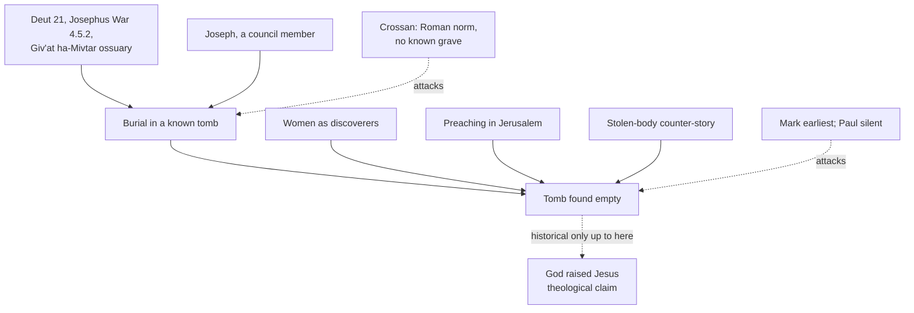

# Apologetics I · Lesson 5.3: The empty tomb

> ⏱ ~15 min · Module 5: Jesus and the resurrection as history · Builds on: [5.1 Can history establish a miracle?](05-01-can-history-establish-a-miracle.md), [5.2 The minimal-facts approach and its critics](05-02-the-minimal-facts-approach-and-its-critics.md), [`new-testament` 3.4](../../new-testament/lessons/03-04-the-passion-and-resurrection-narratives.md) · Unlocks: [5.4 The appearances and the rival hypotheses](05-04-the-appearances-and-the-rival-hypotheses.md), [5.5 Weighing it](05-05-weighing-it-the-bayesian-apologetic-and-its-limits.md)

## Why this matters

The [empty tomb](../reference.md#empty-tomb) is the strand of the resurrection case that people outside the field think is strongest and people inside it argue about most. Many critical scholars who grant that the disciples had real experiences (Lüdemann, Ehrman, Crossan) deny that there was a known tomb to find empty. So this lesson does what [`new-testament` 3.4](../../new-testament/lessons/03-04-the-passion-and-resurrection-narratives.md) declined to do: it weighs the evidence on both sides and says where the balance falls. It also concedes what the balance costs.

## The idea

Separate three claims that apologetics tends to run together:

1. **Burial:** Jesus was buried in a tomb whose location was known.
2. **Discovery:** that tomb was found empty, as early as the third day.
3. **Explanation:** it was empty because God raised him.

Claims 1 and 2 are historical. Claim 3 is the theological claim [5.1](05-01-can-history-establish-a-miracle.md) separated off: a historian's verdict could at most reach "the tomb was empty and the disciples saw something". The decisive fact is that **claim 2 depends on claim 1**. If there was no known grave, nobody could find it empty, and nobody could refute the preaching by pointing to an occupied one. That is why the strongest skeptical case attacks the burial, not the discovery.

## The other side

**John Dominic Crossan** (*Jesus: A Revolutionary Biography*, 1994, in the chapter titled "The Dogs beneath the Cross") argues as follows. Crucifixion was a Roman state terror, and denial of burial was part of the terror: bodies were usually left on the cross for carrion birds and dogs, or thrown into a shallow grave where the dogs reached them anyway. The disciples had fled at the arrest, so nobody who cared knew what happened to the body afterward. On Crossan's account, Joseph of Arimathea is Mark's creation, filling a hole the tradition could not otherwise fill. The later gospels then make him steadily more sympathetic: a disciple, a rich man with a new tomb. So the empty-tomb stories are late narrative, not memory.

**Bart Ehrman** (*How Jesus Became God*, 2014; summarized in NT 3.4) reaches a similar verdict with less certainty. Pilate had no reason to make an exception for a man executed as a would-be king, and an honourable burial in a known tomb is therefore improbable. We do not know what happened to the body.

Two further arguments complete the case:

- **Mark is the earliest narrative** (around 70, on most datings), and the later gospels expand it: guards in Matthew, two angels in Luke, Peter and the beloved disciple running in John ([`new-testament` 2.1](../../new-testament/lessons/02-01-mark.md), 3.4). A tradition that grows this way looks like a [legend](../reference.md#legend-hypothesis) in formation.
- **Paul never mentions the tomb.** The earliest list of witnesses, 1 Cor 15:3–8, names appearances and leaves out both the tomb and the women.

## The argument

The case, as an apologist who has read the other side should put it:

- **P1 (burial was possible).** Jewish law required the executed to be buried the same day: "His body shall not remain upon the tree, but shall be buried the same day" (Deut 21:23, DR). Josephus says Jews took down even the crucified and buried them before sunset (*War* 4.5.2). An ossuary found at Giv'at ha-Mivtar in Jerusalem in 1968 held the heel bone of a crucified man with the nail still in it, so at least one victim of crucifixion received a family burial. *In words:* in Judea, before a feast, a Roman prefect had local reasons to allow burial (compare John 19:31). Jodi Magness (*Stone and Dung, Oil and Spit*, 2011) judges that the gospel burial accounts accord with Jewish law and with the archaeology of Jewish tombs.
- **P2 (Joseph is an odd invention).** A story-teller making up a burial would hardly hand it to a member of the council that had condemned Jesus (Mark 15:43). Raymond Brown (*The Death of the Messiah*, 1994), after a long study of the burial texts, judged burial by Joseph historically probable.
- **P3 (the women).** All four gospels make women the discoverers, though women's testimony counted for little (NT 3.4 gives Josephus, *Ant.* 4.8.15). This is the [criterion of embarrassment](../reference.md#criterion-of-embarrassment): an invented story had better witnesses to hand.
- **P4 (Jerusalem preaching).** The resurrection was preached in the city where Jesus was buried, within weeks according to Acts. Peter's speech contrasts David, whose "sepulchre is with us to this present day" (Acts 2:29), with Jesus, whose flesh saw no corruption (2:31).
- **P5 (the counter-story).** Matthew reports the reply circulating among his opponents: "His disciples came by night and stole him away" (Matt 28:13). He adds that the story was still current among Jews in his own day (28:15). Justin, about a century later, reports the same charge (*Dialogue with Trypho* 108). The polemic disputes **why** the body was gone, not **whether** ([stolen-body counter-story](../reference.md#stolen-body-counter-story)).
- **P6 (Paul, read the other way).** 1 Cor 15:4 puts burial and rising in sequence. For a Pharisee, rising was something done to the body that was buried. Paul's silence about the tomb is silence about the evidence, not about the claim.
- **∴ C.** On the evidence, the discovery of an empty tomb is **more probable than not**. As a historical judgement it is a [motive of credibility](../reference.md#motives-of-credibility), not a demonstration. *In words:* the tomb tradition is better grounded than Crossan allows, and weaker than "every historian agrees".

**Concession.** The empty tomb is more disputed among scholars than the appearance experiences are. Critics who grant that the disciples saw something routinely deny the known tomb, and an apologetic case that leans on the tomb must say so up front. Crossan is right about the Roman norm: crucifixion usually did mean no burial, and one ossuary is one case. Joseph's role carries an apologetic motive that the later gospels visibly enlarge. Matthew's guard story appears in no other gospel and reads, to many scholars, as an apologetic answer to the counter-story rather than a record. Justin may be reporting Matthew back.

**Where the argument is weakest.** P4 and P5 assume P1 and P2. If Crossan is right that nobody knew where the body lay, then Jerusalem preaching proves nothing (there was no grave to point at). The counter-story would also be a late reply to a story already being told. The whole case rests on the burial, and the burial rests on probabilities about Pilate's behaviour that no text settles.

**Mark the levels.** That Christ rose, in his own body, is **defined dogma** (the Creeds; Lateran IV "rose in the flesh"). An empty tomb follows from it ([`christology` 6.2](../../christology/lessons/06-02-resurrection-and-ascension-as-doctrine.md)). The tomb's **force as evidence** is not defined: the Catechism says the empty tomb is not in itself a direct proof (CCC 640). *Dei Filius* ch. 3 defines that outward signs **can** make revelation credible; it does not define that this argument succeeds ([`fundamental-theology` 2.2](../../fundamental-theology/lessons/02-02-credibility-and-the-preambles-of-faith.md)). Every premise above, and C, is a historian's judgement, freely disputed.

## The argument map

Everything above the dotted line to G rests on B. That is why [Crossan's burial objection](../reference.md#crossans-burial-objection) is the one to answer first.

## Worked examples

**Example 1 (clean): a debater says the women prove nothing because Mark needed someone at the tomb.** Meet it head on. If Mark invented the discovery, he could have sent any witnesses, and the men's flight (14:50) doesn't force his hand. Peter is available in the tradition (Luke 24:12; John 20:3–6). The embarrassment point survives: women are the witnesses an inventor avoids. Now concede its limit: embarrassment shows the women were **in the tradition**, not that the tradition is early. It supports P3 and does nothing for the burial on which P3 depends.

**Example 2 (hard): Paul's silence.** Here the evidence really does point both ways. For the tomb: 15:4 sets burial and rising in sequence, and Paul's whole argument in 15:35–49 is about what happens to a sown body. Against: Paul is listing witnesses, and a tomb found by women would be his strongest item. Yet he lists neither, and he can say that flesh and blood cannot possess the kingdom of God (15:50). The apologist answers that 15:50 concerns the body untransformed (15:51–53), and that a list of official witnesses would leave women out for the reason P3 gives. But that reply turns Paul's silence from evidence for the tomb into evidence neutral about it. The honest verdict: P6 shows that Paul **believed** in a body that left the grave. It does not show that he **knew** a tomb tradition.

## Watch out

- **You might think the Church teaches that the empty tomb proves the resurrection.** It teaches the reverse: CCC 640 says it is not by itself a direct proof. The dogma is the bodily resurrection. The historical argument's success is **not** defined.
- **You might think Crossan denies Jesus was crucified, or argues from unbelief.** He holds the crucifixion certain. His objection is an argument from Roman practice and from the shape of the gospel tradition, and it has to be met there.
- **You might think Matthew 28:11–15 is Jewish testimony to the empty tomb.** It is Matthew's report of what opponents were saying. It is evidence about the polemic of his own day, only as strong as his report is accurate.

## One-liner

> The empty tomb stands or falls with a known burial: Jewish custom and Joseph make that probable, Roman practice and Mark's lateness make it disputable, and an honest apologist says it is more disputed than the appearances.

## Problems

**P1 (🟢)** *(Exegetical; close reading)* Josephus, *Jewish War* 4.5.2 (Whiston), on the Idumeans in Jerusalem during the revolt (68 AD):

> "Nay, they proceeded to that degree of impiety, as to cast away their dead bodies without burial, although the Jews used to take so much care of the burial of men, that they took down those that were condemned and crucified, and buried them before the going down of the sun."

(a) What does the passage assert about crucified bodies, and what rhetorical job does it do in its context? (b) Name two things it does **not** establish about the burial of Jesus. **Two sentences per part.**

**P2 (🟡)** *(Apologetic: (a) Exegetical, graded first · (b) reply)* An invented student says: "The burial is the one thing nobody doubts, so the tomb argument is safe."

(a) State Crossan's objection as he argues it in *Jesus: A Revolutionary Biography*. **Three sentences at most.** (b) Reply in **120 words or fewer**, opening with a **named concession**. A reply that concludes Crossan is right passes if it is good.

**P3 (🔴)** *(Exegetical (a) · Evaluative (b))* An invented parish bulletin note:

> "The empty tomb is a fact that every serious historian accepts. Even Jesus's enemies admitted it: Matthew 28 records the chief priests' own testimony. And the Church has declared the empty tomb the proof of the resurrection, so a Catholic who doubts the historical argument doubts the faith."

(a) Name three errors, one per sentence, with the correction. **One sentence each.** (b) Any verdict, **80 words or fewer**: if the note were rewritten to be accurate, would it be a stronger or weaker motive of credibility than the overstated version?

Solutions

**P1** *(Exegetical)*

**Must hit, strict (a):**

- The passage says it was Jewish custom to take down the condemned and crucified and bury them before sunset, the practice Deut 21:22–23 commands.
- The sentence is there to condemn the Idumeans: their leaving bodies unburied is set against an ideal of Jewish piety. So the custom is stated in a polemical contrast and may be idealized.

**Must hit, strict (b), any two:**

- It does not say that Roman prefects regularly released crucified bodies, or that Pilate did.
- It does not say the burial was in a known, individual tomb rather than an anonymous grave.
- It does not say that any follower of the executed knew where the body lay.
- It is written decades later, about a different period.

**Wrong turns:** treating it as evidence for the empty tomb; treating it as evidence for Joseph of Arimathea; dismissing it because Roman practice was otherwise, when it is evidence that Jewish practice was sometimes accommodated.

**Model answer:** (a) Josephus says Jews took such care over burial that they took down even the crucified and buried them before sunset, as Deuteronomy 21 required. He says it to blacken the Idumeans, who left bodies unburied, so the custom is stated in an idealizing contrast. (b) It does not say that Roman governors normally allowed this, or that Pilate did in Jesus's case. Nor does it say that such burial was in a known tomb whose location the dead man's followers knew.

---

**P2** *(Apologetic: (a) Exegetical, graded first · (b) reply)*

**Must hit, strict (a), graded first:**

- Denial of burial was part of crucifixion's terror. Bodies were usually left for birds and dogs or put in a shallow grave the dogs reached.
- The disciples had fled, so no one who cared knew what became of the body.
- Joseph of Arimathea is Mark's creation, enlarged by the later gospels, so the tomb stories are late narrative, not memory.

**Must hit (b):**

- A **named concession**: the Roman norm was non-burial, or Joseph's role grows apologetically across the gospels.
- At least one counter-move aimed at the burial itself: Deut 21:22–23 and Josephus *War* 4.5.2; the Giv'at ha-Mivtar ossuary; the eve of a feast (John 19:31); Magness on Jewish practice; Joseph being an odd figure to invent as a council member (Brown judged the burial by Joseph probable).
- Recognition that winning the burial does not by itself win the discovery.

**Wrong turns:** stating Crossan as denying the crucifixion; reducing him to "the gospels are biased"; answering with CCC 640 or the Creed; treating the single ossuary as proof of routine burial.

**Model answer (b), one of several:** Concession: Crossan is right that the Roman norm was to deny burial, and Joseph's role does grow from Mark to John. But Judea had a law and a custom pressing the other way. Deuteronomy required same-day burial; Josephus says Jews buried even the crucified before sunset; and the Giv'at ha-Mivtar ossuary shows that a crucified man could get a family burial. A council member who helped condemn Jesus is an awkward figure to invent, which is why Brown judged the burial probable. So a known burial is more probable than Crossan allows. It is not certain, and the discovery still needs its own evidence.

---

**P3** *(Exegetical (a) · Evaluative (b))*

**Must hit, strict (a):**

- Sentence 1 overstates. The empty tomb is more disputed among scholars than the appearances, and critics such as Crossan and Ehrman deny it. Scholarly head-counts are not premises in any case.
- Sentence 2 misdescribes the source. Matthew 28:11–15 is Matthew's report of an opposing story, found only in his gospel, not the chief priests' own testimony.
- Sentence 3 overstates the level. The defined dogma is the bodily resurrection. CCC 640 says the empty tomb is not by itself a direct proof, and *Dei Filius* defines only that signs can make revelation credible, not that this argument succeeds. So doubting the argument is not doubting the faith.

**Must hit, any verdict (b):** compare the two versions as motives of credibility. Overstatement collapses when a hearer checks it. An accurate claim gives a smaller result that survives checking. Either verdict passes if both effects are weighed.

**Wrong turns:** "correcting" sentence 3 by saying a Catholic may deny the tomb was empty. The bodily resurrection entails it (christology 6.2); what is open is whether the **historical argument** succeeds. Calling the guard story certainly fictional: that is a judgement, not a datum.

**Model answer (b), one of several:** Stronger, overall. The accurate version claims less: a known burial is probable, the discovery more probable than not, and both disputed. But a motive of credibility works on someone who will check. The overstated note fails at the first check and takes the trustworthy parts of the case down with it. The cost is real, since it persuades fewer people quickly.

## Flashback

**From Lesson [5.1](05-01-can-history-establish-a-miracle.md) (Can history establish a miracle?):** *(Formal (a)–(b) · Exegetical (c).)* Invented numbers. Two readers agree that the evidence for H is $L = 200$ times more expected if R is true than if every natural explanation is. Both use the lesson's factorization $\Pr(R \mid B) = \Pr(G \mid B) \times \Pr(\text{raise} \mid G, B)$.

(a) Both take $\Pr(\text{raise} \mid G, B) = \tfrac{1}{50}$. What value of $\Pr(G \mid B)$ leaves a reader at exactly even posterior odds?
(b) Reader Z takes $\Pr(G \mid B) = 0.05$. Compute Z's posterior odds and probability with $\Pr(\text{raise} \mid G, B) = \tfrac{1}{50}$, then again with $\tfrac{1}{5}$.
(c) In one sentence: which of the lesson's weak points does (b) display?

Solution

**Worked arithmetic:**

(a) Even posterior odds need prior odds $1 : 200$, so $\Pr(R \mid B) = \tfrac{1}{201}$. Then

$$\Pr(G \mid B) = \frac{1/201}{1/50} = \frac{50}{201} \approx 0.249$$

(b) With $\tfrac{1}{50}$: $\Pr(R \mid B) = 0.05 \times 0.02 = 0.001$, prior odds $1 : 999$, posterior odds $\tfrac{200}{999} \approx 0.20$, so about $1 : 5$, probability $\tfrac{200}{1{,}199} \approx 16.7\%$.

With $\tfrac{1}{5}$: $\Pr(R \mid B) = 0.05 \times 0.2 = 0.01$, prior odds $1 : 99$, posterior odds $\tfrac{200}{99} \approx 2.02 : 1$, probability $\tfrac{200}{299} \approx 66.9\%$.

**Must hit, strict (c):**

- Changing only $\Pr(\text{raise} \mid G, B)$, the factor nobody has an agreed way to estimate, moves Z from about 17% to about 67% with the history ($L$) and $\Pr(G \mid B)$ unchanged: the lesson's "where the argument is weakest" point.

**Wrong turns:** setting $\Pr(R \mid B) = \tfrac{1}{200}$ in (a) (that confuses odds with probability); multiplying probabilities by $L$ instead of odds; answering (c) with "the prior for God does the work" (it was held fixed in (b)).

**Model answer (c):** The second factor, how likely God was to raise this man, swings the verdict as much as belief in God does, and it is exactly the number the lesson says no one knows how to fix.

## Connections

- **Backward:** the historian's limit (what history can say vs "God raised Jesus") is [5.1](05-01-can-history-establish-a-miracle.md). Whether the tomb counts as a "minimal fact" is [5.2](05-02-the-minimal-facts-approach-and-its-critics.md)'s dispute. The texts, the criterion of embarrassment and Josephus on women's testimony are in [`new-testament` 3.2](../../new-testament/lessons/03-02-sources-and-criteria.md) and [3.4](../../new-testament/lessons/03-04-the-passion-and-resurrection-narratives.md), and Mark's endings in [`new-testament` 2.1](../../new-testament/lessons/02-01-mark.md).
- **Forward:** [5.4](05-04-the-appearances-and-the-rival-hypotheses.md) asks what the appearances add, and whether a vision hypothesis needs the tomb at all. [5.5](05-05-weighing-it-the-bayesian-apologetic-and-its-limits.md) asks whether the tomb and the appearances are independent strands, or whether one burial judgement feeds both ([total evidence](../reference.md#total-evidence)).
- **Sideways:** what the doctrine requires of the body, and why the tomb's emptiness follows from dogma while its force as evidence is not defined, is [`christology` 6.2](../../christology/lessons/06-02-resurrection-and-ascension-as-doctrine.md). How a single report updates odds is [`philosophical-method` 2.4](../../philosophical-method/lessons/02-04-weighing-evidence-in-odds-form.md).
