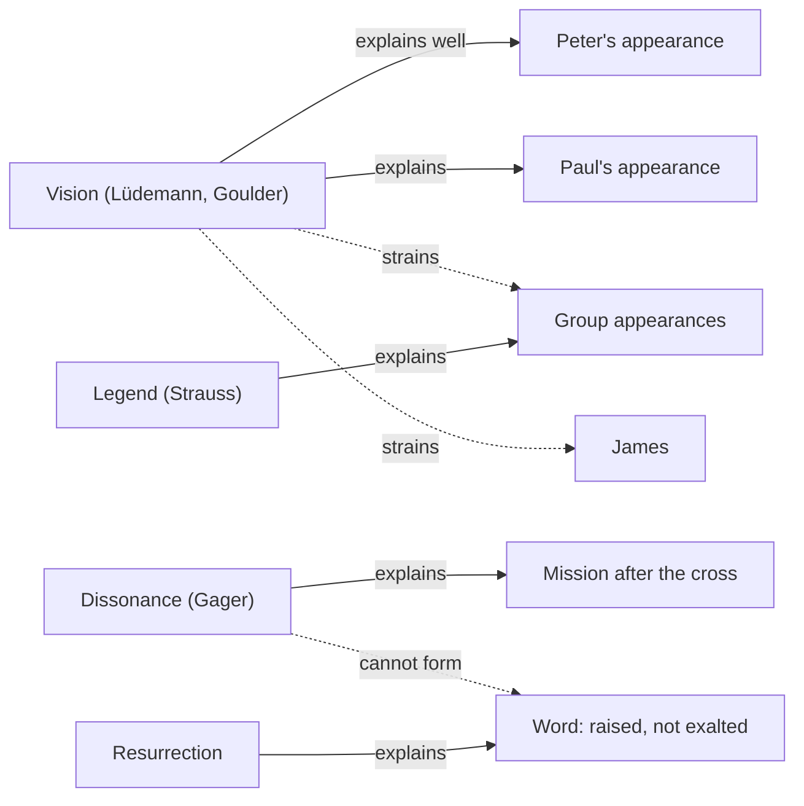

# Apologetics I · Lesson 5.4: The appearances and the rival hypotheses

> ⏱ ~15 min · Module 5: Jesus and the resurrection as history · Builds on: [5.2 The minimal-facts approach](05-02-the-minimal-facts-approach-and-its-critics.md), [5.3 The empty tomb](05-03-the-empty-tomb.md) · Unlocks: [5.5 Weighing it](05-05-weighing-it-the-bayesian-apologetic-and-its-limits.md)

## Why this matters

The appearance experiences are the strongest datum in the case: they are better attested than the empty tomb ([5.3](05-03-the-empty-tomb.md)), and almost every critic grants that something was experienced. So the argument here is about the *cause*. If a natural explanation covers the appearances, the resurrection case is a story about the tomb, and 5.3 showed how disputed that is. This lesson states the rivals as their defenders do and asks what each explains and where it strains.

## The idea

You have a list of experiences, and you need a cause that fits all of them. The rivals divide the work:

- **Vision**: the experiences were real psychological events with no object outside the seers.
- **Legend**: the stories grew in the telling.
- **Dissonance**: belief survived a crushed hope because believers could not let it go.

Each is good at something. The question is whether each one covers its share of the evidence without strain, and what a combination costs.

The text is [1 Corinthians 15:3–8](../../new-testament/lessons/03-04-the-passion-and-resurrection-narratives.md), read closely in `new-testament` 3.4: a formula Paul *received*, its core dated by most scholars to the 30s (a report, not a proof), and a list of witnesses for whom one verb is repeated, [*ōphthē*](../reference.md#ophthe), "he appeared" or "he was seen". That course gave the Greek. Here the question is the verb's range. In the Greek Old Testament the same form describes God appearing to Abram (Gen 12:7), a theophany, not an ordinary sighting. Paul uses it of his own experience, which Acts calls a "heavenly vision" (26:19) and Paul describes as God choosing "to reveal his Son in me" (Gal 1:16). The verb does not settle whether the seeing was visionary or physical. Both sides need to admit that.

## The other side

**Gerd Lüdemann** (*The Resurrection of Jesus: History, Experience, Theology*, 1994) gives the [vision hypothesis](../reference.md#vision-hypothesis) its strongest modern form. Peter had denied Jesus. After the execution, grief and guilt produced in him a vision of Jesus, a psychological event of the kind grief research describes, which Peter experienced as forgiveness and as an appearance of the risen Lord. Paul's vision resolved a different inner conflict, the persecutor's attraction to what he persecuted. The others followed Peter in a chain of enthusiasm. Lüdemann identifies the "more than five hundred" with a mass ecstasy in the early community and suggests the Pentecost event of Acts 2. He holds that the body decayed. **Michael Goulder** ("The Baseless Fabric of a Vision", in Gavin D'Costa (ed.), *Resurrection Reconsidered*, 1996) makes Peter's and Paul's experiences *conversion visions*, born of stress, guilt and self-doubt. He treats the group appearances as collective delusion, citing modern episodes of shared, sincere and mistaken sightings (among them a 1977 Bigfoot scare in South Dakota).

The psychology they lean on is real. W. Dewi Rees interviewed 293 widowed people in mid-Wales ("The Hallucinations of Widowhood", *BMJ* 1971). Almost half had hallucinations or illusions of the dead spouse, often over years, and he judged them normal and helpful. The experiences are common, and they occur in sane people at a time of loss.

The two remaining rivals complete the combined hypothesis. **Cognitive dissonance**: Festinger, Riecken and Schachter (*When Prophecy Fails*, 1956) studied a group whose prophecy failed and reported that proselytizing *increased* afterwards. John Gager (*Kingdom and Community*, 1975) applied the theory to the first Christians: a crucified messiah was a disconfirmation, and mission was the response. **Legend**: D. F. Strauss (*Das Leben Jesu*, 1835–36) read the gospel stories as myth, the community's faith put into narrative form. On the resurrection itself he too appealed to visions, and he made the legendary growth the explanation of the tomb stories and of the physical detail (eating fish, touching wounds, Luke 24).

## The argument

The Catholic case does not deny any of the psychology. It argues that the vision hypothesis covers the individual appearances well and the full list badly.

1. **P1.** The list includes a group of eleven or twelve, "more than five hundred … at once", "all the apostles", and James (1 Cor 15:5–7).
2. **P2.** Grief visions, as documented, are individual and private. Rees's subjects mostly told no one. What the vision hypothesis needs for the group appearances is a collective experience with shared content. Reports of such experiences exist: Dale Allison has gathered reports of visions seen by several people at once and argues apologists say too quickly that group visions never happen. But the literature is thin and hard to evaluate. It is no settled finding either way.
3. **P3.** Two witnesses lack the grief motive. Paul was a persecutor. James did not believe in Jesus during the ministry (John 7:5; compare Mark 3:21).
4. **P4.** **Wright's exaltation objection** (*The Resurrection of the Son of God*, 2003): in a Second Temple setting, a vision of a dead man would have been read as a ghost or angel ("It is his angel", Acts 12:15) or as a martyr's heavenly vindication. It would not have been read as *resurrection*, which meant a body leaving death behind. A vision gives you "exalted", not "raised".
5. **P5.** Dissonance explains why a belief *persists*. It does not explain how a new and specific claim, that one man has been raised ahead of the general resurrection, was *formed*.
6. **∴ C.** Each rival explains part of the data; the conjunction that covers all of it pays for every part.

*In words:* the hypothesis is excellent for Peter, adequate for Paul, strained for James and the groups, and needs extra help to produce the word "raised".

**Concession.** Grief visions are common and real, and they come to ordinary, sane people. The vision hypothesis explains the individual appearances well, Peter's above all: in a man who has just denied his master, a vision of him is psychologically intelligible. And *ōphthē* does not exclude a vision, since Paul applies it to his own.

**The reply to Wright's objection is a good one.** Jewish expectation was more varied than P4 allows. Daniel 12:2 ([`old-testament` 6.3](../../old-testament/lessons/06-03-daniel-and-apocalyptic.md)) gave a live hope of bodily resurrection at the end. If the disciples thought the end had begun, a vision of the vindicated Jesus could be read as its *firstfruits*, which is Paul's own word (1 Cor 15:20; compare Matt 27:52–53). And Mark 6:14–16 has Herod saying of Jesus that "John the Baptist is risen again from the dead", with no tomb inspected. So resurrection language for one individual was available. Wright's objection lowers the vision hypothesis's likelihood; it does not take it to zero.

**Where the argument is weakest.** P2 rests on silence: we have no first-hand account of the five hundred, and Paul gives no detail. A critic can say the group reports are later tradition rather than group experiences (Lüdemann's Pentecost reading), and then the strain points shrink to James and Paul.

## The cable

Solid arrows: the hypothesis explains the datum well. Dashed: it strains. The resurrection hypothesis explains every datum. Its cost sits in its prior, which is [5.5](05-05-weighing-it-the-bayesian-apologetic-and-its-limits.md)'s problem.

## Worked examples

**Example 1 (clean): Peter.** Datum: Cephas is named first (1 Cor 15:5). Vision: a grieving, guilty disciple sees his master. This fits the documented pattern closely. Resurrection: Jesus appears first to the leader who failed him, which also fits. Neither hypothesis predicts this datum noticeably better. In odds form ([`philosophical-method` 2.4](../../philosophical-method/lessons/02-04-weighing-evidence-in-odds-form.md)) the likelihood ratio is near 1. The honest move is to say so. Peter's appearance is not evidence *against* the vision hypothesis, and an apologist who presents it that way overreaches.

**Example 2 (hard): the combined hypothesis.** Suppose the critic says: Peter and Paul had visions (Lüdemann), the group reports grew from one ecstatic gathering ([legend](../reference.md#legend-hypothesis)), the tomb stories came later (Strauss), and dissonance drove the mission. The data do not refute this combination; each part has precedent. Its price is structural. A conjunction is no more probable than its weakest conjunct, and several of these conjuncts are only moderately probable. They are also not independent: if the group reports are legend, that is because the vision explanation needed them to be. The honest verdict is that a combined hypothesis can cover the data. It does so at the price of a conjunction of moderate probabilities, and whether that price exceeds the resurrection's low prior is exactly the dispute 5.5 puts in numbers. The critic is not cheating, and the apologist has not won here.

On time for legendary growth: the formula is in the 30s, Paul writes in the 50s, Mark around 70. A. N. Sherwin-White (*Roman Society and Roman Law in the New Testament*, 1963) argued that even two generations was too short for legend to erase a hard historical core. But the list in 1 Cor 15 is itself the core, and legend can still embellish the narratives that come later. The time argument protects the list, not Luke 24's fish.

## Watch out

- **You might think the vision hypothesis says the disciples were deranged, but actually** Lüdemann and Goulder say the opposite: these are ordinary experiences of sane people, and Rees found them normal. Calling it "the crazy-disciples theory" is a caricature and fails an apologetic (a).
- **You might think the Church requires that the risen Christ was seen with bodily eyes, so a Catholic cannot grant any visionary element, but actually** what is defined dogma (rung 1, the Creeds) is that Christ truly rose. That rules out the vision hypothesis as the *whole* cause, and the Catechism says as much (CCC 644 rejects the idea that faith or credulity produced the resurrection). It also teaches that the encounters were with a real, glorified body (645). But the Catechism carries the weight of its sources, and no source defines the mode of the witnesses' perception. Weighing *ōphthē* is open historical work ([levels of authority](../reference.md#levels-of-authority)).
- **You might think [cognitive dissonance](../reference.md#cognitive-dissonance) explains Easter, but actually** it explains persistence after disconfirmation. The resurrection claim was a new belief, not the old one kept alive.

## One-liner

> Visions explain Peter beautifully and the five hundred poorly; legend and dissonance cover other gaps; the [exaltation objection](../reference.md#exaltation-objection) dents but does not sink them; and the combined hypothesis works only as long as the conjunction can be paid for.

## Problems

**P1 (🟢)** *(Exegetical (a) · Evaluative (b))* Mark 6:14–16, Douay–Rheims:

> And king Herod heard, (for his name was made manifest,) and he said: John the Baptist is risen again from the dead, and therefore mighty works shew forth themselves in him. And others said: It is Elias. But others said: It is a prophet, as one of the prophets. Which Herod hearing, said: John whom I beheaded, he is risen again from the dead.

(a) Who applies resurrection language to whom, and on what evidence? (b) Any verdict: how much does the passage help the reply to Wright's exaltation objection, and what is its limit? **Two sentences per part.**

**P2 (🟡)** *(Apologetic: (a) Exegetical, graded first · (b) reply)* (a) State Lüdemann's vision hypothesis as he states it, covering Peter, Paul, the five hundred and the body. (b) Reply in 150 words or fewer, opening with a **named concession**.

**P3 (🔴)** *(Formal)* Take one datum only: E, the report of an appearance to more than five hundred at once. Invented numbers: prior odds of resurrection (R) against Lüdemann's vision hypothesis (V), 1:30; $\Pr(E\mid R) = 0.7$; $\Pr(E\mid V) = 0.2$. (a) Compute the likelihood ratio and the posterior odds and probability. (b) A critic adopts Lüdemann's Pentecost reading, which makes E more expected under V: $\Pr(E\mid V) = 0.35$. Recompute. (c) In one sentence: what moved, and what did not?

Solutions

**P1** *(Exegetical (a) · Evaluative (b))*

**Must hit, strict (a):**

- Herod says that John the Baptist, whom he beheaded, has risen from the dead and is now Jesus.
- His evidence is the "mighty works" reported of Jesus. Nothing about John's grave is checked, and others offer Elijah or a prophet instead.

**Must hit, any verdict (b):**

- It shows that resurrection language could be applied to a single individual before the end, with no empty tomb examined. That weakens Wright's claim that a vision could only yield exaltation language.
- Limit: this is a report of popular and royal speculation, in a gospel, about a *different* person returning in Jesus. It is no evidence that a *vision* produced the language. Wright can call it a revival-of-a-prophet idiom, not resurrection to the life of the age to come.

**Wrong turns:** reading Herod as an eyewitness to John's rising. Treating the passage as refuting Wright outright. Ignoring the rival opinions in 6:15.

**Model answer:** (a) Herod applies "risen from the dead" to John the Baptist and identifies him with Jesus. His only evidence is Jesus's mighty works; no tomb is checked, and others say Elijah or a prophet. (b) It helps somewhat: the idiom "X is risen" for one man, without a checked grave, was available. But it reports speculation about a prophet returning in another man, not a vision interpreted as bodily resurrection, so it dents Wright's objection without disposing of it.

---

**P2** *(Apologetic: (a) Exegetical, graded first · (b) reply)*

**Must hit, strict (a), graded first:**

- Peter's experience: a vision produced by grief and by guilt over the denial, experienced as forgiveness and as an appearance of the risen Jesus.
- Paul's: a vision resolving his own inner conflict as persecutor.
- The others followed, as a chain reaction. The five hundred: a mass ecstasy, plausibly the Pentecost event.
- The body decayed. The experiences were real, but they had no external object.

**Must hit (b):**

- A named concession: grief visions are common and normal (Rees), and the hypothesis explains Peter well.
- At least one strain point stated precisely: James (no grief or guilt motive, an unbeliever), the group appearances (private versus shared content), or exaltation versus resurrection language.
- The reply is graded on quality. Concluding that Lüdemann's account survives passes if the strain points are faced.

**Wrong turns:** "hallucinating madmen"; omitting guilt; making Lüdemann deny that anyone experienced anything; claiming he held the disciples lied.

**Model answer (b), one of several:** Concession: grief visions are common in ordinary people, and a guilty Peter is the textbook case; for him the hypothesis is excellent. The strain comes with the list. James was no grieving disciple, and John 7:5 calls the brothers unbelievers. The five hundred need shared content, which documented grief experiences do not supply. Reading them as Pentecost trades the datum for a reinterpretation of it. And a vision would most naturally have yielded "exalted", not "raised"; the Daniel 12:2 reply reduces that cost but does not remove it. Lüdemann covers Peter and Paul. The rest he covers only by adding hypotheses.

---

**P3** *(Formal)*

**Worked arithmetic:**

(a) $L = \dfrac{0.7}{0.2} = 3.5$. Posterior odds:

$$\frac{1}{30} \times 3.5 = \frac{7}{60}$$

Probability $\frac{7}{67} \approx 10.4\%$.

(b) $L = \dfrac{0.7}{0.35} = 2$. Posterior odds:

$$\frac{1}{30} \times 2 = \frac{1}{15}$$

Probability $\frac{1}{16} = 6.25\%$.

(c) The datum and the prior did not move. What moved was what V predicts, so the critic's reinterpretation of the datum halved its force (3.5 to 2) without disputing the text at all.

**Wrong turns:** multiplying probabilities instead of odds; reporting $7:60$ as $7/60 \approx 11.7\%$ (odds read as a probability); treating 0.7 or 0.35 as posterior probabilities.

## Flashback

**From Lesson [5.2](05-02-the-minimal-facts-approach-and-its-critics.md) (The minimal-facts approach and its critics):** *(Exegetical: apply to a new case.)* An invented apologist (nobody said this; it is written for the problem) proposes a fifth minimal fact, **F5**: the first disciples were willing to suffer and die rather than deny that Jesus had appeared to them. Suppose, for this problem only, that F5 passes both of Habermas and Licona's tests. (a) Of the natural rivals 5.2 lists (fraud, swoon, wrong tomb, vision, legend), which does F5 tell against, and which does it leave untouched? Say why. (b) In odds form, roughly what is F5's likelihood ratio for the resurrection against the vision hypothesis, and which of 5.2's data should the apologist lead with instead? **Two sentences per part.**

Solution

**Must hit, strict (a):**

- F5 tells against **fraud** only: people do not ordinarily suffer and die for what they know they invented, so F5 is evidence of **sincerity**.
- Swoon, wrong tomb, vision and legend all have the disciples sincerely believing, so each predicts F5 about as well as the resurrection does.

**Must hit, strict (b):**

- $\Pr(F5\mid R) \approx \Pr(F5\mid V)$, so the likelihood ratio is **near 1**. F5 is the lesson's principle in miniature: a fact every rival grants is a fact every rival predicts, so it buys security and spends leverage.
- Lead with the data 5.2 says discriminate: **James (F4)**, the **empty tomb** (the "+1"), and **Wright's shape of early belief**.

**Wrong turns:** "nobody dies for a lie, so it is true" (sincerity is not accuracy, and sincere seers die for what they saw too); counting F5 against the vision hypothesis, whose seers are sincere by construction; thinking the stipulated consensus raises the likelihood ratio (a head-count is not evidence).

**Model answer:** (a) F5 counts against fraud, since people rarely die for what they know they made up, so it shows the disciples were sincere. It leaves swoon, wrong tomb, vision and legend untouched, because each of them also has the disciples sincerely believing. (b) A sincere visionary would suffer for the claim as readily as a witness of the risen Jesus, so the ratio for R against V is near 1. The apologist should lead with the data that discriminate: James, the tomb, and Wright's shape of early Christian belief.

## Connections

- **Backward:** the formula and its Greek are [`new-testament` 3.4](../../new-testament/lessons/03-04-the-passion-and-resurrection-narratives.md). Bultmann's rival reading of *ōphthē* and the doctrine of the risen body are [`christology` 6.2](../../christology/lessons/06-02-resurrection-and-ascension-as-doctrine.md). The appearances as a minimal fact are [5.2](05-02-the-minimal-facts-approach-and-its-critics.md), and the tomb is [5.3](05-03-the-empty-tomb.md).
- **Forward:** [5.5](05-05-weighing-it-the-bayesian-apologetic-and-its-limits.md) puts the rivals in one calculation and asks what the prior is doing.
- **Sideways:** Daniel 12:2 and Second Temple resurrection hope are [`old-testament` 6.3](../../old-testament/lessons/06-03-daniel-and-apocalyptic.md). The non-independence of a combined hypothesis's parts is the same issue as [`philosophical-method` 2.4](../../philosophical-method/lessons/02-04-weighing-evidence-in-odds-form.md) Example 2.
