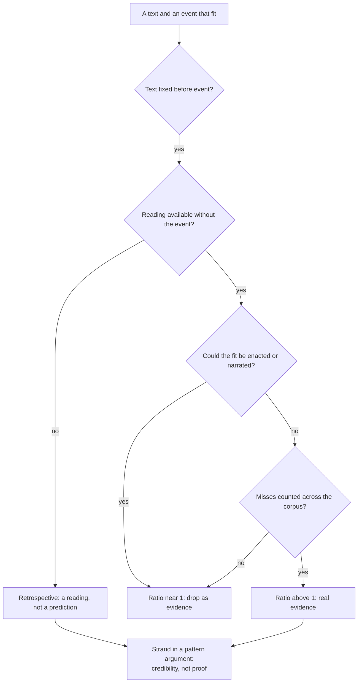

# Apologetics I · Lesson 6.1: The messianic claim, and how a prophecy argument works

> ⏱ ~15 min · Module 6: Christianity and Judaism · Builds on: [5.4 The appearances and the rival hypotheses](05-04-the-appearances-and-the-rival-hypotheses.md), [`new-testament` 1.2](../../new-testament/lessons/01-02-second-temple-judaism.md), [`old-testament` 6.4](../../old-testament/lessons/06-04-the-old-testament-in-light-of-the-new.md), [`patristics` 1.4](../../patristics/lessons/01-04-justin-martyr.md) · Unlocks: [6.2 The contested texts](06-02-the-contested-texts.md), [6.3 The Jewish reply, at full strength](06-03-the-jewish-reply-at-full-strength.md)

## Why this matters

"Jesus is the Messiah" is the oldest Christian claim and the one with the worst history behind it. It was argued first against Jews, from Jewish books, and the arguing hardened into contempt. This lesson does two things before Module 6 touches a single contested verse. It says what "messiah" meant to the Jews who first heard the word applied to Jesus. And it says what an argument from prophecy has to do to count as evidence at all. Most popular versions of that argument fail the test, and the lesson says so first.

## The idea

Hebrew *mashiach* means "anointed". The Bible gives the word to kings (David will not touch Saul, "the Lord's anointed": 1 Samuel 24:6 [DR 1 Kings 24:7]), to the high priest ("the priest that is anointed", Leviticus 4:3), and even to a Persian ("my anointed Cyrus", Isaiah 45:1). The Hebrew Bible almost never uses it as a title for a future deliverer, and Daniel 9:25–26 is the disputed case. By Jesus' day the hopes were plural, as [`new-testament` 1.2](../../new-testament/lessons/01-02-second-temple-judaism.md) showed. The *Psalms of Solomon* 17 hoped for a royal son of David. Qumran's *Community Rule* expected messiahs of Aaron and of Israel, a priest beside a king (1QS 9.11). Others hoped for the prophet like Moses (Deuteronomy 18:15), and many texts hoped for no messiah at all ([messiah](../reference.md#messiah)).

One thing was common to all of them. A messiah is known by what he does in history. A century after Jesus, the Jerusalem Talmud (Taanit 4, 68d) reports Rabbi Akiva hailing Bar Kosiba, leader of the revolt of 132–135, as the King Messiah; his pupil Shimon bar Yochai reports that Akiva read "a star shall rise out of Jacob" (Numbers 24:17) of him. A colleague answers that grass will grow on Akiva's cheeks before the son of David comes. The revolt failed, and with it the claim. Deuteronomy 18:22 gives the same test for a prophet: if what he foretells "cometh not to pass", the Lord has not spoken.

So an argument from prophecy is a claim about **fit**, between texts written earlier and a life lived later. The question this lesson asks is when such a fit counts as evidence.

## The other side

The Jewish objection to the Christian prophecy argument is as old as the argument, and its strongest form has four parts.

1. **Context.** Read in context, the Christian proof-texts are about something else. Hosea 11:1 remembers Israel's Exodus ([`old-testament` 6.4](../../old-testament/lessons/06-04-the-old-testament-in-light-of-the-new.md)). Isaiah 7:14 promises a sign to Ahaz in Ahaz's own crisis. Rashi's commentaries give the plain sense (*peshat*) verse by verse, and in his hands these texts mean Israel or the prophet's own day (on Isaiah 7:14, the prophet's wife). Isaac of Troki, a Karaite in Lithuania, built a whole treatise on the point: *Hizzuk Emunah* (*Faith Strengthened*, 1593). Its first part works through the passages Christians use as proofs and reads each one back into its chapter. Wagenseil printed it with a Latin translation and a refutation in 1681, which is how Christian Europe came to read it.
2. **Retrospect.** The Christian reading starts from its conclusion. Only someone who already believes in Jesus sees him in these verses, so the "fit" is produced by the reading.
3. **Text.** Several Christian proofs rest on the Greek (*parthenos* at Isaiah 7:14), or on words not in the Hebrew at all.
4. **The world.** The messianic tasks are concrete. The world is not redeemed, and a messiah who leaves it unredeemed has not done what the texts say a messiah does. [6.3](06-03-the-jewish-reply-at-full-strength.md) states this through Maimonides's criteria.

None of this calls the Christian reading stupid. It calls it a reading, not a proof. The Catholic Church's own Biblical Commission grants the second point. *The Jewish People and their Sacred Scriptures in the Christian Bible* (2001, no. 21) says Christians see the movement toward Christ retrospectively, starting from the apostolic preaching and not from the text alone. No. 22 calls the Jewish reading "a possible one".

## Source

Justin, *First Apology* 31 (*Ante-Nicene Fathers* vol. 1), on what Christians found in the prophets:

> In these books, then, of the prophets we found Jesus our Christ foretold as coming, born of a virgin, growing up to man's estate, and healing every disease and every sickness, and raising the dead, and being hated, and unrecognised, and crucified, and dying, and rising again …

This is the checklist form of the argument, set out in the 150s. The same chapter has Ptolemy ask *Herod* for the books, an anachronism of about two centuries: the ANF editors note that it was the high priest Eleazar.

## The argument

Reload the odds form from [`philosophical-method` 2.4](../../philosophical-method/lessons/02-04-weighing-evidence-in-odds-form.md). A fulfilment $E$ supports the claim $H$ ("Jesus is the one Israel's scriptures point to") only if the likelihood ratio $L = \Pr(E \mid H) / \Pr(E \mid \neg H)$ is well above 1.

**P1.** A text–event fit carries evidence only if it passes four tests. (i) The text was fixed before the event. (ii) The reading was available without knowing the event. (iii) Nobody who knew the text could have enacted the event, or written it into the story. (iv) The misses are counted along with the hits, across the whole corpus searched. *In words:* if the fit could come about without $H$, its ratio sinks to about 1.

**P2.** [Proof-texting](../reference.md#proof-texting), meaning single verses cited as predictions ticked off, fails (ii)–(iv) for most items. Riding into Jerusalem on a colt (Zechariah 9:9) can be done on purpose. A detail known only from a gospel that also quotes the verse could have been supplied by the narrator; Crossan's name for this is "prophecy historicized" (*Who Killed Jesus?*, 1995). And the verses were chosen after the fact. The New Testament admits the retrospect itself: the disciples "did not know at the first", but "when Jesus was glorified, then they remembered that these things were written of him" (John 12:16).

**P3.** The Christian claim is not a checklist. It is that the scriptures' recurring patterns find one unity in one person. Exodus and the beloved son, the suffering righteous one, the Davidic king, the priest and the prophet like Moses all point to him (Luke 24:27, 44; Dei Verbum 16). Its tools are [typology](../reference.md#typology), where the events themselves point forward, and the disputed [*sensus plenior*](../reference.md#sensus-plenior), a fuller meaning God intended. [`old-testament` 4.3](../../old-testament/lessons/04-03-the-servant-of-the-lord.md) owns the dispute over how far either may go.

**P4.** Some of the pattern was forced on the first Christians, not chosen by them. Second Temple hopes kept the figures apart (Qumran's priest beside a king). The Church fused them because of events it did not control: a Messiah who was executed. That was "unto the Jews indeed a stumblingblock" (1 Corinthians 1:23), and nobody shaping a story to fit would have picked it. *In words:* the events came first and the texts were searched afterwards, so for these elements test (iii) is passed.

**P5.** *Dei Filius* ch. 3 (1870) names prophecies, with miracles, among the exterior signs of revelation ([`fundamental-theology` 2.2](../../fundamental-theology/lessons/02-02-credibility-and-the-preambles-of-faith.md)). Its third canon defines (rung 1) that revelation *can* be made credible by such signs. It does not certify any particular argument.

**∴ C.** Done well, the [prophecy argument](../reference.md#prophecy-argument) is a modest strand of a cumulative case, a [motive of credibility](../reference.md#motives-of-credibility) and not a demonstration. Its ratio is above 1 only for the elements Christians did not control, and only as an [inference to the best reading](../../philosophical-method/lessons/02-01-inference-to-the-best-explanation.md) of the whole.

**Concession.** The classic lists of "300 fulfilled prophecies", and the calculations built on them, are bad arguments. Peter Stoner's *Science Speaks* puts the chance that one man fulfilled eight prophecies at 1 in $10^{17}$. The lists pass verses that are not predictions in context, they multiply items that are not independent, and they never count the misses. A Jewish reader who calls them proof-texting is right, and Justin's checklist above is their ancestor.

**Where the argument is weakest.** In P3. "Unity" is judged from inside a reading. A Jewish reader finds Scripture's unity in Torah and in Israel's covenant, and the Biblical Commission calls the two readings "irreducible" (no. 22). So the ratio for P3 depends on what you already count as the book's centre, and the prior gets in by the back door.

**Levels.** *Dei Filius* can. 3: rung 1, a capacity claim. Dei Verbum 15–16: authentic magisterium, rung 3 ([`old-testament` 6.4](../../old-testament/lessons/06-04-the-old-testament-in-light-of-the-new.md)). The 2001 Biblical Commission document is advisory and not a magisterial act. How fulfilment works, whether as typology, *sensus plenior* or something else, is freely disputed (rung 5).

## The argument map

## Worked examples

**Example 1 (clean): the colt.** A tract counts the entry into Jerusalem on a colt (Mark 11:1–7; Zechariah 9:9) as a prediction fulfilled against long odds. The objection says it fails test (iii): anyone who knew Zechariah could do it. Grant that in full, because Mark grants it: Jesus *sends* for the colt. As evidence of divine foreknowledge, the item has a ratio near 1. But it is good evidence of something else, namely that Jesus staged a royal sign on purpose, which bears on what he claimed to be. The argument loses a fake strand and keeps a real one.

**Example 2 (hard): Justin's missing verses.** In the *Dialogue with Trypho* 71–73, Justin charges that Jewish teachers cut passages from the Scriptures. One of his examples is "the Lord hath reigned *from the wood*" in Psalm 96:10 [DR 95:10]. Check his evidence. "From the wood" stands in no Hebrew text, and the Douay–Rheims, translating the Vulgate, has "the Lord hath reigned" without it. The Jeremiah verse he says was removed (11:19) stands in Jeremiah to this day. His "Esdras" saying is, in the ANF editors' words, "not known" in origin. Trypho's answer is restrained: whether anything was erased "God knows; but it seems incredible" (ch. 73). Here the argument strains twice. First, Justin's proofs outran his texts. Second, the courteous Trypho is Justin's own composition. Justin wrote both voices, so the dialogue is evidence of what Justin thought Jews should say, not a record of Jewish argument (Boyarin's framing, in [`church-history` 1.2](../../church-history/lessons/01-02-bishops-canon-and-the-parting-of-the-ways.md)). The first sustained Christian prophecy argument cannot be used as a report of the other side.

## Watch out

- **You might think "the Jews rejected the Messiah" describes the first century,** but "messiah" was not one job description, and no widely attested expectation was of a crucified one. Not recognizing Jesus was reading the texts the way most of their readers did.
- **You might think the Church teaches that prophecy proves Christianity,** but *Dei Filius* defines only that signs *can* make revelation credible (rung 1). The Biblical Commission (2001, no. 21) says an apologetic that overstressed prophecy as proof should be discarded, and that document is advisory. Neither certifies any particular argument.
- **You might think conceding proof-texting gives the argument away,** but the concession removes P2's items and leaves P3–P4 standing. Whether P3 can carry much weight is the real question.

## One-liner

> A prophecy counts as evidence only where the fit could not have been read in, acted out or written up after the fact, and so the Christian claim is a pattern seen in hindsight: a reason to believe, and no proof.

## Problems

**P1 (🟢) *(Diagnose · Formal.)*** An invented tract (nobody wrote it; it is built for this problem):

> "Five prophecies, with the chance of each coming true by accident: born of David's line (1 in 10); entered Jerusalem on a donkey (1 in 50); betrayed for thirty pieces of silver (1 in 1,000); silent before his accusers (1 in 20); crucified (1 in 100). Multiply them: one chance in a billion. Chance is ruled out. Jesus is the Messiah."

(a) Verify the tract's product, and name the assumption that licenses multiplying. *(Formal.)*
(b) Re-run it with three corrections. The donkey entry and the silence could be enacted by someone who knew the texts: use 1 in 2 for each. The thirty pieces are known only from a gospel that quotes the text: use 1 in 5. What is the corrected figure, and by what factor did the tract overstate? *(Formal.)*
(c) Name two further errors that no correction of the five numbers can repair. Two sentences. *(Exegetical.)*

**P2 (🟡) *(Apologetic: (a) Exegetical, graded first · (b) reply.)*** Matthew 2:17–18 says Herod's massacre fulfilled Jeremiah. Jeremiah 31:15–17 (Douay–Rheims):

> 31:15. Thus saith the Lord: A voice was heard on high of lamentation, of mourning, and weeping, of Rachel weeping for her children and refusing to be comforted for them, because they are not. 31:16. Thus saith the Lord: Let thy voice cease from weeping, and thy eyes from tears: for there is a reward for thy work, saith the Lord: and they shall return out of the land of the enemy. 31:17. And there is hope for thy last end, saith the Lord: and the children shall return to their own borders.

(a) State the Jewish objection to Matthew's use of this text as its defenders would state it, citing the words that carry it. (b) Reply, opening with a **named concession**. 150 words or fewer in total.

**P3 (🔴, optional) *(Find the crux · Evaluative.)*** A Christian says the fusion of king, priest and suffering figure in one person is evidence, because no one shaping a story would choose it. A Jewish critic says the fusion is exactly what the Christian reading *produces*. (a) Name the single premise the two disagree over. (b) Say what evidence would move it, and in which direction. 100 words or fewer.

Solutions

**P1** *(Diagnose · Formal)*

(a) $10 \times 50 \times 1{,}000 \times 20 \times 100 = 10^9$, so 1 in a billion is correct arithmetic. Multiplying is licensed only if the five items are **independent**: each one's chance unaffected by the others and by anyone's knowledge of the texts.

(b) Corrected: $10 \times 2 \times 5 \times 2 \times 100 = 20{,}000$, so 1 in 20,000. Overstatement factor: $10^9 / 20{,}000 = 50{,}000$. (Checked in `verify-af/06-01.py`.)

(c) **Must hit, strict:** any two of the following. (i) The product is $\Pr(E \mid \text{coincidence})$ alone, not a likelihood ratio: it needs $\Pr(E \mid H)$ and a prior before it says anything about $H$, and "chance is ruled out" does not deliver "Messiah" (the rivals are enactment, narration and retrospective reading, not chance). (ii) **Selection:** the five texts were picked *because* they matched a known life, out of a large corpus, with the misses uncounted, so the probability of finding *some* matches is far higher than the product. (iii) Items read as predictions are not predictions in context (test ii), so they should not be counted at all.

**Wrong turns:** treating the corrected 1 in 20,000 as now sound. Arguing only about whether "1 in 50" is the right number for the donkey, which accepts the tract's frame.

---

**P2** *(Apologetic: (a) Exegetical, graded first · (b) reply)*

**Accept:** any reply that keeps the concession and distinguishes prediction from typology, whatever its verdict.

**Must hit, strict (a), graded first:**

- In context the verse is about the **exile**: Rachel, mother of Joseph and Benjamin, mourns her children as they go "out of the land" into captivity (31:18 names Ephraim "when he went into captivity").
- The passage turns at once to **consolation**: "they shall return out of the land of the enemy" (31:16), "the children shall return" (31:17). It promises return, not a massacre.
- Therefore Matthew reads it out of context, and the "fulfilment" is a reading imposed in retrospect, not a prediction come true. This is the classic Jewish method (*peshat*, Rashi; Troki's *Hizzuk Emunah*), and it is stated as a reading, not as an insult.

**Must hit (b):**

- A **named concession**: Jeremiah 31:15 does not predict Herod's massacre, and as a prophecy-proof Matthew 2:18 has a ratio of about 1.
- The move to **typology**: Matthew's "fulfilled" works as pattern. Israel's children are lost and then restored, and this recurs around the child who is Israel's restoration. The claim is about pattern (P3), not prediction (P2).
- Honesty about the cost: the typology persuades only someone who already sees Jesus as the restoration. It is a reading, not evidence for an outsider.

**Wrong turns:** stating (a) as "the Jews deny Jesus is in the Old Testament", which is no reading of this text. Defending the verse as a literal prediction. Replying that the Church has defined Matthew's reading: no Church act defines how fulfilment works (rung 5).

**Model answer, one of several:** (a) Read in its chapter, Rachel weeps for the children of Ephraim taken into exile, and God at once tells her to stop, "for … they shall return out of the land of the enemy". Jeremiah promises restoration after exile. Matthew lifts one verse into a massacre that it neither foresees nor fits, reading it backward from Jesus. (b) Concession: as a prediction, this fails, and no Christian should cite it as evidence. Matthew's "fulfilled" makes sense only as typology. Israel's children lost and promised return becomes the frame for the child Matthew presents as Israel in person. That is a reading, persuasive only from inside, so it belongs to the pattern claim and adds nothing to the odds.

---

**P3** *(Find the crux · Evaluative)*

**Must hit, strict (a):** the crux is whether the fusion was **forced by events** (an execution the community did not choose, and then scripture searched to explain it) or **generated by the reading** (a community fusing figures freely to fit its hero). It is a disagreement about test (iii), not about the texts.

**Must hit, any verdict (b):** evidence about the order of events and interpretation. Early, pre-literary evidence that the crucifixion was an embarrassment *before* the texts were applied (1 Corinthians 1:23, "stumblingblock") pushes toward "forced". Evidence that the fused figure already existed in pre-Christian Judaism, or that the narratives were built from the texts (Crossan's "prophecy historicized"), pushes toward "produced".

**Wrong turns:** naming "whether Jesus is the Messiah", which is the conclusion, not a premise. Naming "whether Isaiah 53 is about an individual", which belongs to 6.2 and does not separate these two positions.

**Model answer, one of several:** (a) Whether the fusion of royal and suffering figures was imposed on the first Christians by an event they did not control, or freely built by their reading. (b) Evidence that the crucifixion was felt as a scandal before any proof-texts were attached would favour "imposed". Evidence of narrative details composed out of the texts would favour "produced".

## Flashback

**From Lesson [5.4](05-04-the-appearances-and-the-rival-hypotheses.md) (The appearances and the rival hypotheses):** *(Exegetical (a) · Evaluative (b): apply to a new case.)* An invented movement (it never existed). In the 1890s a healer's followers expect him to inaugurate a new age; instead he dies in prison. Within a year his followers (i) keep meeting and teaching his sayings, (ii) recruit more vigorously than before, and (iii) begin saying he has been "taken up" to God and will return as judge.

(a) Which of (i)–(iii) does cognitive dissonance theory, as Festinger's team and Gager use it, explain, and what does the lesson say it cannot explain by itself? Two sentences. (b) Any verdict: does (iii) show the lesson's dissonance premise is wrong? 80 words or fewer.

Solution

**Must hit, strict (a):**

- Dissonance explains (i), the persistence of belief after disconfirmation, and (ii), the increase in proselytizing, which is the pattern *When Prophecy Fails* reported.
- The lesson's limit: dissonance explains why a belief persists, not how a new and specific claim is formed; for Easter, that one man has been raised ahead of the general resurrection.

**Must hit, any verdict (b):**

- Notice that (iii) is a new belief, so the case is a precedent the critic can use: dissonance-stressed groups do produce new claims.
- Notice what kind of claim (iii) is: "taken up" and coming judge is exaltation language, which is what Wright's objection says a crushed hope or a vision would naturally yield, not "raised" in the body.
- Say what follows either way: either the case refutes the premise, or it confirms that the distinctive datum is the word "raised".

**Wrong turns:** crediting dissonance with (iii) as if Festinger's theory predicted the content of new beliefs; treating the invented movement as evidence about the first Christians directly; calling the followers deluded or dishonest.

**Model answer (b), one of several:** Not quite. The case does show that a disconfirmed group can form a new belief, not merely keep an old one, so the premise should be stated more carefully. But the belief formed is exaltation: taken up, coming as judge. That is the outcome Wright's objection predicts. What the case does not supply is a dissonance route to "raised from the dead", so the lesson's point survives in a narrower form.

## Connections

- **Backward:** the plural messianic hopes are [`new-testament` 1.2](../../new-testament/lessons/01-02-second-temple-judaism.md); the pattern reading and the Biblical Commission's "possible" Jewish reading are [`old-testament` 6.4](../../old-testament/lessons/06-04-the-old-testament-in-light-of-the-new.md); Justin as a text is [`patristics` 1.4](../../patristics/lessons/01-04-justin-martyr.md). The odds form and independence come from [`philosophical-method` 2.4](../../philosophical-method/lessons/02-04-weighing-evidence-in-odds-form.md); [5.4](05-04-the-appearances-and-the-rival-hypotheses.md) ran rival hypotheses against one body of evidence the same way.
- **Forward:** [6.2](06-02-the-contested-texts.md) runs these tests on Isaiah 53, Daniel 7, Psalm 110 [DR 109], Isaiah 7:14 and Zechariah 12:10. [6.3](06-03-the-jewish-reply-at-full-strength.md) states the fourth objection (the unredeemed world) through Maimonides and Nahmanides. [6.4](06-04-supersessionism-nostra-aetate-and-the-jewish-people.md) faces what this argument was used for.
- **Sideways:** "the texts were searched after the event" is the selection effect of statistics, the same error as testing many hypotheses and reporting the hit. Akiva's reading of Numbers 24:17 shows that Jewish tradition read texts messianically too, and tested the reading against history.
