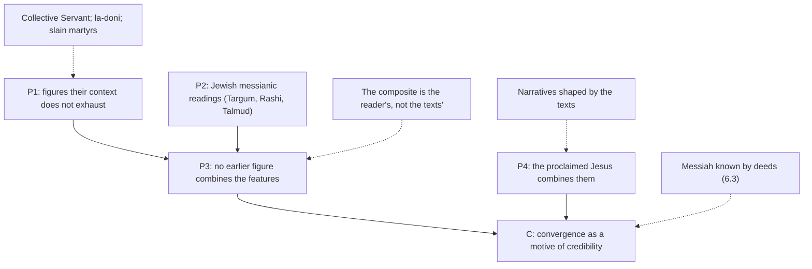

# Apologetics I · Lesson 6.2: The contested texts

> ⏱ ~15 min · Module 6: Christianity and Judaism · Builds on: [6.1 The messianic claim](06-01-the-messianic-claim-and-how-a-prophecy-argument-works.md), [`old-testament` 4.2](../../old-testament/lessons/04-02-isaiah-and-immanuel.md), [4.3](../../old-testament/lessons/04-03-the-servant-of-the-lord.md), [5.1](../../old-testament/lessons/05-01-the-psalms.md), [6.3](../../old-testament/lessons/06-03-daniel-and-apocalyptic.md) · Unlocks: [6.3 The Jewish reply, at full strength](06-03-the-jewish-reply-at-full-strength.md)

## Why this matters

[6.1](06-01-the-messianic-claim-and-how-a-prophecy-argument-works.md) said what a good [prophecy argument](../reference.md#prophecy-argument) must do: a pattern, not a checklist. This lesson runs it on six texts. `old-testament` has already laid the readings side by side and declined to choose. Here we choose, argue the Christian reading, and say exactly which Hebrew word each reading turns on and where the argument is weakest.

## The idea

Think of six witnesses, each describing someone. The Jewish reader says they describe five or six different people: Israel in exile, a king, the prophet's son, martyrs of a future war. The Christian reader says the descriptions converge on one face. They dispute whether the convergence is in the texts or in the eye of the reader who already knows whom he is looking for.

The texts, with the sibling lesson that reads each:

- **Isaiah 52:13–53:12**, the fourth Servant Song ([OT 4.3](../../old-testament/lessons/04-03-the-servant-of-the-lord.md)).
- **Daniel 7:13–14**, "one like a son of man" ([OT 6.3](../../old-testament/lessons/06-03-daniel-and-apocalyptic.md)).
- **Psalm 110 [DR 109]**, "The Lord said to my Lord" ([OT 5.1](../../old-testament/lessons/05-01-the-psalms.md)).
- **Isaiah 7:14**, the *almah* ([OT 4.2](../../old-testament/lessons/04-02-isaiah-and-immanuel.md)).
- **Micah 5:2 [Hebrew 5:1]**, Bethlehem ([OT 4.5](../../old-testament/lessons/04-05-the-book-of-the-twelve.md)).
- **Zechariah 12:10**, which no sibling reads. It is the text this lesson adds:

> And I will pour out upon the house of David, and upon the inhabitants of Jerusalem, the spirit of grace, and of prayers: and they shall look upon me, whom they have pierced: and they shall mourn for him as one mourneth for an only son... (Zech 12:10, DR)

> And again another scripture saith: They shall look on him whom they pierced. (John 19:37, DR)

The Hebrew is *ve-hibbitu elay et asher daqaru*: literally "and they shall look to me, *et asher* they pierced". Then *ve-sapedu alav*, "and they shall mourn for **him**". The verse moves from "me", God speaking, to "him". John's quotation has "him" throughout.

## The other side

The Jewish reading, text by text, as its own commentators give it.

**Isaiah 53 is Israel.** The context calls Israel God's servant repeatedly (41:8; 44:1; 49:3). The "we" of chapter 53 are the nations, astonished that the people they despised suffered for them. Rashi reads 53:8 as the nations speaking of Israel's exile. Ibn Ezra glosses the last word of 53:8, *lamo*, as *lahem*, "to them": the stroke fell on them, a plural. Rashi takes 53:10, "he shall see seed", at its word: children. Origen already met the collective reading around 248 ([OT 4.3](../../old-testament/lessons/04-03-the-servant-of-the-lord.md)); it is not a dodge invented against Christians. See [collective reading](../reference.md#collective-reading).

**Daniel 7 is messianic, and the Messiah is a man.** Rashi on 7:13: "he is the King Messiah" (the translation of [OT 6.3](../../old-testament/lessons/06-03-daniel-and-apocalyptic.md)). And the angel's interpretation gives the kingdom to "the saints of the most high", a people (7:18, 27). A Messiah, yes; a divine one, no.

**Psalm 110 is spoken to a human lord.** The Masoretic vowels read *la-doni*, "to my lord", the form used for human masters, not *Adonai*. Rashi, following the Midrash on Psalms, reads it of Abraham, whom the Hittites call "my lord" (Gen 23:6). Many modern scholars, Jewish and Christian, read a royal oracle: a court prophet speaks God's word to the Davidic king.

**Isaiah 7:14 is a sign for Ahaz.** *Almah* means a young woman; the sign has a deadline inside Ahaz's reign (7:16). Rashi makes her the prophet's wife (8:3–4).

**Zechariah 12:10 mourns the slain.** Rashi: they will look to God to complain about those of them whom the nations ran through and killed in their exile. On this reading *et asher* means "concerning those whom", and the "him" is whoever was slain. Contemporary Jewish writers press the same construal and call John's "him" a mistranslation. Where the Talmud does read a single figure here (*Sukkah* 52a), one opinion makes the mourning for the Messiah son of Joseph, killed in battle before the final redemption, and the other for the evil inclination, slain at last. Neither is the Messiah son of David, and neither is divine.

Behind all six stands the decisive point, stated fully in [6.3](06-03-the-jewish-reply-at-full-strength.md): the Messiah is known by what he does in history, and the world is not yet redeemed.

## The argument

1. **P1.** Several of these texts, read in their own setting, describe a figure their immediate context does not exhaust: a Servant sent *to* Israel and innocent (Isa 49:5–6; 53:9); one like a son of man who comes "with the clouds", as God himself rides them (Dan 7:13; compare Ps 104:3 [DR 103:3]; Isa 19:1), and receives an everlasting dominion; a king who is also "a priest for ever" (Ps 110:4); one pierced, mourned like an only son (Zech 12:10).
2. **P2.** Jewish interpretation independent of the Church read several of them messianically: the Targum's "my servant the Messiah" (Isa 52:13), Rashi on Daniel 7:13 and on Micah, the Talmud's slain Messiah son of Joseph at Zechariah 12:10. *In words:* the messianic reading is not a Christian invention.
3. **P3.** No figure in Israel's history before Jesus combines suffering and exaltation, Davidic kingship and everlasting priesthood, being pierced and being mourned by Jerusalem.
4. **P4.** The figure the New Testament proclaims does combine them: of David's line, crucified, proclaimed raised and seated at the right hand (Mark 14:62 joins Psalm 110 to Daniel 7).
5. **∴ C.** The convergence is a [motive of credibility](../reference.md#motives-of-credibility) that the pattern of Israel's scriptures finds its unity in Jesus. It is not a demonstration ([`fundamental-theology` 2.2](../../fundamental-theology/lessons/02-02-credibility-and-the-preambles-of-faith.md)).

**Concession.** On Isaiah 7:14 the Hebrew *almah* means a young woman of marriageable age. It does not say "virgin". The virginal sense rests on the Greek translators' *parthenos* and on Matthew's reading of it (Matt 1:23). Jerome, defending the Christian reading, read *almah* in his Hebrew and argued about what it implies ([OT 4.2](../../old-testament/lessons/04-02-isaiah-and-immanuel.md)). See [almah and parthenos](../reference.md#almah-and-parthenos).

**Levenson's pattern.** Jon D. Levenson (*The Death and Resurrection of the Beloved Son*, 1993; already cited on the *akedah* in [OT 1.2](../../old-testament/lessons/01-02-the-senses-of-scripture.md)) traces a pattern through Israel's scriptures: the beloved son, given up to death and restored (Isaac, Joseph; Israel itself as God's "firstborn", Exod 4:22). He argues that the Gospels' and Paul's portrait of Jesus was built from Jewish reflection on that pattern. The christological step is in the texts. The Greek Genesis renders Isaac as the "beloved" son (22:2), the word the voice uses at Jesus's baptism (Mark 1:11). Paul's "He that spared not even his own Son" (Rom 8:32) echoes "hast not spared thy only begotten son" (Gen 22:16). Zechariah's "only son" and "firstborn" are the same pattern. But Levenson concludes that Judaism and Christianity are **sibling rivals** for one blessing, not parent and child. Neither side can wave him away. The Christian cannot call the cross foreign to Israel's scriptures, and the Jew cannot call it unscriptural. Yet the pattern belongs to Israel too, so it does not single out Jesus. See [beloved son pattern](../reference.md#beloved-son-pattern).

**Psalm 110 and the fuller sense** (the question [OT 5.1](../../old-testament/lessons/05-01-the-psalms.md) left open). Jesus's question in Mark 12:35–37 assumes David speaks: "David himself calleth him Lord." If the literal sense is a court oracle to the king, the Christian reading needs a [sensus plenior](../reference.md#sensus-plenior): an oracle of enthronement and endless priesthood that God meant to be filled full in the Son. That is a legitimate Catholic option, freely disputed (rung 5). But it has a price in an argument: a fuller sense is visible only from the side of fulfilment. It explains how a Christian reads the psalm; it cannot be a premise against a Jewish reader.

**Micah 5:2.** Here the two sides agree the verse is messianic: the Targum and Rashi read "the Messiah, son of David". They part on *miqqedem mimei olam*, "from of old, from days of old" (DR "from the days of eternity"). Rashi reads it of the Messiah's name existing before the sun (Ps 72:17 [DR 71:17]); the Douay's note reads the Son's eternal generation, a spiritual reading. And whether Jesus was born in Bethlehem is itself doubted by many critical scholars (a report), who think the birth narratives placed him there to fit.

**Mark the levels.** That Christ fulfils the Servant prophecies is Church teaching, the New Testament's own reading restated in CCC 601. The virginal conception is defined dogma (rung 1 on [the ladder](../../fundamental-theology/lessons/04-04-the-ladder-of-doctrinal-authority.md)). *How* any of these texts relates to its prophet's meaning is freely disputed. The Biblical Commission's 2001 document calls the Jewish reading "possible" (no. 22), and it is advisory, not magisterial ([levels of authority](../reference.md#levels-of-authority)). No Church act defines the literal referent of any of these texts.

**Where the argument is weakest.** P3. The composite figure is assembled by a reader who already believes P4. Taken one at a time, each text has a natural literal referent in its own setting, and the Jewish reading usually has the plainer Hebrew. The convergence is real only if the texts are read *together* as one pattern. That is a hermeneutical decision the Jewish reader rejects, not a fact both sides see. P4 adds a second weakness: the narratives that show the convergence were written by people reading these very texts ([6.1](06-01-the-messianic-claim-and-how-a-prophecy-argument-works.md)).

## The argument map

Solid arrows support; dashed arrows attack. The heaviest attack, on P3, is the one the argument cannot answer from the texts alone.

## Worked examples

**Example 1 (clean): Isaiah 7:14.** The objection: *almah* means young woman, and the sign is for Ahaz. The reply concedes both. Matthew's "fulfil" means *fill full*, and his formula quotations are mostly typological ([`new-testament` 2.2](../../new-testament/lessons/02-02-matthew.md)). The sign of a child, "God with us", given to David's house in a crisis, is filled full in a child of David's house in whom God is with us. The virginal conception rests on Matthew 1 and Luke 1, not on winning the *almah* argument. So the concession costs the argument nothing. What it loses is the cheap version, "Isaiah predicted a virgin birth", which was never sound.

**Example 2 (hard): Zechariah 12:10.** The Christian argument: the speaker is God ("I will pour out"), and God says "they shall look to me whom they pierced". God is pierced in the one who is pierced. John 19:37 reads it so. The strain is in the Hebrew. *Et asher* can mean "concerning whom", which yields Rashi's reading with no paradox at all. The verse's own "him" supports a second figure. And John's "him" smooths the very tension the Christian reading needs. The Talmud's slain Messiah son of Joseph shows that a pierced, mourned figure *could* be read messianically. But it is a different figure from the son of David, and it stands beside a non-messianic opinion. Verdict: Zechariah 12:10 is a strong text *for those who already read the cross into it*, and a weak premise against those who do not.

## Watch out

- **You might think the Church has defined that Isaiah 53 or Psalm 110 literally predicts Jesus, but actually** fulfilment in Christ is Church teaching while the mode (prediction, fuller sense, type) is freely disputed, and the Commission's 2001 document is advisory. Overstating that level is graded as an exegetical error.
- **You might think the Jewish readings were invented to evade Christian claims, but actually** Origen met the collective Servant around 248, and on Daniel 7 and Micah, Rashi himself reads messianically. Calling the Jewish reading evasive is a caricature, and it fails an apologetic (a).
- **You might think P2 proves the Christian reading, but actually** it proves only that the messianic reading is old and Jewish. A Messiah who is human and still to come fits P2 as well.

## One-liner

> Read one by one, the contested texts mostly favour the Jewish reading of the Hebrew; read as one pattern, they converge on Jesus, and the whole dispute is whether that pattern is in the texts or in the reader.

## Problems

**P1 (🟢)** *(Exegetical)* For each text, name the Hebrew word or phrase the dispute turns on, and give the Jewish and the Christian reading of it in one line each: (i) Psalm 110:1 [DR 109:1]; (ii) Isaiah 53:8; (iii) Zechariah 12:10. Then (iv) in one sentence, give the level of authority of the claim "Isaiah 7:14's *almah* means virgin".

**P2 (🟡)** *(Apologetic: (a) Exegetical, graded first · (b) reply)* (a) State the Jewish reading of Psalm 110:1 [DR 109:1] as its own commentators give it, medieval and modern. **Three sentences or fewer.** (b) Reply to it in 150 words or fewer, opening with a **named concession**, and say what the reply can and cannot do against a Jewish reader.

**P3 (🔴)** *(Diagnose · Evaluative)* An invented debate opening:

> "The Jews changed Isaiah's 'virgin' to 'young woman' after Christ, to escape the prophecy. Rashi made up the idea that the Servant is Israel to dodge Christian arguments. Their own Talmud admits that the pierced one of Zechariah 12:10 is the Messiah. And the Church has infallibly defined that every one of these texts speaks of Jesus. Case closed."

(a) Identify the errors, each in one sentence. (b) Name the one claim with a true core and state that core exactly. **120 words or fewer in all.**

Solutions

**P1** *(Exegetical)*

**Must hit, strict:**

- (i) *la-doni*, "to my lord". Jewish: the vowels give the form for a human lord, so the psalm addresses Abraham (Rashi) or the king. Christian: David calls the Messiah "my Lord" (Mark 12:35–37), a lord greater than David, read literally or as a fuller sense.
- (ii) *lamo*, "to them" or "to him". Jewish: Ibn Ezra reads *lahem*, "to them", so the stroke fell on Israel, collectively. Christian: a poetic singular, "to him", an individual Servant.
- (iii) *elay et asher daqaru*, "to me, (concerning) whom they pierced", then "mourn for him". Jewish: they look to God about those the nations slew (Rashi), *et asher* as "concerning whom". Christian: God is pierced in the one pierced; John 19:37 reads "him".
- (iv) No level: it is a claim about a Hebrew word, and the Church teaches no such thing. The virginal conception is rung 1, and the fulfilment of 7:14 in it is taught (CCC 497), but the meaning of *almah* is a philological question.

**Wrong turns:** calling *la-doni* "Adonai" (a divine name); saying the Church defined that *almah* means virgin; giving only one reading per text.

---

**P2** *(Apologetic: (a) Exegetical, graded first · (b) reply)*

**Must hit, strict (a), graded first:**

- The Masoretic vowels read *la-doni*, the form for a human master, not the divine *Adonai*.
- Rashi, following the rabbis and the Midrash on Psalms, reads it as God's word to Abraham, whom the Hittites call "my lord" (Gen 23:6).
- A modern reading, Jewish and Christian: a royal oracle in which a court prophet speaks God's word to the Davidic king.

**Must hit (b):**

- Named concession: *la-doni* is the human-lord form, and on the literal sense the royal-oracle reading is natural.
- A route the reply actually uses: the fuller sense or typology (an oracle of enthronement and endless priesthood filled full in the Son), or Mark 12:35–37's argument from Davidic authorship (with the cost that this authorship is now freely disputed among Catholics, [OT 5.1](../../old-testament/lessons/05-01-the-psalms.md)).
- The limit: a fuller sense explains a Christian reading from fulfilment; it cannot serve as a premise a Jewish reader must accept. A reply that says so passes whatever its verdict.

**Wrong turns:** "Jewish interpreters ignore Psalm 110" (Rashi reads it of Abraham); reading *la-doni* as a divine title; treating the 1910 Commission's ascription to David as still binding.

**Model answer (b), one of several:** Concession: *la-doni* is the form for a human lord, and read in its own setting the psalm is a royal oracle to a Davidic king. The Christian reading does not need to deny that. It holds that the oracle promises the king more than any king of Judah received: a seat at God's right hand and a priesthood "for ever according to the order of Melchisedech". The New Testament reads that surplus as filled full in Jesus (Mark 12:35–37; Acts 2:34–35; Hebrews). That is a fuller sense or a type, and a Catholic may hold it. But it is visible only from the fulfilment. Against a Jewish reader it can show that the Christian reading is coherent and continuous with the psalm's royal hope. It cannot show that the psalm requires it.

---

**P3** *(Diagnose · Evaluative)*

**Accept:** any wording that makes each correction and isolates the Zechariah core.

**Must hit, strict (a):**

- Isaiah 7:14: the Hebrew *almah* is the word the Christian reading itself had to argue about. Jerome read it and argued its meaning, and Trypho already read "young woman" in the second century; nothing was changed.
- Rashi: the collective Servant is older than him. Origen met it from Jewish scholars around 248.
- The Church: fulfilment in Christ is Church teaching, but no act defines the literal referent of these texts; how they are fulfilled is freely disputed.

**Must hit, any verdict (b):**

- The Zechariah claim has a true core: the Talmud (*Sukkah* 52a) gives one opinion that the mourning of 12:10 is for the Messiah son of Joseph, who is slain.
- Exactly stated: that figure dies in battle before the redemption, is not the Messiah son of David, and stands beside a second opinion (the evil inclination). Rashi's own plain sense is the slain of Israel.

**Wrong turns:** denying the Talmudic passage exists; treating "case closed" as only a tone problem when it is an overstated level; missing that the opening fails the respect rubric as well as the facts.

**Model answer:** (a) Nothing was changed: Christians from Jerome on argued about what the Hebrew *almah* means. The collective Servant is not Rashi's invention; Origen met it around 248. The Church teaches fulfilment in Christ but has defined no literal referent, and the mode is freely disputed. (b) The Talmud does read 12:10 of a slain Messiah, the son of Joseph, in one opinion; but he falls in war, is not the son of David, and another opinion reads the verse of the evil inclination.

## Flashback

**From Lesson [5.5](05-05-weighing-it-the-bayesian-apologetic-and-its-limits.md) (Weighing it: the Bayesian apologetic and its limits):** *(Formal (a)–(c) · Exegetical (d).)* Invented case and numbers (nobody argued this). Corvin, an apologist, has five witnesses to a reported appearance. Four belong to one household and spent the night together before any of them spoke. He credits each of the four with a likelihood ratio of 10 and multiplies, then adds an outsider, a former opponent, at 50. He takes prior odds of $1:10{,}000$ for illustration.

(a) Compute Corvin's total $L$, the posterior odds and the probability (three decimals).
(b) A critic counts the household as one testimony worth 10. Recompute.
(c) Keeping the outsider at 50 and the prior at $1:10{,}000$, what factor must the household carry as a group for even posterior odds? How many of Corvin's per-witness factors of 10 is that worth?
(d) In one sentence: what question decides where between (a) and (b) the truth lies, and why does no arithmetic answer it?

Solution

**Worked arithmetic:**

(a) $L = 10^4 \times 50 = 500{,}000$. Posterior odds $= \tfrac{1}{10{,}000} \times 500{,}000 = 50:1$, probability $\tfrac{50}{51} \approx 0.980$.

(b) $L = 10 \times 50 = 500$. Posterior odds $= \tfrac{500}{10{,}000} = 1:20$, probability $\tfrac{1}{21} \approx 0.048$.

(c) Even odds need $L = 10{,}000$, so the household must carry $\tfrac{10{,}000}{50} = 200$. That is between $10^2$ and $10^3$: a bit more than two of Corvin's independent witnesses, not four.

**Must hit, strict (d):**

- The question is 5.5's independence question: would the second household member's report have appeared if the first's had not? It concerns how the testimony arose (did they compare notes during the night), which is a historical judgment about dependence structure. The multiplication only encodes an answer already given to it.

**Wrong turns:** reporting Corvin's $0.980$ as what the evidence shows, when it is conditional on an illustrative prior and on full independence (the McGrews' factor-versus-posterior distinction); reading odds of $1:20$ as a probability of $0.05$ instead of $\tfrac{1}{21}$; answering (c) with 2,000 by dividing by the prior instead of the outsider's factor; saying in (d) that the critic is right because "one household is one witness" (that is also an answer to the dependence question, not arithmetic).

**Model answer (d):** Whether the household's four reports arose independently or from one shared conversation is a question about how the testimony came to be, and only historical argument about that can place the factor anywhere between 10 and 10,000.

## Connections

- **Backward:** the readings laid side by side are [`old-testament` 4.2](../../old-testament/lessons/04-02-isaiah-and-immanuel.md), [4.3](../../old-testament/lessons/04-03-the-servant-of-the-lord.md), [5.1](../../old-testament/lessons/05-01-the-psalms.md), [6.3](../../old-testament/lessons/06-03-daniel-and-apocalyptic.md) and [4.5](../../old-testament/lessons/04-05-the-book-of-the-twelve.md). The pattern-not-checklist test is [6.1](06-01-the-messianic-claim-and-how-a-prophecy-argument-works.md). Matthew's "fulfil" is [`new-testament` 2.2](../../new-testament/lessons/02-02-matthew.md).
- **Forward:** [6.3](06-03-the-jewish-reply-at-full-strength.md) states the Jewish reply in full, with Maimonides's criteria and Nahmanides. [6.4](06-04-supersessionism-nostra-aetate-and-the-jewish-people.md) asks what "fulfilment" language costs the Jewish people.
- **Sideways:** the senses of Scripture, including the [typology](../reference.md#typology) the argument leans on, are [`old-testament` 1.2](../../old-testament/lessons/01-02-the-senses-of-scripture.md) and [6.4](../../old-testament/lessons/06-04-the-old-testament-in-light-of-the-new.md). Psalm 110:4's priesthood is [`new-testament` 6.2](../../new-testament/lessons/06-02-hebrews.md).
