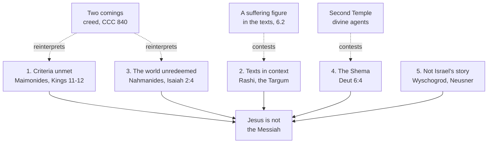

# Apologetics I · Lesson 6.3: The Jewish reply, at full strength

> ⏱ ~15 min · Module 6: Christianity and Judaism · Builds on: [6.1 The messianic claim, and how a prophecy argument works](06-01-the-messianic-claim-and-how-a-prophecy-argument-works.md), [6.2 The contested texts](06-02-the-contested-texts.md), [`old-testament` 4.3](../../old-testament/lessons/04-03-the-servant-of-the-lord.md) · Unlocks: [6.4 Supersessionism, Nostra Aetate, and the Jewish people](06-04-supersessionism-nostra-aetate-and-the-jewish-people.md), [7.1 Islam on its own terms](07-01-islam-on-its-own-terms.md)

## Why this matters

[6.2](06-02-the-contested-texts.md) argued the Christian reading of the contested texts. This lesson gives the floor to those who have heard that argument longest and declined it, stated as a Jewish reader would recognize it. An apologist who cannot state this case so that a learned Jew would sign it has not yet earned the right to answer it.

## The idea

**The setting comes first.** For most of its history this exchange was not a seminar. The medieval disputations were summoned by Christian kings and friars. Jewish participants spoke under licence, and losing could cost the community its books. Paris in 1240 ended with the Talmud burned ([`church-history` 5.3](../../church-history/lessons/05-03-heresy-inquisition-and-the-jews.md)). The Jewish reply was sharpened under that pressure.

**What the case is not.** It is not a refusal to read. Justin's Trypho already pressed the objections that matter: a crucified Messiah, and the plain sense of Isaiah 7:14 ([`patristics` 1.4](../../patristics/lessons/01-04-justin-martyr.md)). But Justin wrote Trypho's lines ([6.1](06-01-the-messianic-claim-and-how-a-prophecy-argument-works.md)). The Jewish case in Jewish hands came later, in manuals of reply that answered Christian proof-texts one verse at a time, each read back in its own chapter. Joseph Kimhi's *Sefer ha-Berit* (twelfth century) and Isaac of Troki's *Hizzuk Emunah* (late sixteenth century) are two. The case has five strands.

**1. The Messiah is defined by what he does, and it has not been done.** Maimonides gives the criteria in the *Mishneh Torah*, at the close of the Laws of Kings ([Maimonides's criteria](../reference.md#maimonides-criteria)), chapters 11–12, in paraphrase. A king of David's line will restore David's kingdom, rebuild the Temple, gather the dispersed of Israel, and bring back the full observance of the Law (11:1). Signs and wonders are *not* required. Rabbi Akiva hailed Bar Kokhba as the Messiah and asked him for no miracle, and when Bar Kokhba was killed, the sages concluded he was not the one (11:3). A Davidic king who studies Torah, leads Israel in keeping it, and fights the wars of the Lord is presumed to be the Messiah. If he succeeds, rebuilds the Temple and gathers the exiles, he certainly is (11:4). One who fails or is killed is not. In the messianic age nature does not change. The wolf lying with the lamb is a figure for Israel living in peace among the nations (12:1). What the age brings is freedom from subjection to foreign kingdoms, and an end to famine and war, so that the world can give itself to knowing God (12:2–5).

*In words:* the test is public: a rebuilt Temple, a gathered people, a world at peace. None depends on testimony.

The same chapter, in the uncensored text that Christian censors long cut from printed editions, names Jesus. Maimonides calls the movement in his name a stumbling block: in his judgement it brought Israel to the sword and led much of the world to worship another beside God. Then he turns. The ways of the Creator are beyond us, he says, and Christianity and Islam have spread talk of the Messiah, Torah and commandments to distant islands, preparing the world to serve God together (Zephaniah 3:9). The judgement is severe, not contemptuous.

**2. The texts mean something else in context.** On the Servant the main line of medieval commentary is Rashi's: Isaiah 52:13–53:12 speaks of Jacob, the righteous within Israel, whose suffering the astonished nations confess ([collective reading](../reference.md#collective-reading)). Origen had met the same reading in a live debate around 248. Even the Targum, which reads "my servant the Messiah" at 52:13, gives the suffering to Israel and not to its Messiah. Rashi reads Daniel 7:13 of the King Messiah, and that Messiah is a man. The readings are laid out in [`old-testament` 4.3](../../old-testament/lessons/04-03-the-servant-of-the-lord.md) and [6.3](../../old-testament/lessons/06-03-daniel-and-apocalyptic.md); the point here is the method. A Jewish reader asks what a verse meant in its chapter first.

**3. Nahmanides at Barcelona.** In July 1263, before James I of Aragon, the Dominican Pablo Christiani, himself a convert from Judaism, argued from the Talmud that the rabbis' own sources showed the Messiah had come ([Barcelona disputation](../reference.md#barcelona-disputation)). Moses ben Nahman (Nahmanides) answered under the king's guarantee of free speech, and his Hebrew account, the *Vikuah*, records his line. Three moves carry it, here in paraphrase.

- *Turn the proof-text.* Christiani cited the aggadah, told in the Jerusalem Talmud and in Lamentations Rabbah, of a Messiah born on the day the Temple was destroyed. Nahmanides said he did not believe it literally, and that aggadah does not bind a Jew. Taken at face value, though, it puts the birth in AD 70, decades after Jesus's death, so it tells against Christiani.
- *Look at the world.* Isaiah promises that in the Messiah's days "nation shall not lift up sword against nation, neither shall they be exercised any more to war" (Isaiah 2:4). From Jesus's day to his own, Nahmanides answered, the world had been full of violence, and Christian nations were not the least bloody.
- *Name the real divide.* The Messiah is not the root of the dispute. The root is the claim that God became a man, which he held reason cannot accept. In his own account he added that keeping the Torah in exile, under a Christian king, earns more merit than keeping it under the Messiah would.

By his account the king rewarded him with 300 gold coins. A Latin protocol from the Christian side reports the outcome differently. In 1265 the Dominicans prosecuted him over his published account, and by 1267 he had left Aragon for the land of Israel.

**4. The Incarnation breaches the Shema.** "Hear, O Israel, the Lord our God is one Lord" (Deuteronomy 6:4). To worship a man who was born and died is, on this view, to worship what is not God. No reading of Isaiah outweighs the Law's first commitment.

**5. The modern voices.** Michael Wyschogrod, an Orthodox philosopher, argued in *The Body of Faith* (1983) for Israel's **[carnal election](../reference.md#carnal-election)**: God chose the bodily descendants of Abraham, and his presence dwells in a people of flesh. That made him unusually open to the Incarnation's *form*. On his account it develops something already in the Hebrew Bible, so it differs from Judaism in degree, not kind. Jews decline it for a simpler reason: the Word of God as Israel hears it does not tell it. The objection is not that it is impossible. It is that it is not Israel's story, and the commandments still bind. Jacob Neusner's *A Rabbi Talks with Jesus* (1993) places its author in the crowd at the Sermon on the Mount. He listens with admiration and concludes he would not have followed ([Neusner's refusal](../reference.md#neusners-refusal)). The reason is Jesus's claim. On the Sabbath above all, Jesus puts himself where the Torah stands, and a Jew who is faithful to the Torah cannot follow a man who does that.

## The argument

The Catholic reply is short: its job is to locate the disagreement.

1. **P1.** Maimonides's criteria identify the Messiah by a completed, public redemption.
2. **P2.** The Church does not claim that redemption is complete. Its claim is a Messiah who has come and will come again. That claim is creedal ("he will come again in glory"), rung 1 on the [ladder](../reference.md#levels-of-authority). CCC 840 says that Jews and Christians both await the Messiah, with Christians awaiting the return of one already known. The Biblical Commission's *The Jewish People and their Sacred Scriptures in the Christian Bible* (2001), no. 21, says that Jewish messianic waiting is not in vain and that Christians also live in expectation. That document is advisory, not magisterial.
3. **P3.** Whether two comings is a fair reading or a rescue depends on whether Israel's scriptures also hold a rejected, suffering or delayed figure: Isaiah 53, Zechariah 12:10, the cut-off anointed one of Daniel 9:26. That is the case [6.2](06-02-the-contested-texts.md) argued.
4. **∴ C.** The dispute is not a failed checklist. It is whether the checklist is the whole of the scriptural pattern. *In words:* each side reads the other's key texts as the exception.

**Concession.** The world is unredeemed in exactly the sense Maimonides names. There is no Temple, the exiles are not gathered, and nation still lifts sword against nation. The Christian answer reinterprets the criteria; it does not meet them as written. Nahmanides's point that Christendom was no more peaceful than its neighbours was true when he made it. And no argument in this module has ever persuaded the other side at scale. Jewish learned communities have not been argued into Christianity, nor Christian ones out of it, across nineteen centuries, and many of the conversions that did happen were coerced.

**Where the argument is weakest.** P3. Every text it needs has a Jewish reading that is at least as natural in context, and "he will come again" is exactly what Nahmanides would call an explanation that no state of the world could refute. The honest lesson for confidence ([`epistemology` 4.5](../../epistemology/lessons/04-05-peer-disagreement.md)) is that an argument which has never moved its ablest hearers works as a [motive of credibility](../reference.md#motives-of-credibility) for those who already see the pattern. It is not a demonstration ([`fundamental-theology` 2.2](../../fundamental-theology/lessons/02-02-credibility-and-the-preambles-of-faith.md)).

## Map of the Jewish case

Dashed edges are Catholic replies. Strand 5 has none: it is a refusal to be persuaded, not a premise, and only the whole case speaks to it.

## Worked examples

**Example 1 (clean): "But Jesus worked miracles."** An invented debate opening argues that Jesus's healings prove he was the Messiah. Run strand 1. Maimonides sets aside signs and wonders as a criterion (11:3), citing Akiva, who asked none of Bar Kokhba. So the argument does not touch the Jewish case. It answers a test no Jewish authority set. The better reply goes to P2 and P3, the shape of the criteria themselves.

**Example 2 (hard): the counter-question on monotheism.** Strand 4 assumes a firm boundary. Scholars of Second Temple Judaism ask how firm it was. Alan Segal (*Two Powers in Heaven*, 1977) traced a rabbinic polemic against those who saw a second divine figure. Daniel Boyarin (*The Jewish Gospels*, 2012) argues that a divine-human redeemer, read out of Daniel 7, was a Jewish idea before it was a Christian one. Larry Hurtado's case for very early devotion to Jesus *within* Jewish monotheism is in [`new-testament` 4.3](../../new-testament/lessons/04-03-paul-at-work.md). **Where it strains:** this removes the charge that the Incarnation is *unthinkable* for Jews. It does not show that it is true. And it can be turned. Boyarin's border was *drawn* later, by rabbis among others ([`church-history` 1.2](../../church-history/lessons/01-02-bishops-canon-and-the-parting-of-the-ways.md)), and a living Jew stands on the rabbinic side of it by choice. Telling him his own tradition is not really his is bad argument and bad manners.

## Watch out

- **You might think *Jesus of Nazareth* settles the Church's view of Neusner.** Benedict XVI gives Neusner sustained and admiring attention in vol. 1 (2007), ch. 4, on the Sermon on the Mount, and grants his diagnosis that the question is who Jesus is. But the book's foreword says it is not an exercise of the magisterium and that readers are free to disagree with it. It is a theologian-pope's own work, with **no magisterial level**.
- **You might think the criteria are a late dodge invented to exclude Jesus.** They gather the prophets' own promises (Deuteronomy 30:3–5, Isaiah 2 and 11), as Maimonides shows. Calling them special pleading is caricature.
- **You might think Maimonides simply despised Christianity.** He judged it an error that harmed Israel. He also gave it a place in providence, preparing the nations for the Messiah. Report both halves.

## One-liner

> The Jewish reply asks for a redeemed world and finds none, reads the Servant in his chapter, and keeps the Shema. The Christian answer is "he will come again," and an honest apologist admits that this reinterprets the test rather than passing it.

## Problems

**P1 (🟢) *(Exegetical: diagnose.)*** An invented parish bulletin note (nobody wrote this; it is built for the problem):

> "At Barcelona in 1263 the Jewish champion Nahmanides was defeated in open debate and left Spain in disgrace. Jewish teachers like Maimonides refused Jesus because he did not perform the signs and wonders the rabbis demanded of the Messiah. Pope Benedict settled the matter with magisterial authority in *Jesus of Nazareth*."

Name the three errors and correct each, with its source. One sentence per error.

**P2 (🟡) *(Apologetic: (a) Exegetical, graded first · (b) reply.)*** (a) State Nahmanides's case at Barcelona as he gives it in the *Vikuah*: the aggadah he was answering, what he did with it, his argument from the state of the world, and what he called the real root of the dispute. (b) Reply as a Catholic apologist. Open with a named concession. 150 words or fewer in total.

**P3 (🔴, optional) *(Exegetical (a) · find the crux (b).)*** (a) State Wyschogrod's position on the Incarnation: what he grants and why, on his account, Jews nonetheless decline it. (b) A Catholic apologist answers him: "But it *was* told, by the apostles, who were Jews." Name the single premise on which the apologist and Wyschogrod actually divide, and say what, if anything, could move it. Two sentences per part.

Solutions

**P1** *(Exegetical.)*

**Must hit, strict:**

- **Barcelona.** Nahmanides's own account has the king reward him. A Latin protocol from the Christian side reports the outcome differently. He left Aragon (by 1267) after the Dominicans prosecuted him in 1265 over his published account, not because he lost the debate. Credit for noting that "open debate" overstates the freedom of a royally summoned disputation.
- **Signs and wonders.** Maimonides says the Messiah need *not* work signs and wonders (Laws of Kings 11:3, the Akiva and Bar Kokhba precedent). His criteria are a restored kingdom, Temple, ingathering and observance, and a world at peace.
- **Authority.** *Jesus of Nazareth* says of itself in its foreword that it is not a magisterial act: no level on the ladder.

**Wrong turns:** "correcting" the first error by saying Nahmanides won by the Church's own admission (the two accounts differ); saying Maimonides demanded the resurrection of the dead as a sign (11:3 denies exactly that); giving Benedict's book rung 3 because a pope wrote it.

**Model answer:** (1) Nahmanides's *Vikuah* has the king reward him, and the Latin record tells the outcome differently. He left Aragon after Dominican prosecution of his published account (1265–67), not after a debate he lost. (2) Maimonides denies that the Messiah must work signs and wonders (Kings 11:3, the case of Akiva and Bar Kokhba), and his test is a restored kingdom and Temple, the gathered exiles and a world at peace. (3) The book's own foreword says it is not an exercise of the magisterium, so it settles nothing with authority.

---

**P2** *(Apologetic: (a) Exegetical, graded first · (b) reply.)*

**Must hit, strict (a), graded first:**

- The aggadah of the **Messiah born on the day the Temple was destroyed** (Jerusalem Talmud; Lamentations Rabbah), cited by Christiani. Nahmanides said he did not believe it literally and that **aggadah does not bind**. Taken at face value it puts the birth in AD 70, after Jesus, so it **tells against** the Christian claim.
- **Isaiah 2:4**: the Messiah's age ends war, and since Jesus the world, Christendom included, has been full of violence.
- The **root** of the dispute is not the Messiah but the claim that **God became a man**, which he held to be contrary to reason.

**Must hit (b):**

- A named concession: the world is unredeemed as Isaiah 2:4 describes, and the Christian centuries did not end war.
- A reply that locates the disagreement: the Church claims a Messiah who has come and will come again (creedal, rung 1), so the question is whether the prophets also show a rejected or suffering figure. Or: that Nahmanides is right that the Incarnation is the root, so the messianic texts cannot settle it alone.

**Wrong turns:** stating (a) as "Nahmanides said the Talmud proves Jesus was not the Messiah" (he denied the aggadah binds, and turned it only for argument's sake); replying that Isaiah 2:4 is "spiritually" fulfilled in the Church's inner peace without conceding the plain sense; treating the Christian record of violence as irrelevant.

**Model answer, one of several:** (a) Christiani cited the aggadah of a Messiah born the day the Temple fell. Nahmanides said aggadah does not bind and he did not believe it, and that taken literally it dates the Messiah after Jesus. Isaiah 2:4 promises an end to war in the Messiah's days, and the world since Jesus, Christians included, has been full of bloodshed. The real root of the dispute is the claim that God became man, which reason cannot accept. (b) Concession: Isaiah 2:4 is unfulfilled as written, and Christendom gave Nahmanides his evidence. But the Church never claimed a finished redemption. It claims a Messiah who comes twice. Whether that is a rescue depends on whether the prophets also hold a rejected, suffering figure, and Nahmanides is right that the deeper question, the Incarnation, is the one that decides it.

---

**P3** *(Exegetical (a) · find the crux (b).)*

**Accept:** in (b), any crux that is genuinely shared ground both sides must address, stated so that Wyschogrod would recognize it.

**Must hit, strict (a):**

- Wyschogrod grants that the Incarnation is **not impossible** for Judaism: Israel's election is carnal, God dwells in a people of flesh, so the Christian claim **develops** a biblical theme and differs in degree, not kind.
- Jews decline it because **the Word of God as Israel hears it does not tell it**, and the Torah's commandments **still bind** the Jewish people.

**Must hit (b):**

- The crux is **who counts as Israel hearing the Word**: whether the apostolic witness is a word *to* Israel that binds the people, or a word heard by some Jews that the people as a whole, in its continuing life under the Torah, did not receive.
- What could move it: not more proof-texts, which both sides already read. Only an argument about the authority of the apostolic testimony, such as the resurrection case of Module 5, or a judgement about the continuing covenant (6.4), bears on it.

**Wrong turns:** stating (a) as "Wyschogrod says the Incarnation is incoherent" (he says the opposite); making the crux "whether God can become man", which he grants; attributing to him a belief that Jesus is the Messiah.

**Model answer:** (a) Wyschogrod grants that the Incarnation is thinkable within Judaism, since God's election of Israel is carnal and his presence dwells in a bodily people, so the claim differs in degree, not kind. Jews decline it because the Word of God as Israel hears it does not tell it, and the commandments still bind them. (b) The crux is whether the apostles' testimony is Israel hearing the Word or some Jews hearing what the people did not receive. Only an argument for the authority of that testimony, such as the resurrection case, could move it; another reading of Isaiah could not.

## Flashback

**From Lesson [6.1](06-01-the-messianic-claim-and-how-a-prophecy-argument-works.md) (The messianic claim, and how a prophecy argument works):** *(Formal (a) · Exegetical (b).)* Invented numbers and an invented hobbyist (nobody did this; it is built for the problem). He searches 200 passages of an ancient book for anything that fits the life of a famous modern statesman. Suppose that, read loosely, each passage has a 1-in-100 chance of seeming to fit some detail of a given life by coincidence, independently of the other passages. He finds three fits and announces: "The chance of three fulfilments by accident is one in a million."

(a) Where does "one in a million" come from? Give the expected number of chance fits in his search, and the probability that a search of this size turns up at least three. *(Formal.)*

(b) Name the test from 6.1 that his announcement fails. Then say why 6.1's P4 does not rest on his kind of reasoning: what does P4 claim instead? Two sentences. *(Exegetical.)*

Solution

**Worked arithmetic (a):**

Checked in `verify-af/fb-06-03.py`; a Poisson approximation with mean 2 agrees to three places.

- His figure is $(1/100)^3 = 10^{-6}$: the chance that three passages named *in advance* all fit. He named none in advance.
- Expected chance fits: $200 \times 0.01 = 2$.
- With $X$ the number of fits, $\Pr(X=0) = 0.99^{200} \approx 0.134$, $\Pr(X=1) = 200 \times 0.01 \times 0.99^{199} \approx 0.271$, and $\Pr(X=2) = \binom{200}{2}(0.01)^2(0.99)^{198} \approx 0.272$.
- $\Pr(X \ge 3) = 1 - (0.134 + 0.271 + 0.272) \approx 0.32$: about 1 in 3, not 1 in a million. He overstated the improbability by a factor of roughly 320,000.

**Must hit, strict (b):**

- Test (iv): the misses were not counted. He picked the three hits *after* knowing the life, out of 200 passages, and ignored the 197 that fit nothing (the selection effect).
- P4 does not claim a fit improbable by coincidence. It claims that one element of the pattern, a Messiah who was executed and the fusion of figures that followed, was **forced on the first Christians by an event they did not control** and would not have chosen ("a stumblingblock"), so it passes test (iii). Its evidential weight lies in that uncontrolled event, not in the odds of finding matching verses.

**Wrong turns:** computing $200 \times (1/100)^3$ and calling it the answer; concluding that because chance fits are common, every Christian reading is coincidence (the correction removes proof-texting, P2, not the pattern claim); saying P4 escapes because its texts were fixed beforehand (test i), when 6.1 grants that the texts were searched *after* the event.

**Model answer (b):** His announcement fails test (iv), because he counted three hits and none of the 197 misses in a corpus searched after the fact. P4 makes no claim about the odds of a match: it says the crucified Messiah was an event the first Christians did not control and would never have chosen, so that element of the pattern could not have been enacted or written in to fit the texts.

## Connections

- **Backward:** the readings of the Servant and of Daniel 7 are laid out in [`old-testament` 4.3](../../old-testament/lessons/04-03-the-servant-of-the-lord.md) and [6.3](../../old-testament/lessons/06-03-daniel-and-apocalyptic.md). Justin's Trypho is in [`patristics` 1.4](../../patristics/lessons/01-04-justin-martyr.md). [6.1](06-01-the-messianic-claim-and-how-a-prophecy-argument-works.md) and [6.2](06-02-the-contested-texts.md) built the case answered here. Maimonides as a philosopher is [`ancient-medieval-philosophy` 6.3](../../ancient-medieval-philosophy/lessons/06-03-averroes-and-maimonides.md).
- **Forward:** [6.4](06-04-supersessionism-nostra-aetate-and-the-jewish-people.md) states the record of Christian treatment of Jews in full, and what the Church now teaches about the Jewish people and at what weight. Strand 4 returns in [7.2](07-02-tawhid-and-the-trinity.md), where Islam presses the same objection from *tawhid*. Boss problem 6 in the [syllabus](../syllabus.md) closes the module.
- **Sideways:** the problem of an argument that never moves its ablest opponents is peer disagreement ([`epistemology` 4.5](../../epistemology/lessons/04-05-peer-disagreement.md)). Early high Christology and the partings of the ways are [`new-testament` 4.3](../../new-testament/lessons/04-03-paul-at-work.md) and [`church-history` 1.2](../../church-history/lessons/01-02-bishops-canon-and-the-parting-of-the-ways.md).
