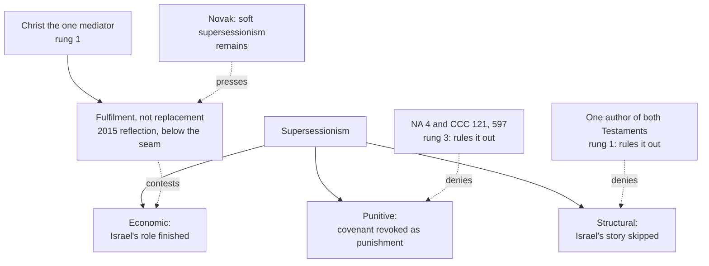

# Apologetics I · Lesson 6.4: Supersessionism, Nostra Aetate, and the Jewish people

> ⏱ ~15 min · Module 6: Christianity and Judaism · Builds on: [6.2 The contested texts](06-02-the-contested-texts.md), [6.3 The Jewish reply, at full strength](06-03-the-jewish-reply-at-full-strength.md), [`new-testament` 5.3](../../new-testament/lessons/05-03-romans-5-11-adam-spirit-israel.md) · Unlocks: [7.1 Islam on its own terms](07-01-islam-on-its-own-terms.md), [8.2 Salvation outside the visible Church](08-02-salvation-outside-the-visible-church.md)

## Why this matters

This lesson asks what the Church now teaches about the Jewish people, and at what weight. A Christian argument with Jews is never made on neutral ground: for most of the Church's history it was backed by preaching, law and force. An apologist who skips that part has not earned a hearing.

## The record

**Concession.** For most of Christian history, Christian teaching and Christian power were turned against Jews. The facts, established in sibling courses, without mitigation:

- **Preaching.** In 386–387 at Antioch, John Chrysostom, a saint and Doctor of the Church, preached eight homilies against Christians who attended the synagogue. They are sustained invective against the synagogue and the Jews as such, reading Jewish suffering since 70 as punishment. They were quarried for centuries, and in the twentieth century Nazi propagandists reprinted them ([`patristics` 3.6](../../patristics/lessons/03-06-john-chrysostom.md)).
- **Massacre.** In May 1096, crusading bands killed Jewish communities in the Rhineland: about a dozen at Speyer, about 800 at Worms, and at Mainz between 700 and 1,100 by the sources' counts. Many killed their own families rather than accept forced baptism. Some bishops tried to protect them, and the protection failed ([`church-history` 4.3](../../church-history/lessons/04-03-the-crusades.md)).
- **Law.** In 1215, Lateran IV, an ecumenical council, required Jews and Muslims to wear distinguishing dress and kept Jews off the streets in the last days of Holy Week (can. 68). The badges came later, by royal decree ([`church-history` 5.1](../../church-history/lessons/05-01-papal-monarchy-innocent-iii-to-boniface-viii.md)).
- **Books and expulsions.** A Paris hearing put the Talmud on trial in 1240, after papal letters, and about twenty-four cartloads of Hebrew manuscripts were burned in 1242. England expelled its Jews in 1290 and France in 1306. These were royal acts, done in Christian kingdoms ([`church-history` 5.3](../../church-history/lessons/05-03-heresy-inquisition-and-the-jews.md)). Spain followed in 1492.
- **The Shoah.** Some six million Jews were murdered in a Europe whose Christians had been taught contempt for Jews for centuries. How far that teaching made the murder easier, and what the Church's leaders did and did not do, is set out in [`church-history` 9.1](../../church-history/lessons/09-01-the-church-and-the-totalitarian-states.md).

Underneath all of this ran a theology. Israel had rejected its Messiah, so God had rejected Israel, and the Jews were collectively guilty of Christ's death. Matthew 27:25 was read as a curse the people had called down on themselves ([`new-testament` 3.4](../../new-testament/lessons/03-04-the-passion-and-resurrection-narratives.md)). The Commission's 2015 reflection itself says that this replacement theory became the standard theological basis of the relationship in the Middle Ages (§17). Nothing below answers this. The question is only what the Church teaches now, and whether it hangs together.

## The idea

[Supersessionism](../reference.md#supersessionism) is the view that the Church has superseded the Jewish people as God's covenant people. R. Kendall Soulen (*The God of Israel and Christian Theology*, 1996) showed that the word covers three different claims:

1. **Punitive.** God revoked the covenant with Israel *as punishment* for rejecting Christ. This is the theology behind the record.
2. **Economic.** Israel's role in God's plan (its "economy") was preparatory. Once Christ came, the role was complete and passed to the Church. No punishment is needed.
3. **Structural.** The way Christians tell their story skips from Adam's fall straight to Christ, so Israel's history decides nothing in the shape of Christian belief.

Keep them apart, because a Church text can reject one and leave the others untouched.

## The other side

The Jewish case has two parts.

**The historical charge.** The teaching of contempt was not an accident of bad Christians. It was what the theology said. A Church that taught punitive supersessionism for fifteen centuries, and changed only after Auschwitz, has to show that the change is more than a change of manners.

**The conceptual charge.** David Novak, a Jewish theologian long engaged in the dialogue, put the sharper version ("Supersessionism Hard and Soft", *First Things*, 2019). Novak argues that "hard" supersessionism has God elect Christians to *displace* the Jews, leaving conversion as the only option for Jews. "Soft" supersessionism says Christianity brings something new while the Jews' covenant goes on, deferring any overcoming of Judaism to the end. Novak holds that Christians cannot do without some soft supersessionism, since otherwise they would have no reason not to return to Judaism. He adds that Judaism has its own soft and hard versions about Christianity. He also says what soft supersessionism costs: it leaves Jews suspecting that Christians expect them, in the end, to become what Christians already are. On this view, "fulfilment" is economic supersessionism with better manners: it makes Judaism after Christ incomplete by definition.

## The argument

- **P1.** Paul, writing about Jews who did not accept the gospel, says: "As concerning the gospel, indeed, they are enemies for your sake: but as touching the election, they are most dear for the sake of the fathers. For the gifts and the calling of God are without repentance" (Rom 11:28–29, DR). *Ametamelēta* means "irrevocable" ([`new-testament` 5.3](../../new-testament/lessons/05-03-romans-5-11-adam-spirit-israel.md)). *In words:* Paul holds both at once. Israel's "no" to the gospel is real, and God's election of Israel stands.
- **P2.** [Nostra Aetate](../reference.md#nostra-aetate) 4 (28 October 1965) builds on this. The Church received the Old Testament through the people of the ancient covenant. It draws its life from the olive tree onto which the Gentiles were grafted. God holds the Jews most dear for the fathers' sake and does not repent of his gifts and call. The authorities and their followers pressed for Christ's death, yet the passion "cannot be charged against all the Jews, without distinction, then alive, nor against the Jews of today." Jews are not to be presented as rejected or accursed by God as if Scripture taught it, and the Church decries antisemitism directed against Jews at any time and by anyone. The text never uses the word "deicide" (it was cut from the draft; [`church-history` 9.2](../../church-history/lessons/09-02-the-second-vatican-council.md)), but it denies the [deicide charge](../reference.md#deicide-charge) in substance.
- **P3.** So **punitive** supersessionism is ruled out by the Church's own teaching at **rung 3** ([`fundamental-theology` 4.4](../../fundamental-theology/lessons/04-04-the-ladder-of-doctrinal-authority.md)). The Catechism adds that the Old Covenant has never been revoked (CCC 121), and it applies NA 4 to Matthew 27:25 (CCC 597).
- **P4.** **Structural** supersessionism contradicts the Church's dogma that one God is the author of both Testaments (Trent; [`old-testament` 6.4](../../old-testament/lessons/06-04-the-old-testament-in-light-of-the-new.md)), and its rejection of Marcion.
- **P5.** What is left is the claim that Jesus is Israel's Messiah and the one mediator for all (Acts 4:12). That claim is the [unicity of Christ](../reference.md#dominus-iesus), which is held at rung 1 on the strength of Ephesus and Chalcedon. Holding it is not supersessionism in Novak's "hard" sense, because nothing in it requires Israel's election to have lapsed.
- **∴ C.** The Church can affirm Christ as universal saviour *and* God's unrevoked election of Israel without contradiction, and the theology behind the record contradicts the Church's present teaching.

**Concession.** Novak is right that P5 leaves a soft supersessionism in place. If Jesus is Israel's Messiah, then the Church believes Judaism has not recognized the most important thing that has happened to Israel. No rewording removes that, and Jews are entitled to find it unwelcome. The Commission's formula is that the New Covenant is the fulfilment of the promises, not their replacement (2015, §§23, 32). From the other side, that can sound like a distinction without a difference.

**Where the argument is weakest.** How Jews share in salvation without explicit faith in Christ is not explained. The 2015 reflection calls it a divine mystery beyond our fathoming (§36). That is honest, but a mystery is not an argument. A critic can call it the point where the Catholic case stops reasoning.

**Mark the levels** ([reading a document's weight](../../fundamental-theology/lessons/04-05-reading-a-documents-weight.md)). NA 4 is a conciliar declaration, authentic magisterium, **rung 3**: it defines nothing. CCC 121 and 597 carry the weight of their sources. *We Remember: A Reflection on the Shoah* (16 March 1998) and *"The Gifts and the Calling of God are Irrevocable"* (10 December 2015) both come from the Commission for Religious Relations with the Jews. The 2015 text says of itself that it "is not a magisterial document or doctrinal teaching of the Catholic Church". Each is **below the seam**. Where they restate NA 4 or the unicity of Christ, they carry the weight of those sources. Their own judgements carry the weight of their arguments ([levels of authority](../reference.md#levels-of-authority)). That matters for *We Remember*. It concedes anti-Judaism among Christians and calls its sorrow an act of repentance (*teshuva*) for the failures of the Church's sons and daughters. It then distinguishes that anti-Judaism from Nazi racial antisemitism, rooted outside Christianity, and leaves open, case by case, whether the first made the second easier. A Catholic may judge that distinction too clean without dissenting from anything.

## Map of positions

Punitive and structural supersessionism are denied at stated levels. Economic supersessionism is only *contested*: the denial is a commission's formula, and the rung-1 claim beneath it is what Novak says keeps soft supersessionism alive.

## Worked examples

**Example 1 (clean): "irrevocable covenant, so two ways of salvation."** An objector argues that if God's covenant with Israel is unrevoked, then the Church must hold that Jews are saved through Torah apart from Christ. Meet it by separating two claims: that Israel's *election* stands, and *by whom* anyone is saved. Paul asserts the first while praying for Israel's salvation in Christ (Rom 10:1; 11:28–29). The 2015 reflection does the same. It rejects the theory of two different paths to salvation, one without Christ, as endangering the foundations of the faith (§35). In the next breath it says that Jews share in God's salvation is beyond theological question, by a way it calls a mystery (§36). This settles what [`new-testament` 5.3](../../new-testament/lessons/05-03-romans-5-11-adam-spirit-israel.md) left open. Reading D of Romans 11:26 in its strong form, salvation *apart from Christ*, meets rung-1 teaching. The weaker form, salvation *through* Christ without explicit faith, is within Catholic bounds, as LG 16 is (8.2).

**Example 2 (hard): the mission to the Jews.** The 2015 reflection says the Catholic Church neither conducts nor supports any institutional mission directed specifically at Jews. It also says Christians are still called to bear witness to Christ before Jews, humbly and sensitively, mindful of the Shoah (§40). Push from one side: Peter's first sermon was preached to Jews (Acts 2:36–38). If Jesus is Israel's Messiah, keeping that from Israel looks like the strangest silence of all. Push from the other: as §40 itself says, in Jewish eyes a mission to the Jews threatens the very existence of the Jewish people. Catholic theologians divide. Some read the no-mission stance as Pauline restraint: Israel's hardening is "until the fulness of the Gentiles", and God, not the Church's missions, brings that hour (§37). Others hold that it is a prudential policy at commission level which cannot override the mandate of Matthew 28:19. No rung-3 act settles it. It is **freely disputed** (rung 5).

## Watch out

- **You might think Nostra Aetate defined that the covenant was never revoked.** It defines nothing (rung 3), and that claim is not in it. The 2015 reflection calls reading it there an over-interpretation (§39) and traces its first clear statement to John Paul II at Mainz (17 November 1980), then CCC 121.
- **You might think the 2015 reflection teaches a dual covenant.** It rejects two paths to salvation (§35), and it is not magisterial in any case.
- **You might think conceding the record means "the Church taught hatred."** Saints, popes and an ecumenical council taught or enacted contempt and legal humiliation. Papal letters (*Sicut Judaeis*) also forbade forced baptism and violence. Both are true, and the second does not offset the first.

## One-liner

> Concede the record first; then say that Nostra Aetate (rung 3) kills punitive supersessionism, that dogma kills the structural kind, and that what survives, Christ as Israel's Messiah, is the soft supersessionism a Jewish critic is right to name.

## Problems

**P1 (🟢)** *(Exegetical; diagnose)* An **invented** parish newsletter column:

> "Since Vatican II the Church officially teaches a dual covenant. The 2015 Vatican document declared that Jews are saved through Torah, and that Catholics must not share their faith with Jews. This simply spells out what Nostra Aetate defined in 1965: the covenant with Israel has never been revoked."

Name **four** errors, each with its correction and, where relevant, the level. **One sentence each.**

**P2 (🟡)** *(Apologetic: (a) Exegetical, graded first · (b) reply)* (a) State David Novak's position on Christian supersessionism as he states it in "Supersessionism Hard and Soft" (2019). **Three sentences at most.** (b) Reply to the charge that the Church's language of fulfilment rather than replacement is economic supersessionism with better manners, in **130 words or fewer**, opening with a **named concession**. A reply that concludes the charge succeeds passes if it is a good reply.

**P3 (🔴)** *(Exegetical (a) · Evaluative (b))* Three **invented** sentences from catechetical material:

> (i) "Because they cried 'his blood be upon us', the Jews lost the promises and bear the curse to this day."
> (ii) "Israel was the scaffolding; when Christ came, the scaffolding was taken down."
> (iii) A twelve-session course runs: Creation, the Fall, the Annunciation, and onward through the Gospels, with no session on Abraham, Sinai or the prophets.

(a) Classify each by Soulen's three senses, and name the Church text that rules it out, with its level, or say that none does directly. **One sentence each.** (b) Any verdict, **80 words or fewer**: is (ii) worse than (iii), or the reverse?

Solutions

**P1** *(Exegetical)*

**Accept:** any four of the five below, each with its correction.

**Must hit, strict:**

- **"Officially teaches a dual covenant":** false. The 2015 reflection rejects two paths to salvation (§35), and the unicity of Christ's mediation is rung 1.
- **"Declared":** the 2015 text says of itself it is not a magisterial document or doctrinal teaching. It is a commission's reflection, below the seam, so it declares nothing binding.
- **"Saved through Torah":** it says Jews share in salvation and that *how*, without explicit faith in Christ, remains a mystery (§36). It does not say they are saved through Torah apart from Christ.
- **"Must not share their faith":** it rejects an *institutional* mission. It says Christians are still called to bear witness to Jews, humbly and sensitively (§40).
- **"Nostra Aetate defined … never revoked":** NA 4 defines nothing (rung 3) and does not say the covenant was never revoked. The 2015 reflection itself calls reading it there an over-interpretation (§39). The phrase is John Paul II's at Mainz (1980), taken up in CCC 121.

**Wrong turns:** correcting the column by saying the Church *does* run a mission to the Jews; calling the 2015 text "authentic magisterium"; saying NA 4 teaches that Jews must convert to be saved.

**Model answer:** (1) The Church rejects two paths to salvation (2015 §35), and Christ's unique mediation is rung 1. (2) The 2015 text calls itself non-magisterial, so it "declared" nothing binding. (3) It calls *how* Jews share in salvation without explicit faith in Christ a mystery (§36), not salvation through Torah. (4) It rejects institutional mission while still calling for humble witness (§40). (5) NA 4 is rung 3 and defines nothing, and "never revoked" is not in it (§39); that comes from John Paul II (1980) and CCC 121.

---

**P2** *(Apologetic: (a) Exegetical, graded first · (b) reply)*

**Must hit, strict (a), graded first:**

- Hard supersessionism: God elected Christians to *displace* the Jews, so conversion is the Jews' only option. Soft supersessionism: Christianity brings something new while the Jews' covenant continues, with any overcoming deferred to the end.
- Novak holds that soft supersessionism is unavoidable for Christians (or they would have no reason not to return to Judaism) and preferable to the hard form, and that Judaism has soft and hard versions of its own.
- He names its cost: Jews may suspect Christians expect them eventually to become what Christians already are.

**Must hit (b):**

- A **named concession**, e.g. "fulfilment" does imply Judaism after Christ lacks something, or Novak is right that a soft supersessionism remains.
- The distinction between Israel's *role* being finished (economic) and the claim that the *promises* were fulfilled while the *election* stands (Rom 11:28–29; NA 4; CCC 121).
- An honest limit: the distinction rests on a commission formula below the seam, and on a mystery (§36).

**Wrong turns:** stating Novak as an opponent of all dialogue, or as saying any supersessionism is antisemitic. Making him a critic of NA 4, when he reads it as ruling out the hard form. Replying "NA 4 defined that the covenant is valid".

**Model answer (b), one of several:** Concession: fulfilment language does imply that Judaism after Christ has not recognized what Christians think is the most important thing God did for Israel, and no rewording removes that. But economic supersessionism says more: that Israel's *role* is finished. Paul denies exactly that. Israel is "enemies" regarding the gospel and "most dear" regarding election, because God's calling is irrevocable (Rom 11:28–29). NA 4 and CCC 121 take up that line. On the Catholic view, Israel's election still does work in history, which is the point the economic view denies. What remains is Novak's soft supersessionism, which he himself thinks each faith holds about the other. Its limit: how Israel's standing fits Christ's unique mediation is left a mystery (§36).

---

**P3** *(Exegetical (a) · Evaluative (b))*

**Must hit, strict (a):**

- (i) **Punitive.** NA 4 rules it out (the passion may not be charged against Jews then or now, nor Jews presented as accursed), and CCC 597 applies this to Matthew 27:25: rung 3.
- (ii) **Economic.** No Church text condemns it by name. It clashes with NA 4 (the Jews most dear to God, who does not repent of his gifts) and with CCC 121 (the Old Covenant never revoked), which carry rung 3 at most. The fulfilment-not-replacement formula is a commission's, below the seam.
- (iii) **Structural.** No document condemns a syllabus. The underlying view, the Old Testament as dispensable, contradicts the rung-1 dogma that one God is author of both Testaments and the rejection of Marcion, and it clashes with DV 14–16. The *course design* is a pastoral fault, not a heresy.

**Must hit, any verdict (b):** weigh the explicit claim of (ii) against the silent effect of (iii). (ii) asserts a theology that NA 4's language resists. (iii) asserts nothing, but it teaches by omission, and it is the shape that let punitive readings go unchallenged.

**Wrong turns:** calling (ii) heresy; calling (iii) punitive; saying NA 4 "defined" against (i).

**Model answer (b), one of several:** (ii) is worse as a claim, since it states that Israel's role is over, which NA 4 and CCC 121 resist. (iii) may do more harm in practice. A catechumen who never meets Abraham or Sinai cannot read Romans 9–11 at all, and will find "fulfilment" meaningless or quietly punitive. On balance (iii) is the deeper fault, because (ii) at least admits that Israel had a role.

## Flashback

**From Lesson [6.2](06-02-the-contested-texts.md) (The contested texts):** *(Exegetical (a) · Exegetical: find the crux (b) · Evaluative (c).)* An invented exchange between two students (nobody said this; it is built for the problem). **Mira**, a Catholic: "Levenson, a Jewish scholar, shows that the death and return of the beloved son runs through Israel's scriptures from Isaac on. So the cross is not foreign to Judaism. It is Judaism's own story reaching its goal, and the Church is its heir." **Eli**, who is Jewish: "The pattern is ours: Isaac, Joseph, Israel itself as God's firstborn son. That Christians found Jesus in it shows that they read our story, not that the story was about him."

(a) What does Levenson himself conclude about how Judaism and Christianity relate, and which of Mira's claims does that conclusion contradict? (b) Which premise of 6.2's convergence argument (P1–P4) does Eli deny? (c) What would have to be shown to move him? **Two sentences per part at most.**

Solution

**Must hit, strict (a):**

- Levenson concludes that Judaism and Christianity are **sibling rivals** for one blessing, not parent and child.
- That contradicts Mira's last sentence: "reaching its goal" and "heir" make the Church the child who inherits from a parent, which is the picture Levenson rejects. Her first two sentences are fair to him: he does argue that the Gospels' and Paul's portrait of Jesus was built from Jewish reflection on the pattern.

**Must hit, strict (b):**

- **P3**, read as a claim about the texts: that the features converge on one figure no earlier figure fits. Eli grants the pattern and its Jewish roots. He denies that it *singles out* Jesus, because Israel and its earlier beloved sons already fill it. 6.2 names this as the argument's weakest point: the composite is assembled by a reader who already believes P4.
- Respect: Eli's reply is stated as a serious reading of his own scriptures, not as an evasion.

**Must hit, any verdict (c):**

- Something recognizable **without first believing P4**: a feature of the pattern that Israel and its earlier beloved sons do not fill and that Jesus does, read from the texts alone. Or an admission that nothing of that kind is available, so that the convergence remains a motive of credibility for those who already read the texts together, not a premise against Eli.

**Wrong turns:** making Levenson an apologist for the Christian reading, when his point cuts both ways (the cross is not foreign to Israel's scriptures, and the pattern belongs to Israel too). Naming P2 as Eli's target: he does not deny that the reading is old and Jewish, he affirms it. Calling Eli's reply a dodge, which fails the respect rubric item. Treating "heir" as harmless wording in a module whose next lesson is about supersessionism.

**Model answer:** (a) Levenson concludes that Judaism and Christianity are sibling rivals for one blessing, not parent and child. That contradicts Mira's "goal" and "heir", though not her claim that the cross draws on Israel's own pattern. (b) Eli denies P3: he grants the pattern and its Jewish roots but says it does not single out Jesus, since Isaac, Joseph and Israel already fill it. (c) He would need a feature of the pattern that only Jesus fills, visible without already believing P4; failing that, the convergence persuades only those who already read the texts as one pattern.

## Connections

- **Backward:** the readings of Romans 11:26, including the *Sonderweg*, are [`new-testament` 5.3](../../new-testament/lessons/05-03-romans-5-11-adam-spirit-israel.md). Matthew 27:25 and *laos* are [`new-testament` 3.4](../../new-testament/lessons/03-04-the-passion-and-resurrection-narratives.md), and John's *hoi Ioudaioi*, another text later read against Jews, is [`new-testament` 2.5](../../new-testament/lessons/02-05-the-theology-of-john.md). Justin's "punitive edge" is [`patristics` 1.4](../../patristics/lessons/01-04-justin-martyr.md). The Jewish case this lesson's teaching must sit beside is [6.3](06-03-the-jewish-reply-at-full-strength.md).
- **Forward:** how the unicity of Christ is held together with salvation for those outside the visible Church, LG 16 and *extra ecclesiam*, is [8.2](08-02-salvation-outside-the-visible-church.md). [7.1](07-01-islam-on-its-own-terms.md) applies the same rule to Islam: the record first.
- **Sideways:** the Council's drafting fights and the vote are [`church-history` 9.2](../../church-history/lessons/09-02-the-second-vatican-council.md); the Day of Pardon (12 March 2000), with its confession of sins against the Jewish people, is [`church-history` 9.3](../../church-history/lessons/09-03-after-the-council.md). The procedure for weighing a commission's text is [`fundamental-theology` 4.5](../../fundamental-theology/lessons/04-05-reading-a-documents-weight.md).
