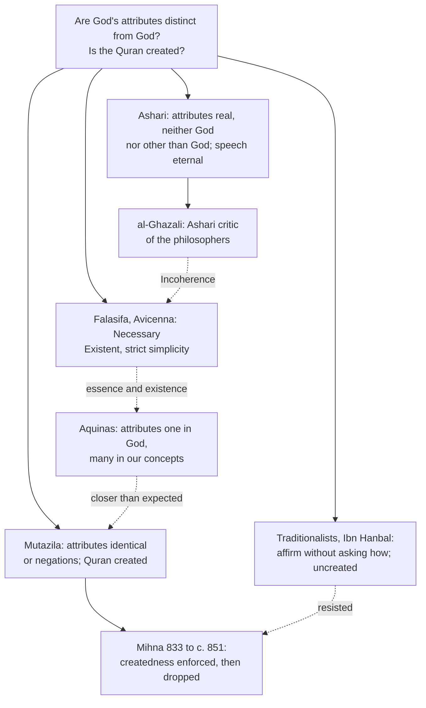

# Apologetics I · Lesson 7.1: Islam on its own terms

> ⏱ ~15 min · Module 7: Christianity and Islam · Builds on: [6.3 The Jewish reply, at full strength](06-03-the-jewish-reply-at-full-strength.md), [`church-history` 3.2](../../church-history/lessons/03-02-the-rise-of-islam-and-the-christian-mediterranean.md), [`ancient-medieval-philosophy` 6.3](../../ancient-medieval-philosophy/lessons/06-03-averroes-and-maimonides.md) · Unlocks: [7.2 Tawhid and the Trinity](07-02-tawhid-and-the-trinity.md), [7.3 The Incarnation](07-03-the-incarnation.md), [7.4](07-04-the-crucifixion-and-the-corruption-charge.md), [7.5](07-05-the-prophethood-of-muhammad.md)

## Why this matters

The next four lessons argue about God's oneness, the Incarnation, the cross, the scriptures and Muhammad. Each fails if the Islam it answers is one no Muslim holds. So this lesson argues almost nothing. It states Islam's account of God, revelation and prophecy as a Muslim theologian would, then says what the Church teaches about Muslims and at what weight. [`church-history` 3.2](../../church-history/lessons/03-02-the-rise-of-islam-and-the-christian-mediterranean.md) promised exactly this: Islam stated on its own terms, the Church's teaching marked for weight.

## The idea

**The record first.** Both sides have something to answer for. Arab armies conquered half of Christendom in eighty years. Christians and Jews then lived for centuries as taxed, subordinate *dhimmi*, and some rulers tightened the terms, as al-Mutawakkil did in 850 ([`church-history` 3.2](../../church-history/lessons/03-02-the-rise-of-islam-and-the-christian-mediterranean.md)). On the Christian side there was the slaughter at Jerusalem in July 1099 ([`church-history` 4.3](../../church-history/lessons/04-03-the-crusades.md)). And a polemical literature, from John of Damascus reading Islam as a heresy onward, portrayed Muhammad for centuries as an impostor ([7.5](07-05-the-prophethood-of-muhammad.md) states that record). Nostra Aetate 3 itself admits "not a few quarrels and hostilities". What follows is stated as a Muslim would state it.

**[Tawhid](../reference.md#tawhid).** A Muslim theologian begins with God's oneness. Surah 112 says God is One and the eternal refuge of all; He neither begets nor is begotten, and nothing is comparable to Him. Another verse says there is nothing like Him (42:11). *Tawhid*, "making one", is the affirmation of that oneness. It is a claim about God's being, and it is also a claim about worship: God alone is to be served. Its opposite is *shirk*, associating partners with God, the sin God does not forgive (4:48).

**The attributes and the [kalam schools](../reference.md#kalam-schools).** The Qur'an calls God knowing, powerful, willing, living, speaking. Are these attributes something real in God, distinct from His essence? Here the discipline of *kalam*, dialectical theology, divided.

- The **Mu'tazila**, flourishing from the eighth century, said no. Their reasoning, as the *Stanford Encyclopedia* entry on Arabic and Islamic philosophy of religion reports it: if the attributes were distinct eternal realities, there would be many eternal divine things, and *tawhid* would be lost. So "God is knowing" either denies a defect (He is not ignorant) or names something identical with God Himself.
- **Al-Ash'ari** (874–935/6), trained in Basra under the Mu'tazili master al-Jubba'i, broke with his teacher. The attributes are real and eternal, he held, but they are *neither identical to God nor other than Him*. Identity would make God a property and erase the difference between knowledge and power. Otherness would make many gods. With the related Maturidi school (al-Maturidi, d. 944), his became the main Sunni theology.
- The **traditionalists**, Ahmad ibn Hanbal's heirs, affirmed every attribute the Qur'an affirms and refused to ask how (*kayf*) God has them.

**God's speech and the [mihna](../reference.md#mihna).** The test case was the Qur'an itself. If God's speech is an eternal attribute, the Qur'an is [uncreated](../reference.md#uncreated-quran). If it is not, the Qur'an is a thing God made, as He made the heavens. The Mu'tazila held it created: an eternal Qur'an beside God looked to them like a second eternal. The traditionalists held it to be God's own speech (9:6 calls it God's speech), and so not a creature. In 833 the caliph al-Ma'mun made createdness official and had judges and scholars examined on it. That examination was the *mihna*, "the ordeal". Ahmad ibn Hanbal refused, and under al-Mu'tasim he was imprisoned and flogged. Al-Mutawakkil abandoned the policy from 847, and it was finished by about 851 (the sources differ on the exact end). The outcome shaped Sunni belief: the Qur'an is God's uncreated speech. The Ash'ari school refined this by distinguishing the eternal speech subsisting in God from its recitation, ink and paper, which are created. This was a Muslim argument about *tawhid*, on Muslim texts. The state enforced the rationalist side; the traditionalist who refused became a Sunni hero.

**Revelation and prophecy.** On the Muslim account, revelation (*wahy*) is God's speech sent down (*tanzil*): to Muhammad through Gabriel (2:97), so that what he recited was not his own word but revelation (53:4–5). God sent a messenger to every community (16:36). The prophets from Adam through Noah, Abraham, Moses and Jesus carried one message, and the believer makes no distinction among them (2:285). Each received a scripture or a mission. Jesus was given the Gospel, the *Injil* (5:46). The Qur'an confirms what came before it and stands guard over it (5:48). Muhammad is the [seal of the prophets](../reference.md#seal-of-the-prophets) (*khatam al-nabiyyin*, 33:40), and after him no prophet comes. So Islam understands itself not as a new religion but as the restored religion of Abraham, who was neither Jew nor Christian but a *hanif*, one who submitted to God (3:67).

**Philosophy and al-Ghazali.** Alongside *kalam* ran *falsafa*: Avicenna's God is the Necessary Existent ([`ancient-medieval-philosophy` 6.2](../../ancient-medieval-philosophy/lessons/06-02-avicenna-essence-existence-and-the-necessary-existent.md)). Al-Ghazali (c. 1056–1111), an Ash'ari who taught at the Nizamiyya in Baghdad and left it in 1095 for a Sufi life, judged the philosophers in *The Incoherence of the Philosophers*. He argued that they failed to demonstrate twenty of their theses and charged them with unbelief on three: an eternal world, God's ignorance of particulars, and a denial of bodily resurrection ([`ancient-medieval-philosophy` 6.3](../../ancient-medieval-philosophy/lessons/06-03-averroes-and-maimonides.md); his time puzzle against an eternal past is [`philosophy-of-religion` 2.5](../../philosophy-of-religion/lessons/02-05-cosmological-arguments-the-kalam.md)).

**A living tradition.** None of this is a museum piece. **Seyyed Hossein Nasr** (b. 1933), University Professor of Islamic studies at George Washington University, wrote *The Heart of Islam: Enduring Values for Humanity* (2002) after the September 11 attacks. It presents Islam's core teachings from its own sources and traces their counterparts among Jews and Christians. **Mahmoud Ayoub** (1935–2021), a Lebanese-born Shi'i scholar who directed Islamic studies at Temple University from 1988 to 2008, spent a career engaging Christian theology as a believing Muslim. His essays are collected in *A Muslim View of Christianity* (ed. Irfan Omar, 2007). In 2007, 138 Muslim scholars and leaders signed *A Common Word between Us and You* (13 October), an open letter to Christian leaders built on love of God and love of neighbour.

## The argument

The apologetic work starts in 7.2. Two claims belong here.

1. **P1.** Islam's account of revelation is coherent and has its own criterion. Revelation is God's speech, sent down to a prophet and preserved word for word.
2. **P2.** Catholic teaching locates revelation chiefly in a person. God reveals Himself through deeds and words that culminate in Christ, the Word made flesh (Dei Verbum 2 and 4, 1965). Scripture is inspired, and its human writers are true authors (Dei Verbum 11).
3. **P3.** Each criterion, applied to the other faith's scripture, finds it lacking: the Gospels are not dictated speech, and the Qur'an does not present God's self-gift in a person.
4. **∴ C.** Applying one criterion to the other scripture begs the question. The live disputes are whether God's oneness excludes the Trinity (7.2), whether God can become man (7.3), and what happened at the cross (7.4). *In words:* argue about God and history, not about whose book looks more like a book.

**What the Church teaches about Muslims, and at what weight.** [Nostra Aetate](../reference.md#nostra-aetate) 3 (28 October 1965), a conciliar declaration, regards Muslims with esteem. It says they adore the one God, living, merciful and almighty, Creator, who has spoken to men. They submit to His decrees as Abraham did. They honour Jesus as a prophet and Mary as his virgin mother, and they await the judgment. It names neither Muhammad nor the Qur'an. [Lumen Gentium 16](../reference.md#lumen-gentium-16) (21 November 1964), a dogmatic constitution, places Muslims first among those who acknowledge the Creator. They are those who, "professing to hold the faith of Abraham", adore with us the one merciful God who will judge on the last day (paraphrased in CCC 841). The rungs, read by [`fundamental-theology` 4.5](../../fundamental-theology/lessons/04-05-reading-a-documents-weight.md): Vatican II defined no new dogma, and neither text proposes this teaching as defined or definitive. Both are **rung 3**, authentic ordinary magisterium owed religious submission. That is the rung the sibling courses give Nostra Aetate 4 ([levels of authority](../reference.md#levels-of-authority)). "Professing" reports the Muslim claim; it neither endorses nor rejects Islam's reading of Abraham.

**Concession.** Islam's doctrine of God is not a cruder monotheism awaiting Christian correction. It is a rigorous theology with centuries of internal argument, and Christian natural theology learned from it: Aquinas's God whose essence is His existence comes through Avicenna. The Mu'tazili case that distinct eternal attributes threaten divine unity is close to the Thomist doctrine of simplicity ([`trinity-and-god` 1.3](../../trinity-and-god/lessons/01-03-simplicity-as-doctrine.md)). And on revelation P3 cuts both ways. By the Islamic criterion the Gospels really are testimony written by others, not God's dictated speech, and Catholic teaching agrees about what they are (Dei Verbum 19).

**Where the argument is weakest.** Muslims may reject P2's framing: Jesus was given a book, and the question is what became of it. That is the *tahrif* charge, and it does not beg the question, because it makes a historical claim that the evidence can test. [7.4](07-04-the-crucifixion-and-the-corruption-charge.md) has to meet it.

## Map of positions

The surprise is Aquinas: on divine simplicity the Thomist sits nearer the Mu'tazila than the Ash'aris, who with the traditionalists became Sunni orthodoxy.

## Worked examples

**Example 1: Word and Book.** An invented student writes: "Muslims treat the Qur'an the way we treat the Bible." The parallel is wrong in kind. For Sunni Muslims the Qur'an is God's uncreated speech, eternal in God and sent down in time. That role belongs in Christianity not to the Bible but to Christ, the eternal Word (John 1:1, 14). A Christian reads Scripture as inspired human writing (Dei Verbum 11). Call the Qur'an "inspired human writing" and a Muslim hears a denial of revelation. The real parallel is Book and Person, and it is why a Muslim hears "the Word was made flesh" as strange rather than merely false ([7.3](07-03-the-incarnation.md)).

**Example 2: "Same God"?** Lumen Gentium 16 says Muslims adore the one God together with us. Does a Catholic have to say that Muslims and Christians worship the same God? Muslims deny that God is triune. Two readings divide here. On a *referential* reading, both communities point to the one Creator who spoke to Abraham, and they disagree about Him, as two astronomers can disagree about one star. On a *descriptive* reading, the God who is not triune does not exist, so the descriptions pick out different objects. The text supports the first: it speaks of adoring the one merciful God, not of a shared doctrine. But the rung is 3 and the text is not a metaphysics of reference, so how far the referential reading goes is still argued among Catholic theologians. Many Muslim theologians would say Christians address the true God while associating others with Him: the charge [7.2](07-02-tawhid-and-the-trinity.md) answers.

## Watch out

- **You might think Vatican II recognized Muhammad as a prophet or the Qur'an as revelation.** Nostra Aetate 3 names neither. Its esteem is for Muslims and their belief about God, at rung 3; saying it defined anything is an error of level.
- **You might think the *mihna* was orthodox clerics persecuting rationalists.** It ran the other way. The caliphs enforced the Mu'tazili doctrine, and Ibn Hanbal was the one flogged. The Mu'tazila were theologians (*mutakallimun*), not *falasifa*.
- **You might think "Allah" names a different god.** It is the Arabic word for God, used by Arab Christians too. Whether two descriptions pick out one God is Example 2's question, and a word cannot settle it.

## One-liner

> Islam's God is the One who neither begets nor is begotten, revealed in an uncreated Book; Christianity's revelation is a Person. Argue there, and only after stating it as a Muslim would.

## Problems

**P1 (🟢) *(Exegetical: diagnose.)*** An invented forum post (nobody wrote it; it is built for the problem):

> "The *mihna* of 833 is when Islam chose faith over reason. Orthodox clerics led by Ahmad ibn Hanbal used the caliph's power to persecute the rationalist philosophers who said the Qur'an was created, and Islamic philosophy died then and there."

(a) Name two factual errors and correct each. (b) State in two sentences the theological question the *mihna* was about, in terms both parties would accept as fair.

**P2 (🟡) *(Apologetic: (a) Exegetical, graded first · (b) reply.)*** A Muslim theologian objects to the Christian view of revelation. (a) State the objection as its Muslim defenders would: what revelation is, what Jesus received, and what the four Gospels therefore are. Do not use the textual-corruption charge; that is 7.4's. (b) Reply. Your reply must open with a named concession. 150 words or fewer in total.

**P3 (🔴, optional) *(Exegetical, strict.)*** An invented parish bulletin note: "At Vatican II the Church solemnly defined that Muslims worship the same God as we do, and in Nostra Aetate 3 she recognized Muhammad as a prophet sent by God. Since these are conciliar teachings, denying them is heresy." Correct each of its three claims, giving the documents' genres and rung. Four sentences or fewer.

Solutions

**P1** *(Exegetical.)*

**Must hit, strict (a):**

- **Direction.** The caliphs (al-Ma'mun from 833, then al-Mu'tasim and al-Wathiq) imposed the doctrine that the Qur'an is created and examined judges and scholars on it. Ahmad ibn Hanbal was the victim, imprisoned and flogged, not the persecutor.
- **Who the Mu'tazila were.** They were theologians of *kalam*, arguing from revelation about God's unity, not *falasifa*. Philosophy did not die: Avicenna (d. 1037) and Averroes (d. 1198) came later, and Averroes was a Muslim judge.

**Must hit, strict (b):**

- Is God's speech, the Qur'an, an eternal attribute of God, and so uncreated, or a thing God created in time? Each side argued from *tawhid*. The Mu'tazila held that an eternal Qur'an would be a second eternal beside God. The traditionalists held that God's own speech cannot be a creature.

**Wrong turns:** treating the dispute as about whether the Qur'an is true or revealed, which both sides affirmed; calling Ibn Hanbal a philosopher.

**Model answer:** (a) It was the caliphs, from al-Ma'mun in 833, who enforced the doctrine of a created Qur'an. Ibn Hanbal refused it and was imprisoned and flogged, so the traditionalist was the one persecuted. The Mu'tazila were *kalam* theologians, not philosophers, and *falsafa* went on to its greatest figures, Avicenna and Averroes, after the *mihna*. (b) Is the Qur'an God's eternal, uncreated speech, an attribute of God, or a thing He created? Both sides argued from God's oneness: one feared a second eternal beside God, the other feared making God's own word a creature.

---

**P2** *(Apologetic: (a) Exegetical, graded first · (b) reply.)*

**Must hit, strict (a), graded first:**

- Revelation (*wahy*, *tanzil*) is God's own speech sent down to a prophet, through Gabriel in Muhammad's case, and preserved word for word. The Qur'an is that speech.
- Jesus was a prophet who received a scripture, the *Injil* (5:46).
- So the four Gospels are accounts by others about Jesus, not the *Injil* he received. By this criterion Christians hold reports about a revelation, not the revelation itself.

**Must hit (b):**

- A named concession: the Gospels are human testimony, written after Jesus by his followers, not dictated divine speech. Catholic teaching says the same (Dei Verbum 11, 19).
- The reply: the objection measures Christian revelation by the Islamic criterion. On the Catholic account revelation is God's self-disclosure in deeds and words culminating in a person (Dei Verbum 2, 4). Scripture is inspired testimony to that person, so the Gospels' being testimony is what they claim to be, not a defect.
- Credit for seeing that the dispute moves to whether God would reveal Himself in a person (7.3), and that the same reply forbids the Christian from faulting the Qur'an for not being a Gospel.

**Wrong turns:** stating the objection as "Christians corrupted their book" (that is *tahrif*, excluded); calling the Qur'an Muhammad's composition in the reply; claiming the Gospels were dictated.

**Model answer, one of several:** (a) For Islam, revelation is God's own speech sent down to a prophet and preserved verbatim. Jesus received such a scripture, the *Injil*. The Gospels are four accounts of him by others, so Christians possess reports about revelation, not revelation. (b) Concession: the Gospels are indeed human testimony written by Jesus's followers, not God's dictated speech, and the Church says so. But the objection assumes the Islamic criterion. On the Christian account God reveals Himself chiefly in Christ, through deeds and words. Scripture is inspired witness to him, with human writers as true authors. The real question is whether God would speak in a person, not whose book is more book-like.

---

**P3** *(Exegetical, strict.)*

**Must hit, strict:**

- **"Solemnly defined":** false. Vatican II defined no new dogma. Lumen Gentium (1964) is a dogmatic constitution, and its sentence on Muslims is authentic ordinary magisterium, rung 3. It does say that Muslims, professing the faith of Abraham, adore with us the one merciful God, so the content is roughly right and the level is wrong.
- **Muhammad:** Nostra Aetate 3 (1965), a conciliar declaration, names neither Muhammad nor the Qur'an. Its esteem is for Muslims and what they believe and practise.
- **"Heresy":** heresy is obstinate denial of a rung-1 truth (can. 751). Both texts are rung 3, owed religious submission. Dissent from them is not heresy, though it is not nothing either.

**Wrong turns:** saying conciliar texts are non-binding (understates rung 3); saying Lumen Gentium is "only pastoral" (it is a dogmatic constitution, and genre does not set the rung); answering the "same God" question on its merits (not asked).

**Model answer:** Vatican II defined no dogma. Lumen Gentium 16, in a dogmatic constitution, teaches at rung 3 that Muslims, professing Abraham's faith, adore the one merciful God with us. Nostra Aetate 3, a declaration, also rung 3, praises Muslims' belief and worship but never names Muhammad or calls him a prophet. Since neither text is a rung-1 definition, rejecting it is not heresy, though both are owed religious submission.

## Flashback

**From Lesson [6.3](06-03-the-jewish-reply-at-full-strength.md) (The Jewish reply, at full strength):** *(Apologetic: (a) Exegetical, graded first · (b) Evaluative, then reply.)* An invented apologist (nobody said this; it is built for the problem) answers Jacob Neusner's *A Rabbi Talks with Jesus* (1993):

> "Neusner says a faithful Jew could not follow Jesus. But scholars have shown that a divine-human redeemer was a Jewish idea before it was a Christian one. So his objection rests on a border the rabbis drew later, and he ought to see that his own tradition had room for Jesus all along."

(a) State Neusner's refusal as he gives it: where he imagines himself, how he responds to what he hears, and why he would not follow. Two sentences. (b) Say which strand of the Jewish case the apologist's argument actually answers and why it misses Neusner; then give a better reply that opens with a named concession. 100 words or fewer for (b).

Solution

**Accept:** in (b), any verdict on whether a better reply succeeds, provided it answers Neusner's actual reason and keeps the concession.

**Must hit, strict (a), graded first:**

- Neusner places himself **in the crowd at the Sermon on the Mount**, listens **with admiration**, and concludes he **would not have followed**.
- The reason is **Jesus's claim about himself**: on the Sabbath above all, Jesus puts himself **where the Torah stands**, and a Jew faithful to the Torah cannot follow a man who does that.

**Must hit (b):**

- The apologist's argument (the Segal and Boyarin line of 6.3's Example 2) answers **strand 4, the Shema**: it removes the charge that a divine-human figure is *unthinkable* for Jews. Neusner never says it is unthinkable. His refusal (strand 5) is that following Jesus displaces the Torah, so the argument misses him.
- It also tells a living Jew what his tradition "really" holds. The border may have been drawn later, but Neusner stands on the rabbinic side of it by choice: bad argument and bad manners.
- A **named concession**: Neusner reads the Gospels accurately; Jesus does put himself where the Torah stands, and that claim is the real question. (Benedict XVI's *Jesus of Nazareth* grants this diagnosis, at no magisterial level.)
- A reply that moves the dispute to whether that claim was **authorized**, which only an argument like the resurrection case of Module 5 could bear on. No reading of a text settles it.

**Wrong turns:** stating (a) as "Neusner found Jesus's ethics deficient" (he admired the teaching) or as "Neusner held the Incarnation impossible" (that is not his reason). Calling the refusal stubbornness or blindness, which fails the respect item. Claiming the better reply proves Neusner wrong.

**Model answer, one of several:** (a) Neusner imagines himself in the crowd at the Sermon on the Mount, listening with admiration. He would not follow, because Jesus puts himself where the Torah stands, above all on the Sabbath, and a Jew faithful to the Torah cannot follow a man who does that. (b) The apologist answers the Shema strand: a divine-human redeemer was thinkable. Neusner's objection is not that it is unthinkable but that it displaces the Torah, and telling him his tradition is not really his is poor argument and poor manners. Concession: Neusner has read Jesus rightly; the claim is exactly what is at stake. Whether God authorized it is a question for the resurrection evidence, not for reinterpreting his tradition.

## Connections

- **Backward:** the conquests, *dhimmi* status and John of Damascus are [`church-history` 3.2](../../church-history/lessons/03-02-the-rise-of-islam-and-the-christian-mediterranean.md), and 1099 is [`church-history` 4.3](../../church-history/lessons/04-03-the-crusades.md). Avicenna, al-Ghazali and Averroes as philosophers are [`ancient-medieval-philosophy` 6.2–6.3](../../ancient-medieval-philosophy/lessons/06-03-averroes-and-maimonides.md). Daniel and Amira's disagreement over *tawhid* is [`philosophy-of-religion` 5.5](../../philosophy-of-religion/lessons/05-05-religious-diversity.md). How to read a document's rung is [`fundamental-theology` 4.5](../../fundamental-theology/lessons/04-05-reading-a-documents-weight.md).
- **Forward:** [7.2](07-02-tawhid-and-the-trinity.md) answers the *shirk* charge from the *tawhid* stated here; [7.3](07-03-the-incarnation.md) takes up Book versus Person; [7.4](07-04-the-crucifixion-and-the-corruption-charge.md) meets 4:157 and *tahrif*; [7.5](07-05-the-prophethood-of-muhammad.md) states the case for the seal of the prophets. What Lumen Gentium 16 means for salvation is [8.2](08-02-salvation-outside-the-visible-church.md).
- **Sideways:** the Mu'tazili worry about many eternal attributes is the Thomist doctrine of divine simplicity in another key ([`trinity-and-god` 1.3](../../trinity-and-god/lessons/01-03-simplicity-as-doctrine.md)). The *mihna* is a case study in the state enforcing a theology, a useful foil for what *Dignitatis Humanae* (1965) later taught about coercion in religion.
