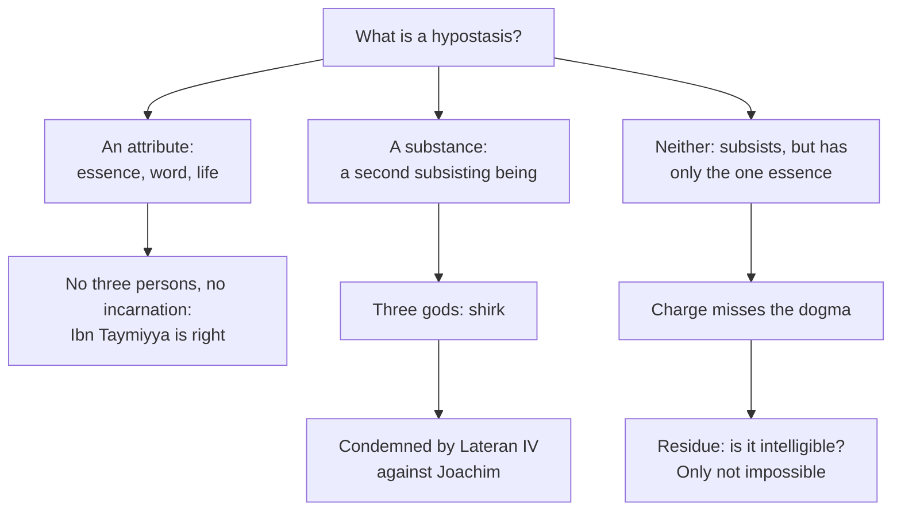

# Apologetics I · Lesson 7.2: Tawhid and the Trinity

> ⏱ ~15 min · Module 7: Christianity and Islam · Builds on: [7.1 Islam on its own terms](07-01-islam-on-its-own-terms.md), [`trinity-and-god` 3.2](../../trinity-and-god/lessons/03-02-one-ousia-three-hypostaseis.md), [`trinity-and-god` 2.1](../../trinity-and-god/lessons/02-01-the-one-god-of-israel.md) · Unlocks: [7.3 The Incarnation](07-03-the-incarnation.md), [7.4 The crucifixion, and the corruption charge](07-04-the-crucifixion-and-the-corruption-charge.md)

## Why this matters

To a Muslim, the Christian confession of Father, Son and Spirit looks like the one sin the Qur'an calls unforgivable: giving God a partner. That charge is the first thing a Muslim theologian says about Christianity, and the oldest. This lesson answers it in the only way that is not a dodge. It states the charge at its strongest, from a classical theologian who read what Christians actually wrote. Then it states the doctrine exactly enough to show which version of the charge misses, and which part of it still stands.

## The idea

*[Tawhid](../reference.md#tawhid)*, as [7.1](07-01-islam-on-its-own-terms.md) stated it, is God's absolute oneness. He has no partner, no equal and no parts, and nothing is like him (42:11). Its contrary is *[shirk](../reference.md#shirk)*, associating anything with God in his divinity or in the worship owed to him. The Qur'an says God does not forgive that, though he forgives what is less (4:48; 4:116).

Three passages carry the charge against Christians. They are cited here by surah and ayah and paraphrased. 4:171 tells the People of the Book not to exceed bounds in their religion. Jesus son of Mary was a messenger of God, his word cast to Mary and a spirit from him; so they should not speak of God as three, for God is one God, too exalted to have a son. 5:73 calls unbelievers those who make God one member of a three (*thalith thalatha*), and 5:72 says whoever associates partners with God is barred from paradise. In 5:116 God asks Jesus whether he told people to take him and his mother as two gods besides God. Jesus disowns the claim: had he said it, God would know.

[What 5:116 suggests](../reference.md#quran-5-116) about the Christianity in view is disputed, and the honest report is a range. No known Christian body counted Mary a person of the Trinity. Some scholars point to the Collyridians, whom Epiphanius (d. 403) accused of offering cakes to Mary in Arabia. Mohsen Goudarzi notes that even Epiphanius seems unsure what they believed. Michel Cuypers reads a divine Mary as the absurd corollary the Qur'an draws from a divine Jesus, sharpened by the title *Theotokos*. Gabriel Reynolds calls the phrasing a deliberate *reductio* of Marian veneration. Goudarzi (2025), following Blachère and the commentary of Nasr's *Study Quran* (2015), reads it as aimed at worship rather than dogma: a devotional "trinity" of Father, Son and Mary. At least one early exegete took the three of 5:73 as God, Christ and Mary: Muqatil ibn Sulayman (d. 767), who assigned that trinity to the Melkites, wrongly by Goudarzi's account.

## The other side

The charge at full strength is not "Christians worship three gods". It is a dilemma, and **Ibn Taymiyya** (d. 1328) pressed it hardest in *al-Jawab al-Sahih li-man baddala din al-Masih*. He wrote it in reply to the *Letter from the People of Cyprus*, which reached him in 1316 or 1317. That letter reworked the *Letter to a Muslim Friend* of Paul of Antioch, Melkite bishop of Sidon. (Thomas Michel's partial translation, 1984; summary in Ismail Abdullah, *Intellectual Discourse* 14, 2006.)

Paul had offered Muslims a friendly gloss. God is one living, speaking being, namely essence, word and life. The Father is the essence, the Son the word born of him as speech from the mind, and the Spirit the life. The letter added images: the sun's disc, brightness and rays are not three suns. Ibn Taymiyya's reply runs in four steps.

1. **Why three?** Christians disagree about which attributes the persons are (existence, word, life; or existence, word, power). And God's names are many, so stopping at three is arbitrary.
2. **An attribute is not a God.** Knowledge cannot create or provide, and it cannot be united to a man apart from the knower. So either the Word was united *with* the essence, and the Father and Spirit became incarnate too, or *without* it, which is impossible, since an attribute exists only in what it qualifies.
3. **Or the persons are substances.** The creed's "of one substance with the Father" makes the Son equal to the Father in substance. Only a substance equals a substance, so there are three substances and three gods.
4. **The words were misread.** In the prophets, "Father" means God's mercy and care for his creatures. "Son" means one who is nurtured, as when Jesus calls God his Father and his disciples' Father alike (John 20:17). The "Holy Spirit" means Gabriel or the strength God puts into prophets. The baptismal formula (Matthew 28:19) commands belief in God, his messenger and his angel. The Christian gloss is *tahrif al-ma'na*, corruption of meaning ([7.4](07-04-the-crucifixion-and-the-corruption-charge.md)).

So the Christian has two options and both lose. If the persons are attributes, there are not three persons and no incarnation. If they are subsistent beings, there are three gods, and that is *shirk*. Behind this lies the **parts complaint**, which Muslim theologians commonly press. God is not composite. Every Christian analogy (disc and rays, leaves of a clover) gives either parts of one thing or aspects of one thing, and so falls into one horn or the other.

## The argument

**P1.** *Shirk* is ascribing to some being other than God the divinity, or the worship, that is God's alone. *In words:* it needs a second being.

**P2.** The Church confesses that the three are **one numerically single essence**. Each person *is* that whole reality, and the persons are [distinguished only by their relations of origin](../reference.md#relations-of-origin). Lateran IV (1215) says the Trinity is undivided in essence and distinct in the properties of the persons. Florence (1442) says everything in God is one where no opposition of relation intervenes. CCC 253–255 says one God, not three, with each person God whole and entire. These are rung 1 texts ([`trinity-and-god` 3.2](../../trinity-and-god/lessons/03-02-one-ousia-three-hypostaseis.md), [3.4](../../trinity-and-god/lessons/03-04-the-latin-rules-of-speech.md)).

**P3.** The **substance horn** describes a position the Church has condemned. Joachim of Fiore made the unity of the three collective, as many believers are one people. Lateran IV's second constitution condemns that treatise, and teaches that each of the three persons is the one supreme reality, so there is a Trinity in God and no fourth thing. The Athanasian Creed forbids speaking of three Gods. Three centres of will is the classic route into [tritheism](../reference.md#tritheism-charge) ([`trinity-and-god` 6.4](../../trinity-and-god/lessons/06-04-social-trinitarianism-and-its-critics.md)).

**P4.** The **attribute horn** describes Paul of Antioch's model, not the dogma. Augustine had already refused to make the Father wise only by the Wisdom he begets: the Father is himself wisdom, and wisdom is common to the three (*De Trinitate* VII.1–2). Knowledge, power and will are one in God. The persons are not three of God's attributes. They are three who each have the one essence, differing only in origin.

**P5.** So the dilemma's disjunction, "attribute or substance", is incomplete. A divine person subsists, so it is not an attribute. It has no being, power or will of its own beside the one essence, so it is not a second substance. The Latin schools' name for this is *subsistent relation* ([`trinity-and-god` 4.4](../../trinity-and-god/lessons/04-04-four-relations-three-persons.md)). That is theology below the seam, never defined.

**∴ C.** The *shirk* charge, aimed at a second being beside God, misses the dogma, because the dogma posits no second being. It lands on the attribute gloss and on popular speech.

This reply is not a dodge, because it can be checked. "We reject tritheism too" would be a dodge if it stopped there. It does not. It names a test any Muslim reader can run on any Christian sentence: does it count anything three except the relations? If it counts three wills, three powers, or three of anything absolute, the sentence is tritheist and the Church condemns it.

**Concession.** Popular Christian talk often does sound tritheist. Hymns, sermons and catechesis speak of the Father deciding and the Son agreeing, or of a divine committee. Clover leaves and egg shells are images of parts. The best-known apologetic gloss offered to Muslims, Paul of Antioch's, made the persons attributes, and Ibn Taymiyya's reply to it is sound. A Muslim who hears these and concludes "three gods" has listened accurately to what was said.

**Where the argument is weakest.** P5 shows the charge misses. It does not show the doctrine is understood. "Subsistent relation" names a category with exactly one case, and no creaturely instance fills it in. Here the apologist keeps [`trinity-and-god` 2.1](../../trinity-and-god/lessons/02-01-the-one-god-of-israel.md)'s promise. Aquinas forbids offering a proof of the Trinity. To those outside the faith one may show only that what faith teaches is **not impossible** (ST I q.32 a.1). Analogies do not escape the parts complaint. On the Catholic account each analogy fails in a stated way, under Lateran IV's rule that every likeness carries a greater unlikeness ([analogy](../../thomistic-synthesis/lessons/04-04-analogy.md)). One parity move is available. The Ash'ari tradition says God's eternal attributes are "neither he nor other than he", and Mu'tazila critics heard Christian echoes in that. But Muslim theologians answer that attributes are not *entities*, while the persons are. So the parity is contested, not a win.

## The dilemma map

Two of the three branches end where Ibn Taymiyya and the Church agree. The dispute lives on the third.

## Worked examples

**Example 1 (clean): "equal in substance".** Ibn Taymiyya's third step reads *homoousios* as "equal in substance". Only a substance can be equal to a substance, so there must be two. But the Nicene word does not mean "equal". It means *the same*: one numerically single substance, which each person is (Lateran IV: each person is that one reality). Equality between two substances is precisely what the Church calls tritheism. The step criticizes a translation, and the doctrine itself agrees with it.

**Example 2 (strains): "with the essence or without it?"** The second step asks whether the Word became incarnate with the divine essence or without it. Take the first horn. The essence is in the Son, and the Son is incarnate, so the divine nature is united to a humanity. Since the Father *is* that essence, is the Father incarnate? Aquinas answers that the act of assuming is the common work of the three, while the union ends in the person of the Son alone (ST III q.3 a.4). The nature is united *in* the Son and not in the Father. That answer works only if "united in this person" can differ from "united to this essence", which is exactly the distinction a Muslim thinks has no content. The strain is real, and [7.3](07-03-the-incarnation.md) takes it up.

## Watch out

- **You might think 5:116 shows the Qur'an thought Christians' Trinity was Father, Mother and Son.** That is one reading among several, and it is not the dominant modern one. Others read the verse as aimed at Marian devotion, or as deliberate rhetoric. Its target remains disputed.
- **You might think "subsistent relation" is the Church's dogma.** What is defined (rung 1) is one essence and three persons distinguished by relations of origin. The subsistent-relation analysis is Latin theology. Presenting it to a Muslim as defined overstates its level.
- **You might think Ibn Taymiyya misunderstood the Trinity.** He answered the explanation that Christians themselves sent him, and on that explanation he was largely right. To caricature him is to lose this argument.

## One-liner

> The *shirk* charge is a dilemma, attribute or second god, and both horns describe positions the Church also rejects; the dogma escapes through a third option that it can show is not impossible but cannot make imaginable.

## Problems

**P1 (🟢) *(Diagnose · Exegetical.)*** An invented forum post (nobody wrote it):

> "Qur'an 5:116 has God ask Jesus if he told people to worship him and his mother. So the Qur'an thinks the Christian Trinity is Father, Mother and Son. No Christian has ever believed that, which proves the book is mistaken about Christianity."

Name two errors in the post. For each, say what an accurate account of the verse and the scholarship would put in its place. Three sentences per error at most.

**P2 (🟡) *(Apologetic: (a) Exegetical, graded first · (b) reply.)*** At an invented interfaith evening, a Catholic speaker explains the Trinity with a shamrock: three leaves, one plant. A Muslim student answers with the parts complaint.
(a) State the parts complaint as a Muslim theologian would state it, including the dilemma it rests on. (b) Reply. Open with a **named concession**. 150 words or fewer in total.

**P3 (🔴, optional) *(Find the crux · Evaluative.)*** A Muslim theologian grants that the Catholic doctrine is not the tritheism of the substance horn. He then says: "A formula whose central term you admit you cannot fill in is not a doctrine of God. It is a refusal to give one." (a) Name the premise on which he and a Catholic actually disagree. (b) Say which side you think bears the burden on it, and why. 100 words or fewer.

Solutions

**P1** *(Diagnose · Exegetical)*

**Accept:** any two of the three errors below, each with its correction.

**Must hit, strict:**

- **Error 1: the verse is read as a statement of Christian dogma.** What 5:116 says is narrower. God asks whether Jesus told people to take him and his mother as two gods besides God, and Jesus disowns it. Whether its target is doctrine at all is disputed. Readings include a marginal sect (the Collyridians of Epiphanius), a corollary drawn from a divine Jesus or the title *Theotokos* (Cuypers), deliberate rhetorical exaggeration (Reynolds), and practical Marian devotion (Blachère; Nasr's *Study Quran*; Goudarzi).
- **Error 2: "proves the book is mistaken" skips the dispute.** If the verse addresses worship rather than dogma, or argues by *reductio*, then an accurate report of Christian dogma does not refute it. The inference needs the doctrinal reading, which is the contested point.
- **Error 3 (alternative): "no Christian has ever believed that" is overconfident in the other direction.** It is true that no known Christian body counted Mary a person of the Trinity. But Epiphanius reports worship offered to Mary, and at least one early Muslim exegete (Muqatil, on 5:73) took the three as God, Christ and Mary. The record is mixed, and the post flattens it.

**Wrong turns:** asserting that the Collyridians are established as the verse's target. Saying the Qur'an "quotes" a Christian creed. Quoting a translation of the verse instead of paraphrasing it.

**Model answer:** First, the post treats 5:116 as a report of Christian doctrine. The verse only has God ask Jesus whether he told people to take him and his mother as gods, and scholars disagree whether it targets dogma at all: a fringe sect, a reductio, or Marian devotion. Second, "proves it mistaken" follows only on the doctrinal reading. If the verse targets practice or argues ad absurdum, a correct statement of the Trinity does not touch it.

---

**P2** *(Apologetic: (a) Exegetical, graded first · (b) reply)*

**Accept:** any reply that opens with the concession and separates the analogy from the doctrine, whatever its verdict.

**Must hit, strict (a), graded first:**

- *Tawhid* includes the denial that God is **composite**. God has no parts, and nothing is like him (42:11).
- The **dilemma**: every analogy for three-in-one gives either **parts** of one whole (leaves, disc and rays) or **aspects or attributes** of one subject (Paul of Antioch's essence, word and life). Parts make God composite. Aspects make the three not three persons (Ibn Taymiyya: an attribute is not a God and cannot be incarnate).
- So if the analogies are the best Christians can offer, the doctrine is either composition (and, with three subsisting beings, *shirk*) or no real three.

**Must hit (b):**

- A **named concession**: the shamrock is an image of parts, and the complaint against it is correct.
- The analogy is not the doctrine. The dogma says each person *is* the whole essence, not a third of it (Lateran IV; CCC 253). So "part" is excluded by the dogma itself.
- Analogies are licensed only under the greater-dissimilarity rule. Each one fails in a stated way, and the apologist claims only that the doctrine is **not impossible** (ST I q.32 a.1), not that any image makes it clear.

**Wrong turns:** stating (a) as "Muslims think Christians worship three gods", which drops the dilemma, the actual argument. Defending the shamrock. Replacing it with water, ice and steam, which is modalism, the other horn. Claiming the Church has defined that the persons are subsistent relations.

**Model answer (b), one of several:** (a) God is one and not composite. A Christian analogy shows either three parts of one thing or three aspects of one thing. Parts divide God, and aspects are not persons, so the doctrine collapses into composition or into one God with three names. (b) Concession: the shamrock is an image of parts, and you are right to reject it, as the Church does. The dogma says each person is the whole divine essence, not a share of it, so no analogy of parts can state it. Every image fails somewhere. Claiming that the Trinity is clear is not the Christian's job. The job is to show that it is not a contradiction: one essence, three who are distinguished only by where each is from.

---

**P3** *(Find the crux · Evaluative)*

**Must hit, strict (a):** the crux is whether **belief requires a positive grasp of what is believed** or only the exclusion of contradiction plus a credible witness. The Muslim premise is that a doctrine about God must be intelligible in content. The Catholic premise is that revealed mysteries may be believed on authority so long as they are shown not impossible (ST I q.32 a.1).

**Must hit, any verdict (b):** a reason tied to the premise. For example: the Catholic bears it, because he asserts a positive doctrine. Or the critic bears it, because *tawhid* also affirms what we cannot comprehend (the Ash'ari "neither he nor other than he"), so incomprehensibility cannot by itself disqualify a doctrine.

**Wrong turns:** naming "whether God is three", which is the conclusion. Repeating the tritheism dispute, which the stem has already granted away.

**Model answer, one of several:** (a) Whether one may assent to a proposition about God whose key term one cannot positively fill in, provided it is shown free of contradiction and comes from a credible witness. (b) I think the burden is shared. The Catholic must show that the formula excludes something definite, and he can (three gods, three modes). The critic must say why his own unimaginable claims about the divine attributes pass a test the Trinity fails.

## Flashback

**From Lesson [6.4](06-04-supersessionism-nostra-aetate-and-the-jewish-people.md) (Supersessionism, Nostra Aetate, and the Jewish people):** *(Apologetic: (a) Exegetical, graded first · (b) reply.)* At an invented interfaith study day (nobody here is real), a Catholic speaker presents Nostra Aetate 4 as proof that the Church "has always, at its best, respected the Jewish people." A Jewish participant answers not with Novak's conceptual charge but with the **historical charge** 6.4 states. (a) State that charge as a Jewish critic would press it. **Two sentences at most.** (b) Reply in **120 words or fewer**, opening with a **named concession**, and mark the level of every Church text you rely on. A reply that concludes the change is only one of manners passes if it is a good reply.

Solution

**Must hit, strict (a), graded first:**

- The teaching of contempt was not an accident of bad Christians: it was **what the theology said** (punitive supersessionism: Israel rejected Christ, so God rejected Israel; Matthew 27:25 read as a curse), and it was taught for some fifteen centuries.
- The Church changed **only after Auschwitz**, so it must show that the change is more than a change of manners.

**Must hit (b):**

- A **named concession**, stated without offset: the record (preaching, 1096, Lateran IV, Talmud burnings, expulsions, the Shoah's setting), and that replacement theology was the standard basis of the relationship (2015 reflection §17). The speaker's "always, at its best" is itself false and should be withdrawn.
- An **anchor older than the record**: the present teaching retrieves Paul (Rom 11:28–29, the gifts and calling irrevocable), and the rejection of structural supersessionism rests on the rung-1 dogma that one God authored both Testaments. So the change has a source the contempt contradicted, not one invented in 1965.
- **Levels marked correctly**: NA 4 is a conciliar declaration, rung 3, defining nothing; CCC 121 and 597 carry the weight of their sources; the 2015 reflection is below the seam.
- **An honest limit**: an older source shows the change *can* be more than manners, not that it was made for that reason, and a rung-3 teaching is not irreformable in the way a definition is. A reply that grants this much passes.

**Wrong turns:** citing *Sicut Judaeis* or the bishops who tried to protect the Rhineland Jews as mitigation (6.4: both are true, and the second does not offset the first). Calling NA 4 a definition, or saying it declared the covenant never revoked. "The Church never taught this; only some Christians did," which contradicts the concession and §17. Restating the charge as "Jews blame all Christians", which is a caricature and fails (a).

**Model answer (b), one of several:** Concession: you are right. Contempt for Jews was Church theology, preached by saints and enacted by a council, and the Church's own commission says replacement theology was the standard basis for centuries (2015, §17). The change did come after the Shoah. But it is not new manners with no root. It retrieves Paul, who held Israel "most dear" with gifts "without repentance" (Rom 11:28–29), and the dogma, at rung 1, that one God authored both Testaments. Nostra Aetate 4 states this at rung 3: authentic teaching, not a definition. So the change has a source older than the contempt it corrects. Whether the Church changed *because* of that source, rather than from shame, the texts cannot show.

## Connections

- **Backward:** [7.1](07-01-islam-on-its-own-terms.md) stated *tawhid* and the *kalam* schools. [`trinity-and-god` 3.2](../../trinity-and-god/lessons/03-02-one-ousia-three-hypostaseis.md) owns the vocabulary of *ousia* and *hypostasis*, [3.4](../../trinity-and-god/lessons/03-04-the-latin-rules-of-speech.md) the rules of Lateran IV and Florence, and [4.4](../../trinity-and-god/lessons/04-04-four-relations-three-persons.md) the subsistent relation. [`trinity-and-god` 2.1](../../trinity-and-god/lessons/02-01-the-one-god-of-israel.md) promised the "not impossible" standard that this lesson keeps.
- **Forward:** [7.3](07-03-the-incarnation.md) takes up Example 2: how the Son can be incarnate without the Father. [7.4](07-04-the-crucifixion-and-the-corruption-charge.md) takes Ibn Taymiyya's fourth step, *tahrif al-ma'na*, together with Ibn Hazm's charge of textual corruption.
- **Sideways:** the 362 procedure in [`trinity-and-god` 3.2](../../trinity-and-god/lessons/03-02-one-ousia-three-hypostaseis.md) (ask what each word is used to deny) is the method of this whole lesson, now applied across religions. Gregory of Nyssa's argument that the three are not three gods is [`patristics` 3.3](../../patristics/lessons/03-03-the-two-gregories.md). The theory behind the analogy rule is [`thomistic-synthesis` 4.4](../../thomistic-synthesis/lessons/04-04-analogy.md).
