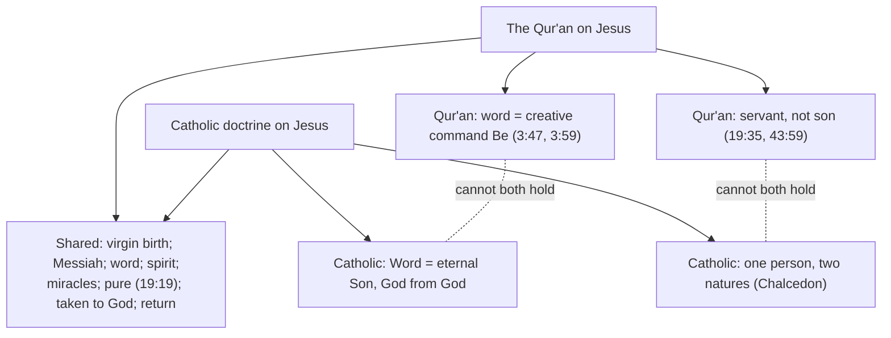

# Apologetics I · Lesson 7.3: The Incarnation

> ⏱ ~15 min · Module 7: Christianity and Islam · Builds on: [7.1 Islam on its own terms](07-01-islam-on-its-own-terms.md), [7.2 Tawhid and the Trinity](07-02-tawhid-and-the-trinity.md) · Unlocks: [7.4 The crucifixion, and the corruption charge](07-04-the-crucifixion-and-the-corruption-charge.md)

## Why this matters

[7.2](07-02-tawhid-and-the-trinity.md) asked whether three persons can be one God. This lesson asks whether God can be a man. For a Muslim theologian the answer is no, because to say yes would deny what God is. For a philosopher the answer may also be no, because nothing can be both created and uncreated. The Christian reply has to meet both without softening the doctrine. It also has to state correctly the Jesus whom the Qur'an honours.

## The idea

Two refusals, two kinds of argument. The **Muslim** refusal is theological: God is utterly unlike anything created, so a God with a body, a birth and a hunger is not God. The **philosophical** refusal is logical: the predicates of God and of a man contradict each other, so nothing can bear both.

The Christian reply starts by asking what exactly is being refused. On the Catholic account, the Word did not turn into a man, was not poured into a body, and was not mixed with a man into a third thing. He did not come to exist by being begotten in time. What the Church holds, at **rung 1** ([levels of authority](../reference.md#levels-of-authority)), is the [Chalcedonian Definition](../../christology/lessons/02-03-eutyches-leo-and-chalcedon.md): **one and the same Son, perfect in Godhead and perfect in manhood, in two natures, without confusion or change.** CCC 464 restates it in negatives: not part God and part man, not a mixture of the two, but truly man while remaining truly God. The argument below asks whether the objection is aimed at that, or at something both sides reject.

## The other side

**The transcendence objection.** Muslim theology calls it *tanzih*: holding God clear of every likeness to creatures. Its charter text is 42:11, which says there is nothing like him. Surah 112 adds that God is One, the one on whom all depend, that he neither begets nor was begotten, and that nothing is equal to him. The *kalam* theologians drew out what follows. A body is composite, limited, located and changing, so God is not a body. And God cannot enter a creature by **indwelling** (*hulul*) or be **united** with one (*ittihad*), because either would make the eternal depend on something temporal. The Qur'an says the Messiah was only a messenger like those before him, and that he and his mother both ate food (5:75): a being who needs food is a creature. It calls the claim that God is the Messiah unbelief, and has the Messiah himself tell Israel to worship God, "my Lord and your Lord" (5:72; also 5:17).

**Sonship.** The Qur'an says it is not fitting for God to take a son: when he decrees a thing he says "Be", and it is (19:35). It asks how God could have a son when he has no consort (6:101). And it calls the claim of a son so grave that the heavens are nearly torn by it (19:88–92). Christians often hear 6:101 as a misunderstanding of something physical. That reading is too quick. Arabic *walad* means offspring. The deeper argument in [*tawhid*](../reference.md#tawhid) is that any son shares his father's nature, and a second bearer of the divine nature is a partner with God. That is the root of the [*shirk*](../reference.md#shirk) charge, and it holds whatever kind of begetting is meant. The ninth-century **Abu 'Isa al-Warraq** pressed the objection at its most rigorous in his *Against the Incarnation* (edited and translated by David Thomas, 2002). He took each communion's account of the union, Melkite, Nestorian and Jacobite, and argued each incoherent on its own terms.

His line of attack can be set out as a dilemma (this is the lesson's reconstruction, not his wording). **Either** the Word really changed in uniting with a man, and then he is not the unchanging God. **Or** nothing in the Word changed, and then the "union" is only a relation between God and a man. A man to whom God is related, however closely, is still God's servant. The Qur'an says exactly that of Jesus (43:59; 4:172).

**The Islamic Jesus.** The Qur'an gives its own [account of Jesus](../reference.md#isa-in-the-quran), and it is a high one. He is *'Isa ibn Maryam*, born of a virgin: Mary asks how she can have a son when no man has touched her (3:47; 19:20). As an infant he speaks from the cradle and calls himself God's servant, given the Book and made a prophet (19:30). He is *al-Masih*, the Messiah (3:45; 4:171). That is a title in the Qur'an's own usage, and classical exegetes offered several derivations for it. It does not carry the Davidic or divine meaning Christians give it. He is "a word from God" (3:45) and "a spirit from him" (4:171). He works miracles: he makes a bird from clay, heals the blind and the leper, and raises the dead, each "by God's permission" (3:49; 5:110). God strengthened him with the holy spirit (2:87), which classical exegesis identifies with Gabriel. God raised him to himself (4:158). Many exegetes read 43:61 as making his return a sign of the Hour. **Mahmoud Ayoub's** essays "Toward an Islamic Christology" (collected in *A Muslim View of Christianity*, ed. Irfan A. Omar) argue that this is a genuine Christology. It honours Jesus uniquely and refuses him divinity, and Christians should meet it as such.

**The philosophical version.** Michael Martin (*The Case Against Christianity*, 1991) argues that the doctrine is [incoherent](../reference.md#incoherence-objection). God is necessarily uncreated, omniscient and unable to suffer; a human being is created, limited and able to suffer; so nothing is both. John Hick (*The Metaphor of God Incarnate*, 1993) argues something further. No one has ever given "two natures in one person" a literal content that survives analysis, so the doctrine is best read as a metaphor for Jesus's openness to God.

## The argument

1. **P1.** The transcendence objection rules out God changing into a creature, God contained in a body, a mixture of God and man, and a son produced by begetting in time.
2. **P2.** Catholic doctrine denies each of these at rung 1. Nicaea calls the Son "begotten, not made", with no beginning. Chalcedon says the union is without confusion or change. In *Reasons for the Faith* (*De rationibus fidei*, 1264), written against Muslim objections, Aquinas rejects outright the idea that God was converted into a man, because God's nature is unchangeable (ch. 6). He explains the Son's generation as the mind conceiving its word, not as anything bodily (ch. 3).
3. **P3.** The union is a relation that is real in the creature and only conceptual in God (ST III q.2 a.7). *In words:* the humanity is created and joined to the Word. Something new exists on the creature's side, and nothing in God changes ([`christology` 3.1](../../christology/lessons/03-01-person-and-nature-the-hypostatic-union.md)).
4. **P4.** Against the incoherence charge: contradictory predicates are said of the one subject *in virtue of different natures*. He is impassible as God and he suffers as man ([communication of idioms](../../christology/lessons/03-02-the-communication-of-idioms.md)). Thomas Morris (*The Logic of God Incarnate*, 1986) adds that being created and being limited are properties common to humans, not essential to being human. Christ is **fully** human without being **merely** human. On Morris's [two-minds view](../reference.md#two-minds-view), a divine mind contains the human mind without the human mind containing the divine.
5. **∴ C.** The objection refutes a doctrine Catholics also reject. What remains is not a contradiction but a mystery: a claim that reason can show to be not impossible, though it cannot prove it ([`trinity-and-god` 2.1](../../trinity-and-god/lessons/02-01-the-one-god-of-israel.md)).

One reply is closed to a Catholic. **Kenotic** philosophers answer the incoherence charge by having the Son lay aside omniscience. That makes the Word changeable, which is contrary to defined dogma ([`christology` 3.3](../../christology/lessons/03-03-kenosis.md)).

**Concession.** Christians routinely misstate the Islamic Jesus. They say Muslims regard him as "just a prophet", that the Qur'an denies the virgin birth, that it never calls him Messiah, or that "word of God" in the Qur'an is the Logos of John 1. All four are wrong. The Qur'an narrates the virginal conception twice and gives Jesus titles it gives no one else. Much of what Christians call the Muslim denial of Jesus is in fact a Muslim affirmation of him, and Christian apologetics has a long record of not reading it.

**Where the argument is weakest.** It is weakest at al-Warraq's second horn. If the union is real only on the creature's side, what makes this man *God* rather than a man in whom God acts supremely? The Catholic answer is that the humanity has no hypostasis of its own and exists in the Word's ([incarnation](../reference.md#incarnation)). That is a claim, not a model, since Chalcedon fences the mystery without mapping it. Critics press the same point on P4: "as God" and "as man" either change the predicates, so that Christ is not simply ignorant, or leave the contradiction where it was.

## Map of positions

Dotted lines: where the same words carry incompatible meanings.

## Worked examples

**Example 1 (clean): "They both used to eat food" (5:75).** The argument: one who needs food is a creature, so Jesus is not God. The Catholic agrees with the premise and with half of the conclusion. Jesus ate because he was truly human, and Chalcedon requires that he was, "consubstantial with us". What the verse shows is that hunger belongs to his human nature. It does not show that the one who hungered is not also God, unless we assume there is only one nature to which the hunger could belong, which is the point in dispute. The objection lands on Eutyches's single blended nature ([`christology` 2.3](../../christology/lessons/02-03-eutyches-leo-and-chalcedon.md)), not on Chalcedon.

**Example 2 (hard): "A son is a partner."** The Christian reply is Aquinas's: the Son proceeds as a word proceeds from a mind. That is generation without a consort, without time and without a second god, because the Word is the one divine nature. But the reply strains on three counts. First, it assumes 7.2's answer on the Trinity, so it is only as strong as that answer. Second, a Muslim theologian can reply that 112:3 denies *any* begetting, intellectual begetting included. Third, the Qur'an's own word for Jesus, "a word from God", is read in classical exegesis as the creative "Be", and that reading makes him the product of a word, not the Word. Here the argument leaves philosophy: each side reads a text it takes as revelation, and no shared premise decides. The honest verdict: the Christian can show the doctrine is not the crude claim 6:101 rejects. She cannot show, from premises a Muslim accepts, that it is true.

## Watch out

- **You might think the transcendence objection says God lacks the power to become man, but actually** *tanzih* is a claim about what God is, not about what he can do. Christians agree: omnipotence does not include ceasing to be God. A reply that says "God can do anything" is a caricature, and it fails an apologetic (a).
- **You might think Nostra Aetate 3 endorses the Islamic Christology, but actually** it records that Muslims revere Jesus as a prophet, though they do not acknowledge him as God, and that they honour his virgin mother. It describes and defines nothing, and it does not call that account adequate. It is a conciliar declaration: rung 3 at most ([`nostra-aetate`](../reference.md#nostra-aetate)).
- **You might think "a word from God" in 3:45 is the Johannine Logos, but actually** classical exegesis ties it to the creative command (3:47; 3:59, where Jesus's creation is compared to Adam's). A Christian may note that the words converge. She may not claim the Qur'an means what John means.

## One-liner

> Islam refuses a God who changes into a man; Chalcedon refuses him too. The real dispute is whether a humanity that is real only on the creature's side can be God's own, and on that, reason can defend the doctrine but cannot settle it.

## Problems

**P1 (🟢)** *(Exegetical)* Each sentence is from an **invented** parish study-group handout. Mark it true or false, and cite the surah:ayah that decides it. **One line each.**

1. "The Qur'an never calls Jesus the Messiah."
2. "In the Qur'an, Mary conceives Jesus without any man."
3. "The Qur'an presents Jesus's miracles as worked by his own divine power."
4. "The Qur'an calls Jesus both a word and a spirit from God."

**P2 (🟡)** *(Exegetical (a) · Evaluative (b))* An **invented** debate opening by a Christian speaker:

> "Islam's Jesus is a mere prophet, one of a crowd. Muslims reject the Incarnation because they think God isn't powerful enough to become a man. And their objection to 'Son of God' is crude: they imagine we mean God took a wife."

(a) Identify the three misstatements, and correct each in one sentence. (b) Any verdict: is there a true point buried in the third sentence? **Two sentences.**

**P3 (🔴)** *(Apologetic: (a) Exegetical, graded first · (b) reply)* (a) State the philosophical objection that the Incarnation is incoherent as Martin and Hick press it, including Hick's further claim. **Three or four sentences.** (b) Reply in 150 words or fewer, opening with a **named concession**.

Solutions

**P1** *(Exegetical)*

**Must hit, strict:**

- (1) **False**: *al-Masih* in 3:45 and 4:171 (credit 5:72, 5:75, 4:157). Credit a note that the title does not carry the Christian sense.
- (2) **True**: 3:47 or 19:20.
- (3) **False**: "by God's permission", 3:49 or 5:110.
- (4) **True**: 4:171 has both. Credit 3:45 for "word".

**Wrong turns:** marking (4) true and adding "so the Qur'an teaches the Logos"; marking (1) true by confusing the denial of divinity with a denial of the title.

**Model answer:** (1) False, 3:45. (2) True, 3:47. (3) False, 3:49: by God's permission. (4) True, 4:171.

---

**P2** *(Exegetical (a) · Evaluative (b))*

**Must hit, strict (a):**

- "Mere prophet, one of a crowd": the Qur'an gives Jesus a virgin birth, the titles Messiah, word and spirit, miracles, being raised to God, and a return. No other prophet in the Qur'an has all of these.
- "Not powerful enough": *tanzih* concerns what God is, not his power. The claim is that being a body or changing is incompatible with being God, and Christians agree that God cannot cease to be God.
- "Crude": 6:101 does argue from the lack of a consort, but the theologians' objection is that any son, however begotten, shares the divine nature and is a partner with God. That objection does not depend on a physical picture.

**Must hit, any verdict (b):**

- Yes, partly: 6:101 does link a son with a consort, and Christians may rightly say that "begotten" in the creed means no such thing.
- But the sentence makes the whole objection crude, and the strong objection survives that correction. Any verdict passes that separates the two.

**Wrong turns:** answering (a)'s second sentence with "God can do anything"; claiming the Qur'an never mentions a consort.

**Model answer (b), one of several:** There is a true point: 6:101 does tie sonship to a consort, and the creed's "begotten, not made" denies anything of the kind. But the theological objection, that a son is a second bearer of the divine nature, survives the correction, so "crude" misdescribes it.

---

**P3** *(Apologetic: (a) Exegetical, graded first · (b) reply)*

**Must hit, strict (a), graded first:**

- The divine predicates are held essential: uncreated, omniscient, impassible (Martin). Being human includes being created, limited and able to suffer.
- One subject cannot bear contradictory predicates, so "truly God and truly man" is a contradiction.
- Hick: "two natures, one person" has never been given a literal content that survives analysis, so it should be read as a metaphor for Jesus's openness to God.

**Must hit (b):**

- A named concession: for example, that the qualifiers "as God" and "as man" need a theory of what they do, and Chalcedon supplies none; or that the doctrine cannot be proved, only defended.
- At least one real reply: Morris's distinction between common and essential human properties (fully but not merely human) and the two-minds view; or the Thomist rule that predicates belong to one subject by reason of distinct natures, with the union real only in the creature.
- Credit noting that the kenotic reply is closed to a Catholic, because it makes the Word changeable.
- Graded on quality: a reply concluding that Hick's challenge stands passes if it engages a real reply.

**Wrong turns:** stating the objection as "Christians believe in a half-god" (that is a caricature of the doctrine, not the objection); replying "it's a mystery" with no account of why it is not a contradiction; using kenosis as the Catholic reply.

**Model answer (b), one of several:** Concession: Hick is right that Chalcedon gives no positive model. Its adverbs say only what the union is not. But the contradiction needs the same predicate affirmed and denied of the same subject *in the same respect*. Christ is impassible in his divine nature and suffers in his human nature, and the subject is one. Morris adds that being created and being limited are common to humans, not essential: Christ is fully human, not merely human. A critic may reply that "in respect of" only moves the contradiction elsewhere. The reply's burden is then to show that a relation real in the creature, and not in God, is enough to make the humanity the Word's own. That is defensible, but it is not proof.

## Flashback

**From Lesson [7.1](07-01-islam-on-its-own-terms.md) (Islam on its own terms):** *(Exegetical (a) · Evaluative: counterexample (b).)* An invented seminar remark (nobody said this; it is built for the problem):

> "Lumen Gentium 16 can't really mean that Muslims worship the same God we do. To worship the same God you have to describe the same God, and a God who is not triune is not ours. Different description, different God."

(a) Name the reading of "same God" this speaker assumes, state the rival reading, and say which one Lumen Gentium 16's wording supports and at what rung. Two sentences. (b) Test the speaker's principle against the dispute between the Mu'tazila and al-Ash'ari over God's attributes. What does the principle imply there, and what is its defender's best reply? Any verdict on whether the reply works. 100 words or fewer.

Solution

**Accept:** in (b), any verdict, provided the principle is applied to the attribute dispute correctly and the defender's best reply is stated and weighed.

**Must hit, strict (a):**

- The speaker assumes the **descriptive** reading: a name picks out whatever fits the description attached to it, so the God who is not triune does not exist, and Muslims address a different object.
- The rival is the **referential** reading: both communities point to the one Creator who spoke to Abraham and disagree about him, as two astronomers can disagree about one star.
- Lumen Gentium 16's wording, that Muslims adore *with us* the one merciful God, supports the referential reading. It is a sentence of a dogmatic constitution at **rung 3**, authentic ordinary magisterium, and not a theory of reference, so how far the referential reading reaches is still argued among Catholic theologians.

**Must hit, any verdict (b):**

- **The implication.** The Mu'tazila held that God's knowledge and power are identical with Him, or deny a defect; al-Ash'ari held them real eternal attributes, neither God nor other than God. Those descriptions of God's being conflict, so on the speaker's principle the two schools worshipped different gods. The principle proves too much: every serious dispute about the divine attributes becomes a dispute between gods. Credit for noting that it splits Christians the same way, since Aquinas allows only a distinction of reason among the attributes, while Scotus posits a formal distinction.
- **The defender's best reply.** Not every difference of description counts, only one about who God is. For a Christian, triunity is God's very identity; how attributes relate to essence is a dispute about the inner structure of a God both sides already identify alike.
- **The weighing.** The reply needs a criterion for which descriptions fix identity, and the speaker has not given one. The Mu'tazila themselves argued that distinct eternal attributes compromise *tawhid*, so they took their dispute to concern what God is. Any verdict passes that sees this.

**Wrong turns:** saying Lumen Gentium 16 defined that Muslims worship the same God (it is rung 3, and Vatican II defined no new dogma). Answering (b) with "Allah is just the Arabic word for God": a word cannot settle whether two descriptions pick out one God. Saying the Mu'tazila denied that God knows; they denied a knowledge distinct from Him.

**Model answer, one of several:** (a) The speaker assumes the descriptive reading, on which a God described as not triune is a different object; the rival, referential reading has both faiths pointing to the one Creator of Abraham and disagreeing about him. Lumen Gentium 16, which says Muslims adore with us the one merciful God, supports the referential reading, at rung 3 and without a theory of reference. (b) The Mu'tazila made God's attributes identical with Him; al-Ash'ari made them real, neither God nor other. On the speaker's principle they worshipped different gods, which proves too much. The defender replies that only identity-fixing descriptions count and triunity is one. Perhaps, but he owes a criterion, and the Mu'tazila thought their dispute concerned God's oneness itself.

## Connections

- **Backward:** the Definition and its negatives are [`christology` 2.3](../../christology/lessons/02-03-eutyches-leo-and-chalcedon.md). The union as real in the creature is [`christology` 3.1](../../christology/lessons/03-01-person-and-nature-the-hypostatic-union.md), and why kenoticism is excluded is [`christology` 3.3](../../christology/lessons/03-03-kenosis.md). The *shirk* charge against the Trinity is [7.2](07-02-tawhid-and-the-trinity.md).
- **Forward:** [7.4](07-04-the-crucifixion-and-the-corruption-charge.md) takes up 4:157, the verse just before "raised to himself". [7.5](07-05-the-prophethood-of-muhammad.md) asks whose account of Jesus has the authority to decide.
- **Sideways:** Jewish monotheism raises the same objection to incarnation, along with the Second Temple counter-question ([6.3](06-03-the-jewish-reply-at-full-strength.md)). Aquinas's "show it is not impossible" is [`trinity-and-god` 2.1](../../trinity-and-god/lessons/02-01-the-one-god-of-israel.md)'s rule, applied here.
