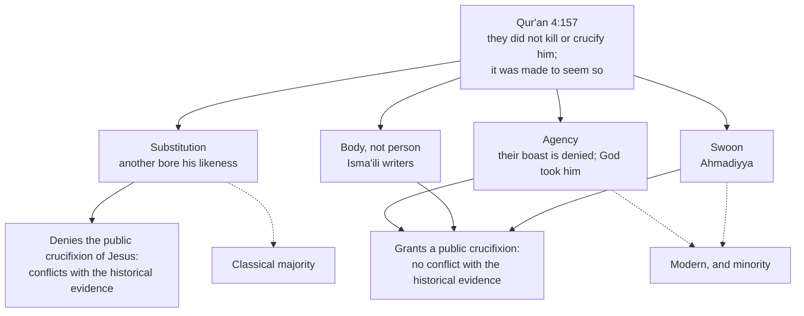

# Apologetics I · Lesson 7.4: The crucifixion, and the corruption charge

> ⏱ ~15 min · Module 7: Christianity and Islam · Builds on: [7.3 The Incarnation](07-03-the-incarnation.md), [5.2 The minimal-facts approach and its critics](05-02-the-minimal-facts-approach-and-its-critics.md), [`new-testament` 3.3](../../new-testament/lessons/03-03-what-historians-broadly-agree-on.md) · Unlocks: [7.5 The prophethood of Muhammad](07-05-the-prophethood-of-muhammad.md)

## Why this matters

Christianity and Islam agree about Jesus more than either admits ([7.3](07-03-the-incarnation.md)). They part at one Friday, the center of Christian faith. One verse of the Qur'an, 4:157, has usually been read as saying it did not happen. Behind that verse stands a wider question: if the Christian books say otherwise, are the books corrupt? This lesson weighs both questions, holding both scriptures to one standard.

## The idea

Surah 4:155–158 lists charges against those of the People of the Book who broke covenant. Among them is their boast that they killed the Messiah, Jesus son of Mary, God's messenger. The verse answers, in paraphrase: they neither killed him nor crucified him, but it was made to seem so to them (*shubbiha lahum*); those who dispute it follow conjecture; certainly they did not kill him; rather God raised him to Himself. The grammar of *shubbiha lahum* is open, because the verb has no stated subject. "He was made to resemble [another] for them" and "it was made obscure to them" are both possible readings, and the history of interpretation grows from that gap ([Qur'an 4:157](../reference.md#quran-4-157)).

Muslims have read it in four main ways, mapped below.

1. **Substitution.** Another man was given Jesus's likeness and crucified; Jesus was raised alive. Al-Tabari (d. 923) collects early reports that differ over who bore the likeness; in one, Jesus asks which companion will take his likeness for paradise, and one volunteers. Other commentators name Judas or Simon of Cyrene. This has been the majority reading of classical Sunni exegesis.
2. **Denial of agency, not of the event.** The verse denies the *boast*: they did not kill him, God took him. The parallel is 8:17, where God tells the believers that they did not slay their enemies at Badr; God slew them. Mahmoud Ayoub argued in his essays on Islamic Christology that the Qur'an does not deny Christ's death. It denies that human beings can destroy God's Word. Todd Lawson (*The Crucifixion and the Qur'an*, 2009) argues that the verse neither affirms nor denies the event's history, and that the doctrine of denial built up later. Readers of this kind also cite 19:33, where Jesus speaks of the day he dies, and 3:55, where God says He will take him (*mutawaffika*, a verb itself disputed).
3. **The body, not the person.** Several Isma'ili thinkers of the tenth and eleventh centuries, Abu Hatim al-Razi and Abu Ya'qub al-Sijistani among them, affirmed that Jesus's body was crucified. What the verse denies is that *he*, his true and spiritual self, was killed. Western writers sometimes call this "docetic", but the body here is real and dies.
4. **Swoon.** The Ahmadiyya movement, following Mirza Ghulam Ahmad (d. 1908), holds that Jesus was crucified, did not die on the cross, recovered, and died much later in Kashmir. This is a modern minority reading, and most other Muslims reject the movement's wider claims.

## The other side

The objection has two layers, and a Muslim theologian keeps them apart.

**Revelation over report.** For a Muslim the Qur'an is God's own speech ([7.1](07-01-islam-on-its-own-terms.md)). If its plainest sense is substitution, then the reports of the crucifixion are reports of what *appeared* to happen, and the verse has already told us that appearance misled. The claim is not that historians lie, but that their method cannot reach past appearances.

**[*Tahrif*](../reference.md#tahrif).** The Qur'an says God sent down the Torah and the *Injil*, the Gospel given to Jesus (3:3), and it accuses some of the People of the Book of shifting words from their places (4:46; 5:13; 5:41; 2:75). Muslim scholars distinguished two charges. ***Tahrif al-ma'na***, corruption of meaning, says the text survives but has been misread: "son" heard as divine, the prophecies of Muhammad explained away. ***Tahrif al-lafz***, corruption of wording, says the text itself was changed. Those who held only the first could point to 5:47, which bids the people of the Gospel judge by what God revealed in it, and to 10:94, which presumes a scripture that could be consulted.

**Ibn Hazm** of Córdoba (d. 1064), in his *Kitab al-Fisal*, is the classical exponent of corruption of wording. His case runs: the four gospels are not the *Injil* sent down to Jesus but four accounts by four men, written after him. They contradict one another: on Jesus's genealogy, on the resurrection accounts, and elsewhere. They lack *tawatur*, the mass transmission through independent chains that Muslim scholarship requires before a report yields certainty. He applied the same tests to the Torah, which he judged rewritten in Ezra's time. The verdict is that the extant books cannot overrule the Qur'an. Ibn Taymiyya (d. 1328), in *al-Jawab al-Sahih*, took a middle position: some wording had been altered in transmission and translation, but the books could still be read critically and argued from.

## The argument

1. **P1.** That Jesus was crucified under Pontius Pilate is attested independently by Paul, who was writing in the 50s (1 Cor 1:23; Gal 3:13), by all four gospels, by Josephus, and by Tacitus, a hostile Roman. Tacitus writes that "Christus, from whom the name had its origin, suffered the extreme penalty during the reign of Tiberius at the hands of one of our procurators, Pontius Pilatus" (*Annals* 15.44, Church and Brodribb). Josephus has "when Pilate, at the suggestion of the principal men amongst us, had condemned him to the cross" (*Ant.* 18.3.3, Whiston). That clause belongs to the part of the *Testimonium* that most scholars keep as authentic once Christian additions are removed. Other views have defenders ([`new-testament` 3.2](../../new-testament/lessons/03-02-sources-and-criteria.md)).
2. **P2.** It is embarrassing to the movement that reports it. A crucified Messiah was a "stumblingblock" (1 Cor 1:23), and the curse on one hanged on a tree had to be answered (Gal 3:13). It sits at the top of the historians' near-consensus, reported as such in [`new-testament` 3.3](../../new-testament/lessons/03-03-what-historians-broadly-agree-on.md) and [5.2](05-02-the-minimal-facts-approach-and-its-critics.md). *In words:* by ordinary method this is as secure as any fact about a first-century provincial.
3. **P3.** *Tahrif al-lafz* cannot remove it. The manuscript tradition has real variants (below). But the crucifixion is in every stratum: the pre-Pauline formula of 1 Cor 15:3, the letters, every gospel, and the non-Christian sources, which no Christian scribe controlled as a body.
4. **P4.** Of the four readings, three (agency, body, swoon) grant that a crucifixion happened in public. Only substitution contradicts the historical claim. It does so by positing a miracle of appearance that leaves, by design, no trace an observer could detect.
5. **∴ C.** The historical case does not refute 4:157. It shows where the disagreement really lies: not between history and the Qur'an, but between the evidence and one reading of the Qur'an. On that reading, revelation is held to overrule what every witness, friendly and hostile, reported. That is the question of revelation [7.5](07-05-the-prophethood-of-muhammad.md) takes up.

**Concession.** The New Testament's text has not come down word for word. Among thousands of manuscripts there are a great many variants, mostly trivial and some not. Mark's oldest manuscripts end at 16:8, and the longer ending is judged by most critical scholars not to be Mark's, though it is canonical ([`new-testament` 2.1](../../new-testament/lessons/02-01-mark.md)). The *Comma Johanneum* (1 John 5:7) is a late Latin addition. Rome's Holy Office defended it in 1897, never as a definition, and narrowed that reply in 1927 ([`new-testament` 6.4](../../new-testament/lessons/06-04-peter-jude-and-the-letters-of-john.md)). And Christians made the corruption charge first. Justin accused Jewish teachers of cutting verses from the scriptures, with evidence that does not hold up ([6.1](06-01-the-messianic-claim-and-how-a-prophecy-argument-works.md)).

**The same care for the Qur'an.** Muslim tradition reports a first collection under Abu Bakr and an authoritative recension under the caliph Uthman (r. 644–656). Uthman's committee, led by Zayd ibn Thabit, sent copies to the garrison cities and had rival codices, such as Ibn Mas'ud's, destroyed ([Uthmanic recension](../reference.md#uthmanic-recension)). Within that consonantal skeleton (*rasm*), recitation varies in dotting and vowels. Ibn Mujahid (d. 936) canonized seven readers; Ibn al-Jazari (d. 1429) added three to make ten, each reader with two transmitters ([qira'at](../reference.md#qiraat)). Today most printed copies follow Hafs from 'Asim (the Cairo edition of 1924), and Warsh from Nafi' is widely read in North Africa. The **Sana'a palimpsest**, found in 1972, has a lower text that was erased and overwritten with the standard one. The parchment has been radiocarbon-dated with 95% probability to 578–669 (Sadeghi and Bergmann, 2010). The lower text differs from the standard text in wording and in the order of the suras. Sadeghi and Goudarzi ("Ṣan'ā' 1 and the Origins of the Qur'ān", *Der Islam*, 2012) read it as a non-Uthmanic companion codex that supports an early fixed standard. Asma Hilali (*The Sanaa Palimpsest*, 2017) reads both layers as school exercises. Wansbrough's late-canonization thesis (1977) has been weakened by this early manuscript evidence. Divine guarding of the text (15:9) and the inspiration of Scripture are both faith claims above what textual criticism can show.

**Levels.** "Crucified under Pontius Pilate, died": rung 1, creedal ([the ladder](../../fundamental-theology/lessons/04-04-the-ladder-of-doctrinal-authority.md)). The canonicity of Mark 16:9–20 is rung 1; who wrote it is undefined. The authenticity of the Comma is a textual question with no magisterial rung. No Church act pronounces on the Qur'an's text ([levels of authority](../reference.md#levels-of-authority)).

**Where the argument is weakest.** P4 against a substitution reader. A miracle of appearance is consistent with all the evidence by construction, so history can show that the reading has no support but cannot show that it is false. The parity cuts: history cannot certify that *God* raised Jesus either ([5.1](05-01-can-history-establish-a-miracle.md)).

## Map of positions

## Worked examples

**Example 1 (clean): a variant inside the passion.** Luke 23:34, "Father, forgive them, for they know not what they do" (DR), is absent from some of the earliest witnesses, including the papyrus P75 and Codex Vaticanus. Whether Luke wrote it is disputed. Grant the variant fully: it makes one saying from the cross uncertain. It does not show that the crucifixion is uncertain, because the event does not rest on any one manuscript or any one gospel. Variants put *wording* in question; a multiply attested event survives any single variant.

**Example 2 (hard): the palimpsest turned around.** An invented apologetics blog writes that "Sana'a proves the Qur'an was edited, so Muslims should stop accusing the Bible". The fair verdict cuts both ways. Its lower text does show early textual variety, which complicates the strongest popular Muslim claim of a text unaltered in every letter. But it also fits an early fixed standard, as Sadeghi and Goudarzi argue. Under Ibn Hazm's own *tawatur* standard, a Christian who is confident about the gospels on the evidence of the fourth-century codices cannot dismiss a Qur'an attested within decades of its origin. The evidence settles less than the blog claims, about both books.

## Watch out

- **You might think "Islam denies the crucifixion" is simply true,** but the substitution reading is one reading. It is the majority one, and Ayoub, Lawson and the Isma'ili writers read the verse otherwise. To state a tradition as one view is caricature.
- **You might think textual variants support *tahrif al-lafz*,** but variants show copying errors and additions, such as the Comma, that critics can detect *because* the manuscripts survive. Wholesale rewriting would leave a different trail. The Christian should not overstate the other way either: the NT text is reconstructed, not intact.
- **You might think the Church defined the Comma, or the authorship of Mark 16:9–20.** It defined neither. The 1897 reply was not a definition, and Mark's longer ending is defined as canonical, not as Mark's.

## One-liner

> The crucifixion is as secure as ancient history gets and no textual variant touches it, so the real disagreement is between the evidence and one reading of 4:157, and both scriptures' texts are better attested and more varied than their apologists admit.

## Problems

**P1 (🟢) *(Exegetical.)*** For each invented statement, say whether it expresses *tahrif al-lafz*, *tahrif al-ma'na*, or neither, in one line each.
(i) "The Christians kept the words of their books but read 'son of God' as a claim to divinity."
(ii) "The four gospels are the compositions of four men after Jesus, not the *Injil* sent down to him; their genealogies contradict each other."
(iii) "The Christians changed the Qur'an's text of 4:157."
(iv) "Some wording changed in copying and translation, but the books can still be read critically and argued from."
Then name the classical writer whose position (ii) states, and the one closest to (iv).

**P2 (🟡) *(Apologetic: (a) Exegetical, graded first · (b) reply.)*** (a) State Ibn Hazm's argument that the gospels are not the revealed *Injil* and cannot overrule the Qur'an, as he and his Muslim readers would recognize it. (b) Reply, opening with a **named concession**. Your reply is graded for applying the same standard to both scriptures. 170 words or fewer in total.

**P3 (🔴, optional) *(Diagnose.)*** An invented parish bulletin note:

> "The Qur'an denies that Jesus was crucified. But Tacitus, a pagan, proves he was. So on this point Islam is simply refuted by history. Our Muslim neighbours deserve to hear this plainly."

Name three distinct faults in the note, one sentence each.

Solutions

**P1** *(Exegetical)*

**Must hit, strict:**

- (i) ***tahrif al-ma'na***: the wording is intact and the meaning is misread.
- (ii) ***tahrif al-lafz***: the books are not the revealed text. This is **Ibn Hazm** (*Kitab al-Fisal*): four human authors, contradictions such as the genealogies, no *tawatur*.
- (iii) **Neither.** *Tahrif* is a charge about the earlier scriptures (Torah, *Injil*), not about the Qur'an. The statement confuses the categories.
- (iv) A **mixed** position, some *lafz* but mainly readable: closest to **Ibn Taymiyya** (*al-Jawab al-Sahih*), who placed himself between Ibn Hazm and milder views.

**Wrong turns:** treating (ii) as *ma'na* because it also involves interpretation. Assigning (iv) to Ibn Hazm. Answering (iii) as *lafz*.

---

**P2** *(Apologetic: (a) Exegetical, graded first · (b) reply)*

**Accept:** any reply that keeps the concession, applies one textual standard to both books, and argues from evidence, whatever its verdict.

**Must hit, strict (a), graded first:**

- The *Injil* is what God sent down **to Jesus** (3:3). The four gospels are **four accounts by four men** after him, so they are at best reports about the *Injil*, not the *Injil* itself.
- Their **contradictions** (the genealogies; the resurrection accounts) show human authorship and corruption.
- They lack ***tawatur***, mass transmission through independent chains, so they cannot yield certainty.
- Conclusion: where they conflict with the Qur'an, God's own speech, they **cannot overrule it**.

**Must hit (b):**

- A **named concession**: e.g. the gospels *are* four human-authored accounts with real discrepancies, and the NT text has real variants (Mark's endings, the Comma).
- Accept the category and contest the inference: discrepant independent accounts are how historians *establish* a core event, and on the crucifixion all four agree with Paul, Josephus and Tacitus.
- **Same standard**: if early, multiple, independent attestation counts for the Qur'an's text, it counts for the gospels'. If it does not, it fails for both.
- What remains: whether a revelation can override such attestation, which is the question of 7.5, not a textual question.

**Wrong turns:** stating (a) as "Muslims say Christians changed the Bible to make Jesus God" (that is neither Ibn Hazm's argument nor its structure). Claiming the NT text is word-perfect. Answering *tawatur* with "the Church guarantees the text", which is a faith claim, not a reply in his terms.

**Model answer, one of several:** (a) For Ibn Hazm the *Injil* was revealed to Jesus. The gospels are four men's later narratives that contradict one another, in Jesus's genealogy and in the resurrection accounts, and they lack the mass independent transmission that alone yields certainty. So they cannot overrule God's speech in the Qur'an. (b) Concession: he is right that the gospels are four human accounts with real discrepancies, and that their text has variants. But four partly discrepant accounts are exactly what historians use to fix a core event, and on the crucifixion they agree with Paul and with two non-Christian writers. A standard that rejects that attestation would also tell against an early, varied Qur'anic manuscript record. What divides us is whether revelation overrides such evidence.

---

**P3** *(Diagnose)*

**Accept:** any three of the four faults below.

**Must hit, strict:**

- **"The Qur'an denies" flattens the readings.** Substitution is the classical majority reading of 4:157, but agency readings (Ayoub, Lawson), Isma'ili writers and the Ahmadiyya all grant a public crucifixion.
- **"Proves" overstates.** Tacitus is strong evidence, late (c. 115–120) and hostile, not a proof. And a substitution reader already holds that the event *appeared* to happen, so the evidence does not touch that reading.
- **"Refuted by history"** mislocates the dispute. It lies between the evidence and one reading of revelation, which is a question about revelation (7.5).
- **Tone.** "Simply refuted… hear this plainly" is triumphalism. Respect is part of the case, not decoration.

**Wrong turns:** objecting that the Tacitus passage is a forgery (nearly all specialists accept it). Confusing the passage with the disputed Josephus *Testimonium*.

## Flashback

**From Lesson [7.2](07-02-tawhid-and-the-trinity.md) (Tawhid and the Trinity):** *(Apologetic: (a) Exegetical, graded first · (b) reply.)* At an invented reading group (nobody here is real; it is built for the problem), a Catholic student explains the Trinity as "God's being, God's knowledge and God's love". A Muslim friend answers with the first step of Ibn Taymiyya's reply in *al-Jawab al-Sahih*: "Why three?"
(a) State that step as Ibn Taymiyya pressed it, and name the Christian gloss it was aimed at. Two sentences. (b) Reply, opening with a **named concession**, using only what the dogma says about how the persons are distinguished. Then say in one sentence what your reply does not show. 100 words or fewer for (b).

Solution

**Accept:** any reply that keeps the concession, counts the persons by relations of origin rather than attributes, and states its own limit, whatever its verdict on the friend's objection.

**Must hit, strict (a), graded first:**

- **Christians disagree** about which attributes the persons are (existence, word and life; or existence, word and power), and **God's names are many** (knowing, powerful, willing, living, speaking), so stopping at three is **arbitrary**.
- The target was the **attribute gloss**: Paul of Antioch's essence, word and life, reworked in the *Letter from the People of Cyprus* that Ibn Taymiyya answered.

**Must hit (b):**

- A **named concession**: against the student's gloss the step is sound. Knowledge and love are, on the dogma, common to all three (Augustine refused to make the Father wise only by the Wisdom he begets), so they cannot number the persons. The student has fallen into the attribute horn.
- The dogma does not count persons by attributes. The persons are distinguished **only by relations of origin** (Lateran IV; Florence: all is one where no opposition of relation intervenes): one without origin, one begotten, one proceeding. The number is not a selection from God's names, so the arbitrariness charge does not reach it.
- The limit: this shows the three is not arbitrary in the way charged, not that reason can derive it. The Church holds the three from revelation and claims only that it is **not impossible** (ST I q.32 a.1).

**Wrong turns:** stating (a) as "Muslims think Christians worship three gods" (that is the substance horn, a different step). Defending the student's gloss, or offering the analogy of mind, knowledge and love as a *proof* of three. Claiming the Church has defined "subsistent relation". Resting the reply on Matthew 28:19 alone, when Ibn Taymiyya reads that verse as God, his messenger and his angel.

**Model answer, one of several:** (a) Christians cannot agree which attributes the three are, existence, word and life or existence, word and power, and God has many names, so why stop at three? He aimed this at Paul of Antioch's gloss, sent to him in the Cypriot letter. (b) Concession: against "being, knowledge and love" you are right; knowledge and love belong to all three, so they cannot count persons. But the dogma counts the persons only by relations of origin: one from none, one begotten, one proceeding. That is not a pick from God's names. It does not prove there are three; that comes from revelation, defended only as not impossible.

## Connections

- **Backward:** the crucifixion's place in the historians' near-consensus is [`new-testament` 3.3](../../new-testament/lessons/03-03-what-historians-broadly-agree-on.md), and its sources and the *Testimonium* debate are [3.2](../../new-testament/lessons/03-02-sources-and-criteria.md). Mark's endings are [`new-testament` 2.1](../../new-testament/lessons/02-01-mark.md) and the Comma is [6.4](../../new-testament/lessons/06-04-peter-jude-and-the-letters-of-john.md). Justin's corruption charge against the Jews is [6.1](06-01-the-messianic-claim-and-how-a-prophecy-argument-works.md), and the limits of history before a miracle are [5.1](05-01-can-history-establish-a-miracle.md).
- **Forward:** [7.5](07-05-the-prophethood-of-muhammad.md) makes the crucifixion the decisive point against the claim of a later revelation.
- **Sideways:** *tawatur* is the hadith scholars' version of the independence condition in odds form ([`philosophical-method` 2.4](../../philosophical-method/lessons/02-04-weighing-evidence-in-odds-form.md)). Many independent chains multiply and copied chains do not, which is why it bears on gospels that share sources.
