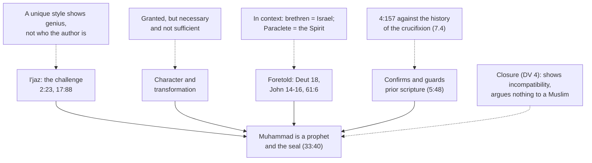

# Apologetics I · Lesson 7.5: The prophethood of Muhammad

> ⏱ ~15 min · Module 7: Christianity and Islam · Builds on: [7.4 The crucifixion, and the corruption charge](07-04-the-crucifixion-and-the-corruption-charge.md), [6.1 The messianic claim, and how a prophecy argument works](06-01-the-messianic-claim-and-how-a-prophecy-argument-works.md), [`fundamental-theology` 1.4](../../fundamental-theology/lessons/01-04-public-and-private-revelation.md) · Unlocks: [8.1 Pluralism and its price](08-01-pluralism-and-its-price.md)

## Why this matters

Module 6 had Christians telling Jews that a prophet had come whom their own scriptures foretold, and that recognizing him meant receiving a fuller revelation. Islam makes the same argument to Christians, with the roles reversed. Muhammad is the [seal of the prophets](../reference.md#seal-of-the-prophets) (33:40), foretold by Moses and by Jesus, and the Qur'an confirms the earlier scriptures and guards them (5:48). Having argued Module 6, a Christian cannot dismiss this argument by its form; he must meet its content.

## The idea

The record comes before any argument. Christian writing about Muhammad began in polemic and stayed there for a thousand years. John of Damascus ended his *On Heresies* by classing Islam as a Christian heresy and its prophet as a false one, schooled by an Arian monk ([`church-history` 3.2](../../church-history/lessons/03-02-the-rise-of-islam-and-the-christian-mediterranean.md)). Aquinas, in *Summa contra Gentiles* I.6, charged that Muhammad drew followers with promises of carnal pleasure, worked no miracles, gained his first followers from ignorant men of the desert, and spread his law by arms. Dante put him among the sowers of schism in *Inferno* 28, split open. Riccoldo da Monte di Croce's *Contra legem Sarracenorum* (c. 1300) became a standard handbook of refutation. Peter the Venerable had the Qur'an put into Latin (Robert of Ketton, 1143) so that it could be refuted. Most of it reported his life from hostile hearsay and never read him as Muslims read him. That is the record, and this lesson is written after it.

Two questions have to be kept apart. *Was Muhammad sincere and good?* That is a historical and moral question. *Did God speak through him a revelation binding on all?* That is the claim of prophethood. A Christian can answer the first generously and still answer the second no. The second question turns on what the message says, not on the messenger's character.

## The other side

The Muslim case has four strands, and its theologians weigh them together.

1. **The Qur'an as the miracle.** The challenge verses dare doubters to produce one surah like it (2:23; 10:38), or ten (11:13). They add that men and jinn together could not produce its like even if they helped one another (17:88). Classical theology built on this a doctrine of [*i'jaz*](../reference.md#ijaz), inimitability. A prophet's sign (*mu'jiza*) is an act that breaks the ordinary course of things, joined to a claim of prophethood and a challenge that no one meets. Then the sign is God's own endorsement of the claim. Al-Baqillani (d. 1013) argued in his *I'jaz al-Qur'an* that the Qur'an's style fits no known genre and stays eloquent across every subject it treats. 'Abd al-Qahir al-Jurjani (d. 1078) located the miracle in *nazm*, the composition of words into discourse, and in his *Dala'il al-I'jaz* rejected the rival view, associated with the Mu'tazili al-Nazzam, that the miracle was *sarfa*: God's preventing the Arabs from answering the challenge. Two points add weight. The poets and orators of Mecca, best placed to answer and opposed to him, did not. And the man who recited the Qur'an was *ummi*, unlettered, who had recited no scripture before it and written none (7:157; 29:48).
2. **Character and transformation.** He had lived among his people for a lifetime before the revelation, and they knew him (10:16). The tradition remembers him as *al-Amin*, the trustworthy, and the Qur'an praises his character (68:4). In twenty-three years tribal, polytheist Arabia became one community worshipping one God. The burial of infant daughters was condemned (81:8–9). Al-Ghazali's *Deliverance from Error* turns this into an epistemology. One knows that Galen was a physician by studying his medicine, not by watching one cure. So also one knows a prophet with certainty by long acquaintance with his words and by testing them in practice, many times, and not from any single miracle, which might be magic.
3. **Foretold.** Those who follow the unlettered prophet find him written in their Torah and Gospel (7:157). Jesus announces a messenger coming after him whose name is *Ahmad*, "most praised", from the same root as Muhammad (61:6). The texts adduced are Deuteronomy 18 and the Paraclete promises of John 14–16. In Ibn Ishaq's *Sira* the Paraclete passage of John 15 appears in Arabic, with the Syriac word for the comforter, *Munahhemana*, glossed as Muhammad. Ali ibn Rabban al-Tabari's ninth-century *Book of Religion and Empire* collected the proof-texts that later apologetics reused.
4. **Coherence with prior revelation.** The Qur'an does not present itself as new. It is the last restatement of the one message given to Abraham, Moses and Jesus, and where the earlier books diverge from it they have been corrupted ([*tahrif*](../reference.md#tahrif), [7.4](07-04-the-crucifixion-and-the-corruption-charge.md)). It challenges its readers to find contradiction in it, which a book from anyone but God would contain (4:82).

The argument is not "the Qur'an says it is from God". It is a cumulative case with an empirical challenge at its centre.

## The argument

**P1.** A claimant to prophecy is tested against what God has already revealed. A sign is not enough if the message leads away from the God already known (Deuteronomy 13:1–3). A gospel other than the one received is anathema, "though we, or an angel from heaven" preach it (Galatians 1:8). Fruits are a test too (Matthew 7:15–20), but a test of false prophets, not a certificate for true ones.

**P2.** Catholic faith holds that public revelation was completed in Christ and closed with the apostles. No new public revelation is to be awaited before his return (Dei Verbum 4; CCC 66; [closure of public revelation](../reference.md#closure-of-public-revelation)). Dei Verbum restates this and defines nothing new. *Lamentabili* (1907) condemned its denial as proposition 21. Theologians commonly count it as of faith (rung 1, by the ordinary and universal magisterium, not by any single definition).

**P3.** The Qur'an, on the reading its classical commentators held, denies that Jesus was crucified (4:157). The crucifixion is as secure as any fact of ancient history (Tacitus, Josephus, and the consensus of [`new-testament` 3.3](../../new-testament/lessons/03-03-what-historians-broadly-agree-on.md); [7.4](07-04-the-crucifixion-and-the-corruption-charge.md)).

**∴ C.** A book that denies a public, well-attested event, presented as God's own speech, fails the test that Deuteronomy itself sets: what the prophet says "cometh not to pass" (18:22). *In words:* the decisive point is a question of history, which Muslim and Christian can both examine, and not a verdict on Muhammad's character.

P2 states why a Catholic cannot accept a later prophet with a new public revelation. To a Muslim it begs the question, since Islam also claims finality. It shows that the two positions are incompatible; it does not argue that either is true. The argument rests on P3.

**Concession.** Christian polemic against Muhammad has a long and ugly record. It was largely ignorant of its subject, and it was often written to justify fear or war. Aquinas's six charges in *Contra Gentiles* I.6 are not a reliable account of Muhammad's life or of Muslim belief. A Christian argument that leans on them, or on their modern descendants, has failed the test of respect before it begins.

**Concession.** The argument from a religion's success is one Christians have used and cannot consistently refuse. Augustine (*City of God* XXII.5) argued that if the world believed in the resurrection without miracles, that belief was itself the greatest miracle. Aquinas made the conversion of the world his first sign in the same chapter that he turned against Muhammad. *Dei Filius* ch. 3 calls the Church, by its astonishing propagation and stability, a great and perpetual [motive of credibility](../reference.md#motives-of-credibility). That sentence is taught in the chapter but defined in no canon: canon 3 defines only that outward signs *can* make revelation credible. Islam's spread and endurance are at least as striking. Aquinas tried to break the parity by the manner of spread, the sword against persuasion. But conquest is not conversion: majorities in the conquered lands became Muslim only centuries later ([`church-history` 3.2](../../church-history/lessons/03-02-the-rise-of-islam-and-the-christian-mediterranean.md)). Success is weak evidence, and it is weak for both religions or for neither.

**Where the argument is weakest.** P3 depends on how 4:157 is read. On the substitution reading of the classical majority, the contradiction with history is direct. On the minority reading that denies Jewish agency rather than the event itself, God being the true agent, the contradiction largely disappears ([7.4](07-04-the-crucifixion-and-the-corruption-charge.md)). The argument is decisive only against the reading most Muslims have held.

## The argument map

Alt text: four Muslim arguments support Muhammad's prophethood, each met by a Christian reply: style shows genius, not authorship; character is granted but insufficient; the foretelling texts are read in context; the crucifixion contradicts the claim to confirm prior scripture. Closure of revelation shows only incompatibility.

## Worked examples

**Ex 1 (Deuteronomy 18, both readings).** Moses promises:

> I will raise them up a prophet out of the midst of their brethren like to thee: and I will put my words in his mouth, and he shall speak to them all that I shall command him. (Deuteronomy 18:18)

The Muslim reading takes "their brethren" to mean the Ishmaelites, kin of Israel. Deuteronomy 34:10 says that no prophet like Moses arose *in Israel*. Muhammad, unlike Jesus, matches Moses in the points that count: a lawgiver, a ruler, a man who married and died a natural death. And he is the man in whose mouth God put the words: the Qur'an is recited speech. The Christian reading notes that the same chapter calls the Levites' fellow Israelites their "brethren" (18:2). The king in 17:15 must be "of thy brethren", explicitly not "a man of another nation". And verse 15 says "of thy nation". Acts 3:22 applies the promise to Jesus. Jewish commentators read it of prophets within Israel. Apply [6.1](06-01-the-messianic-claim-and-how-a-prophecy-argument-works.md)'s tests evenhandedly: the Muslim reading fails test (ii), since it was not available without knowing the claimant; the Christian reading leans on typology and proves nothing either.

**Ex 2 (a hard case).** An invented Muslim scholar, Dr. Selim, accepts the crucifixion as history. He reads 4:157 as denying that Jesus' enemies were the true agents of his death. Of the Gospels he says only that their interpretation went wrong (*tahrif al-ma'na*). The decisive point is now much weaker. The Christian is left with P1's first test: does the Qur'an's denial of the Incarnation and of divine sonship ([7.3](07-03-the-incarnation.md)) lead away from the God already revealed in Christ? That reply holds only for someone who already accepts the Christian revelation. Some Christian scholars of Islam, Kenneth Cragg in *Muhammad and the Christian* (1984) most fully, have asked whether Christians can grant Muhammad a real prophetic role toward his people while denying that he brought a final revelation. The Church has never said yes. It has also never pronounced on the question: Nostra Aetate 3 does not mention Muhammad at all. The question is open (rung 5).

## Watch out

- **You might think Nostra Aetate 3 recognizes Muhammad, or condemns him, but actually** it names neither Muhammad nor the Qur'an. It esteems Muslims' worship of the one God, and its weight is rung 3, like NA 4. Reading endorsement or rejection into its silence is a level error.
- **You might think *i'jaz* is a circular "the book says it's divine", but actually** it is an open challenge, offered as a test, joined to a theory of the evidentiary miracle. Stating it as circular is caricature and fails a problem.
- **You might think the strongest Christian reply attacks Muhammad's character, but actually** character is at most a necessary condition, and that line of attack belongs to the polemical record conceded above. The argument turns on content, and on P3.

## One-liner

> Concede the polemic and the parity of success, grant what can be granted to the man, and let the case rest where history can judge it: the cross that 4:157, as most have read it, denies.

## Problems

**P1 (🟢) *(Exegetical.)*** The Douay–Rheims of John 14:26:

> But the Paraclete, the Holy Ghost, whom the Father will send in my name, he will teach you all things and bring all things to your mind, whatsoever I shall have said to you.

(a) State the Muslim reading of the Paraclete promises (John 14–16), naming two textual supports it draws on. (b) State the Christian reading, naming two features of John 14–16 it rests on, one of them in the verse above. (c) In one sentence: which claim made by some Muslim writers is a text-critical claim, and what do the Greek manuscripts show? 120 words or fewer in total.

**P2 (🟡) *(Apologetic: (a) Exegetical, graded first · (b) reply.)*** (a) State the argument for Muhammad's prophethood from the inimitability of the Qur'an (*i'jaz*) as its classical exponents make it, citing two challenge verses by surah and ayah. 100 words or fewer. (b) Reply. Open with a named concession, then give the strongest Christian reply. 120 words or fewer.

**P3 (🔴) *(Exegetical, then Evaluative.)*** An invented opening statement from a campus debate (nobody said this; it is built for the problem):

> "Christianity conquered the Roman Empire without a sword; Islam conquered by the sword. Vatican I defined as dogma that the Church's spread proves her divine. And honestly, we needn't go beyond the Prophet's own life to see what tree this fruit grew on."

(a) Identify the three errors, one sentence each. (b) In two sentences, say where a Christian argument against Muhammad's prophethood should rest instead, and why there. Any verdict on whether it succeeds passes.

Solutions

**P1** *(Exegetical.)*

**Must hit, strict (a):** the Paraclete Jesus promises is Muhammad, the messenger who comes after Jesus departs (16:7) and teaches all truth (16:13). Two supports from: 61:6 (Jesus announces a messenger named *Ahmad*, "most praised"); Ibn Ishaq's *Sira*, which renders John 15 in Arabic and glosses the Syriac *Munahhemana* (comforter) as Muhammad; the conjecture that the Greek originally read *periklytos* ("renowned, praised"), equivalent to *Ahmad*; 7:157 (he is found written in the Gospel).

**Must hit, strict (b):** the Paraclete is identified as **the Holy Ghost** (14:26, in the verse quoted). He is sent **to the disciples** in their lifetime ("to you", 16:7). He **abides with them for ever and is in them**, unseen by the world (14:16–17). Christians read Pentecost (Acts 2) as the fulfilment.

**Must hit, strict (c):** the *periklytos* conjecture. Every Greek manuscript of John reads *paraklētos* ("one called alongside": advocate, helper). So the conjecture has no manuscript support, and those who hold it must posit corruption (*tahrif*).

**Wrong turns:** making *periklytos* the whole Muslim case, when Ibn Ishaq's reading is far older than the conjecture. Saying 61:6 quotes John. Glossing *paraklētos* as only "comforter".

**Model answer:** (a) The Paraclete is Muhammad, who comes after Jesus leaves and teaches all truth. Supports: 61:6, where Jesus announces *Ahmad*, and Ibn Ishaq's gloss of the Syriac *Munahhemana* as Muhammad. (b) John names the Paraclete the Holy Ghost (14:26). He is sent to the disciples themselves and dwells in them for ever, unseen by the world (14:16–17). (c) The claim that John wrote *periklytos*: every Greek manuscript reads *paraklētos*.

---

**P2** *(Apologetic: (a) Exegetical, graded first · (b) reply.)*

**Accept:** any reply that opens with a real concession and meets the argument's actual structure. A reply concluding that *i'jaz* succeeds passes if it is argued.

**Must hit, strict (a), graded first:**

- the challenge verses: two of 2:23, 10:38, 11:13, 17:88 (produce one surah, or ten, like it; men and jinn together could not).
- the structure of the evidentiary miracle (*mu'jiza*): an act breaking the ordinary course of things, joined to a claim and an unmet challenge, is God's endorsement.
- the miracle located in eloquence and composition (al-Baqillani; al-Jurjani's *nazm*), not in mere beauty.
- the weight added by the setting: Meccan opponents, masters of Arabic, did not answer it, and the reciter was *ummi* (7:157; 29:48).

**Must hit (b):**

- a named concession, e.g. that the Qur'an's literary standing in Arabic is real and is acknowledged far beyond Muslim readers. Or that the challenge was a genuine test, not a circular claim.
- a move on what inimitability shows. Every work of genius is unmatched in its own style, so "no one produced its like" establishes extraordinary authorship, not divine authorship. And who judges "like it" is not neutral.
- and/or the order of evidence: a sign cannot certify content that contradicts what is already well known (Deut 13:1–3; P3 on 4:157). Or the parity point: Christians would not accept John's prologue as proof by eloquence either.

**Wrong turns:** stating (a) as "the Qur'an says it is from God, so it is". That is caricature and fails. Omitting the challenge and the *mu'jiza* structure. Calling *sarfa* the classical consensus (al-Jurjani rejected it). Replying "it's just beautiful poetry" with no concession.

**Model answer (a):** The Qur'an dares its doubters to produce one surah like it (2:23) and declares that men and jinn together could not (17:88). A prophet's sign is an act beyond the ordinary course of things, joined to his claim and to a challenge no one meets, and such a sign is God's endorsement. Here the sign is the text: its composition (*nazm*) and sustained eloquence, which al-Baqillani and al-Jurjani analysed. Mecca's poets, his opponents, never answered it, and the man who recited it was unlettered.

**Model answer (b), one of several:** Concession: the challenge is real and the Qur'an's eminence in Arabic is not in dispute. But being unmatched is what makes any genius a genius. Nobody has matched Dante's cantos either, so the challenge shows an extraordinary author without showing which one. And the standard of "like it" is set by readers already formed by the text. A sign also cannot outweigh a contradiction in content. If the book denies a well-attested crucifixion, the test of Deuteronomy 18:22 governs the test of style.

---

**P3** *(Exegetical, then Evaluative.)*

**Must hit, strict (a):**

- **Level error.** Vatican I defined no such dogma. *Dei Filius* ch. 3 *teaches* that the Church is a motive of credibility, which is not a proof. The canon defines only that outward signs *can* make revelation credible.
- **Historical error and inconsistency.** Conquest is not conversion: the conquered lands became majority Muslim over centuries, not by forced conversion (CH 3.2). And the speaker is using the success argument, which he cannot refuse to Islam.
- **Respect error.** The "fruit" remark is a character attack in the line of the polemical record. Even if it were fair, character is at most a necessary condition.

**Must hit, any verdict (b):** the argument should rest on content that is publicly checkable, chiefly 4:157 against the historical crucifixion, because both sides can assess the evidence there. Credit for noting that the point weakens on the agency reading.

**Wrong turns:** calling the first sentence's premise about early Christianity simply false (the first three centuries spread without state force). Answering "closure of revelation" as the place to rest it without noting that it begs the question against a Muslim.

**Model answer:** (a) Vatican I did not define that the Church's spread proves anything. It teaches, in a chapter, that the Church is a motive of credibility, and its canon defines only that signs can make revelation credible. Arab conquest was not mass conversion, which took centuries, and the speaker is relying on the very success argument he would have to grant Islam. The closing jibe repeats the old polemic, and character could not settle prophethood anyway. (b) Rest it on the crucifixion, because there the Qur'an, as most commentators read it, and the historical record make one checkable claim each. Whether that is decisive depends on how 4:157 is read.

## Flashback

**From Lesson [7.3](07-03-the-incarnation.md) (The Incarnation):** *(Exegetical (a) · Evaluative: find the crux (b).)* An invented exchange between two students (nobody said this; it is built for the problem):

> **Yusuf:** "You say nothing in the Word changed when he became man. Then your 'union' is only a relation between God and a man, and a man to whom God is related, however closely, is still God's servant, as the Qur'an says of Jesus (43:59). When Jesus prayed all night, that servant was praying."
>
> **Clara:** "The one who prayed was the eternal Word, and he prayed as man. Praying belongs to his human nature; the one who prays is a single subject."

(a) Which horn of al-Warraq's dilemma, as 7.3 reconstructs it, is Yusuf pressing, and which step of 7.3's argument is Clara using? One sentence each. (b) Find the crux. Clara can grant part of Yusuf's claim about Jesus: which part, and what single claim must she make that Yusuf denies? Say why neither her rule nor Morris's two-minds view settles that claim. 100 words or fewer; any verdict on whether anything can settle it.

Solution

**Accept:** in (b), any verdict on whether the crux can be settled, provided the granted part, the disputed claim and the reason the rule presupposes it are all there.

**Must hit, strict (a):**

- Yusuf presses the **second horn**: nothing in the Word changed, so the union is only a relation between God and a man, and such a man is God's servant (43:59; 4:172).
- Clara uses **P4**, the communication of idioms: contradictory or creaturely predicates are said of the one subject in virtue of different natures, so the Word prays as man. Her "nothing in God changed" is **P3**, the union real in the creature and only conceptual in God. Either step, correctly named, earns the mark.

**Must hit, any verdict (b):**

- **The part she grants.** In his human nature Jesus really is God's servant: he took "the form of a servant" (Philippians 2:7), and his prayer is real creaturely prayer. What she denies is *only* a servant, a man distinct from the Word.
- **The crux.** The created humanity has no hypostasis of its own and exists in the Word's, so that "this man" names the Word himself. Yusuf denies that a relation real only on the creature's side can make a humanity God's own; on his view it leaves a second subject.
- **Why the rules do not settle it.** The communication of idioms and Morris's two-minds view both show that the predicates are consistent *given* one subject. They presuppose the crux and cannot prove it. Chalcedon fences the claim without mapping it, so at best reason shows it is not impossible.

**Wrong turns:** having Clara take the first horn by saying the Word gave something up in becoming man; that is the kenotic reply, closed to a Catholic. Treating the communication of idioms as a proof of the union. Denying that Jesus was in any sense God's servant, which concedes nothing Chalcedon grants. Replying that God can do anything.

**Model answer, one of several:** (a) Yusuf presses the second horn: an unchanged Word means a mere relation, and a man so related is God's servant. Clara uses P4, the communication of idioms: one subject, praying in virtue of his human nature. (b) Clara grants that, as man, Jesus is truly God's servant; she denies he is only that. The crux is whether a created humanity can lack a hypostasis of its own and exist in the Word's, so that the man praying is the Word. Her rule and Morris's both assume one subject, so neither proves it. On my verdict, reason can defend it as not impossible; only revelation could settle it.

## Connections

- **Backward:** [6.1](06-01-the-messianic-claim-and-how-a-prophecy-argument-works.md)'s four tests for a prophecy argument, here applied to texts claimed for Muhammad. [7.4](07-04-the-crucifixion-and-the-corruption-charge.md) on 4:157 and *tahrif* carries P3. Closure of revelation is owned by [`fundamental-theology` 1.4](../../fundamental-theology/lessons/01-04-public-and-private-revelation.md), and motives of credibility by [`fundamental-theology` 2.2](../../fundamental-theology/lessons/02-02-credibility-and-the-preambles-of-faith.md).
- **Forward:** [8.1](08-01-pluralism-and-its-price.md) asks whether two incompatible claims to finality can both be ways to the one Real. [8.2](08-02-salvation-outside-the-visible-church.md) asks what the Church teaches about the salvation of those who sincerely follow Muhammad.
- **Sideways:** al-Ghazali's knowledge of a prophet by accumulated acquaintance is a [cumulative case](../reference.md#cumulative-case) in the sense of [1.3](01-03-burden-of-proof-and-the-shape-of-a-cumulative-case.md), close kin to Newman's illative sense ([8.3](08-03-apologetics-in-a-secular-age.md)). The *mu'jiza* theory is the Islamic counterpart of *Dei Filius*'s miracle canons ([`philosophy-of-religion` 3.5](../../philosophy-of-religion/lessons/03-05-miracles.md)).
