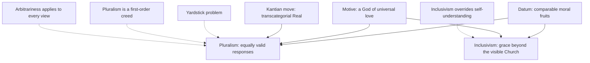

# Apologetics I · Lesson 8.1: Pluralism and its price

> ⏱ ~15 min · Module 8: Pluralism, salvation, and apologetics in a secular age · Builds on: [`philosophy-of-religion` 5.5](../../philosophy-of-religion/lessons/05-05-religious-diversity.md), [7.1 Islam on its own terms](07-01-islam-on-its-own-terms.md) · Unlocks: [8.2 Salvation outside the visible Church](08-02-salvation-outside-the-visible-church.md), [8.3 Apologetics in a secular age](08-03-apologetics-in-a-secular-age.md)

## Why this matters

Modules 6 and 7 argued with Judaism and Islam as rivals: where the traditions contradict, someone is wrong. John Hick's pluralism says that whole procedure is a mistake. The great traditions are not rivals for the truth. They are different, roughly equally good human responses to one ultimate reality. If he is right, this course has spent seven modules arguing a question that should never have been asked. So pluralism is not one more opponent. It is a claim that the game is void, and it has to be met.

## The idea

The typology is [`philosophy-of-religion` 5.5](../../philosophy-of-religion/lessons/05-05-religious-diversity.md)'s, reloaded in one line each. **Exclusivism:** where traditions conflict, one is right, and in its salvation form only its path saves. **Inclusivism:** one tradition is normative, but its truth or saving power reaches people outside it. **Pluralism:** no tradition is privileged ([exclusivism, inclusivism, pluralism](../reference.md#exclusivism-inclusivism-pluralism)). Keep the two axes apart, truth and salvation, because the whole argument below depends on it. Hick's hypothesis, his contentlessness problem, D'Costa's "covert exclusivism" and Plantinga's reply to the arrogance and arbitrariness charges are all stated in that lesson. This one does not restate them. It asks what pluralism *costs*, and whether its best datum needs it.

## The other side

Hick (*An Interpretation of Religion*, 1989; 2nd ed. 2004) did not reach pluralism from indifference. By his own account he came to it as a convinced evangelical Christian, through years among Muslim, Sikh, Hindu and Jewish communities in Birmingham. His case, stated as he would recognize it, has three parts.

**The moral datum.** Each great post-axial tradition aims at the same transformation, from self-centredness to Reality-centredness. Each produces it, in its saints and in ordinary people, at no rate we can tell apart. Each is also, in Hick's judgement, a mixture of good and evil, and none is visibly morally superior across its history. This is the [soteriological criterion](../reference.md#soteriological-criterion): judge a tradition by the transformation it produces, since that is what it claims to be for.

**The moral argument against exclusivism.** Already in *God and the Universe of Faiths* (1973) Hick pressed this. Christians say God is love and wills all to be saved. If salvation required explicit faith in Christ, most humans who have ever lived would be excluded by the accident of birth. A God of universal love who arranged that would not be a God of universal love. Something in the exclusivist package has to go.

**The Kantian move.** Kant distinguished things as they are in themselves from things as they appear under our categories. Hick applies the distinction to the divine, which Kant himself did not do. The Real *an sich* is [transcategorial](../reference.md#the-transcategorial-real): none of our concepts — one or many, personal or impersonal, good or evil — applies to it literally. What believers experience is the Real as filtered through a culture's concepts. It appears as personae (Yahweh, the Holy Trinity, Allah, Vishnu) and impersonae (Brahman, Nirvana, the Dharmakaya). The doctrines conflict, but only read literally. Read as myth, true insofar as they evoke the right response to the Real, they need not conflict at all. Hick applied this to his own tradition. He edited *The Myth of God Incarnate* (1977) and argued in *The Metaphor of God Incarnate* (1993) that "God incarnate" is a metaphor, not a metaphysical claim.

Put together: parity of fruits is the datum, the God of love is the motive, and the Kantian move is the explanation.

**Concession.** The moral-fruits argument has real force. Holiness visibly exists outside the Church: Jewish, Muslim, Hindu and Buddhist lives of self-giving that no honest Christian could rank below most Christian lives. And exclusivist answers to the fate of the unevangelized have often been callous. Christians have consigned billions to hell as a theological inference, with no visible grief and no effort to ask what that says about God. Hick was right that a theology which can do that has gone wrong somewhere. A reply that does not begin there is not answering him.

## The argument

The Catholic case is not that the moral datum is false. It is that inclusivism explains the datum at least as well, and pluralism pays a price inclusivism does not.

1. **P1.** Hick's datum (parity of transformation) and his motive (universal saving love) are best accommodated by any view that lets grace and goodness operate beyond the visible Church. *In words:* the evidence supports "God is at work everywhere", not yet "every tradition is equally true".
2. **P2.** Catholic inclusivism is such a view. The Council says the Church rejects nothing true and holy in other religions (*Nostra Aetate* 2, 1965), and that those who without fault do not know the Gospel but seek God sincerely can attain salvation (*Lumen Gentium* 16, 1964). How those texts are weighed and squared with older formulas is [8.2](08-02-salvation-outside-the-visible-church.md)'s work.
3. **P3.** The datum cannot favour pluralism over inclusivism, since both predict it. Its likelihood ratio between them is about 1 ([`philosophical-method` 2.4](../../philosophical-method/lessons/02-04-weighing-evidence-in-odds-form.md)).
4. **P4.** Pluralism carries costs inclusivism avoids.
   - (a) *The yardstick problem.* If the Real is transcategorial, "Reality-centred" cannot be measured by the Real, which has no describable character. In practice the yardstick is Hick's own ethic, a broadly shared love and compassion. A Christian, a Theravada Buddhist and a Muslim disagree about what saintliness *is*: self-giving love, the extinction of craving, or submission. So the parity is measured by a standard none of the traditions holds as its own.
   - (b) *A first-order creed.* Pluralism says the Incarnation is metaphor, the resurrection is not literally a fact, and *anatta* (no enduring self) is not literally true. Every tradition denies that its central claims are only mythological. Pluralism therefore contradicts each tradition as sharply as any exclusivism does.
   - (c) *Arbitrariness, returned.* Hick does rank. His criterion excludes the destructive cults and admits only the great post-axial traditions. So he too favours one standard over rivals without a neutral argument. The arbitrariness charge lands on every position, including his ([arbitrariness charge](../reference.md#arbitrariness-charge)), and then it decides nothing between them.
5. **∴ C.** On the total evidence, pluralism is not the humble default. It is one more first-order religious proposal, and it explains its best datum no better than inclusivism while paying more.

**Where the argument is weakest.** P2's inclusivism has its own price. It reads a devout Muslim's holiness as the work of Christ's grace, a description she would reject. That is the same overriding of self-understanding P4(b) charges against Hick. The Catholic can answer only that inclusivism overrides a tradition's account of *how* someone is saved, while pluralism overrides its account of *what is true*. Whether that difference is principled or merely convenient is the open question.

## The argument map

Solid arrows: "supports". Both the datum and the motive point equally to pluralism and inclusivism, which is P3. Only the Kantian move is peculiar to pluralism. Dashed arrows are objections, and the last one is the Catholic case's own weak point.

## Worked examples

**Ex 1 (clean): the hospice.** An invented hospice employs a Catholic nun, a Sikh volunteer and a Buddhist nurse. All three are, by every visible measure, saints. A pluralist says the three are equally in contact with the Real. The inclusivist agrees that all three are moved by grace and that the Sikh and the Buddhist may be saved, and says so on the authority of *Lumen Gentium* 16. The datum is fully explained. What separates the views is a further claim pluralism adds: that the nun's belief that Christ is God, the Sikh's belief in one formless God, and the Buddhist's denial of a creator are all mythologically true. None of the three believes that. P3 and P4(b) meet the objection cleanly.

**Ex 2 (hard case): the other ends.** S. Mark Heim (*Salvations*, 1995) argued that Hick is a disguised inclusivist. Hick defines one end, Reality-centredness, and then counts every tradition as reaching it. Heim's alternative is that the traditions may reach genuinely *different* ends: *nirvana* really is attained by Buddhists, and communion with the triune God by Christians. That strains P4 from the other side. It takes the traditions' self-descriptions more seriously than either Hick or the inclusivist does, and so P4(b)'s complaint cannot be pressed against it. The Catholic reply has to shift ground. Either the ends are ranked, which is inclusivism again, or they are not, which makes the Christian claim that God wills communion with himself for every person false. Heim himself, writing as a Christian, holds that communion with the triune God is the fullest end. The hard case shows that the honest choice is not between pluralism and inclusivism, but over which overriding one will accept.

## Hinduism, Buddhism and this course

This course does not treat Hinduism or Buddhism, and it should say why rather than pretend. Its arguments run against traditions that share its God, its history or both: atheism denies the God it argues for, Judaism shares its scriptures, and Islam shares its prophets. With the Indian traditions the disagreement starts further down, at whether there is a creator, a self, or a single history. Advaita Vedanta already contains its own inclusivism, in which personal deities are lower appearances of Brahman. Many Buddhist schools reject a creator on argued grounds. Stating them at the strength their own defenders would recognize requires Sanskrit and Pali sources this course does not read. *Nostra Aetate* 2 names both traditions with respect. A two-paragraph refutation would be exactly the caricature this course forbids.

## Watch out

- **You might think Hick says all religions teach the same thing, but actually** he says their doctrines flatly conflict when read literally. His claim is that they are equally authentic *responses*, which is why he must reinterpret the doctrines as myth.
- **You might think *Dominus Iesus* (2000) newly defined pluralism as heresy, but actually** it defined nothing new. It is a CDF declaration ratified by John Paul II, authentic ordinary magisterium as an act. It rejects theories that justify religious pluralism "in principle" and not only as a fact (section 4), and it restates the unicity of Christ, whose rung was fixed at Ephesus and Chalcedon ([`christology` 6.4](../../christology/lessons/06-04-christology-today.md); [Dominus Iesus](../reference.md#dominus-iesus)). It names no theologian.
- **You might think the reply to Hick is "pluralism contradicts itself", but actually** it does not. It is a consistent first-order view. The objection is that it is *not neutral*, which is a different and weaker charge.

## One-liner

> Hick's moral datum is real and the exclusivist answers to it were often callous, but both pluralism and inclusivism predict it, and only pluralism pays for it by declaring every tradition's central claims myth.

## Problems

**P1 (🟢) *(Exegetical: diagnose.)*** An invented parish bulletin note:

> "John Hick taught that all religions basically say the same thing, and that his 'Real' is just the Christian God under other names. The Church answered him in *Dominus Iesus* (2000), which newly defined Christ as the only Saviour and condemned Hick by name. Since there are saints in every religion, the Church must either deny that or become pluralist."

Name **four** errors, quoting the words that carry each, and correct each in one sentence.

**P2 (🟡) *(Apologetic: (a) Exegetical, graded first · (b) reply.)*** Paul Knitter is a Catholic pluralist whose version differs from Hick's.

(a) State Knitter's position at the strength he would recognize: the shift he argued for in *No Other Name?* (1985), and the criterion he moved to afterwards (*One Earth Many Religions*, 1995). Say how it differs from Hick's soteriological criterion. 100 words or fewer.

(b) Reply in 150 words or fewer. Open with a **named concession**.

**P3 (🔴) *(Evaluative: find the crux.)*** An invented debater says: "A God of love would not leave most of humanity outside salvation by accident of birth. So pluralism is true." Identify the missing premise the argument needs, say whether this argument favours pluralism over inclusivism, and say what one consideration *could* discriminate between them. Any verdict. 120 words or fewer.

Solutions

**P1** *(Exegetical: diagnose.)*

**Accept:** any four of the five errors below, each with its words quoted and corrected.

**Must hit, strict:**

1. "all religions basically say the same thing": Hick holds that their doctrines conflict when read literally. They are equally authentic responses to the Real, and their doctrines are true only as myth.
2. "his 'Real' is just the Christian God under other names": the Real *an sich* is transcategorial, neither personal nor impersonal. The Trinity is one persona among others, not the Real itself.
3. "newly defined": *Dominus Iesus* defined nothing new. It is a CDF declaration that restates the unicity of Christ, which was fixed as dogma at Ephesus and Chalcedon. As an act it is authentic ordinary magisterium (rung 3).
4. "condemned Hick by name": the declaration names no theologian. It rejects theories that justify religious pluralism in principle (section 4).
5. "must either deny that or become pluralist": a false dilemma. Inclusivism grants holiness and possible salvation outside the visible Church (*Lumen Gentium* 16; *Nostra Aetate* 2) without granting equal truth.

**Wrong turns:** calling *Dominus Iesus* a definition, or rung 1 as a document; "correcting" (1) by saying Hick thought all religions false (he holds them authentic responses, mythologically true); treating (5) as true and arguing only that the saints are fewer.

---

**P2** *(Apologetic: (a) Exegetical, graded first · (b) reply.)*

**Must hit, strict (a), graded first:**

- *No Other Name?* argued for a shift from christocentrism to theocentrism: God, not Christ, is the centre, and Christ is one decisive revelation among others.
- He then moved to a **soteriocentric** approach. Religions are judged by how far they promote concrete human well-being, liberation of the poor and oppressed, and the ecological flourishing of the earth.
- The difference from Hick: Knitter's criterion is practical and this-worldly (shared work for justice and the earth), not an inner transformation toward a transcategorial Real. He also deliberately sets aside a metaphysical theory of the Real.

**Must hit (b):**

- A **named concession**: the common work for the poor and the earth is real and owed, and dialogue rooted in it has borne fruit that doctrinal dialogue alone did not.
- The yardstick problem in Knitter's form. "Well-being" and "liberation" are themselves contested between traditions: a Buddhist, a Muslim and a liberation theologian rank them differently. So the criterion is a first-order ethic, not a neutral one.
- The inclusivist can endorse the shared work without granting equal truth. *Dominus Iesus* 22 grounds equality in dialogue in the parties' personal dignity, not in doctrinal content.

**Wrong turns:** stating Knitter as Hick with different words, or as a relativist who thinks no religion is true; omitting the move from theocentrism to soteriocentrism; claiming the Church condemned Knitter by name (no such act is cited here).

**Model answer (b), one of several:** **Concession:** Knitter is right that Christians and others share an urgent, concrete task in the suffering of the poor and the damage to the earth, and dialogue that begins there has produced real cooperation. But his criterion is not neutral. What counts as well-being, and whether liberation is the point of a religion, is exactly what Buddhists, Muslims and Christians dispute: release from craving, submission to God, and communion with the Trinity are not three names for justice. So soteriocentrism is a first-order ethic of its own. A Catholic can join the work completely, as equals in dignity, while holding that Christ is the reason it is worth doing, not one option among many.

---

**P3** *(Evaluative: find the crux.)*

**Must hit, any verdict:**

- The missing premise: inclusivism is false, so salvation requires explicit membership or faith. Without it, the argument only rules out a strong salvation-exclusivism.
- The verdict that it does **not** favour pluralism over inclusivism. Universal saving love is satisfied by both, so its likelihood ratio between them is about 1.
- A consideration that could discriminate: the truth axis, not the salvation axis. Whether the traditions' central claims (a resurrection, *anatta*) are literally true, or whether the Kantian account of religious experience is correct.

**Wrong turns:** treating the argument as refuting exclusivism about *truth* (it is about salvation only); arguing that God's love is compatible with damning the unevangelized, which answers a different question.

**Model answer, one of several:** The argument needs a hidden premise: if not everyone is saved through explicit faith, then no tradition is uniquely true. That conflates salvation with truth. Inclusivism holds that God's saving love reaches people outside the visible Church while one tradition is true where they conflict, and it satisfies the debater's demand as fully as pluralism does. So the argument eliminates only salvation-exclusivism, and between pluralism and inclusivism it is neutral. What could decide between them is the truth question itself: whether Jesus literally rose, whether there is an enduring self, or whether Hick's Kantian account of religious experience is right. Love settles who may be saved. It does not settle what is true.

## Flashback

**From Lesson [7.4](07-04-the-crucifixion-and-the-corruption-charge.md) (The crucifixion, and the corruption charge):** *(Exegetical: diagnose (a) · Evaluative (b).)* An invented exchange at a campus panel (nobody said this; it is built for the problem):

> **Christian student:** "Your Qur'an circulates in ten canonical readings that differ in dotting and vowels. So its text is corrupted, which is the very charge you make against our Bible."
>
> **Muslim student:** "And your gospels can't even agree on Jesus's genealogy. So their crucifixion story is unreliable."

(a) Name the one inferential error both speakers make, then correct each speaker's claim in one sentence. (b) State in one sentence the single standard 7.4 applies to both scriptures, and in one more sentence say what it does and does not settle about 4:157. 130 words or fewer in all.

Solution

**Must hit, strict (a):**

- **Shared error:** each infers from variation in wording or detail to the unreliability of the whole, or of its core. Variants and discrepancies put the *wording* or a *detail* in question. A core that is early and multiply attested survives any one of them.
- **Christian student:** the *qira'at* are recognized readings within the one Uthmanic consonantal skeleton (*rasm*), seven canonized by Ibn Mujahid and ten by Ibn al-Jazari. Variation in dotting and vowels inside a fixed skeleton is not evidence that the text was rewritten.
- **Muslim student:** the discrepancy is real (Ibn Hazm pressed it), but the crucifixion does not rest on the genealogies. Paul, all four gospels, Josephus and Tacitus, the last a hostile Roman, attest it independently.

**Must hit, any verdict (b):**

- **The standard:** early, multiple, independent attestation fixes a core whatever the variation in wording, and it is applied to both books alike.
- **What it settles and what it doesn't:** it makes the crucifixion historically secure and the Qur'an's text early-fixed. It cannot refute a substitution reading of 4:157, which posits a miracle of appearance consistent with all the evidence by construction. What remains is whether revelation overrides such evidence (7.5).

**Wrong turns:** correcting only the opponent's speaker, which fails the same-standard test; calling the *qira'at* *tahrif* (the charge concerns the earlier scriptures, not the Qur'an); claiming the gospels have no real discrepancies or that the NT text is intact word for word; saying the standard "refutes Islam on the crucifixion", which ignores both the readings of 4:157 that grant a public crucifixion and the limit with the substitution reading.

**Model answer:** (a) Both infer from variation in detail to the unreliability of the whole. The ten readings vary dotting and vowels within one Uthmanic consonantal text, which shows no rewriting. The genealogies do conflict, but the crucifixion rests on Paul, all four gospels, Josephus and Tacitus, not on them. (b) Early, multiple, independent attestation fixes a core despite variation, for both books alike. It secures the crucifixion as history and the Qur'an's text as early, but it cannot falsify a reading of 4:157 on which God made the event only appear to happen. That question belongs to revelation.

## Connections

- **Backward:** the typology, Hick's H1–H3, Plantinga's defence of exclusivism, D'Costa and conciliationism are [`philosophy-of-religion` 5.5](../../philosophy-of-religion/lessons/05-05-religious-diversity.md). This lesson fulfils its promise to argue against Hick at full strength. Peer disagreement in general is [`epistemology` 4.5](../../epistemology/lessons/04-05-peer-disagreement.md). Reading a declaration's weight is [`fundamental-theology` 4.5](../../fundamental-theology/lessons/04-05-reading-a-documents-weight.md).
- **Forward:** [8.2](08-02-salvation-outside-the-visible-church.md) takes P2 seriously and asks how *Lumen Gentium* 16 can stand beside Cyprian and Florence. [8.3](08-03-apologetics-in-a-secular-age.md) asks why pluralism feels like the default in a secular age when, as argued here, it is not one.
- **Sideways:** What Chalcedon claims, which Hick's metaphor Christology denies, and the weight of *Dominus Iesus* are in [`christology` 6.4](../../christology/lessons/06-04-christology-today.md). The likelihood-ratio-of-one point is the same one that sank the minimal facts' leverage in [5.2](05-02-the-minimal-facts-approach-and-its-critics.md): evidence every rival predicts discriminates nothing.
