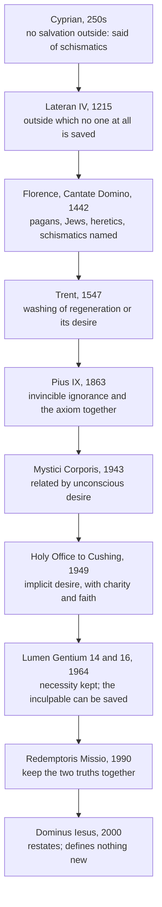

# Apologetics I · Lesson 8.2: Salvation outside the visible Church

> ⏱ ~15 min · Module 8: Pluralism, salvation, and apologetics in a secular age · Builds on: [8.1 Pluralism and its price](08-01-pluralism-and-its-price.md), [`fundamental-theology` 4.5](../../fundamental-theology/lessons/04-05-reading-a-documents-weight.md), [`fundamental-theology` 5.2](../../fundamental-theology/lessons/05-02-newmans-theory-of-development.md), [`philosophy-of-religion` 5.5](../../philosophy-of-religion/lessons/05-05-religious-diversity.md) · Unlocks: [8.3 Apologetics in a secular age](08-03-apologetics-in-a-secular-age.md)

## Why this matters

[8.1](08-01-pluralism-and-its-price.md) argued against Hick, and Hick's strongest point survived as a demand: say what becomes of the billions who never heard of Christ. A Catholic answer has to cope with an awkward record. In 1442 an ecumenical council said that pagans and Jews outside the Church go to the everlasting fire. In 1964 another said that people who through no fault of their own do not know the Gospel can be saved. [`philosophy-of-religion` 5.5](../../philosophy-of-religion/lessons/05-05-religious-diversity.md) cited the second text and left the weighing of it to this lesson. This is the hardest development in the course, and the lesson says so before it argues anything.

## The idea

The axiom is [*extra ecclesiam nulla salus*](../reference.md#extra-ecclesiam-nulla-salus): outside the Church, no salvation. Its oldest form is Cyprian's, from the baptismal controversy of the 250s: "there is no salvation out of the Church" (Letter to Jubaianus, ANF Ep. 72.21 = Hartel 73.21). As [`patristics` 2.4](../../patristics/lessons/02-04-cyprian-of-carthage.md) showed, he said it of schismatics and heretics, to deny that their rites worked. Lateran IV (1215, ch. 1) made it a profession of faith: one universal Church of the faithful, outside which no one at all is saved.

Then came Florence. The [Bull of Union with the Copts](../reference.md#cantate-domino), *Cantate Domino* (Eugenius IV, session 11, 4 February 1442), says the Roman Church holds that

> no one existing outside the Catholic Church, not only pagans but neither Jews nor heretics and schismatics, can become a sharer in eternal life, but they will go into the eternal fire … unless before the end of life they have been joined to it

(this lesson's own translation of the Latin *nullos extra catholicam ecclesiam existentes … aeternae vitae fieri posse participes*). Read it as it stands. It names Jews, and the Church's record toward Jews ([6.4](06-04-supersessionism-nostra-aetate-and-the-jewish-people.md)) gives that sentence its weight.

The modern texts keep two truths together, in John Paul II's phrase (*Redemptoris Missio* 9, 1990): the real possibility of salvation in Christ for all, and the necessity of the Church for that salvation. How a Catholic holds both is this lesson's question. What "the Church" means in the sentence, and where baptized non-Catholics stand, is taught inward by [`ecclesiology-and-mariology`](../../ecclesiology-and-mariology/syllabus.md) 5.1–5.2. This course argues outward, toward people who have never heard the Gospel.

## The other side

Two opposed camps make the same charge: Florence and Lumen Gentium 16 contradict each other.

**The traditionalist form.** Its sharpest twentieth-century voice was Leonard Feeney and the St Benedict Center in Boston, through their periodical *From the Housetops*. The argument: Florence was an ecumenical council teaching with the pope, in the words "firmly believes, professes and preaches", and it named its categories. *Dei Filius* (1870, ch. 4) teaches that a dogma's meaning may never be changed under the pretext of deeper understanding. So the plain sense binds. Feeneyism also denies that baptism of desire or of blood saves anyone without water baptism. On this view Lumen Gentium either says something Florence did not, which is an error, or it has to be read down until it agrees.

**The critic's form.** Pluralists and secular historians accept the same incompatibility and draw the other conclusion. The Church changed its mind under the pressure of a world it could no longer call guilty, and "development" is the name it gives the reversal. The Catholic historian Francis A. Sullivan's *Salvation Outside the Church?* (1992) supplies much of their evidence without sharing their conclusion. On his account, the medieval formulas assumed that anyone outside the Church was outside by their own fault. That assumption collapsed once Europeans met whole peoples who had never heard the Gospel.

## The argument

**P1.** The core is that the Church is *necessary* for salvation. It was taught by Lateran IV and Florence and restated by Lumen Gentium 14 (1964): whoever *knows* that Christ made the Catholic Church necessary and still refuses to enter or remain in it cannot be saved. Dominus Iesus (2000, §20) says this "must be firmly believed". *In words:* the axiom is about how salvation is given, not a count of who is saved.

**P2.** The tradition always took necessity to admit fulfilment by desire. Trent's Decree on Justification (1547, ch. 4) teaches that justification does not happen without the washing of regeneration *or the desire for it*. Aquinas held that someone who dies desiring baptism, from faith working through charity, can be saved (ST III q.68 a.2, citing Ambrose on the emperor Valentinian, who died a catechumen).

**P3.** [Invincible ignorance](../reference.md#invincible-ignorance) was taught a century before Vatican II, and in the same document as the axiom. Pius IX, *Quanto conficiamur moerore* (10 August 1863, §§7–8), is worked in Example 1.

**P4.** The [1949 Holy Office letter](../reference.md#feeney-case) to Archbishop Cushing made the connection. The cardinals decided it in plenary session on 27 July, Pius XII approved it on 28 July, and the letter is dated 8 August. It calls the axiom dogma and adds that "this dogma must be understood in that sense in which the Church herself understands it". The Church is necessary as a commanded means, and a means used only by desire can be enough. That desire may be implicit where there is invincible ignorance. It must be animated by perfect charity and by supernatural faith (Hebrews 11:6). Lumen Gentium 16's footnote cites this letter.

**P5.** Dogmatic formulas are conditioned in their *expression* but determinate in their *meaning* (*Mysterium Ecclesiae*, 1973, via [`fundamental-theology` 5.2](../../fundamental-theology/lessons/05-02-newmans-theory-of-development.md)).

**∴ C.** What Lumen Gentium 16 teaches does not contradict what Florence *taught*. Florence taught that the Church is necessary and that anyone who culpably dies separated from it is lost. Lumen Gentium 16 teaches that grace can reach the inculpably ignorant. That grace always comes from Christ and is always related to the Church. The other religions are not parallel ways of salvation (Dominus Iesus §21).

**Levels** ([the ladder](../reference.md#levels-of-authority)). The necessity of the Church is **rung 1**. *Cantate Domino* is a papal–conciliar doctrinal act, but it has no "we define" and no anathema. Under can. 749 §3, that every member of the named groups dying outside is lost is therefore *not manifestly defined*. The Church's own later reading interprets the sentence otherwise, and some traditionalists hold the whole sentence defined. *Quanto conficiamur* is an encyclical: **rung 3**. The 1949 letter is a dicastery letter with ordinary papal approval, sent to one archbishop and not printed in the *Acta Apostolicae Sedis*: **rung 3, light grade**. Its doctrine gained weight when a council footnoted it. [Lumen Gentium 16](../reference.md#lumen-gentium-16) defines nothing: **rung 3**. [Dominus Iesus](../reference.md#dominus-iesus) is a CDF declaration that sets forth again (§3) what was already taught. It defines nothing new, and its doctrines keep the rungs fixed elsewhere. *How* grace reaches non-Christians is **rung 5**: God gives it in ways known to himself (Ad Gentes 7), and theologians are still exploring the question (Dominus Iesus §21).

**Concession.** The fathers of Florence meant what they wrote about pagans and Jews. They almost certainly assumed that the people they named were outside by their own fault, and the bull itself states no such condition. The 1949 reading is not what 1442 would have said it meant. A Catholic who claims the earlier text "really" taught Lumen Gentium 16 is doing what this course forbids. This is the hardest development in the syllabus.

**Where the argument is weakest.** The conclusion depends on separating the *proposition taught* from an *assumption shared* by the people who taught it. In Newman's terms ([`fundamental-theology` 5.2](../../fundamental-theology/lessons/05-02-newmans-theory-of-development.md)), [development](../reference.md#development-of-doctrine) has to show preservation of type and conservative action on the past. It also has to show that the separation is not just a convenient one. Cyprian's own claim was narrower than Florence's, and Pius IX held both truths at once, so that evidence helps. Florence's sentence, read alone, gives the separation no foothold.

## The timeline

The hard step is C to D–E. Nothing between them says the strong reading of Florence was withdrawn. The tradition instead brought forward qualifications it already held.

## Worked examples

**Example 1 (clean): "Vatican II invented invincible ignorance."** Put *Quanto conficiamur moerore* on the table. Section 7 censures as a grave error the belief that one can be saved while living in error and cut off from the faith and Catholic unity. In the same section it says that people in invincible ignorance of the true religion can reach eternal life by divine light and grace if they keep the natural law, are ready to obey God and live honest lives. God, it says, does not allow anyone who is not guilty of deliberate sin to suffer eternal punishment. Section 8 then calls the axiom that no one is saved outside the Catholic Church a well-known Catholic teaching, and aims it at those stubbornly separated from the Church and the pope. So the objection fails on its dates. The pope who restated the axiom also taught the qualification, in the same letter. Lumen Gentium 16 adds two things: a positive account of how such people stand, and a conciliar setting for that account.

**Example 2 (strain): "Then why send missionaries?"** If the inculpably ignorant can be saved, preaching seems to put them in danger by making their ignorance culpable. John Paul II asks this himself (*Redemptoris Missio* 4). His answer (§11) does not make mission a rescue from certain damnation. It says every human being needs Christ, the Gospel is good news and not only a ticket, and true liberation consists in opening oneself to Christ's love. Dominus Iesus §22 adds that those outside are, objectively, in a "gravely deficient situation" compared with those who have the fullness of the means of salvation. The strain is real, though. The motive that drove centuries of missions, souls lost unless reached, has been reduced to "the means are fuller". A critic can fairly say that urgency has been traded for coherence.

## Watch out

- **You might think Dominus Iesus defined the necessity of the Church,** but a CDF declaration that "sets forth again" (§3) defines nothing new. The doctrine's rung comes from Lateran IV and Florence, and the declaration's wording ("must be firmly believed") reports that rung rather than creating it.
- **You might think Lumen Gentium 16 teaches that other religions save,** but it says grace reaches people *despite* invincible ignorance, and Dominus Iesus §21 calls it contrary to the faith to treat the religions as parallel ways. Calling this "pluralism with Catholic vocabulary" is a caricature. Hick would reject the position too.
- **You might think the Feeneyite was condemned for his doctrine and nothing else,** but the record is mixed. The 1949 letter judged that his periodical's teaching was not Catholic teaching. His excommunication (13 February 1953) was for disobedience, after he refused summonses to Rome, and he was reconciled in 1972, reportedly without retracting.

## One-liner

> Florence said the Church is necessary and assumed that those outside were guilty; the later texts kept the necessity and dropped the assumption, and the honest Catholic says that is what happened.

## Problems

**P1 (🟢) *(Exegetical, strict.)*** Run [`fundamental-theology` 4.5](../../fundamental-theology/lessons/04-05-reading-a-documents-weight.md)'s four steps on the 1949 Holy Office letter to Archbishop Cushing, one line per step, and give its rung. Then answer two questions. (b) The letter calls the axiom an "infallible statement". Does that make the letter infallible? (c) What later act raised the weight of the letter's teaching on implicit desire, and how? **100 words or fewer.**

**P2 (🟡) *(Apologetic: (a) Exegetical, graded first · (b) reply.)*** An invented forum post, written for this problem:

> "Florence, 1442, ecumenical council: pagans, Jews, heretics and schismatics who die outside the Church go to the fire. Vatican I says a dogma's meaning can never change. Lumen Gentium 16 says people who don't know the Gospel 'can attain salvation'. One of them is false. 'Invincible ignorance' is a loophole Vatican II invented to hide the contradiction."

(a) State this charge as its strongest defenders would. Keep what they would sign, drop what they would not, and name what you dropped. (b) Reply, opening with a **named concession**. **150 words or fewer in total.**

**P3 (🔴, optional) *(Apply to a hard case · Evaluative.)*** An invented case. Tomás, a seminarian, tells his formation director: "If the people I'd be sent to can be saved through invincible ignorance, preaching to them only risks making their ignorance culpable. Staying home is the kinder choice." Does *Redemptoris Missio*'s answer meet his argument? Any verdict. **120 words or fewer.**

Solutions

**P1** *(Exegetical, strict)*

**Must hit, strict:**

- *Source:* the Holy Office (plenary session, 27 July 1949) with ordinary papal approval (Pius XII, 28 July). It is the dicastery's act, not the pope's own. *Genre:* a letter to one archbishop, not printed in the *Acta Apostolicae Sedis* (it was published in 1952). *Operative sentence:* "explanations pertinent to the doctrine": the axiom is to be understood as the Church understands it, and implicit desire, animated by perfect charity and supernatural faith, can suffice in invincible ignorance. *Rung:* 3, at a light grade.
- (b) No. The letter *reports* that the axiom is taught infallibly (rung 1). Saying so does not make the letter infallible. It certifies the axiom's level and does not share it.
- (c) Lumen Gentium 16 (1964) cites the letter in its footnote, so a dogmatic constitution took its teaching into conciliar teaching. That teaching is authentic magisterium, rung 3, and it is still not a definition.

**Wrong turns:** rung 1 because the letter says "dogma". Rung 2 because the pope approved it, which ignores the grade of approval. Saying Lumen Gentium 16 *defined* the possibility of salvation.

**Model answer:** Source: the Holy Office, approved by Pius XII in the ordinary way. Genre: a letter to Cushing, outside the *Acta*. Operative: it explains the axiom (implicit desire, with charity and faith). Rung 3, light. (b) No: it reports the axiom's rung-1 status without sharing it. (c) Lumen Gentium 16 footnotes it, so a council's authentic teaching carries it (still rung 3, not defined).

---

**P2** *(Apologetic: (a) Exegetical, graded first · (b) reply)*

**Accept:** any reply that makes the named concession and separates what Florence taught from what its authors assumed, whatever its verdict.

**Must hit, strict (a), graded first:**

- **Keep:** Florence is a papal–conciliar doctrinal act ("firmly believes, professes and preaches") that names its categories. *Dei Filius* ch. 4 forbids changing a dogma's meaning. A plain reading of Lumen Gentium 16 extends salvation to people in groups Florence named. So the two texts cannot both be true in their plain sense.
- **Drop and name:** "Vatican II invented invincible ignorance." A strong defender would not say this, because Pius IX taught it in 1863 and Trent taught salvation by desire in 1547. The strong form says instead that these qualifications were later *misapplied* to Florence's categories.

**Must hit (b):**

- **Named concession:** Florence's fathers meant the named groups, and the bull states no condition about fault.
- Separate the proposition taught (the necessity of the Church, and the loss of those culpably outside) from the assumption that everyone outside is culpable. Cite Pius IX holding the axiom and invincible ignorance together.
- Say the cost: by can. 749 §3 the census reading is not manifestly defined, but a critic can call that separation convenient.

**Wrong turns:** stating (a) as "traditionalists hate Vatican II", which is a caricature and fails the problem. Claiming Florence "really meant" Lumen Gentium 16. Calling the whole of *Cantate Domino* defined dogma, or calling none of it binding.

**Model answer, one of several:** (a) Florence, teaching with the pope's authority, says the named groups are lost unless joined to the Church. *Dei Filius* forbids reading a dogma's meaning differently later, and Lumen Gentium 16 extends hope to members of those groups, so one text must give way. Dropped: "Vatican II invented invincible ignorance." Pius IX taught it in 1863. (b) Concession: Florence's fathers meant Jews and pagans, and they did not attach the condition of fault. Still, what was proposed for belief is the Church's necessity and the loss of anyone who culpably stays outside. Pius IX affirmed that axiom and invincible ignorance in one encyclical. The census reading has no "we define" and no anathema, so by can. 749 §3 it is not manifestly defined. The honest cost is that this separation is a reading the authors would not have offered.

---

**P3** *(Apply to a hard case · Evaluative)*

**Must hit, any verdict:**

- State Tomás's premise exactly: mission makes ignorance culpable, so it endangers people. Notice that this treats salvation as escaping blame and not as union with Christ.
- *Redemptoris Missio* 11: every human being needs Christ, and the Gospel is good news that liberates. Dominus Iesus §22: those outside are objectively in a "gravely deficient situation".
- Give a verdict, and say what it costs. If the answer works, Tomás's model of salvation was wrong. If it fails, admit that the reason which once made mission urgent has been weakened.

**Wrong turns:** answering that the ignorant are damned after all, which contradicts Lumen Gentium 16. Answering that mission no longer matters, which contradicts Lumen Gentium 16's closing sentence and Dominus Iesus §22.

**Model answer, one of several:** Mostly, yes. Tomás assumes that salvation means avoiding guilt. On Lumen Gentium 16 it means sharing in Christ's life, which invincible ignorance never gives anyone. At most, ignorance does not block that life. The Gospel offers the fullness of the means, and Dominus Iesus calls life without them "gravely deficient". The cost is real: the old urgency, "they are lost unless we go", is gone, and love has to carry the motive that fear once carried.

## Flashback

**From Lesson [7.5](07-05-the-prophethood-of-muhammad.md) (The prophethood of Muhammad):** *(Apologetic: (a) Exegetical, graded first · (b) reply.)* At an invented interfaith evening (nobody here is real; it is built for the problem), a Christian speaker says that no miracle can be checked across fourteen centuries, so Muslims believe in Muhammad on hearsay. A Muslim listener answers that his certainty never rested on reported wonders, and points to al-Ghazali's *Deliverance from Error*. (a) State al-Ghazali's argument as he gives it, including his analogy and why he will not rest on any single miracle. Two or three sentences. (b) Reply, opening with a **named concession**. Say what the argument establishes, what it does not, and where 7.5 would rest the dispute instead. 120 words or fewer. A reply that concludes al-Ghazali's argument succeeds passes if it is argued.

Solution

**Accept:** any reply that keeps a real concession, separates the messenger's goodness from the claim of prophethood, and engages the argument's cumulative structure, whatever its verdict.

**Must hit, strict (a), graded first:**

- **The analogy.** One knows that Galen was a physician by studying his medicine, not by watching a single cure.
- **The argument.** So one knows a prophet with certainty by long acquaintance with his words and by testing them in practice, many times over. The certainty comes from the accumulation.
- **The miracle set aside.** A single wonder might be magic, so it cannot be the ground.

**Must hit (b):**

- **A named concession.** The listener has answered the speaker: this is not belief on hearsay but a [cumulative case](01-03-burden-of-proof-and-the-shape-of-a-cumulative-case.md) of the shape Christians use themselves, close kin to Newman's illative sense ([8.3](08-03-apologetics-in-a-secular-age.md)). A Christian cannot fault its form.
- **What it establishes.** Acquaintance tested in practice can show that a teacher is sincere and wise and that his guidance bears fruit. That answers 7.5's first question, about the man.
- **What it does not.** Prophethood is the second question: did God speak through him a revelation binding on all? Fruit is a test that unmasks false prophets (Matthew 7:15–20), not a certificate for true ones. And a Christian reports the same certainty from long acquaintance with Christ's words. The two certainties conflict over who Jesus was, so acquaintance cannot arbitrate between them.
- **Where to rest it.** On content both sides can check in public: the crucifixion against 4:157 as the classical majority read it. Credit for adding that the point weakens on the reading that denies only Jewish agency.

**Wrong turns:** stating (a) as "he trusted Muhammad's good character" (it is a method of testing the teaching, not a report of reputation) or as the argument from the Qur'an's eloquence (that is *i'jaz*, a different strand). Calling the argument circular. Answering with an attack on Muhammad's character, which repeats the polemical record 7.5 concedes and could not settle prophethood anyway. Claiming the illative sense proves the Christian case.

**Model answer (a):** We know Galen was a physician by studying his medicine, not by seeing one cure. Likewise one knows a prophet with certainty through long acquaintance with his words, testing them in practice many times, until the evidence accumulates. A single wonder proves nothing, since it might be magic.

**Model answer (b), one of several:** Concession: that is not hearsay. It is a cumulative case, the very shape of reasoning Christians use, and the speaker was wrong. But testing teaching in practice shows that a man is sincere, wise and fruitful in guidance. It does not show that God spoke through him words binding on all. A Christian reports the same tested certainty about Christ's words, and the two conflict, so acquaintance cannot decide between them. The dispute should rest on what both can check: the crucifixion, which 4:157 on its classical reading denies.

## Connections

- **Backward:** the ladder and the four steps are [`fundamental-theology` 4.4](../../fundamental-theology/lessons/04-04-the-ladder-of-doctrinal-authority.md) and [4.5](../../fundamental-theology/lessons/04-05-reading-a-documents-weight.md). Newman's notes are [`fundamental-theology` 5.2](../../fundamental-theology/lessons/05-02-newmans-theory-of-development.md). Cyprian's formula as a text is [`patristics` 2.4](../../patristics/lessons/02-04-cyprian-of-carthage.md). Dominus Iesus on Christ's unicity is [`christology` 6.4](../../christology/lessons/06-04-christology-today.md). Hick and Rahner's anonymous Christian are [`philosophy-of-religion` 5.5](../../philosophy-of-religion/lessons/05-05-religious-diversity.md), and this lesson fulfils that lesson's forward reference.
- **Forward:** [8.3](08-03-apologetics-in-a-secular-age.md) asks how any of this lands where belief is one option among many, and the module's boss problem sets Lumen Gentium 16, Dominus Iesus and Florence side by side ([syllabus](../syllabus.md)). [`ecclesiology-and-mariology`](../../ecclesiology-and-mariology/syllabus.md) 5.1–5.2 teaches the axiom inward: *subsistit in*, Lumen Gentium 15, and baptized Christians outside full communion.
- **Sideways:** compare the usury case in [`fundamental-theology` 5.2](../../fundamental-theology/lessons/05-02-newmans-theory-of-development.md). Both teachings carried a factual premise about the world (that money is sterile; that those outside are culpable). In both, the premise changed and the principle is claimed to have survived. The dispute in each case is whether the premise was part of what was taught.
