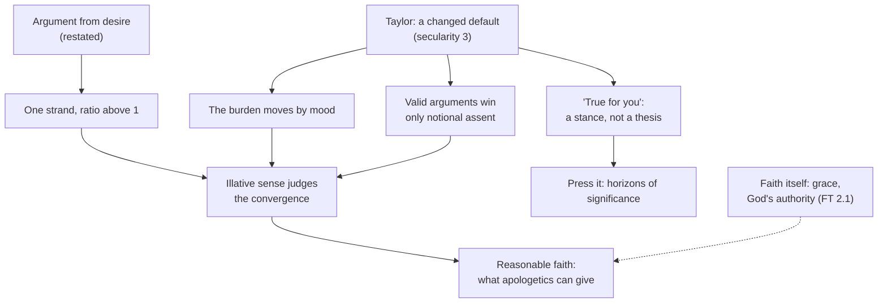

# Apologetics I · Lesson 8.3: Apologetics in a secular age

> ⏱ ~15 min · Module 8: Pluralism, salvation, and apologetics in a secular age · Builds on: [8.1 Pluralism and its price](08-01-pluralism-and-its-price.md), [8.2 Salvation outside the visible Church](08-02-salvation-outside-the-visible-church.md), [1.3 Burden of proof and the shape of a cumulative case](01-03-burden-of-proof-and-the-shape-of-a-cumulative-case.md) · Unlocks: [`apologetics-catholic-claims`](../../apologetics-catholic-claims/syllabus.md)

## Why this matters

Thirty lessons have built arguments. Most people who meet such arguments now neither yield nor rebut. They shrug, and an apologist who answers a shrug as if it were a counter-argument will lose without knowing why. This lesson says what changed, gives the two arguments aimed at that change (Lewis on desire, Newman on assent), and ends with what argument can do, and where it stops.

## The idea

**A changed default.** Charles Taylor's *A Secular Age* (2007) distinguishes three senses of secularity. The first is religion withdrawn from public institutions. The second is a decline in belief and practice. The third is a change in the *conditions of belief*: a move from a society in which not believing in God was nearly unthinkable to one in which faith is one option among several, and often not the easiest one to hold. [`social-theory`](../../social-theory/syllabus.md) Module 7 owns that as sociology; this lesson asks only what it does to argument. The arguments did not become fewer or weaker. The [secular age](../reference.md#secular-age) changed the frame in which they are heard. Taylor's name for the shared background is the *immanent frame*: a world intelligible in natural terms, which can be lived as open to transcendence or as closed to it. Believer and unbeliever alike are *cross-pressured*, and each position is made more fragile by the visible presence of the others.

That has two consequences. First, the burden of proof moves without anyone arguing for the move. In 1500 the unbeliever owed reasons. Now the believer seems to, and 1.3's careful allocation of the burden is replaced by a mood. Second, a valid argument can win assent to a proposition and change nothing in the person who assents. Newman's name for this is *notional* assent, and the second argument below is about it.

**Relativism as a stance.** The commonest secular response to a religious argument is not "your premise is false" but "that's true for you." Read as a thesis, that all truth is relative to a framework, it refutes itself, and the Protagoras move is in [`epistemology` 3.4](../../epistemology/lessons/03-04-contextualism-and-its-rivals.md) and [`ancient-medieval-philosophy` 1.3](../../ancient-medieval-philosophy/lessons/01-03-the-sophists-and-socrates.md). But read that way it is usually a straw man. Most people who say it hold no thesis about truth. They hold what Bas van Fraassen (*The Empirical Stance*, 2002) calls a *stance*: a policy of attitude rather than a belief. Here the policy is: don't impose, don't judge, let each person choose. Refuting a thesis that no one holds is the cheap move.

## The other side

**The relativist stance at its best.** Taylor states it sympathetically. In *The Ethics of Authenticity* (1991, his Massey Lectures) he calls it "soft relativism". He traces it to a real moral ideal, authenticity: the conviction that each person has an original way of being human, which they must find for themselves and cannot simply receive. At full strength the stance says three things. Religious argument tries to settle for someone what only that person can settle. History shows where imposed belief leads. Respect forbids treating another person's deepest commitments as a reasoning error. That is a moral position, and an admirable one.

**Beversluis against the argument from desire.** C. S. Lewis argued (*Mere Christianity*, 1952, bk 3 ch. 10, "Hope"; earlier in the sermon *The Weight of Glory*, 1941) that creatures are not born with desires unless a satisfaction for them exists: hunger and food, thirst and water, sexual desire and sex. We find in ourselves a longing that no experience in this world satisfies, even at its best: not marriage, not travel, not learning. The most probable explanation, Lewis said, is that we were made for another world. John Beversluis (*C. S. Lewis and the Search for Rational Religion*, 1985; revised edition 2007) pressed four objections:

1. **Is it a natural desire?** The clear cases of natural desire are biological and instinctive. Lewis's longing is not obviously one of them, so the premise about natural desires may not cover it.
2. **Propositional content.** A desire is a desire *for* something specified. On Lewis's own description, this longing is for something no one has experienced and no one can describe. Nothing then shows that any object corresponds to it, still less that the object is God.
3. **Universality.** Many people report being satisfied by careers, spouses and children. The universal premise generalizes from one temperament.
4. **Provenance.** God as the single object of all desire is Platonic before it is biblical, and many biblical texts sit uneasily with it.

## The argument

**A. The [argument from desire](../reference.md#argument-from-desire), restated to survive Beversluis.**

1. **P1.** Kinds of desire that are innate and widespread in a species are, as a rule, desires for kinds of things that exist.
2. **P2.** Human beings commonly experience a longing that no finite good satisfies, even when that good is attained at its best: Augustine's restless heart (*Confessions* I.1; [`patristics` 4.3](../../patristics/lessons/04-03-augustine-confessions.md)), Lewis's "Joy".
3. **P3.** Naturalism predicts restlessness, since never being satisfied pays. It does not obviously predict this particular shape: a longing that recognizes every finite good as not what it wants.
4. **∴ C.** The longing is more expected if there is a transcendent good than if there is not.

*In words:* this is one strand in 1.3's cable, a likelihood ratio above 1. It is not a proof. The restatement grants Beversluis's second objection outright. The desire does not show what its object is, only that the object is nothing finite. Aquinas has a cousin of the argument: a natural desire to know the first cause would be in vain if no created intellect could reach it (ST I q.12 a.1). It presupposes God, so it works inside a case, not at its door.

**B. Newman: how a cable becomes assent.** In *An Essay in Aid of a Grammar of Assent* (1870), Newman separates *notional* assent, given to abstractions, from *real* assent, given to things apprehended as concrete ([notional and real assent](../reference.md#notional-and-real-assent), ch. IV). Quoting his own letters of 1841, he says real assent comes another way than syllogism:

> "The heart is commonly reached, not through the reason, but through the imagination, by means of direct impressions, by the testimony of facts and events, by history, by description." (ch. IV §3)

That is not anti-intellectualism. Newman's account of how we reach certitude about concrete matters is a theory of reasoning, *informal inference*:

> "It is the cumulation of probabilities, independent of each other, arising out of the nature and circumstances of the particular case which is under review; probabilities too fine to avail separately…" (ch. VIII §2)

A proof, he adds, is the limit that converging probabilities approach. The faculty that judges when they have converged enough is the [illative sense](../reference.md#illative-sense):

> "This power of judging and concluding, when in its perfection, I call the Illative Sense…" (ch. IX §2)

5. **P4.** In concrete matters such as a historical event, a person's character or a verdict, we rightly reach certitude by converging probabilities, none of them decisive, judged by a trained faculty rather than a formula.
6. **P5.** Whether Christianity is true is a concrete matter of that kind.
7. **∴ C.** Certitude about it can be reasonable without a demonstration, and the [cumulative case](../reference.md#cumulative-case) of Modules 2 to 7 is the right shape for such certitude.

*In words:* what 1.3 did with odds, Newman does with judgement, and he holds that judgement can rightly go beyond what the arithmetic displays. **Level:** Newman's analysis is freely disputed among Catholics ([`fundamental-theology` 2.2](../../fundamental-theology/lessons/02-02-credibility-and-the-preambles-of-faith.md)). *Dei Filius* ch. 3 defines only that exterior signs can make revelation credible.

**Concession.** Beversluis is right on three counts. The desire alone does not specify its object. The universality premise is weaker than Lewis stated it. And people who say they are content are not thereby self-deceived. The soft relativist is right too. Respect forbids treating someone's commitments as a puzzle to be solved, and imposed belief has a record that the Church has itself confessed ([6.4](06-04-supersessionism-nostra-aetate-and-the-jewish-people.md), [8.2](08-02-salvation-outside-the-visible-church.md)).

**Pressing the stance without the cheap move.** Taylor's own reply is internal. Authenticity is intelligible only against *horizons of significance*, things that matter whether or not I choose them. If choosing were all that made a thing valuable, nothing chosen would matter, and the ideal would dissolve itself. So press the stance by asking what it protects. It protects respect and sincerity, and respect is owed whether or not anyone chooses to owe it. That does not refute the stance. It reopens the question the stance was adopted to close.

**What apologetics can and cannot do.** Faith is an assent made on God's authority, freely, under grace ([`fundamental-theology` 2.1](../../fundamental-theology/lessons/02-01-the-act-of-faith.md)). Argument can clear ground by answering objections. It can supply [motives of credibility](../reference.md#motives-of-credibility). In Newman's terms it can help turn notional assent into real assent. It cannot produce faith. Losing an argument therefore does not show that faith is false, and winning one does not give anyone faith.

**Where the argument is weakest.** In the illative sense. Newman makes the trained judgement its own standard, so a sound judgement is hard to tell from a merely confident one. Two well-prepared minds with the same evidence can reach opposite certitudes ([`epistemology` 4.5](../../epistemology/lessons/04-05-peer-disagreement.md)), and Newman's appeal to character and preparation moves the dispute rather than settling it. For desire the weak point is P3: an evolutionary story on which an endlessly unsatisfiable drive is adaptive may predict the shape too, which pushes the ratio toward 1.

## The map

The dashed edge marks the line argument does not cross.

## Worked examples

**Example 1 (clean).** Invented: Maria, a graduate student, hears out the cumulative case and says, "I'm glad your faith works for you." Treat this as a stance, not a thesis. Do not reply that her claim is "absolutely true", which is the cheap move. Ask what she is protecting. She says no one should be pressured. Concede that, by name. Then note that her reason is itself a claim about what is owed to everyone, a horizon she did not choose. Offer desire as a question about her experience, not a syllogism: is there a longing each success leaves untouched? That aims at real assent. Then Newman: the case is a convergence, which she is invited to judge, not concede.

**Example 2 (hard).** Invented: Tom says he has no such longing. His work, marriage and children satisfy him, and he is not defensive about it. Lewis's version fails for Tom, since P2 is not his datum. The restated version survives only as a claim about common human experience, and its ratio depends on how common the longing is, which Tom's case lowers. Newman does not rescue it. Tom's illative sense weighs the same convergence and finds it short, and there is no neutral court above the two judgements. The honest result is modest. The apologist can show that faith is not unreasonable, and cannot show that Tom is.

## Watch out

- **You might think Taylor shows that arguments for God were refuted, or that believers simply decreased.** His subject is the third sense: belief became one option among others. The frame moved, not the arguments.
- **You might think the Church endorsed Newman's illative sense.** Neither *Dei Filius* nor any later act adopts his analysis. It is freely disputed ([`fundamental-theology` 2.2](../../fundamental-theology/lessons/02-02-credibility-and-the-preambles-of-faith.md)), and calling it Church teaching overstates its [level of authority](../reference.md#levels-of-authority).
- **You might think "true for you" claims that all truth is relative.** Usually it is an ethic of non-imposition. Answering a thesis the speaker never held is the caricature this course fails.

## One-liner

> The arguments did not get weaker; the default moved. Answer the stance by what it protects, offer desire as one strand, and let Newman's illative sense weigh the cable, knowing that argument can make faith reasonable and cannot make it.

## Problems

**P1 (🟢) *(Exegetical.)*** An invented parish bulletin note:

> "As Charles Taylor proved, our age is secular because science refuted religion and people stopped believing. Newman saw the answer: faith needs no reasons, only the heart. And the First Vatican Council made Newman's illative sense the Church's official account of how we come to believe."

Name the three errors and correct each in one sentence.

**P2 (🟡) *(Apologetic: (a) Exegetical, graded first · (b) reply.)*** (a) State Beversluis's objections to Lewis's argument from desire as he presses them. Give at least two, one of which must be the propositional-content objection. Three sentences at most. (b) Reply in 150 words or fewer, opening with a named concession.

**P3 (🔴) *(Exegetical (a) · Evaluative (b).)*** An invented forum post:

> "I'm not saying nothing is true. I'm saying, who am I to tell a Hindu or a Catholic their faith is wrong? Everyone has to find what's real for them. Arguing people into or out of religion is just disrespect with footnotes."

(a) Is this a thesis or a stance? Say in two sentences why "but that claim is itself absolute" misses it. (b) In 120 words or fewer, either press the stance as Taylor does or defend it against that pressure. Any verdict.

Solutions

**P1** *(Exegetical.)*

**Must hit, strict:**

- **Taylor.** His thesis is not that science refuted religion or simply that belief declined (secularity 2). It is that the conditions of belief changed (secularity 3), so that faith became one option among others. Taylor argues *against* "subtraction stories" in which science peels religion away.
- **Newman.** Informal inference is reasoning, the cumulation of independent probabilities judged by the illative sense, which Newman calls the reasoning faculty. The line about the heart concerns how *real* assent is reached, not a claim that faith needs no reasons.
- **Vatican I.** *Dei Filius* adopts no theory of the analysis of faith. Its ch. 3 defines that exterior signs can make revelation credible. Newman's account is freely disputed. Calling it official teaching overstates the level.

**Wrong turns:** saying Newman was condemned (he was not, and he was later made a cardinal and canonized); saying Taylor denies that belief declined (he grants it, but it is not his subject).

---

**P2** *(Apologetic: (a) Exegetical, graded first · (b) reply.)*

**Must hit, strict (a), graded first:**

- Propositional content: a desire is for something specified, and Lewis's longing is by his own account for something no one can describe, so nothing shows that an object corresponds to it, let alone God.
- At least one more of: whether the longing is a *natural* desire at all, given that the clear natural desires are biological and instinctive; universality, since many report satisfaction in finite goods; God as universal object of desire being Platonic rather than biblical.

**Wrong turns:** "Beversluis says wanting something doesn't make it real" (too crude: Lewis already granted that hunger does not guarantee bread); making Beversluis an atheist polemicist mocking Lewis (his book is a sustained philosophical critique); attributing the propositional objection to Lewis himself.

**Accept:** any reply, for or against the argument, that opens with a named concession and engages the propositional-content objection.

**Must hit (b):**

- A named concession: the desire does not specify its object, or universality was overstated.
- A restatement that weakens the conclusion to a likelihood ratio above 1 (a strand, not a proof), or an argument that even that fails.
- Engagement with what naturalism predicts about the shape of the longing.

**Model answer (b), one of several:** Concession: Beversluis is right that a longing for "we know not what" cannot by itself show that its object exists or that it is God. Lewis's deductive phrasing overreaches. But a weaker claim survives. The longing has a distinctive shape: every finite good, once attained, is recognized as *not it*. If that is common, it is somewhat more expected on a world with a transcendent good than on one without. Restlessness alone would not be, since evolution rewards wanting more. What evolution predicts is wanting *more of the same*, not finding the best finite goods beside the point. So desire enters the case as one strand with a modest ratio. It carries no weight alone and is not worthless in the cable.

---

**P3** *(Exegetical (a) · Evaluative (b).)*

**Must hit, strict (a):**

- It is a stance: a policy of non-imposition and respect, not a claim about the nature of truth (the post explicitly denies that nothing is true).
- The self-refutation retort targets a global thesis that the writer does not hold, so it changes the subject.

**Accept:** any verdict in (b) that makes the moves.

**Must hit, any verdict (b):**

- Identify the value the stance protects (respect, sincerity, authenticity).
- Either press it (that value is owed independently of anyone's choice, a horizon of significance, so the stance rests on a non-relative commitment and reopens the question) or defend it (the stance needs only a modest objective commitment to non-coercion, which is compatible with refusing to argue about religion).

**Model answer (b), one of several:** The post's real premise is that people are owed respect. That is not true-for-me. The writer would object to anyone who mocked a Hindu's faith, whatever the mocker had chosen to value. So the stance stands on a horizon its author did not choose, and once one thing is owed to everyone regardless of choice, the question "what else is true regardless of choice?" is open again. That does not show that argument about religion is respectful. It shows that the post cannot rule it out on relativist grounds. Whether a given argument is respectful depends on how it is made, not on whether it is made.

## Flashback

**From Lesson [8.1](08-01-pluralism-and-its-price.md) (Pluralism and its price):** *(Exegetical: apply to a new case (a) · Evaluative (b).)* An invented university chaplaincy policy (nobody wrote it; the group it names is also invented):

> "We are a pluralist chaplaincy. We treat every faith as an equally valid response to the divine and privilege none. We sponsor Jewish, Christian, Muslim, Hindu, Sikh and Buddhist societies. We decline to sponsor the Brotherhood of the Last Flame, whose members must cut off their families and hand over their income, because it breeds fear rather than compassion."

(a) Which two of 8.1's costs of pluralism does the last sentence illustrate, and what does the resulting charge show, and fail to show, about pluralism? Two sentences. (b) A Brotherhood member replies: "You call yourselves neutral, yet you have ranked us by your own ethic." Any verdict: can a Catholic inclusivist on the chaplaincy staff answer him better than the pluralist chaplain can? 100 words or fewer.

Solution

**Must hit, strict (a):**

- **Arbitrariness, returned** (P4(c)): the policy ranks traditions and excludes one by a standard it gives no neutral argument for, exactly as Hick's criterion admits the great post-axial traditions and excludes destructive cults. And the **yardstick problem** (P4(a)): "compassion" is the measuring standard, which is the pluralist's own broadly shared ethic, not anything the transcategorial Real could supply.
- What it shows: pluralism is **not neutral**, being one first-order position among others. What it does not show: that pluralism contradicts itself (8.1's Watch out), or that its ranking is wrong. Since the arbitrariness charge lands on every position, it decides nothing between them.

**Must hit, any verdict (b):**

- Grant that the inclusivist ranks too: she also excludes the Brotherhood by a standard (the Gospel's account of love, the dignity of the family) that he does not share, so the charge lands on her as well.
- Locate any advantage precisely. She never claimed neutrality, so the member's complaint exposes an inconsistency in the chaplain's self-description but only a disagreement with hers. Or argue that this advantage is merely rhetorical, since she has no better neutral argument for her standard than the chaplain has for his.
- State the member's complaint fairly, without mocking him: the coercion of members is the reason to decline, not the group's strangeness.

**Wrong turns:** saying the policy shows pluralism is self-refuting; saying the inclusivist escapes the arbitrariness charge altogether; treating "compassion" as a neutral standard every tradition already shares (8.1's yardstick problem is that Christians, Buddhists and Muslims disagree about what saintliness *is*).

**Model answer (b), one of several:** Partly. She ranks the Brotherhood too, by a standard he rejects, so she cannot call her verdict neutral either. Arbitrariness lands on both staff members. But only the chaplain advertised neutrality. The member's reply shows that the chaplain's policy says one thing and does another. Against her it shows only that they disagree, which she has said from the start. So she answers him more honestly, not more neutrally. Whether her standard is better grounded is the first-order question the chaplaincy hoped to avoid, and the member is right that it cannot be avoided.

## Connections

- **Backward:** Newman's informal inference is the theory behind [1.3](01-03-burden-of-proof-and-the-shape-of-a-cumulative-case.md)'s cable, and 1.3 promised it here. Newman on development, the other half of his work this course leans on, is [`fundamental-theology` 5.2](../../fundamental-theology/lessons/05-02-newmans-theory-of-development.md) and carried [8.2](08-02-salvation-outside-the-visible-church.md). The one-sentence mention of the argument from desire in [`philosophy-of-religion` 3.3](../../philosophy-of-religion/lessons/03-03-moral-arguments.md) is built out here.
- **Forward:** [`apologetics-catholic-claims`](../../apologetics-catholic-claims/syllabus.md) argues among Christians, where the shared ground is wide and the dispute is authority and interpretation. Newman's convergence returns there in arguments from history.
- **Sideways:** Taylor's secularity 3 is [`social-theory`](../../social-theory/syllabus.md) 7.3, where its evidence is assessed. The illative sense is close to what epistemologists call judgement under underdetermination, and to the expert intuition a physician uses in reaching a diagnosis no single test settles.

## Closing the course

The course built one argued case, and stated the other side first at every step. Modules 2 and 3 assembled natural theology as a cable and pressed naturalism on reason, consciousness and morality, while conceding where its answers are good. Module 4 corrected myths on both sides of science and faith. Module 5 argued the resurrection as history, with Ehrman, Lüdemann and Allison at full strength. Modules 6 and 7 argued against Judaism and Islam after stating each as its own thinkers would, and after stating the Church's record first. Module 8 answered pluralism and held the hardest development in the syllabus honestly.

It did not claim a demonstration. Nor did it claim that anyone who remains unpersuaded is irrational, or that any rubric required the Catholic conclusion. At most it claimed that faith can be reasonable, in Newman's sense, and it named the weakest link at each stage so you can test that claim yourself.

[`apologetics-catholic-claims`](../../apologetics-catholic-claims/syllabus.md) continues on shared Christian ground: *sola scriptura*, justification, the papacy and the Orthodox case, under the same rule of the other side first.
