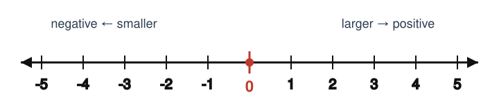

# Arithmetic & Number Sense · Lesson 1.1: Place value & the integers

> ⏱ ~15 min · Module 1: Numbers & operations · Builds on: nothing (course start) · Unlocks: 1.2 (order of operations)

## Why this matters

Every later course silently assumes you can look at a number and *feel* it — that $-40{,}000$ is huge and negative, that $0.03$ and $300$ are worlds apart even though both are "just a 3." That instinct isn't magic; it's place value plus a clear picture of the number line. And the single most common wrong answer in all of physics and economics isn't a botched formula — it's a **sign error**. This lesson builds the reflex that kills sign errors before they happen: *predict the sign of the result before you compute the digits.*

## The idea

A number written in base 10 is really a compact receipt for a sum. The string $3{,}504$ means "three thousands, five hundreds, zero tens, four ones" — the *position* of each digit tells you what it's worth. Slide a digit one slot left and it counts for ten times as much. That's the whole trick of place value: same ten symbols, but where you put them multiplies their value by powers of ten.

Now stretch the counting numbers in both directions past zero and you get the **integers**: $\dots, -3, -2, -1, 0, 1, 2, 3, \dots$. Picture them as evenly spaced fenceposts on an infinite line, zero in the middle. Two facts do almost all the work:

- **Position = size.** Farther right means larger, always. So $-2 > -5$ (it's to the right), even though "5 is bigger than 2" as a raw count.
- **A number has two separate pieces of information: a sign and a magnitude.** The magnitude is how far from zero (its distance); the sign is which side. $-7$ and $+7$ share a magnitude of $7$ but point opposite ways.

Keep those two apart and signed arithmetic stops being a memorized rulebook and becomes something you can *see*.

## The formal version

**Place value.** A whole number's digits $d_k d_{k-1} \dots d_1 d_0$ stand for

$$ d_k\cdot 10^{k} + \dots + d_2\cdot 10^{2} + d_1\cdot 10^{1} + d_0\cdot 10^{0}. $$

In words: each digit is multiplied by a power of ten set by its position, and the powers grow by one every step to the left ($10^0=1$, $10^1=10$, $10^2=100,\dots$).

**The integers** are the set $\mathbb{Z} = \{\dots,-2,-1,0,1,2,\dots\}$. For any integer $n$, its **absolute value** $|n|$ is its distance from $0$ on the line (always $\ge 0$): $|{-7}|=7$, $|7|=7$, $|0|=0$. In words: $|n|$ throws away the sign and keeps the magnitude.

**Order.** $a < b$ means $a$ lies to the *left* of $b$ on the number line. In words: reading the line left-to-right lists the integers from smallest to largest.

**Signed arithmetic — the four rules, each with its picture:**

- **Adding** $a+b$: start at $a$, then step $b$ units — right if $b>0$, left if $b<0$.
- **Subtracting** is adding the opposite: $a-b = a+(-b)$. In words: subtracting $b$ is the same as adding a number of equal magnitude and flipped sign.
- **Multiplying / dividing signs:** like signs give a positive, unlike signs give a negative.
$$(+)(+)=+,\quad (-)(-)=+,\quad (+)(-)=-,\quad (-)(+)=-.$$
In words: an even number of minus signs cancels to positive; an odd number leaves it negative. Then multiply/divide the magnitudes as usual.

## Picture

Distance from the red $0$ is magnitude; which side you're on is the sign. Comparison is just "who's farther right."

## Worked examples

**Example 1 (mechanical — read the place value, then order).** Compare $-1{,}204$ and $-1{,}240$.

First read them. $-1{,}240$ has magnitude $1\cdot1000 + 2\cdot100 + 4\cdot10 + 0 = 1{,}240$; $-1{,}204$ has magnitude $1\cdot1000 + 2\cdot100 + 0\cdot10 + 4 = 1{,}204$. So $1{,}240 > 1{,}204$ in magnitude. **But both are negative**, so the one *farther* from zero sits farther *left* and is therefore the *smaller* number:

$$-1{,}240 < -1{,}204.$$

The trap this dodges: with negatives, bigger magnitude means smaller value. The number line settles it instantly — $-1{,}240$ is deeper into the negatives.

**Example 2 (why you'd care — predict the sign first).** A diver at depth $-30$ m (30 m below the surface, taking up as positive) ascends at $4$ m/s for $6$ s. Where are they?

*Predict the sign before touching the digits.* Ascending is upward = positive motion; $4\times 6$ has two positive factors, so the displacement is $+24$ m. Starting at $-30$ and adding a positive $24$ moves us right on the line — still negative but closer to the surface:

$$-30 + (4)(6) = -30 + 24 = -6 \text{ m}.$$

Six meters below the surface. The sign prediction ($+24$, ending still negative) is your sanity check: if you'd fumbled and gotten $-54$, "still sinking while ascending" would scream that something's wrong. That reflex — *what sign should this be?* — is the entire point of the lesson.

## Watch out

- **You might think** a bigger magnitude means a bigger number. **Actually**, only for positives. Among negatives it flips: $-9 < -2$ because $-9$ is farther left. Check on the line, not by comparing the digits alone.
- **You might think** subtracting a negative should make things smaller. **Actually** $a - (-b) = a + b$ — two minus signs cancel, so it grows: $5 - (-3) = 8$. "Minus a minus is a plus" isn't a slogan, it's *subtracting the opposite.*
- **You might think** $-3^2$ and $(-3)^2$ are the same. **Actually** they're not: $(-3)^2 = 9$ (the sign is inside the square, two minuses cancel), but $-3^2 = -(3^2) = -9$ (the square binds first, the minus rides along). Parentheses decide who owns the sign — the star of Lesson 1.2.

## One-liner

> A number is a place (which slot, worth ten times the slot to its right) and a direction from zero (its sign) — nail the sign first and the digits fall in line.

## Problems

**P1 (🟢)** Order these from least to greatest: $-8,\; 3,\; -15,\; 0,\; -1,\; 12$. Then state $|{-15}|$ and $|3|$.

**P2 (🟡)** For each, *first* predict the sign of the answer in words, *then* compute: (a) $(-6)(-7)$, (b) $-48 \div 6$, (c) $-9 - (-4)$, (d) $(-2)(5)(-3)$.

**P3 (🔴, optional)** A thermometer reads $-4^\circ$C at 6 a.m. It falls $7$ degrees by 8 a.m., then rises $12$ degrees by noon. Predict whether the noon reading is above or below zero *before* computing, then find it. Which single addition/subtraction step crossed zero?

Solutions

**P1** On the number line, least (farthest left) to greatest (farthest right):
$$-15,\; -8,\; -1,\; 0,\; 3,\; 12.$$
Absolute values: $|{-15}| = 15$ (distance from zero), $|3| = 3$. Note $-15$ has the *largest* magnitude yet is the *smallest* number.

**P2**
- (a) Two negatives → unlike-count is even → **positive**. $(-6)(-7) = +42$.
- (b) Unlike signs (negative ÷ positive) → **negative**. $-48 \div 6 = -8$.
- (c) Subtracting a negative = adding its opposite: $-9 - (-4) = -9 + 4$. Adding a smaller positive to a negative stays **negative**: $= -5$.
- (d) Count the minus signs: two of them ($-2$ and $-3$) → even → **positive**. Magnitudes: $2\cdot5\cdot3 = 30$, so $(-2)(5)(-3) = +30$.

**P3** Prediction: start at $-4$, drop $7$ (deeper negative, to $-11$), then rise $12$ — a $12$-degree climb from $-11$ overshoots zero by $1$, so expect **just above zero**. Compute:
$$-4 - 7 + 12 = -11 + 12 = +1^\circ\text{C}.$$
The step that crossed zero is the final $+12$: it took the reading from $-11$ (below) to $+1$ (above), passing through $0$ on the way up.

## Flashback

*(None — course start.)*

## Connections

- **Forward:** Lesson 1.2 (order of operations) settles *which* operation acts first when several pile up in one expression — exactly the $-3^2$ vs. $(-3)^2$ ambiguity flagged in "Watch out." The sign-prediction habit rides along into every calculation after this.
- **Forward (algebra):** in `algebra-foundations` these same sign rules run on letters instead of digits — $-(a-b) = -a+b$ is "subtracting the opposite," and $(-x)(-y)=xy$ is "two minuses cancel." Get them reflexive now on numbers and algebra inherits them for free.
- **Sideways (physics):** signed quantities *are* integers with a direction — displacement (up vs. down, as in the diver), electric charge ($+$ vs. $-$), velocity along an axis. Choosing which way is "positive" and tracking the sign is the same move you just made on the number line.
