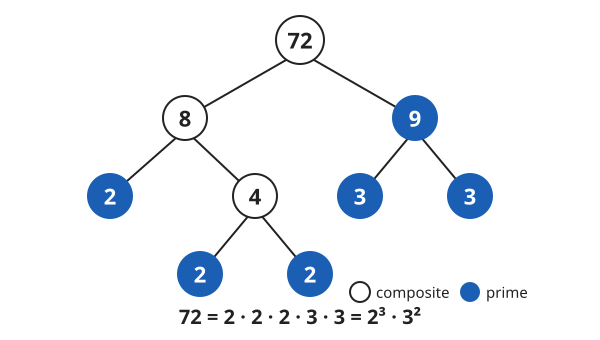

# Arithmetic & Number Sense · Lesson 1.3: Factors, primes & divisibility

> ⏱ ~15 min · Module 1: Numbers & operations · Builds on: 1.1 (place value & the integers) · Unlocks: 2.1 (fractions)

## Why this matters

The moment you reduce a fraction, find a common denominator, or factor a quadratic, you are doing exactly one thing: breaking a number into its multiplicative parts. Every whole number has a unique "genetic code" made of primes, and almost every arithmetic shortcut downstream — reducing $\tfrac{18}{24}$, syncing gears that mesh every 24 and 36 teeth, factoring $x^2 - 5x + 6$ — is just reading that code. Learn to see it once and you stop guessing.

## The idea

A **factor** of a number divides it evenly (no remainder); a **multiple** is what you get by scaling it up. Six is a *factor* of 24; 24 is a *multiple* of 6 — same relationship, seen from the two ends.

Some numbers can't be broken down at all: a **prime** ($2, 3, 5, 7, 11, \dots$) has no factors except $1$ and itself. Everything else is **composite** — built by multiplying primes together. The big claim of this lesson: *every* whole number bigger than 1 is a prime, or a product of primes in exactly one way. Primes are the atoms; every other number is a molecule with one fixed recipe.

Before you factor, you want a fast way to *test* factors in your head. That's what divisibility rules are for — little tricks that read the answer off the digits instead of doing the division.

## The formal version

**Divisibility rules.** A whole number is divisible by:

| by | rule |
|---|---|
| **2** | last digit is even ($0,2,4,6,8$) |
| **5** | last digit is $0$ or $5$ |
| **10** | last digit is $0$ |
| **4** | last **two** digits form a number divisible by 4 |
| **3** | **sum of the digits** is divisible by 3 |
| **9** | **sum of the digits** is divisible by 9 |
| **6** | divisible by **both** 2 and 3 |

In words: the 2/5/10/4 rules only peek at the end of the number, because $10, 100, 1000, \dots$ are already divisible by those. The 3 and 9 rules look at the whole digit sum — here's why. Write a number by place value, e.g. $437 = 4(100) + 3(10) + 7$. Since $10 = 9 + 1$ and $100 = 99 + 1$, every power of ten is "a multiple of 9, plus 1." So $437 = 4(99{+}1) + 3(9{+}1) + 7 = (\text{a multiple of 9}) + (4 + 3 + 7)$. The bulky part is already divisible by 9; whatever is left over is exactly the **digit sum**. The same argument works for 3, since $10, 100, \dots$ are also each "a multiple of 3, plus 1."

**Prime factorization (unique factorization).** Every integer $n > 1$ can be written as
$$n = p_1^{a_1}\, p_2^{a_2} \cdots p_k^{a_k},$$
a product of primes $p_i$ raised to whole-number powers $a_i$, and this list is **unique** (order aside). In words: a number's prime recipe is a fingerprint — no number has two different ones.

**GCD and LCM from the recipe.** Given two numbers' prime factorizations:

- $\gcd(a,b)$ — the **greatest common divisor** — takes each shared prime to its **lower** power (what both numbers *have in common*).
- $\operatorname{lcm}(a,b)$ — the **least common multiple** — takes each prime that appears in *either* to its **higher** power (the smallest number *both* divide into).

In words: line the two recipes up prime by prime. GCD keeps the smaller stockpile of each atom; LCM keeps the larger.

## Picture

A **factor tree** cracks a number open one step at a time: split off any factor pair, keep splitting the composite pieces, and stop when every leaf is prime. The leaves — in any order you happen to find them — always multiply back to the same prime recipe.

## Worked examples

**Example 1 (mechanical — rules, then recipe).** Test $3{,}924$ against the rules, then factor it.

- Last digit $4$ is even → divisible by **2**.
- Digit sum $3+9+2+4 = 18$, and $18$ is divisible by $9$ → divisible by **9** (hence also by **3**).
- Last two digits $24$, and $24 \div 4 = 6$ → divisible by **4**.
- Divisible by both 2 and 3 → divisible by **6**.

Now the recipe: $3{,}924 = 4 \times 981 = 2^2 \times (9 \times 109) = 2^2 \times 3^2 \times 109$. Is $109$ prime? Test primes up to $\sqrt{109}\approx 10.4$: not even, digit sum $10$ (not a multiple of 3), doesn't end in 0/5, and $109 = 7(15)+4$ — none divide it, so $109$ is prime. Recipe: $2^2 \cdot 3^2 \cdot 109$.

**Example 2 (why you'd care — GCD & LCM with meaning).** A warehouse packs boxes of $24$ and pallets of $36$. Line up the recipes:
$$24 = 2^3 \cdot 3, \qquad 36 = 2^2 \cdot 3^2.$$
- $\gcd(24,36) = 2^{2} \cdot 3^{1} = 12$ — take the *lower* power of each shared prime. **Meaning:** $12$ is the largest group size that packs *both* a box and a pallet evenly. (You could subdivide both into groups of 12 with nothing left over.)
- $\operatorname{lcm}(24,36) = 2^{3} \cdot 3^{2} = 72$ — take the *higher* power of each prime present. **Meaning:** $72$ is the smallest shipment that fills whole boxes *and* whole pallets exactly ($72 = 3$ boxes $= 2$ pallets).

GCD looks *down* into the shared structure; LCM reaches *up* to the first place the two schedules line up.

## Watch out

- You might think "factor" and "multiple" are interchangeable — they're opposite ends. $6$ is a *factor* of $24$ (it divides in); $24$ is a *multiple* of $6$ (it's built up). "Divides" points down, "is divisible by" points up.
- You might think the digit-sum trick works for lots of divisors. It works **only for 3 and 9**. The digit sum tells you nothing about divisibility by 2, 4, 5, or 7 — for those, use their own rules.
- You might swap which is which: **GCD is never bigger than either number; LCM is never smaller.** If your "GCD" exceeds one of the numbers, you took the higher power somewhere by mistake. Also: $1$ is neither prime nor composite, and $2$ is the *only* even prime — every other even number has $2$ as a factor.

## One-liner

> Every number is a unique tower of primes; the GCD is the shared floor two towers stand on, the LCM is the shared ceiling they both reach.

## Problems

**P1 (🟢)** Using divisibility rules only (no long division), state which of $2, 3, 4, 5, 6, 9, 10$ divide $4{,}050$. Then give its prime factorization.

**P2 (🟡)** Find $\gcd(18, 24)$ and $\operatorname{lcm}(18, 24)$ from their prime factorizations, and say in one line what each one means. Then use the GCD to reduce $\tfrac{18}{24}$ to lowest terms.

**P3 (🔴, optional)** Verify that $\gcd(18,24) \times \operatorname{lcm}(18,24) = 18 \times 24$, and explain in a sentence why $\gcd(a,b)\cdot\operatorname{lcm}(a,b)=a\cdot b$ must hold for *any* two numbers.

Solutions

**P1** Rules on $4{,}050$:
- Last digit $0$ → divisible by **2**, **5**, and **10**.
- Digit sum $4+0+5+0 = 9$, divisible by $9$ → divisible by **9** and **3**.
- Divisible by 2 and 3 → divisible by **6**.
- Last two digits $50$, and $50 \div 4 = 12.5$ → **not** divisible by 4.

So $4{,}050$ is divisible by $2, 3, 5, 6, 9, 10$ but not $4$. Recipe: $4{,}050 = 2 \times 2025 = 2 \times (81 \times 25) = 2 \cdot 3^4 \cdot 5^2$. (Check: $81 \times 25 = 2025$, times $2$ is $4050$. ✓)

**P2** $18 = 2 \cdot 3^2$ and $24 = 2^3 \cdot 3$.
- $\gcd = 2^1 \cdot 3^1 = 6$ (lower power of each shared prime) — the largest number that divides both.
- $\operatorname{lcm} = 2^3 \cdot 3^2 = 72$ (higher power of each) — the smallest number both divide into.

Reduce: divide top and bottom of $\tfrac{18}{24}$ by the GCD, $6$: $\tfrac{18 \div 6}{24 \div 6} = \tfrac{3}{4}$. (Dividing by the GCD is exactly what lands you in lowest terms in one step — the topic of Lesson 2.1.)

**P3** $\gcd \times \operatorname{lcm} = 6 \times 72 = 432$, and $18 \times 24 = 432$. ✓ **Why it always holds:** for each prime, the two numbers contribute two exponents; the GCD takes the *smaller* and the LCM takes the *larger*. Adding a smaller and a larger gives the same total as adding the two originals — so prime by prime, the exponents in $\gcd \times \operatorname{lcm}$ match those in $a \times b$ exactly.

## Flashback

**From Lesson 1.1 (Place value & the integers):** Order these four integers from least to greatest: $-204,\ -240,\ -42,\ -24$. Then compute $-240 - (-42)$.

Solution

For negatives, the *larger* the magnitude the *smaller* the value. Magnitudes are $240 > 204 > 42 > 24$, so from least to greatest: $-240 < -204 < -42 < -24$. (Careful with place value: $-240$ has a $2$ in the hundreds place, making it the most negative — don't let the leading digits fool you into ranking $-204$ lower.)

Subtracting a negative flips it to addition: $-240 - (-42) = -240 + 42 = -198$.

## Connections

- **Backward:** this rests on the signed-arithmetic and place-value fluency from Lesson 1.1 — "divides evenly" is just "the remainder is $0$," and the digit-sum rule is pure place value in disguise.
- **Forward:** Lesson 2.1 (fractions) runs on this engine — you reduce a fraction by dividing out the **GCD**, and you add fractions by rewriting them over the **LCM** of the denominators. Every fraction skill you build next is a factoring skill wearing a fraction bar.
- **Sideways (algebra):** in `algebra-foundations`, factoring a polynomial like $x^2 - 5x + 6 = (x-2)(x-3)$ is the same move as factoring an integer — split a whole into a product of irreducible pieces. The primes here become the irreducible factors there.
- **Sideways (number theory):** the uniqueness claim is the **Fundamental Theorem of Arithmetic**, and the pattern of the primes (how they thin out, whether they ever stop) is the launch point of `number-theory`.
