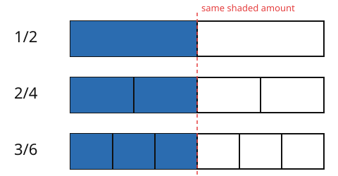

# Arithmetic & Number Sense · Lesson 2.1: Fractions

> ⏱ ~15 min · Module 2: Fractions, decimals, ratios & percents · Builds on: 1.3 (factors, primes & divisibility) · Unlocks: 2.2 (decimals & conversions)

## Why this matters

Fractions are the first place arithmetic stops being about counting and starts being about *proportion* — parts of a whole, rates, ratios, probabilities. Every equation you'll manipulate in `algebra-foundations` is fractions with letters in them; every "per" quantity in physics (meters per second, moles per liter) is a fraction you have to combine and simplify. Getting fluent here means you never again freeze at $\frac{2}{3} \div \frac{4}{9}$ — you'll see the answer as inevitable, not a rule you half-remember.

## The idea

A fraction $\frac{a}{b}$ answers one question: **cut a whole into $b$ equal pieces, then take $a$ of them.** The bottom number (the **denominator**) names the piece size; the top number (the **numerator**) counts how many pieces you have. That's it — $\frac{3}{4}$ is "pieces of size one-quarter, three of them."

Two consequences follow immediately, and they're the whole lesson:

- **Same amount, different names.** Cutting into twice as many pieces and taking twice as many leaves the amount unchanged: $\frac{1}{2}$, $\frac{2}{4}$, $\frac{3}{6}$ all mark the same spot. These are *equivalent fractions*.
- **You can only add pieces of the same size.** Two quarters plus one quarter is three quarters — easy, because the pieces match. One-half plus one-third is *not* "two-fifths," because you're trying to add pieces of different sizes. First you have to recut both into a common piece size.

Hold those two ideas and every fraction rule below is just bookkeeping.

## The formal version

For integers $a, b, c, d$ with $b, d \neq 0$:

**Equivalent fractions.** For any nonzero integer $k$,
$$\frac{a}{b} = \frac{a k}{b k}.$$
In words: multiplying (or dividing) top and bottom by the *same* number doesn't change the value — it just renames the piece size.

**Lowest terms.** Divide top and bottom by their greatest common divisor $g = \gcd(a,b)$:
$$\frac{a}{b} = \frac{a/g}{\,b/g\,}, \qquad \text{and } \gcd(a/g,\, b/g) = 1.$$
In words: strip out every shared factor and the fraction is *reduced* — no smaller name exists. ($\gcd$ is exactly the tool from Lesson 1.3.)

**Addition and subtraction** need a common denominator, cheapest is the least common multiple $m = \operatorname{lcm}(b,d)$:
$$\frac{a}{b} \pm \frac{c}{d} = \frac{a\,(m/b) \pm c\,(m/d)}{m}.$$
In words: recut both fractions into pieces of size $\frac{1}{m}$, then add or subtract the counts. (The safe fallback $\frac{a}{b}\pm\frac{c}{d}=\frac{ad\pm bc}{bd}$ always works but often needs reducing afterward.)

**Multiplication** — no common denominator needed:
$$\frac{a}{b} \times \frac{c}{d} = \frac{ac}{bd}.$$
In words: "$\frac{a}{b}$ *of* $\frac{c}{d}$" — taking a fraction of a fraction multiplies both the piece counts and the piece sizes.

**Division** is multiplication by the reciprocal:
$$\frac{a}{b} \div \frac{c}{d} = \frac{a}{b} \times \frac{d}{c} = \frac{ad}{bc}.$$
In words: dividing by $\frac{c}{d}$ asks "how many $\frac{c}{d}$-sized chunks fit?" — flip and multiply.

## Picture

Three bars, same length, cut into 2, 4, and 6 pieces. Shade $\frac{1}{2}$, $\frac{2}{4}$, $\frac{3}{6}$ — the shaded region lands at exactly the same place every time. Different names, identical amount.

## Worked examples

**Example 1 (mechanical — reduce, then multiply).** Compute $\frac{14}{21} \times \frac{3}{4}$.

First reduce $\frac{14}{21}$. From Lesson 1.3, $14 = 2\cdot 7$ and $21 = 3\cdot 7$, so $\gcd(14,21)=7$:
$$\frac{14}{21} = \frac{14/7}{21/7} = \frac{2}{3}.$$
Now multiply straight across, cancelling the shared factor of $3$ before you finish:
$$\frac{2}{3} \times \frac{3}{4} = \frac{2 \cdot 3}{3 \cdot 4} = \frac{6}{12} = \frac{1}{2}.$$
Reducing *first* keeps the numbers small — the single most useful habit in fraction arithmetic.

**Example 2 (why you'd care — a common denominator via the LCM).** A recipe needs $\frac{5}{6}$ cup of flour for the dough and $\frac{3}{8}$ cup for dusting. Total flour?

The piece sizes ($\frac{1}{6}$ and $\frac{1}{8}$) don't match, so recut both to a common size. From Lesson 1.3, $6 = 2\cdot 3$ and $8 = 2^3$, so $\operatorname{lcm}(6,8) = 2^3 \cdot 3 = 24$:
$$\frac{5}{6} = \frac{5 \cdot 4}{24} = \frac{20}{24}, \qquad \frac{3}{8} = \frac{3 \cdot 3}{24} = \frac{9}{24}.$$
Now the pieces match, so add the counts:
$$\frac{20}{24} + \frac{9}{24} = \frac{29}{24} = 1\tfrac{5}{24} \text{ cups}.$$
Notice $29$ and $24$ share no factor, so it's already in lowest terms. Just over one cup — a number you can now measure, which "add these two fractions" alone didn't give you.

## Watch out

- **You might think** you add fractions straight across — $\frac{1}{2}+\frac{1}{3}=\frac{2}{5}$. **Actually** that adds mismatched pieces; you must find a common denominator first: $\frac{3}{6}+\frac{2}{6}=\frac{5}{6}$. (Straight-across is for *multiplication*, not addition.)
- **You might think** invert-and-multiply is an arbitrary rule. **Actually** it's forced: $\frac{a}{b}\div\frac{c}{d}$ is the number $x$ with $x\cdot\frac{c}{d}=\frac{a}{b}$. Multiply both sides by $\frac{d}{c}$ and the $\frac{c}{d}\cdot\frac{d}{c}=1$ collapses, leaving $x=\frac{a}{b}\cdot\frac{d}{c}$. Flipping *undoes* the multiplication.
- **You might think** you can cancel across a sum, like $\frac{2+3}{2}=\frac{\cancel{2}+3}{\cancel{2}}=3$. **Actually** cancelling only works on *factors* of the whole top and bottom, never on one term of a sum. $\frac{2+3}{2}=\frac{5}{2}$, full stop.

## One-liner

> The denominator names the piece size and the numerator counts the pieces — so you may add only when the sizes match, and dividing just flips the divisor.

## Problems

**P1 (🟢)** Reduce $\frac{18}{24}$ to lowest terms, then compute $\frac{18}{24} \times \frac{4}{9}$.

**P2 (🟡)** Compute $\frac{5}{6} - \frac{3}{8}$, giving the answer in lowest terms. (Use the LCM of the denominators.)

**P3 (🔴, optional)** A pipe delivers water at $\frac{3}{4}$ liter every minute. How many $\frac{1}{8}$-liter cups can it fill in one minute? Set this up as a fraction division, compute it, and say in one sentence why the answer is a whole number bigger than $\frac{3}{4}$.

Solutions

**P1** $\gcd(18,24)$: $18 = 2\cdot 3^2$, $24 = 2^3\cdot 3$, shared part $2\cdot 3 = 6$. So $\frac{18}{24}=\frac{18/6}{24/6}=\frac{3}{4}$. Then
$$\frac{3}{4}\times\frac{4}{9} = \frac{3\cdot 4}{4\cdot 9} = \frac{12}{36} = \frac{1}{3}.$$
(Faster: cancel the $4$ and reduce $\frac{3}{9}=\frac{1}{3}$ before multiplying.)

**P2** $\operatorname{lcm}(6,8)=24$ (from $6=2\cdot3$, $8=2^3$). Recut: $\frac{5}{6}=\frac{20}{24}$, $\frac{3}{8}=\frac{9}{24}$. Subtract the counts:
$$\frac{20}{24}-\frac{9}{24}=\frac{11}{24}.$$
$11$ is prime and doesn't divide $24$, so $\frac{11}{24}$ is already reduced.

**P3** "How many $\frac{1}{8}$-chunks fit in $\frac{3}{4}$?" is $\frac{3}{4}\div\frac{1}{8}$. Flip and multiply:
$$\frac{3}{4}\times\frac{8}{1}=\frac{24}{4}=6.$$
Six cups. It's bigger than $\frac{3}{4}$ because you're counting how many *tiny* $\frac{1}{8}$-liter pieces fit inside $\frac{3}{4}$ of a liter — dividing by a number less than $1$ always increases the count.

## Flashback

**From Lesson 1.3 (Factors, primes & divisibility):** Find the prime factorizations of $12$ and $18$, then use them to read off $\gcd(12,18)$ and $\operatorname{lcm}(12,18)$.

Solution

$12 = 2^2 \cdot 3$ and $18 = 2 \cdot 3^2$.

- **GCD** = the shared factors at their *lowest* powers: $2^1 \cdot 3^1 = 6$.
- **LCM** = every factor at its *highest* power: $2^2 \cdot 3^2 = 36$.

Check: $\gcd \times \operatorname{lcm} = 6 \times 36 = 216 = 12 \times 18$. ✓ (This is exactly the $\gcd$ you'd use to reduce $\frac{12}{18}=\frac{2}{3}$.)

## Connections

- **Backward:** reducing, common denominators, and cancelling all *run on* prime factorization, GCD, and LCM from [Lesson 1.3](01-03-factors-primes-divisibility.md) — fractions are that lesson's payoff.
- **Forward:** a fraction is a division waiting to happen ($\frac{3}{4}=3\div4$), so carrying out that division gives a decimal — the bridge into [Lesson 2.2](02-02-decimals-and-conversions.md), where $\frac{1}{8}=0.125$ and repeating decimals appear.
- **Sideways (algebra):** rational expressions like $\frac{x+1}{x^2-1}$ in `algebra-foundations` obey these *exact* rules — reduce by cancelling common factors, add over a common denominator, divide by flipping. Nothing new; just letters where the numbers were.
- **Sideways (science):** a ratio like blue-to-white paint $3:5$ (Boss problem 2) is a fraction of the whole, $\frac{3}{8}$; and every rate in physics — $\frac{\text{meters}}{\text{second}}$, $\frac{\text{moles}}{\text{liter}}$ in chemistry — is a fraction you scale and combine with these same moves.
