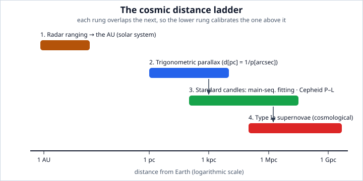

# Astrophysics · Lesson 1.1: Scales, luminosity, flux, and the distance ladder

> ⏱ ~15 min · Module 1: Radiation, matter, and measurement · Builds on: [`mechanics-refresher`](#/course/mechanics-refresher), [`em-refresher`](#/course/em-refresher), [`stat-mech`](#/course/stat-mech), [`relativity`](#/course/relativity), [`quantum-mechanics`](#/course/quantum-mechanics) · Unlocks: 1.2 Blackbody radiation, spectra, and the HR diagram

## Why this matters

Every number in astrophysics is inferred, not measured directly — you cannot put a star on a scale or a ruler to a galaxy. Almost all of it is reconstructed from one thing: **light arriving at a detector**. So before any physics, you need two skills. First, a feel for the *scales* — the powers of ten separating a planet from the observable universe — so that "off by a factor of 3" and "off by a factor of $10^9$" feel different in your gut. Second, the two quantities that turn a measured brightness into a physical distance: **luminosity** (what a source emits) and **flux** (what you receive). Get those, and the whole cosmic distance ladder — the bootstrapped chain that measures everything from the AU to the edge of the visible universe — falls out of one geometric fact.

## The idea

Hold a 100-watt bulb at arm's length: bright. Walk it to the far end of a field: faint. The bulb didn't change — its **intrinsic power** is fixed. What changed is how much of that power lands in your eye, because the same energy is now smeared over a much bigger sphere. That is the entire game. The intrinsic power is the **luminosity** $L$; the received power per unit area is the **flux** $F$; and they're linked by the surface area of a sphere, which grows as distance squared.

This gives astronomy its central trick and its central frustration in one sentence: **a faint source can be a dim bulb nearby or a searchlight far away**, and flux alone can't tell them apart. Break the degeneracy — know $L$ independently, from *some* physics — and flux immediately gives distance. A source whose luminosity you know from its physics is a **standard candle**, and finding better candles is most of what the distance ladder does.

Before any of that, calibrate your intuition for the numbers. Astronomy spans an absurd range, and the units exist to keep it human-sized:

| Thing | Size / distance | In meters |
|---|---|---|
| Earth radius | — | $6.4\times10^{6}$ |
| Earth–Sun (1 AU) | $1$ AU | $1.496\times10^{11}$ |
| 1 light-year | $0.307$ pc | $9.46\times10^{15}$ |
| 1 parsec (pc) | $3.26$ ly | $3.086\times10^{16}$ |
| Nearest star (Proxima) | $1.3$ pc | $4.0\times10^{16}$ |
| Milky Way diameter | $\sim30$ kpc | $9\times10^{20}$ |
| Andromeda galaxy | $0.78$ Mpc | $2.4\times10^{22}$ |
| Observable universe (radius) | $\sim14$ Gpc | $4\times10^{26}$ |

And the Sun sets the natural units for stars: mass $M_\odot = 1.99\times10^{30}$ kg, radius $R_\odot = 6.96\times10^{8}$ m, luminosity $L_\odot = 3.83\times10^{26}$ W. Quoting a star as "$0.5\,M_\odot$, $10\,L_\odot$" is worth a paragraph of SI digits — it says *how it compares to the one star we understand best*.

## The formal version

**The inverse-square law.** A source of luminosity $L$ (watts) radiates isotropically. At distance $d$, that power is spread over a sphere of area $4\pi d^2$, so the flux is

$$F = \frac{L}{4\pi d^2}.$$

In words: brightness falls off as one over distance squared, because the light spreads over a sphere whose area grows as distance squared. (This is exactly the geometric dilution of any conserved outward flux — the same $1/r^2$ that governs the Poynting flux of a radiating source in [`em-refresher` 4.3](#/lesson/em-refresher/04-03-energy-poynting.md).) Invert it and one measured flux plus one known luminosity gives the distance: $d = \sqrt{L/4\pi F}$.

**The magnitude system.** Astronomers report brightness on a backwards, logarithmic scale inherited from the Greeks. The **apparent magnitude** $m$ compares fluxes; for two sources,

$$m_1 - m_2 = -2.5\,\log_{10}\!\frac{F_1}{F_2}.$$

In words: every 5 magnitudes is exactly a factor of 100 in flux, and *brighter means a smaller (more negative) number*. This is the Pogson relation; the factor $2.5$ is chosen so that $10^{5/2.5}=100$. (One magnitude is thus a flux ratio of $100^{1/5}\approx2.512$.) The Sun sits at $m_\odot=-26.7$, the faintest naked-eye stars at $m\approx+6$.

The **absolute magnitude** $M$ is defined as the apparent magnitude the source *would* have at a fixed reference distance of $10$ pc — a bookkeeping trick that strips out distance so $M$ measures intrinsic luminosity alone. Since flux scales as $1/d^2$, comparing the object's real flux to its flux-at-10-pc gives the **distance modulus**:

$$m - M = 5\,\log_{10}\!\left(\frac{d}{10\ \text{pc}}\right).$$

In words: the gap between how bright a thing looks and how bright it really is *is* its distance. If you know any two of $\{m, M, d\}$ you have the third. Standard candles supply $M$; you measure $m$; out drops $d$.

**Parallax and the parsec.** The one geometric, assumption-free distance. As Earth orbits, a nearby star appears to shift against the far background by an angle $p$ (the **parallax**), measured as the star's apparent displacement over a baseline of $1$ AU (the orbital radius). For small angles $p\,[\text{rad}] = (1\ \text{AU})/d$. The **parsec** is defined as the distance at which $1$ AU subtends $1$ arcsecond, which collapses the relation to

$$d\,[\text{pc}] = \frac{1}{p\,[\text{arcsec}]}.$$

In words: a star one parsec away wobbles by one arcsecond; twice as far, half the wobble. That is why the parsec exists — it makes the formula a reciprocal. (Check: $1\ \text{arcsec}=4.848\times10^{-6}$ rad, so $1\ \text{pc}=1\ \text{AU}/4.848\times10^{-6}=3.086\times10^{16}$ m. ✓)

## Picture

The ladder is *bootstrapped*: no single method spans the whole range, but each rung overlaps the next, and in that overlap the lower, better-trusted rung **calibrates** the higher one. (1) Radar timing fixes the AU. (2) Parallax uses the AU as a baseline to reach nearby stars. (3) Those parallax stars calibrate the intrinsic brightness of **standard candles** — main-sequence stars (fit a cluster's stars to the known main sequence) and **Cepheid variables**, pulsating stars whose pulsation period tracks their luminosity (the period–luminosity relation) — which reach into other galaxies. (4) Cepheids in nearby galaxies calibrate **Type Ia supernovae**, whose near-uniform peak luminosity is bright enough to be seen across the cosmos. Kick out a low rung and everything above it slides.

## Worked examples

**Example 1 (mechanical — flux from luminosity).** How much fainter is the Sun's twin at $10$ pc than the Sun itself? The Sun is at $1\ \text{AU}=1.496\times10^{11}$ m; the twin at $10\ \text{pc}=3.086\times10^{17}$ m. Same $L$, so flux ratio is the inverse-square of the distance ratio:

$$\frac{F_\text{twin}}{F_\odot}=\left(\frac{1\ \text{AU}}{10\ \text{pc}}\right)^{2}=\left(\frac{1.496\times10^{11}}{3.086\times10^{17}}\right)^{2}=(4.85\times10^{-7})^2=2.35\times10^{-13}.$$

In magnitudes: $\Delta m = -2.5\log_{10}(2.35\times10^{-13})=+31.6$. The Sun at $10$ pc would sit at $m=-26.7+31.6\approx+4.9$ — right at the naked-eye limit. That number *is* the Sun's absolute magnitude, $M_\odot\approx+4.8$: exactly what "the apparent magnitude it would have at 10 pc" means.

**Example 2 (why you'd care — weighing distance against brightness).** You see two stars at identical apparent magnitude $m=8$. Star A is a parallax star at $p=0.02''$, so $d_A = 1/0.02 = 50$ pc. Star B is a Cepheid whose period pins its absolute magnitude at $M_B=-3$. Which is more luminous? For A, the distance modulus gives $M_A = m - 5\log_{10}(50/10) = 8 - 5\log_{10}5 = 8 - 3.49 = +4.5$ — a Sun-like star. For B, we already have $M_B=-3$, so $m-M = 11 = 5\log_{10}(d_B/10)$, giving $d_B=10\cdot10^{2.2}=1585$ pc. Same apparent brightness, but B is $\sim30\times$ farther and, from $\Delta M = 7.5$ mag, about $10^{7.5/2.5}=10^{3}=1000\times$ more luminous. This is the flux degeneracy in action, broken two different ways: geometry for A, stellar physics for B.

## Watch out

- You might think bigger magnitude means brighter — it's the reverse. The scale runs *backwards*: Sun $-26.7$, Vega $\approx0$, naked-eye limit $\approx+6$, Hubble's faintest $\approx+30$. And it's logarithmic, so magnitude *differences* multiply fluxes, they don't add them.
- You might think $d\,[\text{pc}]=1/p$ works in any units — it doesn't. The reciprocal is a coincidence of arcseconds and parsecs (that's why the parsec was *defined* to make it true). Feed it radians or milliarcseconds and you'll be off by huge factors. Also: the baseline is the orbital *radius* ($1$ AU), not the diameter — $p$ is the semi-amplitude of the annual wobble, not its full swing.
- You might think a "standard candle" is exactly standard. It isn't — Cepheids need a metallicity correction, Type Ia peak luminosity is standard*ized* (from light-curve shape), not identical. Every rung carries its calibration error *upward*, so the whole ladder's uncertainty compounds. This is precisely why the ladder-based Hubble constant is fought over.

## One-liner

> Flux is luminosity diluted by $4\pi d^2$; know the luminosity and brightness becomes a ruler — which is the whole trick behind every rung of the distance ladder.

## Problems

**P1 (🟢)** A star has parallax $p = 0.1''$ and apparent magnitude $m = 5$. Find its distance and its absolute magnitude $M$.

**P2 (🟡)** The Sun has luminosity $L_\odot = 3.83\times10^{26}$ W and delivers a flux (the solar constant) $F_\odot = 1.36\times10^{3}\ \text{W/m}^2$ at Earth ($1\ \text{AU}=1.496\times10^{11}$ m). A star at distance $10$ pc ($=3.086\times10^{17}$ m) is measured to have flux $F = 3.2\times10^{-9}\ \text{W/m}^2$. Find the star's luminosity in solar units. (Try it using the Sun as a calibrated reference — a ratio, no unit conversions.)

**P3 (🔴, optional)** A Cepheid's measured period fixes its absolute magnitude at $M = -4$. It is observed in a distant galaxy at apparent magnitude $m = 24$. Find its distance in Mpc, and say which rung of the ladder this measurement represents and what it calibrates.

Solutions

**P1** Distance from parallax: $d = 1/p = 1/0.1 = 10$ pc. Then the distance modulus:

$$m - M = 5\log_{10}\!\left(\frac{d}{10\ \text{pc}}\right) = 5\log_{10}(1) = 0 \implies M = m = 5.$$

The star sits exactly at the $10$-pc reference distance, so its apparent and absolute magnitudes coincide by definition. (It's a near-Sun-like star: $M\approx5$ is close to $M_\odot\approx4.8$.)

**P2** Use the Sun as the calibrated candle. Both luminosities relate to their fluxes by $L = 4\pi d^2 F$, so the ratio kills the $4\pi$:

$$\frac{L}{L_\odot} = \frac{F}{F_\odot}\left(\frac{d}{d_\odot}\right)^2.$$

Flux ratio: $F/F_\odot = 3.2\times10^{-9}/1.36\times10^{3} = 2.35\times10^{-12}$. Distance ratio: $d/d_\odot = 3.086\times10^{17}/1.496\times10^{11} = 2.063\times10^{6}$, squared $= 4.26\times10^{12}$. Multiply:

$$\frac{L}{L_\odot} = (2.35\times10^{-12})(4.26\times10^{12}) \approx 10.0.$$

So $L \approx 10\,L_\odot$. Direct check: $L = 4\pi d^2 F = 4\pi(3.086\times10^{17})^2(3.2\times10^{-9}) = 3.83\times10^{27}$ W $= 10.0\,L_\odot$. ✓ The ratio method is the whole spirit of the ladder — measure everything against a known standard.

**P3** Distance modulus with $M=-4$, $m=24$:

$$m - M = 24 - (-4) = 28 = 5\log_{10}\!\left(\frac{d}{10\ \text{pc}}\right) \implies \log_{10}\!\left(\frac{d}{10\ \text{pc}}\right) = 5.6.$$

So $d/10\ \text{pc} = 10^{5.6} = 3.98\times10^{5}$, giving $d = 3.98\times10^{6}$ pc $= 3.98$ Mpc $\approx 4$ Mpc.

This is the **Cepheid rung** (standard candle, third rung): the period–luminosity relation supplies $M$, and at a few Mpc the Cepheid lives in a galaxy well beyond the Local Group — far past where parallax can reach. Its job is to *bridge the gap*: parallax-calibrated Cepheids in the Milky Way fix the P–L relation, which then measures galaxy distances, and Cepheids in galaxies that also host Type Ia supernovae calibrate those supernovae — the next rung out to cosmological scales. (Note the compounding: a Cepheid at $\sim24$th magnitude is faint and hard, which is exactly why the ladder's higher rungs dominate the error budget.)

## Connections

- **Backward:** the $1/d^2$ dilution is the same geometric spreading of radiated energy as the Poynting flux in [`em-refresher` 4.3](#/lesson/em-refresher/04-03-energy-poynting.md) and the plane/spherical waves of [`em-refresher` 4.2](#/lesson/em-refresher/04-02-electromagnetic-waves.md); parallax is elementary small-angle trigonometry with Earth's orbit (from [`mechanics-refresher`](#/course/mechanics-refresher)) as the baseline.
- **Forward:** [1.2 Blackbody radiation and the HR diagram](#/lesson/astrophysics/01-02-blackbody-spectra-hr-diagram.md) supplies a *physical* luminosity — $L = 4\pi R^2 \sigma T^4$ — turning a star's temperature and size into an absolute magnitude, i.e. a standard candle from first principles. The top rung, Type Ia supernovae, returns as the tool that discovered cosmic acceleration in [6.5 Dark energy](#/lesson/astrophysics/06-05-dark-energy-acceleration.md), where the same distance modulus reads off the expansion history via the Hubble law (see the [`relativity`](#/course/relativity) FLRW framework).
- **Sideways:** the magnitude scale is a logarithmic ratio scale exactly like decibels and the Richter scale — and the *bootstrapped calibration chain* here (each rung anchoring the next) is the same epistemic structure as any measurement standard that can't be read directly, from carbon dating to a thermometer's fixed points.
