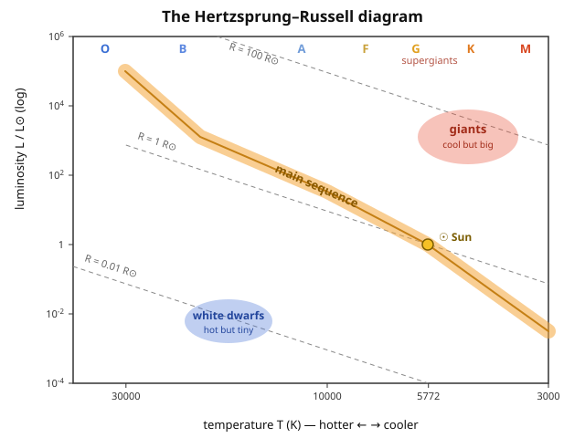

# Astrophysics · Lesson 1.2: Blackbody radiation, spectra, and the HR diagram

> ⏱ ~15 min · Module 1: Radiation, matter, and measurement · Builds on: [1.1 Scales, luminosity, and the distance ladder](#/lesson/astrophysics/01-01-scales-luminosity-distance-ladder.md), [stat-mech 4.3 Photon gas & blackbody](#/lesson/stat-mech/04-03-photon-gas-blackbody.md) · Unlocks: 1.3 Radiative transfer and spectral lines

## Why this matters

A star is a glowing ball of gas trillions of kilometers away. You will never touch one, weigh one, or drop a thermometer into it — yet you can state its temperature, its radius, and its life story from a single smear of its light. The trick is that a star radiates almost exactly like a **blackbody**, so its color encodes its temperature and its brightness-plus-color encodes its size. Lesson 1.1 gave you luminosity $L$ (total power, in watts) as an intrinsic property once you know the distance. This lesson turns light into two more numbers — temperature and radius — using just two equations, and then organizes every star in the sky onto one chart: the Hertzsprung–Russell diagram, the periodic table of stars.

## The idea

Heat anything until it glows and its color tells you how hot it is: a stove element goes dull red, hotter still it's orange, a welding arc is blue-white. That's not a metaphor — it's a law. A dense, opaque object in thermal equilibrium emits the **Planck spectrum**, a fixed curve whose shape depends on *temperature alone*. Hotter means the whole curve shifts toward shorter (bluer) wavelengths and rises everywhere. So **color reads temperature**, no contact required.

Two consequences do almost all the work in this lesson:

1. **The peak color tells you $T$.** Find where the spectrum is brightest — that wavelength times the temperature is a universal constant (Wien). Red star, cool; blue star, hot.
2. **Brightness per unit area tells you $T$, so total brightness tells you $T$ *and* size.** Every square meter of a hotter surface radiates far more power (it goes as $T^4$). If two stars have the same temperature but one is 100 times more luminous, it must have 100 times more radiating area — it's bigger. That single deduction — **cool but luminous ⇒ enormous** — is how we know red giants are giant.

You don't re-derive the Planck curve here; you *use* it. Its quantum origin — why classical physics predicted infinite ultraviolet glow and Planck's energy quanta $\hbar\omega$ fixed it — is the [stat-mech photon-gas lesson](#/lesson/stat-mech/04-03-photon-gas-blackbody.md) and the opening of [QM 1.1](#/lesson/quantum-mechanics/01-01-why-quantum.md). We take the curve as given and mine it for stellar physics.

## The formal version

A **blackbody** is a perfect absorber and hence a perfect thermal emitter. Its spectrum (from the [photon gas](#/lesson/stat-mech/04-03-photon-gas-blackbody.md)) depends only on $T$. Three facts about that curve carry the lesson.

**Wien's displacement law.** The wavelength at which the spectrum peaks obeys
$$\boxed{\;\lambda_{\text{peak}}\,T = b, \qquad b = 2.9\times10^{-3}\ \text{m·K}.\;}$$
In words: hotter bodies peak at shorter wavelengths — the peak *slides* bluewards as $1/T$. Measure the peak color, get the temperature for free. (This is the [Wien law you saw in stat-mech](#/lesson/stat-mech/04-03-photon-gas-blackbody.md), $\omega_{\max}\propto T$, rewritten in wavelength.)

**Stefan–Boltzmann law.** Integrate the Planck curve over all wavelengths and the total power radiated per unit surface area (the **flux**, W/m²) is
$$F = \sigma T^4, \qquad \sigma = 5.67\times10^{-8}\ \frac{\text{W}}{\text{m}^2\,\text{K}^4}.$$
In words: a surface's radiated power density grows as the *fourth power* of temperature — double $T$ and each square meter shines $16\times$ brighter. Multiply by the star's surface area $4\pi R^2$ to get its total luminosity:
$$\boxed{\;L = 4\pi R^2\,\sigma T^4.\;}$$
In words: **luminosity = area × (flux per area)**. This is the single most useful equation in stellar astrophysics — it ties together the three headline numbers of any star, $L$, $R$, and $T$. Know any two, get the third.

**Effective temperature.** Real stars aren't perfect blackbodies and have no single temperature (it rises inward). So we *define* the **effective temperature** $T_{\text{eff}}$ as the temperature the Stefan–Boltzmann law demands:
$$L \equiv 4\pi R^2 \sigma T_{\text{eff}}^4.$$
In words: $T_{\text{eff}}$ is the temperature of the blackbody that would radiate the star's actual luminosity from the star's actual radius — the honest single number for "how hot is its surface." From here on, $T$ means $T_{\text{eff}}$.

**Spectral classes.** Sorting stars by surface temperature (originally by their absorption-line patterns, lesson 1.3) gives the sequence, hot to cool:
$$\underbrace{\text{O}}_{\gtrsim 30{,}000\,\text{K}}\;\text{B}\;\text{A}\;\underbrace{\text{F}\;\text{G}}_{\text{Sun} \approx 5772\,\text{K}}\;\text{K}\;\underbrace{\text{M}}_{\sim 3000\,\text{K}}$$
In words: **O**h **B**e **A** **F**ine **G**irl/**G**uy, **K**iss **M**e — O stars are blue and blazing, M stars are red and cool; the Sun is a middling G. Each class spans a factor in temperature and thus (by Wien) a color and (by Stefan–Boltzmann) a per-area brightness.

**The Hertzsprung–Russell diagram.** Plot every star as luminosity $L$ (vertical, log scale) against temperature $T$ (horizontal, log scale, and — by historical convention — **increasing to the left**). Stars do not scatter randomly; they cluster:

- a diagonal band from hot-luminous (upper left) to cool-dim (lower right): the **main sequence**, where hydrogen-burning stars spend ~90% of their lives;
- **giants** in the upper right (cool yet luminous ⇒ large $R$);
- **white dwarfs** in the lower left (hot yet dim ⇒ tiny $R$).

Because $L = 4\pi R^2\sigma T^4$, a line of *constant radius* is $L \propto T^4$ at fixed $R$ — a straight diagonal on the log–log plot. So position on the diagram is a direct readout of radius: parallel diagonals sweeping from lower-left to upper-right are stars of ever-larger size.

## Picture

The dashed lines are constant-radius tracks. Read the diagram as a map: **up** = more luminous, **left** = hotter, and moving **perpendicular to the dashed lines** = bigger star. The Sun sits at $(5772\,\text{K},\,1\,L_\odot)$ on the main sequence, exactly on the $R = 1\,R_\odot$ line by construction.

## Worked examples

**Example 1 (mechanical — read $T$ from color).** The Sun's spectrum peaks in the visible. Where? Wien gives
$$\lambda_{\text{peak}} = \frac{b}{T} = \frac{2.9\times10^{-3}}{5772} = 5.02\times10^{-7}\ \text{m} = 502\ \text{nm}.$$
That's green-yellow — right in the middle of the visible band, which is no accident: our eyes evolved under exactly this star. Conversely, spot a star peaking at $290$ nm (ultraviolet) and you read off $T = b/\lambda_{\text{peak}} = 2.9\times10^{-3}/2.9\times10^{-7} = 10{,}000$ K without any other information.

**Example 2 (why you'd care — size a red giant).** Betelgeuse has $T \approx 3500$ K (cool, class M) yet $L \approx 10^{5}\,L_\odot$ (blazing). How big is it? Take the ratio of Stefan–Boltzmann for the star and for the Sun — the constants $4\pi\sigma$ cancel:
$$\frac{L}{L_\odot} = \left(\frac{R}{R_\odot}\right)^2\left(\frac{T}{T_\odot}\right)^4 \;\Longrightarrow\; \frac{R}{R_\odot} = \left(\frac{L}{L_\odot}\right)^{1/2}\left(\frac{T_\odot}{T}\right)^{2}.$$
$$\frac{R}{R_\odot} = (10^{5})^{1/2}\left(\frac{5772}{3500}\right)^{2} = 316 \times (1.649)^2 = 316 \times 2.72 \approx 860.$$
Betelgeuse is roughly **900 times the Sun's radius** — drop it where the Sun is and it swallows the orbit of Mars. It's cool per square meter, but it has so *many* square meters that it outshines the Sun a hundred-thousand-fold. That's the upper-right corner of the HR diagram made concrete: **cool + luminous = huge**.

## Watch out

- **You might think a red star is hotter because "red-hot" sounds extreme — actually red is the *cool* end.** Blue-white O stars ($30{,}000$ K) are the furnaces; red M stars ($3000$ K) are the embers. "Red-hot" is just the coolest glow the human eye can catch; hotter goes white then blue.
- **You might think a more luminous star is bigger — not necessarily.** Luminosity mixes size *and* temperature: $L = 4\pi R^2\sigma T^4$. A white dwarf can be hotter than the Sun yet a thousand times dimmer because it's Earth-sized. You need *both* $L$ and $T$ to pin down $R$ — which is exactly why the HR diagram is two-dimensional.
- **You might think the HR diagram's $x$-axis increases to the right like every other plot — it doesn't.** Temperature increases *leftward*, a historical convention (it originally ran by spectral class O→M). Hot is left, cool is right. Misread it and every star lands in the wrong place.
- **The peak wavelength is not "the star's color" in the everyday sense.** The eye integrates the whole spectrum; a star peaking in the UV still looks blue-white, not invisible, because its visible tail is enormous. Wien locates the peak, not the perceived hue.

## One-liner

> A star's color gives its temperature (Wien) and its color-plus-brightness gives its size (Stefan–Boltzmann, $L = 4\pi R^2\sigma T^4$) — plot the two and every star falls onto the main sequence, the giants, or the white dwarfs.

## Problems

**P1 (🟢)** A star has effective temperature $T = 10{,}000$ K. Find the peak wavelength of its blackbody spectrum, and say what color/spectral class that suggests. (Use $b = 2.9\times10^{-3}$ m·K.)

**P2 (🟡)** A star has exactly the Sun's temperature ($T = T_\odot$) but $100\times$ the Sun's luminosity. Find its radius in solar radii, and say where it sits on the HR diagram relative to the Sun.

**P3 (🔴, optional)** Two stars have the *same* luminosity, but temperatures $T_1 = 3000$ K and $T_2 = 30{,}000$ K. Find the ratio of their radii $R_1/R_2$, and explain in one sentence why the cool star must be a giant while the hot one is compact.

Solutions

**P1** Wien's law:
$$\lambda_{\text{peak}} = \frac{b}{T} = \frac{2.9\times10^{-3}\ \text{m·K}}{10{,}000\ \text{K}} = 2.9\times10^{-7}\ \text{m} = 290\ \text{nm}.$$
The peak is in the **ultraviolet**, just short of visible. A star this hot appears **blue-white**; $10{,}000$ K is a class **A** star (Sirius and Vega are near this temperature). Its visible light is dominated by the short-wavelength (blue) end of the spectrum.

**P2** Same temperature, so in $L = 4\pi R^2\sigma T^4$ the $T^4$ factor is identical for both star and Sun. Taking the ratio:
$$\frac{L}{L_\odot} = \left(\frac{R}{R_\odot}\right)^2 \quad\Longrightarrow\quad \frac{R}{R_\odot} = \sqrt{\frac{L}{L_\odot}} = \sqrt{100} = 10.$$
The star has **radius $10\,R_\odot$**. On the HR diagram it sits at the *same horizontal position* as the Sun (same $T$, class G) but **two decades higher** in luminosity — up in the **giant/subgiant** region, above the main sequence. Same color as the Sun, a hundred times brighter, ten times wider: a giant.

**P3** Same $L$ means $4\pi R_1^2\sigma T_1^4 = 4\pi R_2^2\sigma T_2^4$, so $R_1^2 T_1^4 = R_2^2 T_2^4$, giving
$$\frac{R_1}{R_2} = \left(\frac{T_2}{T_1}\right)^2 = \left(\frac{30{,}000}{3000}\right)^2 = 10^2 = 100.$$
The cool star is **100 times larger in radius** (so $\sim 10^4$ times larger in surface area). Each square meter of the $3000$ K star radiates $(T_1/T_2)^4 = 10^{-4}$ as much power as a square meter of the hot star, so to emit the *same* total luminosity it must compensate with $10^4$ times the area — an enormous, distended envelope. **A cool star that is nonetheless luminous has no choice but to be a giant**, while the hot star packs the same output into a tiny, blazing surface — the upper-right vs. lower-left split of the HR diagram, derived from one equation.

## Connections

- **Backward:** luminosity $L$ came from [1.1](#/lesson/astrophysics/01-01-scales-luminosity-distance-ladder.md) (measure flux, correct for distance via the inverse-square law); this lesson adds $T$ and $R$. The Planck curve itself, and *why* it exists, is the [stat-mech photon gas](#/lesson/stat-mech/04-03-photon-gas-blackbody.md) — Wien and Stefan–Boltzmann are its peak and its integral, born from Planck's quantum $\hbar\omega$ ([QM 1.1](#/lesson/quantum-mechanics/01-01-why-quantum.md)).
- **Forward:** the smooth blackbody is only the *continuum*. Superimposed dark absorption lines encode composition and motion — that's [1.3 Radiative transfer and spectral lines](#/lesson/astrophysics/01-03-radiative-transfer-spectral-lines.md), which explains how the spectral classes O–M arise from atomic physics. The main sequence gets its physical explanation (why mass sets $L$ and $T$) in [Module 2](#/lesson/astrophysics/02-05-main-sequence.md), and the giants and white dwarfs are the subjects of stellar evolution ([Module 3](#/lesson/astrophysics/03-02-post-main-sequence.md)) and compact objects ([Module 4](#/lesson/astrophysics/04-01-white-dwarfs-chandrasekhar.md)).
- **Sideways:** the exact same Planck blackbody, at $T = 2.7$ K, is the cosmic microwave background — the oldest light in the universe and the cleanest blackbody ever measured ([6.3 The CMB](#/lesson/astrophysics/06-03-cosmic-microwave-background.md)). Wien's law applied to it gives its millimeter-wave peak; Stefan–Boltzmann its energy density.
