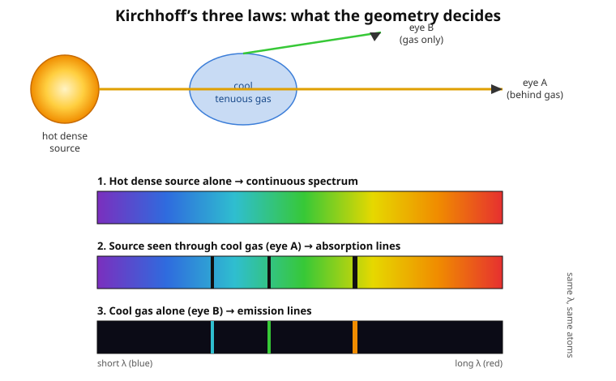

# Astrophysics · Lesson 1.3: Radiative transfer and spectral lines

> ⏱ ~15 min · Module 1: Radiation, matter, and measurement · Builds on: [1.1 Scales, luminosity, and the distance ladder](#/lesson/astrophysics/01-01-scales-luminosity-distance-ladder.md), [1.2 Blackbody spectra and the HR diagram](#/lesson/astrophysics/01-02-blackbody-spectra-hr-diagram.md) · Unlocks: energy transport and opacity in stellar interiors (Module 2), and every later use of spectra to weigh, date, and clock the universe

## Why this matters

In [1.2](#/lesson/astrophysics/01-02-blackbody-spectra-hr-diagram.md) a star's light gave up its temperature through the shape of its continuum. But the continuum is the *dull* part. Overlaid on it are hundreds of razor-thin dark lines, and each one is a fingerprint: it names an element, counts how much of it is present, reports the gas temperature, and — if the line sits at the wrong wavelength — tells you how fast the star is moving toward or away from you. Nearly everything astronomy claims to *know* about the composition and motion of things it can never touch is read off these lines. This lesson is the bridge from "light is a blackbody" to "light is a *message*." The machinery is radiative transfer: what happens to a beam as it fights its way out through matter.

## The idea

Picture light trying to cross a foggy room. The single number that decides its fate is **how many times it expects to get absorbed** on the way through — not the room's width in meters, but its width measured in *mean free paths*. That dimensionless count is the **optical depth** $\tau$.

- $\tau \ll 1$: the beam almost certainly makes it through untouched. The gas is **transparent** (optically thin) — you see straight through it to whatever is behind.
- $\tau \gg 1$: the beam is absorbed and re-emitted many times before escaping. The gas is **opaque** (optically thick) — you cannot see in past a skin one mean-free-path deep. Everything you learn comes from that skin.

A star is a ball of gas that is wildly opaque inside and transparent outside. Somewhere in between is the surface where $\tau \approx 1$ looking inward — the **photosphere**, the "last mean free path," the skin whose temperature *is* the temperature you measured in 1.2. We don't see the Sun's 15-million-kelvin core; we see the one layer where the fog thins out.

And the lines? A cool, thin gas sitting in front of a hot glowing source subtracts light at exactly the wavelengths its atoms can absorb — dark **absorption lines**. The *same* gas, glowing on its own against darkness, adds light at those same wavelengths — bright **emission lines**. Same atoms, opposite spectra; the geometry decides which. That is Kirchhoff's insight, and it falls out of one small equation.

## The formal version

**Optical depth.** As a beam of specific intensity $I$ (energy per area, time, solid angle, wavelength) crosses a slab of thickness $ds$, matter removes a fraction proportional to the path and the amount of stuff:

$$d\tau = \kappa \rho\, ds,$$

where $\rho$ is the mass density and $\kappa$ (the **opacity**, units $\mathrm{cm^2\,g^{-1}}$) is the absorbing cross-section per gram. *In words: $\tau$ counts absorptions — one gram-cross-section's worth of material at a time.* For pure absorption (no emission) the beam decays as

$$I = I_0\, e^{-\tau}, \qquad \tau = \int \kappa \rho\, ds.$$

*In words: the surviving fraction of light after optical depth $\tau$ is $e^{-\tau}$ — a factor $e$ dimmer per mean free path.*

**The radiative transfer equation.** Matter also *emits*. Let $S$ (the **source function**) be the ratio of emission to absorption — the intensity the material is trying to add. Balancing loss against gain, and measuring path in optical depth ($ds = d\tau/\kappa\rho$):

$$\boxed{\;\frac{dI}{d\tau} = -I + S\;}$$

*In words: at each step the beam relaxes away from its current value $I$ and toward the local source function $S$.* For a slab of constant $S$ with incoming intensity $I_0$, the solution is a clean blend:

$$I(\tau) = \underbrace{I_0\,e^{-\tau}}_{\text{background, dimmed}} + \underbrace{S\left(1 - e^{-\tau}\right)}_{\text{gas's own glow}}.$$

Read off the two limits:
- **Thin** ($\tau \ll 1$): $I \approx I_0 + \tau\,(S - I_0)$ — the background barely altered, nudged toward $S$.
- **Thick** ($\tau \gg 1$): $I \to S$ — the background is entirely forgotten; **you see the source function and nothing else.** This is why the photosphere ($\tau\approx 1$ inward) is what you observe.

**Kirchhoff's law (the payoff).** In thermodynamic equilibrium a good absorber must be an equally good emitter, or the gas and radiation could not sit at one temperature. That forces the source function to be the **Planck function** at the local temperature:

$$S = B_\lambda(T).$$

*In words: deep in equilibrium, matter glows as a blackbody — the same $B_\lambda(T)$ from [stat-mech's photon gas](#/lesson/stat-mech/04-03-photon-gas-blackbody.md).* This single identity, fed through $I(\tau)$, produces **Kirchhoff's three laws**:

1. A **hot dense source** ($\tau \gg 1$, so $I\to B_\lambda$) → a **continuous** spectrum.
2. That continuum seen **through cooler thin gas** → **absorption lines**: at a line wavelength $\kappa$ spikes, but the gas is cooler so its $S=B_\lambda(T_{\text{gas}})$ is *fainter* than the background $I_0$ — the blend $I=I_0e^{-\tau}+S(1-e^{-\tau})$ dips **below** the continuum.
3. The **thin gas alone** against darkness ($I_0 = 0$) → **emission lines**: only where $\kappa$ spikes does $S(1-e^{-\tau})$ add anything, so the spectrum is dark except for bright lines.

The lines sit where they do because $\kappa$ spikes at photon energies matching an atomic transition — pure quantum mechanics.

## Picture

The same cloud of the same atoms produces dark lines when backlit by a hotter source (eye A) and bright lines of *identical wavelength* when viewed alone against the dark (eye B). Nothing about the atoms changed — only whether there is a hotter continuum behind them.

## Worked examples

**Example 1 (mechanical — is it thick or thin?).** A patch of interstellar cloud has opacity $\kappa = 30\ \mathrm{cm^2\,g^{-1}}$, density $\rho = 2\times10^{-20}\ \mathrm{g\,cm^{-3}}$, and depth $L = 5\times10^{18}\ \mathrm{cm}$ (about 1.6 pc) along our line of sight. Optical depth is the product:

$$\tau = \kappa \rho L = (30)(2\times10^{-20})(5\times10^{18}) = 3.$$

Since $\tau = 3 > 1$, the cloud is **optically thick** — we cannot see cleanly through it. A background star behind it is dimmed to a fraction

$$e^{-\tau} = e^{-3} \approx 0.050,$$

i.e. only **5%** of its light survives (the rest is scattered/absorbed — this is interstellar extinction, why the Milky Way's band looks blotched with dark rifts).

**Example 2 (why you'd care — reading a velocity off a line).** In a lab, neutral hydrogen's H$\alpha$ line sits at $\lambda_0 = 656.3\ \mathrm{nm}$. In a galaxy's spectrum you find it at $\lambda = 662.0\ \mathrm{nm}$. The line is **redshifted** (longer wavelength), so the source recedes. For speeds $\ll c$ the nonrelativistic Doppler formula gives the radial velocity $v_r$:

$$\frac{\Delta\lambda}{\lambda_0} = \frac{v_r}{c}, \qquad \Delta\lambda = 662.0 - 656.3 = 5.7\ \mathrm{nm}.$$

$$v_r = c\,\frac{\Delta\lambda}{\lambda_0} = (3.00\times10^5\ \mathrm{km\,s^{-1}})\frac{5.7}{656.3} \approx 2.6\times10^{3}\ \mathrm{km\,s^{-1}}\ \text{(receding)}.$$

The atom itself is an unmovable standard; the *shift* of its known wavelength is the velocity. Do this for a whole galaxy and you get rotation; for many galaxies you get Hubble's law and the expanding universe.

## Watch out

- **You might think opacity's units are per centimeter.** But $\kappa$ here is per *gram* ($\mathrm{cm^2\,g^{-1}}$) — a cross-section per unit mass. It is $\kappa\rho$ (units $\mathrm{cm^{-1}}$) that is the absorption coefficient; only $\kappa\rho\,ds$ is dimensionless. Always pair $\kappa$ with a $\rho$.
- **You might think a hotter gas always makes brighter lines.** What makes an *absorption* line is that the gas is **cooler than the continuum behind it** ($S < I_0$). A cloud hotter than its backdrop would fill the line in or turn it into emission. Absorption is a temperature *contrast*, not an absolute.
- **Sign convention on $\tau$.** Some texts (including Carroll & Ostlie) measure $\tau$ *inward from the surface* and write $d\tau = -\kappa\rho\,ds$, which flips the transfer equation to $dI/d\tau = I - S$. Same physics, opposite bookkeeping — always check which end $\tau=0$ sits at before trusting a sign.
- **The Doppler formula uses *radial* velocity only.** Motion across your line of sight produces no first-order shift; $v_r$ is just the toward/away component. And $\Delta\lambda/\lambda_0 = v_r/c$ is the low-speed limit — near $c$ you need the relativistic version.

## One-liner

> Optical depth counts mean free paths; you see down to $\tau\approx1$, where the beam has forgotten its past and glows at the source function — and the lines carved into that glow name the atoms and clock their motion.

## Problems

**P1 (🟢)** A dusty clump has opacity $\kappa = 8\ \mathrm{cm^2\,g^{-1}}$, density $\rho = 5\times10^{-19}\ \mathrm{g\,cm^{-3}}$, and thickness $L = 1\times10^{18}\ \mathrm{cm}$ along the line of sight. Compute $\tau$, state whether the clump is optically thick or thin, and give the fraction of a background star's light that gets through.

**P2 (🟡)** A star's H$\alpha$ line, rest wavelength $656.3\ \mathrm{nm}$, is observed at $660.0\ \mathrm{nm}$. Find the radial velocity and say whether the star approaches or recedes. Is the nonrelativistic formula justified here?

**P3 (🔴, optional)** Hydrogen Balmer absorption lines (transitions *up* from the $n=2$ level) are **strongest in A-type stars** near $T\approx 10{,}000\ \mathrm{K}$, and weaker in both hotter (O/B) and cooler (K/M) stars — even though hydrogen is the dominant element throughout. Using the Saha and Boltzmann ideas qualitatively, explain the peak. (No numbers needed; explain what each of the two competing factors does as $T$ rises.)

Solutions

**P1** Optical depth is the product of opacity, density, and path:

$$\tau = \kappa\rho L = (8)(5\times10^{-19})(1\times10^{18}) = 8 \times 5\times10^{-1} = 4.$$

Since $\tau = 4 > 1$, the clump is **optically thick**. The transmitted fraction is

$$e^{-\tau} = e^{-4} \approx 0.018,$$

so about **1.8%** of the background star's light gets through — the rest is absorbed or scattered.

**P2** The line is redshifted ($660.0 > 656.3$), so the star **recedes**. Shift $\Delta\lambda = 660.0 - 656.3 = 3.7\ \mathrm{nm}$:

$$v_r = c\,\frac{\Delta\lambda}{\lambda_0} = (2.998\times10^5\ \mathrm{km\,s^{-1}})\frac{3.7}{656.3} \approx 1.69\times10^{3}\ \mathrm{km\,s^{-1}}.$$

Here $v_r/c \approx 0.0056$, well under 1%, so the nonrelativistic formula is justified (relativistic corrections enter at order $(v/c)^2 \sim 3\times10^{-5}$, negligible).

**P3** A Balmer line is absorbed only by a hydrogen atom that is (i) still **neutral** (not ionized away) and (ii) has its electron sitting in the $n=2$ level, ready to jump up. Two competing statistics govern those two conditions as temperature rises:

- **Boltzmann excitation** sets the fraction of neutral atoms in $n=2$ versus the ground state $n=1$: $\ n_2/n_1 = (g_2/g_1)\,e^{-\Delta E/k_B T}$ with $\Delta E = 10.2\ \mathrm{eV}$. At low $T$ this factor is minuscule — nearly every atom is in $n=1$ and *cannot* make a Balmer absorption. As $T$ rises, the $n=2$ population climbs steeply. So this factor **favors hotter stars**.
- **Saha ionization** sets the fraction of hydrogen that is still neutral versus ionized: $\ \dfrac{n_{\mathrm{II}}\,n_e}{n_{\mathrm{I}}} \propto T^{3/2}\,e^{-\chi/k_B T}$ with $\chi = 13.6\ \mathrm{eV}$. As $T$ rises past $\sim 10^4\ \mathrm{K}$, hydrogen ionizes wholesale, so the neutral population collapses and there are simply no neutral atoms left to absorb. This factor **favors cooler stars**.

Balmer strength is the **product** of the two: neutral fraction (falling with $T$) times fraction-of-neutrals-in-$n=2$ (rising with $T$). One factor kills the line at low $T$ (no atoms excited to $n=2$), the other kills it at high $T$ (no neutral atoms left). Their product peaks in the middle — the A-type range $T\approx 9{,}000$–$10{,}000\ \mathrm{K}$, where there is *both* enough thermal energy to populate $n=2$ *and* still enough neutral hydrogen surviving. Line strength thus traces temperature, not abundance: the strongest-Balmer stars are not the most hydrogen-rich, just the ones at the sweet spot. (This is exactly why the historical A–B–…–M "line-strength" alphabet had to be reshuffled into the temperature sequence OBAFGKM.)

## Flashback

**From Lesson 1.2 (Blackbody spectra and the HR diagram):** A star's *continuum* — the smooth background these lines are carved into — peaks at wavelength $\lambda_{\max} = 480\ \mathrm{nm}$. Use Wien's displacement law ($\lambda_{\max} T = 2.90\times10^{-3}\ \mathrm{m\,K}$) to find the photospheric temperature that sets its source function $S = B_\lambda(T)$.

Solution

$$T = \frac{2.90\times10^{-3}\ \mathrm{m\,K}}{\lambda_{\max}} = \frac{2.90\times10^{-3}}{480\times10^{-9}\ \mathrm{m}} \approx 6.0\times10^{3}\ \mathrm{K}.$$

About $6000\ \mathrm{K}$ — a G/F-type star, a little hotter than the Sun. This is the temperature of the $\tau\approx1$ photosphere: it fixes both the peak of the continuum *and*, through Saha and Boltzmann, which absorption lines will be strong on top of it.

## Connections

- **Backward:** the source function in equilibrium *is* the Planck blackbody $B_\lambda(T)$ from [1.2](#/lesson/astrophysics/01-02-blackbody-spectra-hr-diagram.md) and [stat-mech's photon gas](#/lesson/stat-mech/04-03-photon-gas-blackbody.md) — radiative transfer is what turns that ideal curve into a real, line-scarred stellar spectrum. The Doppler shift reuses the flux/velocity thinking from [1.1](#/lesson/astrophysics/01-01-scales-luminosity-distance-ladder.md).
- **Forward:** optical depth and opacity return in force in [2.2 Energy transport and opacity](#/lesson/astrophysics/02-02-energy-transport-opacity.md), where $\kappa$ throttles how fast radiation diffuses out of a star and thereby sets its luminosity. The CMB in [6.3](#/lesson/astrophysics/06-03-cosmic-microwave-background.md) is literally the $\tau=1$ "photosphere of the universe."
- **Sideways (quantum mechanics):** line wavelengths *are* the energy-level differences of the [hydrogen atom](#/lesson/quantum-mechanics/04-04-hydrogen-atom.md) — Balmer lines are jumps to/from $n=2$. The rates and selection rules that decide *which* transitions absorb and how strongly come from [Fermi's golden rule for radiation](#/lesson/quantum-mechanics/06-06-fermi-golden-rule-radiation.md). The Saha equation is the ionization-equilibrium cousin of the partition-function statistics behind [stat-mech's ideal gas](#/lesson/stat-mech/01-05-ideal-gas-sackur-tetrode.md) — the same $(2\pi m k_B T/h^2)^{3/2}$ quantum concentration appears in both.
