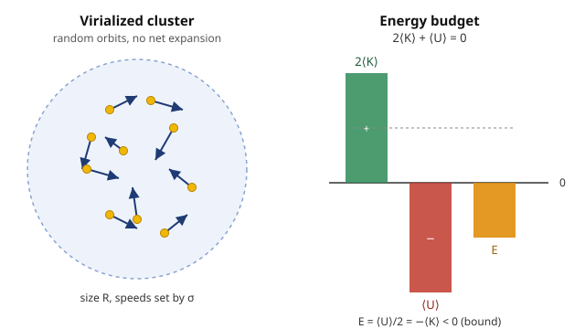

# Astrophysics · Lesson 1.4: Gravitational dynamics in astrophysics

> ⏱ ~15 min · Module 1: Radiation, matter, and measurement · Builds on: [1.1 Scales, luminosity, and the distance ladder](#/lesson/astrophysics/01-01-scales-luminosity-distance-ladder.md), [mechanics 5.1 Gravitation & Kepler](#/lesson/mechanics-refresher/05-01-gravitation-kepler.md) · Unlocks: Module 2 (stellar structure) — and Boss Problem 1 (Zwicky and dark matter)

## Why this matters

Light tells you an object's temperature and composition (lessons [1.2](#/lesson/astrophysics/01-02-blackbody-spectra-hr-diagram.md), [1.3](#/lesson/astrophysics/01-03-radiative-transfer-spectral-lines.md)) — but never its **mass**. Mass you have to weigh with gravity, and the only scale in the sky is motion: how fast things orbit, or how fast they mill around. This one lesson turns freshman mechanics into three of astronomy's most powerful instruments. Kepler's third law weighs anything with something orbiting it — a planet, a companion star, the four-million-solar-mass black hole at the center of our Galaxy. The **dynamical time** $t_{\rm dyn}\sim 1/\sqrt{G\rho}$ is the master clock of every self-gravitating system: how fast it would collapse, how fast it rings. And the **virial theorem** lets you weigh a whole star cluster or galaxy just from how fast its members jitter — the exact calculation Fritz Zwicky did in 1933 that first said *most of the universe is invisible*. That estimate is Boss Problem 1, and this lesson builds the machine for it.

## The idea

Everything here is one reused fact: **gravity is a $1/r^2$ force, so a bound system's kinetic and potential energies are locked in a fixed ratio.** Three faces of it:

- **Weigh by orbit (Kepler).** If something orbits a mass $M$, the orbit's size and period pin down $M$ — because gravity supplies exactly the centripetal pull the orbit needs, and the orbiting mass cancels out. One observed orbit, one mass. This is [mechanics 5.1](#/lesson/mechanics-refresher/05-01-gravitation-kepler.md) aimed at the sky.

- **Time by density (dynamical time).** How long does a self-gravitating blob take to "do anything" — collapse, oscillate, orbit once? Just $1/\sqrt{G\rho}$. Denser means faster. It doesn't matter whether it's a planet, a star, or a galaxy: the only clock a cloud of gravitating matter has is set by its density.

- **Weigh by jitter (virial).** A cluster of stars that's neither flying apart nor collapsing sits in a permanent standoff: the pull inward exactly balances the kinetic energy of everything buzzing around. That balance — *twice the kinetic energy equals the depth of the gravitational well* — lets you read the total mass off the spread of speeds, even if most of the mass is dark.

The last one carries a shock. A bound gravitating system has **negative total energy**, and losing energy makes it **hotter**. Stars have negative heat capacity. That single sentence explains why stars are stable, why they eventually run out of fuel, and why a gas cloud that radiates collapses into a star instead of just cooling off.

## The formal version

**Kepler's third law as a scale.** For a body on an orbit of semi-major axis $a$ and period $P$ around a mass $M$ (with the orbiter's own mass negligible), [mechanics 5.1](#/lesson/mechanics-refresher/05-01-gravitation-kepler.md) gives $P^2 = \tfrac{4\pi^2}{GM}a^3$. Solve for the mass:

$$\boxed{\,M = \frac{4\pi^2 a^3}{G\,P^2}\,}$$

$M$ is the central mass (kg), $a$ the semi-major axis (m), $P$ the period (s), $G = 6.674\times10^{-11}\ \mathrm{N\,m^2/kg^2}$. *In words:* **an orbit is a scale** — measure how big and how slow, and the central mass drops out. Referencing the Earth–Sun orbit turns this into a unit-free shortcut:

$$\frac{M}{M_\odot} = \frac{(a/\mathrm{AU})^3}{(P/\mathrm{yr})^2}.$$

*In words:* semi-major axis in AU, cubed, over period in years, squared, gives the mass in solar masses — no constants to look up. For a **two-body** system (binary star, or star + planet) the same law holds with $M\to M_1+M_2$ and $a$ the relative-orbit separation; the individual masses then follow from how far each body swings.

**Dynamical (free-fall) time.** Take a body released at the edge of a mass $M$, radius $R$, mean density $\rho = M/\tfrac43\pi R^3$. Its infall time — equivalently the orbital time at the edge — is set by density alone:

$$t_{\rm dyn} \sim \frac{1}{\sqrt{G\rho}}, \qquad t_{\rm ff} = \sqrt{\frac{3\pi}{32\,G\rho}}\ \ (\text{exact, pressureless collapse}).$$

*In words:* the natural clock of any self-gravitating system ticks like $1/\sqrt{G\rho}$; the orbital period at its surface is the same thing up to a factor of order one, since $P = 2\pi\sqrt{R^3/GM} = \sqrt{3\pi/G\rho}$. Denser systems evolve faster — a neutron star rings in milliseconds, a galaxy in hundreds of millions of years.

**The virial theorem.** For a self-gravitating system in a steady, bound state (relaxed, not expanding or collapsing), the time-averaged kinetic energy $\langle K\rangle$ and gravitational potential energy $\langle U\rangle$ obey

$$\boxed{\,2\langle K\rangle + \langle U\rangle = 0\,}\quad\Longrightarrow\quad \langle K\rangle = -\tfrac12\langle U\rangle,\quad E = \langle K\rangle + \langle U\rangle = -\langle K\rangle = \tfrac12\langle U\rangle.$$

*In words:* **twice the kinetic energy cancels the potential well.** Two consequences worth tattooing on: (1) the total energy $E = -\langle K\rangle < 0$ — a bound system has *negative* total energy; (2) since $E = -\langle K\rangle$ and $\langle K\rangle$ is a temperature, **removing energy raises the temperature** — negative heat capacity.

*Where it comes from.* Define the moment of inertia $I = \sum_i m_i r_i^2$ (the system's "spread"). Differentiating twice and using Newton's laws gives the scalar virial identity $\tfrac12\ddot I = 2K + \sum_i \mathbf F_i\cdot\mathbf r_i$. For gravity — a $1/r^2$ force — the force term evaluates exactly to the total potential energy $U$, so $\tfrac12\ddot I = 2K + U$. A relaxed bound system neither expands nor contracts on average, so $\langle\ddot I\rangle = 0$, leaving $2\langle K\rangle + \langle U\rangle = 0$.

**Weighing by velocity dispersion.** Model a cluster of total mass $M$ and size $R$ as $N$ bodies with root-mean-square speed related to the **line-of-sight velocity dispersion** $\sigma$ (the observable — the spread of Doppler shifts) by $\langle v^2\rangle = 3\sigma^2$. Then $\langle K\rangle = \tfrac12 M\langle v^2\rangle$ and $\langle U\rangle = -\alpha\, GM^2/R$ with $\alpha$ of order one ($\alpha=\tfrac35$ for a uniform sphere). Plug into $2\langle K\rangle = -\langle U\rangle$:

$$M\langle v^2\rangle = \alpha\frac{GM^2}{R}\;\Longrightarrow\; M = \frac{\langle v^2\rangle R}{\alpha G}\;\sim\; \boxed{\,\dfrac{\sigma^2 R}{G}\,}$$

*In words:* **the mass is the jitter speed squared, times the size, over $G$** — order-unity factors aside. You measure $\sigma$ from spectral-line widths and $R$ from the angular size, and out comes the total gravitating mass, luminous or not. That "or not" is the whole story of dark matter.

## Picture

The cluster (left) is a swarm of stars on random orbits — it holds its size because inward gravity and outward jitter are balanced. The bars (right) are that balance as bookkeeping: the positive $2\langle K\rangle$ exactly cancels the negative $\langle U\rangle$, and what's left over, the *total* energy $E$, sits below zero at half the well depth. Bound means below the line.

## Worked examples

**Example 1 (weighing Sagittarius A*, our Galaxy's central black hole).** Infrared astronomers tracked the star S2 on a full orbit around the radio source Sgr A* at the Galactic center: semi-major axis $a \approx 1000\ \mathrm{AU}$, period $P \approx 16\ \mathrm{yr}$. What's down there?

Convert and use $M = 4\pi^2 a^3/(GP^2)$. With $1\ \mathrm{AU} = 1.496\times10^{11}\ \mathrm m$ and $1\ \mathrm{yr} = 3.156\times10^7\ \mathrm s$:

$$a = 1.496\times10^{14}\ \mathrm m,\quad a^3 = 3.35\times10^{42}\ \mathrm{m^3};\qquad P = 5.05\times10^{8}\ \mathrm s,\quad P^2 = 2.55\times10^{17}\ \mathrm{s^2}.$$

$$M = \frac{(39.48)(3.35\times10^{42})}{(6.674\times10^{-11})(2.55\times10^{17})} = \frac{1.32\times10^{44}}{1.70\times10^{7}} = 7.8\times10^{36}\ \mathrm{kg} = \frac{7.8\times10^{36}}{1.989\times10^{30}} \approx 3.9\times10^{6}\,M_\odot.$$

Four million solar masses inside a region S2 skims at $\sim$120 AU — no cluster of stars that dense could avoid collapse, so it's a black hole. **Cross-check with the shortcut:** $M/M_\odot = a^3/P^2 = 1000^3/16^2 = 10^9/256 = 3.9\times10^6$. ✓ Same number, no constants. (This measurement won the 2020 Nobel Prize.)

**Example 2 (weighing a galaxy cluster — Zwicky's shock, and Boss Problem 1).** A rich cluster of galaxies has a line-of-sight velocity dispersion $\sigma \approx 1000\ \mathrm{km/s}$ (galaxies Doppler-shifted by that much relative to the mean) and a radius $R \approx 1\ \mathrm{Mpc}$. The virial estimate $M \sim \sigma^2 R/G$, with $1\ \mathrm{Mpc} = 3.086\times10^{22}\ \mathrm m$:

$$M \sim \frac{(10^6\ \mathrm{m/s})^2\,(3.086\times10^{22}\ \mathrm m)}{6.674\times10^{-11}} = \frac{3.09\times10^{34}}{6.674\times10^{-11}} = 4.6\times10^{44}\ \mathrm{kg} \approx 2\times10^{14}\,M_\odot.$$

Now count the light: the cluster's galaxies shine like maybe $10^{12}$–$10^{13}\,M_\odot$ of stars. The virial mass is **10 to 100 times larger** than the mass you can see. Either the cluster is flying apart (it isn't — it's old and relaxed, so the virial theorem applies), or most of its mass emits no light. That is Zwicky's 1933 conclusion, and the numbers still hold: clusters are dominated by **dark matter**. Boss Problem 1 walks this all the way through.

## Watch out

- **The virial theorem needs equilibrium.** $2\langle K\rangle + \langle U\rangle = 0$ holds only for a *relaxed, bound, steady* system — the time average matters. A cloud mid-collapse, a cluster mid-merger, or an unbound flyby does **not** obey it. Applying it to a system that isn't virialized is the classic way to report a fake mass.
- **You might think negative total energy is a bookkeeping quirk.** It's the definition of *bound*: $E<0$ means you'd have to *add* energy to disperse the system to infinity. $E>0$ would fly apart. The virial theorem forces $E = -\langle K\rangle$, so any relaxed self-gravitating system is automatically bound.
- **Losing energy heats a star — don't fight the sign.** Because $E=-\langle K\rangle$, draining energy (radiating) makes $\langle K\rangle$ *rise*. Self-gravitating systems have **negative heat capacity**: this is why a star with no fusion contracts and heats until it either ignites or becomes degenerate, and it's the opposite of your intuition from a cooling coffee cup.
- **$\sigma$ is one-dimensional.** The measured dispersion is along the line of sight only; the full 3D mean-square speed is $\langle v^2\rangle = 3\sigma^2$. Dropping the factor of 3 underestimates the mass threefold.

## One-liner

> Gravity's $1/r^2$ law locks kinetic and potential energy into $2\langle K\rangle=-\langle U\rangle$: an orbit weighs a black hole, $1/\sqrt{G\rho}$ times any collapse, and a velocity dispersion weighs a whole cluster — where the mass you find is mostly dark, and losing energy makes it hotter.

## Problems

**P1 (🟢)** A star at the Galactic center is observed on an orbit around Sgr A* with semi-major axis $a = 640\ \mathrm{AU}$ and period $P = 8\ \mathrm{yr}$. Using the shortcut $M/M_\odot = (a/\mathrm{AU})^3/(P/\mathrm{yr})^2$, find the enclosed mass in solar masses. Does it agree with the value from Example 1, and why should it?

**P2 (🟡)** A globular star cluster has a line-of-sight velocity dispersion $\sigma = 10\ \mathrm{km/s}$ and a radius $R = 10\ \mathrm{pc}$ ($1\ \mathrm{pc} = 3.086\times10^{16}\ \mathrm m$). Estimate its mass from the virial relation $M \sim \sigma^2 R/G$, in kg and in $M_\odot$. Its luminosity implies about $2\times10^5\,M_\odot$ of stars — is dark matter required here? Contrast with Example 2.

**P3 (🔴, optional)** A self-gravitating cloud of ideal monatomic gas ($N$ particles, total mass $M$, radius $R$) is in virial equilibrium and radiates energy at luminosity $L>0$. Its thermal kinetic energy is $\langle K\rangle = \tfrac32 N k_B T$ and its gravitational energy is $\langle U\rangle = -\alpha GM^2/R$ ($k_B = 1.381\times10^{-23}\ \mathrm{J/K}$).
(a) Show the total energy is $E = -\tfrac32 N k_B T$, and find the heat capacity $C = dE/dT$.
(b) Radiating means $dE/dt = -L$. Show that $T$ *rises* and $R$ *shrinks* as the cloud loses energy.
(c) Explain in one or two sentences why this makes a star a stable thermostat: what happens to the fusion rate if the core accidentally over- or under-produces energy?

Solutions

**P1** Direct substitution into the shortcut:

$$\frac{M}{M_\odot} = \frac{640^3}{8^2} = \frac{2.621\times10^8}{64} = 4.1\times10^{6}.$$

So $M \approx 4.1\times10^6\,M_\odot$. It agrees with Example 1's $3.9\times10^6\,M_\odot$ (to within the rounding and the real orbit uncertainties) — and it *should*, because both stars orbit the **same** central mass. Every orbiting body around Sgr A*, whatever its own $a$ and $P$, must return the same enclosed $M$; that consistency is exactly how astronomers confirmed a single compact object rather than an extended mass distribution.
*Check:* in SI, $a = 640\times1.496\times10^{11} = 9.57\times10^{13}\ \mathrm m$, $a^3 = 8.77\times10^{41}$; $P = 8\times3.156\times10^7 = 2.52\times10^8\ \mathrm s$, $P^2 = 6.37\times10^{16}$; $M = 39.48\times8.77\times10^{41}/(6.674\times10^{-11}\times6.37\times10^{16}) = 3.46\times10^{43}/4.25\times10^6 = 8.1\times10^{36}\ \mathrm{kg} = 4.1\times10^6\,M_\odot$. ✓

**P2** With $\sigma = 10^4\ \mathrm{m/s}$ (so $\sigma^2 = 10^8\ \mathrm{m^2/s^2}$) and $R = 10\times3.086\times10^{16} = 3.086\times10^{17}\ \mathrm m$:

$$M \sim \frac{\sigma^2 R}{G} = \frac{(10^8)(3.086\times10^{17})}{6.674\times10^{-11}} = \frac{3.086\times10^{25}}{6.674\times10^{-11}} = 4.6\times10^{35}\ \mathrm{kg} \approx 2.3\times10^{5}\,M_\odot.$$

That matches the $\sim 2\times10^5\,M_\odot$ of light-emitting stars: **no dark matter is required** — a globular cluster's dynamical mass and its stellar mass agree. The contrast with Example 2 is the whole point: dark matter shows up on cluster and galaxy scales ($\sigma\sim$ hundreds–thousands of km/s over Mpc), *not* inside small, dense, baryon-dominated systems like globular clusters. The virial theorem is the single tool that reveals both results.
*Check:* order of magnitude — a few $\times10^5\,M_\odot$ is a textbook globular-cluster mass, and units are $(\mathrm{m^2/s^2})(\mathrm m)/(\mathrm{m^3\,kg^{-1}\,s^{-2}}) = \mathrm{kg}$. ✓

**P3** (a) Virial theorem: $E = \langle K\rangle + \langle U\rangle$, and $2\langle K\rangle + \langle U\rangle = 0$ gives $\langle U\rangle = -2\langle K\rangle$, so

$$E = \langle K\rangle - 2\langle K\rangle = -\langle K\rangle = -\tfrac32 N k_B T.$$

Then the heat capacity is

$$C = \frac{dE}{dT} = -\tfrac32 N k_B < 0 \quad(\textbf{negative}).$$

(b) With $E = -\tfrac32 N k_B T$, radiating gives $\dfrac{dE}{dt} = -\tfrac32 N k_B \dfrac{dT}{dt} = -L$, so

$$\frac{dT}{dt} = \frac{2L}{3 N k_B} > 0.$$

The temperature **rises**. And since virial equilibrium also fixes $\langle U\rangle = 2E = -3N k_B T$, i.e. $-\alpha GM^2/R = -3N k_B T$, we get $R = \alpha GM^2/(3N k_B T)$: as $T$ climbs, $R$ **shrinks**. The cloud radiates, contracts, and heats — the Kelvin–Helmholtz mechanism, which powers a protostar (and briefly the pre-fusion Sun) before nuclear ignition. Losing energy makes it hotter and smaller.

(c) Because heat capacity is negative, the star is self-correcting. If the core momentarily over-produces energy, the extra energy input makes the star *expand and cool* (add energy $\to$ $T$ drops), which throttles the fiercely temperature-sensitive fusion rate back down; if it under-produces, the core contracts and heats, speeding fusion up. Gravity acts as a thermostat with negative feedback, holding the star on the main sequence for billions of years. (This is why the runaway is only avoided while an ideal-gas equation of state holds — once matter becomes *degenerate*, pressure stops depending on temperature, the thermostat breaks, and you get a helium flash or a Type Ia supernova. See [4.1](#/lesson/astrophysics/04-01-white-dwarfs-chandrasekhar.md).)

## Flashback

**From Lesson 1.1 (Scales, luminosity, and the distance ladder):** Two stars, A and B, have identical luminosity. Star A lies at $8\ \mathrm{pc}$ and star B at $24\ \mathrm{pc}$. What is the ratio of their observed fluxes $F_B/F_A$?

Solution

Flux falls off as the inverse square of distance, $F = L/(4\pi d^2)$. Equal luminosities cancel in the ratio, so only the distances matter:

$$\frac{F_B}{F_A} = \frac{d_A^2}{d_B^2} = \left(\frac{8}{24}\right)^2 = \left(\frac13\right)^2 = \frac19.$$

Star B, three times farther, appears $1/9$ as bright. This is the same inverse-square law that later makes standard candles work: fix $L$, measure $F$, and the distance $d = \sqrt{L/4\pi F}$ falls out.
*Check:* farther should mean fainter, and it does — $F_B < F_A$. ✓

## Connections

- **Backward:** the whole lesson is [mechanics 5.1](#/lesson/mechanics-refresher/05-01-gravitation-kepler.md)'s Kepler's law and $U=-GMm/r$ reused as measuring instruments; the moment-of-inertia derivation of the virial theorem leans on [mechanics 4.2 angular momentum](#/lesson/mechanics-refresher/04-02-angular-momentum.md) and the energy bookkeeping of [mechanics 2.2](#/lesson/mechanics-refresher/02-02-potential-energy-conservation.md). The $\langle K\rangle = \tfrac32 Nk_BT$ used in P3 is [stat-mech equipartition](#/lesson/stat-mech/03-04-equipartition-theorem.md).
- **Forward:** the dynamical time returns as the collapse clock of the **Jeans instability** in star formation ([3.1](#/lesson/astrophysics/03-01-star-formation-jeans.md), Boss Problem 3); virial equilibrium underlies **hydrostatic equilibrium** in the stellar-structure equations ([2.1](#/lesson/astrophysics/02-01-equations-stellar-structure.md)); negative heat capacity drives Kelvin–Helmholtz contraction and the main-sequence thermostat ([2.5](#/lesson/astrophysics/02-05-main-sequence.md)) — and its *breakdown* under degeneracy sets up white dwarfs ([4.1](#/lesson/astrophysics/04-01-white-dwarfs-chandrasekhar.md)).
- **Sideways (dark matter):** the velocity-dispersion mass estimate here is the cluster-scale twin of the galaxy-rotation-curve argument in [5.3](#/lesson/astrophysics/05-03-galaxies-dark-matter.md) (Boss Problem 5); together they are the dynamical backbone of the case for dark matter, resolved cosmologically in [6.4](#/lesson/astrophysics/06-04-structure-formation-dark-matter.md).
