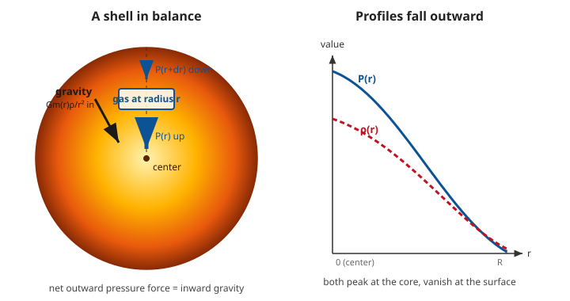

# Astrophysics · Lesson 2.1: The equations of stellar structure

> ⏱ ~15 min · Module 2: Stellar structure · Builds on: [1.4 Gravitational dynamics & the virial theorem](#/lesson/astrophysics/01-04-gravitational-dynamics-virial.md), [stat-mech: the ideal gas](#/lesson/stat-mech/01-05-ideal-gas-sackur-tetrode.md) · Unlocks: energy transport & opacity (2.2), nuclear energy generation (2.3), the whole theory of how stars live and die

## Why this matters

A star is the simplest object in astrophysics and the most consequential: a ball of gas so heavy its own gravity would crush it in half an hour — except it doesn't. Something holds it up for ten billion years. That something is pressure, and the bookkeeping of pressure-against-gravity is the entire foundation of stellar astrophysics. Get the balance equation right and, with nothing but Newton and the ideal gas law, you can stand outside the Sun and calculate that its core is $10^7$ K — hot enough for hydrogen to fuse. That estimate, done on the back of an envelope, is one of the great triumphs of physics: we deduced the temperature of a place no instrument will ever reach, and it came out exactly hot enough to explain why the Sun shines. This lesson is where all of it starts.

## The idea

Take a star and mentally slice it into thin spherical shells, like an onion. Focus on one shell at radius $r$. Gravity from everything *below* it pulls it inward — hard. If that were the only force, the shell would fall. It doesn't, so there must be an equal outward push. That push is **pressure**: the gas below the shell presses out harder than the gas above presses in, because pressure is higher deeper down. The shell floats on a pressure *difference*.

That is the whole picture. Every shell in a stable star sits in this standoff, called **hydrostatic equilibrium** ("hydro" = fluid, "static" = not moving). Deeper shells carry more weight above them, so they must sit at higher pressure — which is why pressure, density, and temperature all rise as you go in and fall to nearly nothing at the surface. A star is a self-gravitating gas that has arranged its own pressure gradient to exactly cancel its own weight, everywhere at once.

To turn this into numbers we need three things, one per unknown: how pressure changes with depth (the balance itself), how much mass is enclosed at each radius (because that's what does the pulling), and what sets the pressure in the first place (the gas law). Those are the first equations of stellar structure.

## The formal version

**Hydrostatic equilibrium — the master equation.** For a shell of thickness $dr$ at radius $r$, with local density $\rho(r)$ and enclosed mass $m(r)$ (all the mass inside radius $r$):

$$\boxed{\;\frac{dP}{dr} = -\frac{G\,m(r)\,\rho(r)}{r^2}\;}$$

In words: pressure drops as you move outward, and it drops fastest where gravity ($Gm/r^2$) and density are largest. The minus sign says "pressure falls going up." This is Newton's second law for a fluid element with zero acceleration: the weight per unit volume, $g\rho = Gm\rho/r^2$, is balanced by the pressure gradient $-dP/dr$.

**Mass continuity.** The mass in a shell of radius $r$ and thickness $dr$ is its volume $4\pi r^2\,dr$ times density:

$$\frac{dm}{dr} = 4\pi r^2 \rho(r).$$

In words: adding up shells from the center out accumulates the star's mass; this is just the definition of $m(r)$ differentiated. It couples to the first equation because $m(r)$ is what appears in the gravity term.

**The equation of state (EOS).** We now have two equations but three unknowns ($P$, $\rho$, $m$), and $P$ and $\rho$ are still independent. The EOS closes the gap by tying pressure to the gas's density and temperature. For ordinary main-sequence stars the gas is an ideal gas:

$$P = \frac{\rho\, k_B\, T}{\mu\, m_H},$$

where $k_B$ is Boltzmann's constant, $m_H$ the mass of a hydrogen atom, and $\mu$ the **mean molecular weight** — the average mass of a gas particle in units of $m_H$. In words: pressure is set by how many particles you have (density $\div$ mass-per-particle) times their thermal energy $k_BT$. For ionized solar-composition gas $\mu \approx 0.6$ — *less* than 1 because ionization frees electrons, so each hydrogen contributes two particles (a proton and an electron), driving the average mass per particle below one $m_H$. (In very dense cores the pressure comes instead from quantum **degeneracy** — the Pauli exclusion pressure of packed electrons — which we hold off until white dwarfs in [4.1](#/lesson/astrophysics/04-01-white-dwarfs-chandrasekhar.md).)

**The two still to come.** Four equations fully specify a star; we have three of the ingredients but only two independent structure ODEs so far, plus the EOS. The remaining two describe *energy*: how nuclear burning generates luminosity, $\dfrac{dL}{dr} = 4\pi r^2 \rho\,\varepsilon$ (energy generation, [2.3](#/lesson/astrophysics/02-03-nuclear-energy-generation.md)), and how that energy flows outward as a temperature gradient, $\dfrac{dT}{dr}$ (radiative/convective transport, [2.2](#/lesson/astrophysics/02-02-energy-transport-opacity.md)). Together the four make a coupled system.

**Boundary conditions.** ODEs need endpoints. At the **center** ($r=0$): $m=0$ and $L=0$ (no mass or luminosity enclosed in a point). At the **surface** ($r=R$): $m=M$ (all the mass), pressure and density drop essentially to zero, and the temperature is set by the radiated luminosity, $L = 4\pi R^2 \sigma T_{\text{eff}}^4$ — the Stefan–Boltzmann link back to [1.2](#/lesson/astrophysics/01-02-blackbody-spectra-hr-diagram.md), with $\sigma$ the Stefan–Boltzmann constant.

**The order-of-magnitude version.** Before integrating anything, estimate. Replace $dP/dr$ by $P_c/R$ (pressure runs from $P_c$ at the center to $\sim 0$ at the surface over a distance $R$), set $m\sim M$, $\rho \sim M/R^3$, $r\sim R$:

$$\frac{P_c}{R} \sim \frac{G M}{R^2}\cdot\frac{M}{R^3} \quad\Longrightarrow\quad \boxed{\,P_c \sim \frac{GM^2}{R^4}\,}$$

In words: central pressure scales as gravitational energy density. This one line, with no calculus, already predicts the crushing pressure inside a star.

## Picture

Left: a single gas element at radius $r$. The gas below pushes out with $P(r)$, the gas above pushes in with the slightly smaller $P(r+dr)$; the net outward push exactly balances the inward weight $Gm(r)\rho/r^2$. Right: because every shell obeys this, $P(r)$ and $\rho(r)$ peak at the core and fall to nothing at the surface — the pressure gradient *is* the support.

## Worked examples

**Example 1 (mechanical — central pressure of the Sun).** Use $P_c \sim GM^2/R^4$ with $M_\odot = 2\times10^{30}$ kg, $R_\odot = 7\times10^8$ m, $G = 6.67\times10^{-11}$ SI:

$$P_c \sim \frac{(6.67\times10^{-11})(2\times10^{30})^2}{(7\times10^8)^4} = \frac{2.67\times10^{50}}{2.40\times10^{35}} \approx 1\times10^{15}\ \text{Pa}.$$

That's about ten billion times atmospheric pressure ($10^5$ Pa). The true central value is $\sim 2\times10^{16}$ Pa — our crude estimate lands within a factor of ~20, i.e. it nails the order of magnitude, which is the point. (The estimate runs low because a real star is far more centrally concentrated than the uniform-density picture assumes.)

**Example 2 (why you'd care — the central temperature, and the whole point of a star).** Here is the payoff. Combine hydrostatic balance with the ideal gas law to find how hot the core must be. From the estimate $P_c \sim GM^2/R^4$ and the EOS at the center, $P_c = \rho_c k_B T_c/(\mu m_H)$ with $\rho_c \sim M/R^3$:

$$\frac{M}{R^3}\cdot\frac{k_B T_c}{\mu m_H} \sim \frac{GM^2}{R^4} \quad\Longrightarrow\quad \boxed{\,T_c \sim \frac{G M \mu m_H}{k_B R}\,}$$

In words: a bigger, denser star must run hotter to generate the pressure that holds it up. Evaluate for the Sun with $\mu = 0.6$, $m_H = 1.67\times10^{-27}$ kg, $k_B = 1.38\times10^{-23}$ J/K:

$$T_c \sim \frac{(6.67\times10^{-11})(2\times10^{30})(0.6)(1.67\times10^{-27})}{(1.38\times10^{-23})(7\times10^8)} \approx 1.4\times10^7\ \text{K}.$$

Ten million kelvin — and the measured value is $1.5\times10^7$ K. We did not go to the Sun; we did not measure anything but its mass and radius. Newton and the gas law alone say the core sits at $10^7$ K, which is precisely the threshold where protons can tunnel through their mutual repulsion and fuse (the Gamow peak, [2.3](#/lesson/astrophysics/02-03-nuclear-energy-generation.md)). The star's own weight sets its thermostat, and it lands exactly at "hot enough to burn." That coincidence is not a coincidence — it is *why* main-sequence stars exist.

## Watch out

- You might think pressure itself holds the star up. It doesn't — a *uniform* pressure exerts zero net force on a shell (it pushes equally from all sides). Only the **gradient** $dP/dr$ supports weight. A star with constant pressure would collapse; it's the difference between inner and outer pressure that carries the load.
- You might read the minus sign in $dP/dr = -Gm\rho/r^2$ as "pressure is negative." It means pressure *decreases outward*. $P$, $\rho$, $T$ are all positive and all fall from center to surface.
- You might expect $\mu > 1$ because ions are heavy. But $\mu$ is mass *per free particle*, and ionization multiplies the particle count: fully ionized hydrogen gives two particles (p$^+$, e$^-$) per proton mass, so $\mu \to 0.5$; solar mix lands at $\mu \approx 0.6$. Forgetting to ionize (using $\mu\approx 1$) throws $T_c$ off by nearly a factor of two.
- You might treat $m(r)$ as the star's total mass $M$ everywhere. It's only the mass *interior* to $r$; at the very center $m\to 0$, which is why the pressure gradient flattens there ($dP/dr\to 0$).

## One-liner

> A star is a gas that props itself up with its own pressure gradient — and doing the arithmetic on that standoff tells you, from the outside, that the core is $10^7$ K and therefore fusing.

## Problems

**P1 (🟢)** Using $P_c \sim GM^2/R^4$, estimate the central pressure of a red dwarf with $M = 0.2\,M_\odot$ and $R = 0.2\,R_\odot$. How many times atmospheric pressure ($10^5$ Pa) is that? (Take $M_\odot = 2\times10^{30}$ kg, $R_\odot = 7\times10^8$ m.)

**P2 (🟡)** Re-derive the central-temperature estimate $T_c \sim GM\mu m_H/(k_B R)$ from hydrostatic balance plus the ideal gas law, stating each substitution. Then evaluate it for a $10\,M_\odot$, $4\,R_\odot$ main-sequence star (same $\mu = 0.6$). Is the ratio $T_c/T_{c,\odot}$ what you'd expect from the formula?

**P3 (🔴, optional)** Integrate the structure equations *exactly* for a star of **constant density** $\rho_0$. (a) From mass continuity get $m(r)$. (b) Substitute into hydrostatic equilibrium and integrate from the surface ($P=0$ at $r=R$) inward to show the central pressure is

$$P_c = \frac{3GM^2}{8\pi R^4}.$$

(c) Compare the numerical coefficient $3/8\pi$ to the order-of-magnitude "1" we used in Example 1, and evaluate $P_c$ for the Sun.

Solutions

**P1** Scaling: $P_c \propto M^2/R^4$. With $M = 0.2\,M_\odot$ and $R = 0.2\,R_\odot$,

$$\frac{P_c}{P_{c,\odot}} = \frac{(0.2)^2}{(0.2)^4} = \frac{0.04}{0.0016} = 25.$$

Since $P_{c,\odot}\sim 1\times10^{15}$ Pa (Example 1), $P_c \sim 2.5\times10^{16}$ Pa — about $2.5\times10^{11}$ times atmospheric. Directly: $P_c \sim G(0.4\times10^{30})^2/(1.4\times10^8)^4 = (6.67\times10^{-11})(1.6\times10^{59})/(3.84\times10^{32}) \approx 2.8\times10^{16}$ Pa. (Small, dense stars are internally *more* crushing than the Sun — density wins.)

**P2** Substitutions: hydrostatic estimate gives $P_c \sim GM^2/R^4$ (replace $dP/dr\to P_c/R$, $m\to M$, $\rho\to M/R^3$, $r\to R$). Ideal gas at the center: $P_c = \rho_c k_B T_c/(\mu m_H)$ with $\rho_c\sim M/R^3$. Set them equal:

$$\frac{M}{R^3}\frac{k_B T_c}{\mu m_H}\sim\frac{GM^2}{R^4}\ \Rightarrow\ T_c\sim\frac{GM\mu m_H}{k_B R}.$$

The two factors of $M/R^3$ (one from each side's density) cancel, leaving $T_c\propto M/R$. For $M=10\,M_\odot$, $R=4\,R_\odot$: $T_c/T_{c,\odot} = 10/4 = 2.5$, so $T_c\sim 2.5\times(1.4\times10^7)\approx 3.5\times10^7$ K. Expected: yes — $T_c\propto M/R$, and $10/4 = 2.5$. Massive stars run hotter cores, which is why they burn via the more temperature-sensitive CNO cycle ([2.3](#/lesson/astrophysics/02-03-nuclear-energy-generation.md)).

**P3** (a) Constant density: $m(r) = \int_0^r 4\pi r'^2\rho_0\,dr' = \tfrac{4}{3}\pi r^3\rho_0.$

(b) Insert into hydrostatic equilibrium:

$$\frac{dP}{dr} = -\frac{G\,m(r)\,\rho_0}{r^2} = -\frac{G\rho_0}{r^2}\cdot\tfrac{4}{3}\pi r^3\rho_0 = -\tfrac{4}{3}\pi G\rho_0^2\, r.$$

Integrate from $r=R$ (where $P=0$) inward to a general $r$:

$$P(r) - 0 = -\tfrac{4}{3}\pi G\rho_0^2\int_R^r r'\,dr' = \tfrac{2}{3}\pi G\rho_0^2\,(R^2 - r^2).$$

At the center ($r=0$): $P_c = \tfrac{2}{3}\pi G\rho_0^2 R^2.$ Now eliminate $\rho_0$ using $\rho_0 = M/(\tfrac{4}{3}\pi R^3) = 3M/(4\pi R^3)$, so $\rho_0^2 = 9M^2/(16\pi^2 R^6)$:

$$P_c = \tfrac{2}{3}\pi G\cdot\frac{9M^2}{16\pi^2 R^6}\cdot R^2 = \frac{3GM^2}{8\pi R^4}.\quad\checkmark$$

(c) The exact coefficient is $\tfrac{3}{8\pi} \approx 0.12$, versus the "$1$" we used for the estimate — so the order-of-magnitude version overshoots by about $8\times$. Numerically $P_c = 0.12\times(1.11\times10^{15}) \approx 1.3\times10^{14}$ Pa. Note this constant-density answer is *lower* than the Sun's true $2\times10^{16}$ Pa: a real star is far denser at the center than a uniform ball, so its true central pressure exceeds the constant-density model. The Fermi estimate ($\sim10^{15}$) sits sensibly between the too-smooth uniform model and reality — which is exactly what order-of-magnitude reasoning is for.

## Flashback

**From Lesson 1.4 (Gravitational dynamics & the virial theorem):** The virial theorem for a self-gravitating gas says $2K + U = 0$, where $K$ is the total thermal kinetic energy and $U\approx -GM^2/R$ is the gravitational potential energy. Use it to estimate the Sun's *mean* internal temperature, and check that it agrees in order of magnitude with the central temperature we found from hydrostatic balance. (Model the interior as an ideal monatomic gas of $N = M/(\mu m_H)$ particles with $K = \tfrac{3}{2}N k_B \bar{T}$, $\mu = 0.6$.)

Solution

Virial theorem: $2K = -U = |U| \approx GM^2/R$, so $K \approx \tfrac{1}{2}GM^2/R$. Equate to the thermal energy $K = \tfrac{3}{2}N k_B\bar T$ with $N = M/(\mu m_H)$:

$$\frac{3}{2}\frac{M}{\mu m_H}k_B\bar T \approx \frac{1}{2}\frac{GM^2}{R}\ \Rightarrow\ \bar T \approx \frac{GM\mu m_H}{3k_B R}.$$

This is exactly the hydrostatic central-temperature estimate divided by 3. Numerically $\bar T\approx (1.4\times10^7)/3 \approx 4.6\times10^6$ K — same order of magnitude as $T_c\sim10^7$ K, as it must be (the mean is naturally a few times cooler than the peak at the core). Two completely different arguments — force balance shell-by-shell, and a global energy theorem — give the same interior temperature. That agreement is the internal consistency check that lets us trust the number.

## Connections

- **Backward:** hydrostatic equilibrium is Newton's second law from `mechanics-refresher` applied to a fluid element, and the virial estimate in the Flashback is [1.4](#/lesson/astrophysics/01-04-gravitational-dynamics-virial.md)'s theorem turned inward on a single star. The EOS is the ideal gas law from [stat-mech 1.5](#/lesson/stat-mech/01-05-ideal-gas-sackur-tetrode.md), with $\mu$ tracking the ionization that [1.3](#/lesson/astrophysics/01-03-radiative-transfer-spectral-lines.md)'s Saha equation quantifies.
- **Forward:** the two missing equations — energy transport ([2.2](#/lesson/astrophysics/02-02-energy-transport-opacity.md)) and nuclear generation ([2.3](#/lesson/astrophysics/02-03-nuclear-energy-generation.md)) — complete the set; [2.4](#/lesson/astrophysics/02-04-polytropes-lane-emden.md) solves a simplified version (polytropes) exactly, generalizing P3's constant-density integration; and the $T_c\sim10^7$ K result is the entry ticket to fusion, which sets the entire main sequence ([2.5](#/lesson/astrophysics/02-05-main-sequence.md)).
- **Sideways (stat-mech):** when the gas gets cold and dense enough that quantum statistics dominate, the ideal-gas EOS is replaced by **degeneracy pressure** — the Fermi-gas pressure of [stat-mech 4.4](#/lesson/stat-mech/04-04-ideal-fermi-gas.md) — which is what holds up a white dwarf even at $T=0$ ([4.1](#/lesson/astrophysics/04-01-white-dwarfs-chandrasekhar.md)). Same hydrostatic equation, different EOS: that single swap is the whole story of compact objects.
