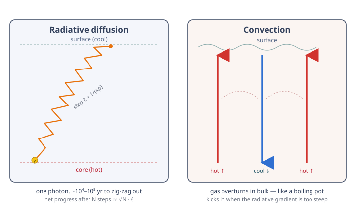

# Astrophysics · Lesson 2.2: Energy transport — radiation, convection, and opacity

> ⏱ ~15 min · Module 2: Stellar structure · Builds on: [2.1 The equations of stellar structure](#/lesson/astrophysics/02-01-equations-stellar-structure.md), [1.3 Radiative transfer and spectral lines](#/lesson/astrophysics/01-03-radiative-transfer-spectral-lines.md) · Unlocks: 2.3 nuclear energy generation, and the mass–luminosity relation in 2.5

## Why this matters

Lesson 2.1 balanced a star against gravity but left one question open: the core makes energy — how does it get *out*? The answer sets the star's entire personality. It fixes the luminosity (it turns out $L$ is a **leakage rate**, not something the furnace dictates), it explains why a star ten times heavier shines a thousand times brighter, and it decides whether the gas sits still and lets light diffuse through or **boils** like a pot on a stove. Get this lesson and the mass–luminosity relation, the length of the main sequence, and the granulated face of the Sun all fall out of the same physics.

## The idea

Energy leaves the core two ways, and a star uses whichever is faster.

**Radiation (diffusion).** A photon born in the core does not fly to the surface — the gas is opaque, so it scatters after about a centimeter, redirects, scatters again, a blind drunkard's walk of $\sim 10^{21}$ steps. It leaks *outward* only because the core is hotter than the surface: there are more photons pushing up than down, so the net drift is toward the cold. This is **diffusion** — the same math as heat crawling down a poker or dye spreading in water — and it is slow. A photon takes $10^4$–$10^5$ years to escape the Sun; the sunlight on your face left the core before the last ice age.

**Convection (boiling).** If the temperature drops too *steeply* with radius, diffusion can't keep up and the gas itself becomes unstable: a warm blob, nudged upward, finds itself lighter than its new surroundings and keeps rising, like a hot-air balloon. Cool blobs sink. The gas overturns in giant cells, physically carrying heat outward — vastly more efficient than photon-diffusion, and it's why the Sun's surface looks like simmering porridge (granulation).

The single knob that decides which regime you're in is **opacity** $\kappa$ — how hard the gas is for light to cross. High opacity chokes diffusion and forces the gas to boil instead.

## The formal version

**Radiative diffusion.** Treat the photons as a gas with energy density $u = aT^4$, where $a = 7.57\times10^{-15}\ \mathrm{erg\,cm^{-3}\,K^{-4}}$ is the **radiation constant** ($a = 4\sigma/c$, with $\sigma$ the Stefan–Boltzmann constant). A photon's mean free path is $\ell = 1/(\kappa\rho)$, where $\kappa$ is the **opacity** (cross-section per gram, $\mathrm{cm^2/g}$) and $\rho$ the density. Diffusion theory gives a flux proportional to the gradient of the photon energy density, with diffusion coefficient $D = c\ell/3$:

$$F = -\frac{c}{3\kappa\rho}\,\frac{d(aT^4)}{dr} = -\frac{4acT^3}{3\kappa\rho}\,\frac{dT}{dr}.$$

*In words:* radiation flows "downhill" in temperature; the steeper the temperature drop and the more transparent the gas ($\ell$ large), the more energy flows. Setting $L = 4\pi r^2 F$ and solving for the gradient gives the **radiative temperature gradient**:

$$\boxed{\;\frac{dT}{dr} = -\frac{3\kappa\rho\,L}{16\pi a c\, r^2 T^3}\;}$$

*In words:* to push luminosity $L$ through opaque ($\kappa\rho$ large), cool ($T^3$ small) gas, a star needs a steep temperature gradient. Equivalently — since radiation pressure is $P_\mathrm{rad}=\tfrac13 aT^4$ — the energy is being shoved down a **radiation-pressure gradient**: hotter gas below has more photon pressure and pushes energy toward the colder gas above.

**Opacity sources** (what makes stellar matter hard for light to cross):
- **Electron scattering** (Thomson): free electrons bat photons around. Dominant in hot, fully ionized interiors; roughly constant, $\kappa_\mathrm{es}\approx 0.2(1+X)\ \mathrm{cm^2/g}$ ($X$ = hydrogen fraction).
- **Free–free** (inverse bremsstrahlung): a free electron passing an ion absorbs a photon. Follows **Kramers' law**, $\kappa\propto\rho\,T^{-3.5}$ — surges where gas is dense and cool.
- **Bound–free**: a photon ionizes a bound electron; also roughly Kramers-like. Needs atoms that still hold electrons (partial ionization).
- **H⁻ opacity**: in cool outer layers ($T\sim 6000$ K, like the Sun's surface) a neutral H atom can grab a *second*, very loosely bound electron. That electron is knocked off by almost any visible/infrared photon → an enormous, temperature-sensitive opacity source. This is what makes the Sun's outer envelope opaque enough to convect.

**The Eddington approximation and $L\propto M^3$.** Eddington's insight: model the star as radiative throughout with a roughly constant opacity, and the luminosity becomes a pure *leakage* problem — the rate radiation seeps out — set by structure, not by the nuclear reactions. Order-of-magnitude, replace derivatives by ratios ($dT/dr\to T_c/R$, $\rho\to M/R^3$, $T\to T_c$) in the boxed equation:

$$L \sim \frac{16\pi a c\, R^2 T_c^4}{3\kappa\, (M/R^3)\,R}\sim \frac{ac}{\kappa}\,\frac{R^4 T_c^4}{M}.$$

Now feed in the central temperature from 2.1's hydrostatic + ideal-gas estimate, $k_BT_c\sim GMm_p/R$, i.e. $T_c\propto M/R$:

$$L \sim \frac{ac}{\kappa}\,\frac{R^4}{M}\left(\frac{M}{R}\right)^4 = \frac{ac}{\kappa}\,M^3.$$

*In words:* the radius cancels completely, and with $\kappa\approx$ const you get $\boxed{L\propto M^3}$ — the **mass–luminosity relation** (real stars: $L\propto M^{3\text{–}4}$). Massive stars are catastrophically bright because $T_c^4$ is so punishing.

**Convection and the Schwarzschild criterion.** Displace a gas blob upward. It expands to match the lower outside pressure, cooling **adiabatically** along its own temperature profile. Compare it to its new surroundings:
- If the blob is now *denser* (cooler) than around it → it sinks back → **stable**, radiation carries the energy.
- If the blob is now *less dense* (still warmer) than around it → it keeps rising → **convection**.

Instability sets in when the star's actual (radiative) temperature gradient is **steeper** than the adiabatic one a rising blob follows:

$$\left|\frac{dT}{dr}\right|_\mathrm{rad} > \left|\frac{dT}{dr}\right|_\mathrm{ad},\qquad\text{equivalently}\qquad \nabla_\mathrm{rad} > \nabla_\mathrm{ad},$$

with $\nabla \equiv d\ln T/d\ln P$ and $\nabla_\mathrm{ad}=1-1/\gamma=0.4$ for an ideal monatomic gas. *In words:* if pushing $L$ out radiatively **demands** a gradient steeper than the gas can hold up against buoyancy, the gas gives up and overturns instead. From the boxed formula, $\nabla_\mathrm{rad}$ gets steep exactly when **opacity is high**, the **flux is concentrated**, or the gas is **cool** — so convection appears in: the Sun's cool outer envelope (H⁻ opacity), the cores of massive stars (steeply peaked CNO burning), and low-mass stars, which are cool and opaque enough to be **fully convective**.

**Escape time.** The random walk makes this concrete: $N$ steps of length $\ell$ reach a net distance $\sqrt{N}\,\ell=R$, so $N=(R/\ell)^2$ and the total path is $N\ell = R^2/\ell$. The photon's escape time is

$$t \sim \frac{R^2}{\ell c} = \frac{R^2\kappa\rho}{c}.$$

## Picture

Two ways to move heat: light seeps through stationary gas (left), or the gas itself carries the heat by overturning (right). A star picks whichever the opacity allows.

## Worked examples

**Example 1 (mechanical — where the gradient comes from).** Derive the boxed gradient and read off its meaning. Photons form a gas of energy density $u=aT^4$; standard kinetic diffusion gives flux $F=-\tfrac13 c\ell\,\dfrac{du}{dr}$ with step $\ell=1/(\kappa\rho)$:

$$F = -\frac{c}{3\kappa\rho}\frac{d(aT^4)}{dr} = -\frac{4acT^3}{3\kappa\rho}\frac{dT}{dr}.$$

The luminosity crossing radius $r$ is $L=4\pi r^2 F$, so

$$L = -4\pi r^2\,\frac{4acT^3}{3\kappa\rho}\frac{dT}{dr}\quad\Longrightarrow\quad \frac{dT}{dr}=-\frac{3\kappa\rho L}{16\pi ac\,r^2T^3}.$$

Sanity number for the Sun: crudely $|dT/dr|\sim T_c/R_\odot \sim (1.5\times10^7\ \mathrm K)/(7\times10^{10}\ \mathrm{cm}) \approx 2\times10^{-4}\ \mathrm{K/cm}$ — a fifth of a kelvin per meter, sustained over 700,000 km. Gentle locally, gigantic in total.

**Example 2 (why you'd care — the main sequence in one line).** Take the result $L\propto M^3$ as given. A star's main-sequence lifetime is (fuel)/(burn rate) $\propto M/L$, so

$$t_\mathrm{MS}\propto \frac{M}{L}\propto \frac{M}{M^3}=M^{-2}.$$

A $10\,M_\odot$ star therefore has $L\sim 10^3 L_\odot$ and lives $t\sim t_\odot\cdot 10^{-2}\sim 10^{10}\cdot10^{-2}=10^8$ yr — a hundred million years against the Sun's ten billion, even though it started with ten times the fuel. **Bright, brief, and profligate**: burning the candle from both ends is a *consequence of how energy diffuses out*, established here and cashed in fully in [2.5 The main sequence](#/lesson/astrophysics/02-05-main-sequence.md).

## Watch out

- You might think the nuclear furnace *sets* the luminosity. Backwards: for a radiative star $L$ is a **leakage rate** fixed by mass, opacity, and structure; the core simply burns fast enough to replace what leaks. Change the opacity and $L$ changes even with the same fusion.
- You might think "hotter gas = more opaque." Usually the opposite: heating ionizes atoms and washes out bound–free/free–free absorption (Kramers' $\kappa\propto T^{-3.5}$). Hot interiors are relatively *transparent* (electron scattering only); cool envelopes are the opaque, convective ones.
- Convection is not triggered by "hot means it rises." A blob rises only if, after cooling adiabatically as it expands, it is *still* less dense than its surroundings — that is the whole content of $\nabla_\mathrm{rad}>\nabla_\mathrm{ad}$. Compare the blob to its **new** neighborhood, not its old one.
- $\kappa$ (opacity, per gram) is not the optical depth $\tau=\int\kappa\rho\,dr$ of [1.3](#/lesson/astrophysics/01-03-radiative-transfer-spectral-lines.md). Opacity is the local resistance; optical depth is that resistance accumulated along a path.

## One-liner

> Light random-walks out of a star's opaque interior over $10^4$–$10^5$ years, and where the temperature falls too steeply for that to keep up, the gas boils instead — with opacity as the single knob choosing between them.

## Problems

**P1 (🟢)** Estimate how long a photon takes to random-walk out of the Sun. Use mean free path $\ell\sim 1$ cm, $R_\odot = 7\times10^{10}$ cm, and $c=3\times10^{10}$ cm/s, via $t\sim R^2/(\ell c)$. Compare to a photon flying straight out ($R_\odot/c$).

**P2 (🟡)** Using the radiative-diffusion estimate, show $L\propto M^3$. State clearly the two physical inputs you assume: (i) the central temperature from hydrostatic equilibrium plus the ideal gas law, and (ii) a constant opacity $\kappa$. Where in the derivation does the radius $R$ drop out?

**P3 (🔴, optional)** Apply the Schwarzschild criterion *qualitatively*. Explain why the Sun's **core** transports energy by radiation but its **outer envelope** convects — argue it in terms of temperature and opacity, using the boxed gradient to say why $\nabla_\mathrm{rad}$ is shallow in one place and steep in the other.

Solutions

**P1** Number of steps to net-diffuse a distance $R$: $N=(R/\ell)^2=(7\times10^{10}/1)^2=4.9\times10^{21}$. Total path length $=N\ell=4.9\times10^{21}$ cm, traversed at $c$:

$$t=\frac{N\ell}{c}=\frac{R^2}{\ell c}=\frac{(7\times10^{10})^2}{(1)(3\times10^{10})}=\frac{4.9\times10^{21}}{3\times10^{10}}\approx1.6\times10^{11}\ \mathrm s\approx 5\times10^{3}\ \mathrm{yr}.$$

So of order $10^4$ years. (The real interior mean free path is much *shorter* than 1 cm in the dense core — $\ell=1/(\kappa\rho)$ with $\rho\sim150\ \mathrm{g/cm^3}$ gives $\ell\sim0.01$ cm there — which pushes the star-averaged escape time up into the often-quoted $10^4$–$10^5$ yr range.) A photon flying straight out would take $R_\odot/c = 7\times10^{10}/3\times10^{10}\approx 2.3$ s — the random walk is slower by the factor $R/\ell\sim7\times10^{10}$, about ten billion times.

**P2** Start from the radiative gradient and replace each quantity by its characteristic scale ($dT/dr\to T_c/R$, $r\to R$, $T\to T_c$, $\rho\to M/R^3$):

$$L=\frac{16\pi ac\,r^2T^3}{3\kappa\rho}\left|\frac{dT}{dr}\right|\;\sim\;\frac{ac\,R^2 T_c^3}{\kappa\,(M/R^3)}\cdot\frac{T_c}{R}=\frac{ac}{\kappa}\,\frac{R^4 T_c^4}{M}.$$

**Input (i):** hydrostatic equilibrium plus the ideal gas law (from 2.1) give the central temperature $k_BT_c\sim GMm_p/R$, so $T_c\propto M/R$. Substitute $T_c^4\propto M^4/R^4$:

$$L\sim\frac{ac}{\kappa}\,\frac{R^4}{M}\cdot\frac{M^4}{R^4}=\frac{ac}{\kappa}\,M^3.$$

**Input (ii):** with $\kappa\approx$ const (electron scattering), the prefactor is constant, leaving $L\propto M^3$. **The radius drops out** at the substitution step: the explicit $R^4$ from $R^2 T_c^3\cdot(R^3/M)\cdot(1/R)$ is exactly cancelled by the $1/R^4$ hidden in $T_c^4=(M/R)^4$. Physically: a bigger star has more radiating area but a shallower gradient, and the two effects cancel — luminosity ends up depending only on mass.

**P3** From the boxed gradient, $\left|dT/dr\right|_\mathrm{rad}\propto \kappa\rho L/(r^2T^3)$, so the radiative gradient is *steep* — and convection more likely — wherever **opacity is high** or **temperature is low**.

- **Core** ($T\sim1.5\times10^7$ K): the gas is fully ionized, so bound–free and free–free absorption are switched off and only electron scattering remains — **low opacity**. The huge $T^3$ in the denominator further flattens the gradient, and the pp-chain spreads its energy release over a fair volume rather than a pinpoint. All of this keeps $\nabla_\mathrm{rad}$ **below** $\nabla_\mathrm{ad}$: radiation comfortably carries the flux, so the core is **radiative** (and stably stratified).

- **Envelope** ($T$ falling to $\sim6000$ K): hydrogen and helium recombine, so bound–free absorption and especially **H⁻ opacity** explode, while the small $T^3$ no longer suppresses the gradient. Now the radiative transport *demands* a gradient steeper than a buoyant blob can resist, $\nabla_\mathrm{rad}>\nabla_\mathrm{ad}$, and the gas overturns — the **convective envelope** whose top we see as granulation.

(The pattern flips for massive stars: their CNO burning is so temperature-sensitive that the flux is jammed through a tiny central region, spiking $\nabla_\mathrm{rad}$ there → **convective cores, radiative envelopes** — the mirror image of the Sun.)

## Flashback

**From Lesson 1.2 (Blackbody radiation and the HR diagram):** A star radiates $L=10^{4}\,L_\odot$ from a surface of radius $R=5\,R_\odot$. Estimate its effective temperature. (Use $T_{\mathrm{eff},\odot}\approx5800$ K and the Stefan–Boltzmann law $L=4\pi R^2\sigma T^4$.)

Solution

Take the ratio to the Sun so $\sigma$ and constants cancel:

$$\frac{L}{L_\odot}=\left(\frac{R}{R_\odot}\right)^2\left(\frac{T}{T_{\odot}}\right)^4\;\Longrightarrow\; T = T_{\odot}\left(\frac{L}{L_\odot}\right)^{1/4}\left(\frac{R_\odot}{R}\right)^{1/2}.$$

Plug in: $(10^4)^{1/4}=10$ and $(1/5)^{1/2}=0.447$, so

$$T = 5800\times 10\times 0.447 \approx 2.6\times10^4\ \mathrm K.$$

A hot, luminous, moderately large star — a blue giant, upper-left on the HR diagram. Note luminosity buys temperature only as $L^{1/4}$: a $10^4\times$ jump in $L$ is just a $\sim4.5\times$ jump in $T$ once you account for the larger area.

## Connections

- **Backward:** this is [2.1](#/lesson/astrophysics/02-01-equations-stellar-structure.md)'s structure equations completed — hydrostatic equilibrium and mass continuity told you the pressure and density; the radiative gradient is the *third* structure equation, telling you how $T$ falls. The central temperature $T_c\propto M/R$ used here is exactly 2.1's hydrostatic estimate.
- **Forward:** [2.3 Nuclear energy generation](#/lesson/astrophysics/02-03-nuclear-energy-generation.md) supplies the $L$ that must leak out (and why massive stars burn via the steeply peaked CNO cycle → convective cores); [2.5 The main sequence](#/lesson/astrophysics/02-05-main-sequence.md) turns $L\propto M^3$ into the observed mass–luminosity relation and lifetimes.
- **Sideways (stat-mech):** the photon energy density $u=aT^4$ and radiation pressure $P_\mathrm{rad}=\tfrac13 aT^4$ are the photon-gas equation of state derived in [stat-mech 4.3 (photon gas / blackbody)](#/lesson/stat-mech/04-03-photon-gas-blackbody.md); the random walk is ordinary diffusion, and the adiabatic gradient $\nabla_\mathrm{ad}=1-1/\gamma$ is the adiabatic process of [stat-mech 2.1 (laws of thermodynamics)](#/lesson/stat-mech/02-01-laws-of-thermodynamics.md).
- **Sideways (em-refresher):** electron-scattering opacity is Thomson scattering, and the "radiation pushes energy down a pressure gradient" picture is the radiation momentum flux of [em-refresher 4.3 (energy and the Poynting vector)](#/lesson/em-refresher/04-03-energy-poynting.md) — the same radiation pressure that, taken to its limit, becomes the Eddington luminosity of Module 4.
