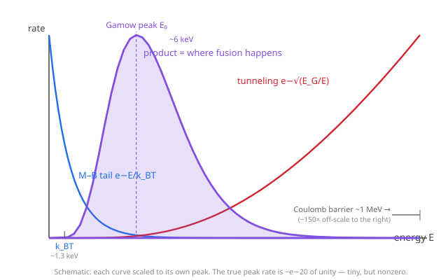

# Astrophysics · Lesson 2.3: Nuclear energy generation

> ⏱ ~15 min · Module 2: Stellar structure · Builds on: [2.2 Energy transport and opacity](#/lesson/astrophysics/02-02-energy-transport-opacity.md), [2.1 The equations of stellar structure](#/lesson/astrophysics/02-01-equations-stellar-structure.md), and quantum tunneling from [QM 2.5 Scattering, barriers, and tunneling](#/lesson/quantum-mechanics/02-05-scattering-barriers-tunneling.md) · Unlocks: 2.5 main-sequence lifetimes, 3.3 nucleosynthesis

## Why this matters

A star is a slow bomb held together by its own weight. Lesson 2.1 gave you the equations that keep it from collapsing or exploding; lesson 2.2 moved the heat from core to surface. But all of that assumes there *is* a heat source in the core — one steady enough to keep the Sun shining at a nearly constant $3.8\times10^{26}\ \mathrm{W}$ for billions of years. Chemistry can't do it (burning the whole Sun as coal would last ~5000 years), and gravitational contraction gives only ~30 million years (Kelvin and Helmholtz's embarrassing 19th-century answer, contradicted by geology). The real furnace is **nuclear fusion** — and the astonishing part is that by every classical estimate, *it shouldn't work at all*. The resolution is a piece of quantum mechanics reaching up from the subatomic scale to set the lifetime of a star. This is the lesson where the whole curriculum touches at once.

## The idea

Fuse four hydrogen nuclei (protons) into one helium-4 nucleus and the product weighs slightly *less* than the ingredients — about 0.7% less. That missing mass reappears as energy, $\Delta E = \Delta m\,c^2$, and $c^2$ is an enormous exchange rate: 0.7% of a proton's rest mass is millions of electron-volts. That is where sunlight comes from.

But there's a wall in the way. Protons are positively charged and repel each other fiercely; to fuse, two of them must be brought within ~$10^{-15}\ \mathrm{m}$, where the short-range strong force can grab. The electrostatic repulsion they must climb — the **Coulomb barrier** — is of order an MeV. Meanwhile the Sun's core, at $1.5\times10^7\ \mathrm{K}$, gives each proton a thermal energy of only ~1 keV — a *thousand times* too little. Classically, the protons bounce off the wall every time and fusion never happens. The Sun should be dark.

Quantum mechanics rescues it: a proton doesn't have to go *over* the barrier, it can **tunnel through** it (exactly the effect from QM 2.5). The probability is tiny and falls exponentially with the barrier, but it is not zero. Two competing exponentials then decide everything — the shrinking number of protons fast enough (the Maxwell–Boltzmann tail, falling with energy) times the growing chance of tunneling (rising with energy). Their product is sharply peaked in a narrow energy window, the **Gamow peak**, and essentially all fusion happens there. Because that window sits far out on a steep exponential tail, the fusion rate is savagely sensitive to temperature — which, as we'll see, is what makes the Sun a stable thermostat and massive stars blazingly bright.

## The formal version

**Mass defect and the energy yield.** Four protons build one $^{4}\mathrm{He}$ nucleus. Using atomic masses ($m(^{1}\mathrm{H}) = 1.007825\,\mathrm{u}$, $m(^{4}\mathrm{He}) = 4.002602\,\mathrm{u}$, $1\,\mathrm{u}\,c^2 = 931.49\ \mathrm{MeV}$):

$$\Delta m = 4m(^{1}\mathrm{H}) - m(^{4}\mathrm{He}) = 0.02870\,\mathrm{u}, \qquad \Delta E = \Delta m\,c^2 \approx 26.7\ \mathrm{MeV}.$$

*In words:* each helium nucleus forged releases about 26.7 MeV — roughly 0.7% of the four protons' rest energy. (About 0.6 MeV of it leaves as neutrinos and never heats the star.)

**The Coulomb barrier.** Two protons separated by $r$ feel a repulsive potential

$$U_C(r) = \frac{e^2}{4\pi\epsilon_0 r} = \frac{1.44\ \mathrm{MeV\,fm}}{r/\mathrm{fm}}.$$

*In words:* to reach fusing distance $r\approx 1\ \mathrm{fm}$ costs ~1 MeV, while $k_B T \approx 1.3\ \mathrm{keV}$ in the core — a mismatch of ~$10^3$. Even the fraction of protons out on the Maxwell tail with $E > 1\ \mathrm{MeV}$ is $\sim e^{-1000}$: nil. Classical fusion is impossible.

**Tunneling — the Gamow factor.** The chance of penetrating the Coulomb barrier (the smooth-barrier WKB limit of QM 2.5's $e^{-2\kappa a}$) is

$$P(E) \propto \exp\!\left(-\sqrt{E_G/E}\right), \qquad E_G = 2\mu c^2(\pi\alpha Z_1 Z_2)^2 \approx 0.49\ \mathrm{MeV},$$

with $\mu = m_p/2$ the reduced mass, $\alpha = 1/137$ the fine-structure constant, $Z_1=Z_2=1$ for two protons. *In words:* tunneling probability climbs steeply with energy — faster protons see a thinner wall.

**The Gamow peak.** The fusion rate integrates the number of protons at energy $E$ against their tunneling chance:

$$\text{rate} \propto \int_0^\infty \underbrace{e^{-E/k_B T}}_{\text{M–B tail, falls}}\;\underbrace{e^{-\sqrt{E_G/E}}}_{\text{tunneling, rises}}\,dE.$$

The integrand is sharply peaked at

$$E_0 = \left(\tfrac{1}{2}\,k_B T\,\sqrt{E_G}\right)^{2/3} \approx 6\ \mathrm{keV} \quad(\text{Sun}),$$

a few times $k_B T$ but still ~150× below the barrier top. *In words:* almost all fusion happens in a narrow window a bit above the typical thermal energy — hot enough to tunnel decently, common enough to matter.

**Temperature sensitivity.** Because $E_0$ sits on a steep exponential tail, the rate obeys a stiff power law,

$$\varepsilon \propto \rho\, T^{\,n}, \qquad n \approx \frac{\tau - 2}{3}, \quad \tau = \frac{3E_0}{k_B T},$$

where $\varepsilon$ is the energy generated per kilogram per second and $\rho$ the density. *In words:* for the Sun's proton–proton reaction $n\approx 4$; for the carbon-catalyzed CNO cycle, which faces a $Z=6$ nucleus and a much higher barrier, $n\approx 17$–20.

**The two burning modes.**

*The pp-chain* (dominant in the Sun and cooler stars):

$$p + p \to {}^{2}\mathrm{H} + e^{+} + \nu_e \qquad(\text{slow, weak interaction})$$
$$ {}^{2}\mathrm{H} + p \to {}^{3}\mathrm{He} + \gamma \qquad(\text{fast})$$
$$ {}^{3}\mathrm{He} + {}^{3}\mathrm{He} \to {}^{4}\mathrm{He} + 2p$$

The first step is the bottleneck: it needs two protons to tunnel together *and*, during that fleeting contact, one to convert to a neutron via the **weak interaction** ($p\to n + e^{+}+\nu_e$) — a doubly rare event. A given proton in the Sun's core waits billions of years to take this step.

*The CNO cycle* (dominant in hotter, more massive stars, above ~$1.7\times10^7\ \mathrm{K}$): carbon, nitrogen, and oxygen act as **catalysts**, capturing four protons one at a time and spitting out a $^{4}\mathrm{He}$, with the carbon returned unchanged at the end. Net result identical ($4p \to {}^{4}\mathrm{He}$), but no slow weak-interaction first step throttles it — so once a star is hot enough, CNO runs away with the steep $T^{17}$ dependence.

**Neutrinos as core probes.** Every pp or CNO cycle emits neutrinos. They barely interact, so they stream straight out of the core and reach Earth in ~8 minutes — a *live* readout of fusion happening now, whereas the photons take tens of thousands of years to random-walk out. (The 1960s–2000s solar-neutrino deficit turned out to be neutrino oscillation, proving neutrinos have mass.)

## Picture

The blue curve is the fraction of protons with energy $E$ (falling exponentially), the red curve is the tunneling probability (rising with $E$), and their product — the purple Gamow peak — is a narrow bump wedged between the typical thermal energy $k_B T$ and the far-off ~1 MeV barrier. Fusion is confined almost entirely to that sliver of energy.

## Worked examples

**Example 1 (mechanical — the energy budget).** How much energy does the Sun get per kilogram of hydrogen fused? Each $^{4}\mathrm{He}$ releases $26.7\ \mathrm{MeV} = 4.28\times10^{-12}\ \mathrm{J}$ from four protons, i.e. per proton $1.07\times10^{-12}\ \mathrm{J}$. A kilogram of protons is $N = 1/m_p = 1/(1.673\times10^{-27}) = 5.98\times10^{26}$ of them, so

$$\frac{E}{\text{kg H}} = 5.98\times10^{26}\times1.07\times10^{-12} \approx 6.4\times10^{14}\ \mathrm{J/kg}.$$

For comparison, chemical burning yields ~$10^{7}\ \mathrm{J/kg}$ — fusion is ~ten million times more energetic per kilogram. That factor is exactly the ratio of nuclear ($\sim$MeV) to chemical ($\sim$eV) binding energies.

**Example 2 (why you'd care — the classical catastrophe).** Take a proton with the *mean* thermal energy at the core, $E \approx k_B T \approx 1.3\ \mathrm{keV}$, and ask how close it can coast to another proton before the Coulomb repulsion stops it (its classical turning point, where $U_C = E$):

$$r_{\text{class}} = \frac{1.44\ \mathrm{MeV\,fm}}{1.3\times10^{-3}\ \mathrm{MeV}} \approx 1100\ \mathrm{fm}.$$

It halts about *a thousand times farther out* than the ~1 fm it needs to reach for fusion. Classically the protons never touch. The only way across that last thousand femtometers is to tunnel — and the exponential smallness of that tunneling, combined with the rarity of the weak step, is precisely why the Sun sips its fuel over ten billion years instead of detonating.

## Watch out

- You might think a hotter core simply means a "little" more fusion. No — with $\varepsilon\propto T^4$ (pp) or $T^{17}$ (CNO), temperature is a hair-trigger. A CNO core that is 10% hotter burns ~5× faster; this stiffness is *the* reason stars are stable (see P3) and why massive-star cores are convective.
- You might think fusion happens at the *average* thermal energy. It happens at the Gamow peak, $E_0\approx 6\ \mathrm{keV}$ — several times higher — because the fastest few protons dominate: they tunnel so much more easily that they win despite being rare.
- You might blur "the barrier is ~1 MeV" with "you need 1 MeV of thermal energy." You don't — tunneling lets ~keV protons through a ~MeV wall. The barrier sets the *difficulty* (and the steep $T$-dependence), not a thermal threshold.
- Don't forget the weak interaction. Tunneling alone would let protons stick, but $p+p$ can only make deuterium if one proton also beta-converts to a neutron mid-collision. It's the slowness of *this* step, not tunneling, that fixes the Sun's ~10 Gyr life. Two independent rarities, multiplied.

## One-liner

> The Sun shines because protons tunnel through a wall a thousand times too tall — and it shines *slowly*, for eons, because that tunnel and a weak-force decay must both happen at once: a stellar lifetime is a quantum accident.

## Problems

**P1 (🟢)** (a) From the masses in "The formal version," confirm that fusing four protons to $^{4}\mathrm{He}$ releases ~26.7 MeV and that this is ~0.7% of the rest energy. (b) Given $L_\odot = 3.83\times10^{26}\ \mathrm{W}$, estimate how many kilograms of hydrogen the Sun fuses per second. (Use the ~$6.4\times10^{14}\ \mathrm{J/kg}$ from Example 1, or work it out fresh.)

**P2 (🟡)** Show quantitatively that classical fusion is hopeless. (a) Compute the Coulomb barrier for two protons at $r = 1\ \mathrm{fm}$. (b) Compute $k_B T$ at the solar center, $T = 1.5\times10^7\ \mathrm{K}$ ($k_B = 8.62\times10^{-5}\ \mathrm{eV/K}$). (c) Form the ratio, and state what it implies about the fraction of protons that could fuse *without* tunneling.

**P3 (🔴, optional)** The temperature sensitivity as a thermostat. (a) For pp burning, $\varepsilon\propto T^4$: if the core temperature rises by 1%, by what percentage does the energy generation rate rise? Explain the negative-feedback loop (fusion → pressure → expansion → cooling) that makes this *stabilizing*, and why a modest exponent $n$ keeps the Sun's luminosity steady for gigayears. (b) For CNO burning, $\varepsilon\propto T^{17}$: repeat the 1% estimate, then show that a core just 1.5× hotter (as in a massive star) generates ~$10^3$× more energy per kilogram. Use this to explain in one sentence why massive stars are so much more luminous — and shorter-lived — than the Sun.

Solutions

**P1** (a) $\Delta m = 4(1.007825) - 4.002602 = 4.031300 - 4.002602 = 0.028698\ \mathrm{u}$. Then $\Delta E = 0.028698\times931.49 = 26.73\ \mathrm{MeV}$. The four-proton rest energy is $4.031300\times931.49 = 3755\ \mathrm{MeV}$, so the fraction converted is $26.73/3755 = 0.712\%$. ✓

(b) The Sun needs $L_\odot/(\text{energy per kg}) = (3.83\times10^{26}\ \mathrm{W})/(6.4\times10^{14}\ \mathrm{J/kg}) = 6.0\times10^{11}\ \mathrm{kg/s}$ of hydrogen — about 600 million tonnes per second.

Cross-check via pure mass-energy: the Sun radiates $L_\odot/c^2 = 3.83\times10^{26}/9\times10^{16} = 4.3\times10^9\ \mathrm{kg/s}$ of mass outright; since only 0.7% of the hydrogen mass converts, the hydrogen processed is $4.3\times10^9/0.007 = 6.1\times10^{11}\ \mathrm{kg/s}$. ✓ (Aside: over 10 Gyr $\approx 3\times10^{17}\ \mathrm{s}$ that is $\sim2\times10^{29}\ \mathrm{kg}\approx 0.1\,M_\odot$ — only the core's hydrogen, consistent with a ~10 Gyr main-sequence life.)

**P2** (a) $U_C = \dfrac{1.44\ \mathrm{MeV\,fm}}{1\ \mathrm{fm}} = 1.44\ \mathrm{MeV} = 1.44\times10^6\ \mathrm{eV}$.

(b) $k_B T = (8.62\times10^{-5}\ \mathrm{eV/K})(1.5\times10^7\ \mathrm{K}) = 1.29\times10^3\ \mathrm{eV} \approx 1.3\ \mathrm{keV}$.

(c) Ratio $= \dfrac{1.44\times10^6}{1.29\times10^3} \approx 1.1\times10^3$ — the barrier is about a thousand times the thermal energy. The Maxwell–Boltzmann fraction of protons with $E > U_C$ goes as $e^{-U_C/k_BT} = e^{-1100} \sim 10^{-480}$: even multiplied by the $\sim10^{57}$ protons in the whole Sun, that is a vanishing number. Without tunneling, not a single fusion would ever occur. Tunneling is not a correction here — it is the entire reason the Sun exists.

**P3** (a) Let $T\to T(1+x)$ with $x = 0.01$. Then $\varepsilon\to\varepsilon(1+x)^4\approx\varepsilon(1+4x)$, a $4\times1\% = 4\%$ rise. The feedback: a core that overheats slightly generates more nuclear power, raising the pressure; the extra pressure pushes the core to *expand*, and expansion against gravity does work and lowers the temperature — pulling $T$ back down. It is a self-correcting thermostat. Because $n=4$ is only moderate, the correction is gentle and stable rather than explosive: doubling the luminosity would require $T$ up by $2^{1/4}=1.19$, i.e. 19%, which the star strongly resists. Result: the Sun holds a nearly constant luminosity for ~10 Gyr.

(b) With $n=17$: $(1.01)^{17}\approx 1+17(0.01) = 1.17$, a 17% rise from the same 1% temperature bump — far touchier. For a 1.5× hotter core, $\varepsilon$ scales by $1.5^{17} = e^{17\ln 1.5} = e^{6.89}\approx 9.8\times10^2\approx 10^3$. So a massive star, with its hotter CNO-burning core, produces on the order of a thousand times more energy per kilogram *and* has far more mass to burn — which is why massive stars are enormously more luminous (the steep mass–luminosity relation $L\propto M^{\sim3.5}$) and, burning their fuel so profligately, live only millions of years instead of billions. (The same steep $T^{17}$ also makes CNO cores convective, since only convection can carry such a concentrated energy flux — a link back to [2.2](#/lesson/astrophysics/02-02-energy-transport-opacity.md)'s Schwarzschild criterion.)

## Flashback

**From Lesson 1.4 (Gravitational dynamics and the virial theorem):** The virial theorem gives a self-gravitating gas a characteristic thermal energy per particle of order its gravitational energy per particle, $k_B T_c \sim \dfrac{G M m_p}{R}$. Estimate the Sun's central temperature from $M_\odot = 2.0\times10^{30}\ \mathrm{kg}$, $R_\odot = 7.0\times10^{8}\ \mathrm{m}$, and comment on whether it clears the Coulomb barrier this lesson introduced.

Solution

$$T_c \sim \frac{G M_\odot m_p}{R_\odot k_B} = \frac{(6.67\times10^{-11})(2.0\times10^{30})(1.67\times10^{-27})}{(7.0\times10^{8})(1.38\times10^{-23})} \approx 2\times10^{7}\ \mathrm{K},$$

the right order of magnitude (the true central value is $\sim1.5\times10^7\ \mathrm{K}$; the virial estimate uses the mean, so it runs a bit high). At $T_c\sim10^7\ \mathrm{K}$, $k_B T_c\sim 1\ \mathrm{keV}$ — a thousand times *below* the ~1 MeV Coulomb barrier. So gravity alone heats the core to nowhere near the classical fusion threshold: the star is hot enough to shine only because tunneling lowers the bar by three orders of magnitude. The virial theorem sets the temperature; quantum mechanics decides that temperature is enough.

## Connections

- **Backward:** the energy generation rate $\varepsilon$ computed here is the source term in [2.1](#/lesson/astrophysics/02-01-equations-stellar-structure.md)'s luminosity equation $dL/dr = 4\pi r^2\rho\,\varepsilon$, and its concentration in the hot core (via the steep $T$-dependence) is what forces the convective cores of [2.2](#/lesson/astrophysics/02-02-energy-transport-opacity.md). The virial temperature from [1.4](#/lesson/astrophysics/01-04-gravitational-dynamics-virial.md) is what makes fusion barely possible.
- **Forward:** the fuel budget of P1 sets main-sequence *lifetimes* in [2.5](#/lesson/astrophysics/02-05-main-sequence.md) ($t \sim 0.007\,M c^2/L$), and burning past hydrogen — helium, carbon, up to iron — is the story of [3.3 nucleosynthesis](#/lesson/astrophysics/03-03-nucleosynthesis-elements.md). The $T^{17}$ CNO stiffness reappears in the runaway that drives some [supernovae (3.4)](#/lesson/astrophysics/03-04-stellar-death-supernovae.md).
- **Sideways (quantum mechanics):** the Gamow factor $e^{-\sqrt{E_G/E}}$ is the smooth-Coulomb WKB limit of the rectangular-barrier tunneling $e^{-2\kappa a}$ from [QM 2.5](#/lesson/quantum-mechanics/02-05-scattering-barriers-tunneling.md) — the *same* calculation that governs alpha decay (Gamow, 1928), run in reverse for fusion. The Maxwell–Boltzmann tail multiplying it is the classical-limit distribution from `stat-mech`; the weak-interaction $p\to n$ step is the same force behind beta decay. Three subjects meet in one reaction.
