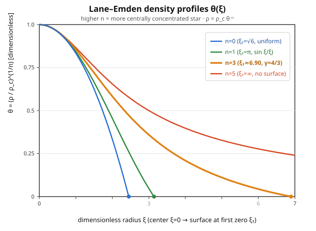

# Astrophysics · Lesson 2.4: Polytropes and the Lane–Emden equation

> ⏱ ~15 min · Module 2: Stellar structure · Builds on: [2.1 The equations of stellar structure](#/lesson/astrophysics/02-01-equations-stellar-structure.md), [2.3 Nuclear energy generation](#/lesson/astrophysics/02-03-nuclear-energy-generation.md) · Unlocks: [2.5 The main sequence](#/lesson/astrophysics/02-05-main-sequence.md), [4.1 White dwarfs & the Chandrasekhar mass](#/lesson/astrophysics/04-01-white-dwarfs-chandrasekhar.md)

## Why this matters

A real star is a coupled tangle: pressure depends on temperature, temperature depends on how energy is generated and transported, opacity depends on both — four differential equations that only surrender to a computer. But there's a cheat that turns a star into a single, solvable ODE. **Guess the relationship between pressure and density directly** — skip temperature entirely — and the mechanical skeleton of the star (what holds it up against gravity) detaches from the thermal machinery (what makes it shine). What's left is one clean equation, the **Lane–Emden equation**, whose solutions describe fully convective stars, brown dwarfs, and — crucially — the degenerate matter inside white dwarfs. It's the shortest honest path from "hydrostatic equilibrium" to a mass–radius relation, and it hands you the seed of the Chandrasekhar mass almost for free.

## The idea

A star holds itself up because pressure rises toward the center fast enough to support the weight of everything above — that's **hydrostatic equilibrium** from [2.1](#/lesson/astrophysics/02-01-equations-stellar-structure.md). Normally pressure comes from the ideal-gas law, $P = \rho k_B T / (\mu m_H)$, which drags temperature into everything. The polytrope trick is to *assume the answer's shape*: postulate that pressure is a fixed power of density,

$$P = K\rho^{\gamma}, \qquad \gamma = \frac{n+1}{n},$$

with $K$ a constant and $n$ a chosen "polytropic index." Temperature never appears. Why is this legitimate and not just wishful? Because nature *does* hand you such relations in important cases: a degenerate electron gas has $P \propto \rho^{5/3}$ (non-relativistic) or $\rho^{4/3}$ (ultra-relativistic) with $K$ fixed by fundamental constants, and a fully convective star is stirred so thoroughly that its interior follows the adiabat $P \propto \rho^{5/3}$. In each case the equation of state is genuinely a pure power of density, so the polytrope isn't an approximation — it's exact.

Once $P$ is tied to $\rho$ alone, hydrostatic equilibrium plus the gravity of the star's own mass close into **one** equation for the density profile. Solve it once, in dimensionless form, and you've solved *every* polytrope of that index at once — just rescale.

## The formal version

Start from the two mechanical equations (2.1): hydrostatic equilibrium and mass continuity,

$$\frac{dP}{dr} = -\frac{G\,m(r)\,\rho}{r^2}, \qquad \frac{dm}{dr} = 4\pi r^2 \rho.$$

Here $r$ is radius, $m(r)$ the mass enclosed, $\rho$ the density, $G$ Newton's constant. Multiply the first by $r^2/\rho$, differentiate, and use the second to eliminate $m(r)$ — this is just Poisson's equation for self-gravity in disguise:

$$\frac{1}{r^2}\frac{d}{dr}\!\left(\frac{r^2}{\rho}\frac{dP}{dr}\right) = -4\pi G \rho.$$

*In words: the curvature of the gravitational potential at each radius is set by the local density.* Now insert the polytrope $P = K\rho^{1+1/n}$ and write the density as a central value times a dimensionless profile,

$$\rho = \rho_c\,\theta^{\,n}, \qquad \theta(0) = 1,$$

so $\theta$ runs from $1$ at the center to $0$ at the surface and $\rho_c$ is the central density. A short calculation (the $\theta^n$ factors cancel cleanly) collapses everything to

$$\boxed{\;\frac{1}{\xi^2}\frac{d}{d\xi}\!\left(\xi^2 \frac{d\theta}{d\xi}\right) = -\theta^{\,n}\;}$$

the **Lane–Emden equation**, where the physical radius is $r = \alpha\xi$ with the length scale

$$\alpha^2 = \frac{(n+1)K\,\rho_c^{\,(1-n)/n}}{4\pi G}.$$

*In words: strip out the units and every polytrope of index $n$ obeys the same universal shape equation; $\alpha$ is the only thing that remembers which physical star you meant.* The **boundary conditions** are

$$\theta(0) = 1 \quad(\text{central density } \rho_c), \qquad \theta'(0) = 0 \quad(\text{no kink at the center, by symmetry}),$$

and the **surface** is the first zero $\theta(\xi_1)=0$ (density vanishes), giving the stellar radius $R = \alpha\,\xi_1$.

**Three exact solutions.** For special $n$ the equation is elementary:

| $n$ | $\gamma=\frac{n+1}{n}$ | $\theta(\xi)$ | surface $\xi_1$ |
|---|---|---|---|
| $0$ | $\infty$ | $1 - \xi^2/6$ | $\sqrt{6}\approx 2.449$ |
| $1$ | $2$ | $\sin\xi/\xi$ | $\pi$ |
| $5$ | $6/5$ | $(1+\xi^2/3)^{-1/2}$ | $\infty$ |

$n=0$ is a constant-density ball; $n=5$ is the pathological case whose density tail is so shallow the star has *infinite* radius (finite mass, though). Everything physical lives between them, and must be integrated numerically.

**The two indices that matter.**
- **$n=3/2$ ($\gamma = 5/3$):** a non-relativistic degenerate electron/neutron gas, *and* a fully convective star (both follow the $5/3$ adiabat). This is the white-dwarf and brown-dwarf regime, and the envelopes of cool low-mass stars.
- **$n=3$ ($\gamma = 4/3$):** the **Eddington standard model** (radiation pressure mixed with gas in fixed proportion) *and* an ultra-relativistic degenerate gas. As we'll see, this index is special — its mass doesn't depend on radius at all, which is exactly the knife-edge that produces the Chandrasekhar mass in [4.1](#/lesson/astrophysics/04-01-white-dwarfs-chandrasekhar.md).

**The mass–radius relation.** The mass follows by integrating $dm = 4\pi r^2\rho\,dr$; the Lane–Emden equation makes the integrand a perfect derivative, giving

$$M = 4\pi\alpha^3\rho_c\big(-\xi_1^2\,\theta'(\xi_1)\big).$$

Since $\alpha \propto \rho_c^{(1-n)/(2n)}$, the central density scales out into

$$R \propto \rho_c^{\,(1-n)/(2n)}, \qquad M \propto \rho_c^{\,(3-n)/(2n)}.$$

Eliminate $\rho_c$ between them and you get the headline result:

$$\boxed{\;R \propto M^{\,(1-n)/(3-n)}\;}$$

*In words: for a given equation of state, fixing the mass fixes the radius — the star has no freedom left.* For $n=3/2$ this is $R\propto M^{-1/3}$: **more massive white dwarfs are smaller** (Problem 2). And for $n=3$ the exponent's denominator $3-n$ vanishes: $M$ becomes *independent* of radius and central density — the mass is pinned by $K$ alone (Problem 3). That single algebraic fact is the Chandrasekhar mass waiting to happen.

## Picture

The curves are $\theta(\xi)$, and the surface of each star is where its curve hits zero (the dot). Reading concentration takes one extra step: the *density* is $\rho = \rho_c\,\theta^n$, so raising $\theta<1$ to a high power crushes the outer layers — the $n=3$ star carries almost all its mass in a tiny core and trails a vast, wispy envelope out to $\xi_1\approx 6.9$, while the $n=0$ ball has uniform density out to $\sqrt 6$. Higher index $\Rightarrow$ more centrally concentrated. The $n=5$ curve (red) never reaches zero — its "surface" is at infinity.

## Worked examples

**Example 1 (mechanical — verify the $n=0$ solution).** Claim: $\theta = 1-\xi^2/6$ solves Lane–Emden for $n=0$. With $n=0$ the right side is $-\theta^0 = -1$. Left side: $\theta' = -\xi/3$, so $\xi^2\theta' = -\xi^3/3$, and $\frac{d}{d\xi}(\xi^2\theta') = -\xi^2$. Divide by $\xi^2$: $-1$. Both sides equal $-1$. ✓ The surface is where $\theta=0$: $1-\xi^2/6=0 \Rightarrow \xi_1=\sqrt 6$. Check the BCs: $\theta(0)=1$ ✓ and $\theta'(0)=0$ ✓. A constant-density star is a parabola in $\xi$.

**Example 2 (why you'd care — reading off central concentration).** How much denser is the center than the average? The ratio $\rho_c/\bar\rho$ is a pure number that depends only on $n$. Since $\bar\rho = M/(\tfrac43\pi R^3)$ and $M = 4\pi\alpha^3\rho_c(-\xi_1^2\theta_1')$ with $R=\alpha\xi_1$,

$$\frac{\rho_c}{\bar\rho} = \frac{\rho_c}{M/(\tfrac43\pi R^3)} = \frac{\tfrac43\pi \alpha^3\xi_1^3\,\rho_c}{4\pi\alpha^3\rho_c(-\xi_1^2\theta_1')} = \frac{\xi_1}{3\,(-\theta'(\xi_1))}.$$

For $n=1$: $\theta=\sin\xi/\xi$ gives $\theta'(\pi) = -1/\pi$, so $\rho_c/\bar\rho = \pi/(3\cdot 1/\pi) = \pi^2/3 \approx 3.3$. For $n=3$ (numerically $\xi_1=6.897$, $-\xi_1^2\theta_1' = 2.018$, so $-\theta_1'=2.018/6.897^2=0.0424$): $\rho_c/\bar\rho = 6.897/(3\cdot 0.0424) \approx 54$. The Sun's real central-to-mean density ratio is about $100$ — an $n=3$ polytrope (the Eddington model) already lands the right order of magnitude, which is why it was the workhorse stellar model for decades.

## Watch out

- **You might think a bigger $n$ makes a puffier, less concentrated star because its $\theta$ curve is flatter.** It's the opposite: density is $\theta^n$, not $\theta$, and the exponent wins — high $n$ means a sharp central spike and a diffuse halo. Never read concentration off the $\theta$ plot without cubing... er, $n$-th-powering it first.
- **You might think $\theta$ is the density.** It's the density's $1/n$-th root: $\rho=\rho_c\theta^n$, $P=K\rho_c^{1+1/n}\theta^{n+1}$, and (for an ideal gas) $T\propto\theta$. One profile $\theta(\xi)$, three physical fields.
- **You might think $\gamma=1+1/n$ is a physical law of the gas.** It's a *labeling convention*. Whether a real star actually follows $P\propto\rho^\gamma$ is a separate physical claim — true for degenerate matter and adiabatic convection, false in general. Choosing $n$ is choosing which physics you're modeling.
- **The $n=3$ mass being radius-independent is not a bug.** It signals that at $\gamma=4/3$ gravity and pressure scale with size in *lockstep* — there's no stable equilibrium radius, only a critical mass. Foreshadowing, not paradox.

## One-liner

> Assume $P=K\rho^{1+1/n}$ and a whole star collapses to one dimensionless ODE, $(\xi^2\theta')'/\xi^2=-\theta^n$, whose mass–radius law $R\propto M^{(1-n)/(3-n)}$ goes singular at $n=3$ — the birthplace of the Chandrasekhar mass.

## Problems

**P1 (🟢)** Verify by direct substitution that $\theta(\xi)=\dfrac{\sin\xi}{\xi}$ solves the Lane–Emden equation for $n=1$, check that it satisfies both boundary conditions, and show the surface is at $\xi_1=\pi$.

**P2 (🟡)** From the scalings $M\propto\rho_c^{(3-n)/(2n)}$ and $R\propto\rho_c^{(1-n)/(2n)}$, eliminate $\rho_c$ to derive the mass–radius relation $R\propto M^{(1-n)/(3-n)}$. Then evaluate the exponent for $n=3/2$ and state, in one sentence, what it says about a family of white dwarfs of different masses.

**P3 (🔴, optional)** For $n=3$ ($\gamma=4/3$, $P=K\rho^{4/3}$), start from $M = 4\pi\alpha^3\rho_c\,(-\xi_1^2\theta'(\xi_1))$ and the definition of $\alpha$, and show that the central density $\rho_c$ **cancels completely** — so the mass is fixed by $K$ alone, independent of the star's radius. Write down the resulting expression for $M$. (This is the algebraic skeleton of the Chandrasekhar mass; [4.1](#/lesson/astrophysics/04-01-white-dwarfs-chandrasekhar.md) supplies the $K$ of an ultra-relativistic electron gas to turn it into $\approx 1.4\,M_\odot$.)

Solutions

**P1** With $n=1$ the right-hand side is $-\theta^1 = -\theta$. Compute the left side for $\theta=\sin\xi/\xi$. First,

$$\theta' = \frac{\xi\cos\xi - \sin\xi}{\xi^2} = \frac{\cos\xi}{\xi} - \frac{\sin\xi}{\xi^2}, \qquad \xi^2\theta' = \xi\cos\xi - \sin\xi.$$

Differentiate: $\dfrac{d}{d\xi}(\xi^2\theta') = \cos\xi - \xi\sin\xi - \cos\xi = -\xi\sin\xi.$ Divide by $\xi^2$:

$$\frac{1}{\xi^2}\frac{d}{d\xi}(\xi^2\theta') = \frac{-\xi\sin\xi}{\xi^2} = -\frac{\sin\xi}{\xi} = -\theta. \;\checkmark$$

Boundary conditions: $\theta(0)=\lim_{\xi\to0}\sin\xi/\xi = 1$ ✓. For $\theta'(0)$, expand $\sin\xi \approx \xi - \xi^3/6$, so $\theta \approx 1 - \xi^2/6$ and $\theta'\approx -\xi/3 \to 0$ as $\xi\to0$ ✓. Surface: $\theta=0$ requires $\sin\xi=0$ (with $\xi\neq0$), whose first root is $\xi_1=\pi$. ✓

**P2** Write the two scalings as $M = A\,\rho_c^{(3-n)/(2n)}$ and $R = B\,\rho_c^{(1-n)/(2n)}$ for constants $A,B$. Solve the second for the central density: $\rho_c \propto R^{\,2n/(1-n)}$. Substitute into the first:

$$M \propto \left(R^{\,2n/(1-n)}\right)^{(3-n)/(2n)} = R^{\,(3-n)/(1-n)} \quad\Longrightarrow\quad R \propto M^{\,(1-n)/(3-n)}.$$

For $n=3/2$: $\dfrac{1-n}{3-n} = \dfrac{1-\tfrac32}{3-\tfrac32} = \dfrac{-1/2}{3/2} = -\dfrac13$, so $R\propto M^{-1/3}$. **In words:** among non-relativistic-degenerate white dwarfs, *more massive means smaller* — piling on mass compresses the star rather than swelling it, the exact inverse of everyday intuition about size and weight.

**P3** For $n=3$ the length scale is $\alpha^2 = \dfrac{(n+1)K\rho_c^{(1-n)/n}}{4\pi G} = \dfrac{4K\rho_c^{-2/3}}{4\pi G} = \dfrac{K}{\pi G}\,\rho_c^{-2/3}$, so

$$\alpha^3 = \left(\frac{K}{\pi G}\right)^{3/2}\rho_c^{-1}.$$

Plug into the mass:

$$M = 4\pi\alpha^3\rho_c\,(-\xi_1^2\theta_1') = 4\pi\left(\frac{K}{\pi G}\right)^{3/2}\rho_c^{-1}\cdot\rho_c\cdot(-\xi_1^2\theta_1') = 4\pi\,(-\xi_1^2\theta_1')\left(\frac{K}{\pi G}\right)^{3/2}.$$

The $\rho_c^{-1}\cdot\rho_c = 1$ — **the central density cancels exactly**, and with it any dependence on radius ($R=\alpha\xi_1$ still depends on $\rho_c$, but $M$ no longer does). Numerically $-\xi_1^2\theta_1' = 2.018$ for $n=3$, so

$$M = 4\pi(2.018)\left(\frac{K}{\pi G}\right)^{3/2} \approx 25.4\left(\frac{K}{\pi G}\right)^{3/2}.$$

A single, radius-independent mass. Physically: at $\gamma=4/3$ the pressure and the weight both scale as (size)$^{-4}$, so they can only balance at one special mass — squeeze harder and gravity keeps pace forever. Supplying the ultra-relativistic degenerate-gas value of $K$ (set by $\hbar$, $c$, and the electron mass) turns this into $M_{\text{Ch}}\approx 1.4\,M_\odot$ in [4.1](#/lesson/astrophysics/04-01-white-dwarfs-chandrasekhar.md).

## Flashback

**From Lesson 2.1 (The equations of stellar structure):** Without solving any ODE, use hydrostatic equilibrium to make an order-of-magnitude estimate of the Sun's *central* pressure. Take $\frac{dP}{dr}\sim -\frac{GM\rho}{R^2}$ with the crude replacements $\rho\sim\bar\rho\sim M/R^3$ and $dP/dr\sim -P_c/R$. Evaluate with $M_\odot = 2.0\times10^{30}$ kg, $R_\odot = 7.0\times10^8$ m, $G=6.7\times10^{-11}$ SI.

Solution

Balancing the two crude estimates of the pressure gradient:

$$\frac{P_c}{R} \sim \frac{GM\rho}{R^2} \sim \frac{GM}{R^2}\cdot\frac{M}{R^3} = \frac{GM^2}{R^5} \quad\Longrightarrow\quad P_c \sim \frac{GM^2}{R^4}.$$

Numerically,

$$P_c \sim \frac{(6.7\times10^{-11})(2.0\times10^{30})^2}{(7.0\times10^8)^4} = \frac{6.7\times10^{-11}\cdot 4.0\times10^{60}}{2.4\times10^{35}} \approx 1\times10^{15}\ \text{Pa}.$$

That's about $10^{10}$ atmospheres. The true solar central pressure is $\approx 2\times10^{16}$ Pa — the estimate is low by $\sim 20\times$, exactly because we used the *mean* density instead of the far-larger central value (an $n=3$ polytrope has $\rho_c/\bar\rho\approx 54$, per Example 2). Order of magnitude nailed, and the polytrope tells you precisely which factor you dropped.

## Connections

- **Backward:** this is [2.1](#/lesson/astrophysics/02-01-equations-stellar-structure.md)'s hydrostatic equilibrium and mass continuity, closed into one solvable ODE by *assuming* the equation of state instead of computing it from [2.3](#/lesson/astrophysics/02-03-nuclear-energy-generation.md)'s thermal physics. The trick is to model the mechanics without the furnace.
- **Forward:** [2.5](#/lesson/astrophysics/02-05-main-sequence.md) uses polytropes to shortcut mass–luminosity scalings; [4.1](#/lesson/astrophysics/04-01-white-dwarfs-chandrasekhar.md) turns the $n=3/2$ and $n=3$ cases into the white-dwarf mass–radius relation and the Chandrasekhar mass (Problem 3 is its opening move).
- **Sideways (stat-mech):** the polytropic exponents aren't guesses — a degenerate Fermi gas *derives* $P\propto\rho^{5/3}$ (non-relativistic) and $P\propto\rho^{4/3}$ (ultra-relativistic) from first principles in [stat-mech 4.4 (the ideal Fermi gas)](#/lesson/stat-mech/04-04-ideal-fermi-gas.md). That course supplies the $K$; this one supplies the stellar structure.
- **Sideways (math):** Lane–Emden is a nonlinear second-order boundary-value problem — the same "shoot from the center, hit zero at the surface" structure as the effective-potential turning-point problems in mechanics, solved by scaling out units to a universal dimensionless form.
